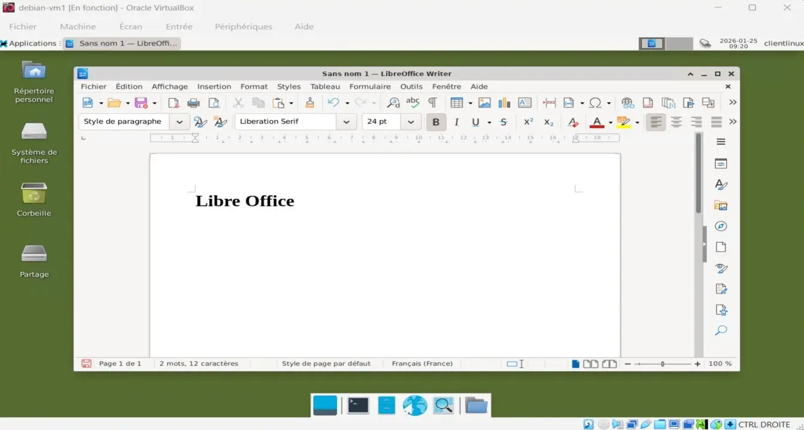
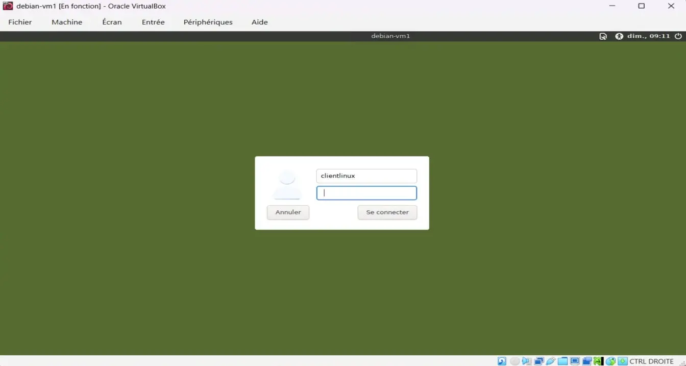
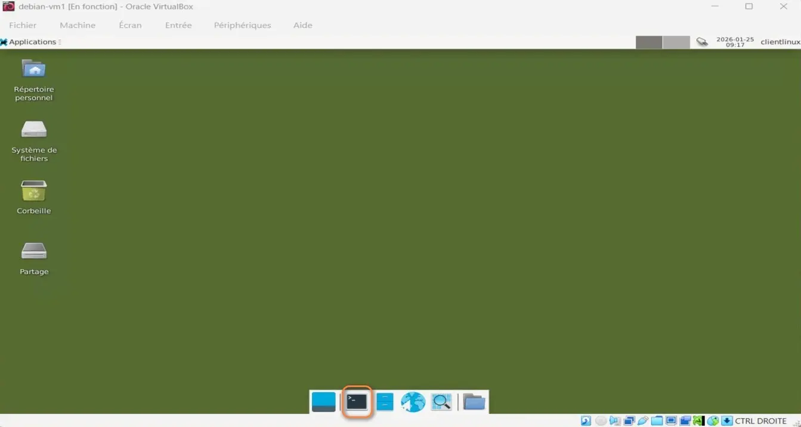
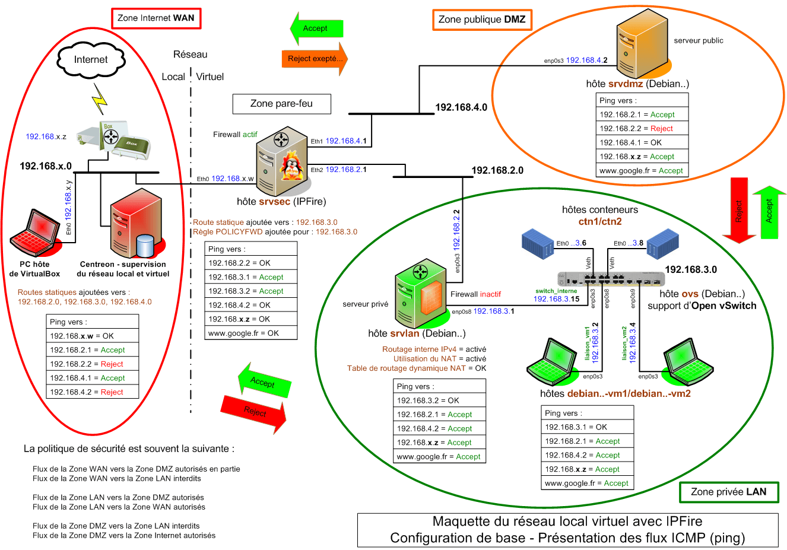

<figure markdown>
  { width="430" }
</figure>

## Mémento 4.1 - Clients vm1 vm2

A présent, vous allez compléter le réseau virtuel avec 2 clients Linux reposant sur Debian.
  
L'environnement graphique proposé sera le même que pour srvlan et srvdmz soit le bureau Xfce.  
  
Le premier client sera cloné pour générer le second dont vous ne modifierez que le nom d'hôte et l'adresse IP.

### Construction de la VM vm1

L'utilisation de VirtualBox est considérée acquise.  
  
A défaut, référez-vous aux mémentos suivants :  
[VirtualBox - Installation](../posts/virtualbox-installation.md){ target="_blank" }

[VirtualBox - Mode d’accès réseau par pont](../posts/virtualbox-pont-reseau.md){ target="_blank" }

#### _- Création et configuration_

Le PC hôte doit être un PC 64 bits, courant de nos jours.  
  
Téléchargez l'ISO debian-z.x.y-amd64\-netinst.iso :  
[https://cdimage.debian.org/.../current/amd64/iso-cd/](https://cdimage.debian.org/debian-cd/current/amd64/iso-cd/){ target="_blank" }

<!-- more -->
  
\- Démarrez ensuite l'application VirtualBox 7.2.x, puis :  
\- - Menu de VirtualBox -> Machine -> Nouvelle...

Selon la version de l'hyperviseur, l'interface est en franglais.  
-> VM Name : debian-vm1  
-> VM Folder : Sélectionnez le dossier de stockage des VM  
-> ISO Image : Sélectionnez l'ISO téléchargée ci-dessus  
-> Décochez : Proceed with Unattended Installation _(important)_  
-> OS : Linux -> OS Distribution : Debian  
-> OS Version : Debian (64-bit)
  
-> Specify virtual hardware  
-> Base Memory : 1024 MB  
-> Number of CPUs : 2 CPU si possible

-> Specify virtual hard disk  
-> Create a Virtual Hard Disk : Ajustez à 12 Go

-> Bouton Finish

La VM créée s'affiche dans le panneau gauche de VirtualBox.

Sélectionnez maintenant la nouvelle VM, puis :  
\- - Clic droit -> Configuration...  
\- - - Onglet Général  
-> Features -> Shared Clipboard -> Bidirectionnel

\- - - Onglet System  
-> Carte mère -> Boot Device Order -> Décochez Disquette  
-> Processeur -> Cochez PAE/NX

\- - - Onglet Affichage  
-> Ecran -> Video Memory -> Ajustez à 128 MB

Facultatif, accès au dossier partagé par le PC hôte :  
\- - - Onglet Shared Folders  
-> Cliquez sur l'icône + _(Ajouter un dossier partagé)_  
-> Folder Path -> Sélectionnez Autre...  
-> Accédez à votre dossier -> Ex : C:\Partage-Windows  
-> Sélectionner un dossier ou Ouvrir -> OK -> OK
  
Les autres paramètres peuvent rester inchangés.

#### _- Installation de Debian_

Conseil pratique avant de démarrer la nouvelle VM :  
Si le curseur de la souris disparaît lors d'un clic dans la fenêtre de la VM, celui-ci peut être récupéré par le PC hôte à l'aide de la touche CTRL située à droite de la barre d'espace du clavier.

\- Sélectionnez la VM, puis :  
-> Clic droit -> Démarrer  
-> Start with GUI _(La VM s'exécute)_
  
Sélectionnez Graphical Install et appliquez ce qui suit :  
\- Language -> Français  
\- Pays (territoire ou région) -> France  
\- Disposition de clavier à utiliser -> Français  
\- Nom de machine -> debian-vm1  
\- Domaine -> Laissez le champ vide  
\- MDP du super utilisateur root -> Votre MDP pour root  
\- Confirmation du MDP -> Votre MDP pour root  
\- Nom complet du nouvel utilisateur -> Ex: clientlinux  
\- Identifiant pour le compte utilisateur -> clientlinux  
\- MDP pour le nouvel utilisateur -> Votre MDP pour clientlinux  
\- Confirmation du MDP -> Votre MDP pour clientlinux  
\- Méthode de partitionnement -> Assisté - utili... entier  
\- Disque à partitionner -> Celui proposé de 12 Go  
\- Schéma de partitionnement -> Tout ... seule partition  
\- Table des partitions -> Terminer le partitionnement ...  
\- Faut-il appliquer les changements … disques ? -> Oui  
  
L'installation commence :  
\- Faut-il analyser d'autres supports ... ? -> Non  
\- Pays du miroir de l'archive Debian -> France  
\- Miroir de l'archive Debian -> deb.debian.org  
\- Mandataire HTTP (lais...) -> Laissez vide  
  
L'installation continue :  
\- Souhaitez-vous participer à l'étude statistique ... -> Non  
\- Logiciels à installer  
-> Décochez environnement de bureau Debian  
-> Décochez ... GNOME  
-> Cochez ... Xfce  
-> Décochez serveur SSH  
-> Conservez utilitaires usuels du système  
  
L'installation se termine :  
\- Installer ... de démarrage GRUB sur le secteur ... -> Oui  
\- Périphérique ... programme de démarrage -> /dev/sda  
\- Installation terminée -> Continuer _(sans retrait du CD)_  
  
Le système reboot et une fenêtre de connexion s'ouvre :

<figure markdown>
  { width="430" }
  <figcaption>Fenêtre de connexion Xfce</figcaption>
</figure>

-> Premier champ -> Entrez l'utilisateur clientlinux  
-> Second champ -> Entrez votre MDP pour clientlinux  
-> Bouton Se connecter  
  
Le bureau Xfce s'ouvre :

<figure markdown>
  { width="430" }
  <figcaption>Bureau Xfce</figcaption>
</figure>

Ouvrez le terminal de Cdes en cliquant sur son icône située en bas à l'intérieur du dock.  
  
Autorisez ensuite l'usage de la Cde sudo à l'utilisateur clientlinux :

```bash
[clientlinux@debian-vm1] su root
Mot de passe : MDP pour root

[root@debian-vm1] sudo usermod -aG sudo clientlinux
[root@debian-vm1] exit
```

et redémarrez la VM :  
\- - Menu Applications de Xfce situé en haut à gauche  
-> Déconnexion _(Une fenêtre s'ouvre)_  
-> Bouton Redémarrer  
  
Reconnectez-vous ensuite en tant qu'utilisateur clientlinux et rouvrez le terminal de Cdes.

#### _- Utilitaires VirtualBox_

Ils permettront entre autres le copier/coller et l'accès au dossier partagé par le PC hôte.

Notez la version courante du noyau linux :

```bash
[clientlinux@debian-vm1] uname -r
```

Exemple de retour :

```markdown
6.12.63+deb13-amd64
```

Installez ensuite les 2 paquets Linux suivants :

```bash
[clientlinux@debian-vm1] sudo apt install dkms build-essential
```

et vérifiez l'installation du paquet linux-headers dépendant de la version du noyau Linux :

```bash
[clientlinux@debian-vm1] sudo apt list *linux-headers-6.12.63*
```

Si non installé, exécutez la Cde suivante :

```bash
[clientlinux@debian-vm1] sudo apt install linux-headers-6.12.63+deb13-amd64
```

Accédez ensuite au menu VirtualBox situé sur la fenêtre de la VM :  
-> Périphériques -> Insérer l'image CD des Additions invvité...  
  
Puis, montez l'image CD, installez les utilitaires et rebootez :

```bash
[clientlinux@debian-vm1] sudo mount /dev/cdrom /media/cdrom
[clientlinux@debian-vm1] cd /media/cdrom/
[clientlinux@debian-vm1] sudo ./VBoxLinuxAdditions.run
[clientlinux@debian-vm1] sudo reboot
```

Reconnectez-vous, la fenêtre de la VM peut à présent être redimensionnée avec la souris. Sa nouvelle taille sera enregistrée au sein de debian-vm1.
  
Le copier/coller entre le PC hôte et debian-vm1 doit maintenant fonctionner dans les 2 sens.  
  
Sans fermer la VM, retirez l'image CD du lecteur virtuel :  
\- - Menu de VirtualBox -> Machine -> Configuration...  
\- - - Onglet Stockage  
-> Zone Périphériques -> Sélectionnez VBoxGuest...  
-> Zone Attributs -> Cliquez sur l'icône CD  
-> Remove Disk From Virtual Drive -> OK

#### _- LibreOffice et Firefox_

Installez si nécessaire les paquets suivants :

```bash
[clientlinux@debian-vm1] sudo apt install libreoffice-l10n-fr
[clientlinux@debian-vm1] sudo apt install libreoffice-help-fr
[clientlinux@debian-vm1] sudo apt install firefox-esr-l10n-fr
```

La configuration de base est presque terminée :

<figure markdown>
  { width="430" }
  <figcaption>Debian : Bureau Xfce personnalisé</figcaption>
</figure>

Pour un même fond d'écran sur la fenêtre de login Lightdm et le bureau Xfce, procédez ainsi :

```bash
[clientlinux@debian-vm1] cd /chemin-image/fond.jpg   # Votre fond d'écran
[clientlinux@debian-vm1] sudo cp fond.jpg /usr/share/backgrounds/
[clientlinux@debian-vm1] cd /etc/lightdm
[clientlinux@debian-vm1] sudo nano lightdm-gtk-greeter.conf
```

Remplacez la ligne #background= par celle-ci :

```markdown
background=/usr/share/backgrounds/fond.jpg
```

#### _- Dossier partagé par l'hôte_

Créez le dossier qui permettra d'afficher le contenu partagé par le PC hôte :

```bash
[clientlinux@debian-vm1] mkdir /home/clientlinux/Partage
```
  
Puis créez le fichier de service home-clientlinux-Partage.mount :

```bash
[clientlinux@debian-vm1] cd /etc/systemd/system
[clientlinux@debian-vm1] sudo touch home-clientlinux-Partage.mount 
```

Editez celui-ci :

```bash
[clientlinux@debian-vm1] sudo nano home-clientlinux-Partage.mount 
```

et entrez le contenu suivant :

```markdown
[Unit]
Description = Montage dossier partagé fourni par VirtualBox

[Mount]
What = Entrez le nom du dossier partagé par le PC hôte
Where = home-clientlinux-Partage
Type = vboxsf
Options=rw,uid=clientlinux,gid=clientlinux

[Install]
WantedBy = multi-user.target
```

Exemple pour What : What = Partage-win11  
  
Intégrez le service dans la configuration de systemd :

```bash
[clientlinux@debian-vm1] sudo systemctl daemon-reload 
```

et démarrez celui-ci :

```bash
[clientlinux@debian-vm1] sudo systemctl start home-clientlinux-Partage.mount 
```

Vérifiez ensuite son statut :

```bash
[clientlinux@debian-vm1] sudo systemctl status home-clientlinux-Partage.mount 
```

Touche q pour quitter le résultat affiché.
  
Si statut = active, autorisez le service au boot de la VM :

```bash
[clientlinux@debian-vm1] sudo systemctl enable home-clientlinux-Partage.mount 
```

Un lien symbolique vers le service est créé.  
  
Pour finir, ouvrez le gestionnaire de fichiers :  
\- - Menu Applications de Xfce situé en haut à gauche  
-> Système -> Gestionnaire de fichiers Thunar  
  
et observez le contenu partagé par le PC hôte dans :  
/home/clientlinux/Partage

#### _- Configuration du réseau_

Avant, vérifiez l'IP courante avec la Cde ip address :

```bash
[clientlinux@debian-vm1] ip address
```

Résultat, IP 10.0.2.15, IP fournie par VirtualBox :

```markdown hl_lines="10"
1: lo: <LOOPBACK,UP,LOWER_UP> mtu 65536 qdisc noqueue state UNKNOWN group default qlen 1000
    link/loopback 00:00:00:00:00:00 brd 00:00:00:00:00:00
    inet 127.0.0.1/8 scope host lo
       valid_lft forever preferred_lft forever
    inet6 ::1/128 scope host noprefixroute 
       valid_lft forever preferred_lft forever
2: enp0s3: <BROADCAST,MULTICAST,UP,LOWER_UP> mtu 1500 qdisc fq_codel state UP group default qlen 1000
    link/ether 08:00:27:a0:d2:05 brd ff:ff:ff:ff:ff:ff
    altname enx080027a0d205
    inet 10.0.2.15/24 brd 10.0.2.255 scope global dynamic noprefixroute enp0s3
       valid_lft 80600sec preferred_lft 80600sec
    inet6 fd17:625c:f037:2:8d4e:22fe:e3ec:cc97/64 scope global temporary dynamic 
       valid_lft 86094sec preferred_lft 14094sec
    inet6 fd17:625c:f037:2:a00:27ff:fea0:d205/64 scope global dynamic mngtmpaddr noprefixroute 
       valid_lft 86094sec preferred_lft 14094sec
    inet6 fe80::a00:27ff:fea0:d205/64 scope link noprefixroute 
       valid_lft forever preferred_lft forever
```

La VM debian-vm1 étant prévue en zone LAN, il faut changer le mode d'accès réseau de sa carte enp0s3.
  
Pour cela, sélectionnez la VM dans VirtualBox :  
\- - Menu de VirtualBox -> Machine -> Configuration...  
\- - - Onglet Réseau  
-> Adapter 1 > Attached to -> Réseau interne  
-> Name -> Remplacez intnet par switch_interne -> OK  
  
Configurez à présent une IP fixe sur la carte enp0s3 :  
\- - Bureau Xfce, barre du haut  
-> Clic droit sur l'icône Réseau située à droite  
-> Sélectionnez Modifier les connexions...  
  
Une fenêtre Connexions réseau s'ouvre :  
-> Sélectionnez la connexion Wired connection 1  
-> Cliquez sur l'icône roue dentée de la fenêtre
  
Une fenêtre Modification de ... s'ouvre :  
-> Nom de la connexion -> Entrez Connexion carte 1  
  
\- - - Onglet Ethernet  
-> Périphérique > Sélectionnez enp0s3  
  
\- - - Onglet Paramètres IPv4  
-> Méthode -> Sélectionnez Manuel -> Bouton Ajouter  
-> Champ Adresse : Entrez 192.168.3.2  
-> Champ Masque de réseau : Entrez 255.255.255.0  
-> Champ Passerelle : Entrez 192.168.3.1  
-> Serveurs DNS -> Entrez l'IP locale de votre Box Internet  
-> Bouton Enregistrer  
  
Fermez ensuite la fenêtre Connexions réseau.

Redémarrez le service réseau NetworkManager :

```bash
[clientlinux@debian-vm1] sudo systemctl restart NetworkManager
```
  
Vérifiez par prudence la bonne configuration du réseau :

```bash
[clientlinux@debian-vm1] ip address
[clientlinux@debian-vm1] nmcli  # Cde NetworkManager
```

Retour de la Cde nmcli :

```markdown hl_lines="5"
enp0s3: connecté à Connexion carte 1
        "Intel 82540EM"
        ethernet (e1000), 08:00:27:A0:D2:05, hw, mtu 1500
        ip4 par défaut
        inet4 192.168.3.2/24
        route4 192.168.3.0/24 metric 100
        route4 default via 192.168.3.1 metric 100
        inet6 fe80::5e53:f5d7:6851:dcc4/64
        route6 fe80::/64 metric 1024

lo: connecté (en externe) à lo
        "lo"
        loopback (unknown), 00:00:00:00:00:00, sw, mtu 65536
        inet4 127.0.0.1/8
        inet6 ::1/128

DNS configuration:
        servers: 192.168.x.z
        interface: enp0s3

Utilisez « nmcli device show » pour obtenir des informations complètes sur les périphériques connus ...

Consultez les pages de manuel nmcli(1) et nmcli-examples(7) pour les détails complets d'utilisation.
```

Par curiosité, listez la table de routage avec la Cde ip r :

```markdown
default via 192.168.3.1 dev enp0s3 proto static metric 100 
192.168.3.0/24 dev enp0s3 proto kernel scope link src 192.168.3.2 metric 100 
```

Pour finir, sélectionnez la VM srvlan dans VirtualBox :  
\- - Menu de VirtualBox -> Machine -> Configuration...  
\- - - Onglet Réseau  
-> Adapter 2 -> Attaced to = Réseau interne  
-> Name -> Remplacez intnet par switch_interne -> OK  
  
Les clients Linux seront ainsi raccordés à srvlan au travers des liaisons nommées switch_interne (câbles ethernet RJ45 virtuels).

!!! note "Nota"

    La VM debian-vm1 accède à Internet si les VM srvsec et srvlan sont démarrées.

### Construction de la VM vm2

#### _- Clonage de vm1_

Comme indiqué au début du mémento, vous allez commencer par cloner la VM debian-vm1.

Stoppez la VM, ensuite :  
-> Panneau gauche de VirtualBox -> Sélectionnez celle-ci  
-> Effectuez un clic droit sur la sélection -> Cloner...  
  
Une fenêtre Cloner la machine virtuelle s'ouvre :  
\- New Machine Name and Path  
-> Name -> Entrez debian-vm2  
-> Clone Type -> Cochez Clone Intégral  
-> MAC Address Policy -> Sélectionnez Générer de nouvelles ...  
-> Bouton Finish

Le clonage s'exécute.
  
Démarrez la nouvelle VM une fois le clonage terminé et connectez-vous sur celle-ci avec les login et le MDP de l'hôte debian-vm1.

#### _- Changement du nom d'hôte_

Ouvrez le terminal et modifiez le nom d'hôte :

```bash
[clientlinux@debian-vm1] sudo hostnamectl set-hostname debian-vm2
```

Editez ensuite le fichier DNS de nom hosts :

```bash
[clientlinux@debian-vm1] sudo nano /etc/hosts
```

puis remplacez debian-vm1 par debian-vm2 et enregistrez.
  
Un message d'alerte apparaîtra, n'en tenez pas compte.  
  
Relancez la VM, connectez-vous comme ci-dessus et ouvrez le terminal pour vérifier que le prompt montre bien debian-vm2.
  
Pour finir, observez le résultat de la Cde hostnamectl :

```bash
[clientlinux@debian11-vm2] hostnamectl 
```

Retour :

```markdown
 Static hostname: debian-vm2
       Icon name: computer-vm
         Chassis: vm 🖴
      Machine ID: 0f6a6295d86649f588045462c964c937
         Boot ID: 74598b4b320a4deba022d555e939f51a
  Virtualization: oracle
Operating System: Debian GNU/Linux 13 (trixie)    
          Kernel: Linux 6.12.63+deb13-amd64
    Architecture: x86-64
 Hardware Vendor: innotek GmbH
  Hardware Model: VirtualBox
Firmware Version: VirtualBox
   Firmware Date: Fri 2006-12-01
    Firmware Age: 19y 1month 3w 4d     
```

#### _- Changement de l'adresse IP_

Effectuez les opérations suivantes :  
\- - Bureau Xfce, barre du haut  
-> Clic droit sur l'icône Réseau située à droite  
-> Sélectionnez Modifier les connexions...  
  
Une fenêtre Connexions réseau s'ouvre :  
Supprimez la ou les connexions affichées en cliquant sur l'icône - _(moins)_ située en bas de la fenêtre.  
  
Ensuite, cliquez sur l'icône + _(plus)_ pour créer une connexion.  
  
Une fenêtre Sélectionner un type de connexion s'ouvre :  
-> Sélectionnez Ethernet -> Bouton Créer...  
  
Une fenêtre Modification de ... s'ouvre :  
-> Nom de la connexion -> Connexion carte 1  
  
\- - - Onglet Ethernet  
-> Périphérique -> Sélectionnez enp0s3  
  
\- - - Onglet Paramètres IPv4  
-> Méthode -> Sélectionnez Manuel -> Bouton Ajouter  
-> Champ Adresse : Entrez 192.168.3.4  
-> Champ Masque de réseau : Entrez 255.255.255.0  
-> Champ Passerelle : Entrez 192.168.3.1  
-> Serveurs DNS -> Entrez l'IP locale de votre Box Internet  
-> Bouton Enregistrer  
  
Fermez ensuite la fenêtre Connexions réseau.  
  
Le service réseau redémarre automatiquement, sinon :

```bash
[clientlinux@debian-vm2] sudo systemctl restart NetworkManager 
```

Pour finir, vérifiez la configuration avec la Cde ip a.  
  
!!! note "Nota"

    Si problème d'IP, rebootez la VM et revérifiez.

### Récapitulatif et tests divers

#### _- Récapitulatif_

Voilà, le réseau virtuel comprend déjà :  
\- 1 PC hôte _(Windows ou Linux)_  
\- 3 serveurs virtuels : srvlan, srvsec et srvdmz  
\- 2 clients virtuels : debian-vm1 et debian-vm2  
  
\- Le switch virtuel Open vSwitch reste à construire.  
  
Retrouvez ceux-ci sur la maquette finale :

<figure markdown>
  { width="430" }
  <figcaption>Configuration de base - Flux ICMP (ping)</figcaption>
</figure>

#### _- Préparation du test_

Le test impose d'ajouter 3 routes statiques dans la table de routage du PC hôte.  
  
Les Cdes ci-dessous concernent un hôte Windows, celles-ci sont différentes sous OS X ou Linux.  
  
Ouvrez à présent le Terminal _(administrateur)_ de Windows et observez le contenu de la table de routage :

```text
[C:\~] route print
```

Ajoutez ensuite les 3 nouvelles routes comme suit :

```text
[C:\~] route add -p 192.168.2.0 mask 255.255.255.0 192.168.x.w

[C:\~] route add -p 192.168.3.0 mask 255.255.255.0 192.168.x.w

[C:\~] route add -p 192.168.4.0 mask 255.255.255.0 192.168.x.w
```

\- Le commutateur \-p rend la route créée permanente _(statique)_.  
\- L'adresse 192.168.x.w = IP de la carte RED d'IPFire.

Vérifiez le résultat en réaffichant la table de routage :

```text
[C:\~] route print 
```

Ces routes permettront entre autres le ping depuis le PC hôte vers les VM du réseau local virtuel.

Pour supprimer une route caduque, utilisez cette Cde :

```text
[C:\~] route delete 192.168.x.0 mask 255.255.255.0
```

#### _- Contrôle du serveur DNS_

Hormis IPFire, vérifiez dans les fichiers /etc/resolv.conf des VM la présence de :

```markdown
nameserver 192.16...     # adresse IP de votre box Internet
```

A défaut, corrigez ou ajoutez cette ligne manuellement.

#### _- Test du réseau local virtuel_

Effectuez à présent le test de bon fonctionnement du réseau à l'aide de la Cde ping, ceci en vérifiant la conformité des résultats avec ceux indiqués sur la [maquette](../images/2026/01/maquette-base-ipfire.png) réseau local virtuel.  
  
Tout doit être correct pour pouvoir continuer.

{ align=left }

&nbsp;  
Bravo pour être arrivé jusqu'ici !  
Le mémento 5.1 vous attend pour  
l'intégration d'un switch virtuel  
Open vSwitch.

[Mémento 5.1](../posts/openvswitch-debian-ovs-creation.md){ .md-button .md-button--primary }
