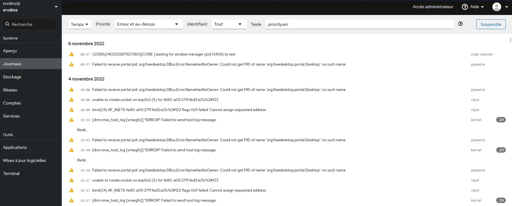

<figure markdown>
  { width="430" }
</figure>

## Mémento 12.1 - Cockpit

Cockpit permettra de gérer à distance les systèmes Linux des VM du réseau virtuel, ceci au travers d'une interface Web en utilisant le nom de domaine `loupvirtuel.fr`.

La gestion des VM sera centralisée depuis un serveur Cockpit primaire installé sur `srvdmz`.

### Accès sur le réseau virtuel

Le domaine `loupvirtuel.fr` n'étant pas public, vous ne pouvez pas accéder au site Web du réseau virtuel depuis Internet en tapant son URL dans le champ adresse d'un navigateur Web.

En revanche, vous pouvez simuler cet accès Internet depuis un PC situé sur votre réseau local.

Par exemple, pour un PC Windows :

\- Etape 1  
Entrez sur ce PC, comme dans le mémento [Contrôle à distance - VBox/Deb12](../posts/controle-distant-debian12.md#windows-routes){ target="_blank" }, les 3 routes statiques permettant de joindre les VM du réseau local virtuel.

```bash
[C:\~] route add -p 192.168.2.0 mask 255.255.255.0 192.168.x.w

[C:\~] route add -p 192.168.3.0 mask 255.255.255.0 192.168.x.w

[C:\~] route add -p 192.168.4.0 mask 255.255.255.0 192.168.x.w
```

192.168.x.w est l'IP de la carte réseau RED d'IPFire.  
Le -p déclare les routes comme étant permanentes.

\- Etape 2  
Ajoutez ensuite ces 2 lignes au fichier DNS C:\Windows\System32\drivers\etc\hosts :

```markdown
# loupvirtuel.fr
192.168.4.2 loupvirtuel.fr
```

\- Etape 3  
Finissez en testant l'URL `https://loupvirtuel.fr` :

<!-- more -->

<figure markdown>
  { width="580" }
  <figcaption>Site Web : Accueil du domaine loupvirtuel.fr</figcaption>
</figure>

Voilà, vous êtes prêt pour installer et utiliser Cockpit.

### Cockpit primaire sur srvdmz

Cockpit permet l'administration de son système Linux _(Cockpit primaire)_ ainsi que l'administration centralisée d'autres systèmes Linux _(Cockpits secondaires)_.

Les onglets de son interface Web proposent de :

-- Partie Système --

* Visualiser l'état du matériel -> _Aperçu_  
* Lire les journaux système -> _Journaux_  
* Visualiser les disques -> _Stockage_  
* Visualiser le trafic réseau -> _Réseau_  
* Gérer les comptes utilisateurs -> _Comptes_  
* Gérer les services -> _Services_

-- Partie Outils --

* Gérer les applications -> _Applications_  
* Gérer les MAJ -> _Mises à jour de logiciel_  
* Travailler avec un Terminal Web -> _Terminal_

Il est également possible, depuis cette interface, de :

* Gérer d'autres serveurs Linux _(centralisation)_  
* Gérer, créer des VM _(plugin cockpit-machines)_  
* Gérer des CTN Podman _(plugin cockpit-podman)_  
* Etc…

Pour installer Cockpit sur `srvdmz`, entrez ces Cdes :

-- Debian 11 --

```bash
[srvdmz@srvdmz:~$] su root

[root@srvdmz:~$] cd /etc/apt/sources.list.d/

[root@srvdmz:~$] echo "deb http://deb.debian.org/debian bullseye-backports main" > backports.list

[root@srvdmz:~$] exit

[srvdmz@srvdmz:~$] sudo apt update

[srvdmz@srvdmz:~$] sudo apt install -t bullseye-backports cockpit

[srvdmz@srvdmz:~$] sudo apt install -t bullseye-backports cockpit-pcp

[srvdmz@srvdmz:~$] sudo systemctl enable cockpit.socket

[srvdmz@srvdmz:~$] sudo systemctl start cockpit
```

-- Debian 12 --

```bash
[srvdmz@srvdmz:~$] sudo apt install cockpit cockpit-pcp
```

### Réglages Port/Pare-feu/SSL

#### _- Port utilisé par Cockpit_

Le numéro de port par défaut de Cockpit est le 9090. Vous allez, par sécurité, modifier celui-ci.

Commencez par créer un dossier cockpit.socket.d :

```bash
[srvdmz@srvdmz:~$] cd /etc/systemd/system/
[srvdmz@srvdmz:~$] sudo mkdir cockpit.socket.d
```

Générez dans celui-ci un fichier listen.conf :

```bash
[srvdmz@srvdmz:~$] cd cockpit.socket.d
[srvdmz@srvdmz:~$] sudo nano listen.conf 
```

et entrez ceci pour déclarer l'usage du port 9528 :

```markdown
[Socket]
ListenStream=
ListenStream=9528
```

Pour finir, rechargez la nouvelle configuration systemd et relancez la partie réseau de Cockpit :

```bash
[srvdmz@srvdmz:~$] sudo systemctl daemon-reload
[srvdmz@srvdmz:~$] sudo systemctl restart cockpit.socket 
```

Le Cockpit de `srvdmz` écoutera ainsi sur le port 9528.

#### _- Pare-feu VM IPFire_

Ouvrez le port 9528 au niveau de la VM IPFire (Ref: Mémento [DNS split - VBox/Deb12](../posts/dns-split-debian12.md#pare-feu){ target="_blank" }) :

<figure markdown>
  { width="580" }
  <figcaption>IPFire : Utilisation du port 9528 autorisé</figcaption>
</figure>

#### _- SSL domaine loupvirtuel.fr_

Cockpit fournit de base un certificat SSL auto-signé pour les connexions HTTPS entrantes, une alerte de sécurité est alors affichée par les navigateurs Web.

Vous allez, pour éviter cela, utiliser le certificat du domaine `loupvirtuel.fr` (Ref : Mémento [LAMP - VBox/Deb12 2/2](../posts/lamp-https-cms-partie-2-debian12.md#https){ target="_blank" }).

Commencez par copier ces 2 fichiers SSL dans le dossier /etc/cockpit/ws-certs.d :

```bash
[srvdmz@srvdmz:~$] cd /etc/ssl
  
[srvdmz@srvdmz:~$] sudo cp loupvirtuel.crt /etc/cockpit/ws-certs.d 
  
[srvdmz@srvdmz:~$] sudo cp loupvirtuel.key /etc/cockpit/ws-certs.d
```

Renommez, si présent dans le dossier ci-dessous, le certificat auto-signé de Cockpit :

```bash
[srvdmz@srvdmz:~$] cd /etc/cockpit/ws-certs.d
  
[srvdmz@srvdmz:~$] sudo mv 0-self-signed.cert 0-self-signed.cert-save
```

et modifiez les droits des 2 fichiers importés :

```bash
[srvdmz@srvdmz:~$] sudo chown root:cockpit-ws loupvirtuel.*
```

Redémarrez Cockpit :

```bash
[srvdmz@srvdmz:~$] sudo systemctl restart cockpit
[srvdmz@srvdmz:~$] sudo systemctl status cockpit
```

Cockpit est maintenant accessible depuis l'URL :  
`https://loupvirtuel.fr:9528`

!!! note "Nota"
    L'ensemble des captures ci-dessous issu de Debian 11 est proche de Debian 12.

<figure markdown>
  { width="580" }
  <figcaption>Cockpit : Fenêtre de login</figcaption>
</figure>

Connectez-vous en tant qu'utilisateur `srvdmz`.

La page d'accueil de Cockpit doit s'afficher :  
-> Bouton Activez l'accès administrateur

Une fenêtre _Passer à l’accès administrateur_ s'ouvre :  
-> Mot de passe de `srvdmz` : Entrez le MDP de `srvdmz`  
-> Bouton S'authentifier

<figure markdown>
  { width="580" }
  <figcaption>Cockpit : Accueil = Onglet Aperçu</figcaption>
</figure>

Le contenu de la zone de notification, soit celui du fichier /etc/motd, peut maintenant être modifié en cliquant sur l'icône d'édition située dans la zone.

Accédez maintenant au Widget Utilisation :  
-> Voir les métriques et l'historique

Ceux-ci apparaîtront au bout de quelques instants.

!!! note "Nota"
    Si vous disposez d'un nom de domaine routé par votre Box Internet sur l'un de vos serveurs, vous pouvez utiliser celui-ci pour joindre le Cockpit de la VM srvdmz, ceci en créant une règle de proxy inverse appropriée.

### Interface Web de Cockpit

Observez maintenant le contenu de chacun des modules de Cockpit, soit :

-- Partie Système --

* Journaux (Priorité = Erreur et au dessus)

<figure markdown>
  { width="580" }
  <figcaption>Cockpit : Onglet Journaux</figcaption>
</figure>

Contrôle des logs du système, options de filtrage.

* Stockage

<figure markdown>
  { width="580" }
  <figcaption>Cockpit : Onglet Stockage</figcaption>
</figure>

Gestion du stockage, options de gestion RAID et NFS.

* Réseau

<figure markdown>
  { width="580" }
  <figcaption>Cockpit : Onglet Réseau</figcaption>
</figure>

Gestion du réseau, options d'ajout de Lien/Pont/VLAN.

* Comptes

<figure markdown>
  { width="580" }
  <figcaption>Cockpit : Onglet Comptes</figcaption>
</figure>

Gestion des comptes, options de création Group/User.

* Services

<figure markdown>
  { width="580" }
  <figcaption>Cockpit : Onglet Services</figcaption>
</figure>

Gestion des statuts des services, options de filtrage.

-- Partie Outils --

* Applications

<figure markdown>
  { width="580" }
  <figcaption>Cockpit : Onglet Applications</figcaption>
</figure>

Gestion des extensions utilisées (plugins).

* Mises à jour logicielles

<figure markdown>
  { width="580" }
  <figcaption>Cockpit : Onglet Mises à jour de logiciel</figcaption>
</figure>

MAJ des paquets du système, option de redémarrage.

* Terminal _(très pratique)_

<figure markdown>
  { width="580" }
  <figcaption>Cockpit : Onglet Terminal</figcaption>
</figure>

Usage de la ligne de Cde pour administrer le système.

La déconnexion de Cockpit s'effectue depuis le menu Session situé en haut et à droite de la page Web.

### Gestion centralisée du réseau

Il est possible de gérer, hormis les CTN LXC, l'ensemble des VM et CTN Podman du réseau local virtuel depuis le Cockpit installé sur la VM `srvdmz`.

Pour cela, il faut rendre les VM à gérer accessibles en protocole SSH (Ref: Mémento [Contrôle à distance - VBox/Deb12](../posts/controle-distant-debian12.md#ssh-ovs){ target="_blank" }) et installer Cockpit sur celles-ci.

SSH ne propose pour l'instant que la lecture seule sur les VM distantes, il faudra toujours cliquer sur le bouton Activez l'accès administrateur de celles-ci pour les gérer.

SSH augmentera la sécurité entre les VM et évitera d'avoir à saisir les MDP de façon répétée.

Les VM à gérer depuis le Cockpit de la VM `srvdmz` seront à créer en tant que nouveaux hôtes.

#### _- Ajout de srvlan (nouvel hôte)_

Commencez par installer un serveur SSH sur `srvlan` :

```bash
[srvlan@srvlan:~$] sudo apt install openssh-server
[srvlan@srvlan:~$] sudo systemctl status sshd
```

Editez ensuite le fichier de configuration de SSH :

```bash
[srvlan@srvlan:~$] sudo nano /etc/ssh/sshd_config
```

et remplacez la ligne #Port 22 par Port 222.

Relancez le service SSH pour traiter la modification :

```bash
[srvlan@srvlan:~$] sudo systemctl restart sshd
```

et installez Cockpit sur la VM `srvlan` comme pratiqué sur la VM `srvdmz`.

Connectez-vous ensuite sur le Cockpit de `srvdmz` et cliquez sur le menu déroulant situé en haut et à gauche de la page Web :  
-> Bouton Ajouter un nouvel hôte

Une fenêtre _Ajouter un nouvel hôte_ s'ouvre :  
-> Hôte : `srvlan.intra.loupvirtuel.fr`:222  
-> Nom d'utilisateur : `srvlan`  
-> Couleur : Choisissez une couleur pour la VM  
-> Bouton Ajouter

Une fenêtre _Nouvel hôte_ s'ouvre :  
-> Bouton Accepter la clé et se connecter

Une fenêtre _Connectez-vous à `srvlan`@..._ s'ouvre :  
-> Mot de passe : MDP de `srvlan`  
-> Cochez Créer une nouvelle clé SSH et l'autoriser

Le fenêtre ouverte s'étend :  
-> Mot de passe clé : MDP de `srvdmz` et non de `srvlan`  
-> Confirmer ... de passe de la clé : MDP de `srvdmz`  
-> Bouton Connexion

L'hôte `srvlan`@... est ajouté dans le menu déroulant situé en haut et à gauche de la page Web.

Fermez la connexion `srvdmz`@... depuis le menu Session situé en haut et à droite de la page Web.

Remarques :  
\- Un hôte `srvlan.intra.loup...` a été ajouté dans le fichier /home/srvdmz/.ssh/known_hosts.

\- 2 clés SSH id_rsa et id_rsa.pub ont été créées sur `srvdmz` dans /home/srvdmz/.ssh/.

\- La clé id_rsa.pub a été copiée comme authorized_keys sur `srvlan` dans /home/srvlan/.ssh/.

Reconnectez-vous maintenant sur le Cockpit de la VM `srvdmz` et sélectionnez ensuite l'hôte `srvlan`@..., la liaison sera directement établie sans demande de MDP.

<figure markdown>
  { width="580" }
  <figcaption>Cockpit : Gestion de srvlan depuis srvdmz</figcaption>
</figure>

Les connexions futures depuis le Cockpit de la VM `srvdmz` sur celui de la VM `srvlan` se feront sans demande de MDP, ceci grâce à la configuration SSH.

#### _- Ajout d'ovs (nouvel hôte)_

Un serveur SSH écoute déjà sur le port 222.

Installez seulement Cockpit avec les mêmes Cdes que celles utilisées sur la VM `srvdmz`.

!!! note "Nota"
    Pour Debian 12, ajoutez le paquet cockpit-podman qui permettra de gérer les conteneurs.

Connectez-vous ensuite sur le Cockpit de la VM `srvdmz` et cliquez sur le menu déroulant situé en haut et à gauche de la page Web :  
-> Bouton Ajouter un nouvel hôte

Une fenêtre _Ajouter un nouvel hôte_ s'ouvre :  
-> Hôte : `ovs.intra.loupvirtuel.fr`:222  
-> Nom d'utilisateur : `switch`  
-> Couleur : Choisissez une couleur pour la VM  
-> Bouton Ajouter

Une fenêtre _Nouvel hôte_ s'ouvre :  
-> Bouton Accepter la clé et se connecter

L' hôte `ovs` est alors ajouté dans le fichier :  
/home/srvdmz/.ssh/known_hosts

Une fenêtre Connectez-vous à `switch`@... s'ouvre :  
-> Mot de passe : MDP de `switch`  
-> Cochez cette fois Autoriser la clé SSH  
-> Bouton Connexion

L'hôte `switch`@... a été ajouté dans le menu déroulant situé en haut et à gauche de la page Web.

La clé SSH publique id_rsa.pub de `srvdmz` est alors copiée comme authorized_keys sur `ovs`.

Cliquez à présent l'hôte `switch`, la connexion doit s'établir directement sans demande de MDP.

!!! note "Nota"
    Pour Debian 12, Cockpit affichera les conteneurs Podman en mode rootless et rootfull.

#### - Accès Cockpit secondaire

Au préalable, ajoutez Cockpit et un serveur SSH sur les VM `debian**-vm*`.

L'accès direct sur un Cockpit secondaire se fera au travers du Cockpit primaire de la VM `srvdmz`.

Pour, par exemple, joindre le Cockpit de `debian12-vm1` :  
-> Accédez à la fenêtre de login du Cockpit de `srvdmz`  
-> Remplissez ensuite les champs comme ci-dessous

<figure markdown>
  { width="430" }
  <figcaption>Cockpit : Liaison directe sur un Cockpit secondaire</figcaption>
</figure>

-> Cliquez sur le bouton Connexion

Une fenêtre _Nouvel hôte_ s'ouvre :  
-> Bouton Accepter la clé et se connecter

La connexion est établie, l'acceptation de la clé SSH ne sera plus demandée à l'avenir.

### Bilan

Cockpit est léger, fiable, sécurisé et son interface Web responsive permet d'administrer un système Linux facilement y compris depuis un smartphone.

La gestion centralisée de plusieurs systèmes Linux est un plus.

Il propose aussi un peu de supervision, ceci en affichant quelques métriques bien utiles sous forme graphique.

**Fin.**
