<figure markdown>
  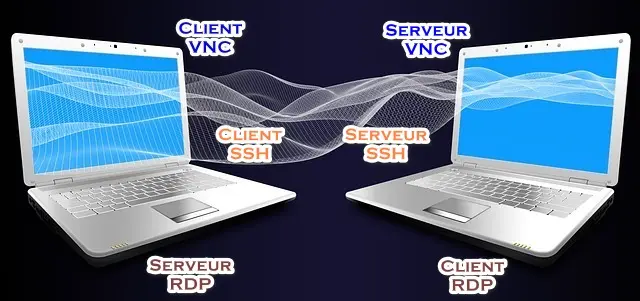{ width="430" }
</figure>

## Mémento 6.1 - RDP, VNC, SSH

Il peut être utile de pouvoir contrôler à distance les VM et les conteneurs LXC du réseau, notamment depuis un PC situé sur le même LAN que le PC hôte de VirtualBox. Des protocoles tels RDP, VNC ou SSH permettent cela.

Etant sur le même LAN, les connexions distantes seront validées simplement par login et MDP.

### RDP via VirtualBox

Par défaut, le serveur **R**emote **D**esktop **P**rotocol fourni par VirtualBox utilise le port TCP 3389.

#### _- Accès RDP sur VM srvlan_

Panneau gauche de VirtualBox, sélectionnez la VM :  
\- - Menu de VirtualBox -> Machine -> Configuration...  
\- - - Onglet Affichage  
-> Bureau à distance -> Cochez Activer le serveur  
-> Server Port -> Entrez un numéro de port, Ex : 7002  
-> Security Method -> Sélectionnez RDP  
-> OK

<figure markdown>
  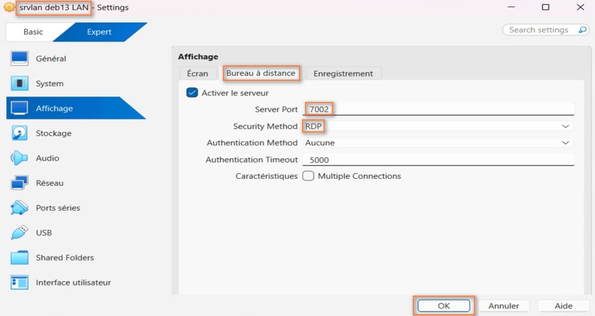{ width="430" }
  <figcaption>VirtualBox : Réglages du bureau à distance</figcaption>
</figure>

Redémarrez la VM srvlan.

<!-- more -->

#### _- Test de connexion RDP_ {#windows-routes}

\- - Depuis un PC distant sous Windows  
\- - - Menu Windows :  
-> Accessoires Windows ou Outils Windows  
-> Connexion Bureau à distance

Activez la connexion RDP comme montré ci-dessous :

<figure markdown>
  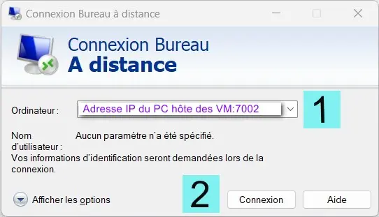
  <figcaption>Bureau à distance : IP PC hôte VM:port RDP srvlan</figcaption>
</figure>

<figure markdown>
  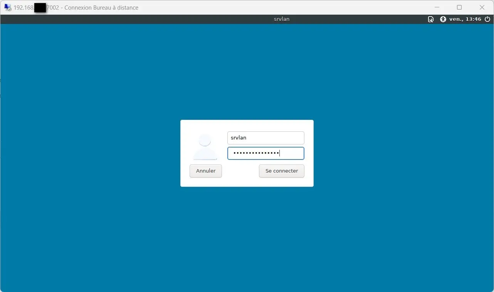{ width="430" }
  <figcaption>Bureau à distance : Login retourné par srvlan</figcaption>
</figure>

<figure markdown>
  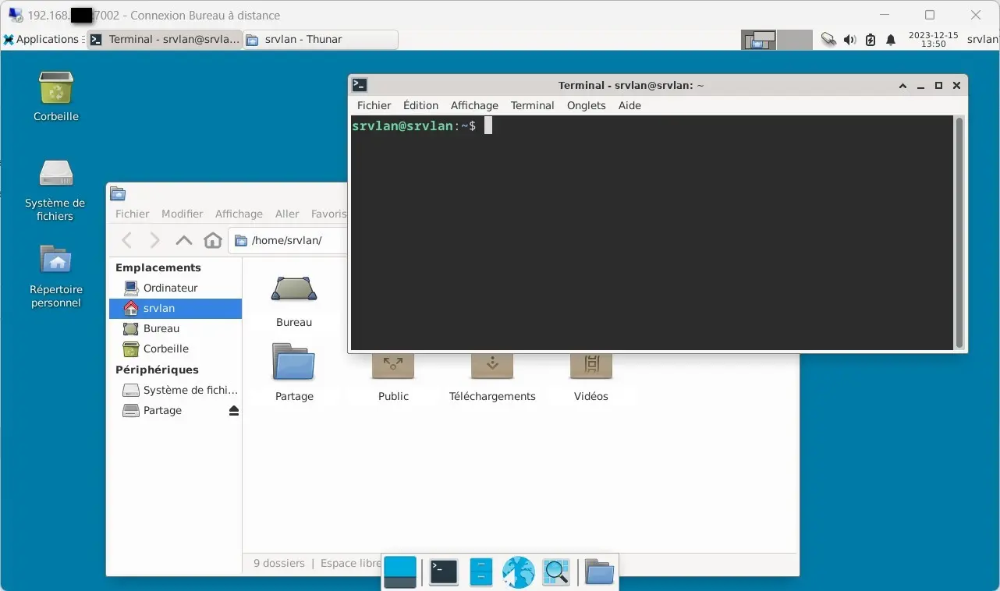{ width="430" }
  <figcaption>Bureau à distance : Session RDP ouverte sur srvlan</figcaption>
</figure>

\- - Depuis un PC distant sous Linux  
Installez le client réseau Remmina disponible sur bien des distributions et lancez celui-ci.  
Sélectionnez le RDP et entrez 192.168.x.y:7002 dans le champ de connexion rapide.

192.168.x.y = IP du PC hôte des VM _([Voir la maquette](../images/2026/01/maquette-base-ipfire.png){ target="_blank" })_.  
7002 est le numéro de port RDP dédié à la VM srvlan.

<figure markdown>
  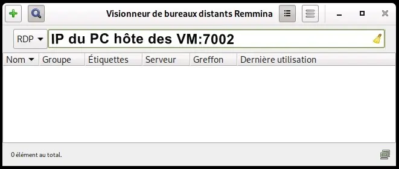{ width="430" }
  <figcaption>Remmina : Fenêtre de connexion RDP</figcaption>
</figure>

Appuyez sur la touche Entrée pour lancer la connexion :

<figure markdown>
  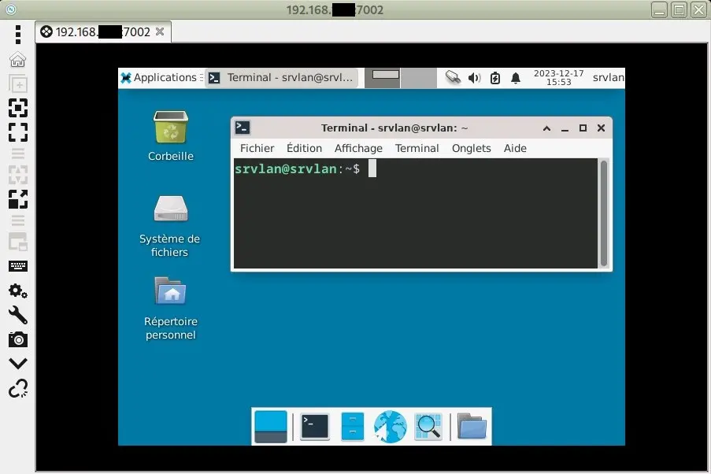{ width="430" }
  <figcaption>Remmina : Session RDP ouverte sur srvlan</figcaption>
</figure>

#### _- Remarques_

Vous devez, pour vous connecter sur les autres VM du réseau, affecter à chacune un numéro de port RDP différent, Ex : port 6017 pour la VM srvdmz.

Le serveur RDP de VirtualBox autorise des connexions directes sur les VM, pas besoin par exemple de traverser le pare-feu IPFire pour joindre srvlan.

Ceci permet notamment d'éviter un refus de connexion lié à des problèmes de configuration de table de routage ou de règle de pare-feu sur le réseau virtuel. Cela peut aider à dépanner.

### RDP via VM srvsec _(IPFire)_

Cela ne concerne pas les VM non graphiques telles IPFire, OpenvSwitch et les conteneurs LXC.

#### _- Serveur RDP sur VM srvlan_

Installez le serveur RDP de nom xrdp :

```bash
[srvlan@srvlan] sudo apt install xrdp
[srvlan@srvlan] sudo adduser xrdp ssl-cert
```

Le serveur est lancé de suite et configuré pour démarrer automatiquement au boot de la VM.

Editez ensuite le fichier xrdp.ini :

```bash
[srvlan@srvlan] sudo nano /etc/xrdp/xrdp.ini
```

et modifiez la ligne suivante comme ci-dessous :

```markdown
security_layer=tls
```

C'est le mode de connexion TLS qui sera ainsi utilisé.

Redémarrez le service :

```bash
[srvlan@srvlan] sudo systemctl restart xrdp
```

Complément pour les curieux : Suivre les [astuces](controle-distant-xrdp.md){ target="_blank" } facilitant l'exploitation du service xrdp.

#### _- Règle de pare-feu RDP_

L'accès distant ne fonctionnera cette fois que si vous ajoutez une règle de pare-feu dans IPFire autorisant les demandes de connexion sur le port 3389.

Accédez à l'interface graphique d'IPFire depuis le navigateur Web de srvlan :  
-> Pare-feu -> Règles de pare-feu -> Nouvelle règle

\- Zone Source  
-> Cochez Réseaux standards -> Sélectionnez Tout

\- Zone Destination  
-> Cochez Réseaux standards -> Sélectionnez Tout

\- Zone Protocole  
-> Sélectionnez TCP -> Port de destination  
-> Remplissez le champ vide avec le n° de port 3389

-> Cochez ACCEPTER

\- Zone Paramètres additionnels  
-> Remarque  
-> Entrez Connexions RDP entrantes autorisées

-> Ajouter -> Appliquer les changements

<figure markdown>
  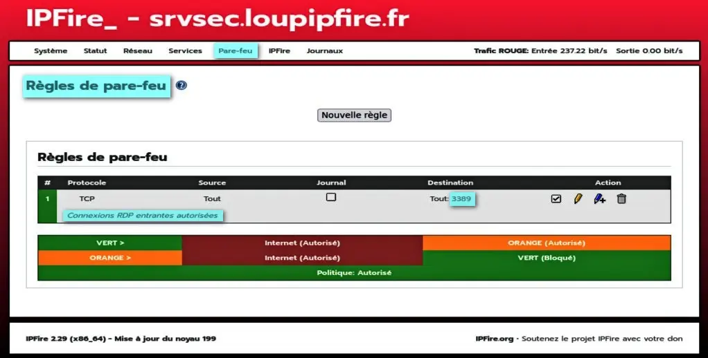{ width="430" }
  <figcaption>IPFire : Règle de pare-feu RDP</figcaption>
</figure>

!!! Nota "Nota"

    Fermez ensuite votre session utilisateur srvlan, le serveur xrdp refusant par défaut d'afficher le bureau d'un utilisateur ayant une session déjà ouverte.

#### _- Test de connexion_ {#test-connexion}

\- - Depuis un PC distant sous Windows  
Créez, sur celui-ci, les 3 routes statiques permanentes qui permettront de joindre les VM :

```bash
route add -p 192.168.2.0 mask 255.255.255.0 192.168.x.w

route add -p 192.168.3.0 mask 255.255.255.0 192.168.x.w

route add -p 192.168.4.0 mask 255.255.255.0 192.168.x.w 
```

192.168.x.w est l'IP de la carte réseau RED d'IPFire.  
Le paramètre -p rend la route statique permanente.

Utilisez la Cde route print pour afficher la table de routage de Windows.

Menu Windows :  
-> Accessoires Windows ou Outils Windows  
-> Connexion Bureau à distance

Entrez l'IP de srvlan 192.168.2.2 dans le champ Ordinateur et cliquez sur le bouton Connexion.

Une alerte Impossible de vérifier l'identité ... -> Oui

Connexion établie, la fenêtre suivante s'affiche :

<figure markdown>
  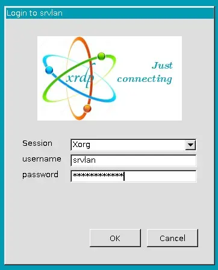
  <figcaption>Fenêtre de connexion du serveur xrdp</figcaption>
</figure>

-> Session : Sélectionnez Xorg  
-> username : Entrez srvlan  
-> password : Entrez le MDP de srvlan -> OK

\- - Depuis un PC distant sous Linux  
Créez les mêmes routes statiques comme ceci :

```bash
sudo ip route add 192.168.2.0/24 via 192.168.x.w proto static metric 100

sudo ip route add 192.168.3.0/24 via 192.168.x.w proto static metric 100

sudo ip route add 192.168.4.0/24 via 192.168.x.w proto static metric 100  
```

192.168.x.w est l'IP de la carte réseau RED d'IPFire.  
Pour rendre celles-ci permanentes, vous devez tenir compte du gestionnaire de réseau actif.

Si NetworkManager est utilisé, générez les routes depuis son interface graphique _(Paramètres IPv4 -> Routes...)_.

Puis, relancez le service réseau :

```bash
sudo systemctl restart NetworkManager
```

Si c'est le fichier réseau /etc/network/interfaces qui est utilisé, ajoutez les lignes suivantes en fin de fichier :

```markdown
up ip route add 192.168.2.0/24 via 192.168.x.w dev enp0s3
up ip route add 192.168.3.0/24 via 192.168.x.w dev enp0s3
up ip route add 192.168.4.0/24 via 192.168.x.w dev enp0s3
```

Remplacez le nom de l'interface réseau enp0s3 si nécessaire.

Relancez le service réseau :

```bash
sudo systemctl restart networking
```

Pour finir, vérifiez la prise en compte des routes :

```bash
ip route
```

Le retour doit inclure ces 3 lignes :

```markdown
192.168.2.0/24 via 192.168.x.w dev enp0s3 proto static metric 100 
192.168.3.0/24 via 192.168.x.w dev enp0s3 proto static metric 100 
192.168.4.0/24 via 192.168.x.w dev enp0s3 proto static metric 100 
```

Avant d'utiliser de nouveau Remmina, ajoutez à la fin du fichier /home/srvlan/.xsession le contenu suivant :

```markdown
# Lancer Xfce
exec startxfce4
```

Si le fichier n'existe pas, créez le ainsi :

```bash
[srvlan@srvlan] cd /home/srvlan/
[srvlan@srvlan] nano .xsession
```

et entrez le contenu suivant :

```markdown
#!/bin/sh
# Lancer Xfce
exec startxfce4
```

Rendez le script exécutable :

```bash
[srvlan@srvlan] chmod +x .xsession
```

Ouvrez maintenant le logiciel Remmina :  
-> Entrez l'IP de srvlan soit 192.168.2.2  
-> Touche Entrée pour lancer la connexion

### VNC via VM srvsec _(IPFire)_

Cela ne concerne pas les VM non graphiques telles IPFire, OpenvSwitch et les conteneurs LXC.

Par défaut, un serveur VNC _(Virtual Network Computing)_ écoute sur le port TCP 5900+N° Ecran _(Ex : 5901)_.

#### _- Serveur VNC sur VM srvlan_ {#serveur-vnc}

Installez le serveur TightVNC :

```bash
[srvlan@srvlan] sudo apt install tightvncserver
```

Créez le MDP qui permettra d'accéder au serveur :

```bash
[srvlan@srvlan] vncpasswd
```

Retour :

```markdown
Password: Votre MDP VNC (Ex : vncMDPsrvlan)
Verify: Entrez de nouveau le MDP
Would you like to enter a view-only password (y/n)? n
```

Le MDP est stocké dans le dossier /home/srvlan/.vnc créé automatiquement.

Créez ensuite le fichier de démarrage xstartup comme ceci :

```bash
[srvlan@srvlan] cd /home/srvlan/.vnc
[srvlan@srvlan] nano xstartup
```

et entrez le contenu suivant qui précisera au serveur VNC d'ouvrir une session sous Xfce4 :

```markdown
#!/bin/sh
unset SESSION_MANAGER
unset DBUS_SESSION_BUS_ADDRESS
exec startxfce4 &
```

Déclarez le fichier comme étant exécutable :

```bash
[srvlan@srvlan] chmod +x xstartup
```

#### - _Lancement auto du serveur_

Créez le fichier de service tightvnc.service comme suit :

```bash
[srvlan@srvlan] mkdir -p /home/srvlan/.config/systemd/user
[srvlan@srvlan] nano /home/srvlan/.config/systemd/user/tightvnc.service
```

et entrez le contenu suivant :

```markdown
[Unit]
Description=VNC XFCE session

[Service]
Type=forking
ExecStartPre=-/usr/bin/vncserver -kill :1
ExecStart=/usr/bin/vncserver :1 -geometry 1368x768 -depth 24
ExecStop=/usr/bin/vncserver -kill :1

[Install]
WantedBy=default.target
```

Activez le démarrage automatique du service pour l'écran 1 :

```bash
[srvlan@srvlan] systemctl --user start tightvnc
[srvlan@srvlan] systemctl --user status tightvnc
[srvlan@srvlan] systemctl --user enable tightvnc
```

!!! note "Nota"
    Pour vos connexions futures, il vous faudra choisir d'activer le service xrdp ou tightvnc, pas les deux.

Maintenant, désactivez si nécessaire le service xrdp et redémarrez srvlan :

```bash
[srvlan@srvlan] sudo systemctl disable xrdp
[srvlan@srvlan] sudo reboot
```

et vérifiez le lancement automatique du serveur VNC :

```bash
[srvlan@srvlan] ss -tulnp | grep Xtightvnc 
```

Retour attendu :

```markdown
tcp   LISTEN 0      5            0.0.0.0:5901       0.0.0.0:*    users:(("Xtightvnc",pid=2481,fd=3))
tcp   LISTEN 0      4096         0.0.0.0:6001       0.0.0.0:*    users:(("Xtightvnc",pid=2481,fd=0))
```

Pour info, le serveur peut être arrêté comme suit :

```bash
[srvlan@srvlan] vncserver -kill :1  
```

#### _- Règle de pare-feu VNC_

Accédez à l'interface graphique d'IPFire depuis le navigateur Web de srvlan :  
-> Pare-feu -> Règles de pare-feu -> Nouvelle règle

\- Zone Source  
-> Cochez Réseaux standards -> Sélectionnez Tout

\- Zone Destination  
-> Cochez Réseaux standards -> Sélectionnez Tout

\- Zone Protocole  
-> Sélectionnez TCP -> Port de destination  
-> Remplissez le champ vide avec le n° de port 5901

-> Cochez ACCEPTER

\- Zone Paramètres additionnels  
-> Remarque  
-> Entrez Connexions VNC entrantes autorisées

-> Ajouter -> Appliquer les changements

<figure markdown>
  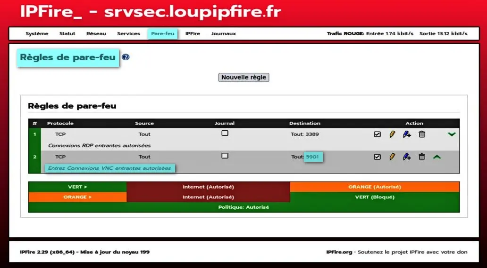{ width="430" }
  <figcaption>IPFire : Règle de pare-feu VNC</figcaption>
</figure>

#### _- Test de connexion VNC_

\- - Depuis un PC distant sous Windows  
Téléchargez le client [VNC Viewer](https://www.realvnc.com/fr/connect/download/viewer/){ target="_blank" } de RealVNC.

Effectuez son installation et démarrez le logiciel.

Configurez ensuite une connexion pour joindre srvlan :  
\- Menu Fichier  
-> Nouvelle connexion...

\- Une fenêtre Propriétés s'ouvre.  
-> Onglet Général  
Paramétrez VNC Viewer comme ci-dessous :

<figure markdown>
  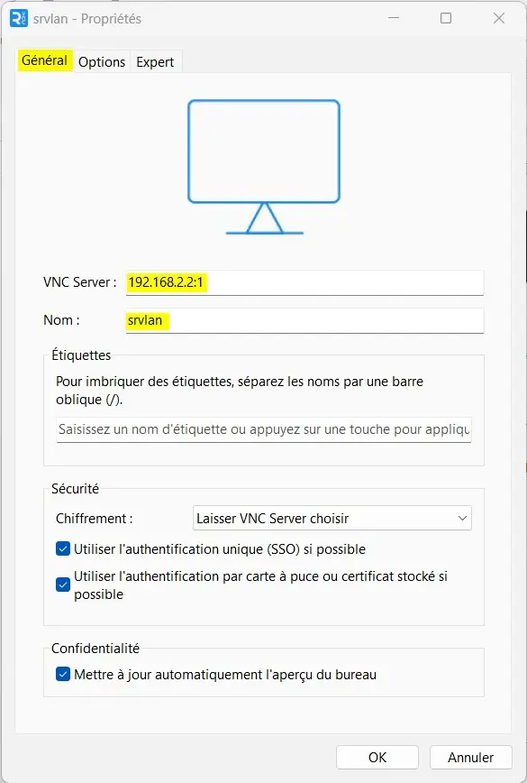{ width="430" }
  <figcaption>VNC Viewer : Paramètres onglet Général</figcaption>
</figure>

-> Onglet Options  
Paramétrez VNC Viewer comme ci-dessous :

<figure markdown>
  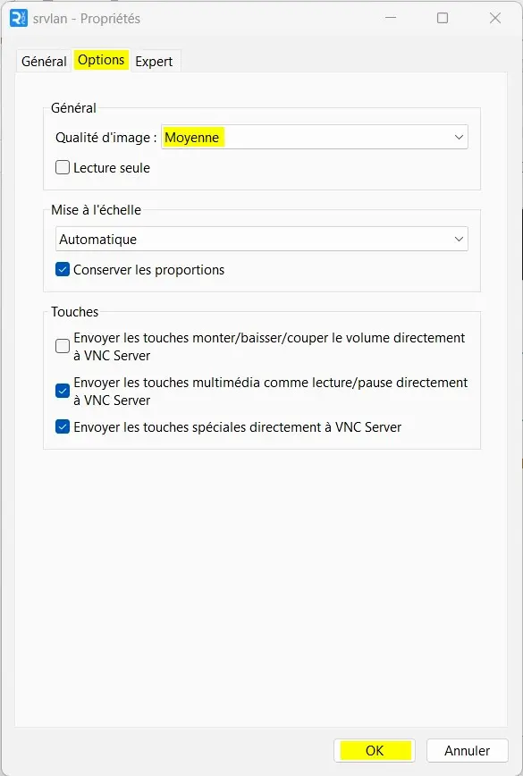{ width="430" }
  <figcaption>VNC Viewer : Paramètres onglet Options</figcaption>
</figure>

Résultat, VNC Viewer montre la nouvelle connexion :

<figure markdown>
  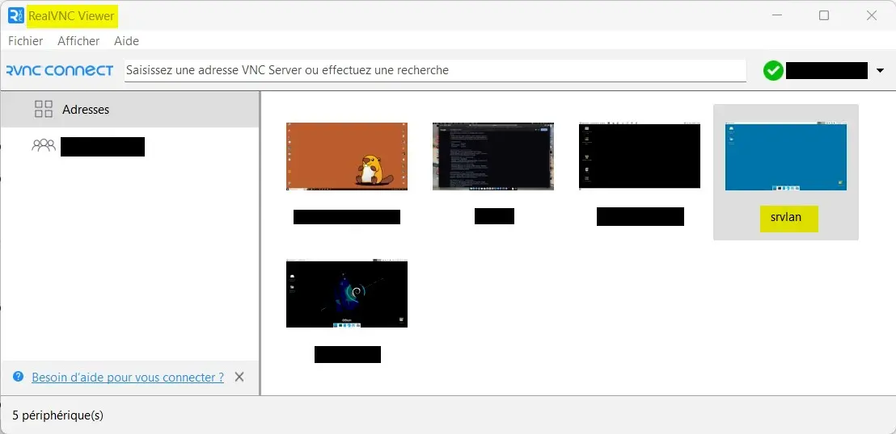{ width="430" }
  <figcaption>VNC Viewer : Connexion VNC créée pour srvlan</figcaption>
</figure>

Test de connexion :  
-> Double-cliquez sur l'icône srvlan

Une fenêtre Chiffrement s'ouvre :  
-> Cochez Ne plus afficher cet avertissement  
-> Continuer

Une fenêtre Authentification s'ouvre :  
-> Entrez votre MDP VNC pour srvlan -> OK

Connexion établie, la fenêtre suivante s'affiche :

<figure markdown>
  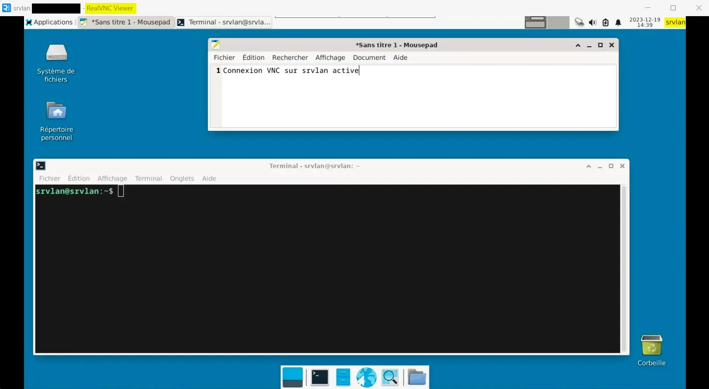{ width="430" }
  <figcaption>VNC Viewer : Session VNC ouverte sur srvlan</figcaption>
</figure>

\- - Depuis un PC distant sous Linux  
a) Téléchargez le client [VNC Viewer](https://www.realvnc.com/fr/connect/download/viewer/){ target="_blank" } de votre version Linux.  
Effectuez son installation et démarrez le logiciel.  
Procédez ensuite comme sous Windows.

b) Remmina peut également exploiter le protocole VNC.  
Cliquez sur l'icône + _(profil)_ située en haut à gauche.

Une fenêtre Profil de connexion à distance s'ouvre.  
Configurez la connexion VNC comme ci-dessous :

<figure markdown>
  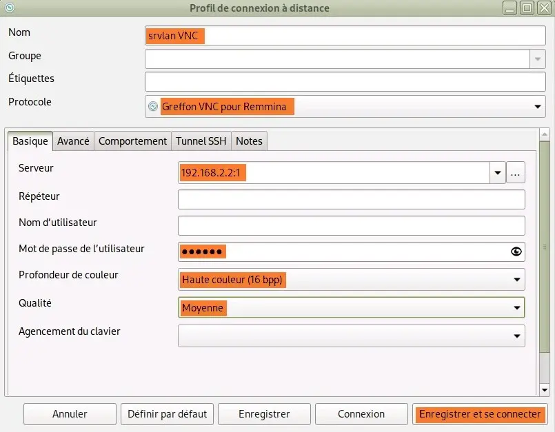{ width="430" }
  <figcaption>Remmina : Fenêtre de configuration/connexion VNC</figcaption>
</figure>

Le MDP de l'utilisateur = Votre MDP VNC _( [Voir ci-dessus](#serveur-vnc) )_

### SSH sur VM srvsec _(IPFire)_

Par défaut, un serveur SSH _(Secure SHell)_ écoute sur le port TCP 22.

#### _- Activation du serveur SSH_

Accédez à l'interface graphique d'IPFire depuis le navigateur Web de srvlan :  
-> Système -> Accès SSH

Une fenêtre Accès distant s'ouvre :  
-> Cochez Accès SSH  
-> Gardez Autoriser l'authentification par mot de passe  
-> Décochez Définir le port SSH à 22  
-> Bouton Sauvegarder

#### _- Règle de pare-feu SSH_

-> Pare-feu -> Règles de pare-feu -> Nouvelle règle

\- Zone Source  
-> Cochez Réseaux standards -> Sélectionnez Tout

\- Zone Destination  
-> Cochez Réseaux standards -> Sélectionnez Tout

\- Zone Protocole  
-> Sélectionnez TCP -> Port de destination  
-> Remplissez le champ vide avec le n° de port 222

-> Cochez ACCEPTER

\- Zone Paramètres additionnels  
-> Remarque  
-> Entrez Connexions SSH entrantes autorisées

-> Ajouter -> Appliquer les changements

<figure markdown>
  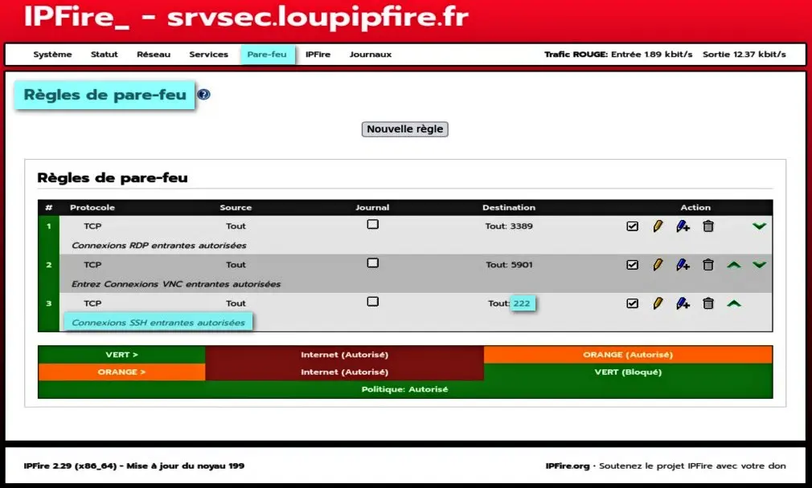{ width="430" }
  <figcaption>IPFire : Règle de pare-feu SSH</figcaption>
</figure>

#### _- Test de connexion SSH_

\- - Depuis un PC distant sous Windows  
Téléchargez le client SSH [Putty](https://www.putty.org/){ target="_blank" } et installez celui-ci.

Ensuite, démarrez et configurez Putty comme suit :

<figure markdown>
  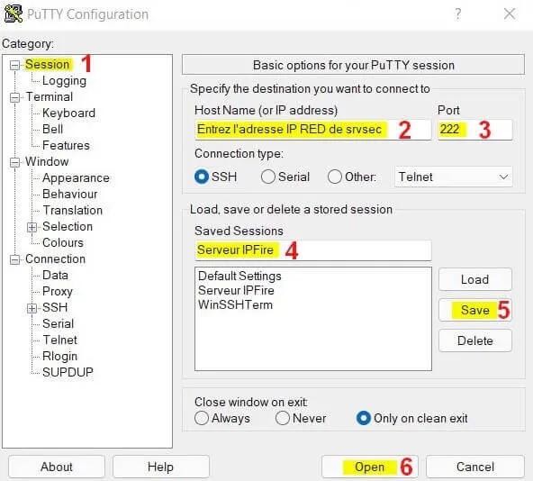{ width="430" }
  <figcaption>Putty : Configuration SSH pour IPFire</figcaption>
</figure>

La VM srvsec étant de confiance, acceptez l'alerte de sécurité et connectez vous en tant que root.

Résultat :

```markdown
login as: root
root@192.168.x.w's password: # Entrez votre MDP
[root@srvsec ~] ls
ipfire
[root@srvsec ~] /etc/init.d/sshd status
sshd is running with Process ID(s) 5254.
[root@srvsec ~]
```

Il n'y aura pas d'alerte de sécurité lors des connexions futures, utilisez la Cde exit pour quitter.

\- - Depuis un PC distant sous Linux  
a) Installez le paquet putty fourni par votre distribution.  
Procédez ensuite comme sous Windows.

b) Remmina peut également exploiter le protocole SSH.  
Cliquez sur l'icône + _(profil)_ située en haut à gauche.

Une fenêtre Profil de connexion à distance s'ouvre.  
Configurez la connexion SSH comme ci-dessous :

<figure markdown>
  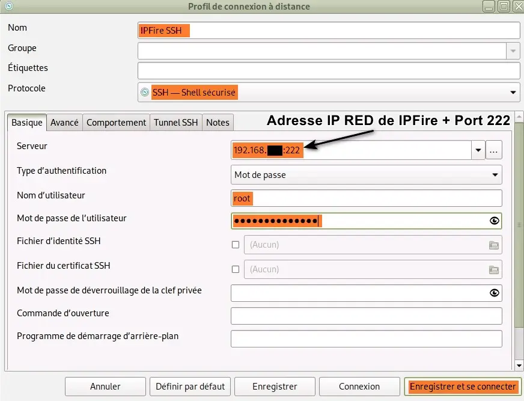{ width="430" }
  <figcaption>Remmina : Configuration SSH pour IPFire</figcaption>
</figure>

### SSH sur VM ovs (OpenvSwitch) {#ssh-ovs}

#### _- Serveur SSH sur VM ovs_

Installez le serveur OpenSSH :

```bash
[switch@ovs] sudo apt install openssh-server
```

et contrôlez l'activation du démon SSH :

```bash
[switch@ovs] sudo systemctl status sshd
```

Le résultat de la Cde doit montrer ==active (running)==.

Editez ensuite le fichier de configuration sshd_config :

```bash
[switch@ovs] sudo nano /etc/ssh/sshd_config
```

et remplacez la ligne #Port 22 par Port 222.

Redémarrez le serveur pour traiter la modification :

```bash
[switch@ovs] sudo systemctl restart sshd
```

#### - _Test de connexion_

Effectuez une connexion à l'aide de Putty :

<figure markdown>
  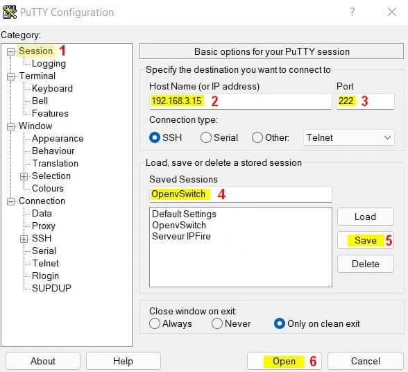{ width="430" }
  <figcaption>Putty : Configuration SSH pour OpenvSwitch</figcaption>
</figure>

Résultat une fois entrés le nom d'utilisateur et le MDP :

```markdown
login as: switch
switch@192.168.3.15's password: Votre MDP pour switch
Linux ovs 6.12.63+deb13-amd64 1 SMP PREEMPT_DYNAMIC Debian 6.12.63-1 (2025-12-30) x86_64

The programs included with the Debian GNU/Linux system are free software;
the exact distribution terms for each program are described in the
individual files in /usr/share/doc/*/copyright.

Debian GNU/Linux comes with ABSOLUTELY NO WARRANTY, to the extent
permitted by applicable law.
Last login: Fri Feb  6 15:51:17 2026 from 192.168...
```

!!! nota "Nota"
    L'authentification par MDP actuelle peut être remplacée par une authentification par clés privée et publique plus sécurisée, voir  [Addendum](controle-distant-ssh-cles.md){ target="_blank" }.

### SSH sur les conteneurs LXC

#### _- Conteneur ctn1_

Installez depuis l'hôte ovs un serveur SSH sur ctn1 :

```bash
[switch@ovs] sudo podman exec -it ctn1 bash

[root@...] apt update && apt upgrade
[root@...] apt install openssh-server
```

Editez ensuite son fichier de configuration sshd_config :

```bash
[root@...] apt install nano
[root@...] nano /etc/ssh/sshd_config
```

et modifiez les 2 lignes suivantes comme ci-dessous :  
\#Port 22 -> Port 222  
\#PermitRootLogin prohib...word -> PermitRootLogin yes

Redémarrez le serveur SSH pour traiter la configuration :

```bash
[root@...] /etc/init.d/ssh start
[root@...] /etc/init.d/ssh status
```

Retour normal :

```markdown
sshd is running.
```

Attribuez un MDP à l'utilisateur root du conteneur :

```bash
[root@...] passwd
```

Le MDP sera demandé lors de la connexion SSH.

Editez le fichier .bashrc de l'utilisateur root :

```bash
[root@...] nano /root/.bashrc
```

et entrez le contenu suivant en fin de fichier :

```markdown
# Lancement automatique du serveur ssh
/etc/init.d/ssh start
```

Ensuite, déconnectez-vous du conteneur :

```bash
[root@...:~#] exit

[switch@ovs] 
```

et listez les images Podman utilisées en mode rootfull :

```bash
[switch@ovs] sudo podman images
```

Retour :

```markdown hl_lines="3"
REPOSITORY                      TAG         IMAGE ID      CREATED       SIZE
localhost/uptime-kuma           2           1392f4a0391a  8 days ago    518 MB
localhost/debian                1           9fb26070fc9c  8 days ago    167 MB
docker.io/library/debian        latest      29d02fa8f9f4  3 weeks ago   124 MB
docker.io/louislam/uptime-kuma  1           f48d816cb746  3 months ago  478 MB
```

Créez une nouvelle image de ctn1 incluant le SSH :

```bash
[switch@ovs] sudo podman commit ctn1 debian:2       # Création image tag 2
```

et recréez ctn1 depuis celle-ci :

```bash
[switch@ovs] sudo systemctl stop container-ctn1  # Suppression de ctn1
[switch@ovs] sudo podman ps                      # Vérification de la suppression

[switch@ovs] sudo podman run -dit --net ns:/var/run/netns/nsctn1 -h ctn1 --name ctn1 debian:2  # Création

[switch@ovs] cd /etc/systemd/system

[switch@ovs] sudo podman generate systemd --new --files --name ctn1
[switch@ovs] cat container-ctn1.service          # Doit inclure debian:2

[switch@ovs] sudo systemctl daemon-reload
[switch@ovs] sudo systemctl start container-ctn1
[switch@ovs] sudo systemctl status container-ctn1
```

Redémarrez la VM ovs :

```bash
[switch@ovs] sudo reboot
```

et connectez-vous depuis Putty en procédant comme pour la VM ovs mais avec l'IP 192.168.3.6.

#### _- Conteneurs ctn2 et ctn3_

Les 2 conteneurs basés sur Debian supportent l'outil de surveillance réseau Uptime Kuma dont la configuration s'effectue directement depuis son interface Web.

Pour interagir avec Debian, utilisez l'accès SSH de la VM ovs et exploitez les 2 Cdes suivantes :

```bash
[switch@ovs] sudo podman exec -it ctn2 bash

[switch@ovs] podman exec -it ctn3 bash
```

### VNC via un tunnel SSH

Rappel, désactivez si nécessaire le service xrdp qui ne doit pas être activé en même temps que le service tightvnc.

De base, une connexion VNC n'est pas sécurisée mais il est possible de faire transiter celle-ci à l'intérieur d'un tunnel SSH pour régler ce problème.

Ceci implique de configurer le serveur SSH d'IPFire afin qu'il accepte le transfert de ports TCP.

Accédez à l'interface graphique d'IPFire depuis le navigateur Web de srvlan :  
-> Système -> Accès SSH

Une fenêtre Accès distant s'ouvre :  
-> Cochez Autoriser le transfert TCP  
-> Bouton Sauvegarder

#### _- VNC/SSH depuis Windows_

Configurez un tunnel SSH avec Putty en respectant la chronologie des 2 captures suivantes :

<figure markdown>
  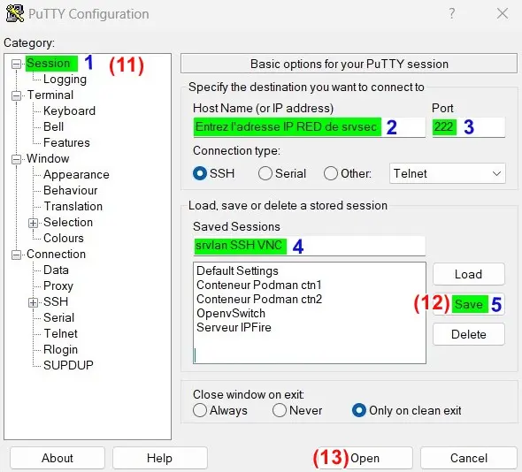{ width="430" }
  <figcaption>Putty : Configuration tunnel SSH pour VNC</figcaption>
</figure>

<figure markdown>
  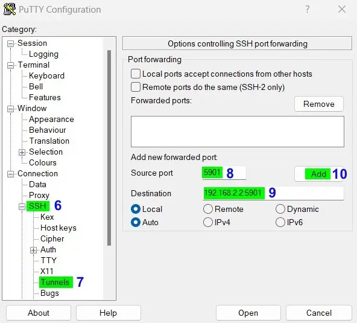{ width="430" }
  <figcaption>Putty : Configuration tunnel SSH pour VNC</figcaption>
</figure>

Puis lancez, depuis le client VNC Viewer de RealVNC, une connexion VNC locale (127.0.0.1) :

<figure markdown>
  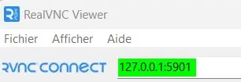
  <figcaption>RealVNC : Demande d'une connexion VNC locale</figcaption>
</figure>

La demande locale _(127.0.0.1)_ d'accès au port TCP 5901 utilisé par le protocole VNC sera automatiquement envoyée à l'intérieur du tunnel SSH vers le serveur SSH d'IPFire qui transfèrera celle-ci vers le serveur VNC de srvlan.

Pensez à fermer, une fois votre communication VNC terminée, la connexion SSH de Putty.

!!! Nota "Nota"
    VNC Viewer affichera une connexion VNC non chiffrée car il ne voit pas le tunnel SSH, mais la communication VNC est bien chiffrée au travers du tunnel SSH.

#### _- VNC/SSH depuis Linux_

Le plus simple est d'utiliser de nouveau Remmina.  
Cliquez sur l'icône + _(profil)_ située en haut à gauche.

Une fenêtre Profil de connexion à distance s'ouvre.  
Configurez la connexion VNC comme ci-dessous :

<figure markdown>
  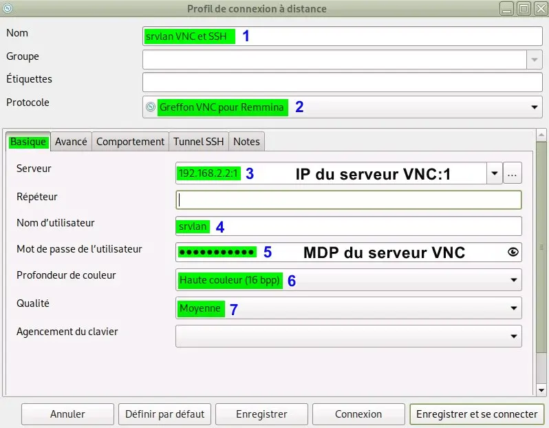{ width="430" }
  <figcaption>Remmina : Configuration VNC avec tunnel SSH</figcaption>
</figure>

<figure markdown>
  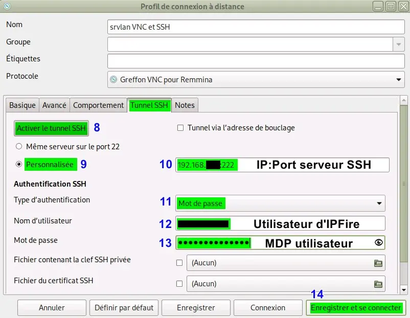{ width="430" }
  <figcaption>Remmina : Configuration VNC avec tunnel SSH</figcaption>
</figure>

La connexion SSH sera cette fois fermée automatiquement en fin de communication VNC.

### Bilan

Les VM et conteneurs LXC sont joignables à distance.

La sécurité des accès reste néanmoins perfectible :  
\- En ne travaillant pas avec des n° de port par défaut.  
\- En réglant plus finement les sources dans IPFire.  
\- En utilisant les clés publiques et privées de SSH.  
\- Etc...

{ align=left }

&nbsp;  
Terminé pour l'instant !  
Le mémento 7.1 vous attend  
pour l'installation d'un serveur  
DNS statique sur srvlan.

[Mémento 7.1](../posts/dns-statique-debian.md){ .md-button .md-button--primary }
