<figure markdown>
  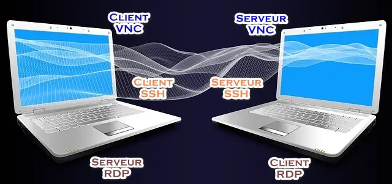{ width="430" }
</figure>

## Mémento 6.1 - RDP, VNC et SSH

Il peut être utile de pouvoir contrôler à distance les VM et les conteneurs LXC du réseau, notamment depuis un PC situé sur le même LAN que le PC hôte de VirtualBox. Des protocoles tels RDP, VNC ou SSH permettent cela.

Etant sur le même LAN, les connexions distantes seront validées simplement par login et MDP.

### RDP via VirtualBox

Par défaut, le serveur Remote Desktop Protocol fourni par VirtualBox utilise le port TCP 3389.

#### _- Accès RDP sur srvlan_

Panneau gauche de VirtualBox, sélectionnez la VM :  
\- - Menu de VirtualBox > Machine > Configuration  
-> Affichage > Bureau à distance  
-> Cochez Activer le serveur  
-> Port serveur > Affectez un numéro de port, Ex : 7002  
-> OK

<figure markdown>
  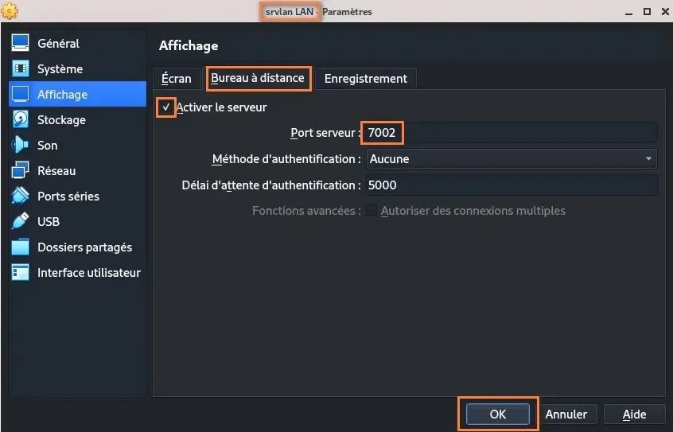{ width="430" }
  <figcaption>VirtualBox : Réglages du bureau à distance</figcaption>
</figure>

<!-- more -->

#### _- Test de connexion_

\- - Depuis un PC distant sous Windows  
Créez, sur celui-ci, les 3 routes statiques permanentes qui permettront de joindre les VM :

```bash
route add -p 192.168.2.0 mask 255.255.255.0 192.168.x.w

route add -p 192.168.3.0 mask 255.255.255.0 192.168.x.w

route add -p 192.168.4.0 mask 255.255.255.0 192.168.x.w 
```

192.168.x.w est l'IP de la carte réseau RED d'IPFire.  
Le paramètre -p rend la route statique permanente.

Utilisez la Cde route print pour afficher la table de routage de Windows.

Menu Windows :  
-> Accessoires Windows ou Outils Windows  
-> Connexion Bureau à distance

Activez la connexion RDP comme montré ci-dessous :

<figure markdown>
  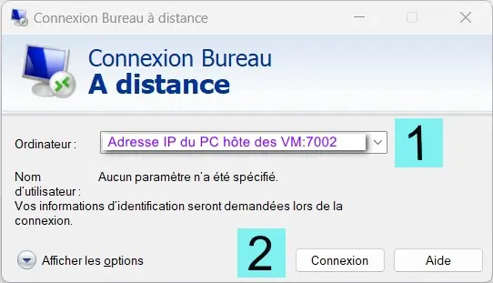
  <figcaption>Bureau à distance : IP PC hôte VM:port RDP srvlan</figcaption>
</figure>

<figure markdown>
  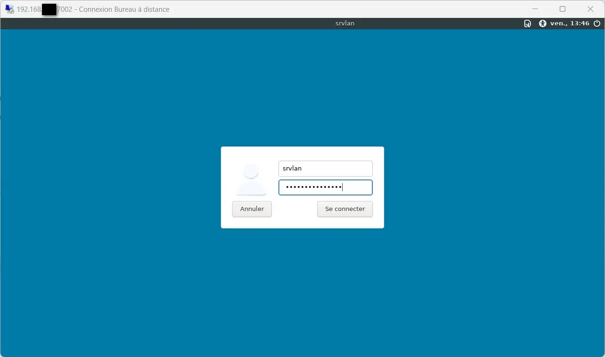{ width="430" }
  <figcaption>Bureau à distance : Login retourné par srvlan</figcaption>
</figure>

<figure markdown>
  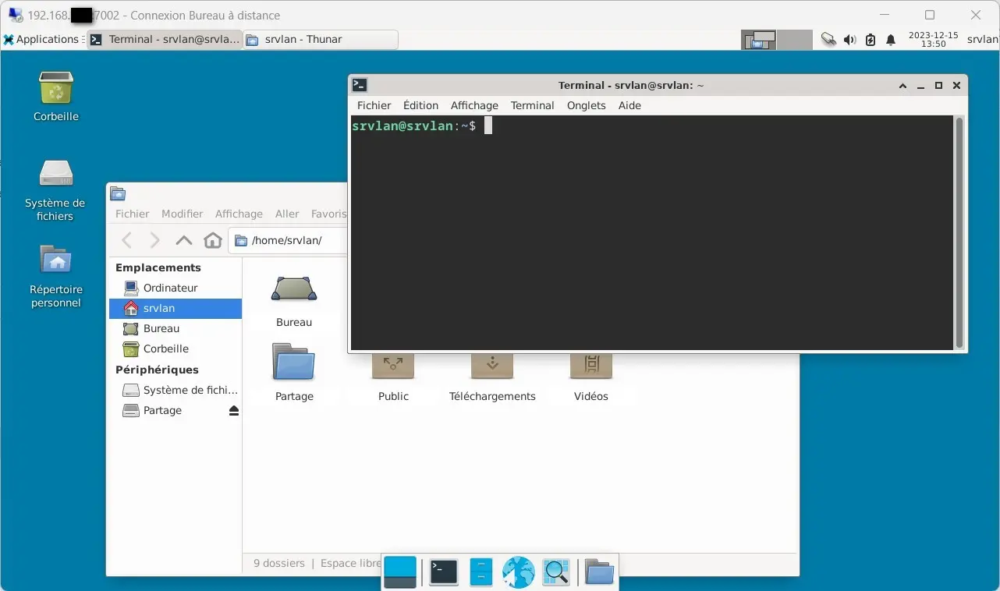{ width="430" }
  <figcaption>Bureau à distance : Session RDP ouverte sur srvlan</figcaption>
</figure>

\- - Depuis un PC distant sous Linux  
Créez les mêmes routes statiques comme ceci :

```bash
sudo ip route add 192.168.2.0/24 via 192.168.x.w proto static metric 100

sudo ip route add 192.168.3.0/24 via 192.168.x.w proto static metric 100

sudo ip route add 192.168.4.0/24 via 192.168.x.w proto static metric 100  
```

Pour rendre celles-ci permanentes, vous devez tenir compte du gestionnaire de réseau actif.

Si NetworkManager est utilisé, générez les routes statiques depuis son interface graphique et relancez le service réseau :

```bash
sudo systemctl restart NetworkManager
```

Si c'est le fichier réseau /etc/network/interfaces qui est utilisé, ajoutez les lignes suivantes en fin de fichier et relancez le service réseau :

```bash
up ip route add 192.168.2.0/24 via 192.168.x.w dev enp0s3
up ip route add 192.168.3.0/24 via 192.168.x.w dev enp0s3
up ip route add 192.168.4.0/24 via 192.168.x.w dev enp0s3

sudo systemctl restart networking
```

Adaptez en conséquence le nom de l'interface réseau.

Pour finir, vérifiez la prise en compte des routes :

```bash
ip route
```

Puis installez le client réseau Remmina disponible sur bien des distributions et lancez celui-ci.

192.168.x.y = IP du PC hôte des VM _([Voir la maquette](../images/2018/05/maquette-base-ipfire.png){ target="_blank" })_.  
7002 est le numéro de port RDP dédié à la VM srvlan.

<figure markdown>
  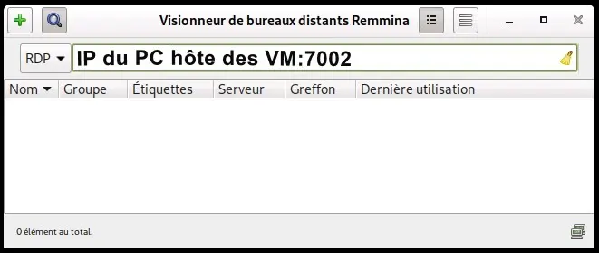{ width="430" }
  <figcaption>Remmina : Fenêtre de connexion RDP</figcaption>
</figure>

Appuyez sur la touche Entrée pour lancer la connexion :

<figure markdown>
  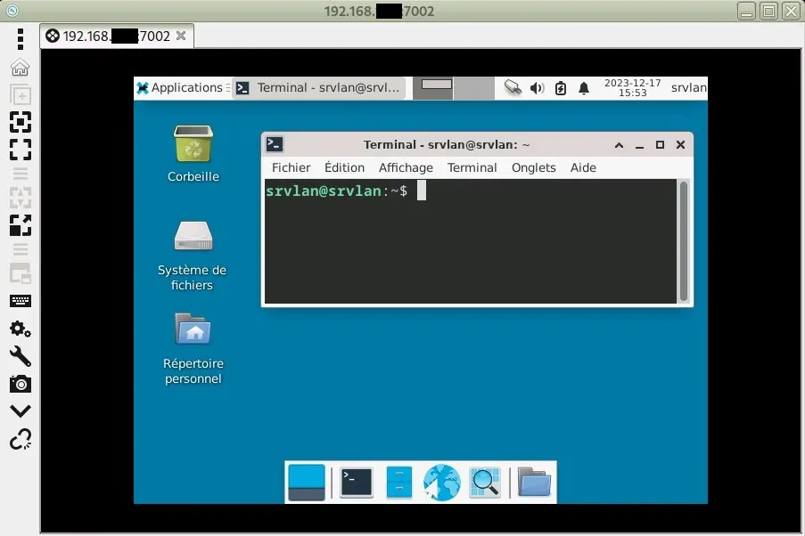{ width="430" }
  <figcaption>Remmina : Session RDP ouverte sur srvlan</figcaption>
</figure>

#### _- Remarques_

Vous devez, pour vous connecter sur les autres VM du réseau, affecter à chacune un numéro de port RDP différent, Ex : port 6017 pour la VM srvdmz.

Le serveur RDP de VirtualBox autorise des connexions directes sur les VM, pas besoin par exemple de traverser le pare-feu IPFire pour joindre srvlan.

Ceci permet notamment d'éviter un refus de connexion lié à des problèmes de configuration de table de routage ou de règle de pare-feu sur le réseau virtuel. Cela peut aider à dépanner.

### RDP via IPFire

Cela ne concerne pas les VM non graphiques telles IPFire, OpenvSwitch et les conteneurs LXC.

#### _- Serveur RDP sur srvlan_

Installez le serveur RDP de nom xrdp :

```bash
[srvlan@srvlan:~$] sudo apt install xrdp
[srvlan@srvlan:~$] sudo adduser xrdp ssl-cert
```

Le serveur est lancé de suite et configuré pour démarrer automatiquement au boot de la VM.

Complément pour les curieux : Suivre les astuces facilitant l'exploitation du service xrdp.

#### _- Règle de pare-feu RDP_

L'accès distant ne fonctionnera cette fois que si vous ajoutez une règle de pare-feu dans IPFire autorisant les demandes de connexion sur le port 3389.

Accédez à l'interface graphique d'IPFire depuis le navigateur Web de srvlan :  
-> Pare-feu > Règles de pare-feu > Nouvelle règle

\- Zone Source  
-> Cochez Réseaux standards > Sélectionnez Tout

\- Zone Destination  
-> Cochez Réseaux standards > Sélectionnez Tout

\- Zone Protocole  
-> Sélectionnez TCP > Port de destination  
-> Remplissez le champ vide avec le n° de port 3389

-> Cochez ACCEPTER

\- Zone Paramètres additionnels  
-> Remarque  
-> Entrez Connexions RDP entrantes autorisées

-> Ajouter > Appliquer les changements

<figure markdown>
  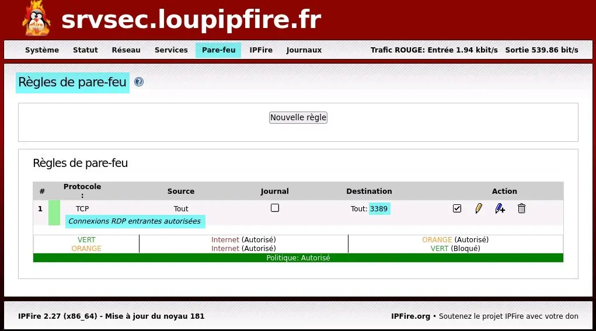{ width="430" }
  <figcaption>IPFire : Règle de pare-feu RDP</figcaption>
</figure>

!!! Nota "Important"

    Fermez ensuite votre session utilisateur srvlan, le serveur xrdp refusant par défaut d'afficher le bureau d'un utilisateur ayant une session déjà ouverte.

#### _- Test de connexion RDP_

\- - Depuis un PC distant sous Windows  
Menu Windows :  
-> Accessoires Windows ou Outils Windows  
-> Connexion Bureau à distance

Entrez l'IP de srvlan 192.168.2.2 dans le champ Ordinateur et cliquez sur le bouton Connexion.

Une alerte Impossible de vérifier l'identité ... > Oui

Connexion établie, la fenêtre suivante s'affiche :

<figure markdown>
  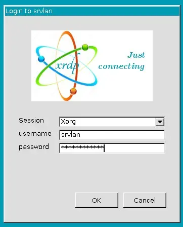
  <figcaption>Fenêtre de connexion du serveur xrdp</figcaption>
</figure>

-> Session : Sélectionnez Xorg  
-> username : Entrez srvlan  
-> password : Entrez le MDP de srvlan > OK

\- - Depuis un PC distant sous Linux  
Utilisez de nouveau le logiciel Remmina :  
-> Entrez l'IP de srvlan soit 192.168.2.2  
-> Touche Entrée pour lancer la connexion

### VNC via IPFire

Cela ne concerne pas les VM non graphiques telles IPFire, OpenvSwitch et les conteneurs LXC.

Par défaut, un serveur VNC (Virtual Network Computing) écoute sur le port TCP 5900+N° Ecran.

#### _- Serveur VNC sur srvlan_ {#serveur-vnc}

Installez le serveur tigervnc-standalone-server :

```bash
[srvlan@srvlan:~$] sudo apt install tigervnc-standalone-server
[srvlan@srvlan:~$] sudo apt install dbus-x11
```

Créez son MDP :

```bash
[srvlan@srvlan:~$] vncpasswd
```

Retour :

```markdown
Password > Votre MDP VNC (Ex : vncMDPsrvlan)
Verify > Entrez de nouveau le MDP
Would you like to enter a view-only ... (y/n) ? > n
A view-only password is not used
```

Créez ensuite son fichier de configuration tigervnc.conf :

```bash
[srvlan@srvlan:~$] cd /home/srvlan
[srvlan@srvlan:~$] nano .vnc/tigervnc.conf
```

et entrez le contenu suivant :

```bash
# Configuration du serveur tigervncserver
$localhost="no";                      # Connexion distante autorisée
$geometry="1360x768";                                 # Taille de l'écran
$depth="24";                                    # Profondeur des couleurs
$AlwaysShared = "yes";           # Connexions simultanées OK
```

Créez un fichier xstartup pour le démarrage sous Xfce4 :

```bash
[srvlan@srvlan:~$] nano .vnc/xstartup
```

et entrez le contenu suivant :

```bash
#!/bin/sh
unset SESSION_MANAGER
unset DBUS_SESSION_BUS_ADDRESS
exec /bin/sh /etc/xdg/xfce4/xinitrc
```

Déclarez le fichier comme étant exécutable :

```bash
[srvlan@srvlan:~$] chmod +x .vnc/xstartup
```

Pour terminer, modifiez le fichier vncserver.users :

```bash
[srvlan@srvlan:~$] sudo nano /etc/tigervnc/vncserver.users
```

en ajoutant les lignes suivantes à la fin de celui-ci :

```bash
# Utilisateur srvlan désigné pour l'écran 1
:1=srvlan
```

#### - _Lancement auto du serveur_

Pour cela, créez le service `tigervncserver@.service` :

```bash
[srvlan@srvlan:~$] cd /lib/systemd/system
[srvlan@srvlan:~$] sudo cp tigervncserver@.service \
/etc/systemd/system
```

Le caractère \ indique d'écrire la Cde sur une seule ligne.

Configurez son démarrage automatique pour l'écran 1 :

```bash
[srvlan@srvlan:~$] sudo systemctl start tigervncserver@:1
[srvlan@srvlan:~$] sudo systemctl enable tigervncserver@:1
```

Pour finir, redémarrez srvlan :

```bash
[srvlan@srvlan:~$] sudo reboot
```

et vérifiez le lancement automatique du serveur VNC :

```bash
[srvlan@srvlan:~$] vncserver -list
```

<figure markdown>
  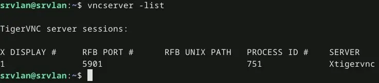{ width="430" }
  <figcaption>Serveur VNC : Port par défaut 5901 en écoute</figcaption>
</figure>

Pour info, le serveur peut être arrêté comme suit :

```bash
[srvlan@srvlan:~$] vncserver -kill :1
```

#### _- Règle de pare-feu VNC_

Accédez à l'interface graphique d'IPFire depuis le navigateur Web de srvlan :  
-> Pare-feu > Règles de pare-feu > Nouvelle règle

\- Zone Source  
-> Cochez Réseaux standards > Sélectionnez Tout

\- Zone Destination  
-> Cochez Réseaux standards > Sélectionnez Tout

\- Zone Protocole  
-> Sélectionnez TCP > Port de destination  
-> Remplissez le champ vide avec le n° de port 5901

-> Cochez ACCEPTER

\- Zone Paramètres additionnels  
-> Remarque  
-> Entrez Connexions VNC entrantes autorisées

-> Ajouter > Appliquer les changements

<figure markdown>
  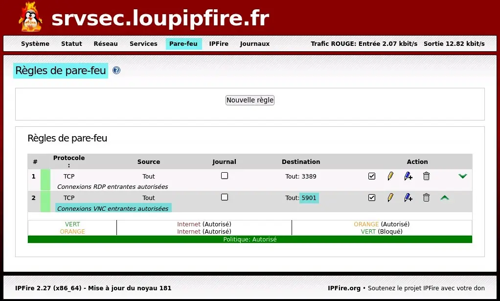{ width="430" }
  <figcaption>IPFire : Règle de pare-feu VNC</figcaption>
</figure>

#### _- Test de connexion VNC_

\- - Depuis un PC distant sous Windows  
Téléchargez le client [VNC Viewer](https://www.realvnc.com/fr/connect/download/viewer/){ target="_blank" } de RealVNC.

Effectuez son installation et démarrez le logiciel.

Configurez ensuite une connexion pour joindre srvlan :  
\- Menu Fichier  
-> Nouvelle connexion...

\- Une fenêtre Propriétés s'ouvre.  
-> Onglet Général  
Paramétrez VNC Viewer comme ci-dessous :

<figure markdown>
  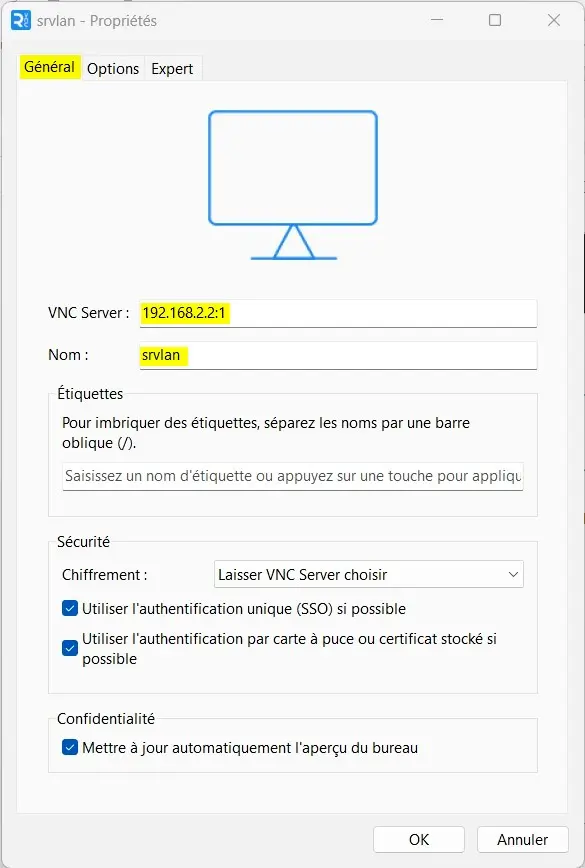{ width="430" }
  <figcaption>VNC Viewer : Paramètres onglet Général</figcaption>
</figure>

-> Onglet Options  
Paramétrez VNC Viewer comme ci-dessous :

<figure markdown>
  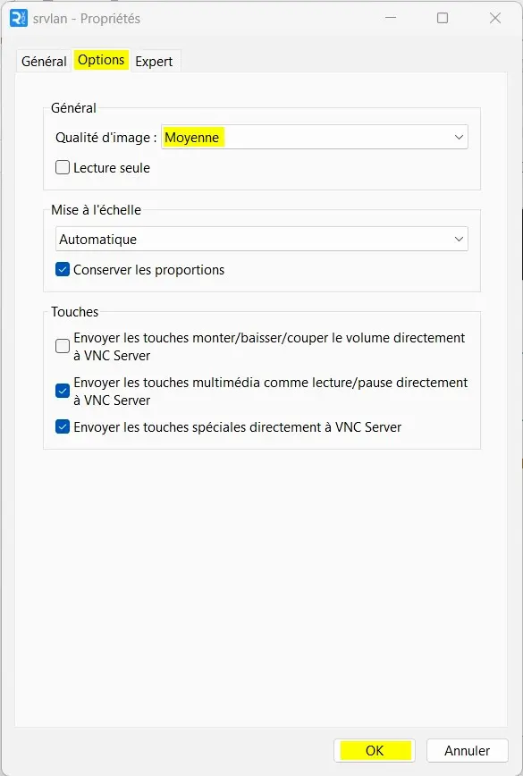{ width="430" }
  <figcaption>VNC Viewer : Paramètres onglet Options</figcaption>
</figure>

Résultat, VNC Viewer montre la nouvelle connexion :

<figure markdown>
  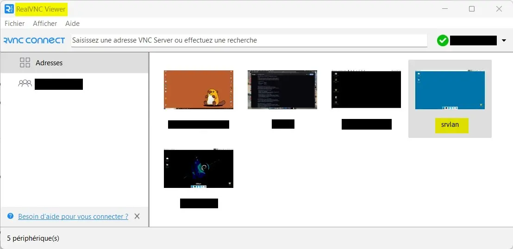{ width="430" }
  <figcaption>VNC Viewer : Connexion VNC créée pour srvlan</figcaption>
</figure>

Test de connexion :  
-> Double-cliquez sur l'icône srvlan

Une fenêtre Chiffrement s'ouvre :  
-> Cochez Ne plus afficher cet avertissement  
-> Continuer

Une fenêtre Authentification s'ouvre :  
-> Entrez votre MDP VNC pour srvlan > OK

Connexion établie, la fenêtre suivante s'affiche :

<figure markdown>
  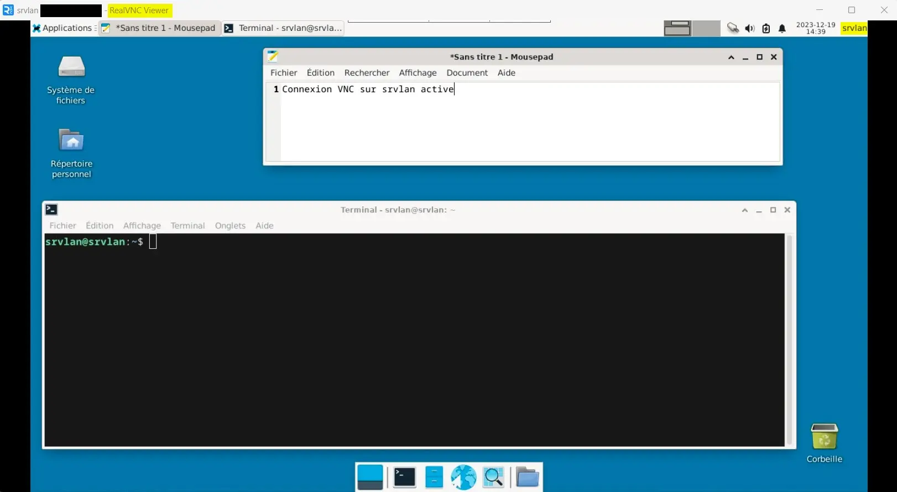{ width="430" }
  <figcaption>VNC Viewer : Session VNC ouverte sur srvlan</figcaption>
</figure>

\- - Depuis un PC distant sous Linux  
a) Téléchargez le client [VNC Viewer](https://www.realvnc.com/fr/connect/download/viewer/){ target="_blank" } de votre version Linux.  
Effectuez son installation et démarrez le logiciel.  
Procédez ensuite comme sous Windows.

b) Remmina peut également exploiter le protocole VNC.  
Cliquez sur l'icône + (profil) située en haut à gauche.

Une fenêtre Profil de connexion à distance s'ouvre.  
Configurez la connexion VNC comme ci-dessous :

<figure markdown>
  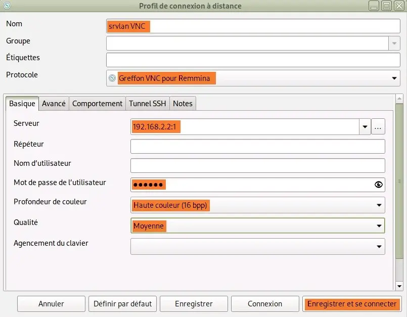{ width="430" }
  <figcaption>Remmina : Fenêtre de configuration/connexion VNC</figcaption>
</figure>

Le MDP de l'utilisateur = Votre MDP VNC _( [Voir ci-dessus](#serveur-vnc) )_

### SSH sur srvsec (IPFire)

Par défaut, un serveur SSH (Secure SHell) écoute sur le port TCP 22.

#### _- Activation du serveur SSH_

Accédez à l'interface graphique d'IPFire depuis le navigateur Web de srvlan :  
-> Système > Accès SSH

Une fenêtre Accès distant s'ouvre :  
-> Cochez Accès SSH  
-> Décochez Définir le port SSH à 22  
-> Bouton Sauvegarder

#### _- Règle de pare-feu SSH_

Accédez à l'interface graphique d'IPFire depuis le navigateur Web de srvlan :  
-> Pare-feu > Règles de pare-feu > Nouvelle règle

\- Zone Source  
-> Cochez Réseaux standards > Sélectionnez Tout

\- Zone Destination  
-> Cochez Réseaux standards > Sélectionnez Tout

\- Zone Protocole  
-> Sélectionnez TCP > Port de destination  
-> Remplissez le champ vide avec le n° de port ==222==

-> Cochez ACCEPTER

\- Zone Paramètres additionnels  
-> Remarque  
-> Entrez Connexions SSH entrantes autorisées

-> Ajouter > Appliquer les changements

<figure markdown>
  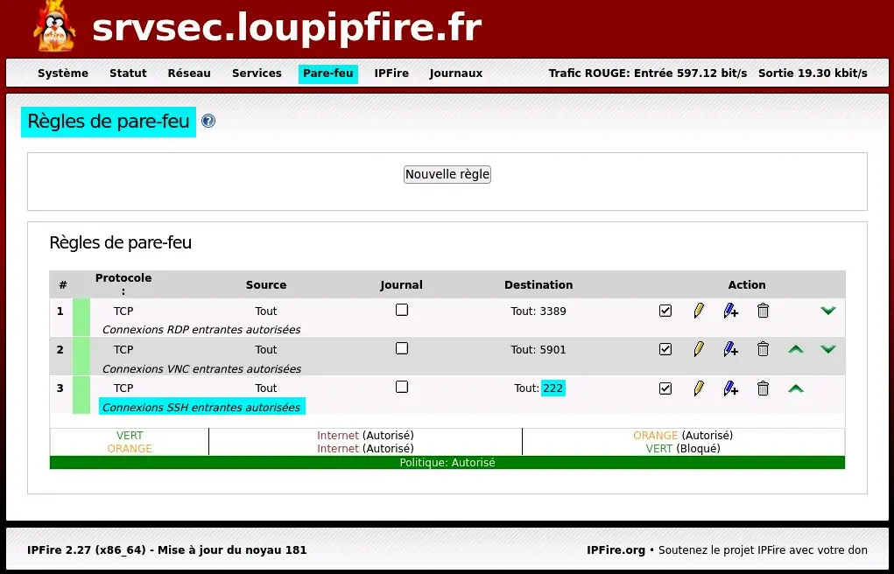{ width="430" }
  <figcaption>IPFire : Règle de pare-feu SSH</figcaption>
</figure>

#### _- Test de connexion SSH_

\- - Depuis un PC distant sous Windows  
Téléchargez le client SSH [Putty](https://www.putty.org/){ target="_blank" } et installez celui-ci.

Ensuite, démarrez et configurez Putty comme suit :

<figure markdown>
  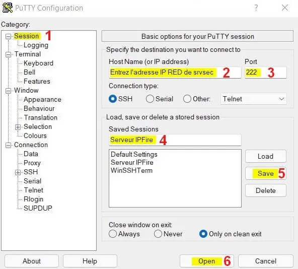{ width="430" }
  <figcaption>Putty : Configuration SSH pour IPFire</figcaption>
</figure>

La VM srvsec étant de confiance, acceptez l'alerte de sécurité et lancez une seconde connexion.

Résultat :

<figure markdown>
  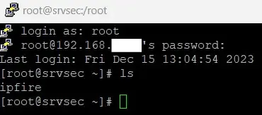
  <figcaption>Putty : Connexion SSH établie sur IPFire</figcaption>
</figure>

Il n'y aura pas d'alerte de sécurité lors des connexions suivantes, utilisez la Cde exit pour quitter.

\- - Depuis un PC distant sous Linux  
a) Installez le paquet putty fourni par votre distribution.  
Procédez ensuite comme sous Windows.

b) Remmina peut également exploiter le protocole SSH.  
Cliquez sur l'icône + (profil) située en haut à gauche.

Une fenêtre Profil de connexion à distance s'ouvre.  
Configurez la connexion SSH comme ci-dessous :

<figure markdown>
  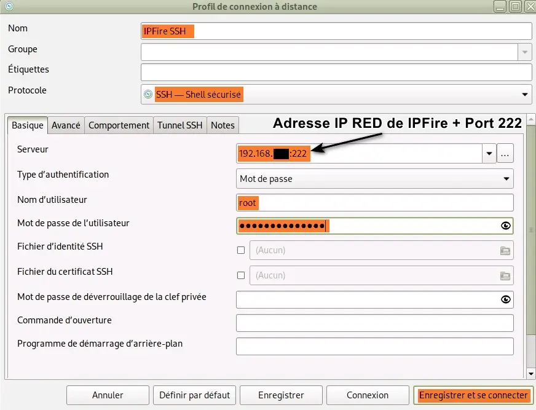{ width="430" }
  <figcaption>Remmina : Configuration SSH pour IPFire</figcaption>
</figure>

### SSH sur ovs (OpenvSwitch)

#### _- Serveur SSH sur ovs_

Installez le serveur OpenSSH :

```bash
[switch@ovs:~$] sudo apt install openssh-server
```

et contrôlez l'activation du démon SSH :

```bash
[switch@ovs:~$] sudo systemctl status sshd
```

Le résultat de la Cde doit montrer active (running).

Editez ensuite le fichier de configuration sshd_config :

```bash
[switch@ovs:~$] sudo nano /etc/ssh/sshd_config
```

et remplacez la ligne #Port 22 par Port 222.

Redémarrez le serveur pour traiter la modification :

```bash
[switch@ovs:~$] sudo systemctl restart sshd
```

#### _- Test de connexion sur ovs_

Effectuez une connexion à l'aide de Putty :

<figure markdown>
  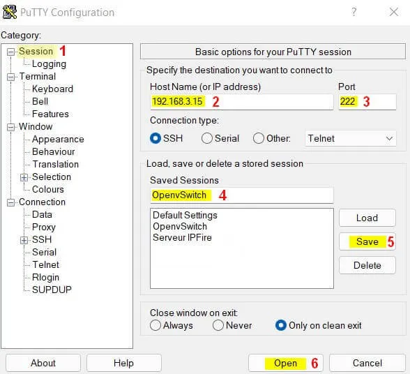{ width="430" }
  <figcaption>Putty : Configuration SSH pour OpenvSwitch</figcaption>
</figure>

Résultat :

<figure markdown>
  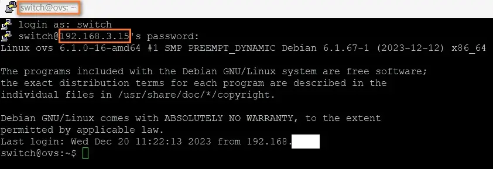{ width="430" }
  <figcaption>Putty : Connexion SSH établie sur OpenvSwitch</figcaption>
</figure>

### SSH sur les conteneurs LXC

#### _- Conteneur Podman ctn1_

Installez depuis l'hôte ovs un serveur SSH sur ctn1 :

```bash
[switch@ovs:~$] sudo podman exec -it ctn1 bash

[root@..:~#] apt update && apt upgrade
[root@..:~#] apt install openssh-server
```

Editez ensuite son fichier de configuration sshd_config :

```bash
[root@..:~#] apt install nano
[root@..:~#] nano /etc/ssh/sshd_config
```

et modifiez les 2 lignes suivantes comme ci-dessous :  
\#Port 22 > Port 222  
\#PermitRootLogin prohib...word > PermitRootLogin ==yes==

Redémarrez le serveur SSH pour traiter la configuration :

```bash
[root@..:~#] /etc/init.d/ssh start
[root@..:~#] /etc/init.d/ssh status     # normal = sshd is running
```

Attribuez un MDP à l'utilisateur root du conteneur :

```bash
[root@..:~#] passwd
```

Editez le fichier .bashrc de l'utilisateur root :

```bash
[root@..:~#] nano /root/.bashrc
```

et entrez le contenu suivant en fin de fichier :

```bash
# Lancement automatique du serveur ssh
/etc/init.d/ssh start
```

Ensuite, déconnectez-vous du conteneur :

```bash
[root@...:~#] exit

[switch@ovs:~$] 
```

et listez les images Podman utilisées en mode rootfull :

```bash
[switch@ovs:~$] sudo podman images
```

Retour :

```yaml
switch@ovs:~$ sudo podman images
REPOSITORY                      TAG         
localhost/uptime-kuma           2           ...
localhost/debian                1           ...
docker.io/louislam/uptime-kuma  1           ...
docker.io/library/debian        latest      ...
switch@ovs:~$
```

Créez une nouvelle image de ctn1 incluant le SSH :

```bash
sudo podman commit ctn1 debian:2       # Création image tag 2
```

et recréez ctn1 depuis celle-ci :

```bash
sudo systemctl stop container-ctn1         # Suppression de ctn1
sudo podman ps                          # Vérification de la suppression

sudo podman run -dit --net ns:/var/run/netns/nsctn1 --name ctn1 debian:2         # Création ctn1 depuis image tag 2

cd /etc/systemd/system

sudo podman generate systemd --new --files --name ctn1
cat container-ctn1.service                         # Lecture par curiosité

sudo systemctl daemon-reload
sudo systemctl start container-ctn1
sudo systemctl status container-ctn1
```

Redémarrez la VM ovs :

```bash
sudo reboot
```

et connectez-vous depuis Putty en procédant comme pour la VM ovs mais avec l'IP 192.168.3.6.

#### _- Conteneurs ctn2 et ctn3_

Les 2 conteneurs basés sur Debian supportent l'outil de surveillance réseau Uptime Kuma dont la configuration s'effectue directement depuis son interface Web.

Pour interagir avec Debian, utilisez l'accès SSH de la VM ovs et exploitez les 2 Cdes suivantes :

```bash
[switch@ovs:~$] sudo podman exec -it ctn2 bash

[switch@ovs:~$] podman exec -it ctn3 bash
```

### VNC au travers d'un tunnel SSH

De base, une connexion VNC n'est pas sécurisée mais il est possible de faire transiter celle-ci à l'intérieur d'un tunnel SSH pour régler ce problème.

Ceci implique de configurer le serveur SSH d'IPFire afin qu'il accepte le transfert de ports TCP.

Accédez à l'interface graphique d'IPFire depuis le navigateur Web de srvlan :  
-> Système > Accès SSH

Une fenêtre Accès distant s'ouvre :  
-> Cochez Autoriser le transfert TCP  
-> Bouton Sauvegarder

#### _- VNC/SSH depuis Windows_

Configurez un tunnel SSH avec Putty en respectant la chronologie des 2 captures suivantes :

<figure markdown>
  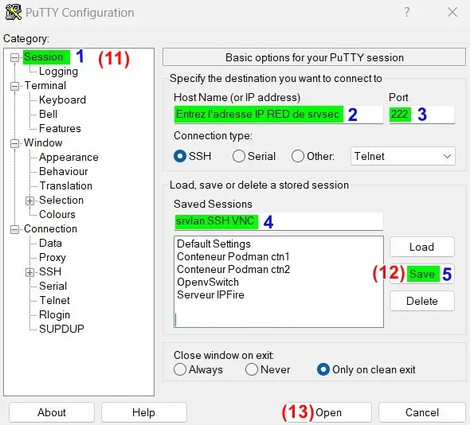{ width="430" }
  <figcaption>Putty : Configuration tunnel SSH pour VNC</figcaption>
</figure>

<figure markdown>
  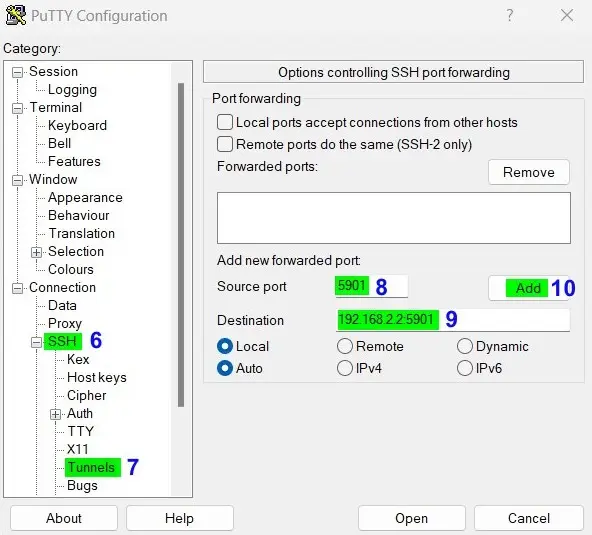{ width="430" }
  <figcaption>Putty : Configuration tunnel SSH pour VNC</figcaption>
</figure>

Puis lancez, depuis le client VNC Viewer de RealVNC, une connexion VNC locale (127.0.0.1) :

<figure markdown>
  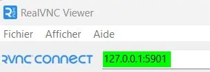
  <figcaption>RealVNC : Demande d'une connexion VNC locale</figcaption>
</figure>

La demande locale d'accès au port TCP 5901 utilisé par le protocole VNC sera automatiquement envoyée à l'intérieur du tunnel SSH vers le serveur SSH d'IPFire qui transfèrera celle-ci vers le serveur VNC de srvlan.

Pensez à fermer, une fois votre communication VNC terminée, la connexion SSH de Putty.

#### _- VNC/SSH depuis Linux_

Le plus simple est d'utiliser de nouveau Remmina.  
Cliquez sur l'icône + (profil) située en haut à gauche.

Une fenêtre Profil de connexion à distance s'ouvre.  
Configurez la connexion VNC comme ci-dessous :

<figure markdown>
  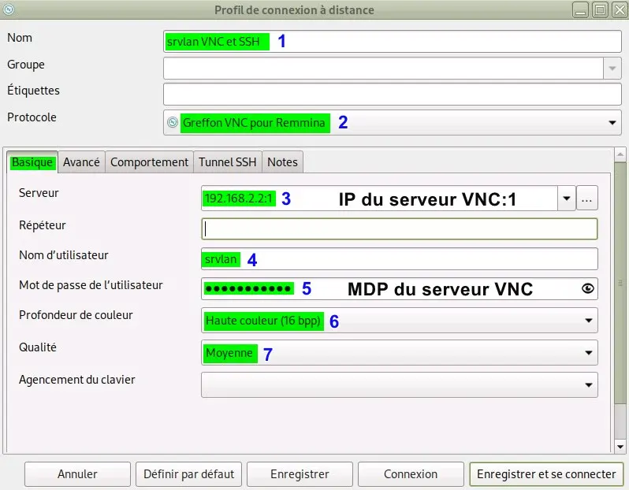{ width="430" }
  <figcaption>Remmina : Configuration VNC avec tunnel SSH</figcaption>
</figure>

<figure markdown>
  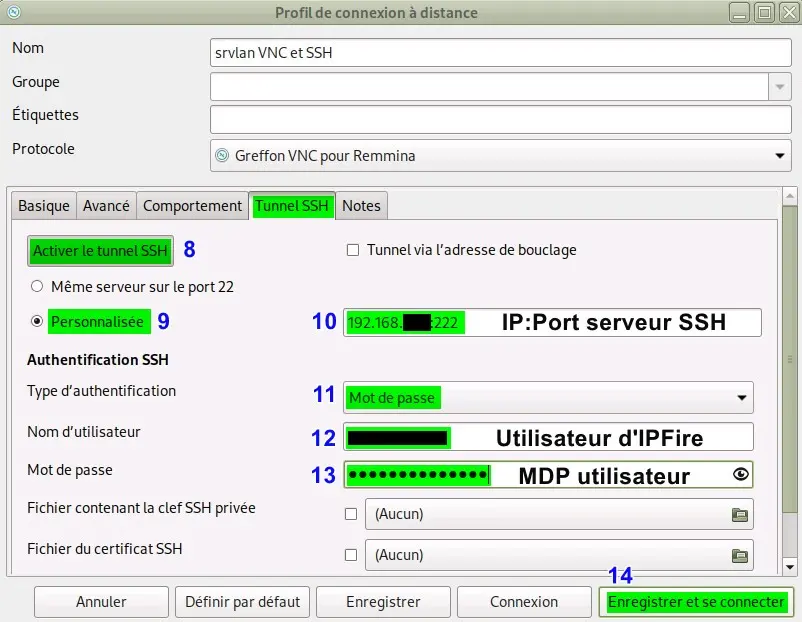{ width="430" }
  <figcaption>Remmina : Configuration VNC avec tunnel SSH</figcaption>
</figure>

La connexion SSH sera cette fois fermée automatiquement en fin de communication VNC.

### Bilan

Les VM et conteneurs LXC sont joignables à distance.

La sécurité des accès reste néanmoins perfectible :  
\- En ne travaillant pas avec des n° de port par défaut.  
\- En réglant plus finement les sources dans IPFire.  
\- En utilisant les clés publiques et privées de SSH.  
\- Etc...

{ align=left }

&nbsp;  
Terminé pour l'instant !  
Le mémento 7.1 vous attend  
pour l'installation d'un serveur  
DNS statique sur srvlan.

!!! Info "Mémento 7.1 en cours de construction"
