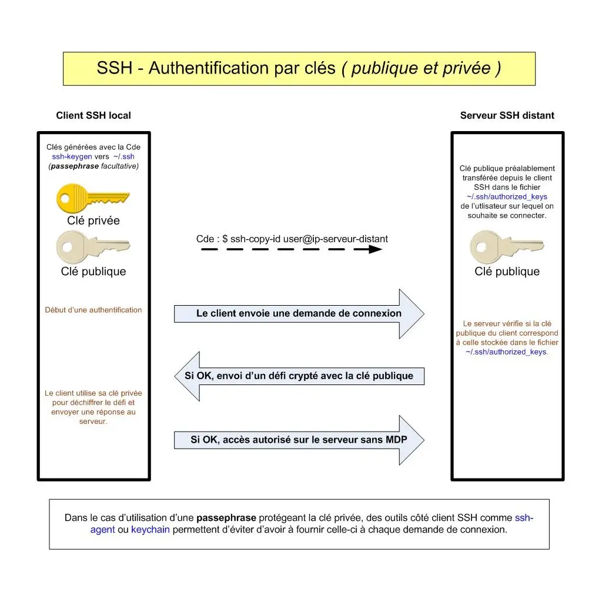
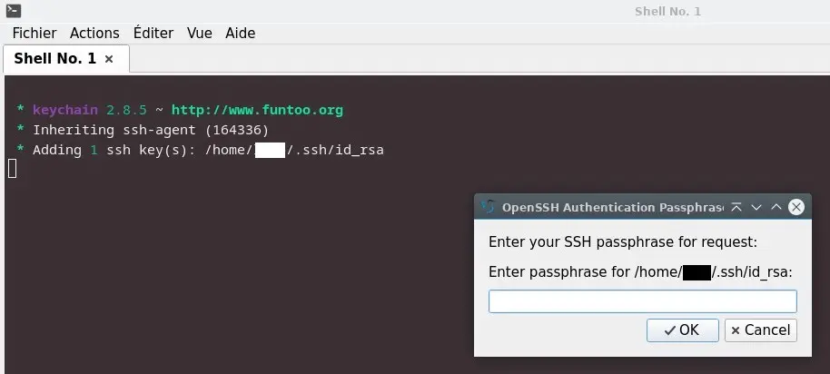
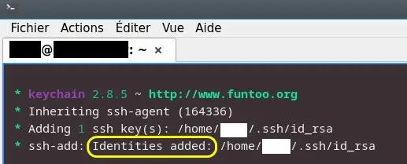
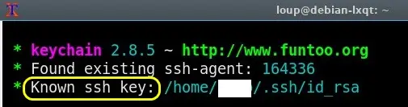

<figure markdown>
  { width="430" }
</figure>

## Authentification par clés

L'authentification par clés, méthode plus sécurisée que celle faisant appel au MDP, repose sur une paire de clés cryptographiques ==publique== et ==privée== créée sur le client.

Le client identifiera le serveur à l'aide de sa clé publique préalablement transférée dans le fichier ~/.ssh/authorized_keys du compte utilisateur distant.

Lors d'une demande de connexion, le serveur retournera un défi crypté à l'aide de cette clé publique.

Le client déchiffrera le défi avec sa clé privée et renverra une réponse.

Si la réponse convient, le serveur autorisera l'accès sur le compte utilisateur distant, sans demander de MDP.

1. - [Création des clés SSH](#création-des-clés-ssh)
2. - [Transfert de la clé publique](#transfert-cle-pub)
3. - [Configuration côté serveur](#config-serveur-ssh)
4. - [Connexion sur le serveur](#connexion-ssh)
5. - [Agent SSH _(côté client)_](#agent-ssh)
6. - [Keychain _(côté client)_](#keychain)

### Création des clés SSH {#création-des-clés-ssh}

Pour info, certains clients graphiques tels Putty et Xshell disposent d'un générateur de clés SSH.

Sur Debian, OpenSSH fournit la Cde ssh-keygen qui par défaut crée un dossier caché ~/.ssh et y génère une paire de clés de noms id_rsa et id_rsa.pub.

Sur votre ordinateur local _(client SSH)_, générez la paire de clés comme suit :

```bash
cd /home/user
ssh-keygen
```

Retour :

```markdown
Generating public/private rsa key pair.
Enter file in which to save the key (/home/user/.ssh/id_rsa):
```

<!-- more -->

Validez le chemin proposé par défaut.

Retour :

```markdown
Created directory '/home/user/.ssh'.
Enter passphrase (empty for no passphrase):
```

Entrez un MDP _(passphrase)_ qui protégera notamment la clé privée en cas de vol de celle-ci.

Retour :

```markdown
Enter same passphrase again:
```

Entrez de nouveau le MDP.

Retour :

```markdown
Your identification ... saved in /home/user/.ssh/id_rsa
Your public key ... saved in /home/user/.ssh/id_rsa.pub
The key fingerprint is:
SHA256:K5jPkzROR40crm9vQacssDgqbq... user@hostname
The key's randomart image is:
+---[RSA 3072]----+
|                 |
|        .        |
|       o +       |
|      . = o . .  |
|     . =So o B   |
|    oo.o.+ …     |
|   .o=o=o. oE….  |
|oo= .++oo o . .  |
|+*=B. oo.+.      |
+----[SHA256]-----+
```

Pour finir, vérifiez la présence de la paire de clés dans le dossier /home/user/.ssh/.

Nota : La passphrase est facultative mais celle-ci augmente la sécurité et est donc conseillée.

### Transfert de la clé publique {#transfert-cle-pub}

La Cde ssh-copy-id incluse dans OpenSSH permet le transfert de la clé publique, mais l'usage de celle-ci nécessite de déjà disposer d’un accès SSH sur le serveur basé sur un MDP.

Si OK, transférez la clé publique comme suit :

```bash
cd /home/user
ssh-copy-id user@ip-serveur-distant
```

Retour :

```markdown
/usr/bin/ssh-copy-id: INFO: Source of key(s) to be installed: "/home/user/.ssh/id_rsa.pub"

/usr/bin/ssh-copy-id: INFO: attempting to log in with the new key(s), to filter out any that are already installed

/usr/bin/ssh-copy-id: INFO: 1 key(s) remain to be installed -- if you are prompted now it is to install the new keys

user@ip-serveur-distant's password:
```

Entrez le MDP d'accès au serveur SSH.

Retour :

```markdown
Number of key(s) added: 1

Now try logging into the machine, with: "ssh 'user@ip-serveur-distant'"
and check to make sure that only the key(s) you wanted were added.
```

Normalement, un dossier ~/.ssh a été créé sur le serveur incluant un fichier authorized_keys contenant la clé publique du client SSH.

Les permissions doivent être à 700 pour le dossier .ssh et 600 pour le fichier authorized_keys.

A défaut utilisez la Cde chmod pour ajuster celles-ci.

Pour info, la clé publique aurait également pu être copiée, par exemple depuis un client SFTP ou autre moyen, directement dans un fichier ~/.ssh/authorized_keys préalablement créé sur le serveur.

### Configuration côté serveur {#config-serveur-ssh}

Depuis le serveur, éditez la configuration SSH :

```bash
sudo nano /etc/ssh/sshd_config
```

et modifiez la valeur de ces 3 paramètres comme suit :

```markdown
PasswordAuthentication no             #Auth MDP interdite
PubkeyAuthentication yes         #Auth clés SSH autorisée
PermitRootLogin no     #Pas de connexion en tant que root
```

La sécurité du service SSH s'en trouvera ainsi améliorée.

Après modification, rechargez le service :

```bash
sudo systemctl reload sshd
```

### Connexion sur le serveur {#connexion-ssh}

Lancez à présent la Cde suivante depuis le client SSH :

```bash
ssh -p 22 user@ip-serveur-distant
```

Modifiez le n° de port si nécessaire _(22 par défaut)_.

Retour :

```markdown
Enter passphrase for key '/home/user/.ssh/id_rsa':
```

Entrez la phrase secrète de la clé privée.

Si OK, vous êtes maintenant connecté, le prompt affiché à l'intérieur de votre terminal a été remplacé par celui du serveur distant _(Ex : user@hostname-distant)_.

Quittez la connexion SSH avec la Cde exit :

```bash
user@hostname-distant:~$ exit
```

Retour :

```markdown
déconnexion
Connection to ip-serveur-distant closed.
```

Vous l'aurez remarqué, la configuration actuelle impose pour des raisons de sécurité d'entrer la passphrase pour ==chacune== des demandes de connexion SSH.

Les outils agent-ssh ou keychain présentés ci-dessous éviteront en partie d'avoir à entrer cette passphrase à chaque demande de connexion.

### Agent SSH _(côté client)_ {#agent-ssh}

L'outil ssh-agent inclus dans le paquet openssh-client stockera en mémoire, ceci pour ==toute la durée d'une session terminal==, la clé privée ainsi que la passphrase associée.

La passphrase sera demandée seulement lors de l'ajout de la clé privée à l'agent et non plus à chacune des demandes de connexion SSH.

Entrez la Cde suivante pour démarrez l'agent SSH :

```bash
eval "$(ssh-agent -s)"
```

L'agent est ainsi lancé en arrière-plan et des variables SSH_AUTH_SOCK et SSH_AGENT_PID sont définies pour la session terminal courante.

Vérifiez la création de ces 2 variables :

```bash
ssh-agent
```

Retour normal :

```markdown
SSH_AUTH_SOCK=/tmp/ssh-6c83TA4ghRKH/agent.142369; export SSH_AUTH_SOCK;
SSH_AGENT_PID=142370; export SSH_AGENT_PID;
echo Agent pid 142370;
```

Ajoutez enfin la clé privée rsa_id à l'agent comme ceci :

```bash
ssh-add /home/user/.ssh/id_rsa
```

La passphrase vous sera demandée à ce moment-là.

Pour vérifier que la clé est bien chargée :

```bash
ssh-add -l
```

Retour normal :

```markdown
user@hostname:~$ ssh-add -l
3072 SHA256:K5jWkzAOv40crm9vQa... user@hostname (RSA)
user@hostname:~$
```

Maintenant, éditez le fichier de configuration .bashrc :

```bash
cd /home/user
nano .bashrc
```

et entrez le contenu suivant en fin de fichier :

```markdown
# Démarrage de l'agent SSH
eval "$(ssh-agent -s)
```

L’agent se lancera ainsi automatiquement à chaque ouverture d'une session terminal.

Il ne restera qu'à ajouter la clé à l'agent pour pouvoir vous connecter plusieurs fois sur le serveur SSH distant sans avoir à fournir systématiquement la passphrase.

En revanche, si vous fermez la session terminal et en ouvrez une autre, vous devrez de nouveau ajouter la clé à l'agent SSH pour bénéficier du même avantage.

### Keychain _(côté client)_ {#keychain}

Keychain est un gestionnaire pour ssh-agent qui permet d'utiliser un ==même agent== SSH entre ==plusieurs sessions== terminal.

Seules les variables SSH_AUTH_SOCK/SSH_AGENT_PID diffèreront d'une session terminal à l'autre.

Avec Keychain, la passphrase ne sera demandée ==qu'une fois== lors de l'ouverture d'une première session terminal effectuée après le boot du système.

Pour commencer, installez keychain comme suit :

```bash
sudo apt install keychain
```

Puis, éditez le fichier de configuration .bashrc :

```bash
cd /home/user
nano .bashrc
```

et remplacez le contenu précédemment entré :

```markdown
# Démarrage de l'agent SSH
eval "$(ssh-agent -s)
```

par celui-ci :

```markdown
# Démarrage de keychain et chargement clé privée SSH
eval `keychain --eval --agents ssh id_rsa`
```

Redémarrez Debian, ouvrez un terminal et entrez la passphrase comme demandée :

<figure markdown>
  { width="580" }
  <figcaption>Keychain : Demande de la passphrase</figcaption>
</figure>

Une fois fait, le terminal montre la clé privée ajoutée :

<figure markdown>
  
  <figcaption>Keychain : Clé privée ajoutée à l'agent SSH</figcaption>
</figure>

Il est maintenant possible de se connecter sur le serveur SSH sans demande de passphrase, ceci même si vous fermez la session terminal courante et en ouvrez une autre dans un terminal comme UXTerm ci-dessous :

<figure markdown>
  
  <figcaption>Keychain : Clé privée déclarée connue de l'agent</figcaption>
</figure>

Seule une déconnexion de la session utilisateur imposera de devoir entrer de nouveau la passphrase.

Keychain rend ainsi l'exploitation des connexions SSH plus pratique.

<center>---------- Fin ----------</center>
