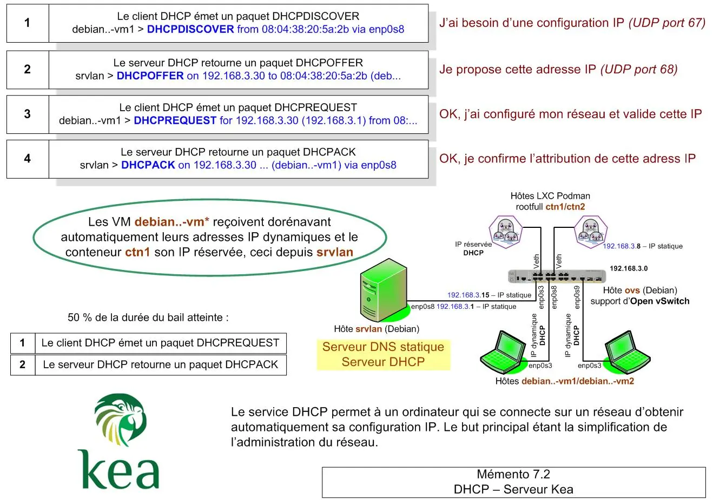

<figure markdown>
  { width="430" }
</figure>

## Mémento 7.2 - Kea DHCP Server

DHCP = **D**ynamic **H**ost **C**onfiguration **P**rotocol

Le DHCP sera activé sur la VM srvlan pour la zone LAN.

### Préambule

Il est aujourd'hui préconisé d'utiliser [Kea DHCP](https://www.isc.org/kea/){ target="_blank" } à la place d'ISC DHCP qui n'est plus maintenu.

#### _- Rôle du serveur DHCP_

Il permet à un hôte qui se connecte sur un réseau local d'obtenir automatiquement sa configuration IP, ceci pour une durée déterminée appelée bail DHCP.

But, faciliter l'affectation des adresses IP sur un réseau.

Les hôtes enregistrés via un serveur DHCP peuvent aussi être ajoutés dynamiquement à un serveur DNS.

DHCP représente donc une suite logique au DNS dans la construction du réseau local virtuel.

#### _- Fonctionnement global_

Le DHCP repose sur des requêtes UDP émises par les clients et traitées par le serveur.

Exemple d'un échange de requêtes client/serveur :

<!-- more -->

* DHCPDISCOVER - Le client cherche un serveur  
* DHCPOFFER - le 1er trouvé soumet une IP  
* DHCPREQUEST - Le client traite et valide l'IP  
* DHCPACK - Le serveur confirme la configuration  

Les requêtes UDP circulent sur les ports 67 et 68.

Le client au final reçoit une confirmation de son IP temporaire _(bail)_ ainsi que souvent en complément l'IP de sa passerelle ainsi que les IP de ses serveurs DNS.

!!! note "Nota"
    Si pas de serveur DHCP, le client s'attribue une adresse IP dans la plage 169.254.0.0/16.

Le serveur DHCP Kea utilisé ci-dessous est issu de l'organisme déjà créateur du serveur DNS BIND 9 soit l'Internet Software Consortium _(ISC)_.

### Installation et configuration

#### _- Installation du service Kea_

Installez ce paquet pour gérer la zone LAN en IPv4 :

```bash
[srvlan@srvlan] sudo apt install kea-dhcp4-server 
```

Les dépendances suivantes ont été ajoutées :

* kea-common
* liblog4cplus

Vérifiez le statut du service :

```bash
[srvlan@srvlan] sudo systemctl status kea-dhcp4-server
```

Retour normal :

```markdown hl_lines="3 16"
● kea-dhcp4-server.service - Kea IPv4 DHCP daemon
     Loaded: loaded (/usr/lib/systemd/system/kea-dhcp4-server.service; enabled; preset: enabled)
     Active: active (running) since Mon 2026-02-09 11:36:50 CET; 3min 8s ago
 Invocation: c6e1f34b0a834861a66759ee518542ab
       Docs: man:kea-dhcp4(8)
   Main PID: 2468 (kea-dhcp4)
      Tasks: 7 (limit: 1675)
     Memory: 3.7M (peak: 4M)
        CPU: 82ms
     CGroup: /system.slice/kea-dhcp4-server.service
             └─2468 /usr/sbin/kea-dhcp4 -c /etc/kea/kea-dhcp4.conf

févr. ... kea-dhcp4[2468]: INFO  COMMAND_ACCEPTOR_START Starting to accept connections via unix domain ...
...
...
févr. ... kea-dhcp4[2468]: INFO  DHCP4_STARTED Kea DHCPv4 server version 2.6.3 started
```

Le service est démarré et activé par défaut _(enabled)_.

#### _- Configuration_

Le fichier de configuration kea-dhcp4.conf se trouve dans le dossier /etc/kea/.

Sauvegardez celui-ci en le renommant ainsi :

```bash
[srvlant@srvlan] sudo mv /etc/kea/kea-dhcp4.conf /etc/kea/kea-dhcp4.conf_save
```

Créez ensuite un nouveau fichier kea-dhcp4.conf :

```bash
[srvlant@srvlan] sudo nano /etc/kea/kea-dhcp4.conf
```

et entrez ce qui suit en respectant le format JSON :

```json hl_lines="48"
// Serveur DHCP Kea
// Configuration de base IPv4

{
"Dhcp4": {
    // Interface réseau enp0s8 en écoute DHCP.
    "interfaces-config": {
        "interfaces": ["enp0s8"]
    },

    // Serveur en autorité DHCP pour la zone LAN.
    "authoritative": true,

    // Pas de MAJ dynamique du serveur DNS Bind9.
    "ddns-send-updates" : false,

    // Position du fichier contenant les baux DHCP.
    "lease-database": {
        "type": "memfile",
        "persist": true,
        "name": "/var/lib/kea/kea-leases4.csv",
        "lfc-interval": 3600
    },

    // Bail (renew=50%,rebind=87.5%,valid=100%=8H).
    "renew-timer": 14400,
    "rebind-timer": 27720,
    "valid-lifetime": 28800,

    "option-data": [
        // Serveur DNS proposé aux clients DHCP.
        {
            "name": "domain-name-servers",
            "data": "192.168.3.1"
        },
        
        // Domaine proposé aux clients pour
        // résoudre les noms d'hôtes via le DNS.
        {
            "name": "domain-search",
            "data": "intra.loupipfire.fr"
        }
    ],

    // Plage d'adresses IP pour la zone LAN.
    "subnet4": [
        {
            "id":1,
            "subnet": "192.168.3.0/24",
            "pools": [ { "pool": "192.168.3.30 - 192.168.3.50" } ],
            "option-data": [
                {
                    "name": "routers",
                    "data": "192.168.3.1"
                }
            ],
            
            // IP et noms d'hôtes réservés.
            "reservations": [
                {
                    "hw-address": "e2:f0:31:2a:b6:05",
                    "ip-address": "192.168.3.20",
                    "hostname": "ctn1"
                }
            ]
        }
    ]
}
}
```

!!! note "Nota"
     La ligne "id":1, est à priori inutile sous Debian 12.

Remarques :

\- La carte enp0s8, située côté LAN, sera surveillée par le serveur DHCP.

\- A 50% de la durée du bail, la séquence de prolongation/renouvellement de celui-ci débutera.

\- L'IP fixe réservée pour ctn1 se situe en dehors de la plage des IP dédiée aux autres clients.

\- Attention, l'adresse MAC de ctn1 actuellement dynamique devra être déclarée fixe ci-dessous.

Redémarrez le service DHCP et vérifiez son statut :

```bash
[srvlan@srvlan] sudo systemctl restart kea-dhcp4-server
[srvlan@srvlan] sudo systemctl status kea-dhcp4-server 
```

Retour du statut sous Debian 13 :

```markdown hl_lines="3 13 20 22"
● kea-dhcp4-server.service - Kea IPv4 DHCP daemon
     Loaded: loaded (/usr/lib/systemd/system/kea-dhcp4-server.service; enabled; preset: enabled)
     Active: active (running) since Mon 2026-02-09 12:29:31 CET; 4min 38s ago
 Invocation: 06184716b85c4a4c9e40404b4e2be7de
       Docs: man:kea-dhcp4(8)
   Main PID: 2687 (kea-dhcp4)
      Tasks: 7 (limit: 1675)
     Memory: 2.7M (peak: 2.9M)
        CPU: 69ms
     CGroup: /system.slice/kea-dhcp4-server.service
             └─2687 /usr/sbin/kea-dhcp4 -c /etc/kea/kea-dhcp4.conf

févr. ... DHCPSRV_CFGMGR_ADD_IFACE listening on interface enp0s8
févr. ... DHCPSRV_CFGMGR_SOCKET_TYPE_DEFAULT "dhcp-socket-type" not specified , using default ... raw
févr. ... DHCP4_CONFIG_COMPLETE DHCPv4 server has completed ...: added IPv4 subnets: 1; DDNS: disabled
févr. ... DHCPSRV_MEMFILE_DB opening memory file lease database: ... name=/var/lib/kea/kea-leases4.csv ...
févr. ... DHCPSRV_MEMFILE_LEASE_FILE_LOAD loading leases from file /var/lib/kea/kea-leases4.csv
févr. ... DHCPSRV_MEMFILE_EXTRACT_EXTENDED_INFO4 extracting extended info saw 0 leases, extended ...
févr. ... DHCPSRV_MEMFILE_LFC_SETUP setting up the Lease File Cleanup interval to 3600 sec
févr. ... DHCPSRV_CFGMGR_USE_ALLOCATOR using ... for V4 leases in subnet 192.168.3.0/24
févr. ... DHCP4_MULTI_THREADING_INFO enabled: yes, number of threads: 2, queue size: 64
févr. ... DHCP4_STARTED Kea DHCPv4 server version 2.6.3 started
```

Celui-ci ne montre pas d'erreur, le service DHCP sera lancé automatiquement au boot de srvlan.

Vérifiez l'utilisation par le service du port UDP 67 :

```bash
[srvlan@srvlan] sudo ss -anup | grep dhcp
```

Retour :

```markdown
UNCONN 0  0  192.168.3.1:67  0.0.0.0:*  users:(("kea-dhcp4",pid=2687,fd=11))
```

### Gestion des logs DHCP

#### _- Création d'un fichier de logs_

Editez le fichier de configuration kea-dhcp4-server :

```bash
[srvlan@srvlan] sudo nano /etc/kea/kea-dhcp4.conf
```

et entrez ce qui suit sous la section subnet4 :

```json hl_lines="3 12"
"subnet4": [
        ... 
    ],


    // Gestion des logs du serveur DHCP.
    "loggers": [
        {
          "name": "kea-dhcp4",
          "output_options": [
            {
              "output": "/var/log/kea/kea-dhcp4.log",
              "pattern": "%D{%Y-%m-%d %H:%M:%S.%q} %-5p %m\n"
            }
          ],
          "severity": "INFO",
          "debuglevel": 0
        }
      ]


// Ci-dessous, accolades existantes
}
}
```

!!! note "nota"
    Ne pas oublier d'ajouter une virgule derrière le crochet de fin de section subnet4.

Redémarrez le serveur DHCP :

```bash
[srvlan@srvlan] sudo systemctl restart kea-dhcp4-server
[srvlan@srvlan] sudo systemctl status kea-dhcp4-server 
```

et affichez le contenu du fichier kea-dhcp4.log qui a été créé dans le dossier /var/log/kea/.

```bash
[srvlan@srvlan] sudo cat /var/log/kea/kea-dhcp4.log 
```

### Modification du DNS statique

Ouvrez le fichier DNS de zone directe intra.loupipfire.fr :

```bash
[srvlan@srvlan] cd /etc/bind
[srvlan@srvlan] sudo nano db.intra.loupipfire.fr.directe 
```

et supprimez ou commentez _(;)_ les 4 lignes suivantes :

```markdown
debian-vm1   IN   A   192.168.3.2
debian-vm2   IN   A   192.168.3.4
ctn1         IN   A   192.168.3.6
ctn2         IN   A   192.168.3.8      
```

Ouvrez le fichier DNS de zone inverse intra.loupipfire.fr :

```bash
[srvlan@srvlan] sudo nano db.intra.loupipfire.fr.inverse 
```

et supprimez ou commentez _(;)_ les 4 lignes suivantes :

```markdown
2 IN PTR debian-vm1.intra.loupipfire.fr. 
4 IN PTR debian-vm2.intra.loupipfire.fr.
6 IN PTR ctn1.intra.loupipfire.fr.
8 IN PTR ctn2.intra.loupipfire.fr. 
```

Relancez le service DNS :

```bash
[srvlan@srvlan] sudo systemctl restart bind9 
```

!!! note "Nota"
    Ne modifiez pas les lignes des hôtes srvlan/ovs.

### Tests du service Kea

#### _- Préparation_

Au préalable, éditez le fichier apparmor suivant :

```bash
[srvlan@srvlan] cd /etc/apparmor.d
[srvlan@srvlan] sudo nano usr.sbin.kea-dhcp4 
```

et ajoutez ce contenu à la fin de celui-ci :

```markdown
# Section ajoutée pour tracer les messages DHCP
  owner /var/log/kea/kea-dhcp4.packets.log rw,
  owner /var/log/kea/kea-dhcp4.packets.log.[0-9]* rw,
  owner /var/log/kea/kea-dhcp4.packets.log.lock rwk,

// Ci-dessous, accolade existante
} 
```

Ceci permettra de créer un fichier kea-dhcp4.packets.log qui stockera les messages DHCP clients <- -> serveur.

Il est parallèlement nécessaire de modifier cet autre fichier apparmor :

```bash
[srvlan@srvlan] sudo nano usr.sbin.kea-lfc 
```

en ajoutant ce contenu sous la ligne "owner /var/log/kea/kea-dhcp6.log w," :

```markdown
owner /var/log/kea/kea-dhcp4.packets.log w,
```

Editez ensuite le fichier de configuration du serveur :

```bash
[srvlan@srvlan] sudo nano /etc/kea/kea-dhcp4.conf 
```

et ajoutez ce contenu à l'intérieur de la section loggers :

```json
// Gestion des logs du serveur DHCP.
    "loggers": [
        {
          "name": "kea-dhcp4",
          ...
        },

        {
          "name": "kea-dhcp4.packets",
          "output_options": [
            {
              "output": "/var/log/kea/kea-dhcp4.packets.log",
              "maxver": 3
            }
          ],
          "severity": "DEBUG",
          "debuglevel": 99
        }

// Ci-dessous, crochet et accolades existants
      ]
}
} 
```

!!! note "Nota"
    Ne pas oublier d'ajouter une virgule derrière l'accolade de fin du name précédent.

Redémarrez les services AppArmor et DHCP :

```bash
[srvlan@srvlan] sudo systemctl restart apparmor
[srvlan@srvlan] sudo systemctl status apparmor

[srvlan@srvlan] sudo systemctl restart kea-dhcp4-server
[srvlan@srvlan] sudo systemctl status kea-dhcp4-server  
```

Un fichier vide kea-dhcp4.packets.log a été créé dans le dossier /var/log/kea/.

Ouvrez à présent un second terminal et connectez-vous en tant que root _(Cde : su root)_.

Entrez la Cde de traçage qui permettra d'observer en temps réel les messages DHCP échangés :

```bash
[root@srvlan] tail -f /var/log/kea/kea-dhcp4.packets.log  
```

#### _- Test depuis debian-vm*_

Référez-vous au [Mémento 4.1](../posts/clients-debian-vm1-vm2-creation.md){ target="_blank" } pour modifier les paramètres réseau.

\- VM debian-vm1

Ajustez la Méthode de l'onglet Paramètres IPv4 sur Automatique (DHCP).

Supprimez ensuite l'adresse IP statique et enregistrez.

Redémarrez la VM Debian :

```bash
[clientlinux@debian-vm1] sudo reboot  
```

et contrôlez l'affectation d'une nouvelle adresse IP :

```bash
[clientlinux@debian-vm1] ip address 
```

qui doit faire partie de la plage DHCP du serveur DHCP.

Démarrez Firefox et vérifiez le bon accès à Internet.

\- VM srvlan  
Vérifiez que le terminal de traçage contient ces lignes :

```markdown
DEBUG [kea...] DHCP4_BUFFER_RECEIVED ... from 0.0.0.0:68 to 255.255.255.255:67 over interface enp0s8
DEBUG [kea...] DHCP4_SUBNET_SELECTED [hwtype=1 08:00:27:...], cid..., tid...: the subnet with ID 1 was ...
DEBUG [kea...] DHCP4_SUBNET_DATA [hwtype=1 08:00:27:...], cid..., tid...: ... details: 192.168.3.0/24
INFO  [kea...] DHCP4_PACKET_RECEIVED [hwtype=1 08:00:27:...], cid..., tid...: DHCPDISCOVER ... enp0s8
DEBUG [kea...] DHCP4_QUERY_DATA [hwtype=1 08:00:27:...], cid..., tid..., packet ...type=DHCPDISCOVER ...
options:
  type=012, len=010: "debian-vm1" (string)
  ...
  type=061, len=007: 01:08:00:27:a0:d2:05

DEBUG [kea...] DHCP4_SUBNET_SELECTED [hwtype=1 08:00:27:...], cid..., tid...: the subnet with ID 1 was ...
DEBUG [kea...] DHCP4_SUBNET_DATA [hwtype=1 08:00:27:...], cid..., tid...: ... details: 192.168.3.0/24
INFO  [kea...] DHCP4_PACKET_SEND [hwtype=1 08:00:27:...], cid..., tid...: trying ... DHCPOFFER ... from 192.168.3.1:67 to 192.168.3.30:68 on ... enp0s8
DEBUG [kea...] DHCP4_RESPONSE_DATA [hwtype=1 08:00:27:...], cid..., tid...: responding ... DHCPOFFER ..., ... local...3.1:67, remote...3.30:68, ...,
options:
  ...
  type=003, len=004: 192.168.3.1
  ...
  type=051, len=004: 28800 (uint32)
  ...
  type=058, len=004: 14400 (uint32)
  type=059, len=004: 27720 (uint32)
  ...
  type=119, len=021: "intra.loupipfire.fr." (fqdn)

DEBUG [kea...] DHCP4_BUFFER_RECEIVED ... from 0.0.0.0:68 to 255.255.255.255:67 over interface enp0s8
DEBUG [kea...] DHCP4_SUBNET_SELECTED [hwtype=1 08:00:27:...], cid..., tid...: the subnet with ID 1 was ...
DEBUG [kea...] DHCP4_SUBNET_DATA [hwtype=1 08:00:27:...], cid..., tid...: ... details: 192.168.3.0/24
INFO  [kea...] DHCP4_PACKET_RECEIVED [hwtype=1 08:00:27:...], cid..., tid...: DHCPREQUEST ... enp0s8
DEBUG [kea...] DHCP4_QUERY_DATA [hwtype=1 08:00:27:...], cid..., tid..., packet ...type=DHCPREQUEST ...
options:
  ...
  type=050, len=004: 192.168.3.30 (ipv4-address)
  ...

DEBUG [kea...] DHCP4_SUBNET_SELECTED [hwtype=1 08:00:27:...], cid..., tid...: the subnet with ID 1 was ...
DEBUG [kea...] DHCP4_SUBNET_DATA [hwtype=1 08:00:27:...], cid..., tid...: ... details: 192.168.3.0/24
INFO  [kea...] DHCP4_PACKET_SEND [hwtype=1 08:00:27:...], cid..., tid...: trying ... DHCPACK ... from 192.168.3.1:67 to 192.168.3.30:68 on ... enp0s8
DEBUG [kea...] DHCP4_RESPONSE_DATA [hwtype=1 08:00:27:...], cid..., tid...: responding ... DHCPACK ..., ... local...3.1:67, remote...3.30:68, ...,
options:
  ... 
```

et que le fichier des baux /var/lib/kea/kea-leases4.csv contient celles-ci :

```markdown
     address,            hwaddr,       client_id, valid_lifetime,     expire, subnet_id, ...   hostname, ...
192.168.3.30, 08:00:27:a0:d2:05, 01:08:00:27:...,          28800, 1770672033,         1, ... debian-vm1, ... 
```

Le fichier /var/log/kea/kea-dhcp4.log du serveur doit également montrer ceci :

```markdown
INFO  DHCP4_LEASE_OFFER [hwtype=1 08:00:27:a0:d2:05], cid..., tid=...: lease 192.168.3.30 will be offered
INFO  DHCP4_LEASE_ALLOC [hwtype=1 08:00:27:a0:d2:05], cid..., tid=...: lease 192.168.3.30 has been allocated for 28800 seconds
```

\- VM debian-vm2

Procédez de la même manière que pour debian-vm1.

#### _- Test depuis ctn1_

Pour affecter à ctn1 une adresse MAC fixe et le déclarer client DHCP, éditez ce script d'ovs :

```bash
[switch@ovs] sudo nano /root/networknamespace.sh 
```

et remplacez la ligne ci-dessous concernant ctn1 :

```markdown
## Activation des extrémités vctn1/2 et lo côté nsctn1...
...
...
ip netns exec nsctn1 ip link set vctn1 up 
... 
```

par celle-ci :

```markdown
ip netns exec nsctn1 ip link set vctn1 address e2:f0:31:2a:b6:05 up
```

!!! note "Nota"
    L'adresse MAC doit être celle entrée ci-dessus dans le fichier kea-dhcp4.conf de srvlan.

Commentez ensuite la ligne affectant une IP fixe à ctn1 :

```markdown
## Ajout adresses IP extrémités vctn1/2 côté nsctn1...
#ip netns exec nsctn1 ip addr add 192.168.3.6/24 dev vctn1
...
```

et ajoutez ceci à la fin du fichier juste avant exit 0 :

```markdown
## Déclaration de l'interface vctn1 comme client DHCP.
ip netns exec nsctn1 dhclient -4 vctn1
```

!!! note "Nota"
    Sous Debian 13, remplacez dhclient -4 par dhcpcd -4.

Puis rebootez la VM ovs et contrôlez le résultat :

```bash
[switch@ovs] sudo reboot

[switch@ovs] sudo podman exec -it ctn1 bash

Starting OpenBSD Secure Shell server: sshd.
root@...:/# ip address
```

Le conteneur doit avoir reçue l'adresse IP 192.168.3.20.

### Bilan

Le DHCP remplit son rôle mais la résolution DNS locale sur les VM `debian-vm*` et les conteneurs `ctn*` est perdue suite aux modifications du DNS statique.

Il est, pour corriger cela et disposer à l'avenir d'une modification automatique des fichiers DNS, nécessaire de mettre en place un DNS dynamique.

{ align=left }

&nbsp;  
Nouvelle étape franchie.  
Le mémento 7.3 vous attend à  
présent pour modifier le DNS statique  
en DNS dynamique.

[Mémento 7.3](../posts/dns-dynamique-debian.md){ .md-button .md-button--primary }
