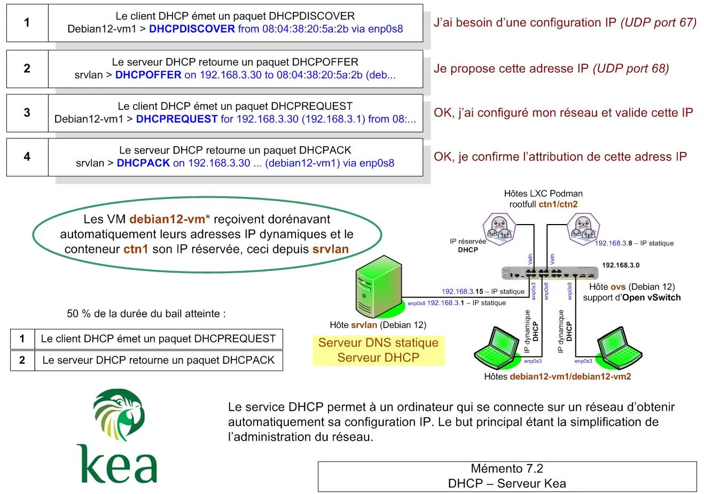
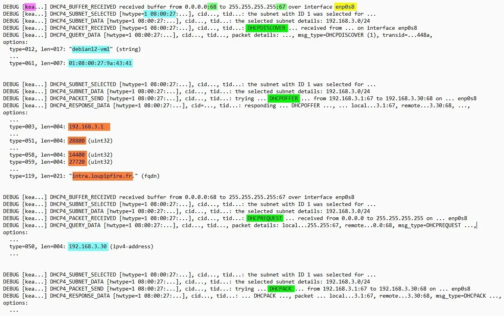
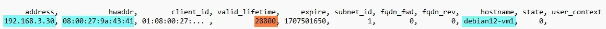
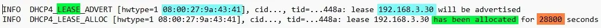

<figure markdown>
  { width="430" }
</figure>

## Mémento 7.2 - Kea DHCP Server

DHCP = Dynamic Host Configuration Protocol

Le DHCP sera activé sur la VM srvlan pour la zone LAN.

### Préambule

Il est aujourd'hui préconisé d'utiliser Kea DHCP à la place d'ISC DHCP qui n'est plus maintenu.

#### _Rôle du serveur DHCP_

Il permet à un hôte qui se connecte sur un réseau local d'obtenir automatiquement sa configuration IP, ceci pour une durée déterminée appelée bail DHCP.

But, faciliter l'affectation des adresses IP sur un réseau.

Les hôtes enregistrés via un serveur DHCP peuvent aussi être ajoutés dynamiquement à un serveur DNS.

DHCP représente donc une suite logique au DNS dans la construction du réseau local virtuel.

#### _Fonctionnement du protocole_

Le DHCP repose sur des requêtes UDP émises par les clients et traitées par le serveur.

Exemple d'un échange de requêtes client/serveur :

<!-- more -->

* DHCPDISCOVER - Le client cherche un serveur  
* DHCPOFFER - le 1er trouvé soumet une IP  
* DHCPREQUEST - Le client traite et valide l'IP  
* DHCPACK - Le serveur confirme la configuration  

Les requêtes UDP circulent sur les ports 67 et 68.

Le client au final reçoit une confirmation de son IP temporaire (bail) ainsi que souvent en complément l'IP de sa passerelle ainsi que les IP de ses serveurs DNS.

!!! note "Nota"
    Si pas de serveur DHCP, le client s'attribue une adresse IP dans la plage 169.254.0.0/16.

Le serveur DHCP Kea utilisé ci-dessous est issu de l'organisme déjà créateur du serveur DNS BIND 9 soit l'Internet Software Consortium _(ISC)_.

### Installation et configuration

#### _Installation du service Kea_

Installez ce paquet pour gérer la zone LAN en IPv4 :

```bash
[srvlan@srvlan:~$] sudo apt install kea-dhcp4-server 
```

Les dépendances suivantes ont été ajoutées :

* kea-common
* liblog4cplus
* libmariadb3
* libpq5
* mariadb-common
* mysql-common

Vérifiez le statut du service :

```bash
[srvlan@srvlan:~$] sudo systemctl status kea-dhcp4-server
```

Retour normal :

```markdown
● kea-dhcp4-server.service - Kea IPv4 DHCP daemon
     Loaded: ...service; enabled; preset: enabled)
     Active: active (running) since Tue 2024-...
       Docs: man:kea-dhcp4(8)
   Main PID: 2412 (kea-dhcp4)
      Tasks: 5 (limit: 1077)
     Memory: 4.6M
        CPU: 53ms
     CGroup: /system.slice/kea-dhcp4-server.service
             └─2412 /usr/sbin/kea-dhcp4 -c /etc...

...
févr.. srvlan kea-dhcp4[...]: INFO  DHCP4_STARTED
```

Le service est démarré et activé par défaut _(enabled)_.

#### _Configuration_

Le fichier de configuration kea-dhcp4.conf se trouve dans le dossier /etc/kea/.

Sauvegardez celui-ci en le renommant ainsi :

```bash
[srvlant@srvlan:~$] cd /etc/kea

[srvlant@srvlan:~$] sudo mv kea-dhcp4.conf kea-dhcp4.conf_save
```

Créez ensuite un nouveau fichier kea-dhcp4.conf :

```bash
[srvlant@srvlan:~$] sudo nano kea-dhcp4.conf
```

et entrez ce qui suit en respectant le format JSON :

```json
// Serveur DHCP Kea
// Configuration de base IPv4

{
"Dhcp4": {
    // Interface réseau enp0s8 en écoute DHCP.
    "interfaces-config": {
        "interfaces": ["enp0s8"]
    },

    // Serveur en autorité DHCP pour la zone LAN.
    "authoritative": true,

    // Pas de MAJ dynamique du serveur DNS Bind9.
    "ddns-send-updates" : false,

    // Position du fichier contenant les baux DHCP.
    "lease-database": {
        "type": "memfile",
        "persist": true,
        "name": "/var/lib/kea/kea-leases4.csv",
        "lfc-interval": 3600
    },

    // Bail (renew=50%,rebind=87.5%,valid=100%=8H).
    "renew-timer": 14400,
    "rebind-timer": 27720,
    "valid-lifetime": 28800,

    "option-data": [
    // Serveur DNS proposé aux clients DHCP.
        {
            "name": "domain-name-servers",
            "data": "192.168.3.1"
        },
        
    // Domaine proposé aux clients pour
    // résoudre les noms d'hôtes via le DNS.
        {
            "name": "domain-search",
            "data": "intra.loupipfire.fr"
        }
    ],

    // Plage d'adresses IP pour la zone LAN.
    "subnet4": [
        {
            "subnet": "192.168.3.0/24",
            "pools": [ { "pool": "192.168.3.30 - 192.168.3.50" } ],
            "option-data": [
                {
                    "name": "routers",
                    "data": "192.168.3.1"
                }
            ],
            
            // IP réservée pour le conteneur ctn1.
            "reservations": [
                {
                    "hw-address": "e2:f0:31:2a:b6:05",
                    "ip-address": "192.168.3.20"
                }
            ]
        }
    ]
}
}
```

Remarques :

\- La carte enp0s8, située côté LAN, sera surveillée par le serveur DHCP.

\- A 50% de la durée du bail, la séquence de prolongation/renouvellement de celui-ci débutera.

\- L'IP fixe réservée pour ctn1 se situe en dehors de la plage des IP dédiée aux autres clients.

\- Attention, l'adresse MAC de ctn1 actuellement dynamique devra être déclarée fixe ci-dessous.

Redémarrez le service DHCP et vérifiez son statut :

```bash
[srvlan@srvlan:~$] sudo systemctl restart kea-dhcp4-server
[srvlan@srvlan:~$] sudo systemctl status kea-dhcp4-server 
```

Retour du statut :

```markdown
● kea-dhcp4-server.service - Kea IPv4 DHCP daemon
     Loaded: ...service; enabled; preset: enabled)
     Active: active (running) since Tue 2024-...
       Docs: man:kea-dhcp4(8)
   Main PID: 3638 (kea-dhcp4)
      Tasks: 5 (limit: 1077)
     Memory: 3.7M
        CPU: 40ms
     CGroup: /system.slice/kea-dhcp4-server.service
             └─3638 /usr/sbin/kea-dhcp4 -c /etc...

févr.. DHCPSRV_CFGMGR...IFACE listening ... enp0s8
févr.. DHCPSRV_CFGMGR_SOCKET_ ... socket type raw
févr.. DHCPSRV_CFGMGR_NEW_SUBNET... 192.168.3.0 ...
févr.. DHCP4_CONFIG_COMPLETE DHCP... DDNS: disabled
févr.. DHCPSRV_MEMFILE_DB ...kea-leases4.csv ...
févr.. DHCPSRV_MEMFILE_LEASE...kea-leases4.csv.2
févr.. DHCPSRV_MEMFILE_LEASE...kea-leases4.csv
févr.. DHCPSRV_MEMFILE_LFC... Cleanup ... 3600 sec
févr.. DHCP4_MULTI_THREADING_INFO enabled: no, ...
févr.. DHCP4_STARTED Kea DHCPv4 server ... started 
```

Celui-ci ne montre pas d'erreur, le service DHCP sera lancé automatiquement au boot de srvlan.

Vérifiez l'utilisation par le service du port UDP 67 :

```bash
[srvlan@srvlan:~$] sudo ss -anup | grep dhcp
```

Retour :

```markdown
UN... 0  0  192.168.3.1:67  0.0.0.0:*  users:(("kea-dhcp4"...))
```

### Gestion des logs DHCP

#### _Création d'un fichier de logs_

Editez le fichier de configuration kea-dhcp4-server :

```bash
[srvlan@srvlan:~$] sudo nano /etc/kea/kea-dhcp4.conf
```

et entrez ce qui suit sous la section subnet4 :

```markdown
"subnet4": [
        ...
    ],
    // Gestion des logs du serveur DHCP.
    "loggers": [
        {
          "name": "kea-dhcp4",
          "output_options": [
            {
              "output": "/var/log/kea/kea-dhcp4.log",
              "pattern": "%D{%Y-%m-%d %H:%M:%S.%q} %-5p %m\n"
            }
          ],
          "severity": "INFO",
          "debuglevel": 0
        }
      ]
// Ci-dessous, accolades existantes
}
}
```

Ne pas oublier d'ajouter une virgule derrière le crochet de fin de section subnet4.

Redémarrez le serveur DHCP :

```bash
[srvlan@srvlan:~$] sudo systemctl restart kea-dhcp4-server
[srvlan@srvlan:~$] sudo systemctl status kea-dhcp4-server 
```

et affichez le contenu du fichier kea-dhcp4.log qui a été créé dans le dossier /var/log/kea/.

```bash
[srvlan@srvlan:~$] sudo cat /var/log/kea/kea-dhcp4.log 
```

### Modification du DNS statique

Ouvrez le fichier DNS de zone directe intra.loupipfire.fr :

```bash
[srvlan@srvlan:~$] cd /etc/bind
[srvlan@srvlan:~$] sudo nano db.intra.loupipfire.fr.directe 
```

et supprimez ou commentez (;) les 4 lignes suivantes :

```markdown
debian12-vm1   IN   A   192.168.3.2
debian12-vm2   IN   A   192.168.3.4
ctn1           IN   A   192.168.3.6
ctn2           IN   A   192.168.3.8 
```

Ouvrez le fichier DNS de zone inverse intra.loupipfire.fr :

```bash
[srvlan@srvlan:~$] sudo nano db.intra.loupipfire.fr.inverse 
```

et supprimez ou commentez (;) les 4 lignes suivantes :

```markdown
2 IN PTR debian12-vm1.intra.loupipfire.fr. 
4 IN PTR debian12-vm2.intra.loupipfire.fr.
6 IN PTR ctn1.intra.loupipfire.fr.
8 IN PTR ctn2.intra.loupipfire.fr. 
```

Relancez le service DNS :

```bash
[srvlan@srvlan:~$] sudo systemctl restart bind9 
```

!!! note "Nota"
    Ne modifiez pas les lignes des hôtes srvlan/ovs.

### Tests du service Kea

#### _Préparation_

Au préalable, éditez le fichier apparmor suivant :

```bash
[srvlan@srvlan:~$] cd /etc/apparmor.d
[srvlan@srvlan:~$] sudo nano usr.sbin.kea-dhcp4 
```

et ajoutez ce contenu à la fin de celui-ci :

```markdown
# Section ajoutée pour tracer les messages DHCP
  owner /var/log/kea/kea-dhcp4.packets.log rw,
  owner /var/log/kea/kea-dhcp4.packets.log.[0-9]* rw,
  owner /var/log/kea/kea-dhcp4.packets.log.lock rwk,

// Ci-dessous, accolade existante
} 
```

Ceci permettra de créer un fichier kea-dhcp4.packets.log qui stockera les messages DHCP clients <- -> serveur.

Editez ensuite le fichier de configuration du serveur :

```bash
[srvlan@srvlan:~$] sudo nano /etc/kea/kea-dhcp4.conf 
```

et ajoutez ce contenu à l'intérieur de la section loggers :

```markdown
/ Gestion des logs du serveur DHCP.
    "loggers": [
        {
          "name": "kea-dhcp4",
          ...
        },
        {
          "name": "kea-dhcp4.packets",
          "output_options": [
            {
              "output": "/var/log/kea/kea-dhcp4.packets.log",
              "maxver": 3
            }
          ],
          "severity": "DEBUG",
          "debuglevel": 99
        }
// Ci-dessous, crochet et accolades existants
      ]
}
} 
```

Ne pas oublier d'ajouter une virgule derrière l'accolade de fin du name précédent.

Redémarrez les services AppArmor et DHCP :

```bash
[srvlan@srvlan:~$] sudo systemctl restart apparmor
[srvlan@srvlan:~$] sudo systemctl status apparmor

[srvlan@srvlan:~$] sudo systemctl restart kea-dhcp4-server
[srvlan@srvlan:~$] sudo systemctl status kea-dhcp4-server  
```

Un fichier vide kea-dhcp4.packets.log a été créé dans le dossier /var/log/kea/.

Ouvrez à présent un second terminal et connectez-vous en tant que root (Cde : su root).

Entrez la Cde de traçage qui permettra d'observer en temps réel les messages DHCP échangés :

```bash
[root@srvlan:~#] tail -f /var/log/kea/kea-dhcp4.packets.log  
```

#### _Test depuis les debian12-vm*_

Référez-vous au [Mémento 4.1](../posts/clients-debian12-vm1-vm2-creation.md){ target="_blank" } pour modifier les paramètres réseau.

\- VM debian12-vm1

Ajustez la Méthode de l'onglet Paramètres IPv4 sur Automatique (DHCP).

Supprimez ensuite l'adresse IP statique et enregistrez.

Redémarrez la VM Debian :

```bash
[client-linux@debian12-vm1:~$] sudo reboot  
```

et contrôlez l'affectation d'une nouvelle adresse IP :

```bash
[client-linux@debian12-vm1 :~$ ] ip address 
```

qui doit faire partie de la plage DHCP du serveur DHCP.

Démarrez Firefox et vérifiez le bon accès à Internet.

\- VM srvlan  
Vérifiez que le terminal de traçage contient ces lignes :

<figure markdown>
  { width="580" }
  <figcaption>Kea DHCP : Séquence d'affectation d'une IP</figcaption>
</figure>

et que le fichier des baux /var/lib/kea/kea-leases4.csv contient celles-ci :

<figure markdown>
  { width="580" }
  <figcaption>Kea DHCP : Format du fichier kea-leases4.csv</figcaption>
</figure>

Le fichier /var/log/kea/kea-dhcp4.log du serveur doit également montrer ceci :

<figure markdown>
  { width="580" }
  <figcaption>Kea DHCP : Bail alloué à la VM debian12-vm1</figcaption>
</figure>

\- VM debian12-vm2

Procédez de la même manière que pour debian12-vm1.
