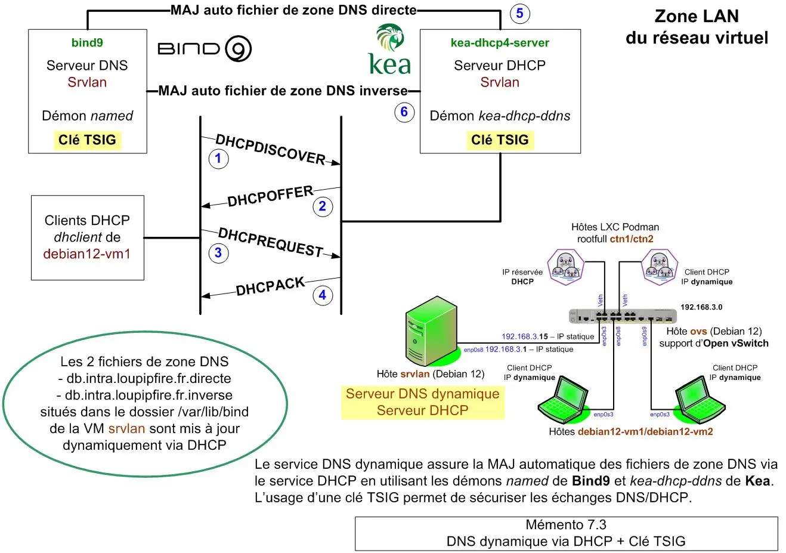
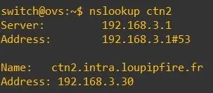

<figure markdown>
  { width="430" }
</figure>

## Mémento 7.3 - DDNS via DHCP

Migration du DNS statique installé sur la VM `srvlan` en DNS dynamique via le service DHCP.

### Préambule

Toutes les VM doivent être démarrées sauf `srvdmz` qui n'est pas concernée par cet article.

#### _- Rôle du DNS dynamique_

Le rôle consiste à modifier en temps réel les fichiers de zones DNS via le service DHCP, ceci en utilisant les démons named de Bind et kea-dhcp-ddns de Kea.

### Configuration

#### _- Configuration actuelle_

Vous avez, lors de la configuration DHCP _([mémento 7.2](../posts/dhcp-kea-debian12.md){target="_blank"})_, supprimé volontairement les enregistrements des VM `debian12-vm1/2` et conteneurs Podman `ctn1/2` dans les fichiers de zone DNS directe et inverse.

<!-- more -->

La résolution DNS interne est donc cassée :

```bash
[srvlan@srvlan:~$] ping debian12-vm1 
```

Retour :

```markdown
ping: debian12-vm1: Échec temporaire dans la résolution ...
```

Idem avec l'hôte `ctn2` :

```bash
[srvlan@srvlan:~$] ping ctn2.intra.loupipfire.fr 
```

Retour :

```markdown
ping: ctn2.intra.loupipfire.fr: Nom ou service inconnu
```

Seule la résolution DNS externe fonctionne :

```bash
[srvlan@srvlan:~$] ping lemonde.fr 
```

Retour :

```markdown
PING lemonde.fr (151.101.2.137) 56(84) bytes of d...
64 bytes from 151.101.2.137 (151.101.2.137): icmp...
64 bytes from 151.101.2.137 (151.101.2.137): icmp...
--- lemonde.fr ping statistics ---
2 packets transmitted, 2 received, 0% packet loss...
rtt min/avg/max/mdev = 15.730/16.145/16.560/0.415 ms
```

#### _- Création d'une clé TSIG_

TSIG _(Transaction Signature)_ est un mécanisme permettant de sécuriser la communication avec un serveur DNS, ceci à base d'une clé secrète partagée.

Il peut être utilisé pour authentifier les échanges effectués lors d'une MAJ dynamique des fichiers de zones DNS via DHCP.

TSIG requiert une bonne synchronisation du temps pour fonctionner correctement.

C'est actuellement VirtualBox qui gère par défaut cette synchronisation du temps pour l'ensemble du réseau virtuel.

Créez la clé secrète partagée comme suit :

```bash
[srvlan@srvlan:~$] cd /etc/bind
[srvlan@srvlan:~$] su root

[root@srvlan:~#] sudo tsig-keygen -a HMAC-SHA256 tsig-kea-bind  > tsig-kea-bind.key 

[root@srvlan:~#] chown root:bind tsig-kea-bind.key
[root@srvlan:~#] chmod 640 tsig-kea-bind.key
[root@srvlan:~#] exit 
```

La Cde tsig-keygen est fournie avec le paquet bind9.

Vérifiez ensuite le contenu du fichier tsig-kea-bind.key :

```bash
[srvlan@srvlan:~$] sudo cat tsig-kea-bind.key 
```

Retour :

```markdown
key "tsig-kea-bind" {
     algorithm hmac-sha256;
     secret "z1iGvZ6fqgHtwlQVsltfMqvtBB24rxk2VpZ...";
}; 
```

L'élément secret contient la valeur de la clé TSIG.

#### _- Configuration serveur DNS_

Pour éviter de rencontrer par la suite des problèmes de permission d'écriture, déplacez les fichiers actuels de zone DNS vers le dossier /var/lib/bind/ comme suit :

```bash
[srvlan@srvlan:~$] cd /var/lib/bind
[srvlan@srvlan:~$] sudo mv /etc/bind/*.directe /var/lib/bind/
[srvlan@srvlan:~$] sudo mv /etc/bind/*.inverse /var/lib/bind/ 
```

Sous Debian, ce dossier est destiné aux fichiers de zone et journaux mis à jour dynamiquement.

Cette configuration tient compte du profil de sécurité apparmor associé à l'application bind et paramétré dans le fichier /etc/apparmor.d/usr.sbin.named.

Editez ensuite le fichier named.conf.local :

```bash
[srvlan@srvlan:~$] sudo nano /etc/bind/named.conf.local
```

Modifiez la ligne "# MAJ dynamique ..." et ajoutez ce qui suit juste avant les lignes de configuration de la zone de recherche directe :

```markdown hl_lines="1"
# MAJ dynamique des fichiers de zones -> update-policy

# Déclaration de la clé TSIG qui sera utilisée pour
# la mise à jour dynamique du DNS
include "/etc/bind/tsig-kea-bind.key";
```

puis modifiez la zone de recherche directe comme suit :

```markdown hl_lines="2"
file "/var/lib/bind/db.intra.loupipfire.fr.directe";
update-policy {
    grant tsig-kea-bind wildcard *.intra.loupipfire.fr A DHCID;
        };
```

et la zone de recherche inverse comme ci-dessous :

```markdown hl_lines="2"
file "/var/lib/bind/db.intra.loupipfire.fr.inverse";
update-policy {
    grant tsig-kea-bind wildcard *.3.168.192.in-addr.arpa PTR DHCID;
        };
```

Pour finir, vérifiez la syntaxe du fichier modifié :

```bash
[srvlan@srvlan:~$] sudo named-checkconf
```

Si OK, pas de retour.

Le paramètre ==update-policy== permettra d'accepter les demandes de MAJ DNS si authentifiées avec la clé TSIG tsig-kea-bind.key.

#### _- Configuration serveur DHCP_

Le service DHCP doit utiliser la même valeur de clé TSIG que le service DNS.

Pour commencer, installez le paquet suivant :

```bash
[srvlan@srvlan:~$] sudo apt install kea-dhcp-ddns-server
```

Celui-ci inclut le démon /usr/sbin/kea-dhcp-ddns qui effectuera la MAJ dynamique du serveur DNS, ceci chaque fois que Kea DHCP assignera une adresse IP à une VM ou à un conteneur.

Vérifiez ensuite le statut du service installé :

```bash
[srvlan@srvlan:~$] sudo systemctl status kea-dhcp-ddns-server
```

Retour normal :

```markdown hl_lines="3 15"
● kea-dhcp-ddns-server.service - Kea DDNS Service
     Loaded: loaded (...kea-dhcp-ddns-server... enabled...)
     Active: active (running) since Tue 2024-03-26 ... ago
       Docs: man:kea-dhcp-ddns(8)
   Main PID: 36442 (kea-dhcp-ddns)
      Tasks: 5 (limit: 1077)
     Memory: 3.4M
        CPU: 26ms
     CGroup: /system.slice/kea-dhcp-ddns-server.service
             └─36442 /usr/sbin/kea-dhcp-ddns -c ...conf
... systemd[1]: Started kea-dhcp-ddns-server...
... kea-dhcp-ddns... [kea-dhcp-ddns.dctl...] ... DhcpDdns starting...
... kea-dhcp-ddns... INFO  COMMAN... Starting to accept ... to /run/kea/kea-ddns-ctrl-socket
... kea-dhcp-ddns... INFO  DCTL... completed ... on 127.0.0.1, port 53001, using UDP
... kea-dhcp-ddns... INFO  DHCP... Kea DHCP-DDNS server version 2.2.0 started
```

Puis créez un fichier qui contiendra la clé TSIG déclarée ci-dessus sur le serveur DNS :

```bash
[srvlan@srvlan:~$] cd /etc/kea
[srvlan@srvlan:~$] sudo nano tsig-keys.json
```

et entrez le contenu suivant au format JSON :

```json
"tsig-keys": [
    {
       "name": "tsig-kea-bind",
       "algorithm": "hmac-sha256",
       "secret": "z1iGvZ6fqgHtwlQVsltfMqvtBB24rxk2VpZ..."
    }
],
```

Gérez les permissions du fichier tsig-keys.json :

```bash
[srvlan@srvlan:~$] sudo chown _kea:root tsig-keys.json
[srvlan@srvlan:~$] sudo chmod 640 tsig-keys.json 
```

Puis créez le fichier qui contiendra la configuration pour la MAJ dynamique du service DNS :

```bash
[srvlan@srvlan:~$] sudo mv kea-dhcp-ddns.conf kea-dhcp-ddns.conf_save

[srvlan@srvlan:~$] sudo nano kea-dhcp-ddns.conf 
```

et entrez le contenu suivant :

```json
{
    "DhcpDdns":
    {
      "ip-address": "127.0.0.1",
      "port": 53001,
      "control-socket": {
          "socket-type": "unix",
          "socket-name": "/run/kea/kea-ddns-ctrl-socket"
      },
      <?include "/etc/kea/tsig-keys.json"?>
      "forward-ddns" : {
          "ddns-domains" : [
              {
                   "name": "intra.loupipfire.fr.",
                   "key-name": "tsig-kea-bind",
                   "dns-servers": [
                       { "ip-address": "192.168.3.1" }
                   ]
              }
          ]
      },
      "reverse-ddns" : {
          "ddns-domains" : [
              {
                   "name": "3.168.192.in-addr.arpa.",
                   "key-name": "tsig-kea-bind",
                   "dns-servers": [
                       { "ip-address": "192.168.3.1" }
                   ]
              }
          ]
      },
      "loggers": [
        {
            "name": "kea-dhcp-ddns",
            "output_options": [
          {
           "output": "/var/log/kea/kea-ddns.log",
           "pattern": "%D{%Y-%m-%d %H:%M:%S.%q} %-5p %m\n"
          }
            ],
            "severity": "INFO",
            "debuglevel": 0
        }
      ]
    }
} 
```

Gérez les permissions du fichier kea-dhcp-ddns.conf :

```bash
[srvlan@srvlan:~$] sudo chown _kea:root kea-dhcp-ddns.conf
```

et vérifiez la bonne syntaxe de celui-ci :

```bash
[srvlan@srvlan:~$] sudo kea-dhcp-ddns -t kea-dhcp-ddns.conf
```

Retour normal :

```markdown hl_lines="4"
2024-03-26 16:12:45.442 INFO  [kea-dhcp-ddns.dctl/...]
DCTL_CONFIG_CHECK_COMPLETE server has completed configuration check:
listening on 127.0.0.1, port 53001, using UDP,
result: success(0), text=Configuration check successful
```

Editez enfin le fichier de configuration principal du serveur Kea DHCP :

```bash
[srvlan@srvlan:~$] sudo nano kea-dhcp4.conf
```

Supprimez les 2 lignes suivantes :

```json
// Pas de MAJ dynamique du serveur DNS Bind9.
"ddns-send-updates" : false,
```

et ajoutez celles-ci sous la section loggers :

```json
"loggers": [
        ... 
    ],
// Configuration du DNS dynamique
"dhcp-ddns": {
        "enable-updates": true
     },
     
     "ddns-qualifying-suffix": "intra.loupipfire.fr",
     "ddns-override-client-update": true
// Ci-dessous, accolades existantes
}
}
```

Ne pas oublier d'ajouter une virgule derrière le crochet de fin de section loggers.

Vérifiez enfin la bonne syntaxe du fichier :

```bash
[srvlan@srvlan:~$] sudo kea-dhcp4 -t kea-dhcp4.conf
```

et relancez dans l'ordre les services DNS et DHCP :

```bash
[srvlan@srvlan:~$] sudo systemctl restart bind9
[srvlan@srvlan:~$] sudo systemctl status bind9

[srvlan@srvlan:~$] sudo systemctl restart kea-dhcp4-server
[srvlan@srvlan:~$] sudo systemctl status kea-dhcp4-server

[srvlan@srvlan:~$] sudo systemctl restart kea-dhcp-ddns-server
[srvlan@srvlan:~$] sudo systemctl status kea-dhcp-ddns-server
```

### Tests de bon fonctionnement

#### _- Clients debian12-vm1 et 2_

Au préalable, ouvrez 2 terminaux sur le bureau de `srvlan`.

Connectez-vous ensuite sur ceux-ci en tant qu'utilisateur root _(Cde su root)_.

Entrez sur le terminal 1 cette demande de traçage :

```bash
[root@srvlan:~#] tail -f /var/log/kea/kea-dhcp4.packets.log
```

et sur le terminal 2 celle ci-dessous :

```bash
[root@srvlan:~#] journalctl -u named -f
```

Redémarrez maintenant la VM `debian12-vm1`.

Vérifiez ensuite sur le terminal 1 pour le DHCP Kea :  
\- La demande de configuration réseau (DHCPREQUEST).  
\- L'envoi de la configuration (DHCPACK).

```markdown hl_lines="9 24"
# Début de séquence DHCP

08:58:39... DHCP4_BUFFER_RECEIVED ... from 0.0.0.0:68 to ... over interface enp0s8

08:58:39... DHCP4_SUBNET_SELECTED [hwtype=1 ...], cid=[01:08:00:27:c6:12:a3], ... ID 1 ...

08:58:39... DHCP4_SUBNET_DATA [hwtype=1 ...], cid=[...12:a3], ... 192.168.3.0/24

08:58:39... DHCP4_PACKET_RECEIVED [hwtype=1 ...], cid=[...12:a3], ... DHCPREQUEST ... enp0s8

08:58:39... DHCP4_QUERY_DATA [hwtype=1 ...], cid=[...12:a3], ... msg_type=DHCPREQUEST ...

options:
  type=012, len=012: "debian12-vm1" (string)
  type=050, len=004: 192.168.3.31 (ipv4-address)
  type=053, len=001: 3 (uint8)
  type=055, len=017: 1(uint8) 2(uint8) ...
  type=057, len=002: 576 (uint16)
  type=061, len=007: 01:08:00:27:c6:12:a3
08:58:39... DHCP4_SUBNET_SELECTED [hwtype=1 ...], cid=[01:08:00:27:c6:12:a3], ... ID 1 ...

08:58:39... DHCP4_SUBNET_DATA [hwtype=1 ...], cid=[...12:a3], ... 192.168.3.0/24

08:58:39... DHCP4_PACKET_SEND ... DHCPACK ... from 192.168.3.1:67 to ...3.31:68 ... enp0s8

08:58:39... DHCP4_RESPONSE_DATA ... DHCPACK ... local...192.168.3.1... remote...3.31...

options:
  type=001, len=004: 4294967040 (uint32)
  type=003, len=004: 192.168.3.1
  type=006, len=004: 192.168.3.1
  type=012, len=032: "debian12-vm1.intra.loupipfire.fr" (string)
  type=051, len=004: 28800 (uint32) #Durée du bail soit 8h
  type=053, len=001: 5 (uint8)
  type=054, len=004: 192.168.3.1
  type=058, len=004: 14400 (uint32)
  type=059, len=004: 27720 (uint32)
  type=061, len=007: 01:08:00:27:c6:12:a3
  type=119, len=021: "intra.loupipfire.fr." (fqdn)

# Fin de séquence DHCP
```

Puis sur le terminal 2 pour le DNS Bind :  
\- L'utilisation de la clé tsig-kea-bind.  
\- L'existence de 3 adding an RR de type A, DHCID et PTR.

```markdown hl_lines="3 4 7 16"
# Début de séquence DNS

08:58:39... srvlan named: client @0x7...cb68 192.168.3.1#3.../key tsig-kea-bind: updating zone
'intra.loupipfire.fr/IN': adding an RR at 'debian12-vm1.intra.loupipfire.fr' A 192.168.3.31

08:58:39... srvlan named: client @0x7...cb68 192.168.3.1#3.../key tsig-kea-bind: updating zone
'intra.loupipfire.fr/IN': adding an RR at 'debian12-vm1.intra.loupipfire.fr' DHCID AAEBCN...

08:58:39... srvlan named: client @0x7...ef68 192.168.3.1#4.../key tsig-kea-bind: updating zone
'3.168.192.in-addr.arpa/IN': deleting rrset at '31.3.168.192.in-addr.arpa' PTR

08:58:39... srvlan named: client @0x7...ef68 192.168.3.1#4.../key tsig-kea-bind: updating zone
'3.168.192.in-addr.arpa/IN': deleting rrset at '31.3.168.192.in-addr.arpa' DHCID

08:58:39... srvlan named: client @0x7...ef68 192.168.3.1#4.../key tsig-kea-bind: updating zone
'3.168.192.in-addr.arpa/IN': adding an RR at '31.3.168.192.in-addr.arpa' PTR debian12-
vm1.intra.loupipfire.fr.

08:58:39... srvlan named: client @0x7...ef68 192.168.3.1#4.../key tsig-kea-bind: updating zone
'3.168.192.in-addr.arpa/IN': adding an RR at '31.3.168.192.in-addr.arpa' DHCID AAEBCN...

# Fin de séquence DNS
```

Accédez ensuite au dossier /var/lib/bind/, attendez quelques minutes et vérifiez dans le fichier DNS db.intra.loupipfire.fr.directe l'ajout automatique :  
\- d'enregistrements A et DHCID pour `debian12-vm1`.

```markdown hl_lines="19 20"
$ORIGIN .
$TTL 86400  ; 1 day
intra.loupipfire.fr  IN SOA  srvlan.intra.loup... (
  71         ; serial
  604800     ; refresh (1 week)
  84600      ; retry (23 hours 30 minutes)
  2419200    ; expire (4 weeks)
  604800     ; minimum (1 week)
  )
                      NS srvlan.intra.loupipfire.fr.
$ORIGIN intra.loupipfire.fr.
$TTL 9600       ; 2 hours 40 minutes
ctn1                    A       192.168.3.20
                        DHCID   ( AAABAtCkfY...
                                LAI= ) ; 0 1 32
ctn2                    A       192.168.3.30
                        DHCID   ( AAAB5AqOAZ...
                                TMM= ) ; 0 1 32
debian12-vm1            A       192.168.3.31
                        DHCID   ( AAEBCNtBcY...
                                YmM= ) ; 1 1 32
debian12-vm2            A       192.168.3.32
                        DHCID   ( AAEBCNtKaY...
                                yDU= ) ; 1 1 32
$TTL 86400      ; 1 day
ovs                     A       192.168.3.15
srvlan                  A       192.168.3.1
```

Vérifiez dans le fichier DNS db.intra.loupipfire.fr.inverse l'ajout pour `debian12-vm1` :  
\- d'un enregistrement PTR.

```markdown hl_lines="21"
$ORIGIN .
$TTL 86400        ; 1 day
3.168.192.in-addr.arpa IN SOA srvlan.intra.loup... (
                66         ; serial
                604800     ; refresh (1 week)
                86400      ; retry (1 day)
                2419200    ; expire (4 weeks)
                604800     ; minimum (1 week)
                )
                        NS      srvlan.intra.loupipfire.fr.
$ORIGIN 3.168.192.in-addr.arpa.
1               PTR     srvlan.intra.loupipfire.fr.
15              PTR     ovs.intra.loupipfire.fr.
$TTL 9600       ; 2 hours 40 minutes
20              PTR     ctn1.intra.loupipfire.fr.
                DHCID   ( AAABAtCkfY...
                        LAI= ) ; 0 1 32
30              PTR     ctn2.intra.loupipfire.fr.
                DHCID   ( AAAB5AqOAZ...
                        TMM= ) ; 0 1 32
31              PTR     debian12-vm1.intra.loupipfire.fr.
                DHCID   ( AAEBCNtBcY...
                        YmM= ) ; 1 1 32
32              PTR     debian12-vm2.intra.loupipfire.fr.
                DHCID   ( AAEBCNtKaY...
                        yDU= ) ; 1 1 32
```

Le bail attribué a été mis en cache dans le fichier /var/lib/kea/kea-leases4.csv.2 de la VM `srvlan`.

Effectuez à présent des pings entre `srvlan` et `debian12-vm1` pour vérifier que la résolution DNS interne fonctionne de nouveau correctement.

La résolution sur `debian12-vm2` doit également fonctionner après un redémarrage de la VM.

#### _- Clients ctn1 et 2_

Editez le fichier de configuration du serveur DHCP :

```bash
[srvlan@srvlan:~$] sudo nano /etc/kea/kea-dhcp4.conf
```

et modifiez cette section afin que soit proposé le nom d'hôte `ctn2`ctn2 lors de la réception d'un DHCPREQUEST provenant de l'adresse MAC ==a2:20:b3:eb:30:67== :

```json hl_lines="9 10"
// IP et noms d'hôtes réservés.
  "reservations": [
                {
                    "hw-address": "e2:f0:31:2a:b6:05",
                    "ip-address": "192.168.3.20",
                    "hostname": "ctn1"               
                },
                {
                    "hw-address": "a2:20:b3:eb:30:67",
                    "hostname": "ctn2"
                }
            ]
```

Redémarrez ensuite le serveur DHCP :

```bash
[srvlan@srvlan:~$] sudo systemctl restart kea-dhcp4-server
```

et modifiez le script networknamespace.sh situé sur la VM ovs comme suit :

```bash
[switch@ovs:~$] sudo nano /root/networknamespace.sh
```

```sh hl_lines="5 9 13"
## Activation des extrémités vctn1/2 et lo côté nsct...
...
...
...
ip netns exec nsctn2 ip link set vctn2 address a2:20:b3:eb:30:67 up

## Ajout adresses IP extrémités vctn1/2 côté nsctn1/nsctn2
...
#ip netns exec nsctn2 ip addr add 192.168.3.8/24 dev vctn2

## Déclaration des interfaces vctn1/2 comme clients DHCP.
...
ip netns exec nsctn2 dhclient -4 vctn2  # Ligne ajoutée
```

Redémarrez la VM `ovs` et contrôlez la bonne résolution DNS interne pour le nom d'hôte `ctn2` :

```bash
[switch@ovs:~$] nslookup ctn2
```

Retour normal :

<figure markdown>
  
  <figcaption>Conteneur ctn2 : Résolution DNS = OK</figcaption>
</figure>

Pour le renouvellement du bail, il faut constater que la demande de celui-ci depuis les espaces de noms réseau nsctn1 et nsctn2 ne se fait pas automatiquement.

Vous ferez la demande à l'aide d'une tâche Cron qui exécutera un script dédié à cette fonction.

Commencez par créer le script :

```bash
[switch@ovs:~$] sudo nano /root/networknamespace-ddns.sh
```

et entrez le contenu suivant :

```sh
#!/bin/bash
# Reset configurations IP/DNS de nsctn1/2
ip netns exec nsctn1 /usr/sbin/dhclient -4 -r vctn1
ip netns exec nsctn2 /usr/sbin/dhclient -4 -r vctn2

# Renouvellement configuration IP/DNS de nsctn1/2
ip netns exec nsctn1 /usr/sbin/dhclient -4 vctn1
ip netns exec nsctn2 /usr/sbin/dhclient -4 vctn2

exit 0
```

Rendez le script exécutable :

```bash
[switch@ovs:~$] sudo chmod +x /root/networknamespace-ddns.sh
```

Créez maintenant une tâche Cron pour l'utilisateur root :

```bash
[switch@ovs:~$] su root

[root@ovs:~#] crontab -e
```

en entrant ce contenu à la fin du fichier ouvert :

```markdown
# Exécuter le script networknamespace-ddns.sh toutes les 7H
0 */7 * * * /bin/bash /root/networknamespace-ddns.sh
```

La demande de renouvellement du bail sera ainsi exécutée automatiquement toutes les 7H, ceci avant l'échéance initiale de 8H.

### Aide au dépannage

La méthode ci-dessous réglera un éventuel problème de MAJ automatique d'un enregistrement DNS constaté dans les logs du fichier /var/log/kea/kea-ddns.log.

Désactivez temporairement la MAJ du DNS :

```bash
[srvlan@srvlan:~$] sudo rndc freeze
```

Ouvrez, sur `srvlan`, les fichiers DNS de zone directe et inverse et supprimez l'enregistrement DNS critique.

Réactivez ensuite la MAJ du DNS :

```bash
[srvlan@srvlan:~$] sudo rndc thaw
```

Puis redémarrez le client DHCP à l'origine de l'enregistrement, tout devrait rentrer dans l'ordre.

### Bilan

Les échanges entre les serveurs DNS Bind9 et DHCP Kea, tous deux situés sur le même hôte, sont gérés automatiquement et sécurisés par clé TSIG.

La configuration TSIG peut évidemment être appliquée sur des serveurs distants l'un de l'autre.

{ align=left }

&nbsp;  
Voilà une bonne chose de faite.  
Le mémento 8.1 vous attend pour la  
mise en place d'un serveur Web PHP  
MySQL sur la VM `srvdmz`.

[Mémento 8.1 - Partie 1/2](../posts/lamp-https-cms-partie-1-debian12.md){ .md-button .md-button--primary }
