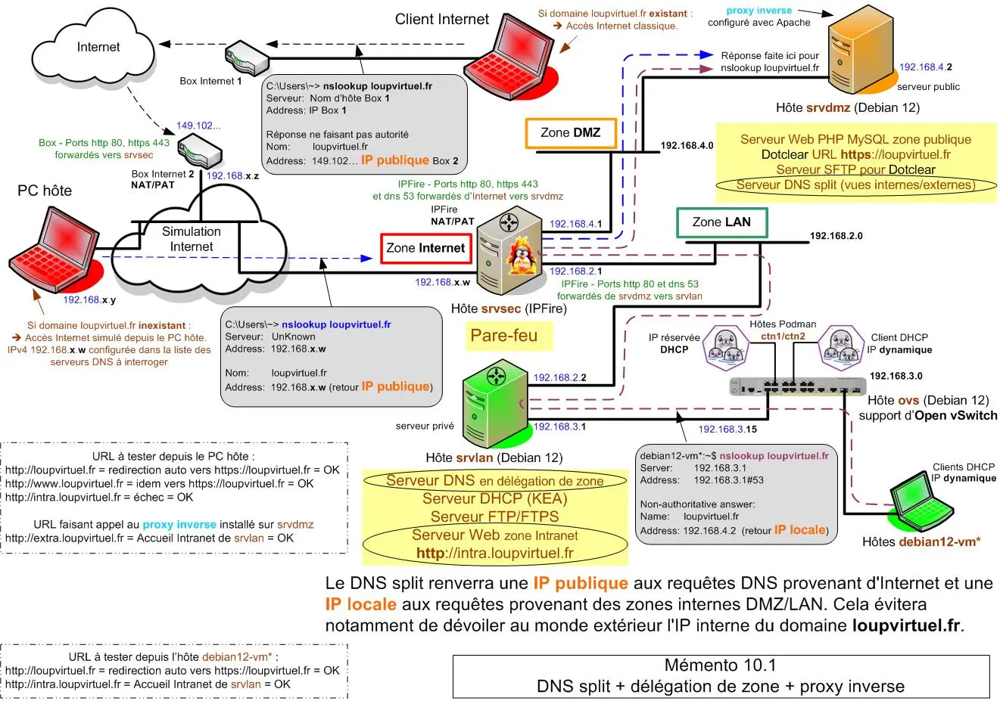
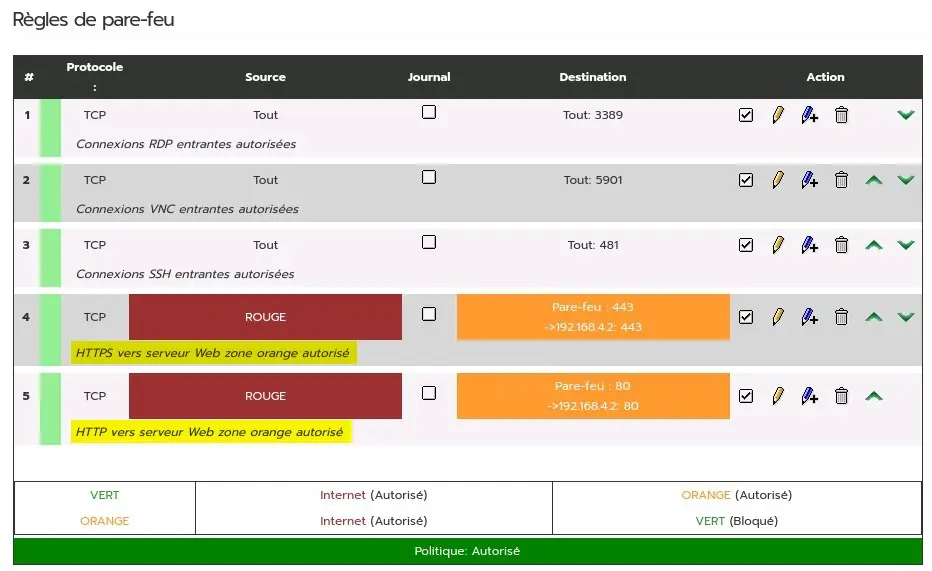
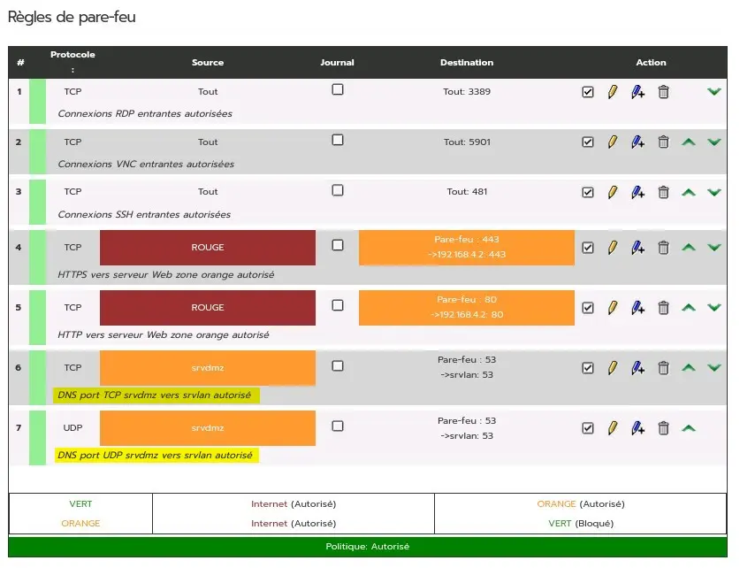
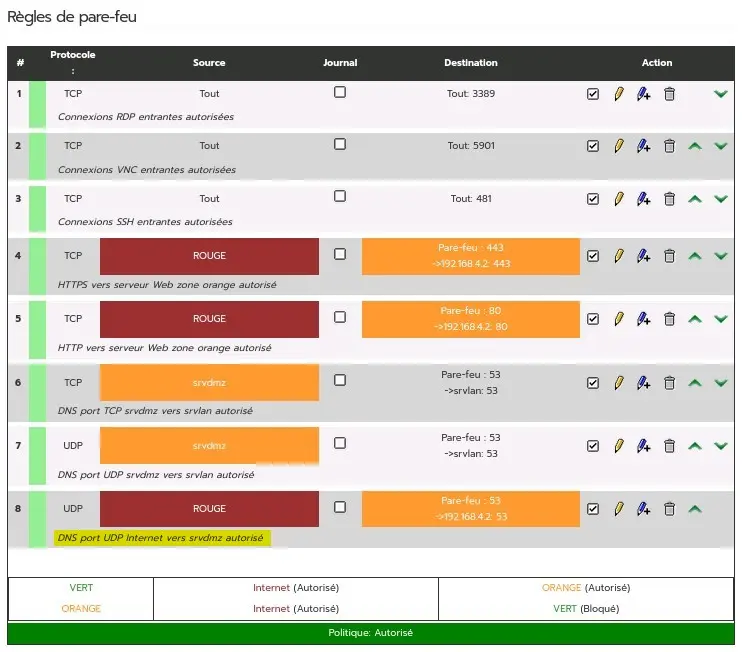
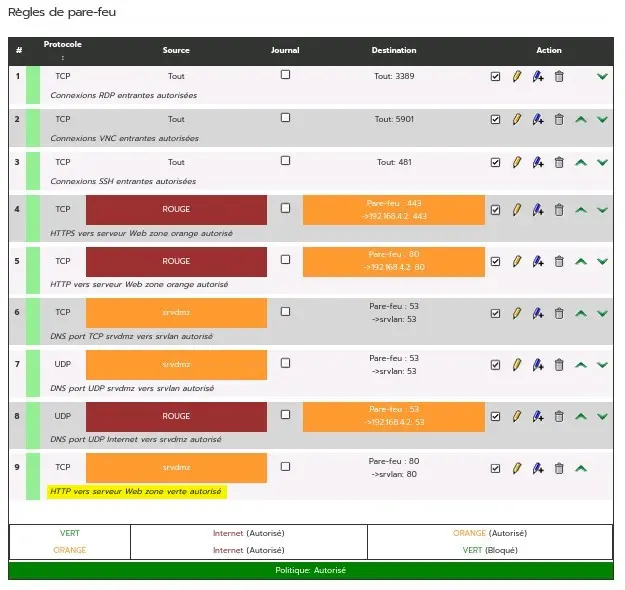
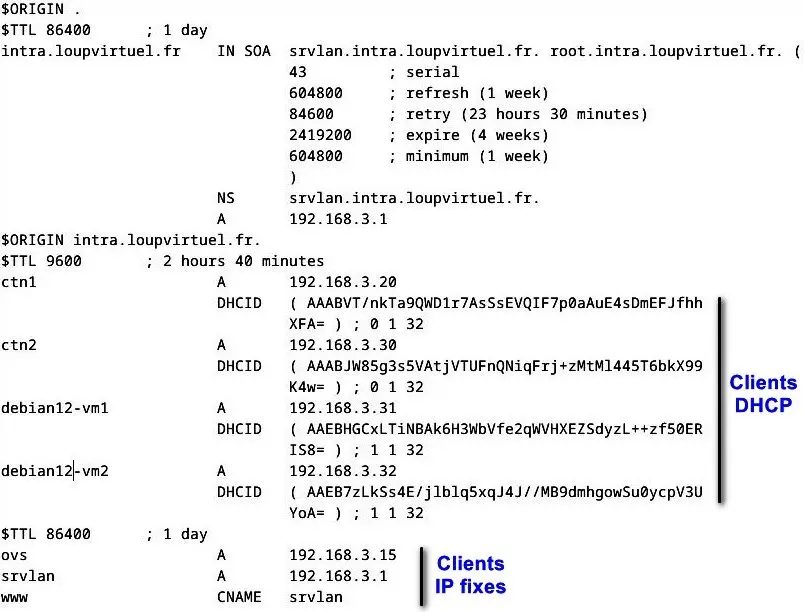
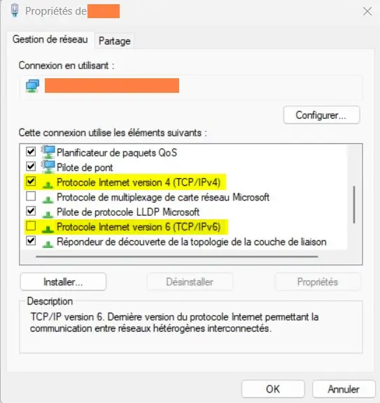

<figure markdown>
  { width="430" }
</figure>

## Mémento 10.1 - DNS Split-Brain

Rappel, 2 entités distinctes coexistent sur le réseau :  
\- Domaine `loupvirtuel.fr` en zone interne publique.  
\- Sous-domaine `intra.loupipfire.fr` en zone interne privée.

Le domaine n'est actuellement pas joignable depuis Internet et le sous-domaine n'est pas compatible avec le domaine.

Pour le fun, vous allez créer un **DNS split** qui permettra de joindre le domaine depuis Internet ou la zone interne et une **délégation de zone** qui déclarera la gestion d'un sous-domaine compatible tel `intra.loupvirtuel.fr`.

2 serveurs DNS dont 1 à créer seront utilisés :  
\- 1 sur `srvdmz` pour le domaine `loupvirtuel.fr` _(création)_.  
\- 1 sur `srvlan` pour le sous-domaine `intra.loupvirtuel.fr`.

Vous finirez en mettant en place un **proxy inverse** qui permettra de joindre le site Web du sous-domaine depuis Internet.

### Rôles DNS, délégation, proxy

#### _- DNS split_

Fournir une IP publique aux requêtes DNS provenant de la zone Internet et une IP locale aux requêtes provenant des zones internes DMZ/LAN.

Cela évitera notamment de dévoiler au monde extérieur l'IP interne du domaine `loupvirtuel.fr`.

#### _- Délégation de zone_

Déléguer la gestion du sous-domaine `intra.louvirtuel.fr` au serveur DNS de la zone LAN qui sera notamment, pour les noms d'hôtes des VM de la zone LAN, chargé de répondre aux requêtes DNS issues de la zone DMZ.

<!-- more -->

#### _- Proxy inverse_

Permettre à un utilisateur d'Internet d'accéder au serveur interne de la zone LAN. Placé en zone DMZ, il agira également comme une barrière de protection.

### Service DNS sur srvdmz

#### _- Installation de Bind 9_

Commencez par mettre à jour la distribution Debian :

```bash
[srvdmz@srvdmz:~$] sudo apt update 
[srvdmz@srvdmz:~$] sudo apt upgrade
[srvdmz@srvdmz:~$] sudo reboot
```

!!! note "Nota"
    La synchronisation horaire assurée par défaut depuis le service systemd-timesyncd de Debian est désactivée automatiquement au profit de celle assurée depuis le service vboxadd-service de VirtualBox.

Si vous n'utilisez pas VirtualBox, vérifiez le statut du service systemd-timesyncd :

```bash
[srvdmz@srvdmz:~$] sudo systemctl status systemd-timesyncd
```

Un serveur de temps tel `x.debian.pool.ntp.org` doit être contacté.

Installez à présent le même serveur DNS que sur `srvlan` :

```bash
[srvdmz@srvdmz:~$] sudo apt install bind9
```

Le démon bind9 démarre automatiquement.  
\- La configuration de base a été créée dans /etc/bind/.  
\- Les fichiers de zone le seront dans /var/lib/bind/.

#### _- ACL/vues/zones recherche_

Les **A**ccess **C**ontrol **L**ist faciliteront l'écriture/lecture de la configuration DNS en proposant de changer les définitions des réseaux IP filtrés par des alias plus explicites.

Les **vues** internes et externes contiendront pour chacune d'elles les définitions de leurs propres zones de recherche et fichiers de zone associés ainsi que celles des zones en délégation.

Les **zones de recherche** directe permettront de renvoyer une adresse IP associée à un nom alors que les zones de recherche inverse renverront un nom associé à une adresse IP.

Au préalable, éditez le fichier named.conf :

```bash
[srvdmz@srvdmz:~$] sudo nano /etc/bind/named.conf
```

et commentez l'inclusion des zones par défaut :

```markdown
#include "/etc/bind/named.conf.default-zones";
```

Editez ensuite le fichier named.conf.local :

```bash
[srvdmz@srvdmz:~$] sudo nano /etc/bind/named.conf.local
```

et créez les ACL, vues, zones de recherche et délégations en ajoutant ceci à la fin du fichier :

```markdown
## Définition des ACL pour les zones internes/externes
acl interne { 192.168.2.0/24; 192.168.4.0/24; };
acl externe { any; };

## Définition vue interne (loupvirtuel/intra.loupvirtuel)
view "interne" {

match-clients { interne; };

# Zone de recherche directe loupvirtuel.fr
zone "loupvirtuel.fr" IN {
type master;
file "/var/lib/bind/db.loupvirtuel.fr.directe";
allow-update { none; };
};

# Zone de recherche inverse loupvirtuel.fr
zone "4.168.192.in-addr.arpa" IN {
type master;
file "/var/lib/bind/db.loupvirtuel.fr.inverse";
allow-update { none; };
};

# Zone de recherche directe s/domaine intra.loupvirtuel.fr
# Zone déléguée au serveur DNS srvlan
zone "intra.loupvirtuel.fr" IN {
type forward;
forward only;
forwarders { 192.168.3.1; };
};

# Zone de recherche inverse s/domaine intra.loupvirtuel.fr
# Zone déléguée au serveur DNS srvlan
zone "3.168.192.in-addr.arpa" IN {
type forward;
forward only;
forwarders { 192.168.3.1; };
};

## Réinsertion des zones par défaut fournies par bind9
include "/etc/bind/named.conf.default-zones";
};

## Définition vue externe, Internet -> zone loupvirtuel.fr
view "externe" {

match-clients { externe; };

# Zone de recherche directe loupvirtuel.fr
zone "loupvirtuel.fr" IN {
type master;
file "/var/lib/bind/db.loupvirtuel.fr.directe.externe";
allow-update { none; };
};

};
```

#### _- Fichiers zone vue interne_

Créez le fichier pour la zone directe :

```bash
[srvdmz@srvdmz:~$] cd /var/lib/bind
[srvdmz@srvdmz:~$] sudo nano db.loupvirtuel.fr.directe
```

et insérez les lignes suivantes :

```markdown
; DNS - Vue interne
; Résolution directe pour loupvirtuel.fr
$TTL 86400
@ IN SOA srvdmz.loupvirtuel.fr. root.loupvirtuel.fr. (
2024070401
1w
1d
4w
1w )
@ IN NS srvdmz.loupvirtuel.fr.
srvdmz IN A 192.168.4.2
@ IN A 192.168.4.2
www IN CNAME srvdmz
; Délégation de zone pour intra.loupvirtuel.fr
$ORIGIN intra.loupvirtuel.fr.
@ IN NS srvlan.intra.loupvirtuel.fr.
srvlan IN A 192.168.3.1
```

2024070401 = créé le 04/07/2024 + index de départ 01

Le fichier contient les enregistrements DNS ouvrant l'accès au domaine `loupvirtuel.fr` ainsi qu'une déclaration de délégation de zone pour l'accès au sous-domaine `intra.loupvirtuel.fr`.

Créez maintenant le fichier pour la zone inverse :

```bash
[srvdmz@srvdmz:~$] cd /var/lib/bind
[srvdmz@srvdmz:~$] sudo nano db.loupvirtuel.fr.inverse
```

et insérez les lignes suivantes :

```markdown
; DNS - Vue interne
; Résolution inverse pour loupvirtuel.fr
$TTL 86400
@ IN SOA srvdmz.loupvirtuel.fr. root.loupvirtuel.fr. (
2024070401
1w
1d
4w
1w )
@ IN NS srvdmz.loupvirtuel.fr.
2 IN PTR srvdmz.loupvirtuel.fr.
```

#### _- Fichier zone vue externe_

Effectuez une copie du fichier db.loupvirtuel.fr.directe :

```bash
[srvdmz@srvdmz:~$] cd /var/lib/bind
[srvdmz@srvdmz:~$] sudo cp *directe db.loupvirtuel.fr.directe.externe
```

et modifiez la copie avec l'éditeur nano comme suit :

```markdown hl_lines="11"
; DNS - Vue externe
; Résolution directe pour loupvirtuel.fr
$TTL 86400
@ IN SOA srvdmz.loupvirtuel.fr. root.loupvirtuel.fr. (
2024070401
1w
1d
4w
1w )
@ IN NS srvdmz.loupvirtuel.fr.
srvdmz IN A 192.168.x.w
@ IN A 192.168.x.w
www IN CNAME srvdmz
```

Remplacez 192.168.x.w par l'IP de la carte RED IPFire.  
N'oubliez pas de retirer la partie délégation de zone.

#### _- Permissions sur les fichiers_

Attachez les 3 fichiers de zone créés au groupe bind :

```bash
[srvdmz@srvdmz:~$] sudo chgrp bind /var/lib/bind/*loupvirtuel*
```

Le démon bind9 pourra ainsi accéder à leur contenu.

Modifiez si besoin leurs permissions à la valeur 644 :

```bash
[srvdmz@srvdmz:~$] sudo chmod 644 /var/lib/bind/*loupvirtuel*
```

6 = Lecture/Ecriture pour le propriétaire root.  
4 = Lecture pour le groupe bind.  
4 = Lecture pour les autres utilisateurs.

#### _- Fichiers hosts/resolv.conf_

Avant, relancez bind9 pour traiter les fichiers ci-dessus :

```bash
[srvdmz@srvdmz:~$] sudo systemctl restart bind9
[srvdmz@srvdmz:~$] sudo systemctl status bind9
```

Le statut signale pour l'instant un réseau injoignable.

Editez ensuite le fichier DNS de nom hosts :

```bash
[srvdmz@srvdmz:~$] sudo cat /etc/hosts
```

et vérifiez qu'il contient bien le FQDN de `srvdmz` :

```markdown
192.168.4.2 srvdmz.loupvirtuel.fr srvdmz loupvirtuel.fr 
```

Corrigez ou ajoutez la ligne si nécessaire.

Videz ensuite le contenu du fichier DNS /etc/resolv.conf puis désactivez son remplissage auto par le service de NetworkManager comme suit :

```bash
[srvdmz@srvdmz:~$] cd /etc/NetworkManager/conf.d
[srvdmz@srvdmz:~$] sudo nano 90-dns-none.conf
```

Entrez les 2 lignes ci-dessous :

```markdown
[main]
dns=none 
```

et relancez les services NetworkManager et bind9 :

```bash
[srvdmz@srvdmz:~$] sudo systemctl reload NetworkManager
[srvdmz@srvdmz:~$] sudo systemctl restart NetworkManager
[srvdmz@srvdmz:~$] sudo systemctl status NetworkManager

[srvdmz@srvdmz:~$] sudo systemctl restart bind9
[srvdmz@srvdmz:~$] sudo systemctl status bind9
```

Vérifiez que le fichier resolv.conf est bien toujours vide :

```bash
[srvdmz@srvdmz:~$] sudo nano /etc/resolv.conf
```

et si OK, entrez les lignes suivantes :

```markdown
# Fichier resolv.conf - Client DNS

# Nom du domaine local
domain loupvirtuel.fr

# Ajout automatique du nom de domaine aux hôtes
# non pleinement qualifiés
search loupvirtuel.fr
search intra.loupvirtuel.fr

# Adresses IP du ou des serveurs DNS à interroger
nameserver 192.168.4.2
```

#### _- Résolution DNS externe_

Comme dans le [mémento 7.1](../posts/dns-statique-debian12.md#dns-externe){target="_blank"}, vous allez faire en sorte que les demandes de résolution externe (Ex : ping `www.yahoo.fr`) soient traitées par le serveur DNS de la box Internet.

Editez pour cela le fichier named.conf.options :

```bash
[srvdmz@srvdmz:~$] cd /etc/bind
[srvdmz@srvdmz:~$] sudo nano named.conf.options
```

et modifiez celui-ci afin qu'il contienne ces lignes :

```markdown
options {
directory "/var/cache/bind";

# Pas d'utilisation du protocole DNSSEC
dnssec-validation no;

# Si réponse locale impossible, envoi des requêtes DNS
# vers la box Internet.
forward only;
forwarders { 192.168.x.z; };
auth-nxdomain no;

listen-on-v6 { any; };
};
```

Remplacez 192.168.x.z par l'IP de votre box Internet.

Pour finir, relancez le service bind9 et vérifiez le statut :

```bash
[srvdmz@srvdmz:~$] sudo systemctl restart bind9
[srvdmz@srvdmz:~$] sudo systemctl status bind9
```

Le statut montre cette fois les zones DNS chargées.

#### _- Sécurisation de Bind 9_

Editez de nouveau le fichier named.conf.options :

```bash
[srvdmz@srvdmz:~$] sudo nano named.conf.options
```

et ajoutez ce qui suit au dessus de # Pas d'utilis... :

```markdown
allow-recursion { 192.168.4.0/24;192.168.2.0/24; };
allow-query { any; };
allow-query-cache { 192.168.4.0/24;192.168.2.0/24; };
minimal-responses no;

# Pas d'utilisation du protocole DNSSEC # ligne existante
```

\- Récursivité limitée aux réseaux indiqués.  
\- Interrogation du DNS autorisée pour tous les réseaux.  
\- Accès au cache DNS limités aux réseaux indiqués.  
\- Réponses retournées complètes aux requêtes DNS .

La récursivité, par sécurité, est refusée pour les requêtes DNS provenant d'Internet.

#### _- Sécurisation avec clé TSIG_

La **T**ransaction **Sig**nature sécurisera la liaison entre les serveurs DNS de `srvdmz` et `srvlan`.

Commencez par créer la clé secrète de TSIG :

```bash
[srvdmz@srvdmz:~$] cd /etc/bind
[srvdmz@srvdmz:~$] su root

[root@srvdmz:~$] sudo tsig-keygen -a HMAC-SHA256 tsig.key  > tsig-dns-split.key

[root@srvdmz:~$] chown bind:bind tsig-dns-split.key
[root@srvdmz:~$] chmod 640 tsig-dns-split.key
[root@srvdmz:~$] exit
```

La Cde tsig-keygen est fournie avec le paquet bind9.

Affichez le contenu de la clé tsig-dns-split.key :

```bash
[srvdmz@srvdmz:~$] sudo cat tsig-dns-split.key
```

Retour :

```markdown hl_lines="3"
key "tsig.key" {
 algorithm hmac-sha256;
 secret "RzsH5sveyNOaRX2zHgp7bUPoUeBmAf5krR...";
};
```

Notez la valeur de la clé pour l'utiliser ci-dessous.

Editez, pour déclarer l'usage de la clé, named.conf.local :

```bash
[srvdmz@srvdmz:~$] sudo nano /etc/bind/named.conf.local
```

et ajoutez ce contenu en fin de fichier :

```markdown hl_lines="5"
# Déclaration clé TSIG et algorithme de chiffrage
key tsig-dns-split.key.
{
algorithm hmac-sha256;
secret "RzsH5sveyNOaRX2zHgp7bUPoUeBmAf5krR...";
};
# IP du serveur DNS en délégation pour intra.loupvirtuel.fr
server 192.168.3.1
{
keys { tsig-dns-split.key; };
};
```

!!! note "Nota"
    Ne pas oublier le point en fin de 2ème ligne.

Redémarrez le serveur DNS :

```bash
[srvdmz@srvdmz:~$] sudo systemctl restart bind9
[srvdmz@srvdmz:~$] sudo systemctl status bind9
```

Retour à observer :

```markdown hl_lines="3 15 17 19"
● named.service - BIND Domain Name Server
   Loaded: loaded (/lib/sys...named.service; ena...)
   Active: active (running) since Fri 2024-07-05 ...
       Docs: man:named(8)
   Main PID: 6353 (named)
     Status: "running"
      Tasks: 6 (limit: 1076)
     Memory: 35.5M
        CPU: 42ms
     CGroup: /system.slice/named.service
             └─6353 /usr/sbin/named -f -u bind

Juil.. zone 0.in-addr.arpa/IN/interne: loaded serial 1
juil.. zone 127.in-addr.arpa/IN/interne: loaded serial 1
juil.. zone loupvirtuel.fr/IN/interne load.. 2024070401
juil.. zone localhost/IN/int.. load.. 2
juil.. zone 4.168.192.in-addr../IN/int.. load.. 2024070401
juil.. zone 255.in-addr../IN/interne: loaded serial 1
juil.. zone loupvirtuel.fr/IN/externe load.. 2024070401
juil.. all zones loaded
juil.. running
juil.. Started named.service - BIND Domain Name Server.
```

Si tout est OK, arrêtez la VM :

```bash
[srvdmz@srvdmz:~$] sudo poweroff
```

### Modification du pare-feu IPFire

La suite du mémento impose l'ajout de nouvelles règles.

Accédez à l'interface Web d'IPFire depuis `srvlan`, puis :  
Menu IPFire -> Pakfire  
Effectuez la mise à jour du système si nécessaire.

Ensuite :  
Menu Pare-feu -> Options de pare-feu  
-> Section Paramètres pare-feu  
-> Afficher tous les réseaux sur le site de ... règles  
-> Cochez on  
-> Bouton Sauvegarder

Menu Système -> Arrêter -> Redémarrer

Menu Pare-feu -> Groupes de pare-feu  
-> Bouton Hôtes -> Ajouter un hôte  
-> Nom : `srvdmz` -> IP/MAC : 192.168.4.2  
-> Remarque : Serveur en zone orange  
-> Bouton Sauvegarder

-> Nom : `srvlan` -> IP/MAC : 192.168.3.1  
-> Remarque : Serveur en zone verte  
-> Bouton Sauvegarder -> Bouton Retour

Menu Pare-feu -> Règles de pare-feu  
-> Bouton Nouvelle règle

a ) Ouverture du port HTTPS 443, Internet vers `srvdmz` :  
Nécessaire pour accéder à `loupvirtuel.fr` depuis Internet.

Paramétrage :  
\- Source -> Cochez Réseaux standards -> ROUGE  
\- NAT -> Cochez Utiliser la trad... adresses réseau (NAT)  
\- Destination -> Cochez Adresse IP de ... -> 192.168.4.2  
\- Protocole -> Sélectionnez TCP -> Port de dest... -> 443  
\- Paramètres additionnels -> Remarque  
\-> Entrez HTTPS vers serveur Web zone orange autorisé  
\-> Bouton Ajouter -> Bouton Appliquer les changements

Recommencez comme ci-dessus pour le port HTTP 80. Cela permettra de vérifier la redirection de port vers HTTPS pour les URL http://`www.loupvirtuel.fr` et http://`loupvirtuel.fr`.

<figure markdown>
  { width="430" }
  <figcaption>IPFire : HTTP/S ouverts zone Rouge vers Orange</figcaption>
</figure>

b ) Ouverture du port DNS 53, `srvdmz` vers `srvlan` :  
Indispensable pour le dialogue DNS entre les 2 serveurs mais représentant un petit trou de sécurité _(pinhole IPFire)_ sachant que les demandes de liaison de la zone orange vers la verte sont normalement toutes bloquées.

Paramétrage :  
\- Source -> Cochez Hôtes -> `srvdmz`  
\- NAT -> Cochez Utiliser la trad... adresses réseau (NAT)  
\- Destination -> Cochez Hôtes -> `srvlan`  
\- Protocole -> Sélectionnez TCP -> Port de dest... -> 53  
\- Paramètres additionnels -> Remarque  
-> Entrez DNS port TCP `srvdmz` vers `srvlan` autorisé  
-> Bouton Ajouter -> Bouton Appliquer les changements

Recommencez comme ci-dessus pour le protocole UDP car le dialogue DNS se fait en priorité via ce protocole.

<figure markdown>
  { width="430" }
  <figcaption>IPFire : DNS ouvert zone Orange vers Verte</figcaption>
</figure>

c ) Ouverture du port DNS 53, Internet vers `srvdmz` :  
Permettra d'interroger le serveur DNS depuis Internet.

Paramétrage :  
\- Source -> Cochez Réseaux standards -> ROUGE  
\- NAT -> Cochez Utiliser la trad... adresses réseau (NAT)  
\- Destination -> Cochez Adresse IP de … -> 192.168.4.2  
\- Protocole -> Sélectionnez UDP -> Port de dest... -> 53  
\- Paramètres additionnels -> Remarque  
-> Entrez DNS port UDP Internet vers `srvdmz` autorisé  
-> Bouton Ajouter -> Bouton Appliquer les changements

<figure markdown>
  { width="430" }
  <figcaption>IPFire : DNS UDP ouvert zone Rouge vers Orange</figcaption>
</figure>

d ) Ouverture du port HTTP 80, `srvdmz` vers `srvlan` :  
Règle temporaire créée pour tester l'accès au serveur Web de `srvlan` depuis Internet ou `srvdmz` mais représentant un trou de sécurité entre la zone publique DMZ et la zone privée LAN.

Paramétrage :  
\- Source -> Cochez Hôtes -> `srvdmz`  
\- NAT -> Cochez Utiliser la trad... adresses réseau (NAT)  
\- Destination -> Cochez Hôtes -> `srvlan`  
\- Protocole -> Sélectionnez TCP -> Port de dest... -> 80  
\- Paramètres additionnels -> Remarque  
-> Entrez HTTP vers serveur Web zone verte autorisé  
-> Bouton Ajouter -> Bouton Appliquer les changements

<figure markdown>
  { width="430" }
  <figcaption>IPFire : HTTP ouvert zone Orange vers Verte</figcaption>
</figure>

### Service DNS sur srvlan

#### _- Zones recherche intra..._

Editez le fichier de configuration DNS named.conf.local :

```bash
[srvlan@srvlan:~$] sudo nano /etc/bind/named.conf.local
```

et modifiez les 2 zones de recherche comme suit :

```markdown hl_lines="2 4 6 15"
# zone de recherche directe
zone "intra.loupvirtuel.fr" {
type master;
file "/var/lib/bind/db.intra.loupvirtuel.fr.directe";
update-policy {
  grant tsig-kea-bind wildcard *.intra.loupvirtuel.fr A DHCID;
  };
};

# zone de recherche inverse
# Le réseau 192.168.3.0 aura pour adresse inverse
# 3.168.192.in-addr.arpa
zone "3.168.192.in-addr.arpa" {
type master;
file "/var/lib/bind/db.intra.loupvirtuel.fr.inverse";
update-policy {
  grant tsig-kea-bind wildcard *.3.168.192.in-addr.arpa PTR DHCID;
  };
};
```

#### _- Fichiers de zone intra..._

Créez le fichier pour la zone directe :

```bash
[srvlan@srvlan:~$] cd /var/lib/bind
[srvlan@srvlan:~$] sudo nano db.intra.loupvirtuel.fr.directe
```

et insérez les lignes suivantes :

```markdown
;
; Zone DNS intra.loupvirtuel.fr - Fichier de zone pour
; la résolution directe
;
$TTL 86400
@ IN SOA srvlan.intra.loupvirtuel.fr. root.intra.loupvirtuel.fr. (
1              ; Serial
604800         ; Refresh - 1w (1 semaine)
84600          ; Retry - 1d (1 jour)
2419200        ; Expire - 4w
604800 )       ; Negative Cache TTL - 1w
;
@ IN NS srvlan.intra.loupvirtuel.fr.
srvlan IN A 192.168.3.1
@ IN A 192.168.3.1
ovs IN A 192.168.3.15
www  IN CNAME srvlan
```

Puis créez le fichier pour la zone inverse :

```bash
[srvlan@srvlan:~$] sudo nano db.intra.loupvirtuel.fr.inverse
```

et insérez les lignes suivantes :

```markdown
;
; Zone DNS intra.loupvirtuel.fr - Fichier de zone pour
; la résolution inverse
;
$TTL 86400
@ IN SOA srvlan.intra.loupvirtuel.fr. root.intra.loupvirtuel.fr. (
1
1w
1d
4w
1w )
;
@ IN NS srvlan.intra.loupvirtuel.fr.
1 IN PTR srvlan.intra.loupvirtuel.fr.
15 IN PTR ovs.intra.loupvirtuel.fr.
```

#### _- Réglage des permissions_

```bash
[srvlan@srvlan:~$] sudo chgrp bind /var/lib/bind/*loupvirtuel*

[srvlan@srvlan:~$] sudo chmod 644 /var/lib/bind/*loupvirtuel*
```

#### _- Fichiers DNS hosts et ..._

Editez le fichier DNS hosts :

```bash
[srvlan@srvlan:~$] sudo nano /etc/hosts
```

et modifiez son contenu comme suit :

```markdown
127.0.0.1           localhost
127.0.1.1           srvlan

# IP de srvlan       + FQDN    + nom d'hôte     + domaine
192.168.3.1 srvlan.intra.loupvirtuel.fr  srvlan  intra.loupvirtuel.fr

# The following lines are desirable for IPv6 capable hosts
::1 localhost ip6-localhost ip6-loopback
ff02::1 ip6-allnodes
ff02::2 ip6-allrouters
```

Supprimez la ligne 192.168.4.2 `loupvirtuel.fr`, c'est le serveur DNS de `srvdmz` qui fournira dorénavant cette correspondance IP/Nom de domaine.

Videz le contenu du fichier DNS /etc/resolv.conf puis désactivez son remplissage auto par le service de NetworkManager comme suit :

```bash
[srvlan@srvlan:~$] cd /etc/NetworkManager/conf.d
[srvlan@srvlan:~$] sudo nano 90-dns-none.conf
```

Entrez les 2 lignes ci-dessous :

```markdown
[main]
dns=none
```

et relancez les services NetworkManager et bind9 :

```bash
[srvlan@srvlan:~$] sudo systemctl reload NetworkManager
[srvlan@srvlan:~$] sudo systemctl restart NetworkManager
[srvlan@srvlan:~$] sudo systemctl status NetworkManager

[srvlan@srvlan:~$] sudo systemctl restart bind9
[srvlan@srvlan:~$] sudo systemctl status bind9
```

Vérifiez que le fichier resolv.conf est bien toujours vide :

```bash
[srvlan@srvlan:~$] sudo nano /etc/resolv.conf
```

et si OK entrez les lignes suivantes :

```markdown
# Fichier resolv.conf - Client DNS

# Nom du domaine local
domain intra.loupvirtuel.fr

# Ajout automatique du nom de domaine aux hôtes
# non pleinement qualifiés
search intra.loupvirtuel.fr
search loupvirtuel.fr

# Adresses IP du ou des serveurs DNS à interroger
nameserver 192.168.3.1
```

#### _- Fichiers named... et kea..._

Editez le fichier named.conf.options :

```bash
[srvlan@srvlan:~$] sudo nano /etc/bind/named.conf.options
```

et modifiez la valeur de ces paramètres comme suit :

```markdown
dnssec-validation no;
forwarders { 192.168.4.2; };
```

192.168.4.2 = IP du serveur DNS de `srvdmz`

Editez ensuite le fichier named.conf.local :

```bash
[srvlan@srvlan:~$] sudo nano /etc/bind/named.conf.local
```

et ajoutez à la fin les informations sur la clé TSIG :

```markdown hl_lines="6"
# Déclaration de la clé TSIG à utiliser lors
# des transactions DNS entre srvdmz et srvlan
key tsig-dns-split.key.
{
algorithm hmac-sha256;
secret "RzsH5sveyNOaRX2zHgp7bUPoUeBmAf5krR...";
};

# IP du serveur DNS srvdmz pour la zone "loupvirtuel.fr"
server 192.168.4.2
{
keys { tsig-dns-split.key; };
};
```

Editez enfin le fichier DHCP kea-dhcp4.conf :

```bash
[srvlan@srvlan:~$] sudo nano /etc/kea/kea-dhcp4.conf
```

et remplacez tous les `loupipfire` par `loupvirtuel`.

Faites de même avec le fichier kea-dhcp-ddns.conf.

Puis, éditez de nouveau le fichier kea-dhcp4.conf :

```bash
[srvlan@srvlan:~$] sudo nano /etc/kea/kea-dhcp4.conf
```

et modifiez la section suivante comme ci-dessous :

```markdown hl_lines="5"
// Domaine proposé aux clients pour
// résoudre les noms d'hôtes via le DNS.
{
    "name": "domain-search",
    "data": "intra.loupvirtuel.fr, loupvirtuel.fr"
}
```

Cela permettra notamment la MAJ automatique du fichier DNS /etc/resolv.conf de la VM `ovs` ainsi que ceux des conteneurs Podman `ctn*`.

Redémarrez ensuite les services et vérifiez les statuts :

```bash
[srvlan@srvlan:~$] sudo systemctl restart kea-dhcp4-server
[srvlan@srvlan:~$] sudo systemctl status kea-dhcp4-server

[srvlan@srvlan:~$] sudo systemctl restart kea-dhcp-ddns-server
[srvlan@srvlan:~$] sudo systemctl status kea-dhcp-ddns-server
```

Observez le contenu du cache DNS avant sa purge :

```bash
[srvlan@srvlan:~$] sudo rndc dumpdb -cache
```

La Cde ci-dessus crée dans /var/cache/bind/ un fichier de nom named_dump.db. Celui-ci renferme le contenu du cache DNS qui peut ainsi être édité pour lecture.

```bash
[srvlan@srvlan:~$] sudo cat /var/cache/bind/named_dump.db
```

Purgez maintenant le cache et relancez la même Cde :

```bash
[srvlan@srvlan:~$] sudo rndc flush
[srvlan@srvlan:~$] sudo rndc dumpdb -cache
```

Puis éditez et observez le contenu du nouveau cache.

Pour terminer, redémarrez la VM `srvlan` :

```bash
[srvlan@srvlan:~$] sudo reboot
```

#### _- Installation d'Apache_

Au préalable, redémarrez `srvdmz` sinon `srvlan` ne sera pas en mesure de joindre le monde extérieur pour notamment installer un nouveau paquet Linux.

Ensuite, installez le paquet Apache :

```bash
[srvlan@srvlan:~$] sudo apt install apache2
[srvlan@srvlan:~$] sudo systemctl status apache2
```

Erreur : AH00558: apache2: Could not ... determine the server's **f**ully **q**ualified **d**omain **n**ame

Entrez ces Cdes pour régler le problème du FQDN :

```bash
[srvlan@srvlan:~$] sudo echo "ServerName localhost" | sudo tee /etc/apache2/conf-available/fqdn.conf

[srvlan@srvlan:~$] sudo a2enconf fqdn
[srvlan@srvlan:~$] sudo systemctl restart apache2
[srvlan@srvlan:~$] sudo systemctl status apache2
```

et depuis `srvdmz`, testez l'URL `http://192.168.3.1`.

Préparez la personnalisation de l'accueil du site Web :

```bash
[srvlan@srvlan:~$] cd /var/www/html
[srvlan@srvlan:~$] sudo mv index.html index.html.origine
[srvlan@srvlan:~$] sudo nano index.html
```

et remplissez le nouvel index.html avec ce contenu :

```markdown
<!DOCTYPE html>
<html>
<head><meta charset="utf-8"></head>
<body style="background-color:#ffab33">

<h1 style="color:#000000">
Accueil Intranet de l'entreprise Loup Virtuel
</h1>

<p style="font-size:30px;color:#ffffff">
Ici, des outils pour vous aider dans votre travail !
</p>

</body>
</html>
```

Pour finir, testez de nouveau l'URL `http://192.168.3.1`.

### Modification sur VM zone LAN

\- VM `ovs`

Redémarrez la VM `ovs` et vérifiez la MAJ automatique de son fichier DNS /etc/resolv.conf ainsi que ceux des conteneurs Podman `ctn1/2` et `ctn3` _(Réf. [mémento 5.2](../posts/podman-debian12-lxc-partie-1.md){target="_blank"})_.

Contenu normal suite à la MAJ automatique par KEA :

```markdown
search intra.loupvirtuel.fr. loupvirtuel.fr.
nameserver 192.168.3.1
```

\- VM `debian12-vm*`  
Faites un clic droit sur l'applet réseau NetworkManager :  
-> Modifier les connexions...

Une fenêtre Connexions réseau s'ouvre :  
-> Sélectionnez la connexion affichée  
-> Cliquez sur la roue dentée située en bas à gauche

Une fenêtre Modification de ... s'ouvre :  
-> Onglet Paramètres IPv4  
-> Domaines de recherche supplémentaires  
-> Supprimez `intra.loupipfire.fr`  
-> Remplacez par `intra.loupvirtuel.fr`, `loupvirtuel.fr`  
-> Bouton Enregistrer

Le paramètre search du fichier /etc/resolv.conf doit être mis à jour comme ceci :

```bash
[client-linux@debian12-vm*:~$] sudo systemctl restart NetworkManager

[client-linux@debian12-vm*:~$] cat /etc/resolv.conf
```

Editez le fichier DNS hosts :

```bash
[client-linux@debian12-vm*:~$] sudo nano /etc/hosts
```

et modifiez son contenu comme suit :

```markdown
127.0.0.1           localhost
127.0.1.1           debian12-vm*

# The following lines are desirable for IPv6 capable hosts
::1 localhost ip6-localhost ip6-loopback
ff02::1 ip6-allnodes
ff02::2 ip6-allrouters
```

Supprimez la ligne 192.168.4.2 `loupvirtuel.fr`, c'est le serveur DNS de `srvdmz` qui fournira dorénavant cette correspondance IP/Nom de domaine.

Par curiosité, observez au bout de quelques minutes la bonne MAJ dynamique du fichier de zone DNS /var/lib/bind/db.intra.loupvirtuel.fr.directe situé sur `srvlan` :

<figure markdown>
  { width="430" }
  <figcaption>srvlan : Fichier de zone db.intra.loupvirtuel.fr.directe</figcaption>
</figure>

### Contrôle du DNS split

#### _- Côté srvdmz_

a ) Vérifiez l'usage de TSIG entre `srvdmz`/`srvlan` :

```bash
[srvdmz@srvdmz:~$] sudo dig -y hmac-sha256:tsig-dns-split.key:RzsH5sveyNOaRX2zHgp7bUPoUeBmAf5krR... @192.168.3.1 AXFR intra.loupvirtuel.fr
```

Retour :

```markdown hl_lines="19"
; <<>> DiG .. <<>> -y hmac-sha25.. intra.virtuel.fr
; (1 server found)
;; global options: +cmd
intra.loupvirt.. 86400 IN SOA srvlan.intra.loup..
intra.loupvirt.. 86400 IN NS  srvlan.intra.loup..
intra.loupvirt.. 86400 IN A   192.168.3.1
ctn1.intra.loupvirt.. 9600 IN DHICD   "AAABVT/nkT.."
ctn1.intra.loupvirt.. 9600 IN A       192.168.3.20
ctn2.intra.loupvirt.. 9600 IN DHICD   "AAABJW85g3.."
ctn2.intra.loupvirt.. 9600 IN A       192.168.3.30
debian12-vm1.intra..  9600 IN DHICD   "AAEBHGCxLT.."
debian12-vm1.intra..  9600 IN A       192.168.3.31
debian12-vm2.intra..  9600 IN DHICD   "AAEB7zLkSs.."
debian12-vm2.intra..  9600 IN A       192.168.3.32
ovs.intra.loupvirt.. 86400 IN A       192.168.3.15
srvlan.intra.loupv.. 86400 IN A       192.168.3.1
www.intra.loupvirt.. 86400 IN CNAME   srvlan.intra.loup..
intra.loupvirtuel..  86400 IN SOA     srvlan.intra.loup..
tsig-dns-split.key.. 0 ANY TSIG hmac... NOERROR 0 
;; Query time: 4 msec
;; SERVER: 192.168.3.1#53(192.168.3.1) (TCP)
;; WHEN: Mon Jul 08 16:51:40 CEST 2024
;; XFR size: 15 records (messages 1, bytes 624)
```

b ) Vérifiez le contenu du fichier named.conf :

```bash
[srvdmz@srvdmz:~$] sudo named-checkconf
```

Aucune erreur ne sera retournée si OK.

c ) Vérifiez la zone directe db.loupvirtuel.fr.directe :

```bash
[srvdmz@srvdmz:~$] cd /var/lib/bind

[srvdmz@srvdmz:~$] sudo named-checkzone -d loupvirtuel.fr db.loupvirtuel.fr.directe
```

Retour :

```markdown hl_lines="3"
loading "loupvirtuel.fr" from "..directe" class "IN"
zone loupvirtuel.fr/IN: loaded serial 2024070401
OK
```

d ) Vérifiez la zone inverse db.loupvirtuel.fr.inverse :

```bash
[srvdmz@srvdmz:~$] sudo named-checkzone -d 3.168.192.in-addr.arpa db.loupvirtuel.fr.inverse
```

Retour :

```markdown hl_lines="3"
loading "3.168.192.in-add.." from "..inverse" class "IN"
zone 3.168.192.in-add../IN: loaded serial 2024070401
OK
```

e ) Vérifiez le résultat des 2 Cdes suivantes :

```bash
[srvdmz@srvdmz:~$] host -v srvdmz.loupvirtuel.fr
```

Retour :

```markdown hl_lines="2 16 27"
Trying "srvdmz.loupvirtuel.fr"
;; ->>HEADER<<- opcode: QUERY, status: NOERROR, id..
;; flags: qr aa rd ra; ..RY: 1, ..ER: 1, ..TY: 1,..AL: 0

;; QUESTION SECTION:
;srvdmz.loupvirtuel.fr.      IN A

;; ANSWER SECTION:
srvdmz.loupvirtuel.fr. 86400 IN A  192.168.4.2

;; AUTHORITY SECTION:
loupvirtuel.fr.        86400 IN NS srvdmz.loupvir..

Received 69 bytes from 192.168.4.2#53 in 4 ms
Trying "srvdmz.loupvirtuel.fr"
;; ->>HEADER<<- opcode: QUERY, status: NOERROR, id..
;; flags: ..; ..RY: 1, ..ER: 0, ..TY: 1, ..AL: 0

;; QUESTION SECTION:
;srvdmz.loupvirtuel.fr.      IN AAAA

;; AUTHORITY SECTION:
loupvirtuel.fr.        86400 IN SOA srvdmz.loupvir..

Received 80 bytes from 192.168.4.2#53 in 0 ms
Trying "srvdmz.loupvirtuel.fr"
;; ->>HEADER<<- opcode: QUERY, status: NOERROR, id..
;; flags: ..; ..RY: 1, ..ER: 0, ..TY: 1, ..AL: 0
 
;; QUESTION SECTION:
;srvdmz.loupvirtuel.fr.      IN MX

;; AUTHORITY SECTION:
loupvirtuel.fr.        86400 IN SOA srvdmz.loupvir..

Received 80 bytes from 192.168.4.2#53 in 4 ms
```

```bash
[srvdmz@srvdmz:~$] sudo dig SOA srvdmz.loupvirtuel.fr
```

Retour :

```markdown hl_lines="4"
; <<>> DiG 9.18.24... <<>> SOA srvdmz.loupvirtuel.fr
;; global options: +cmd
;; Got answer:
;; ->>HEADER<<- opcode: QUERY, status: NOERROR, id..
;; flags: ..; ..RY: 1, ..ER: 0, ..TY: 1, ..AL: 1

;; OPT PSEUDOSECTION:
; EDNS: version: 0, flags:; udp: 1232
; COOKIE: 7217bb51d09446ac01000000668d1948.. (good)
;; QUESTION SECTION:
;srvdmz.loupvirtuel.fr.        IN   SOA

;; AUTHORITY SECTION:
loupvirtuel.fr.         86400  IN   SOA  srvdmz.loupvir..

;; Query time: 0 msec
;; SERVER: 192.168.4.2#53(192.168.4.2) (UDP)
;; WHEN: Tue Jul 09 13:04:40 CEST 2024
;; MSG SIZE  rcvd: 119
```

f ) Contrôlez les IP retournées selon le domaine ciblé :

```bash
[srvdmz@srvdmz:~$] nslookup loupvirtuel.fr
```

Retour :

```markdown hl_lines="5"
Server:   192.168.4.2
Address:  192.168.4.2#53

Name: loupvirtuel.fr
Address: 192.168.4.2
```

```bash
[srvdmz@srvdmz:~$] nslookup intra.loupvirtuel.fr
```

Retour :

```markdown hl_lines="4 6"
Server:   192.168.4.2
Address:  192.168.4.2#53

Non-authoritative answer:
Name: intra.loupvirtuel.fr
Address: 192.168.3.1
```

#### _- Côté srvlan_

a ) Vérifiez l'usage de TSIG entre `srvlan`/`srvdmz` :

```bash
[srvlan@srvlan:~$] sudo dig -y hmac-sha256:tsig-dns-split.key:RzsH5sveyNOaRX2zHgp7bUPoUeBmAf5krR... @192.168.4.2 AXFR loupvirtuel.fr
```

et réalisez les mêmes tests que ci-dessus avec `srvdmz` :

```bash
[srvlan@srvlan:~$] sudo named-checkconf

[srvlan@srvlan:~$] cd /var/lib/bind

[srvlan@srvlan:~$] sudo named-checkzone -d intra.loupvirtuel.fr db.intra.loupvirtuel.fr.directe

[srvlan@srvlan:~$] sudo named-checkzone -d 3.168.192.in-addr.arpa db.intra.loupvirtuel.fr.inverse

[srvlan@srvlan:~$] sudo host -v srvlan.intra.loupvirtuel.fr

[srvlan@srvlan:~$] sudo dig SOA srvlan.intra.loupvirtuel.fr
```

b ) Vérifiez ensuite le statut du serveur DHCP Kea :

```bash
[srvlan@srvlan:~$] sudo systemctl status kea-dhcp4-server

[srvlan@srvlan:~$] sudo systemctl status kea-dhcp-ddns-server
```

Redémarrez les VM `debian12-vm*` et vérifiez sur `srvlan` que le fichier des baux /var/lib/kea/kea-leases4.csv.2 montre à présent le sous-domaine `intra.loupvirtuel.fr`.

c ) Contrôlez le résultat des pings suivants :

```bash
[srvlan@srvlan:~$] ping debian12-vm1
[srvlan@srvlan:~$] ping debian12-vm2.intra.loupvirtuel.fr

[srvlan@srvlan:~$] ping srvlan                              # 127.0.1.1
[srvlan@srvlan:~$] ping srvlan.intra.loupvirtuel.fr # 192.168.3.1

[srvlan@srvlan:~$] ping ovs
[srvlan@srvlan:~$] ping ctn1.intra.loupvirtuel.fr
[srvlan@srvlan:~$] ping ctn2

[srvlan@srvlan:~$] ping intra.loupvirtuel.fr

[srvlan@srvlan:~$] ping loupvirtuel.fr
[srvlan@srvlan:~$] ping srvdmz.loupvirtuel.fr
[srvlan@srvlan:~$] ping srvdmz

[srvlan@srvlan:~$] ping www.google.fr
```

Tous les pings doivent recevoir une réponse positive.

d ) Contrôlez les IP retournées selon le domaine ciblé :

```bash
[srvlan@srvlan:~$] nslookup intra.loupvirtuel.fr
```

Retour :

```markdown hl_lines="5"
Server:   192.168.3.1
Address:  192.168.3.1#53

Name: intra.loupvirtuel.fr
Address: 192.168.3.1
```

```bash
[srvlan@srvlan:~$] nslookup loupvirtuel.fr
```

Retour :

```markdown hl_lines="6"
Server:       192.168.3.1
Address:      192.168.3.1#53

Non-authoritative answer:
Name: loupvirtuel.fr
Address: 192.168.4.2
```

#### _- Côté clients debian12-vm*_

Testez les 2 Cdes suivantes :

```bash
[client-linux@debian12-vm*:~$] dig SOA www.loupvirtuel.fr
[client-linux@debian12-vm*:~$] dig SOA www.yahoo.fr 
```

Retours à observer dans la section AUTHORITY :  
\- SOA `srvdmz.loupvirtuel.fr` pour la première ligne.  
\- SOA nom-serveur-DNS de Yahoo pour la seconde.

Testez également la résolution directe et inverse :

```bash
[client-linux@debian12-vm*:~$] nslookup www.loupvirtuel.fr
[client-linux@debian12-vm*:~$] nslookup 192.168.4.2  
```

\- Cde 1, `srvlan` renvoie l'IP locale de `srvweb`.  
\- Cde 2, `srvlan` renvoie l'hôte `srvdmz.loupvirtuel.fr`.

### Test d'accès depuis Internet

Le domaine `loupvirtuel.fr` n'étant pas public, vous ne pouvez pas accéder au site Web depuis Internet en tapant simplement son URL dans le champ adresse d'un navigateur Web.

En revanche, vous pouvez simuler un accès Internet depuis le PC hôte de VirtualBox.

#### _- Préparation simulation_

L'exemple ci-dessous concerne un PC Windows 10/11.

Désactivez l'IPv6 et modifiez l'IPv4 du serveur DNS utilisé par le PC Windows en remplaçant celle-ci par l'IP 192.168.x.w de la carte RED d'IPFire comme suit :

a) Désactivation du protocole IPv6 :  
\- Clic droit sur le menu Windows 10/11 -> Exécuter  
-> Entrez ncpa.cpl -> Bouton OK  
-> Sélectionnez votre carte réseau active  
-> Clic droit sur celle-ci -> Propriétés  
-> Décochez Protocole Internet version 6 (TCP/IPv6)

<figure markdown>
  { width="430" }
  <figcaption>Windows : IPv6 à désactiver pour la simulation</figcaption>
</figure>

b) Adresse IPv4 du serveur DNS préféré à utiliser :

-> Sélectionnez Protocole Internet version 4 (TCP/IPv4)  
-> Bouton Propriétés  
-> Serveur DNS préféré -> Entrez l'IP 192.168.x.w  
-> Bouton OK -> Bouton Fermer

<figure markdown>
  { width="430" }
  <figcaption>Windows : IPv4 - DNS préféré = 192.168.x.w</figcaption>
</figure>

Vous pouvez à présent effectuer les tests ci-dessous.

#### _- Test du DNS de srvdmz_

Depuis l'Invite de commandes du PC Windows, entrez :

```bash
[C:\Users\...>] nslookup loupvirtuel.fr 
```

Retour :

```markdown
Serveur :   UnKnown
Address:  192.168.x.w

Nom :    loupvirtuel.fr  # Réponse du DNS de srvdmz
Address:  192.168.x.w    # IP externe retournée
```

```bash
[C:\Users\...>] nslookup yahoo.fr 
```

Retour :

```markdown
Serveur :   UnKnown
Address:  192.168.x.w

*** UnKnown ne parvient ... yahoo.fr : Query refused
```

```bash
[C:\Users\...>] nslookup intra.loupvirtuel.fr 
```

Retour :

```markdown
Serveur :   UnKnown
Address:  192.168.x.w

*** UnKnown ... intra.loupvirtuel.fr : Non-existe...
```

Les 2 dernières requêtes sont rejetées car, voir plus haut, la récursivité DNS a été bloquée pour les requêtes DNS provenant d'Internet, ceci pour raison de sécurité.

192.168.x.w = IP carte RED du serveur IPFire.

#### _- Test vers site web srvdmz_

Testez depuis le navigateur Web du PC Windows les 2 URL suivantes :  
`http://www.loupvirtuel.fr` et `http://loupvirtuel.fr`

Toutes les deux doivent basculer vers le protocole https sous réserve d'avoir au préalable importé le certificat ssl loupvirtuel-ca.pem dans le magasin des autorités gérées par le navigateur Web (voir [mémento 8.1](../posts/lamp-https-cms-partie-2-debian12.md#pem-firefox){target="_blank"}).

Les autres URL comme par exemple `http://google.fr` doivent rester sans réponse car la récursivité DNS est bloquée.

#### _- Test vers site web srvlan_

Possible en utilisant le proxy inverse fourni par Apache.

Chargez les modules concernant la fonction de proxy :

```bash
[srvdmz@srvdmz:~$] sudo a2enmod proxy
[srvdmz@srvdmz:~$] sudo a2enmod proxy_http 
```

Editez ensuite le virtualhost du domaine `loupvirtuel.fr` :

```bash
[srvdmz@srvdmz:~$] cd /etc/apache2/sites-available
[srvdmz@srvdmz:~$] sudo nano loupvirtuel.conf
```

et ajoutez la section VirtualHost ci-dessous :

```markdown
<VirtualHost *:80>
ServerName extra.loupvirtuel.fr

<Proxy *>
Order deny,allow
Allow from all
</Proxy>

ProxyRequests Off
ProxyPreserveHost On
ProxyPass "/" "http://192.168.3.1:80/"
ProxyPassReverse "/" "http://192.168.3.1:80/"

ErrorLog /var/log/apache2/extra.loupvirtuel.error.log
CustomLog /var/log/apache2/extra.loupvirtuel.access.log combined
</VirtualHost>
```

Redémarrez Apache :

```bash
[srvdmz@srvdmz:~$] sudo systemctl restart apache2
[srvdmz@srvdmz:~$] sudo systemctl status apache2
```

Modifiez maintenant le fichier de zone DNS suivant :

```bash
[srvdmz@srvdmz:~$] cd /var/lib/bind
[srvdmz@srvdmz:~$] sudo nano db.loupvirtuel.fr.directe.externe
```

en ajoutant l'enregistrement DNS ci-dessous :

```markdown
extra IN A 192.168.x.w
```

192.168.x.w = IP carte RED du serveur IPFire.

Pour finir, redémarrer le serveur DNS :

```bash
[srvdmz@srvdmz:~$] sudo systemctl restart bind9
```

et testez, depuis le navigateur Web du PC Windows, l'URL `http://extra.loupvirtuel.fr`.

Le retour affiché doit être l'accueil du site Web de `srvlan`.

Vous pouvez à présent désactiver ou non la règle de pare-feu "HTTP vers serveur Web zone verte autorisé".

Enfin, pensez à remettre en place sur le PC Windows la configuration initiale IPv4 et IPv6.

{ align=left }

&nbsp;  
Voilà, c'est terminé pour le DNS split.  
Le mémento 11.1 vous attend pour  
mettre en place un serveur de  
courrier basé sur Postfix.

!!! Info "Mémento 11.1 en cours de construction"
