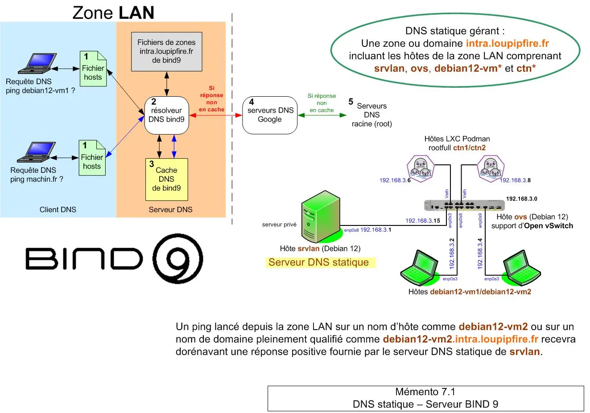

<figure markdown>
  { width="430" }
</figure>

## Mémento 7.1 - DNS avec BIND 9

Le service DNS statique reposera sur bind 9 qui sera installé sur srvlan pour gérer la zone LAN.

### Préambule

Le service gérera un sous-domaine de loupipfire.fr nommé intra.loupipfire.fr. Le nom de ce sous-domaine sera associé aux adresses IP de la zone LAN.

La VM srvlan doit conserver son IP fixe 192.168.3.1.

Commencez par une MAJ des CTN de la zone LAN :

```bash
sudo podman exec -it ctn1 ou 2 bash   # Conteneurs rootfull
# apt update
# apt upgrade
# exit

podman exec -it ctn3 bash             # Conteneur rootless
# apt update
# apt upgrade
# exit 
```

et ensuite celle des VM de la zone LAN :

<!-- more -->

```bash
sudo apt update
sudo apt upgrade
sudo apt dist-upgrade
sudo reboot
```

VM = Machine virtuelle et CTN = Conteneur Podman

#### _- Situation actuelle zone LAN_

a) Une IP fixe et un nom d'hôte pour chaque VM/CTN.  
Ex : IP fixe 192.168.3.2 pour l'hôte debian12-vm1

Cde utile pour découvrir les adresses IP :

```bash
[user@hostname:~$] ip address
```

Cdes utiles pour découvrir les noms d'hôtes :

```bash
[user@hostname:~$] cat /etc/hostname
[user@hostname:~$] cat /etc/hosts               # Ligne 127.0.1.1
```

b) Une Box Internet déclarée comme serveur DNS.

Cde utile pour découvrir les serveurs DNS exploités :

```bash
[user@hostname:~$] cat /etc/resolv.conf
```

c) Des pings qui émis depuis le LAN montrent un retour :  
\- Positif sur un nom de domaine Internet  
Ex : ping `www.google.fr`

\- Positif sur leur propre nom d'hôte  
Ex : ping debian12-vm1 depuis la VM debian12-vm1

\- Négatif sur les autres noms d'hôtes de la zone LAN

Exemple de retour :

```markdown
client-linux@debian12-vm1:~$ ping srvlan
ping: srvlan: Nom ou service inconnu
client-linux@debian12-vm1:~$
```

Un serveur DNS local solutionnera le retour négatif.

### Mise en place du DNS statique

Le système fournit bind 9 et unbound soit les 2 serveurs DNS les plus utilisés sous Debian.

Le choix se portera sur bind 9 qui contrairement à unbound peut être utilisé à la fois comme serveur de noms récursif et serveur de noms faisant autorité.

Un serveur DNS récursif recherchera le résultat d'une requête DNS dans son cache ou à défaut interrogera un serveur DNS faisant autorité pour obtenir le résultat.

Un serveur DNS faisant autorité contiendra le résultat, il n'interrogera pas d'autres serveurs et sera l’autorité finale contenant tous les noms d'hôtes et adresses IP d'une zone donnée.

Le service DNS sera statique car les données seront pour l'instant renseignées manuellement.

#### _- Installation de bind 9_

Installez le paquet bind9 :

```bash
[srvlan@srvlan:~$] sudo apt install bind9
```

et vérifiez le démarrage de celui-ci :

```bash
[srvlan@srvlan:~$] systemctl status bind9
```

Retour :

```markdown
● named.service - BIND Domain Name Server
   Loaded: loaded (/lib/systemd/system/named.ser...
     Active: active (running) since Thu 2024-01-...
       Docs: man:named(8)
   Main PID: 3234 (named)
     Status: "running"
      Tasks: 4 (limit: 1077)
     Memory: 33.0M
        CPU: 87ms
     CGroup: /system.slice/named.service
        └─3234 /usr/sbin/named -f -u bind
```

Vérifiez son lancement automatique au boot de la VM :

```bash
[srvlan@srvlan:~$] systemctl is-enabled named
```

Retour :

```markdown
enabled
```

Vérifiez la version installée :

```bash
[srvlan@srvlan:~$] sudo named -v
```

Retour :

```markdown
BIND 9.18.19...-Debian (Extended Support V...) <id:>
```

Vérifiez l'utilisation des ports TCP/UDP 53 et 953 :

```bash
[srvlan@srvlan:~$] sudo ss -tulpn | grep named
```

Retour partiel :

```markdown
udp UNC... 0 0        192.168.3.1:53   ..."named"...      
udp UNC... 0 0        192.168.2.2:53   ..."named"...      
udp UNC... 0 0          127.0.0.1:53   ..."named"...      
udp UNC... 0 0              [::1]:53   ..."named"...      
udp UNC... 0 0   [fe80::...enp0s3:53   ..."named"...     
udp UNC... 0 0   [fe80::...enp0s8:53   ..."named"...      
tcp LIS... 0 10       192.168.3.1:53   ..."named"...      
tcp LIS... 0 10       192.168.2.2:53   ..."named"...      
tcp LIS... 0 10         127.0.0.1:53   ..."named"...      
tcp LIS... 0 5         127.0.0.1:953   ..."named"...      
tcp LIS... 0 10             [::1]:53   ..."named"...      
tcp LIS... 0 10  [fe80::...enp0s3:53   ..."named"...      
tcp LIS... 0 10  [fe80::...enp0s8:53   ..."named"...      
tcp LIS... 0 5             [::1]:953   ..."named"...
```

53 = Port DNS TCP/UDP par défaut  
953 = Port des Cdes rndc pour gérer le démon named

Vérifiez l'activation de l'outil associé rndc :

```bash
[srvlan@srvlan:~$] sudo rndc status 
```

Retour :

```markdown
version: BIND 9.18...-Debian (Extended Supp...
running on localhost: Linux x86_64 6...-amd...
boot time: Thu, 11 Jan 2024 12:17:15 GMT
last configured: Thu, 11 Jan 2024 12:17:15 GMT
configuration file: /etc/bind/named.conf
CPUs found: 2
worker threads: 2
UDP listeners per interface: 2
number of zones: 102 (97 automatic)
debug level: 0
xfers running: 0
xfers deferred: 0
soa queries in progress: 0
query logging is OFF
recursive clients: 0/900/1000
tcp clients: 0/150
TCP high-water: 0
server is up and running
```

L'interface en ligne de Cde rndc permet de gérer le démon named localement ou à distance.

Pour finir, observez les fichiers de configuration DNS présents dans les dossiers suivants :

```bash
[srvlan@srvlan:~$] ls /etc/bind
[srvlan@srvlan:~$] ls /var/cache/bind    
```

### Configuration de base

#### _- Ajout de zones de recherche_

Une zone de recherche directe permet à un service DNS interrogé de renvoyer une adresse IP associée à un nom alors qu'une zone de recherche inverse fera le contraire.

Le fichier named.conf.local contient la configuration locale du serveur DNS bind9, vous y déclarerez donc les zones de recherche pour intra.loupipfire.fr.

Editez le fichier de configuration named.conf.local :

```bash
[srvlan@srvlan:~$] sudo nano /etc/bind/named.conf.local    
```

et ajoutez les lignes suivantes à la fin de celui-ci :

```bash
# Zone ou Domaine intra.loupipfire.fr
# Définition des zones de recherche directe et inverse
# Serveur DNS maître pour le domaine (type)
# Fichiers de zones associés dans /etc/bind (file)
# MAJ dynamique des fichiers de zones > none (allow-update)  

# zone de recherche directe
zone "intra.loupipfire.fr" {
type master;
file "/etc/bind/db.intra.loupipfire.fr.directe";
allow-update { none; };
};

# zone de recherche inverse
# Le réseau 192.168.3.0 aura pour adresse inverse 
# 3.168.192.in-addr.arpa 
zone "3.168.192.in-addr.arpa" {
type master;
file "/etc/bind/db.intra.loupipfire.fr.inverse";
allow-update { none; };
};    
```

#### _- Configuration des zones_

Les fichiers de zones de recherche contiendront les directives et enregistrements de ressources pour le domaine intra.loupipfire.fr.

Créez le fichier pour la zone directe :

```bash
[srvlan@srvlan:~$] cd /etc/bind
[srvlan@srvlan:~$] sudo nano db.intra.loupipfire.fr.directe    
```

et insérez les lignes suivantes :

```bash
;
; DNS - Fichier de zone pour la résolution directe
;
$TTL 86400
@   IN   SOA   srvlan.intra.loupipfire.fr. root.intra.loupipfire.fr. (
1                             ; Serial
604800                  ; Refresh - 1w (1 semaine)
84600                    ; Retry - 1d (1 jour)
2419200               ; Expire - 4w 
604800 )               ; Negative Cache TTL - 1w
;
@       IN     NS     srvlan.intra.loupipfire.fr.
srvlan       IN     A     192.168.3.1
ovs       IN     A     192.168.3.15
debian12-vm1       IN     A     192.168.3.2
debian12-vm2       IN     A     192.168.3.4
ctn1       IN     A     192.168.3.6
ctn2       IN     A     192.168.3.8    
```

\- Détail des paramètres -  
a) Directives SOA (Start of Authority) :

