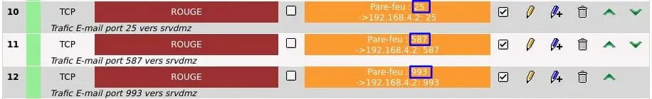

<figure markdown>
  { width="430" }
</figure>

## Mémento 11.1 - Postfix/Dovecot

Le serveur de courrier sera installé sur `srvdmz`.

Il sera fait appel aux logiciels Postfix, Dovecot, Mail et PostfixAdmin ainsi qu'aux outils de sécurité tels SSL/TLS, SASL, HTTPS, SPF, DKIM et DMARC.

Postfix utilisera un service de relais SMTP pour optimiser la délivrabilité des e-mails et éviter que ceux-ci soient marqués comme SPAM par les destinataires.

### Préambule

Documentation de Postfix en français [sur cette page](http://x.guimard.free.fr/postfix/){ target="_blank" }.

Noms d'hôte et de domaine actifs sur la VM `srvdmz` :  
`srvdmz` et `loupvirtuel.fr`

Vérifiez à l'aide des Cdes suivantes :

```bash
[srvdmz@srvdmz:~$] hostname
[srvdmz@srvdmz:~$] hostname -d  
```

#### _- Rôle du serveur de courrier_

Il consiste tout simplement à transmettre des messages électroniques ou e-mails.

<!-- more -->

#### _- Principe de fonctionnement_

Le traitement du courrier respecte les étapes suivantes :

1) Départ depuis le client e-mail MUA de l'expéditeur  
-> Un serveur d'envoi MTA _(SMTP)_

2) Acheminement au travers d'un ou plusieurs MTA  
-> Un serveur de réception MDA _(POP/IMAP)_

3) Demande de relève depuis le MUA du destinataire  
-> Le serveur de réception MDA

4) Acheminement final depuis le MDA  
-> Le MUA du destinataire

Le MUA _(Mail User Agent)_ ou client e-mail s'occupe d'émettre et relever le courrier.

Le MTA _(Mail Transfer Agent)_ gère le transfert du courrier émis jusqu'à sa destination.

Le MDA _(Mail Delivery Agent)_ stocke le courrier reçu en attendant une relève par le destinataire.

Le protocole SMTP est utilisé par les MUA et MTA pour envoyer le courrier à destination.

Les protocoles POP/IMAP le sont par les MDA et MUA pour relever le courrier.

Liste des logiciels auxquels vous ferez appel :  
\- Le trio apache + php + mysql déjà présent sur `srvdmz`.  
\- postfix comme MTA ou serveur SMTP.  
\- postfixadmin comme interface Web d'administration.  
\- dovecot comme MDA ou serveur POP/IMAP.  
\- mail comme MUA en mode console.  
\- thunderbird comme MUA en mode graphique.

Vous l'aurez compris, la mise en place d'un serveur de courrier est relativement compliquée.

Schéma récapitulant l'envoi d'un courrier :

<figure markdown>
  { width="430" }
</figure>

### Installation

#### _- Postfix (MTA/SMTP)_

Au préalable, mettez à jour la distribution Debian :

```bash
[srvdmz@srvdmz:~$] sudo apt update
[srvdmz@srvdmz:~$] sudo apt upgrade
[srvdmz@srvdmz:~$] sudo reboot
[srvdmz@srvdmz:~$] sudo apt autoremove --purge  
```

et installez le paquet postfix :

```bash
[srvdmz@srvdmz:~$] sudo apt install postfix  
```

Une fenêtre _Postfix Configuration_ s'ouvre :  
-> OK -> Sélectionnez Site Internet -> OK  
-> OK -> Nom du courrier -> Entrez `loupvirtuel.fr` -> OK

Editez ensuite son fichier de configuration main.cf :

```bash
[srvdmz@srvdmz:~$] sudo nano /etc/postfix/main.cf  
```

Vérifiez les valeurs des paramètres ci-dessous :

```markdown
myhostname = srvdmz.loupvirtuel.fr

mydestination = $myhostname, loupvirtuel.fr, srvdmz.loupvirtuel.fr, localhost.loupvirtuel.fr, localhost  
```

\- myhostname = Nom FQDN du serveur Postfix.  
\- mydestination = Liste des domaines livrés localement.  
\- $myhostname = Valeur de myhostname.

et décommentez la ligne suivante :

```markdown
myorigin = /etc/mailname       # Domaine sortant valide 
```

\- myorigin = Contenu de mailname soit `loupvirtuel.fr`.

Testez par sécurité la bonne configuration de Postfix :

```bash
[srvdmz@srvdmz:~$] sudo postfix check  
```

Si OK, aucun retour.

Redémarrez Postix :

```bash
[srvdmz@srvdmz:~$] sudo systemctl restart postfix  
```

et testez une connexion sur celui-ci avec la Cde telnet :

```bash
[srvdmz@srvdmz:~$]  telnet localhost 25   # 25 = port SMTP  
```

Retour observé :

```markdown
Trying ::1...
Connected to localhost.
Escape character is '^]'.
220 srvdmz.loupvirtuel.fr ESMTP Postfix (Debian/GNU)
```

Puis touches Ctrl droite + AltGr + ] -> prompt -> quit

!!! note "Nota"
    L'installation a généré un utilisateur `postfix` et un groupe de même nom sur `srvdmz`.

#### _- Dovecot (MDA/POP-IMAP)_

Installez les paquets dovecot suivants :

```bash
[srvdmz@srvdmz:~$] sudo apt install dovecot-mysql dovecot-imapd dovecot-pop3d 
```

Etendez ensuite les possibilités de filtrage du courrier entrant en installant le plugin sieve :

```bash
[srvdmz@srvdmz:~$] sudo apt install dovecot-managesieved
```

Les filtres fournis par le plugin permettront de traiter un courrier entrant en fonction d’un certain nombre de règles _(scripts)_ définies par le destinataire.

Les règles seront enregistrées et traitées sur le serveur.

Le plugin permettra entre autres de gérer de la réponse automatique en cas d'absence, de réexpédier des courriers dès leur réception sur le serveur, etc...

Les règles sont généralement définies via des interfaces de gestion respectant le protocole de filtrage telles que celles fournies par les plugins Sieve de Thunderbird, RoundCube et Rainloop.

Activez maintenant la prise en compte du plugin :

```bash
[srvdmz@srvdmz:~$] sudo systemctl restart dovecot
```

et testez une connexion POP sur Dovecot :

```bash
[srvdmz@srvdmz:~$] telnet localhost 110   # 110 = port POP3
```

Retour observé :

```markdown
Trying ::1...
Connected to localhost.
Escape character is '^]'.
+OK Dovecot (Debian) ready.
```

Puis touches Ctrl droite + AltGr + ] -> prompt -> quit

Testez également le résultat d'une connexion IMAP :

```bash
[srvdmz@srvdmz:~$] telnet localhost 143   # 143 = port IMAP4
```

!!! note "Nota"
    L'installation a généré un utilisateur `dovecot` et un groupe de même nom sur `srvdmz`.

#### _- Mail (MUA - mode console)_

Installez le paquet mailutils :

```bash
[srvdmz@srvdmz:~$]  sudo apt install mailutils
```

### DNS et redirection d'e-mails

#### _- DNS (enregistrement MX)_

Vous allez ajouter un enregistrement de type MX _(Mail eXchanger)_ qui associera le domaine `loupvirtuel.fr` au serveur de courrier installé sur `srvdmz`.

Cet enregistrement permettra de déterminer vers quel serveur un courrier doit être acheminé lorsque le protocole SMTP est utilisé, ceci en associant la partie à droite de l'@ des adresses e-mail au serveur de courrier.

Vous en ajouterez aussi de type CNAME _(alias)_ pour les serveurs SMTP _(Postfix)_ et POP/IMAP _(Dovecot)_.

Editez pour cela le fichier DNS db.loupvirtuel.fr.directe :

```bash
[srvdmz@srvdmz:~$] cd /var/lib/bind
[srvdmz@srvdmz:~$] sudo nano db.loupvirtuel.fr.directe
```

et ajoutez ceci juste avant www IN CNAME srvdmz :

```markdown
@     IN   MX 10   srvdmz.loupvirtuel.fr.
smtp  IN   CNAME   srvdmz
pop   IN   CNAME   srvdmz
imap  IN   CNAME   srvdmz
```

Faites de même avec db.loupvirtuel.fr.directe.externe.

Redémarrez les services DNS et Postfix :

```bash
[srvdmz@srvdmz:~$] sudo systemctl restart bind9
[srvdmz@srvdmz:~$] sudo systemctl restart postfix
```

ainsi que le service DNS sur `srvlan`.

Puis testez le bon fonctionnement du DNS comme suit :

```bash
[srvdmz@srvdmz:~$] ping smtp.loupvirtuel.fr
[srvdmz@srvdmz:~$] ping pop.loupvirtuel.fr
[srvdmz@srvdmz:~$] ping imap.loupvirtuel.fr
[srvdmz@srvdmz:~$] dig mx loupvirtuel.fr
```

<figure markdown>
  { width="430" }
  <figcaption>Postfix : Retour de la Cde dig mx loupvirtuel.fr</figcaption>
</figure>

Les 4 Cdes ci-dessus doivent fonctionner depuis `srvlan`.

#### _- Redirection d'e-mails (root)_

La redirection des courriers se gère depuis le fichier Bdd /etc/aliases.db qui peut être mis à jour depuis le ficher texte /etc/aliases.

Editez ce dernier :

```bash
[srvdmz@srvdmz:~$] sudo nano /etc/aliases
```

et redirigez le courrier adressé à root en ajoutant ceci :

```markdown
root: srvdmz
```

`srvdmz` étant l'utilisateur principal du serveur de courrier de nom d'hôte `srvdmz.loupvirtuel.fr`.

Terminez en mettant à jour le fichier Bdd aliases.db :

```bash
[srvdmz@srvdmz:~$] sudo newaliases
```

### Test d'envoi et de réception

Dans l'immédiat, l'envoi d'un courrier vers un utilisateur quelconque tel `clientmail-vm1` nécessite la création de celui-ci comme utilisateur local sur l'hôte `srvdmz`.

Créez donc un utilisateur local UNIX `clientmail-vm1`:

```bash
[srvdmz@srvdmz:~$] sudo adduser clientmail-vm1
```

Puis envoyez un courrier de `root` vers `clientmail-vm1`:

```bash
srvdmz@srvdmz:~$] su root

[root@srvdmz:~$]  mail clientmail-vm1@loupvirtuel.fr
Cc: # appuyez sur Entrée
Subject: Test d'envoi depuis root # et appuyez sur Entrée
Texte de mon premier courrier. Fin. # et appuyez sur Entrée
CTRL+D # signifie Envoyer et quitter
[root@srvdmz:~$] exit
```

et vérifiez la création dans /var/mail d'un fichier clientmail-vm1 stockant le contenu du courrier :

```bash
[srvdmz@srvdmz:~$] cd /var/mail
[srvdmz@srvdmz:~$] sudo cat clientmail-vm1
```

Connectez-vous maintenant en tant que `clientmail-vm1` et lancez le MUA mail :

```bash
[srvdmz@srvdmz:~$] su clientmail-vm1

[clientmail-vm1@srvdmz:~$] mail
```

Relevez ensuite le courrier avec la Cde t 1 suivie de quit :

<figure markdown>
  { width="430" }
  <figcaption>Postfix : Relève de l'e-mail n°1</figcaption>
</figure>

Reconnectez-vous en tant que `srvdmz` avec la Cde exit et vérifiez la création dans /home/clientmail-vm1 d'un fichier mbox stockant le contenu du courrier relevé.

Vérifiez le vidage consécutif du contenu de ce courrier dans le fichier /var/mail/clientmail-vm1.

Finissez en envoyant un e-mail depuis `clientmail-vm1` vers `root` et vérifiez la bonne redirection du courrier en relevant celui-ci depuis l'utilisateur `srvdmz`.

### Sécurités SSL/TLS et SASL

#### _- SSL authentific.../chiffre..._

\- SSL/TLS  
Couche Secure Sockets Layer/Transport Layer Security.

Cette couche fournit des authentifications basées sur des certificats ainsi que le chiffrement des sessions de transport. Une session chiffrée protège le contenu des messages SMTP ainsi que celui des authentifications SASL.

Vous utiliserez pour Postfix les certificats loupvirtuel.crt et loupvirtuel.key issus du [mémento 8.1 - HTTPS (SSL/TLS)](../posts/lamp-https-cms-partie-2-debian12.md){target="_blank"}.

Ces 2 fichiers peuvent servir aux applications de `srvdmz` faisant appel au chiffrage SSL/TLS.

#### _- Postfix et certificats SSL_{#certificats-ssl}

Indiquez le chemin des certificats en éditant main.cf :

```bash
[srvdmz@srvdmz:~$] sudo nano /etc/postfix/main.cf
```

et en modifiant les lignes ci-dessous comme suit :

```markdown
smtpd_tls_cert_file=/etc/ssl/loupvirtuel.crt
smtpd_tls_key_file=/etc/ssl/loupvirtuel.key
```

Activez la modification :

```bash
[srvdmz@srvdmz:~$] sudo systemctl restart postfix
```

#### _- SASL authentific.../utilisa..._

\- SASL  
Couche Simple Authentication and Security Layer.

Cette couche, utilisable avec des protocoles fonctionnant en mode connecté comme le SMTP, permet d'authentifier les utilisateurs cherchant à envoyer des messages par le biais du serveur de courrier et ainsi éviter que celui-ci ne soit notamment exploité pour diffuser du SPAM.

Installez les paquets suivants :

```bash
[srvdmz@srvdmz:~$] sudo apt install sasl2-bin db-util
```

Les dépendances libsasl2-2 et libsasl2-modules sont déjà présentes sur `srvdmz`.

Pour activer automatiquement le service SASL au boot du système, éditez le fichier saslauthd :

```bash
[srvdmz@srvdmz:~$] sudo nano /etc/default/saslauthd
```

et modifiez ou ajoutez le paramètre START :

```markdown
# Démarrage automatique du service saslauthd
START=yes
```

Démarrez le service :

```bash
[srvdmz@srvdmz:~$] sudo systemctl start saslauthd
```

#### _- Postfix/Dovecot et SASL_

Vous allez maintenant configurer le système afin que Postix utilise l'authentification SMTP en faisant appel au support SASL fourni de base avec Dovecot.

**a)** Configuration côté Dovecot

Editez, le fichier 10-master.conf :

```bash
[srvdmz@srvdmz:~$] cd /etc/dovecot/conf.d
[srvdmz@srvdmz:~$] sudo nano 10-master.conf
```

et modifiez la section Postfix smtp-auth comme suit :

```markdown
# Postfix smtp-auth
unix_listener /var/spool/postfix/private/auth {
mode = 0666
user = postfix
group = postfix
}
```

Editez ensuite le fichier 10-auth.conf :

```bash
[srvdmz@srvdmz:~$] sudo nano 10-auth.conf
```

et modifiez la valeur de auth_mechanisms comme suit :

```markdown
auth_mechanisms = plain login
```

Redémarrez Dovecot :

```bash
[srvdmz@srvdmz:~$] sudo systemctl restart dovecot
```

**b)** Configuration côté Postfix

Editez le fichier de configuration main.cf :

```bash
[srvdmz@srvdmz:~$] sudo nano /etc/postfix/main.cf
```

et ajoutez les lignes suivantes en fin de fichier :

```markdown
# Gestion protocole SASL partie serveur SMTP de Postfix
smtpd_sasl_type = dovecot
smtpd_sasl_path = private/auth
smtpd_sasl_auth_enable = yes
smtpd_recipient_restrictions = permit_sasl_authenticated,permit_mynetworks,reject_unauth_destination
```

Redémarrez Postfix :

```bash
[srvdmz@srvdmz:~$] sudo systemctl restart postfix
```

#### _- Contrôle de la configuration_

Vérifiez la prise en compte des 2 protocoles de sécurisation à l'aide de la Cde suivante :

```bash
[srvdmz@srvdmz:~$] telnet localhost 25    # 25 = n° port SMTP
```

Retour :

```markdown
Trying ::1...
Connected to localhost.
Escape character is '^]'.
220 srvdmz.loupvirtuel.fr ESMTP Postfix (Debian/GNU)
```

Entrez sous la ligne 220 srvdmz... l'instruction suivante :

```bash
ehlo srvdmz.loupvirtuel.fr
```

et observez le retour :

```markdown hl_lines="6-7"
250-srvdmz.loupvirtuel.fr
250-PIPELINING
250-SIZE 10240000
250-VRFY
250-ETRN
250-STARTTLS
250-AUTH PLAIN LOGIN
250-ENHANCEDSTATUSCODES
250-8BITMIME
250-DSN
250-SMTPUTF8
250 CHUNKING
```

Doivent être présents STARTTLS et AUTH PLAIN LOGIN.

Fermez la connexion à l'aide de la Cde quit.

#### _- Postfix et chiffrage SSL_

SASL avec son MDP diffusé en clair sur le réseau, impose par sécurité, de chiffrer la phase d'authentification et également d'utiliser le port de soumission 587 à la place du port 25.

Vous allez donc forcer les clients MUA du réseau comme l'application Thunderbird à établir des sessions SMTP entièrement chiffrées SSL/TLS _(pas uniquement l'authentification SASL)_.

Editez pour cela le fichier de configuration master.cf :

```bash
[srvdmz@srvdmz:~$] sudo nano /etc/postfix/master.cf
```

et activez le port 587 en décommentant cette ligne :

```markdown
submission inet n - y - - smtpd
```

Editez ensuite le fichier principal main.cf :

```bash
[srvdmz@srvdmz:~$] sudo nano /etc/postfix/main.cf
```

et modifiez le smtpd_tls_security_level comme suit :

```markdown
smtpd_tls_security_level = encrypt
```

Les échanges entre MUA et Postfix seront ainsi chiffrés.

Relancez Postfix pour traiter la nouvelle configuration :

```bash
[srvdmz@srvdmz:~$] sudo systemctl restart postfix
```

### Service de relais SMTP {#relais-smtp}

Le domaine `loupvirtuel.fr` n'existant pas, vous pouvez vous procurer un nom de domaine gratuit et envoyer du courrier au travers d'Internet en demandant à Postfix d'utiliser un service de relais SMTP gratuit sur lequel vous aurez enregistré le nom de domaine gratuit.

**A)** Pour un nom de domaine gratuit, vous avez le choix :  
dynu.com, cloudns.net, etc... _(Partie offres DynDNS)_

Enregistrez par exemple sur `dynu.com` un domaine gratuit `zzz.freeddns.org` et créez un 1er enregistrement DNS de type MX contenant le même nom de domaine.

**B)** Pour un relais SMTP gratuit, vous avez le choix :  
relai-smtp.com, mailjet.com, brevo.com, etc...

Enregistrez par exemple sur `relai-smtp.com` un compte SMTP `x.y@zzz.freeddns.org`.

**C)** Les ouvertures de session SMTP depuis Postfix vers Internet au travers du relais SMTP seront sécurisées par authentification SASL chiffrée SSL/TLS sur le port 587.

En général, les services de relais SMTP disposent dans leur documentation d'une note dédiée à Postfix pour ce type de configuration.

Pour cela, commencez par créer le fichier suivant :

```bash
[srvdmz@srvdmz:~$] cd /etc/postfix/sasl
[srvdmz@srvdmz:~$] sudo nano sasl_passwd
```

et entrez le contenu ci-dessous sur une seule ligne :

```markdown
[smtp.relai-smtp.net]:587 x.y@zzz.freeddns.org:MDP_compte_relai-smtp
```

Chiffrez ensuite le contenu :

```bash
[srvdmz@srvdmz:~$] sudo postmap hash:sasl_passwd
```

Un fichier Bdd sasl_passwd.db est alors créé.

Protégez le fichier texte en modifiant ses permissions :

```bash
[srvdmz@srvdmz:~$] sudo chmod 600 sasl_passwd
```

Editez maintenant le fichier main.cf :

```bash
[srvdmz@srvdmz:~$] cd /etc/postfix
[srvdmz@srvdmz:~$] sudo nano main.cf
```

Modifiez son paramètre relayhost comme suit :

```markdown
relayhost = [smtp.relai-smtp.net]:587
```

et ajoutez ces lignes à la fin du fichier :

```markdown
# Gestion protocole SASL partie client SMTP de Postfix
smtp_sasl_password_maps = hash:/etc/postfix/sasl/sasl_passwd
smtp_sasl_auth_enable = yes
smtp_sasl_security_options = noanonymous
smtpd_client_restrictions = permit_sasl_authenticated,reject_unknown_client_hostname
```

Redémarrez Postfix :

```bash
[srvdmz@srvdmz:~$] sudo systemctl restart postfix
```

L'envoi d'un courrier vers Internet nécessite que l'adresse d'émission contienne un nom de compte connu du relais SMTP soit `x.y@zzz.freeddns.org`.

Exemple d'un envoi vers une adresse Gmail :

```bash
[srvdmz@srvdmz:~$] mail -s "Test du relais SMTP" -a "From: x.y@zzz.freeddns.org" x.y@gmail.com
Cc: <Entrée>
Test relayhost depuis le serveur du courrier hébergé. <Entrée>
CTRL+D
[srvdmz@srvdmz:~$]
```

Le courrier doit arriver à l'adresse Gmail de destination, éventuellement traité comme SPAM.

La configuration pour ne pas finir traité comme SPAM est présentée au [§ Envoi/Relève ...](#spf-dkim)

### Interface Web PostfixAdmin

L'interface Web impose de modifier la configuration des serveurs Apache-PHP, MySQL, Postfix et Dovecot.

Elle permettra de gérer le domaine `loupvirtuel.fr` et les utilisateurs du serveur de courrier sans être obligé de créer sur `srvdmz` un compte Unix par utilisateur.

Le domaine et les utilisateurs seront virtuels et contenus dans une Bdd.

La gestion multi-domaines sera également possible.

Par sécurité, la liaison entre l'interface Web et le serveur Apache sera chiffrée SSL/TLS.

#### _- Installation_{#installation-postfixadmin}

Rappel : Le module ssl pour Apache a été activé dans le [mémento 8.1 - HTTPS (SSL/TLS)](../posts/lamp-https-cms-partie-2-debian12.md){target="_blank"}.

Installez postfixadmin comme suit :

```bash
[srvdmz@srvdmz:~$] sudo apt install postfixadmin
```

Une fenêtre _Configuration de postfixadmin_ s'ouvre :  
-> Faut-il configurer ... avec dbconfig-common ? -> Oui  
-> Mot de passe ... postfixadmin : -> Entrez un MDP -> Ok  
-> Confirmation du mot de passe : -> MDP -> Ok  

L'installation de base se termine.

Ajustez les permissions sur le dossier template_C :

```bash
[srvdmz@srvdmz:~$] sudo chown -R www-data:www-data /usr/share/postfixadmin/templates_c
```

Effectuez ensuite une MAJ de la Bdd postfixadmin :

```bash
[srvdmz@srvdmz:~$] sudo -u www-data php /usr/share/postfixadmin/public/upgrade.php
```

et vérifiez avec adminer la présence de 13 tables.

Après cela, connectez-vous sur le serveur MySQL :

```bash
[srvdmz@srvdmz:~$] sudo mariadb -u root -p
```

et créez l'utilisateur postfixadmin suivant :

```markdown
> USE postfixadmin;

> CREATE USER 'postfixadmin'@'192.168.4.2' IDENTIFIED BY 'votre-mdp-user-postfixadmin';

> GRANT ALL PRIVILEGES ON `postfixadmin` . * TO 'postfixadmin'@'192.168.4.2';

> FLUSH PRIVILEGES;

> QUIT;
```

L'utilisateur `postfixadmin` = lecture/écriture sur la Bdd.

Enfin, créez un fichier de configuration config.local.php :

```bash
[srvdmz@srvdmz:~$] cd /etc/postfixadmin
[srvdmz@srvdmz:~$] sudo nano config.local.php
```

et entrez le contenu PHP suivant pour PostfixAdmin :

```markdown
<?php
$CONF['configured'] = true;
$CONF['default_language'] = 'fr';
$CONF['database_type'] = 'mysqli';
$CONF['database_host'] = '192.168.4.2';
$CONF['database_user'] = 'postfixadmin';
$CONF['database_password'] = 'mdp-user-postfixadmin';
$CONF['database_name'] = 'postfixadmin';
$CONF['dovecotpw'] = "/usr/bin/doveadm pw -r 5";
$CONF['admin_email'] = 'postmaster@loupvirtuel.fr';
?>
```

#### _- Hôte virtuel et HTTPS_{#hote-virtuel-https}

La redirection HTTP du domaine `loupvirtuel.fr` vers HTTPS est assurée depuis cette section située au début du fichier /etc/apache2/sites-available/loupvirtuel.conf :

```markdown hl_lines="4"
<VirtualHost *:80>
ServerName loupvirtuel.fr
ServerAlias www.loupvirtuel.fr srvdmz.loupvirtuel.fr
Redirect permanent / https://loupvirtuel.fr/
</VirtualHost>
```

Si vous avez exécuté le [mémento 8.1](../posts/lamp-https-cms-partie-2-debian12.md){target="_blank"}, les 3 URL HTTP ci-dessous seront redirigées automatiquement vers HTTPS sans faire l'objet d'une alerte de sécurité.

\- `http://loupvirtuel.fr/postfixadmin`  
\- `http://www.loupvirtuel.fr/postfixadmin`  
\- `http://srvdmz.loupvirtuel.fr/postfixadmin`

Editez maintenant l'hôte virtuel Apache loupvirtuel.conf :

```bash
[srvdmz@srvdmz:~$] cd /etc/apache2/sites-available
[srvdmz@srvdmz:~$] sudo nano loupvirtuel.conf
```

et ajoutez cet alias dans la section VirtualHost *:443 :

```markdown hl_lines="5-15"
<VirtualHost *:443>

SSLCertificateKeyFile /etc/ssl/loupvirtuel.key # existant

Alias /postfixadmin /usr/share/postfixadmin/public

ErrorLog ${APACHE_LOG_DIR}/postfixadmin_error.log
CustomLog ${APACHE_LOG_DIR}/postfixadmin_access.log combined


<Directory /usr/share/postfixadmin/public>
Options FollowSymLinks MultiViews
AllowOverride None
Require all granted
</Directory>

</VirtualHost> # existant
```

Redémarrez le serveur Web Apache :

```bash
[srvdmz@srvdmz:~$]  sudo systemctl restart apache2
```

Ensuite, depuis `srvlan`, lancez l'URL suivante :  
`https://loupvirtuel.fr/postfixadmin/setup.php`

Une fois la page setup.php ouverte, actualisez-la pour obtenir le contenu ci-dessous, celui-ci précisant si toutes les dépendances sont installées et configurées :

<figure markdown>
  { width="430" }
  <figcaption>PostfixAdmin : Page setup.php</figcaption>
</figure>

Fournissez, comme demandé, un Setup password :  
-> Entrez le MDP mdp_setup28 -> Confirmez le MDP  
-> Cliquez sur le bouton Generate setup_password hash

-> La page Web s'actualise et montre le hash du MDP  
-> Gardez la page ouverte et notez la valeur du hash

Editez à présent, sur `srvdmz`, le fichier config.local.php :

```bash
[srvdmz@srvdmz:~$] cd /var/www/html/postfixadmin
[srvdmz@srvdmz:~$] sudo nano config.local.php
```

et ajoutez le paramètre ci-dessous comme suit :

```markdown
$CONF['setup_password'] = 'Entrez le hash du MDP';
```

Revenez sur `srvlan`, actualisez la page et créez le compte super-administrateur :  
-> Setup password -> mdp_setup28  
-> Administrateur -> `postmaster@loupvirtuel.fr`  
-> Mot de passe -> mdp_postmaster -> Confirmez  
-> Cliquez sur le bouton Ajouter un administrateur

Le texte de validation suivant apparaît si tout est OK :

```markdown
 L'administrateur postmaster@loupvirtuel.fr a été ajouté
```

Fermez la page Web et entrez maintenant l'URL :  
`https://loupvirtuel.fr/postfixadmin/`

La page de connexion de PostfixAdmin doit s'ouvrir :  
\- Adresse -> `postmaster@loupvirtuel.fr`  
\- Mot de passe -> mdp_postmaster -> Bouton Entrer

<figure markdown>
  { width="580" }
  <figcaption>PostfixAdmin : Vue de la page de connexion</figcaption>
</figure>

Créez maintenant le domaine virtuel `loupvirtuel.fr` :  
Menu Liste des domaines  
-> Sélectionnez Nouveau domaine  
-> Domaine -> `loupvirtuel.fr`  
-> Décochez Ajouter les alias par défaut  
-> Bouton Ajouter un domaine

Vous pouvez aussi ajouter le domaine `zzz.freeddns.org`.

<figure markdown>
  { width="430" }
  <figcaption>PostfixAdmin : Liste des domaines virtuels</figcaption>
</figure>

Créez ensuite ces 7 comptes courriels virtuels :  
Menu Liste des virtuels  
-> Sélectionnez Ajouter un compte courriel  
-> Nom d'utilisateur -> `clientmail-vm1`  
-> Mot de passe -> Votre MDP  
-> Mot de passe (confirmation) -> Votre MDP  
-> Nom -> debian12-vm1  
-> Bouton Ajouter un compte courriel

Vous pouvez aussi ajouter celui pour `zzz.freeddns.org`.

<figure markdown>
  { width="430" }
  <figcaption>PostfixAdmin : Liste des comptes courriels virtuels</figcaption>
</figure>

Pour finir, créez un alias de `root` vers `postmaster` :  
Menu Liste des virtuels  
-> Sélectionnez Ajouter un alias  
-> Alias = `root`  
-> A = `postmaster@loupvirtuel.fr`  
-> Bouton Ajouter un alias

<figure markdown>
  { width="430" }
  <figcaption>PostfixAdmin : Liste des alias virtuels</figcaption>
</figure>

#### _- Postfix:Bdd PostfixAdmin_

Revenez sur `srvdmz`.

Vous allez créer un utilisateur local `vmail` qui n'aura pas de MDP associé et se verra donc interdit de connexion.

Un dossier /var/mail/vmail affecté à cet utilisateur et à un groupe de même nom servira de racine aux comptes e-mail virtuels.

Commencez par créer le groupe/utilisateur `vmail` :

```bash
[srvdmz@srvdmz:~$] sudo groupadd -g 5000 vmail

[srvdmz@srvdmz:~$] sudo useradd -g vmail -u 5000 vmail -d /home/vmail -s /bin/false
```

GID/UID 5000 = identifiants groupe/utilisateur.

et le répertoire ou seront stockés les e-mails :

```bash
[srvdmz@srvdmz:~$] sudo mkdir -p /var/mail/vmail
[srvdmz@srvdmz:~$] cd /var/mail
[srvdmz@srvdmz:~$] sudo chown -R 5000:5000 vmail
[srvdmz@srvdmz:~$] sudo chmod -R 770 vmail
```

L'utilisateur MySQL postfixadmin déclaré ci-dessus au [§ Installation](#installation-postfixadmin) sera utilisé par Postfix pour accéder à la base de données postfixadmin.

Créez le fichier qui assurera la recherche des domaines virtuels créés sous PostfixAdmin :

```bash
[srvdmz@srvdmz:~$] cd /etc/postfix

[srvdmz@srvdmz:~$] sudo nano mysql_virtual_mailbox_domains_maps.cf
```

et entrez le contenu ci-dessous :

```markdown
user = postfixadmin
password = votre-mdp-user-postfixadmin
hosts = 192.168.4.2
dbname = postfixadmin
query = SELECT domain FROM domain WHERE domain='%s' AND active = '1'
```

Déclarez ensuite ce fichier dans /etc/postfix/main.cf :

```bash
sudo postconf -e virtual_mailbox_domains=mysql:/etc/postfix/mysql_virtual_mailbox_domains_maps.cf
```

et vérifiez que `loupvirtuel.fr` existe dans PostfixAdmin :

```bash
sudo postmap -q loupvirtuel.fr mysql:/etc/postfix/mysql_virtual_mailbox_domains_maps.cf
```

Si OK, la Cde retourne `loupvirtuel.fr`, sinon rien.

Créez le fichier qui assurera la recherche des comptes mail virtuels créés sous PostfixAdmin :

```bash
[srvdmz@srvdmz:~$] sudo nano mysql_virtual_mailbox_maps.cf
```

et entrez les lignes ci-dessous :

```markdown
user = postfixadmin
password = votre-mdp-user-postfixadmin
hosts = 192.168.4.2
dbname = postfixadmin
query = SELECT maildir FROM mailbox WHERE username='%s' AND active = '1'
```

Déclarez ensuite ce fichier dans /etc/postfix/main.cf :

```bash
sudo postconf -e virtual_mailbox_maps=mysql:/etc/postfix/mysql_virtual_mailbox_maps.cf
```

et testez l'existence de srvlan dans PostfixAdmin :

```bash
sudo postmap -q srvlan@loupvirtuel.fr mysql:/etc/postfix/mysql_virtual_mailbox_maps.cf
```

Si OK, la Cde retourne loupvirtuel.fr/srvlan/, sinon rien.

Créez le fichier qui assurera la recherche des alias virtuels créés sous PostfixAdmin :

```bash
[srvdmz@srvdmz:~$] sudo nano mysql_virtual_mailbox_aliases_maps.cf
```

et entrez les lignes ci-dessous :

```markdown
user = postfixadmin
password = votre-mdp-user-postfixadmin
hosts = 192.168.4.2
dbname = postfixadmin
query = SELECT goto FROM alias WHERE address='%s' AND active = '1'
```

Déclarez ensuite ce fichier dans /etc/postfix/main.cf :

```bash
sudo postconf -e virtual_alias_maps=mysql:/etc/postfix/mysql_virtual_mailbox_aliases_maps.cf
```

et testez l'existence d'un alias pour `root` :

```bash
sudo postmap -q root@loupvirtuel.fr mysql:/etc/postfix/mysql_virtual_mailbox_aliases_maps.cf
```

Si OK, la Cde retourne `postmaster@loupvirtuel.fr`.

Sécurisez les droits d'accès sur les 3 fichiers de recherche dont les MDP sont écrits en clair :

```bash
[srvdmz@srvdmz:~$] cd /etc/postfix
[srvdmz@srvdmz:~$] sudo chgrp postfix mysql_*.cf
[srvdmz@srvdmz:~$] sudo chmod u=rw,g=r,o= mysql_*.cf
```

Editez maintenant le fichier main.cf :

```bash
[srvdmz@srvdmz:~$] sudo nano /etc/postfix/main.cf
```

et ajoutez ceci en fin de fichier juste au dessus des lignes déclarant les 3 fichiers de recherche :

```markdown
# Paramètres utilisation domaines/utilisateurs virtuels
local_transport = virtual
virtual_gid_maps = static:5000
virtual_uid_maps = static:5000
virtual_mailbox_base = /var/mail/vmail

# Lignes existantes déclarant les 3 fichiers de recherche
virtual_mailbox_domains = mysql:/etc/postfix/mysql_virtual_mailbox_domains_maps.cf

virtual_mailbox_maps = mysql:/etc/postfix/mysql_virtual_mailbox_maps.cf

virtual_alias_maps = mysql:/etc/postfix/mysql_virtual_mailbox_aliases_maps.cf 
```

Le domaine virtuel `loupvirtuel.fr` créé dans PostfixAdmin impose de supprimer sa référence dans main.cf car un domaine virtuel ne doit jamais se trouver dans la liste du paramètre mydestination.

Editez pour cela de nouveau main.cf :

```bash
[srvdmz@srvdmz:~$] sudo nano /etc/postfix/main.cf
```

et modifiez le paramètre mydestination comme suit :

```markdown
mydestination = srvdmz, localhost
```

Terminez en redémarrant Postfix :

```bash
[srvdmz@srvdmz:~$] sudo systemctl restart postfix
```

#### _- Dovecot:Bdd PostfixAdmin_

Par défaut, Dovecot utilise les utilisateurs réels du système et non les utilisateurs virtuels.

Pour corriger cela, éditez le fichier 10-auth.conf :

```bash
[srvdmz@srvdmz:~$] cd /etc/dovecot
[srvdmz@srvdmz:~$] sudo nano conf.d/10-auth.conf
```

et modifiez le groupe !include comme suit :

```markdown hl_lines="5"
#!include auth-deny.conf.ext
#!include auth-master.conf.ext

#!include auth-system.conf.ext  # Ligne à commenter
!include auth-sql.conf.ext      # Ligne à décommenter
#!include auth-ldap.conf.ext
#!include auth-passwdfile.conf.ext
#!include auth-checkpassword.conf.ext
#!include auth-static.conf.ext
```

Pour l'accès aux e-mails, éditez auth-sql.conf.ext :

```bash
[srvdmz@srvdmz:~$] sudo nano conf.d/auth-sql.conf.ext
```

Commentez la 2ème section userdb puis modifiez la 3ème section comme suit :

```markdown
userdb {  
   driver = static  
   args = uid=vmail gid=vmail home=/var/mail/vmail/%d/%n  
     }
```

Pour l'accès à la Bdd, éditez dovecot-sql.conf.ext :

```bash
[srvdmz@srvdmz:~$] sudo nano dovecot-sql.conf.ext
```

et ajoutez ces lignes à la fin du fichier :

```markdown
driver = mysql

connect = host=localhost dbname=postfixadmin user=postfixadmin password=votre-mdp-user-postfixadmin

password_query = SELECT username,domain,password FROM mailbox WHERE username='%u';
```

Pour compléter l'accès aux e-mails, éditez 10-mail.conf :

```bash
[srvdmz@srvdmz:~$] sudo nano conf.d/10-mail.conf
```

et modifiez le paramètre mail_location comme suit :

```markdown
mail_location = maildir:/var/mail/vmail/%d/%n/Maildir
```

Les e-mails sont ainsi déclarés stockés sous la forme :  
/var/mail/vmail/[domaine]/[utilisateur]/Maildir

Pour traiter l'authentification TLS, éditez 10-ssl.conf :

```bash
[srvdmz@srvdmz:~$] sudo nano conf.d/10-ssl.conf
```

et modifiez les 3 paramètres ci-dessous comme suit :

```markdown
ssl = required
ssl_cert = </etc/ssl/loupvirtuel.crt
ssl_key = </etc/ssl/loupvirtuel.key
```

Les certificats SSL sont ceux déclarés au [§ Postfix et certificats SSL](#certificats-ssl).

Pour compléter la partie TLS, éditez 10-auth.conf :

```bash
[srvdmz@srvdmz:~$] sudo nano conf.d/10-auth.conf
```

et n'autorisez le login que si la couche TLS est chargée en décommentant la ligne :

```markdown
disable_plaintext_auth = yes
```

Pour traiter le Local Delivery Agent, éditez 15-lda.conf :

```bash
[srvdmz@srvdmz:~$] sudo nano conf.d/15-lda.conf
```

Décommentez le paramètre postmaster_address puis modifiez-le comme suit :

```markdown
postmaster_address = postmaster@loupvirtuel.fr
```

Modifiez aussi le bloc protocol lda comme ci-dessous :

```markdown
protocol lda {  
     # Space separated ... to load (default is glob...).  
     mail_plugins = $mail_plugins sieve 
     }
```

Ceci activera le plugin de filtrage des e-mails soit sieve.

Dovecot qui inclut un module de statistiques signalera une erreur si jamais celui-ci n’est pas défini dans sa configuration.

Pour éviter cela, éditez le fichier 10-master.conf :

```bash
[srvdmz@srvdmz:~$] sudo nano conf.d/10-master.conf
```

et ajoutez ce bloc d'instructions en fin de celui-ci :

```markdown
service stats {
 unix_listener stats-reader {
 user = vmail
 group = vmail
 mode = 0660
 }
 unix_listener stats-writer {
 user = vmail
 group = vmail
 mode = 0660
 }
 }
```

Terminez en redémarrant Dovecot :

```bash
[srvdmz@srvdmz:~$] sudo systemctl restart dovecot
```

#### _- Postfix:LDA de Dovecot_

Vous allez demander à Postfix de ne pas utiliser son propre LDA _(Local Delivery Agent)_ pour trier les e-mails dans leurs dossiers de destination respectifs mais plutôt celui de Dovecot plus performant et permettant de profiter des avantages du plugin Sieve.

Pour cela, éditez le fichier master.cf :

```bash
[srvdmz@srvdmz:~$] sudo nano /etc/postfix/master.cf
```

et ajoutez à la fin de celui-ci les lignes suivantes :

```markdown
# Configuration pour une utilisation du LDA de Dovecot
dovecot     unix     -      n     n     -     -     pipe
  flags=DRhu user=vmail:vmail argv=/usr/lib/dovecot/dovecot-lda -f ${sender} -d ${recipient}
 }
```

Attention :  
2ème ligne = tabulation entre chaque champ  
3ème ligne = début indenté de 2 espaces

Editez ensuite le fichier main.cf :

```bash
[srvdmz@srvdmz:~$] sudo nano /etc/postfix/main.cf
```

et ajoutez les lignes suivantes afin que Postifx exploite ce que vous venez de configurer :

```markdown
# Déclaration d'utilisation du LDA de Dovecot
virtual_transport=dovecot
dovecot_destination_recipient_limit=1
```

Redémarrez à présent ``srvdmz :

```bash
[srvdmz@srvdmz:~$] sudo reboot
```

### Envoi/Relève depuis le LAN

#### _- Envoi (MUA Mail)_{#envoi-mua-mail}

Envoyez un mail de `clientmail-vm1` vers `postmaster` :

```bash
[srvdmz@srvdmz:~$] echo "Testé et approuvé" | mail \
-s "Envoyé par clientmail-vm1" postmaster@loupvirtuel.fr \
-a From:clientmail-vm1@loupvirtuel.fr  
```

Le caractère \ indique d'écrire le tout sur une seule ligne.

et observez le résultat dans le journal des logs :

```bash
[srvdmz@srvdmz:~$] sudo journalctl -n 50 | grep postfix  
```

Retour pour Postfix :

```markdown hl_lines="4"
postfix/pickup..9CD2.. uid=.. from=<clientmail-vm1..>
postfix/cleanup..9CD2.. message-id=<..9CD2..@srvdmz.l..>
postfix/qmgr..9CD2.. from=<clientmail-vm1..>.. active)
postfix/pipe..9CD2.. to=<postmaster..>.. status=sent
postfix/qmgr..9CD2.. removed
```

Pas d'erreur signalée, courrier émis (status sent).

```bash
[srvdmz@srvdmz:~$] sudo cat /var/log/syslog | grep dovecot  
```

Retour pour Dovecot :

```markdown hl_lines="4"
dovecot: lda(postmaster..).. msgid=<..9CD2..>: saved
```

Pas d'erreur signalée, courrier reçu et stocké (saved).

#### _- Relève (MUA Thunderbird)_

Installez sur `srvlan` le client de messagerie Thunderbird :

```bash
[srvlan@srvlan:~$] sudo apt install thunderbird
[srvlan@srvlan:~$] sudo apt install thunderbird-l10n-fr
```

Puis copiez le certificat CA /etc/ssl/loupvirtuel-ca.pem situé sur la VM `srvdmz` dans le dossier partagé par le PC hôte de VirtualBox.

Lancez enfin le client Thunderbird depuis le menu Xfce.

\- Menu de Thunderbird _(Les 3 barres en haut à droite)_  
-> Paramètres -> Vie privée et sécurité  
-> Certificats -> Bouton Gérer les certificats...

Une fenêtre _Gestionnaire de certificats_ s'ouvre :  
-> Onglet Autorités -> Bouton Importer...  
-> Accédez au dossier partagé par le PC hôte  
-> Sélectionnez le certificat SSL loupvirtuel-ca.pem  
-> Bouton Ouvrir

Une fenêtre _Téléchargement du certificat_ s'ouvre :  
-> Cochez Confirmer ... AC pour identifier ... web.  
-> Cochez Confirmer ... AC pour identifier ... courrier.  
-> Bouton OK -> Bouton OK

Ceci évitera d'avoir à traiter une exception de sécurité due à l'usage d'un certificat auto-signé. En fait on simule un certificat vérifié par une autorité (CA) publique.

\- Onglet Configuration du compte  
-> Votre nom complet  
-> Entrez Le Postmaster du domaine `loupvirtuel.fr`  
-> Adresse e-mail  
-> Entrez `postmaster@loupvirtuel.fr`  
-> Mot de passe  
-> Entrez le mdp_postmaster Ref: [§ Hôte virtuel ...](#hote-virtuel-https)

-> Cliquez sur Ligne Configuration manuelle

Appliquez la configuration de la capture ci-dessous :  
\- Nom d'hôte : Enlevez le . situé devant `loupvirtuel.fr`.  
-> Bouton Retester pour vérifier si tout est OK.  
-> Bouton Terminé pour valider et créer le compte.

<figure markdown>
  { width="220" }
  <figcaption>Thunderbird : Compte Postmaster</figcaption>
</figure>

Vous pouvez lire le mail de `clientmail-vm1` (Ref: [§ Envoi ...](#envoi-mua-mail)) :

<figure markdown>
  { width="430" }
  <figcaption>Thunderbird : Réception du e-mail de clientmail-vm1</figcaption>
</figure>

Pour aller plus loin, créez sur les VM `debian12-vm*` et `srvdmz` les comptes appropriés en ayant préalablement installé thunderbird et importer le certificat CA.

Créez sur `srvlan`, en complément du compte `postmaster`, un compte `srvlan@loupvirtuel.fr`.

Réalisez ensuite des tests d'envois/réceptions entre les VM pour vérifier le bon fonctionnement.

Un envoi vers `root` doit parvenir à `postmaster`.

### Envoi/Relève depuis Internet {#spf-dkim}

Pour ce test, vous allez de nouveau exploiter le nom de domaine `zzz.freeddns.org` et le service de relais SMTP traités ci-dessus _(Ref: [§ Service de relais SMTP](#relais-smtp))_.

Afin d'éviter que les envois depuis Postfix finissent dans un dossier SPAM, le service de relais SMTP fournit généralement les valeurs des enregistrements DNS pour les protocoles SPF, DKIM et DMARC.

Il suffit alors d'enregistrer ceux-ci chez le fournisseur de noms de domaine.

**A)** Exemple d'ajout des enregistrements sur `dynu.com`.

Créez un 2ème enregistrement DNS de type TXT pour SPF comme suit :

```markdown
Sous-domaine : Laissez vide
Type : TXT
Texte : v=spf1 a mx include:spf-relai.relai-smtp.net
```

Le SPF _(Sender Policy Framework)_ permet à un serveur qui reçoit un e-mail de s’assurer que ce dernier a bien été envoyé par un serveur qui en a le droit.

A défaut, l'e-mail pourrait être considéré comme du SPAM ou rejeté avant d'arriver à destination.

Créez un 3ème enregistrement DNS de type TXT pour DKIM comme suit :

```markdown
Sous-domaine : relai-smtp-com._domainkey
Type : TXT
Texte : v=DKIM1;h=sha256;k=rsa;s=email;p=......clé dkim publique....
```

Le DKIM _(Domain Keys Identified Mail)_ permet au destinataire de vérifier qu’un e-mail a bien été envoyé par le propriétaire du domaine de l'adresse e-mail.

Créez un 4ème enregistrement DNS de type TXT pour DMARC comme suit :

```markdown
Sous-domaine : _dmarc
Type : TXT
Texte : v=DMARC1;p=reject; adkim=s; aspf=s
```

Le DMARC _(Domain-based Message Authentication, Reporting and Conformance)_ indique la conduite à tenir si le mail ne répond pas aux normes SPF ou DKIM.

**B)** Créez sur Postfixadmin le domaine virtuel `zzz.freeddns.org` ainsi qu'un compte virtuel `x.y@zzz.freeddns.org` de MDP y42.

**C)** Modifiez la configuration de votre Box Internet afin d'ouvrir les ports 25, 587 et 993 vers l'IP de la carte enp0s3 de `srvsec` qui est le point d'entrée du réseau local virtuel.

**D)** Ouvrez sur le pare-feu d'IPFire le port 25 vers `srvdmz`.

<figure markdown>
  { width="430" }
  <figcaption>IPFire : Port 25 ouvert d'Internet vers srvdmz</figcaption>
</figure>

**E)** Procédez de même pour les ports 587 et 993.

<figure markdown>
  { width="580" }
  <figcaption>IPFire : Ports 25, 587 et 993 ouverts</figcaption>
</figure>

**F)** Créez ensuite sur le Thunderbird de `srvlan` un compte `x.y@zzz.freeddns.org` avec les mêmes paramètres IMAP/SMTP que le compte `postmaster`, attention :  
Nom d'hôte : `loupvirtuel.fr`  
Nom d'utilisateur : `x.y@zzz.freeddns.org`

**G)** Pour finir, envoyez un e-mail depuis le MUA de votre mobile vers l'adresse `x.y@zzz.freeddns.org` et relevez celui-ci depuis le Thunderbird de `srvlan` et inversement.

<figure markdown>
  { width="430" }
  <figcaption>Thunderbird : Envoi d'un courrier vers Internet</figcaption>
</figure>

Les envois depuis Postfix arriveront majoritairement à destination mais certains, en fonction de leur contenu et de la politique anti-spam du FAI destinataire, pourront encore être traités comme SPAM.

Le test permet toutefois de vérifier le fonctionnement en émission/réception du serveur de courrier sur Internet.

Vous pouvez tester la validité des sécurités SSL/TLS, SPF, DKIM et DMARC depuis ces 2 sites :  
[https://mail-tester.com](https://mail-tester.com){ target="_blank" } et [https://appmaildev.com](https://appmaildev.com){ target="_blank" }

{ align=left }

&nbsp;  
Ouf, pas facile. Postfix et Dovecot sont  
opérationnels. La partie 2 vous attend  
pour en réception traiter la présence  
éventuelle de SPAM ou de VIRUS.

[Partie 2](../posts/e-mail-partie-2-debian12.md){ .md-button .md-button--primary }
