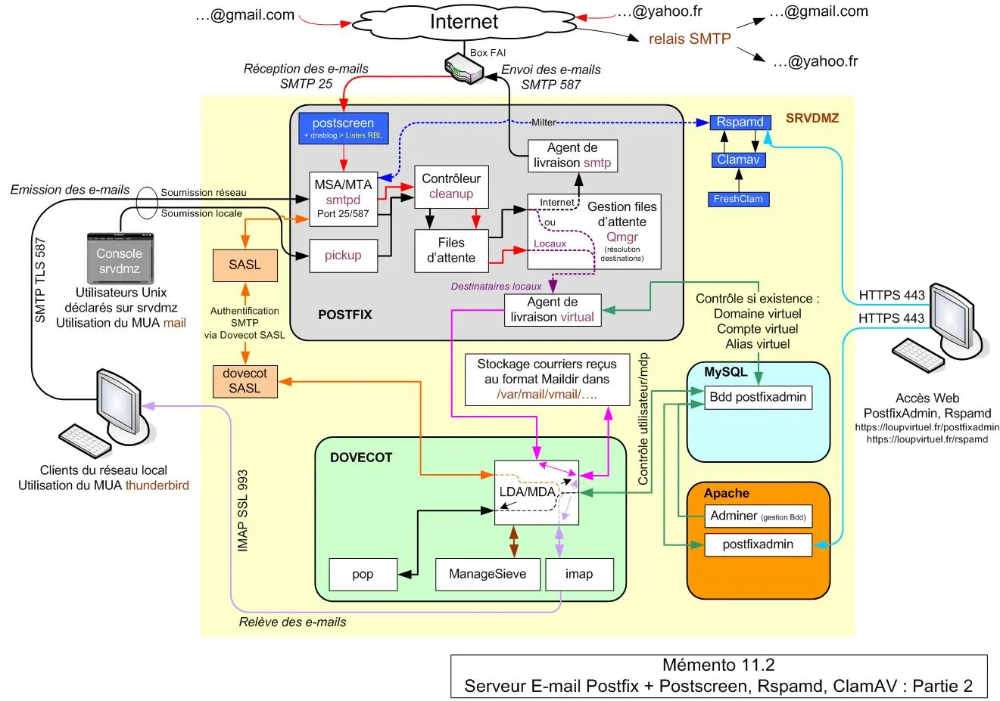
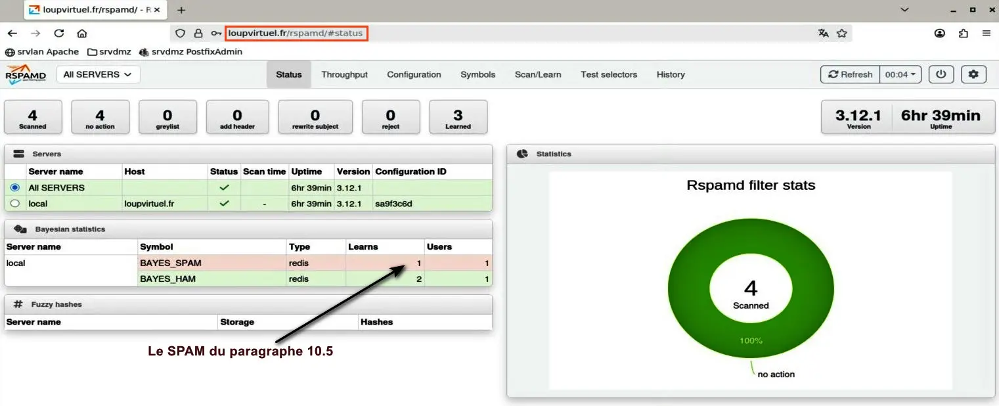
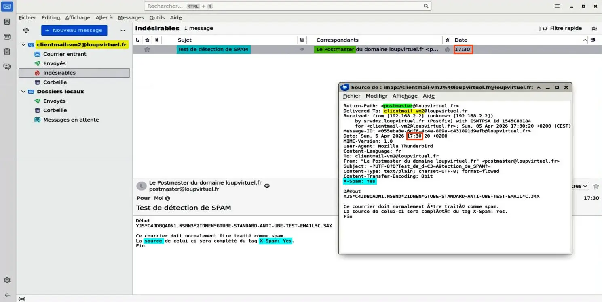
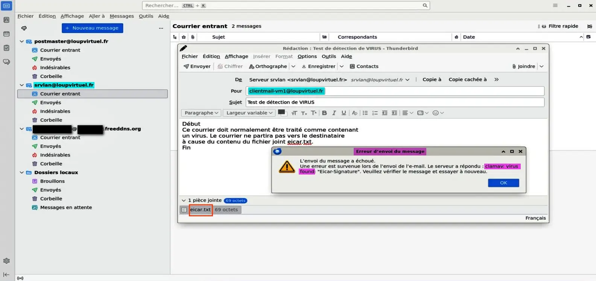

<figure markdown>
  { width="430" }
</figure>

## Mémento 11.2 - Anti spam/virus

Le filtrage du courrier indésirable fera appel aux outils antispam Postscreen et Rspamd plus récents que SpamAssassin ainsi qu'à l'antivirus ClamAV.

### Filtrage du courrier indésirable

Le filtrage exigera de la ressource mémoire, ClamAV en sera le principal consommateur.

Vérifiez la mémoire de base actuellement utilisée :

```bash
[srvdmz@srvdmz] free --mega -t  
```

|                     |           |             |            |
| ------------------- | :-------: | :---------: | :--------: |
|                     | **total** | **utilisé** | **libre**  |  
|Mem:                 | **_1541_**| 873         | 312        |  
|Partition d'échange: | 720       | 0           | 720        |  
|Total                | 2261      | 873         | **_1032_** |

Constat : ≈ 1Go de libre incluant la partition d'échange.

Augmentez, si possible, la RAM actuelle de 1,5 Go à 4 Go.

Les 2,5 Go d'écart seront utilisés par ClamAV, à défaut celui-ci ne fonctionnera pas bien ou pas du tout et il sera préférable de ne pas traiter la partie antivirus.

Vous revérifierez cette ressource à la fin du mémento.

#### _- Postscreen : installation_

Postscreen, placé en amont du démon smtpd, rejettera entre autres les connexions issues des spambots avant que celles-ci ne viennent polluer le serveur Postfix.

<!-- more -->

Les spambots sont des robots à l'origine de la majorité des SPAM émis sur Internet.

Pour activer Postscreen, éditez le fichier master.cf :

```bash
[srvdmz@srvdmz] sudo nano /etc/postfix/master.cf 
```

Commentez la ligne suivante _(# devant la ligne)_ :

```markdown
smtp  inet          n     -     y     -     -     smtpd
```

et décommentez celles-ci _(suppression du #)_ :

```markdown
smtp  inet       n     -     y     -      1    postscreen
smtpd pass       -     -     y     -      -    smtpd
dnsblog  unix    -     -     y     -      0    dnsblog
tlsproxy unix    -     -     y     -      0    tlsproxy
```

#### _- Postscreen : configuration_

Pour le configurer, éditez le fichier main.cf :

```bash
[srvdmz@srvdmz] sudo nano /etc/postfix/main.cf
```

et entrez le contenu suivant en fin de fichier :

```markdown
# Filtrage avec Postscreen
postscreen_access_list = permit_mynetworks, cidr:/etc/postfix/postscreen_access.cidr
postscreen_denylist_action = drop

# Greet delay (anti-bots basiques)
postscreen_greet_wait = 3s
postscreen_greet_banner = Bienvenue, merci de patienter..
postscreen_greet_action = enforce

# DNSBL (Black List DNS) et DNSWL (White List DNS)
postscreen_dnsbl_threshold = 2
postscreen_dnsbl_action = enforce
postscreen_dnsbl_sites =
        zen.spamhaus.org*2
        bl.spamcop.net*1
        swl.spamhaus.org*-4,
        list.dnswl.org=127.[0..255].[0..255].0*-2,
        list.dnswl.org=127.[0..255].[0..255].1*-4,
        list.dnswl.org=127.[0..255].[0..255].[2..3]*-6

# Allowlist DNS (Réduction des faux positifs)        
postscreen_dnsbl_allowlist_threshold = -1

# Tests comportementaux
postscreen_non_smtp_command_enable = yes
postscreen_non_smtp_command_action = enforce

postscreen_pipelining_enable = yes
postscreen_pipelining_action = enforce

postscreen_bare_newline_enable = yes
postscreen_bare_newline_action = enforce
```

Le test access_list permettra de filtrer les clients SMTP selon la valeur des IP contenues dans le paramètre mynetworks et le fichier postscreen_access.cidr.

Ce dernier doit être créé et rempli manuellement :

```bash
[srvdmz@srvdmz] cd /etc/postfix/
[srvdmz@srvdmz] sudo touch postscreen_access.cidr
```

Ci-dessous, un exemple de contenu _(vide par défaut)_ :

```markdown
# Adresses IP autorisées
192.168.2.2  permit

# Adresses IP rejetées
3.137.73.0/24  reject #Plateforme de vente
71.6.158.166  reject
13.58.97.162/32  reject
101.36.106.89  reject
87.236.176.0/24  reject
...
```

Le test greet permettra de rejeter les clients SMTP qui parleront avant que le serveur ne les y autorise comme l'exige le protocole SMTP.

Les tests dnsbl _(Black List DNS)_ et dnswl _(White List DNS)_ permettront de filtrer à l'aide de listes fournies sur Internet les clients SMTP considérés comme fiables ou susceptibles de transmettre des SPAMS.

!!! note "Nota"
    PPostscreen maintient également une liste blanche dynamique dans le fichier /var/lib/postfix/postscreen_cache.db.

Le test non_smtp permettra de rejeter les clients qui useront de Cdes non SMPT telles connect, get et post.

Le test pipelining permettra de rejeter les clients ne respectant pas le protocole d'envoi de Cdes SMTP par lot.

Le test bare_newline permettra de rejeter les clients ne respectant pas la syntaxe SMTP de fin de ligne.

Pour terminer, redémarrez Postfix :

```bash
[srvdmz@srvdmz] sudo systemctl restart postfix
```

Vous devriez rapidement constater le travail de Postscreen en éditant les logs de Postfix :

```bash
[srvdmz@srvdmz] sudo journalctl -n 100 | grep postfix
```

Retour :

```markdown hl_lines="4 12 14 16"
...
oct. 02 10:59:54 srvdmz postfix/postscreen[11713]: CONNECT from [71.6.232.28]:53354 to [192.168.4.2]:25

oct. 02 10:59:54 srvdmz postfix/postscreen[11713]: PREGREET 27 after 0 from [71.6.232.28]:53354: EHLO zx18.quadmetrics.com\r\n

oct. 02 10:59:54 srvdmz postfix/postscreen[11713]: DISCONNECT [71.6.232.28]:53354
...

...
oct. 02 12:06:22 srvdmz postfix/postscreen[12309]: CONNECT from [101.36.106.89]:33098 to [192.168.4.2]:25

oct. 02 12:06:22 srvdmz postfix/dnsblog[12312]: addr 101.36.106.89 listed by domain zen.spamhaus.org as 127.0.0.2

oct. 02 12:06:22 srvdmz postfix/postscreen[12309]: PREGREET 10 after 0.05 from [101.36.106.89]:33098: EHLO ABC\r\n

oct. 02 12:06:22 srvdmz postfix/postscreen[12309]: DNSBL rank 3 for [101.36.106.89]:33098

oct. 02 12:06:24 srvdmz postfix/postscreen[12309]: DISCONNECT [101.36.106.89]:33098
...
```

Si IP rejetée dans le fichier postscreen_access.cidr :

```markdown hl_lines="4"
...
oct. 05 21:34:36 srvdmz postfix/postscreen[3200]: CONNECT from [101.36.106.89]:46110 to [192.168.4.2]:25

oct. 05 21:34:36 srvdmz postfix/postscreen[3200]: DENYLISTED [101.36.106.89]:46110

oct. 05 21:34:36 srvdmz postfix/postscreen[3200]: DISCONNECT [101.36.106.89]:46110
...
```

#### _- Rspamd : installation_

Rspamd, plus récent et moderne que SpamAssassin, viendra compléter la lutte antispam.

**Debian 12**, installez les paquets rspamd et redis-server :

```bash
[srvdmz@srvdmz] sudo apt install rspamd redis-server
```

Fin Debian 12

**Debian 13**, installez les paquets rspamd et valkey-server :

```bash
[srvdmz@srvdmz] sudo apt install rspamd valkey-server
```

Fin Debian 13

Redis ou Valkey sera utilisé par Rspamd pour le stockage des métadonnées _(DKIM, etc...)_, des statistiques bayésiennes _(learned ham/spam)_, des historiques de scan _(history module)_, pour le rate‑limiting _(limitation par IP, domaine, utilisateur)_ et le greylisting, etc...

Tous les fichiers de configuration ont été créés dans le dossier /etc/rspamd/.

Vérifiez enfin le statut des services installés :

```bash
[srvdmz@srvdmz] sudo systemctl status rspamd
[srvdmz@srvdmz] sudo systemctl status redis   # Debian 12
[srvdmz@srvdmz] sudo systemctl status valkey  # Debian 13
```

Retours attendus :

```markdown hl_lines="1 17 20 35"
● rspamd.service - rapid spam filtering system
     Loaded: loaded (/usr/lib/systemd/system/rspamd.service; enabled; preset: enabled)
     Active: active (running) since Sat 2026-03-28 09:58:38 CET; 20min ago
 Invocation: 0cd5abaa9e154a76bca43994ce13e0f4
       Docs: https://rspamd.com/doc/
   Main PID: 2799 (rspamd)
      Tasks: 5 (limit: 4617)
     Memory: 346.7M (peak: 360.6M)
        CPU: 17.936s
     CGroup: /system.slice/rspamd.service
             ├─2799 "rspamd: main process"
             ├─2966 "rspamd: rspamd_proxy process (localhost:11332)"
             ├─2967 "rspamd: controller process (localhost:11334)"
             ├─2968 "rspamd: normal process (localhost:11333)"
             └─2969 "rspamd: hs_helper process"

mars 28 09:58:38 srvdmz systemd[1]: Started rspamd.service - rapid spam filtering system.
mars 28 09:58:38 srvdmz rspamd[2799]: 2026-... 2799(main) <4b7e3c>; main; main: rspamd 3.12.1 ...

● valkey-server.service - Advanced key-value store
     Loaded: loaded (/usr/lib/systemd/system/valkey-server.service; enabled; preset: enabled)
     Active: active (running) since Sat 2026-03-28 09:58:40 CET; 50min ago
 Invocation: a269b4ce1a2f42638186199154a3c8e5
       Docs: https://valkey.io/docs/,
             man:valkey-server(1)
   Main PID: 2950 (valkey-server)
     Status: "Ready to accept connections"
      Tasks: 5 (limit: 4617)
     Memory: 6.1M (peak: 6.6M)
        CPU: 6.371s
     CGroup: /system.slice/valkey-server.service
             └─2950 "/usr/bin/valkey-server 127.0.0.1:6379"

mars 28 09:58:40 srvdmz systemd[1]: Starting valkey-server.service - Advanced key-value store...
mars 28 09:58:40 srvdmz systemd[1]: Started valkey-server.service - Advanced key-value store.
```

L'intégration du logiciel Rspamd dans Postfix se fera via le protocole Milter.

Pour activer celle-ci, éditez le fichier main.cf de Postfix :

```bash
[srvdmz@srvdmz] sudo nano /etc/postfix/main.cf
```

et ajoutez la section suivante en fin de fichier :

```markdown
# Applications Milter (RSPAMD, ...)
smtpd_milters = inet:127.0.0.1:11332
non_smtpd_milters = $smtpd_milters
milter_protocol = 6
milter_default_action = accept
milter_mail_macros = i {mail_addr} {client_addr} {client_name} {auth_authen}
```

Rechargez enfin la nouvelle configuration de Postfix :

```bash
[srvdmz@srvdmz] sudo systemctl reload postfix
```

et redémarrez Rspamd :

```bash
[srvdmz@srvdmz] sudo systemctl restart rspamd
```

Créez ensuite un MDP pour l'administration de Rspamd :

```bash
[srvdmz@srvdmz] sudo rspamadm pw
```

Exemple de retour :

```markdown hl_lines="2"
Enter passphrase: Entrez votre MDP
$2$47knw5msahzcs1noawzdcupfenry5q59$huyz...
```

Le hachage ainsi généré sera destiné aux composants de Rspamd exigeant une authentification, notamment l’interface Web. Notez malgré tout dans un coin le **MDP en clair** car vous en aurez aussi besoin par la suite.

Créez maintenant un fichier worker-controller.inc :

```bash
[srvdmz@srvdmz] cd /etc/rspamd/local.d
[srvdmz@srvdmz] sudo nano worker-controller.inc
```

et entrez le contenu suivant :

```markdown hl_lines="1"
password = "$2$47knw5msahzcs1noawzdcupfenry5q59$huyz...";
bind_socket = "192.168.4.2:11334";
allow_ip = "192.168.3.0/24"
```

Ce fichier sert à configurer le worker controller, c’est‑à‑dire le composant qui permet d’administrer Rspamd via son interface web et son API HTTP. C’est un élément central pour la gestion, le monitoring et l’ajustement dynamique des règles.

Le bind_socket autorise l'accès distant et le allow_ip limite cet accès au réseau 192.168.3.0.

Relancez rspamd :

```bash
[srvdmz@srvdmz] sudo systemctl restart rspamd
```

et testez une connexion sur celui-ci :

```bash
[srvdmz@srvdmz] rspamc -h 192.168.4.2:11334 -P mdp-en-clair stat
```

Exemple de retour :

```markdown
Results for command: stat (0.04 seconds)
Messages scanned: 0
Messages learned: 0
Connections count: 0
Control connections count: 0
Pools allocated: 28
Pools freed: 0
Bytes allocated: 27992312
Memory chunks allocated: 121
Shared chunks allocated: 4
Chunks freed: 0
Oversized chunks: 2
Fuzzy hashes in storage "rspamd.com": 829999100
Fuzzy hashes stored: 829999100
Total learns: 0
```

#### _- Rspamd : filtrage bayésien_

Le filtrage bayésien est une technique de probabilité permettant de mieux traiter le courrier possiblement indésirable.

Activez celui-ci en créant le fichier classifier-bayes.conf :

```bash
[srvdmz@srvdmz] cd /etc/rspamd/override.d
[srvdmz@srvdmz] sudo nano classifier-bayes.conf
```

et en y insérant les lignes suivantes :

```markdown
autolearn = true;

# Envoi des données statistiques vers le serveur Redis ou Valkey
users_enabled = true;
backend = "redis";
```

Gardez ==redis== même si c'est valkey qui est utilisé sous Debain 13.

Créez ensuite un fichier redis.conf :

```bash
[srvdmz@srvdmz] sudo nano redis.conf
```

et indiquez la localisation du serveur Redis/Valkey comme suit :

```markdown
servers = "127.0.0.1:6379";
read_only = false;
```

Demandez à Rspamd de taguer le courrier indésirable en créant un fichier milter_headers.conf :

```bash
[srvdmz@srvdmz] sudo nano milter_headers.conf
```

et en y insérant l'instruction suivante :

```markdown
extended_spam_headers = true;
```

Pour classer automatiquement ce courrier tagué X-Spam: Yes, vous ferez appel au plugin sieve de Dovecot.

Editez, pour cela, le fichier 90-sieve.conf de Dovecot :

```bash
[srvdmz@srvdmz] cd /etc/dovecot/conf.d
[srvdmz@srvdmz] sudo nano 90-sieve.conf
```

**Debian 12**, ajoutez ceci sous la ligne #sieve_after = :

```markdown
sieve_after = /etc/dovecot/sieve-after
```

Fin Debian 12

**Debian 13**, ajoutez ceci en fin de fichier :

```markdown
sieve_script after {
  path = /etc/dovecot/sieve-after
  type = after
}
```

Fin Debian 13

Créez ensuite le dossier sieve-after :

```bash
[srvdmz@srvdmz] sudo mkdir /etc/dovecot/sieve-after
```

et ajoutez dans celui-ci un fichier 10-spam.sieve :

```bash
[srvdmz@srvdmz] cd /etc/dovecot/sieve-after
[srvdmz@srvdmz] sudo nano 10-spam.sieve
```

contenant la règle Sieve suivante :

```markdown
require ["fileinto","mailbox"];

if header :contains "X-Spam" "Yes" {
fileinto :create "Junk";
stop;
}
```

L'utilisation de la règle implique de compiler celle-ci :

```bash
[srvdmz@srvdmz] sudo sievec 10-spam.sieve
```

Un fichier binaire 10-spam.svbin a été généré.

Redémarrez maintenant Dovecot et Rspamd :

```bash
[srvdmz@srvdmz] sudo systemctl restart dovecot
[srvdmz@srvdmz] sudo systemctl restart rspamd
```

La syntaxe des fichiers de configuration de Rspamd peut être contrôlée comme suit :

```bash
[srvdmz@srvdmz] sudo rspamadm configtest
```

Retour normal :

```markdown
Syntax OK
```

#### _- Rspamd : apprentissage_

Si un utilisateur déplace un courrier dans le dossier des spams, Rspamd apprendra que c’est un spam et si un utilisateur déplace un courrier du dossier des spams vers un dossier autre que la corbeille, Rspamd apprendra que c'est un ham soit le contraire d'un spam.

Cet apprentissage impose l'usage du plugin imap_sieve, éditez pour cela le fichier 20-imap.conf :

```bash
[srvdmz@srvdmz] cd /etc/dovecot/conf.d
[srvdmz@srvdmz] sudo nano 20-imap.conf
```

**Debian 12**, modifiez la section protocol imap comme suit :

```markdown
protocol imap {          # Ligne existante

mail_plugins = $mail_plugins imap_sieve

}                        # Ligne existante
```

Fin Debian 12

**Debian 13**, modifiez la section protocol imap comme suit :

```markdown
protocol imap {          # Ligne existante
  
  mail_plugins {
    imap_sieve = yes
  }

}                        # Ligne existante
```

Fin Debian 13

Editez ensuite le fichier 90-sieve.conf :

```bash
[srvdmz@srvdmz] sudo nano 90-sieve.conf
```

**Debian 12**, entrez le contenu suivant à la fin du fichier :

```markdown
plugin {          # Ligne existante

 # Apprentissage selon actions utilisateurs

 sieve_plugins = sieve_imapsieve sieve_extprograms

 # Si déplacé dans dossier spam > script learn-spam.sieve
 imapsieve_mailbox1_name = Junk
 imapsieve_mailbox1_causes = COPY
 imapsieve_mailbox1_before = file:/etc/dovecot/sieve/learn-spam.sieve

 # Si retiré du dossier spam > script learn-ham.sieve
 imapsieve_mailbox2_name = *
 imapsieve_mailbox2_from = Junk
 imapsieve_mailbox2_causes = COPY
 imapsieve_mailbox2_before = file:/etc/dovecot/sieve/learn-ham.sieve

 # Dossier contenant les fichiers de scripts
 sieve_pipe_bin_dir = /etc/dovecot/sieve

 # Autoriser l'envoi d'e-mails vers un programme externe
 sieve_global_extensions = +vnd.dovecot.pipe +vnd.dovecot.environment

}                 # Ligne existante
```

Fin Debian 12

**Debian 13**, entrez le contenu suivant à la fin du fichier :

```markdown
# Apprentissage selon actions utilisateurs

 sieve_plugins = sieve_imapsieve sieve_extprograms

 # Si déplacé dans dossier spam > script learn-spam.sieve
 mailbox Junk {
  sieve_script spam {
    type = before
    cause = copy
    path = /etc/dovecot/sieve/learn-spam.sieve
   }
 } 

 # Si retiré du dossier spam > script learn-ham.sieve
 imapsieve_from Junk {
  sieve_script ham {
    type = before
    cause = copy
    path = /etc/dovecot/sieve/learn-ham.sieve
   }
 }

 # Dossier contenant les fichiers de scripts
 sieve_pipe_bin_dir = /etc/dovecot/sieve

 # Autoriser l'envoi d'e-mails vers un programme externe
 sieve_global_extensions {
  vnd.dovecot.pipe = yes
  vnd.dovecot.environment = yes
 }
```

Fin Debian 13

Créez le dossier sieve dédié aux scripts Sieve/Rspamd :

```bash
[srvdmz@srvdmz] sudo mkdir /etc/dovecot/sieve
```

Générez le 1er script Sieve learn-spam.sieve :

```bash
[srvdmz@srvdmz] cd /etc/dovecot/sieve/
[srvdmz@srvdmz] sudo nano learn-spam.sieve
```

et entrez le contenu suivant proposé dans la documentation Dovecot :

```markdown hl_lines="7"
require ["vnd.dovecot.pipe", "copy", "imapsieve", "environment", "variables"];

if environment :matches "imap.user" "*" {
  set "username" "${1}";
}

pipe :copy "rspamd-learn-spam.sh" [ "${username}" ];
```

Générez enfin le 2ème script Sieve learn-ham.sieve :

```bash
[srvdmz@srvdmz] sudo nano learn-ham.sieve
```

et entrez le contenu suivant proposé dans la documentation Dovecot :

```markdown hl_lines="15"
require ["vnd.dovecot.pipe", "copy", "imapsieve", "environment", "variables"];

if environment :matches "imap.mailbox" "*" {
  set "mailbox" "${1}";
}

if string "${mailbox}" "Trash" {
  stop;
}

if environment :matches "imap.user" "*" {
  set "username" "${1}";
}

pipe :copy "rspamd-learn-ham.sh" [ "${username}" ];
```

Redémarrez Dovecot avant de continuer :

```bash
[srvdmz@srvdmz] sudo systemctl restart dovecot
```

puis compilez les scripts Sieve et modifiez leurs droits :

```bash
[srvdmz@srvdmz] sudo sievec learn-spam.sieve
[srvdmz@srvdmz] sudo sievec learn-ham.sieve

[srvdmz@srvdmz] sudo chmod u=rw,go= /etc/dovecot/sieve/learn-{spam,ham}.{sieve,svbin}

[srvdmz@srvdmz] sudo chown vmail:vmail /etc/dovecot/sieve/learn-{spam,ham}.{sieve,svbin}
```

Générez le 1er script Rspamd rspamd-learn-spam.sh :

```bash
[srvdmz@srvdmz] sudo nano rspamd-learn-spam.sh
```

**Debian 12**, entrez le contenu suivant :

```markdown
#!/bin/sh
exec /usr/bin/rspamc learn_spam
```

Fin Debian 12

**Debian 13**, entrez le contenu suivant :

```markdown hl_lines="2"
#!/bin/sh
exec /usr/bin/rspamc -h 192.168.4.2:11334 -P mdp-en-clair learn_spam
```

Fin Debian 13

Générez le 2ème script Rspamd rspamd-learn-ham.sh :

```bash
[srvdmz@srvdmz] sudo nano rspamd-learn-ham.sh
```

**Debian 12**, entrez le contenu suivant :

```markdown
#!/bin/sh
exec /usr/bin/rspamc learn_ham
```

Fin Debian 12

**Debian 13**, entrez le contenu suivant :

```markdown hl_lines="2"
#!/bin/sh
exec /usr/bin/rspamc -h 192.168.4.2:11334 -P mdp-en-clair learn_ham
```

Fin Debian 13

Modifiez les droits des 2 fichiers et relancez Dovecot :

```bash
[srvdmz@srvdmz] sudo chmod u=rwx,go= /etc/dovecot/sieve/rspamd-learn-{spam,ham}.sh

[srvdmz@srvdmz] sudo chown vmail:vmail /etc/dovecot/sieve/rspamd-learn-{spam,ham}.sh

[srvdmz@srvdmz] sudo systemctl restart dovecot
```

Pour tester la configuration, respectez ces 6 étapes :

**1)** Affichez le dossier Indésirables sur les Thunderbird.  
-> Clic droit sur les comptes ...@`loupvirtuel.fr`  
-> Paramètres -> Paramètres des indésirables  
-> Cochez Déplacer les nouv... indésirables vers  
-> Sélectionnez Dossier << Indésirables >> sur  
-> ...@`loupvirtuel.fr`

Faites de même pour le compte `x.y@zzz.freeddns.org`.

**2)** Modifiez la valeur de mail_debug à yes dans le fichier /etc/dovecot/conf.d/10-logging.conf et relancez Dovecot.

**3)** Envoyez un mail de la VM srvdmz vers la VM srvlan et déplacez le mail reçu dans le dossier Indésirables.

**4)** Déplacez ensuite ce mail du dossier Indésirables vers le dossier Courrier entrant de la VM srvlan.

**5)** Observez enfin le contenu des logs de /var/log/mail.log et /var/log/rspamd/rspamd.log.

```markdown hl_lines="1-2 17 20 25 27 32"
Logs de /var/log/journal/ (partie déplacement vers le dossier des indésirables - SPAM 
14:04:12 srvdmz dovecot: imap(srvlan@loup...: Debug: Mailbox Junk: Mailbox opened
14:04:12 srvdmz dovecot: imap(srvlan@loup...: Debug: ... imapsieve: MOVE event
14:04:12 srvdmz dovecot: imap(srvlan@loup...: Debug: ... imapsieve: storage spam: file: Using Sieve script path: /etc/dovecot/sieve/learn-spam.sieve
14:04:12 srvdmz dovecot: imap(srvlan@loup...: Debug: sieve: Loading script 'spam/learn-spam'
14:04:12 srvdmz dovecot: imap(srvlan@loup...: Debug: sieve: Script binary /etc/dovecot/sieve/learn-spam.svbin successfully loaded
14:04:12 srvdmz dovecot: imap(srvlan@loup...: Debug: sieve: Finished running script '/etc/dovecot/sieve/learn-spam.svbin' (status=ok, resource usage: no usage recorded)
14:04:12 srvdmz dovecot: imap(srvlan@loup...: Debug: sieve: action pipe: running program: rspamd-learn-spam.sh
14:04:12 srvdmz dovecot: imap(srvlan@loup...: Debug: ... execute fork:/etc/dovecot/sieve/rspamd-learn-spam.sh: Created (args=srvlan@loupvirtuel.fr)
14:04:12 srvdmz dovecot: imap(srvlan@loup...: Debug: ... execute fork:/etc/dovecot/sieve/rspamd-learn-spam.sh: Pass environment: USER=srvlan@loupvirtuel.fr
14:04:12 srvdmz dovecot: imap(srvlan@loup...: Debug: ... execute fork:/etc/dovecot/sieve/rspamd-learn-spam.sh: Pass environment: HOME=/var/mail/vmail/loupvirtuel.fr/srvlan
14:04:12 srvdmz dovecot: imap(srvlan@loup...: Debug: ... execute fork:/etc/dovecot/sieve/rspamd-learn-spam.sh: Pass environment: HOST=srvdmz.loupvirtuel.fr
14:04:12 srvdmz dovecot: imap(srvlan@loup...: Debug: Mailbox Junk: UID 4: Opened mail because: mail stream
14:04:12 srvdmz dovecot: imap(srvlan@loup...: Debug: ... execute fork:/etc/dovecot/sieve/rspamd-learn-spam.sh: Establishing connection
14:04:12 srvdmz dovecot: imap(srvlan@loup...: Debug: ... execute exec:/etc/dovecot/sieve/rspamd-learn-spam.sh (3750): Disconnected
14:04:12 srvdmz dovecot: imap(srvlan@loup...: Debug: sieve: uid=4: pipe action: piped message to program 'rspamd-learn-spam.sh'
14:04:12 srvdmz dovecot: imap(srvlan@loup...: Debug: sieve: uid=4: left message in mailbox 'Junk'
14:04:12 srvdmz dovecot: imap(srvlan@loup...: Debug: sieve: uid=4: Finished executing result (final, status=ok, keep=yes)

Logs de /var/log/rspamd/ (partie déplacement vers le dossier des indésirables - SPAM 
14:04:12 ... rspamd_controller_check_password: using password as enable_password for a privileged command
14:04:12 ... rspamd_message_parse: loaded message; id: <c89fd999-bb66-4cdc-9843-a27b4b821e68@loupvirtuel.fr>; queue-id: <undef>; size: 913; checksum: <43d3...>
14:04:12 rspamd_mime_part_detect_language: detected part language: fr
14:04:12 bayes_classify: not classified as ham. The ham class needs more training samples. Currently: 1; minimum 200 required
14:04:12 ... rspamd_controller_learn_fin_task: <192.168.4.2> learned message as spam: c89fd999-bb66-4cdc-9843-a27b4b821e68@loupvirtuel.fr

Logs de /var/log/rspamd/ (partie déplacement depuis le dossier des indésirables - HAM
17:18:55 ... rspamd_controller_check_password: using password as enable_password for a privileged command
17:18:55 ... rspamd_message_parse: loaded message; id: <c89fd999-bb66-4cdc-9843-a27b4b821e68@loupvirtuel.fr>; queue-id: <undef>; size: 913; checksum: <43d3...>
17:18:55 ... rspamd_mime_part_detect_language: detected part language: fr
17:18:55 ... bayes_classify: not classified as ham. The ham class needs more training samples. Currently: 1; minimum 200 required
17:18:55 ... rspamd_controller_learn_fin_task: <192.168.4.2> learned message as ham: c89fd999-bb66-4cdc-9843-a27b4b821e68@loupvirtuel.fr
```

**6)** Terminez en remettant la valeur du paramètre mail_debug à no et relancez Dovecot.

#### _- Rspamd : interface Web_

Rspamd est fourni avec une interface Web permettant de contrôler les courriers marqués comme spam, d'avoir des statistiques, etc...

Il est nécessaire, pour accéder à celle-ci, d'éditer l'hôte virtuel de nom loupvirtuel.conf :

```bash
[srvdmz@srvdmz] cd /etc/apache2/sites-available
[srvdmz@srvdmz] sudo nano loupvirtuel.conf
```

et d'ajouter ceci dans la section VirtualHost *:443 :

```markdown
ProxyPass "/rspamd" "http://localhost:11334"
ProxyPassReverse "/rspamd" "http://localhost:11334"
```

Redémarrez le serveur Web Apache :

```bash
[srvdmz@srvdmz] sudo systemctl restart apache2
```

Puis, ouvrez l'URL `https://loupvirtuel.fr/rspamd/` et entrez en clair le MDP d'administration de Rspamd créé au paragraphe "Rspamd : installation" :

<figure markdown>
  { width="430" }
  <figcaption>Rspamd : Interface Web</figcaption>
</figure>

#### _- ClamAV : installation_

Par curiosité, contrôlez de nouveau les ressources disponibles qui ont du peu évoluer :

```bash
[srvdmz@srvdmz] free --mega -t
[srvdmz@srvdmz] df /dev/sda1 -H
```

Installez maintenant les paquets ClamAV suivants :

```bash
[srvdmz@srvdmz] sudo apt install clamav clamav-daemon
```

Un groupe/utilisateur de nom clamav et 2 services de nom clamav-daemon et clamav-fresclam ont été créés.

Attendez 5 à 10 minutes et vérifiez le statut du service de MAJ des Bdd ClamAV :

```bash
[srvdmz@srvdmz] sudo systemctl restart clamav-freshclam
[srvdmz@srvdmz] sudo systemctl status clamav-freshclam
```

Retour normal :

```markdown hl_lines="21-23"
● clamav-freshclam.service - ClamAV virus database updater
     Loaded: loaded (/usr/lib/systemd/system/clamav-freshclam.service; disabled; preset: enabled)
     Active: active (running) since Sun 2026-04-05 15:44:29 CEST; 13s ago
 Invocation: 74654982b04c47fbb7279d2ca6b8af18
       Docs: man:freshclam(1)
             man:freshclam.conf(5)
             https://docs.clamav.net/
   Main PID: 5202 (freshclam)
      Tasks: 1 (limit: 4617)
     Memory: 3M (peak: 3.4M)
        CPU: 28ms
     CGroup: /system.slice/clamav-freshclam.service
             └─5202 /usr/bin/freshclam -d --foreground=true

avril 05 15:44:29 srvdmz systemd[1]: Stopping clamav-freshclam.service - ClamAV virus database updater...
avril 05 15:44:29 srvdmz systemd[1]: clamav-freshclam.service: Deactivated successfully.
avril 05 15:44:29 srvdmz systemd[1]: Stopped clamav-freshclam.service - ClamAV virus database updater.
avril 05 15:44:29 srvdmz systemd[1]: clamav-freshclam.service: Consumed 13.331s CPU time, 674.5M mem...
avril 05 15:44:29 srvdmz systemd[1]: Started clamav-freshclam.service - ClamAV virus database updater.
avril 05 15:44:29 srvdmz freshclam[5202]: ... 15:44:29 2026 -> ClamAV update process started ...
avril 05 15:44:29 srvdmz freshclam[5202]: ...  5 15:44:29 2026 -> daily.cvd database is up-to-date ...
avril 05 15:44:29 srvdmz freshclam[5202]: ...  5 15:44:29 2026 -> main.cvd database is up-to-date ...
avril 05 15:44:29 srvdmz freshclam[5202]: ...  5 15:44:29 2026 -> bytecode.cvd database is up-to-date ...
```

Les Bdd daily, main et bytecode doivent être up to date.

Si les Bdd sont up to date, autorisez le service clamav-freshclam au boot du système et démarrez le service clamav-daemon :

```bash
[srvdmz@srvdmz] sudo systemctl enable clamav-freshclam
[srvdmz@srvdmz] sudo systemctl start clamav-daemon
[srvdmz@srvdmz] sudo systemctl status clamav-daemon
```

Retour de la dernière Cde :

```markdown hl_lines="5 15"
● clamav-daemon.service - Clam AntiVirus userspace daemon
     Loaded: loaded (/usr/lib/systemd/system/clamav-daemon.service; enabled; preset: enabled)
    Drop-In: /etc/systemd/system/clamav-daemon.service.d
             └─extend.conf
     Active: active (running) since Sun 2026-04-05 15:59:36 CEST; 14s ago
 Invocation: 624dc12ab612415882ac6a8f46744104
TriggeredBy: ● clamav-daemon.socket
       Docs: man:clamd(8)
             man:clamd.conf(5)
             https://docs.clamav.net/
    Process: 5444 ExecStartPre=/bin/mkdir -p /run/clamav (code=exited, status=0/SUCCESS)
    Process: 5445 ExecStartPre=/bin/chown clamav /run/clamav (code=exited, status=0/SUCCESS)
   Main PID: 5447 (clamd)
      Tasks: 2 (limit: 4617)
     Memory: 958.5M (peak: 958.7M)
        CPU: 12.603s
     CGroup: /system.slice/clamav-daemon.service
             └─5447 /usr/sbin/clamd --foreground=true

avril 05 15:59:49 srvdmz clamd[5447]: Sun Apr  5 15:59:49 2026 -> ELF support enabled.
avril 05 15:59:49 srvdmz clamd[5447]: Sun Apr  5 15:59:49 2026 -> Mail files support enabled.
avril 05 15:59:49 srvdmz clamd[5447]: Sun Apr  5 15:59:49 2026 -> OLE2 support enabled.
avril 05 15:59:49 srvdmz clamd[5447]: Sun Apr  5 15:59:49 2026 -> PDF support enabled.
avril 05 15:59:49 srvdmz clamd[5447]: Sun Apr  5 15:59:49 2026 -> SWF support enabled.
avril 05 15:59:49 srvdmz clamd[5447]: Sun Apr  5 15:59:49 2026 -> HTML support enabled.
avril 05 15:59:49 srvdmz clamd[5447]: Sun Apr  5 15:59:49 2026 -> XMLDOCS support enabled.
avril 05 15:59:49 srvdmz clamd[5447]: Sun Apr  5 15:59:49 2026 -> HWP3 support enabled.
avril 05 15:59:49 srvdmz clamd[5447]: Sun Apr  5 15:59:49 2026 -> OneNote support enabled.
avril 05 15:59:49 srvdmz clamd[5447]: Sun Apr  5 15:59:49 2026 -> Self checking every 3600 seconds.
```

Au prochain boot système, le service clamav-daemon démarrera automatiquement.

Le scan d'un dossier peut déjà s'effectuer comme suit :

```bash
[srvdmz@srvdmz] sudo clamscan /home/srvdmz
```

Retour :

```markdown  hl_lines="38"
Loading:    12s, ETA:   0s [========================>]    3.63M/3.63M sigs       
Compiling:   2s, ETA:   0s [========================>]       41/41 tasks 

/home/srvdmz/.profile: OK
/home/srvdmz/.bash_logout: OK
/home/srvdmz/.xorgxrdp.11.log.old: OK
/home/srvdmz/.vboxclient-vmsvga-session-tty7-control.pid: OK
/home/srvdmz/.xorgxrdp.11.log: OK
/home/srvdmz/.mariadb_history: OK
/home/srvdmz/.xorgxrdp.10.log.old: OK
/home/srvdmz/.vboxclient-draganddrop-tty7-service.pid: OK
/home/srvdmz/.Xauthority: OK
/home/srvdmz/.bash_history: OK
/home/srvdmz/.vboxclient-hostversion-tty7-control.pid: OK
/home/srvdmz/.vboxclient-vmsvga-session-tty7-service.pid: OK
/home/srvdmz/.xsession-errors: OK
/home/srvdmz/.dmrc: OK
/home/srvdmz/.sudo_as_admin_successful: Empty file
/home/srvdmz/.face.icon: Symbolic link
/home/srvdmz/.vboxclient-seamless-tty7-control.pid: OK
/home/srvdmz/.ICEauthority: OK
/home/srvdmz/.lesshst: OK
/home/srvdmz/.bashrc: OK
/home/srvdmz/.face: OK
/home/srvdmz/.xsession-errors.old: OK
/home/srvdmz/.vboxclient-clipboard-tty7-service.pid: OK
/home/srvdmz/.vboxclient-clipboard-tty7-control.pid: OK
/home/srvdmz/.xorgxrdp.10.log: OK
/home/srvdmz/.vboxclient-seamless-tty7-service.pid: OK
/home/srvdmz/mbox: OK
/home/srvdmz/.vboxclient-draganddrop-tty7-control.pid: OK

----------- SCAN SUMMARY -----------
Known viruses: 3627820
Engine version: 1.4.3
Scanned directories: 1
Scanned files: 26
Infected files: 0
Data scanned: 1.09 MB
Data read: 0.53 MB (ratio 2.05:1)
Time: 14.944 sec (0 m 14 s)
Start Date: 2026:04:05 16:12:37
End Date:   2026:04:05 16:12:52
```

Les logs sont consultables dans /var/log/clamav/.

#### _- ClamAV : configuration_

Les fichiers sont situés dans le dossier /etc/clamav/.

Il est possible de réduire la fréquence de MAJ des Bdd en éditant le fichier freshclam.conf :

```bash
[srvdmz@srvdmz] sudo nano /etc/clamav/freshclam.conf
```

et en modifiant la valeur 24 du paramètre Checks à 3 :

```markdown
Checks 3
```

Les MAJ seront effectuées 3 fois par jour au lieu de 24.

Redémarrez le service :

```bash
[srvdmz@srvdmz] sudo systemctl restart clamav-freshclam
```

!!! note "Nota"
    Comme pour root, créez depuis l'interface de PostfixAdmin un alias de l'utilisateur clamav vers postmaster afin que ce dernier puisse recevoir les notifications par e-mail de ClamAV.

#### _- ClamAV : lien avec Rspamd_

Afin que Rspamd utilise ClamAV, créez le fichier suivant :

```bash
[srvdmz@srvdmz] sudo nano /etc/rspamd/local.d/antivirus.conf
```

et entrez le contenu ci-dessous :

```markdown
clamav {
    scan_mime_parts = true;
    symbol = "CLAM_VIRUS";
    type = "clamav";
    action = "reject";
    servers = "/var/run/clamav/clamd.ctl";
}
```

Pour finir rechargez la configuration de Rspamd :

```bash
[srvdmz@srvdmz] sudo systemctl reload rspamd
```

### Tests

#### _- Détection d'un SPAM_

Au préalable, créez un fichier temporaire options.inc :

```bash
[srvdmz@srvdmz] cd /etc/rspamd/local.d
[srvdmz@srvdmz] sudo nano options.inc
```

**Debian 12**, entrez le contenu suivant :

```markdown
enable_test_patterns = true;
```

Fin Debian 12

**Debian 13**, entrez le contenu suivant :

```markdown
gtube_patterns = "all"
```

Fin Debian 13

Ceci permettra d'effectuer le test attendu, voir les explications sur le site [rspamd.com](https://rspamd.com/doc/other/gtube_patterns.html){ target="_blank" }.

Redémarrez ensuite Rspamd :

```bash
[srvdmz@srvdmz] sudo systemctl restart rspamd
```

et envoyez, depuis le Thunderbird de la VM srvlan, un courrier de postmaster vers clientmail-vm2 contenant ceci :

```markdown
Début
YJS*C4JDBQADN1.NSBN3*2IDNEN*GTUBE-STANDARD-ANTI-UBE-TEST-EMAIL*C.34X

Ce courrier doit normalement être traité comme spam.
La source de celui-ci sera complété du tag X-Spam: Yes.
Fin
```

Si tout se passe bien, le courrier sera, pour le compte clientmail-vm2, stocké automatiquement dans le dossier des Indésirables de Thunderbird.

Vérifiez sur debian-vm2 que clientmail-vm2 le reçoit bien notifié du tag X-Spam: Yes :

<figure markdown>
  { width="430" }
  <figcaption>Thunderbird : Tag X-Spam: Yes</figcaption>
</figure>

Sur la VM srvdmz, le courrier a été stocké dans :

```bash
[srvdmz@srvdmz] sudo ls -la /var/mail/vmail/loupvirtuel.fr/clientmail-vm2/Maildir/.Junk/cur/
```

Retour :

```markdown
-rw------- 1 vmail vmail  909  5 avril 17:30 '1775403020.M209924P6513.srvdmz,S=909,W=933:2,S'
```

Le groupe date/heure correspond avec celui du mail reçu sur le compte virtuel clientmail-vm2.

Si OK, vous pouvez supprimer le fichier options.inc.

#### _- Détection d'un VIRUS_

Au préalable, éditez le fichier antivirus.conf :

```bash
[srvdmz@srvdmz] cd /etc/rspamd/local.d
[srvdmz@srvdmz] sudo nano antivirus.conf
```

et modifiez son contenu comme suit :

```markdown hl_lines="8"
clamav {
    scan_mime_parts = true;
    symbol = "CLAM_VIRUS";
    type = "clamav";
    action = "reject";
    servers = "/var/run/clamav/clamd.ctl";

patterns {
    JUST_EICAR = '^Eicar-Test-Signature$';
                }
}
```

Ceci permettra d'effectuer le test attendu, voir les explications sur le site [rspamd.com](https://rspamd.com/doc/modules/antivirus.html){ target="_blank" }.

Redémarrez ensuite Rspamd :

```bash
[srvdmz@srvdmz] sudo systemctl restart rspamd
```

Puis créez dans le dossier Documents de la VM srvlan un fichier texte de nom eicar.txt avec le contenu suivant :

```markdown
X5O!P%@AP[4\PZX54(P^)7CC)7}$EICAR-STANDARD-ANTIVIRUS-TEST-FILE!$H+H*
```

Ce contenu est téléchargeable depuis le site Eicar _(European Institute for Computer Antivirus Research)_ en utilisant l'URL [https://secure.eicar.org/eicar.com.txt](https://secure.eicar.org/eicar.com.txt){ target="_blank" }.

Pour finir, envoyez depuis la VM srvlan, un courrier de srvlan vers clientmail-vm1 contenant ceci et joignez le fichier eicar.txt :

```markdown
Début
Ce courrier doit normalement être traité comme contenant
un virus. Le courrier ne partira pas vers le destinataire
à cause du contenu du fichier joint eicar.txt.
Fin
```

Résultat, le virus sera détecté lors de la phase d'envoi du mail depuis la VM srvlan et rejeté _(paramètre action = "reject"; du fichier antivirus.conf)_.

<figure markdown>
  { width="430" }
  <figcaption>Thunderbird : Information de virus détecté</figcaption>
</figure>

#### _- Mémoire système_

ClamAV est gourmand :

```bash
[srvdmz@srvdmz] free --mega -t
```

|                     |           |             |           |
| ------------------- | :-------: | :---------: | :-------: |
|                     | **total** | **utilisé** | **libre** |  
|Mem:                 | 4112      | _**2161**_  | 1220      |  
|Partition d'échange: | 720       | 0           | 720       |  
|Total                | 4832      | 2161        | 1940      |

ClamAV exigera parfois plus que le 2161 Mo affiché ci-dessus d'où le besoin de 4 Go de RAM. A défaut n'utilisez pas le logiciel antivirus.

#### _- Contrôle des logs_

Consultez le journal des logs _(Cde journalctl)_ et le fichier /var/log/rspamd/rspamd.log, le premier permettant notamment d'observer l'efficacité de l'outil Postscreen.

Vous allez vite comprendre que l'ouverture du port 25 sur votre box Internet sera rapidement exploitée par divers scanners et robots spammeurs.

{ align=left }

&nbsp;  
Voilà !  
Le courrier indésirable est géré.  
La partie 3 vous attend pour  
traiter le WebMail avec Roundcube ...

[Partie 3](../posts/e-mail-partie-3-debian.md){ .md-button .md-button--primary }
