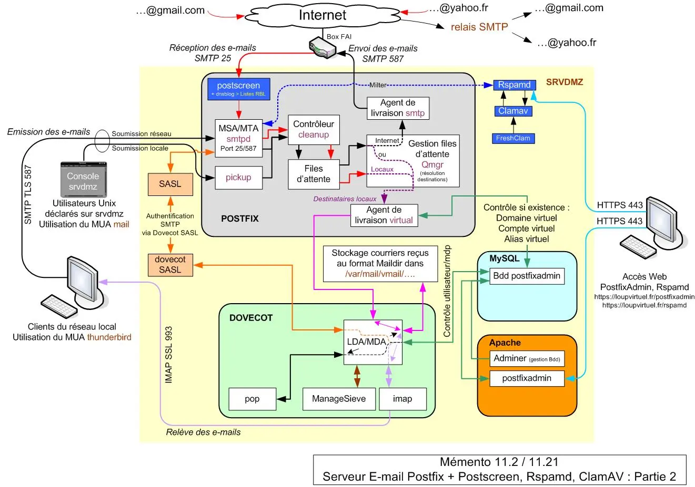
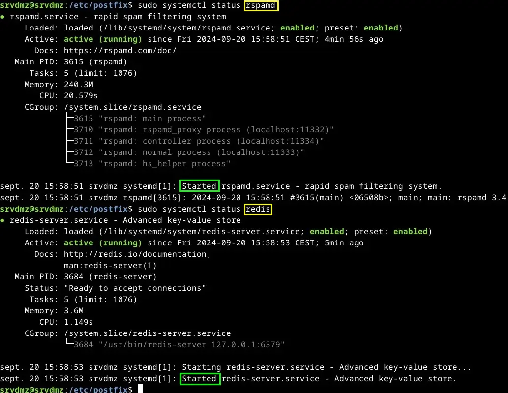
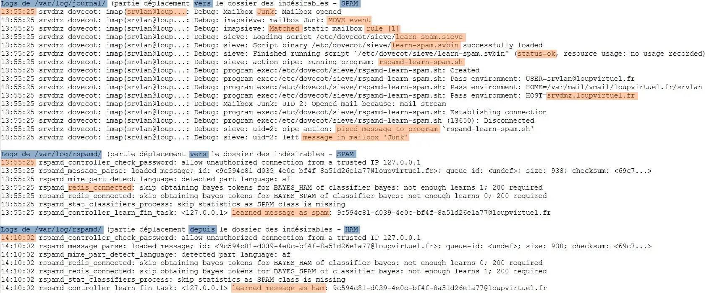
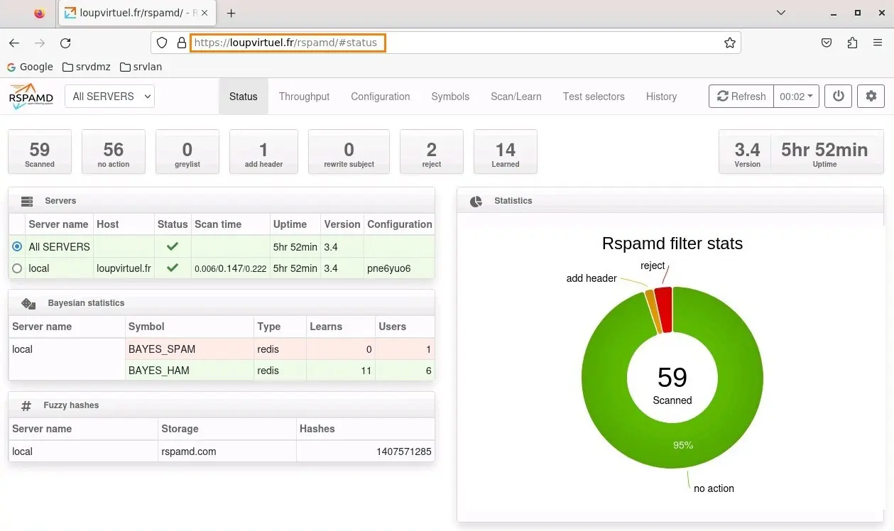
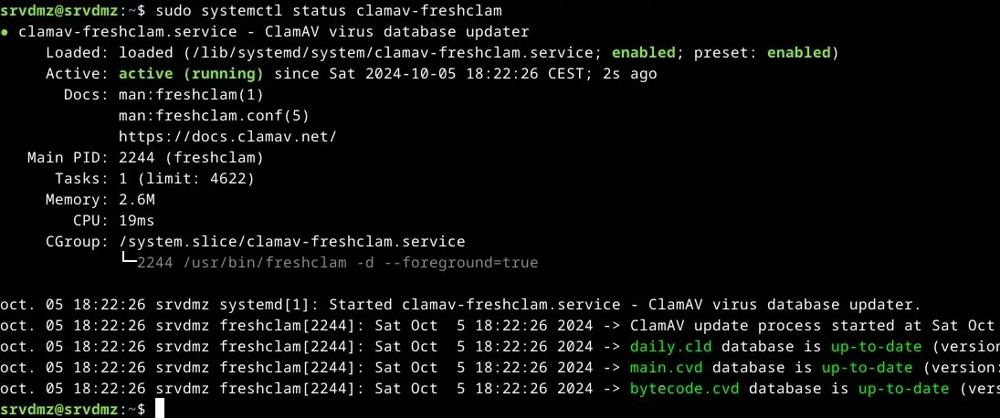
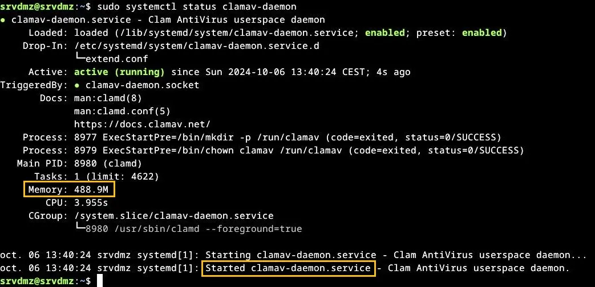
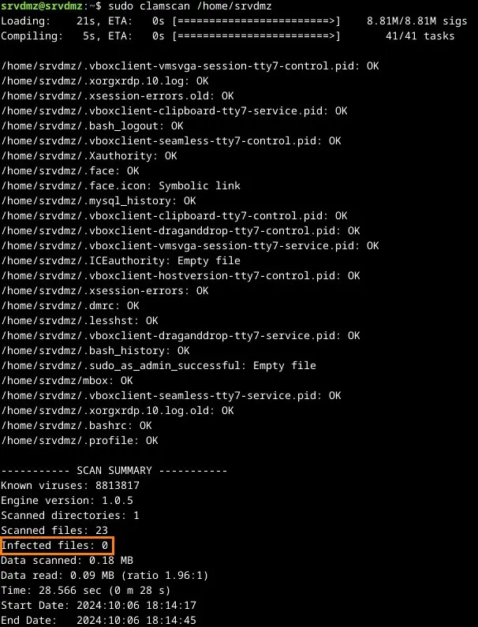
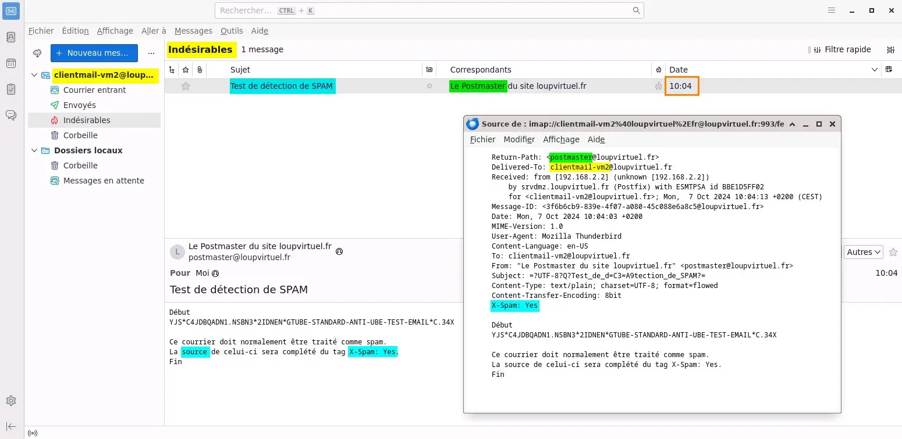
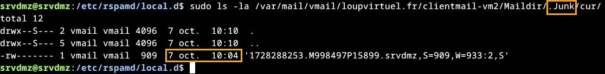
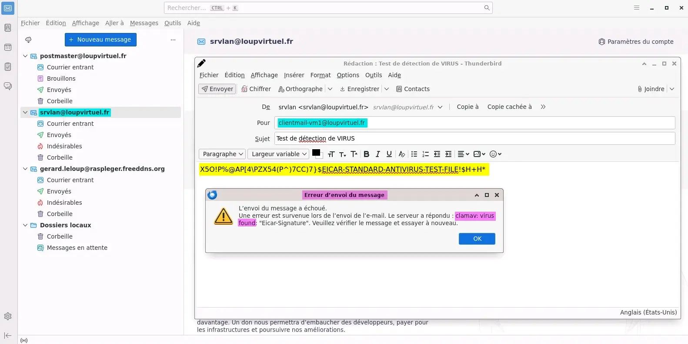

<figure markdown>
  { width="430" }
</figure>

## Mémento 11.2 - Anti spam/virus

Le filtrage du courrier indésirable fera appel aux outils antispam Postscreen et Rspamd plus récents que SpamAssassin ainsi qu'à l'antivirus ClamAV.

### Filtrage du courrier indésirable

Le filtrage exigera de la ressource mémoire, ClamAV en sera le principal consommateur.

Vérifiez la mémoire de base actuellement utilisée :

```bash
[srvdmz@srvdmz:~$] free --mega -t  
```

|                     |           |             |           |
| ------------------- | :-------: | :---------: | :-------: |
|                     | **total** | **utilisé** | **libre** |  
|Mem:                 | **_1007_**| 848         | 66        |  
|Partition d'échange: | 1022      | 98          | 924       |  
|Total                | 2029      | 946         | **_990_** |

Constat : ≈ 1Go de libre incluant la partition d'échange.

Augmentez, si possible, la RAM actuelle de 1Go à 4 Go.

Les 3 Go d'écart seront utilisés par ClamAV, à défaut celui-ci ne fonctionnera pas bien ou pas du tout et il sera préférable de ne pas traiter la partie antivirus.

Vous revérifierez cette ressource à la fin du mémento.

#### _- Postscreen : installation_

Postscreen, placé en amont du démon smtpd, rejettera entre autres les connexions issues des spambots avant que celles-ci ne viennent polluer le serveur Postfix.

<!-- more -->

Les spambots sont des robots à l'origine de la majorité des SPAM émis sur Internet.

Pour activer Postscreen, éditez le fichier master.cf :

```bash
[srvdmz@srvdmz:~$] sudo nano /etc/postfix/master.cf 
```

Commentez la ligne suivante _(# devant la ligne)_ :

```markdown
smtp  inet          n     -     y     -     -     smtpd
```

et décommentez celles-ci _(suppression du #)_ :

```markdown
smtp  inet       n     -     y     -      1    postscreen
smtpd pass       -     -     y     -      -    smtpd
dnsblog  unix    -     -     y     -      0    dnsblog
tlsproxy unix    -     -     y     -      0    tlsproxy
```

#### _- Postscreen : configuration_

Pour le configurer, éditez le fichier main.cf :

```bash
[srvdmz@srvdmz:~$] sudo nano /etc/postfix/main.cf
```

et entrez le contenu suivant en fin de fichier :

```markdown
# Filtrage avec Postscreen
postscreen_access_list = permit_mynetworks, cidr:/etc/postfix/postscreen_access.cidr

postscreen_denylist_action = drop

postscreen_greet_wait = 3s
postscreen_greet_banner = Bienvenue,merci de patienter..
postscreen_greet_action = enforce

postscreen_dnsbl_threshold = 3
postscreen_dnsbl_action = enforce
postscreen_dnsbl_sites =
        zen.spamhaus.org*3
        b.barracudacentral.org=127.0.0.[2..11]*2
        bl.spameatingmonkey.net*2
        bl.spamcop.net
        #dnsbl.sorbs.net
        swl.spamhaus.org*-4,
        list.dnswl.org=127.[0..255].[0..255].0*-2,
        list.dnswl.org=127.[0..255].[0..255].1*-4,
        list.dnswl.org=127.[0..255].[0..255].[2..3]*-6

postscreen_dnsbl_allowlist_threshold = -2

postscreen_non_smtp_command_enable = yes
postscreen_non_smtp_command_action = enforce

postscreen_pipelining_enable = yes
postscreen_pipelining_action = enforce

postscreen_bare_newline_enable = yes
postscreen_bare_newline_action = enforce
```

Le test access_list permettra de filtrer les clients SMTP selon la valeur des IP contenues dans le paramètre mynetworks et le fichier postscreen_access.cidr.

Ce dernier doit être créé et rempli manuellement :

```bash
[srvdmz@srvdmz:~$] cd /etc/postfix/
[srvdmz@srvdmz:~$] sudo touch postscreen_access.cidr
```

Ci-dessous, un exemple de contenu _(vide par défaut)_ :

```markdown
# Adresses IP autorisées
192.168.2.2       permit

# Adresses IP rejetées
164.52.24.168     reject
71.6.158.166      reject
71.6.146.186      reject
101.36.106.89     reject
87.236.176.0/24   reject
...
```

Le test greet permettra de rejeter les clients SMTP qui parleront avant que le serveur ne les y autorise comme l'exige le protocole SMTP.

Les tests dnsbl _(Black List DNS)_ et dnswl _(White List DNS)_ permettront de filtrer à l'aide de listes fournies sur Internet les clients SMTP considérés comme fiables ou susceptibles de transmettre des SPAMS.

!!! note "Nota"
    Postscreen maintient une liste blanche dynamique dans le fichier postscreen_cache.db situé dans /var/lib/postfix.

Le test non_smtp permettra de rejeter les clients qui useront de Cdes non SMPT telles connect, get et post.

Le test pipelining permettra de rejeter les clients ne respectant pas le protocole d'envoi de Cdes SMTP par lot.

Le test bare_newline permettra de rejeter les clients ne respectant pas la syntaxe SMTP de fin de ligne.

Pour terminer, redémarrez Postfix :

```bash
[srvdmz@srvdmz:~$] sudo systemctl restart postfix
```

Vous devriez rapidement constater le travail de Postscreen en éditant les logs de Postfix :

```bash
[srvdmz@srvdmz:~$] sudo journalctl -n 100 | grep postfix
```

Retour :

```markdown hl_lines="4 12 14 16"
...
oct. 02 10:59:54 srvdmz postfix/postscreen[11713]: CONNECT from [71.6.232.28]:53354 to [192.168.4.2]:25

oct. 02 10:59:54 srvdmz postfix/postscreen[11713]: PREGREET 27 after 0 from [71.6.232.28]:53354: EHLO zx18.quadmetrics.com\r\n

oct. 02 10:59:54 srvdmz postfix/postscreen[11713]: DISCONNECT [71.6.232.28]:53354
...

...
oct. 02 12:06:22 srvdmz postfix/postscreen[12309]: CONNECT from [101.36.106.89]:33098 to [192.168.4.2]:25

oct. 02 12:06:22 srvdmz postfix/dnsblog[12312]: addr 101.36.106.89 listed by domain zen.spamhaus.org as 127.0.0.2

oct. 02 12:06:22 srvdmz postfix/postscreen[12309]: PREGREET 10 after 0.05 from [101.36.106.89]:33098: EHLO ABC\r\n

oct. 02 12:06:22 srvdmz postfix/postscreen[12309]: DNSBL rank 3 for [101.36.106.89]:33098

oct. 02 12:06:24 srvdmz postfix/postscreen[12309]: DISCONNECT [101.36.106.89]:33098
...
```

Si IP rejetée dans le fichier postscreen_access.cidr :

```markdown hl_lines="4"
...
oct. 05 21:34:36 srvdmz postfix/postscreen[3200]: CONNECT from [101.36.106.89]:46110 to [192.168.4.2]:25

oct. 05 21:34:36 srvdmz postfix/postscreen[3200]: DENYLISTED [101.36.106.89]:46110

oct. 05 21:34:36 srvdmz postfix/postscreen[3200]: DISCONNECT [101.36.106.89]:46110
...
```

#### _- Rspamd : installation_

Rspamd, plus récent et moderne que SpamAssassin, viendra compléter la lutte antispam.

Installez le paquet rspamd :

```bash
[srvdmz@srvdmz:~$] sudo apt install rspamd
```

Son installation inclut celle d'un serveur de Bdd Redis.

Tous les fichiers de configuration ont été créés dans le dossier /etc/rspamd/.

Vérifiez enfin le statut des services rspamd et redis :

```bash
[srvdmz@srvdmz:~$] sudo systemctl status rspamd
[srvdmz@srvdmz:~$] sudo systemctl status redis
```

Retours :

<figure markdown>
  { width="430" }
  <figcaption>Rspamd et Redis : Statuts</figcaption>
</figure>

L'intégration du logiciel Rspamd dans Postfix se fera via le protocole Milter.

Pour activer celle-ci, éditez le fichier main.cf de Postfix :

```bash
[srvdmz@srvdmz:~$] sudo nano /etc/postfix/main.cf
```

et ajoutez la section suivante en fin de fichier :

```markdown
# Applications Milter (RSPAMD, ...)
smtpd_milters = inet:127.0.0.1:11332
non_smtpd_milters = $smtpd_milters
milter_protocol = 6
milter_default_action = accept
milter_mail_macros = i {mail_addr} {client_addr} {client_name} {auth_authen}
```

Rechargez enfin la nouvelle configuration de Postfix :

```bash
[srvdmz@srvdmz:~$] sudo systemctl reload postfix
```

et redémarrez Rspamd :

```bash
[srvdmz@srvdmz:~$] sudo systemctl restart rspamd
```

#### _- Rspamd : filtrage bayésien_

Activez l'auto-apprentissage bayésien en créant le fichier classifier-bayes.conf :

```bash
[srvdmz@srvdmz:~$] cd /etc/rspamd/override.d
[srvdmz@srvdmz:~$] sudo nano classifier-bayes.conf
```

et en y insérant les lignes suivantes :

```markdown
autolearn = true;

# Envoi des données statistiques vers le serveur Redis
users_enabled = true;
backend = "redis";
```

Le filtrage bayésien est une technique de probabilité permettant de traiter le courrier indésirable.

Créez ensuite un fichier redis.conf :

```bash
[srvdmz@srvdmz:~$] sudo nano redis.conf
```

et indiquez la localisation du serveur Redis comme suit :

```markdown
servers = "127.0.0.1";
```

Demandez à Rspamd de taguer le courrier indésirable en créant un fichier milter_headers.conf :

```bash
[srvdmz@srvdmz:~$] sudo nano milter_headers.conf
```

et en y insérant l'instruction suivante :

```markdown
extended_spam_headers = true;
```

Pour classer automatiquement ce courrier tagué X-Spam: Yes, vous ferez appel au plugin sieve de Dovecot.

Editez, pour cela, le fichier 90-sieve.conf de Dovecot :

```bash
[srvdmz@srvdmz:~$] cd /etc/dovecot/conf.d
[srvdmz@srvdmz:~$] sudo nano 90-sieve.conf
```

et ajoutez ceci sous la ligne #sieve_after = :

```markdown
sieve_after = /etc/dovecot/sieve-after
```

Créez ensuite le dossier sieve-after :

```bash
[srvdmz@srvdmz:~$] sudo mkdir /etc/dovecot/sieve-after
```

et ajoutez dans celui-ci un fichier 10-spam.sieve :

```bash
[srvdmz@srvdmz:~$] cd /etc/dovecot/sieve-after
[srvdmz@srvdmz:~$] sudo nano 10-spam.sieve
```

contenant la règle Sieve suivante :

```markdown
require ["fileinto","mailbox"];
if header :contains "X-Spam" "Yes" {
fileinto :create "Junk";
stop;
}
```

L'utilisation de la règle implique de compiler celle-ci :

```bash
[srvdmz@srvdmz:~$] sudo sievec 10-spam.sieve
```

Un fichier binaire 10-spam.svbin a été généré.

Redémarrez maintenant Dovecot et Rspamd :

```bash
[srvdmz@srvdmz:~$] sudo systemctl restart dovecot
[srvdmz@srvdmz:~$] sudo systemctl restart rspamd
```

La syntaxe des fichiers de configuration de Rspamd peut être contrôlée comme suit :

```bash
[srvdmz@srvdmz:~$] sudo rspamadm configtest
```

Retour :

```markdown
Syntax OK
```

#### _- Rspamd : apprentissage_

Si un utilisateur déplace un courrier dans le dossier des spams, Rspamd apprendra que c’est un spam et si un utilisateur déplace un courrier du dossier des spams vers un dossier autre que la corbeille, Rspamd apprendra que c'est un ham soit le contraire d'un spam.

Cet apprentissage impose l'usage du plugin imap_sieve, éditez pour cela le fichier 20-imap.conf :

```bash
[srvdmz@srvdmz:~$] cd /etc/dovecot/conf.d
[srvdmz@srvdmz:~$] sudo nano 20-imap.conf
```

et ajoutez ceci sous #mail_plugins = $mail_plugins :

```markdown
protocol imap {          # Ligne existante

mail_plugins = $mail_plugins imap_sieve

}                        # Ligne existante
```

Editez ensuite le fichier 90-sieve.conf :

```bash
[srvdmz@srvdmz:~$] sudo nano 90-sieve.conf
```

et entrez le contenu suivant à la fin du fichier :

```markdown
plugin {          # Ligne existante

# Apprentissage selon actions utilisateurs

  sieve_plugins = sieve_imapsieve sieve_extprograms

 # Si déplacé dans dossier spam > script learn-spam.sieve
 imapsieve_mailbox1_name = Junk
 imapsieve_mailbox1_causes = COPY
 imapsieve_mailbox1_before = file:/etc/dovecot/sieve/learn-spam.sieve

 # Si retiré du dossier spam > script learn-ham.sieve
 imapsieve_mailbox2_name = *
 imapsieve_mailbox2_from = Junk
 imapsieve_mailbox2_causes = COPY
 imapsieve_mailbox2_before = file:/etc/dovecot/sieve/learn-ham.sieve

 # Dossier contenant les fichiers de scripts
 sieve_pipe_bin_dir = /etc/dovecot/sieve

 # Autoriser l'envoi d'e-mails vers un programme externe
 sieve_global_extensions = +vnd.dovecot.pipe +vnd.dovecot.environment

}                 # Ligne existante
```

Créez le dossier sieve dédié aux scripts Sieve/Rspamd :

```bash
[srvdmz@srvdmz:~$] sudo mkdir /etc/dovecot/sieve
```

Générez le 1er script Sieve learn-spam.sieve :

```bash
[srvdmz@srvdmz:~$] cd /etc/dovecot/sieve/
[srvdmz@srvdmz:~$] sudo nano learn-spam.sieve
```

et entrez le contenu suivant proposé par Dovecot :

```markdown
require ["vnd.dovecot.pipe", "copy", "imapsieve", "environment", "variables"];
if environment :matches "imap.user" "*" {
  set "username" "${1}";
}
pipe :copy "rspamd-learn-spam.sh" [ "${username}" ];
```

Générez enfin le 2ème script Sieve learn-ham.sieve :

```bash
[srvdmz@srvdmz:~$] sudo nano learn-ham.sieve
```

et entrez le contenu suivant proposé par Dovecot :

```markdown
require ["vnd.dovecot.pipe", "copy", "imapsieve", "environment", "variables"];
if environment :matches "imap.mailbox" "*" {
  set "mailbox" "${1}";
}
if string "${mailbox}" "Trash" {
  stop;
}
if environment :matches "imap.user" "*" {
  set "username" "${1}";
}
pipe :copy "rspamd-learn-ham.sh" [ "${username}" ];
```

Redémarrez Dovecot avant de continuer :

```bash
[srvdmz@srvdmz:~$] sudo systemctl restart dovecot
```

puis compilez les scripts Sieve et modifiez leurs droits :

```bash
[srvdmz@srvdmz:~$] sudo sievec learn-spam.sieve
[srvdmz@srvdmz:~$] sudo sievec learn-ham.sieve

[srvdmz@srvdmz:~$] sudo chmod u=rw,go= /etc/dovecot/sieve/learn-{spam,ham}.{sieve,svbin}

[srvdmz@srvdmz:~$] sudo chown vmail:vmail /etc/dovecot/sieve/learn-{spam,ham}.{sieve,svbin}
```

Générez le 1er script Rspamd rspamd-learn-spam.sh :

```bash
[srvdmz@srvdmz:~$] sudo nano rspamd-learn-spam.sh
```

et entrez le contenu suivant :

```markdown
#!/bin/sh
exec /usr/bin/rspamc learn_spam
```

Générez le 2ème script Rspamd rspamd-learn-ham.sh :

```bash
[srvdmz@srvdmz:~$] sudo nano rspamd-learn-ham.sh
```

et entrez le contenu suivant :

```markdown
#!/bin/sh
exec /usr/bin/rspamc learn_ham
```

Modifiez les droits des 2 fichiers et relancez Dovecot :

```bash
[srvdmz@srvdmz:~$] sudo chmod u=rwx,go= /etc/dovecot/sieve/rspamd-learn-{spam,ham}.sh

[srvdmz@srvdmz:~$] sudo chown vmail:vmail /etc/dovecot/sieve/rspamd-learn-{spam,ham}.sh

[srvdmz@srvdmz:~$] sudo systemctl restart dovecot
```

Pour tester la configuration, respectez ces 6 étapes :

**1)** Affichez le dossier Indésirables sur les Thunderbird.  
-> Clic droit sur les comptes ...@`loupvirtuel.fr`  
-> Paramètres -> Paramètres des indésirables  
-> Cochez Déplacer les nouv... indésirables vers  
-> Sélectionnez Dossier << Indésirables >> sur  
-> ...@`loupvirtuel.fr`

Faites de même pour le compte `x.y@zzz.freeddns.org`.

**2)** Activez le mail_debug de /etc/dovecot/conf.d/10-logging.conf à yes et relancez Dovecot.

**3)** Envoyez un mail de `srvdmz` vers `srvlan` et déplacez le mail reçu dans le dossier Indésirables.

**4)** Déplacez ensuite ce mail du dossier Indésirables vers le dossier Courrier entrant de `srvlan`.

**5)** Observez enfin le contenu des logs de /var/log/mail.log et /var/log/rspamd/rspamd.log.

<figure markdown>
  { width="430" }
  <figcaption>Logs : Lignes présentes de Dovecot et Rspamd</figcaption>
</figure>

**6)** Terminez en remettant la valeur du paramètre mail_debug à no et relancez Dovecot.

#### _- Rspamd : interface Web_

Rspamd est fourni avec une interface Web permettant de contrôler les courriers marqués comme spam, d'avoir des statistiques, etc...

Il est nécessaire, pour accéder à celle-ci, d'éditer l'hôte virtuel loupvirtuel.conf :

```bash
[srvdmz@srvdmz:~$] cd /etc/apache2/sites-available
[srvdmz@srvdmz:~$] sudo nano loupvirtuel.conf
```

et d'ajouter ceci dans la section VirtualHost *:443 :

```markdown
ProxyPass "/rspamd" "http://localhost:11334"
ProxyPassReverse "/rspamd" "http://localhost:11334"
```

Redémarrez le serveur Web Apache :

```bash
[srvdmz@srvdmz:~$] sudo systemctl restart apache2
```

Créez enfin le MDP d'accès exigé par l'interface Web :

```bash
[srvdmz@srvdmz:~$] sudo rspamadm pw
```

Exemple de retour :

```markdown
Enter passphrase: Entrez votre MDP
$2$z777ywazwfxww636chfnmyifd83wb1p4$8b8c...
```

Créez maintenant un fichier worker-controller.inc :

```bash
[srvdmz@srvdmz:~$] cd /etc/rspamd/local.d
[srvdmz@srvdmz:~$] sudo nano worker-controller.inc
```

Entrez le hachage du MDP comme suit :

```markdown
password = "$2$z777ywazwfxww636chfnmyifd83wb1p4$8b8c..."
```

et relancez rspamd :

```bash
[srvdmz@srvdmz:~$] sudo systemctl restart rspamd
```

Pour finir, testez l'URL `https://loupvirtuel.fr/rspamd/` :

<figure markdown>
  { width="430" }
  <figcaption>Rspamd : Interface Web</figcaption>
</figure>

#### _- ClamAV : installation_

Par curiosité, contrôlez de nouveau les ressources disponibles qui ont du peu évoluer :

```bash
[srvdmz@srvdmz:~$] free --mega -t
[srvdmz@srvdmz:~$] df /dev/sda1 -H
```

Installez maintenant les paquets ClamAV suivants :

```bash
[srvdmz@srvdmz:~$] sudo apt install clamav clamav-daemon
[srvdmz@srvdmz:~$] sudo apt install clamav-unofficial-sigs
```

Un groupe/utilisateur clamav et 2 services ont été créés.

Le paquet clamav-unofficial-sigs installe une base virale fournie par la société SaneSecurity, base qui vient compléter celles de ClamAV.

Attendez 5 à 10 minutes et vérifiez le statut du service de MAJ des Bdd ClamAV :

```bash
[srvdmz@srvdmz:~$] sudo systemctl restart clamav-freshclam
[srvdmz@srvdmz:~$] sudo systemctl status clamav-freshclam
[srvdmz@srvdmz:~$] sudo systemctl enable clamav-freshclam
```

<figure markdown>
  { width="430" }
  <figcaption>ClamAV : Statut du service clamav-freshclam</figcaption>
</figure>

Les Bdd daily, main et bytecode doivent être up to date.

Si Bdd up to date, démarrez le service clamav-daemon :

```bash
[srvdmz@srvdmz:~$] sudo systemctl start clamav-daemon
[srvdmz@srvdmz:~$] sudo systemctl status clamav-daemon
```

<figure markdown>
  { width="430" }
  <figcaption>ClamAV : Statut du service clamav-daemon</figcaption>
</figure>

Au prochain boot système, le service clamav-daemon démarrera automatiquement.

Le scan d'un dossier peut déjà s'effectuer comme suit :

```bash
[srvdmz@srvdmz:~$] sudo clamscan /home/srvdmz
```

<figure markdown>
  { width="430" }
  <figcaption>ClamAV : Scan du dossier /home/srvdmz</figcaption>
</figure>

Les logs sont consultables dans /var/log/clamav/.

Le bon traitement de la base virale clamav-unofficial-sigs peut être vérifié comme suit :

```bash
[srvdmz@srvdmz:~$] cd /home/srvdmz
[srvdmz@srvdmz:~$] sudo clamscan --debug 2>&1 /dev/null | grep "sanesecurity"
```

Retour :

```markdown
LibClamAV debug: /var/lib/clamav/sanesecurity.ftm loaded
```

#### _- ClamAV : configuration_

Les fichiers sont situés dans le dossier /etc/clamav/.

Il est possible de réduire la fréquence de MAJ des Bdd en éditant le fichier freshclam.conf :

```bash
[srvdmz@srvdmz:~$] sudo nano /etc/clamav/freshclam.conf
```

et en modifiant la valeur 24 du paramètre Checks à 3 :

```markdown
Checks 3
```

Les MAJ seront effectuées 3 fois par jour au lieu de 24.

!!! note "Nota"
    Comme pour root, créez depuis l'interface de PostfixAdmin un alias de l'utilisateur clamav vers postmaster afin que ce dernier puisse recevoir les notifications par e-mail de ClamAV.

#### _- ClamAV : lien avec Rspamd_

Afin que Rspamd utilise ClamAV, créez le fichier suivant :

```bash
[srvdmz@srvdmz:~$] sudo nano /etc/rspamd/local.d/antivirus.conf
```

et entrez le contenu ci-dessous :

```markdown
clamav {
    scan_mime_parts = false;
    symbol = "CLAM_VIRUS";
    type = "clamav";
    action = "reject";
    servers = "/var/run/clamav/clamd.ctl";
}
```

Pour finir rechargez la configuration de Rspamd :

```bash
[srvdmz@srvdmz:~$] sudo systemctl reload rspamd
```

### Tests

#### _- Détection d'un SPAM_

Au préalable, créez un fichier temporaire options.inc :

```bash
[srvdmz@srvdmz:~$] cd /etc/rspamd/local.d
[srvdmz@srvdmz:~$] sudo nano options.inc
```

et entrez le contenu suivant :

```markdown
enable_test_patterns = true;
```

Ceci permettra d'effectuer le test attendu, voir les explications sur le site [rspamd.com](https://rspamd.com/doc/other/gtube_patterns.html){ target="_blank" }.

Redémarrez ensuite Rspamd :

```bash
[srvdmz@srvdmz:~$] sudo systemctl restart rspamd
```

et envoyez, depuis le Thunderbird de `srvlan`, un courrier de `postmaster` vers `clientmail-vm2` contenant ceci :

```markdown
Début
YJS*C4JDBQADN1.NSBN3*2IDNEN*GTUBE-STANDARD-\
ANTI-UBE-TEST-EMAIL*C.34X
Ce courrier doit normalement être traité comme spam.
La source de celui-ci sera complété du tag X-Spam: Yes.
Fin
```

Le caractère \ indique d'écrire le tout sur une seule ligne.

Si tout se passe bien, le courrier sera, pour le compte `clientmail-vm2`, stocké automatiquement dans le dossier des Indésirables de Thunderbird.

Vérifiez sur `debian12-vm2` que `clientmail-vm2` le reçoit bien notifié du tag X-Spam: Yes :

<figure markdown>
  { width="430" }
  <figcaption>Thunderbird : Tag X-Spam: Yes</figcaption>
</figure>

Sur `srvdmz`, le courrier a été stocké dans :

<figure markdown>
  { width="430" }
  <figcaption>srvdmz : SPAM dans le dossier .Junk</figcaption>
</figure>

Le groupe date/heure correspond avec celui du mail reçu sur le compte virtuel `clientmail-vm2`.

Si OK, vous pouvez supprimer le fichier options.inc.

#### _- Détection d'un VIRUS_

Au préalable, éditez le fichier antivirus.conf :

```bash
[srvdmz@srvdmz:~$] cd /etc/rspamd/local.d
[srvdmz@srvdmz:~$] sudo nano antivirus.conf
```

et modifiez son contenu comme suit :

```markdown hl_lines="8"
clamav {
    scan_mime_parts = false;
    symbol = "CLAM_VIRUS";
    type = "clamav";
    action = "reject";
    servers = "/var/run/clamav/clamd.ctl";

patterns {
    JUST_EICAR = '^Eicar-Test-Signature$';
                }
}
```

Ceci permettra d'effectuer le test attendu, voir les explications sur le site [rspamd.com](https://rspamd.com/doc/modules/antivirus.html){ target="_blank" }.

Redémarrez ensuite Rspamd :

```bash
[srvdmz@srvdmz:~$] sudo systemctl restart rspamd
```

Envoyez à présent, depuis `srvlan`, un courrier de `srvlan` vers `clientmail-vm1` contenant ceci :

```markdown
X5O!P%@AP[4\PZX54(P^)7CC)7}$EICAR-STANDARD-\
ANTIVIRUS-TEST-FILE!$H+H*
```

Le caractère \ indique d'écrire le tout sur une seule ligne.

Ce contenu est téléchargeable depuis le site Eicar (European Institute for Computer Antivirus Research) en utilisant l'URL [https://secure.eicar.org/eicar.com.txt](https://secure.eicar.org/eicar.com.txt){ target="_blank" }.

Résultat, le virus sera détecté lors de la phase d'envoi du mail depuis `srvlan` et rejeté _(paramètre action = "reject"; du fichier antivirus.conf)_.

<figure markdown>
  { width="430" }
  <figcaption>Thunderbird : Information de virus détecté</figcaption>
</figure>

#### _- Mémoire système_

ClamAV est gourmand :

```bash
[srvdmz@srvdmz:~$] free --mega -t
```

|                     |           |             |           |
| ------------------- | :-------: | :---------: | :-------: |
|                     | **total** | **utilisé** | **libre** |  
|Mem:                 | 4105      | _**2456**_  | 803       |  
|Partition d'échange: | 1022      | 620         | 401       |  
|Total                | 5127      | 3077        | 1205      |

Constat : ≈ 1Go de libre incluant la partition d'échange.

ClamAV exigera parfois plus que le 2456 Mo affiché ci-dessus d'où le besoin de 4 Go de RAM. A défaut n'utilisez pas le logiciel antivirus.

#### _- Contrôle des logs_

Consultez le journal des logs _(Cde journalctl)_ et le fichier /var/log/rspamd/rspamd.log, le premier permettant notamment d'observer l'efficacité de l'outil Postscreen.

Vous allez vite comprendre que l'ouverture du port 25 sur votre box Internet sera rapidement exploitée par divers scanners et robots spammeurs.

{ align=left }

&nbsp;  
Voilà !  
Le courrier indésirable est géré.  
La partie 3 vous attend pour  
traiter le WebMail avec Roundcube ...

[Partie 3](../posts/e-mail-partie-3-debian12.md){ .md-button .md-button--primary }
