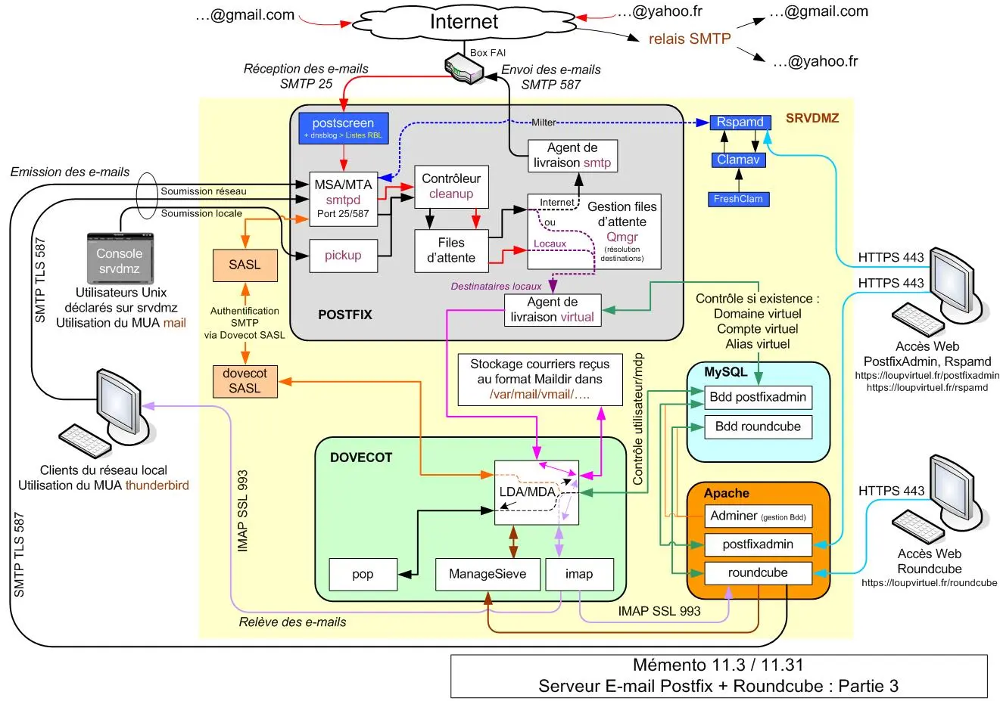
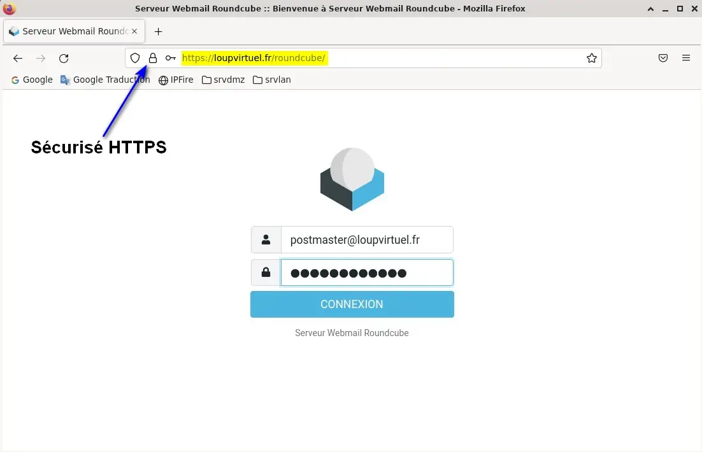
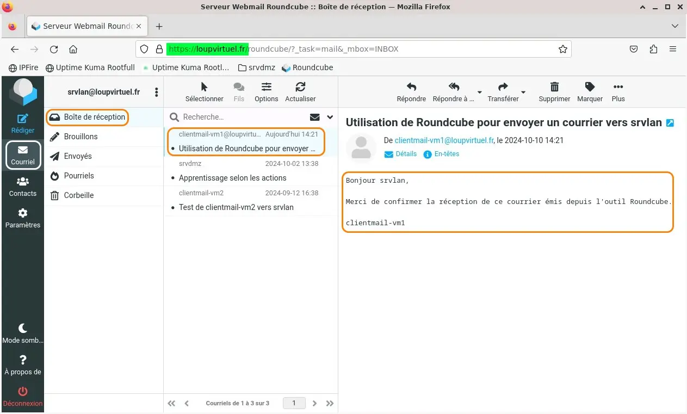
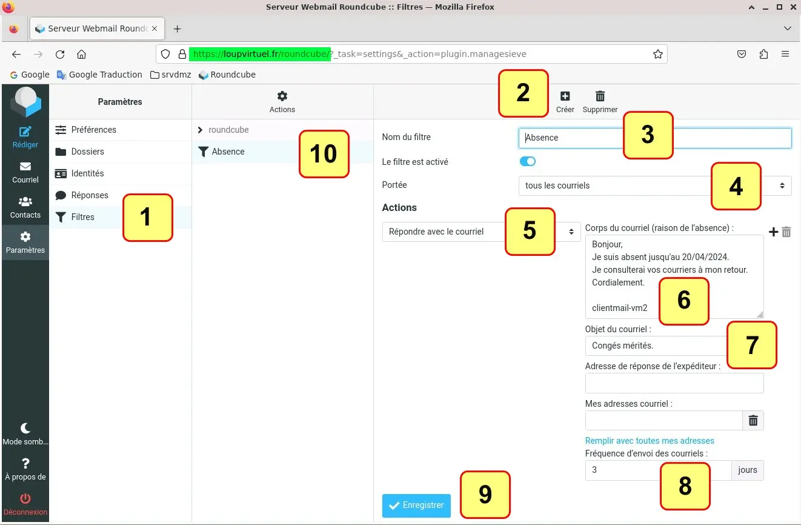
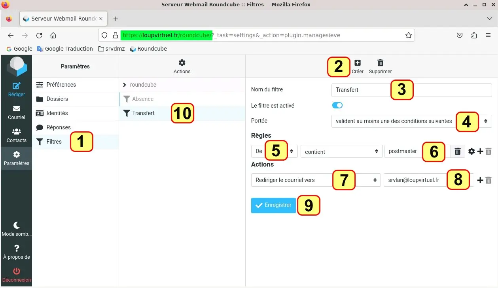
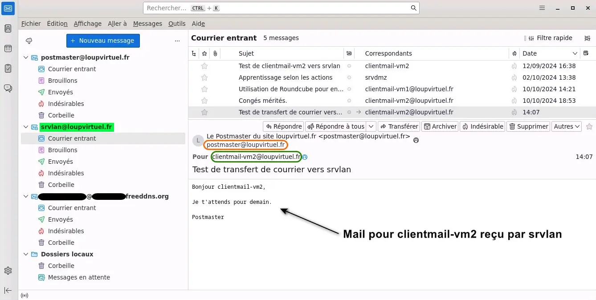

<figure markdown>
  { width="430" }
</figure>

## Mémento 11.3 - Roundcube

Le service Webmail fera appel au logiciel Roundcube qui est un client de messagerie au même titre que Thunderbird mais s'exécutant sur serveur.

Il servira d'interface entre le serveur de courrier et n'importe quel navigateur Web connecté à Internet ce qui le rend pratique pour une consultation de son courrier en situation de mobilité.

### Webmail Roundcube

#### _- Installation et configuration_

Installez le paquet Debian roundcube :

```bash
[srvdmz@srvdmz:~$] sudo apt install roundcube 
```

Une fenêtre _Configuration de roundcube-core_ s'ouvre :  
\- Faut-il configurer ... roundcube ... -common ? => Oui  
\- MDP de connexion MySQL ... => roundcubemysql => OK  
\- Confirmation du MDP => roundcubemysql => OK

L'installation continue jusqu'à son terme.

Les dépendances ont été ajoutées automatiquement.

Les fichiers ont été installés essentiellement dans :  
\- /etc/roundcube/ - /var/lib/roundcube/  
\- /usr/share/roundcube/ - /var/log/roundcube/

Une Bdd de nom roundcube a également été créée ainsi qu'un lien de configuration Apache de nom roundcube.conf dans /etc/apache2/conf-enabled/.  

<!-- more -->

Editez ensuite le fichier de configuration config.inc.php :

```bash
[srvdmz@srvdmz:~$] cd /etc/roundcube
[srvdmz@srvdmz:~$] sudo nano config.inc.php 
```

Modifiez le contenu de ces lignes comme suit :

```markdown
$config['imap_host'] = ["ssl://loupvirtuel.fr:993"];
$config['smtp_host'] = 'tls://loupvirtuel.fr:587';
$config['smtp_user'] = '%u'; 
$config['smtp_pass'] = '%p';
$config['product_name'] = 'Serveur Webmail Roundcube'; 
```

et ajoutez celui-ci à la fin du fichier :

```markdown hl_lines="7 15"
# Ci-dessous, contenu de defaults.inc.php remplacé
# SSL IMAP
$config['imap_conn_options'] = [
  'ssl'         => [
     'verify_peer'  => true,
     'verify_depth' => 3,
     'cafile'       => '/etc/ssl/loupvirtuel-ca.pem',
   ],
 ];
# TLS SMTP
$config['smtp_conn_options'] = [
  'ssl' => [
     'verify_peer'  => true,
     'verify_depth' => 3,
     'cafile'       => '/etc/ssl/loupvirtuel-ca.pem',
   ],
 ];
# Ajout auto du domaine aux créations d'utilisateurs
$config['mail_domain'] = 'loupvirtuel.fr';
```

Editez enfin le fichier de configuration apache.conf :

```bash
[srvdmz@srvdmz:~$] sudo nano apache.conf
```

et décommentez l'alias situé en début de fichier :

```markdown
Alias /roundcube /var/lib/roundcube/public_html
```

Pour traiter l'alias, redémarrez Apache :

```bash
[srvdmz@srvdmz:~$] sudo systemctl restart apache2
```

L'accès à la Bdd roundcube peut être testé avec Adminer, voir [Mémento 8.1](lamp-https-cms-partie-1-debian12.md#adminer){ target="_blank" } :  
\- Utilisateur => roundcube  
\- Mot de passe => roundcubemysql

#### _- Accès depuis la VM srvlan_

Au préalable, créez sur `srvdmz` un lien symbolique vers le dossier Web de roundcube :

```bash
[srvdmz@srvdmz:~$] sudo  ln -s /var/lib/roundcube /var/www/html/roundcube
```

et donnez aux 2 dossiers Roundcube ci-dessous les permissions suivantes :

```bash
[srvdmz@srvdmz:~$]  sudo chown -R www-data:www-data /var/lib/roundcube

[srvdmz@srvdmz:~$]  sudo chown -R www-data:www-data /var/log/roundcube
```

Comme avec PostfixAdmin, la redirection vers HTTPS est assurée depuis cette section située au début du fichier /etc/apache2/sites-available/loupvirtuel.conf :

```markdown
<VirtualHost *:80>
ServerName loupvirtuel.fr
ServerAlias www.loupvirtuel.fr srvdmz.loupvirtuel.fr
Redirect permanent / https://loupvirtuel.fr/
</VirtualHost>
```

Si vous avez exécuté le [Mémento 8.1 2/2](lamp-https-cms-partie-2-debian12.md){ target="_blank" }, les 3 URL HTTP ci-dessous seront redirigées automatiquement vers HTTPS sans faire l'objet d'une alerte de sécurité.

\- `http://loupvirtuel.fr/roundcube`  
\- `http://www.loupvirtuel.fr/roundcube`  
\- `http://srvdmz.loupvirtuel.fr/roundcube`

Renforcez la redirection https en éditant config.inc.php :

```bash
[srvdmz@srvdmz:~$] cd /etc/roundcube
[srvdmz@srvdmz:~$] sudo nano config.inc.php
```

et en ajoutant les 2 lignes suivantes en fin de fichier :

```markdown
# Utilisation forcée du protocole HTTPS
$config['force_https'] = true;
```

Ensuite, depuis `srvlan`, lancez l'URL suivante :  
`https://loupvirtuel.fr/roundcube`

Une fenêtre de connexion Rouncube s'affiche :  
=> Nom d'utilisateur => `postmaster@loupvirtuel.fr`  
=> Mot de passe => postmaster31  
=> Bouton Connexion

<figure markdown>
  { width="430" }
  <figcaption>Roundcube : Fenêtre de connexion</figcaption>
</figure>

Vous devriez trouver dans la boîte de réception affichée par Roundcube les courriers transmis à Postmaster lors des mémentos précédents.

#### _- Envoi/réception LAN_

Depuis `debian12-vm1`, utilisez Roundcube pour envoyer un courrier vers `srvlan@loupvirtuel.fr`.

Paramètres de connexion sur l'hôte `debian12-vm1` :  
=> `https://loupvirtuel.fr/roundcube`  
=> Nom d'utilisateur => `clientmail-vm1@loupvirtuel.fr`  
=> Mot de passe => Votre MDP
=> Bouton Connexion

\- Menu de gauche => Icône Rédiger

Envoyez votre courrier et récupérez celui-ci en utilisant Roundcube depuis l'hôte `srvlan` :

<figure markdown>
  { width="430" }
  <figcaption>Roundcube : Courrier reçu sur l'hôte srvlan</figcaption>
</figure>

Réalisez le même test depuis `srvlan` vers `debian12-vm1`.

#### _- Envoi/réception INTERNET_

Référence : [Mémento 11.1](e-mail-partie-1-debian12.md#spf-dkim){ target="_blank" }

Effectuez un envoi depuis le MUA de votre smartphone vers l'adresse `x.y@zzz.freeddns.org` et récupérez celui-ci depuis l'hôte `srvlan` et inversement.

Pour vérifier la réception depuis `srvlan`, utilisez l'URL :  
`https://loupvirtuel.fr/roundcube`

Une fenêtre de connexion Roundcube s'affiche :  
=> Utilisateur => `x.y@zzz.freeddns.org`  
=> Mot de passe => y42  
=> Bouton Connexion

#### _- Ajout des filtres de tri Sieve_

Référence : [Mémento 11.1](e-mail-partie-1-debian12.md#dovecot){ target="_blank" }

Installez le paquet contenant les plugins de Roundcube :

```bash
[srvdmz@srvdmz:~$] sudo apt install roundcube-plugins
```

Ceux-ci ont été installés dans /etc/roundcube/plugins.

Activez le plugin managesieve en éditant ce fichier :

```bash
[srvdmz@srvdmz:~$] cd /etc/roundcube
[srvdmz@srvdmz:~$] sudo nano config.inc.php
```

et en modifiant la section suivante comme ci-dessous :

```markdown
$config['plugins'] = [
    'managesieve',
];
```

Quittez si besoin la session roundcube en cours et reconnectez-vous pour exploiter les filtres.

#### _- Filtre de réponse auto_

Créez sur l'hôte `debian12-vm2` un filtre permettant de générer une réponse automatique en cas d'absence, ceci pour tous les courriers reçus.

Depuis le navigateur Web, entrez l'URL :  
`https://loupvirtuel.fr/roundcube`

Une fenêtre de connexion Rouncube s'affiche :  
=> Nom d'utilisateur => `clientmail-vm2@loupvirtuel.fr`  
=> Mot de passe => Votre MDP  
=> Bouton Connexion

\- Menu de gauche => Icône Paramètres  
=> Volet Paramètres => Icône Filtres  
=> Volet le plus à droite => Icône Créer

Remplissez la définition du filtre comme le montre la capture ci-dessous et enregistrez celle-ci :

<figure markdown>
  { width="430" }
  <figcaption>Roundcube : Filtre de réponse automatique</figcaption>
</figure>

Le chiffre 3 de l'étiquette 8 représente le nombre de jours pendant lesquels le message d'absence ne sera pas renvoyé à l'expéditeur, peu importe le nombre de courriers qu'il vous envoie.

Testez le filtre depuis le Thunderbird de l'hôte `srvlan` en envoyant un e-mail de `postmaster` vers `clientmail-vm2`.

Ensuite, désactivez celui-ci depuis le switch de nom _Le filtre est activé_ visible sur la capture d'écran ci-dessus.

Par curiosité, contrôlez sur le Thunderbird de `srvlan` qu'un module de nom Sieve peut être installé depuis son menu Modules complémentaires et thèmes.

#### _- Filtre de transfert auto_

Créez, toujours depuis l'hôte `debian12-vm2`, un second filtre permettant le transfert automatique de tous les courriers provenant de `postmaster` vers `srvlan` :

<figure markdown>
  { width="430" }
  <figcaption>Roundcube : Filtre de transfert automatique</figcaption>
</figure>

Envoyez ensuite depuis le Thunderbird de `srvlan` un courrier de `postmaster` vers `clientmail-vm2` et vérifiez le transfert de celui-ci sur le compte `srvlan@loupvirtuel.fr`.

<figure markdown>
  { width="430" }
  <figcaption>Thunderbird : Courrier transféré vers srvlan</figcaption>
</figure>

{ align=left }

&nbsp;  
Voilà, c'est fini. Si administrer à  
distance le réseau virtuel vous tente,  
alors le mémento 12.1 vous attend  
pour découvrir l'outil Cockpit.

!!! Info "Mémento 12.1 en construction"
