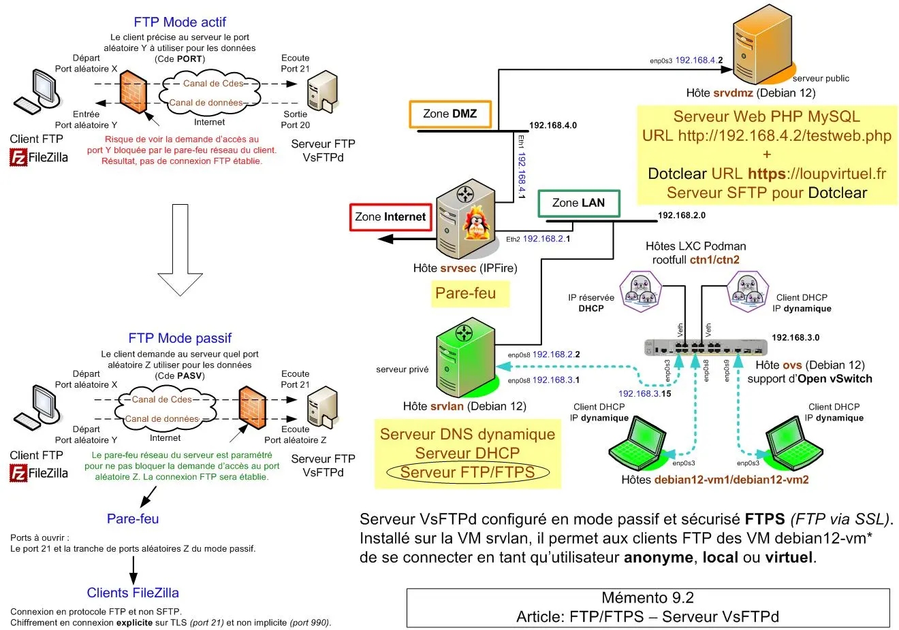
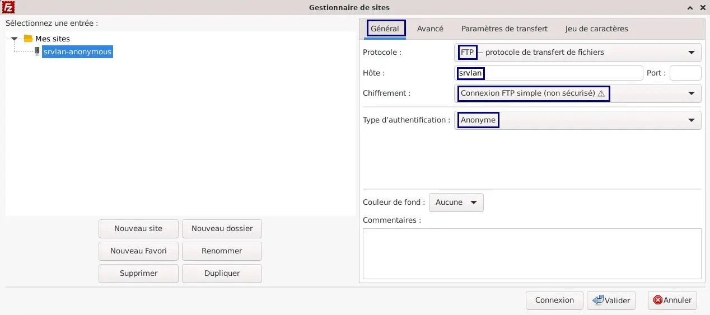
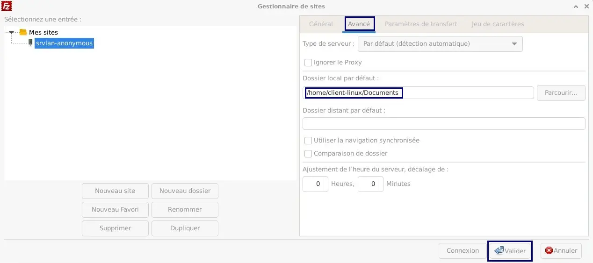
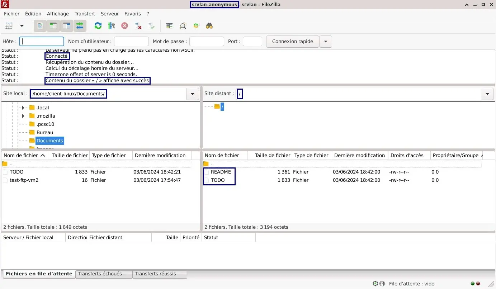
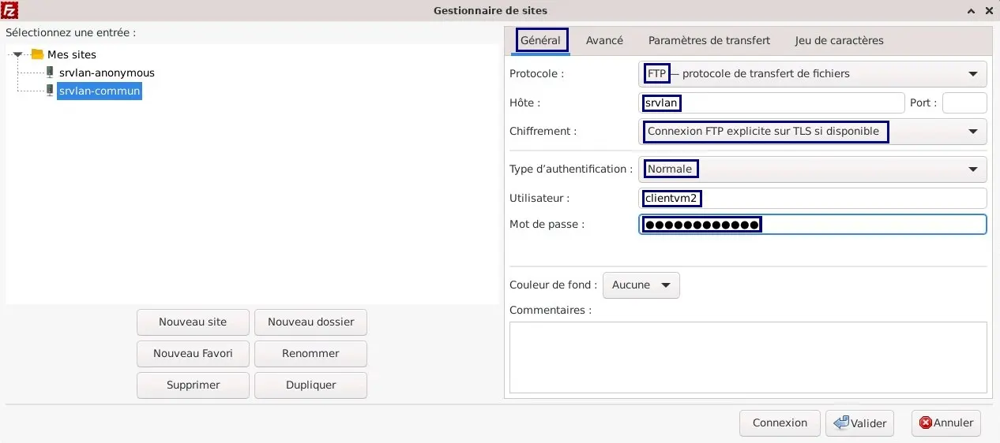
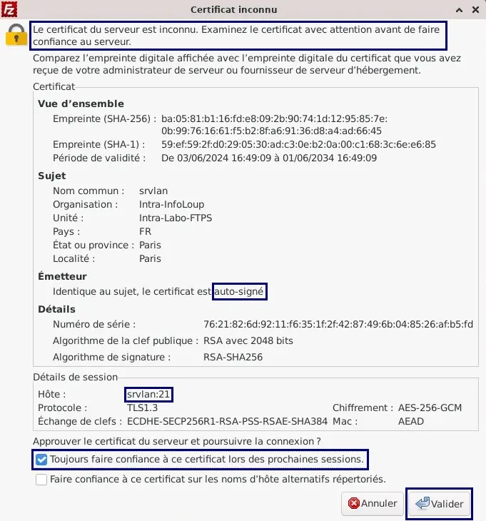
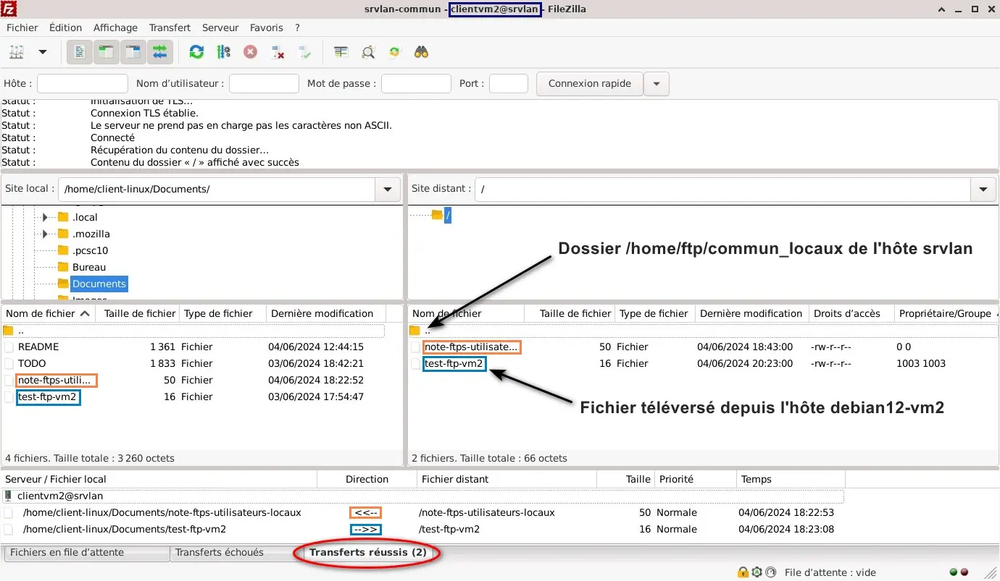
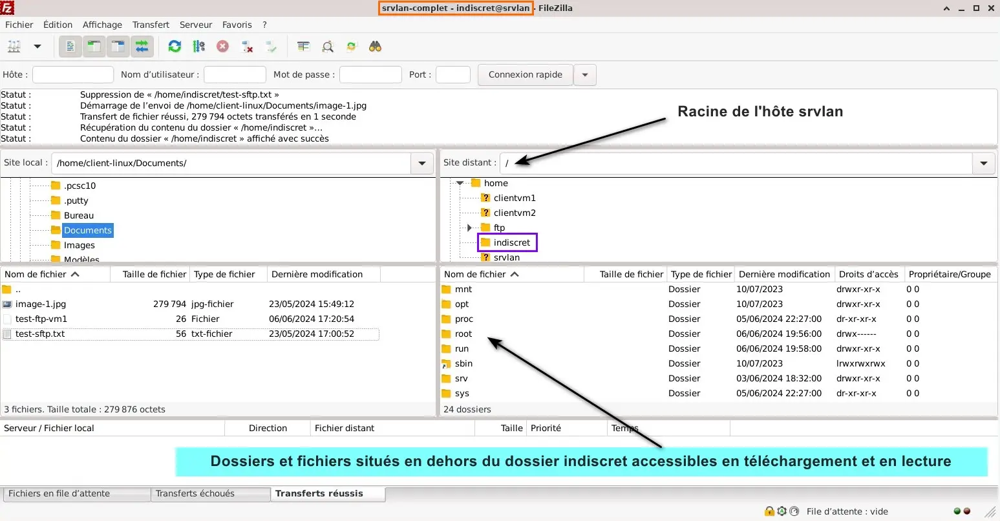

<figure markdown>
  { width="430" }
</figure>

## Mémento 9.2 - Serveur VsFTPd

Le serveur VsFTPd sera installé sur la VM `srvlan`.

Le FTP est un protocole de communication dédié au transfert de fichiers sur un réseau TCP/IP.

Les utilisateurs des VM `debian12-vm*` _(clients)_ utiliseront la VM `srvlan` _(serveur)_ pour déposer ou s'échanger des fichiers.

Selon le paramétrage FTP, un utilisateur pourra ou non Déposer, Télécharger, Lire, Modifier ou Supprimer des dossiers/fichiers.

### Préambule

Outils utilisés :  
\- Serveur VsFTPd _(Very secure FTP daemon)_.  
\- Console client lftp à la place de ftp.

Configurations proposées :  
\- Usage du FTPS _(FTP via SSL)_.  
\- Usage du mode passif.

#### _- Rôle d'un serveur FTP_

Il permet le transfert de dossiers/fichiers avec un client distant, par Internet ou par le réseau informatique local. Le transfert, selon un modèle client/serveur, peut se faire dans les 2 sens.

Le serveur FTP d'un hébergeur permet par exemple à un client distant de déposer ou télécharger les fichiers de son site web.

En général, deux modes de connexion sont utilisés :  
Le mode anonyme qui autorise l'accès au dossier public du serveur sans fournir de nom d'utilisateur ni de MDP. Les fichiers de ce dossier sont souvent en lecteur seule.

Le mode authentifié qui permet à un utilisateur local ou virtuel, après contrôle de son nom et de son MDP, d'accéder en lecture/écriture à ses propres fichiers.

### Installation

#### _- Serveur vsftpd_

Au préalable, mettez à jour la distribution Debian 12 :

```bash
[srvlan@srvlan:~$] sudo apt update
[srvlan@srvlan:~$] sudo apt upgrade
[srvlan@srvlan:~$] sudo reboot
[srvlan@srvlan:~$] sudo apt autoremove --purge
```

et installez vsftpd pour son côté léger et sécurisé :

```bash
[srvlan@srvlan:~$] sudo apt install vsftpd 
```

<!-- more -->

Vérifiez le bon démarrage de celui-ci :

```bash
[srvlan@srvlan:~$] sudo systemctl status vsftpd 
```

Retour :

```markdown hl_lines="3 13"
● vsftpd.service - vsftpd FTP server
   Loaded: loaded (/lib/systemd/system/vsftpd...
   Active: active (running) since Mon 2024-... ago
  Process: 1989 ExecStartPre=/bin/mkdir -p /var...
 Main PID: 1990 (vsftpd)
    Tasks: 1 (limit: 1077)
   Memory: 2.0M
      CPU: 15ms
   CGroup: /system.slice/vsftpd.service
             └─1990 /usr/sbin/vsftpd /etc/vsftd...

juin 03 ... srvlan systemd[1]: Starting vsftpd ...
juin 03 ... srvlan systemd[1]: Started vsftpd ...
```

Un utilisateur de nom `ftp` a été créé lors de l'installation.  
Un dossier personnel /srv/ftp/ lui a été associé.  
Il s'agit du dossier public FTP par défaut du serveur.

Pour les tests, copiez ces 2 fichiers dans ce dossier :

```bash
[srvlan@srvlan:~$] cd /usr/share/doc/vsftpd
[srvlan@srvlan:~$] sudo cp README /srv/ftp/README
[srvlan@srvlan:~$] sudo cp TODO /srv/ftp/TODO 
```

#### _- Sécurisation via SSL_

De base le serveur vsftpd ne chiffre rien mais il peut utiliser le protocole FTPS _(FTP via SSL)_ pour chiffrer ses communications avec les clients.

Pour information, différences entre le SFTP et le FTPS :  
\- SFTP plus récent utilise par défaut le port SSH 22 pour traiter l’authentification, les Cdes FTP et le transfert de données.

La gestion d'un pare-feu est facilitée, un seul port.

\- FTPS utilise par défaut le port 21 pour traiter l'authentification et les Cdes FTP ainsi que le port 20 _(en mode actif)_ ou une tranche de ports _(en mode passif)_ pour le transfert de données.

Un pare-feu sera donc plus compliqué à gérer.

Pour le FTPS, installez si absent le paquet openssl :

```bash
[srvlan@srvlan:~$] sudo apt install openssl 
```

Connectez-vous en tant que `root` et créez un certificat CA _(Certificate Authority)_ auto-signé :

```bash
[srvlan@srvlan:~$] su root

[root@srvlan:~#] cd /etc/ssl/private
[root@srvlan:~#] openssl req -x509 -nodes -newkey rsa:2048 -keyout vsftpd.pem -out vsftpd.pem -days 3650 
```

Répondez aux questions posées comme suit :

```markdown hl_lines="6"
Country Name (2 letter code) [AU]:FR
State or Prov... Name (full name) [Some-State]:Paris
Locality Name (eg, city) []:Paris
Organization Name (e...) [Interne...]:Intra-InfoLoup            
Organizational Uni... (eg...) []:Intra-Labo-FTPS
Common Name (... server FQDN or YOUR name) []:srvlan
Email Address []: Touche Entrée
```

Le Common Name doit correspondre au nom d'hôte du serveur FTP soit ici `srvlan`.

Editez ensuite le fichier de configuration vsftpd.conf :

```bash
[root@srvlan:~#] exit

[srvlan@srvlan:~$] sudo nano /etc/vsftpd.conf 
```

et ajustez vers la ligne 147 les paramètres SSL :

```markdown hl_lines="3 4"
# This option specifies the location of the RSA certifi...
# encrypted connections.
rsa_cert_file=/etc/ssl/private/vsftpd.pem
rsa_private_key_file=/etc/ssl/private/vsftpd.pem
ssl_enable=YES

# Lignes ajoutées
ssl_ciphers=HIGH
ssl_tlsv1=YES
ssl_sslv2=NO
ssl_sslv3=NO
force_local_data_ssl=YES
force_local_logins_ssl=YES
allow_anon_ssl=NO

#
# Uncomment  this to indicate that vsftpd use ...
```

Le contenu des 7 lignes ajoutées signifie :  
\- Niveau de chiffrement élevé imposé.  
\- Protocole ssl_tlsv1 autorisé.  
\- Protocole ssl_sslv2 refusé car moins sécurisé.  
\- Protocole ssl_sslv3 refusé car moins sécurisé.  
\- Login non anonyme forcé SSL pour l'envoi des Data.  
\- Login non anonyme forcé SSL pour l'envoi du MDP.  
\- Login anonyme non forcé SSL.

#### _- Activation mode FTP passif_

Le serveur fonctionne par défaut en mode actif.

Il vaut mieux, pour éviter que le pare-feu d'un client distant situé sur Internet ne bloque la liaison FTPS, passer celui-ci en mode passif.

Le [synoptique du mémento](../images/2024/06/ftp-ftps-serveur-vsftpd-deb12-memento-9.2.webp){:target="_blank"} détaille l'intérêt de ce mode.

Activez celui-ci en ajoutant ceci en fin de vsftpd.conf :

```markdown
# Activation du mode passif
pasv_enable=YES
pasv_min_port=12500
pasv_max_port=12550
```

La tranche de ports aléatoires doit être supérieure à 1024, ici 12500 à 12550.

Redémarrez le serveur FTP pour la prise en compte :

```bash
[srvlan@srvlan:~$] sudo systemctl restart vsftpd
[srvlan@srvlan:~$] sudo systemctl status vsftpd
```

### Accès FTP anonymes

#### _- Configuration de base_

Par défaut, vsftpd refuse les connexions anonymes.  
Pour changer cela, éditez son fichier de configuration :

```bash
[srvlan@srvlan:~$] sudo nano /etc/vsftpd.conf
```

et réglez les valeurs de ces 3 paramètres comme suit :

```markdown
anonymous_enable=YES             # Accès anonyme autorisé
anon_upload_enable=NO           # Dépôt fichiers interdit
anon_mkdir_write_enable=NO  # Création dossiers interdite
```

N'oubliez pas de retirer si besoin le # de début de ligne.

Redémarrez le serveur FTP :

```bash
[srvlan@srvlan:~$] sudo systemctl restart vsftpd
```

#### _- Connexion depuis LFTP_

Installez le client FTP de nom lftp sur `debian12-vm2` :

```bash
[client-linux@debian12-vm2:~$] sudo apt install lftp
```

Ce programme permet d'envoyer des lignes de Cdes vers un serveur FTP/FTPS/SFTP.

Créez un fichier caché .lftprc qui sera utilisé par lftp :

```bash
[client-linux@debian12-vm2:~$] cd /home/client-linux
[client-linux@debian12-vm2:~$] nano .lftprc
```

et entrez la configuration suivante :

```markdown
# Configuration traitée au démarrage du client lftp
set ftp:passive-mode true
set ftp:ssl-auth TLS
set ftp:ssl-force true
set ftp:ssl-protect-data true
set ftp:ssl-protect-list true
set ssl:verify-certificate no
```

Enfin, connectez-vous sur le serveur vsftpd de `srvlan` :

```bash hl_lines="2"
[client-linux@debian12-vm2:~$] lftp srvlan
lftp srvlan:~> ls
```

La Cde ls renvoie le contenu du dossier public /srv/ftp/ :

```markdown hl_lines="3"
-rw-r--r--    1 0      0  1361 Juin 03 16:42 README
-rw-r--r--    1 0      0  1833 Juin 03 16:42 TODO
lftp srvlan:/> quit
```

Utilisez la Cde quit pour fermer la connexion distante.

Testez ensuite un téléchargement FTP :

```bash hl_lines="3"
[client-linux@debian12-vm2:~$] cd Documents
[client-linux@debian12-vm2:~$] lftp srvlan
lftp srvlan:~> get TODO
```

Retour :

```markdown hl_lines="2"
1833 octets transférés                        
lftp srvlan:/> quit
```

Créez enfin un fichier de test test-ftp-vm2 comme suit :

```bash
[client-linux@debian12-vm2:~$] touch test-ftp-vm2
[client-linux@debian12-vm2:~$] echo "Test Upload FTP" > test-ftp-vm2
```

et testez un envoi FTP dans le dossier public de `srvlan` :

```bash hl_lines="2"
[client-linux@debian12-vm2:~$] lftp srvlan
lftp srvlan:~> put test-ftp-vm2
```

Retour :

```markdown hl_lines="2"
put: L'accès a échoué : 550 Permission denied. (te...
lftp srvlan:/> quit
```

Echec normal _(... denied)_ puisque vous avez plus haut interdit le dépôt anonyme de fichiers.

#### _- Connexion depuis FileZilla_

Installez sur `debian12-vm2` le client FTP/SFTP FileZilla :

```bash
[client-linux@debian12-vm2:~$] sudo apt install filezilla
```

FileZilla fonctionne en mode passif par défaut.

Ouvrez ensuite l'application graphique :  
\- Menu Applications -> Internet -> Icône FileZilla

Cliquez sur l'icône située la plus à gauche de la barre des icônes afin d'ouvrir le Gestionnaire de Sites et cliquez sur le bouton Nouveau site.

Créez un site de nom srvlan-anonymous comme suit :  
\- Onglet Général

<figure markdown>
  { width="430" }
  <figcaption>FileZilla : Réglages généraux FTP Anonymous</figcaption>
</figure>

\- Onglet Avancé

<figure markdown>
  { width="430" }
  <figcaption>FileZilla : Réglages avancés FTP Anonymous</figcaption>
</figure>

Une fenêtre Se souvenir des mots de passe ? s'ouvre :  
-> Cochez Sauvegarder les mots de passe -> Valider

Le site srvlan-anonymous est à présent créé. Cliquez sur la flèche située à droite de l'icône du Gestionnaire de Sites et sélectionnez celui-ci.

Une fenêtre Connexion FTP non sécurisée s'ouvre :  
-> Cochez Toujours autoriser FTP non sécurisé pour ...  
-> Valider

La connexion s'établit et la zone Site distant doit montrer le contenu du dossier public de `srvlan`.

<figure markdown>
  { width="430" }
  <figcaption>FileZilla : Connexion FTP Anonymous établie</figcaption>
</figure>

Pour Afficher/Editer les fichiers texte, procédez ainsi :  
-> Menu Edition de FileZilla -> Paramètres...  
-> Sélectionnez Edition des fichiers  
-> Cochez Utiliser l'éditeur pers... -> ==/usr/bin/mousepad==  
-> Cochez Toujours utiliser l'éditeur par défaut  
-> Bouton Valider

Vérifiez à présent que vous pouvez :  
\- En zone Site local  
Télécharger un fichier mais non en Envoyer _(Upload)_.

\- En zone Site distant  
Afficher/Editer un fichier mais non le Renommer ni le Supprimer.

Cliquez sur l'icône serveur/croix-rouge pour fermer la connexion.

#### _- Configuration avec Upload_

Choix déconseillé pour raison de sécurité, un anonyme pouvant déposer un fichier infecté.

Créez et affectez un dossier uploads à l'utilisateur `ftp` :

```bash
[srvlan@srvlan:~$] sudo mkdir /srv/ftp/uploads
[srvlan@srvlan:~$] sudo chown ftp:ftp /srv/ftp/uploads
```

Donnez à l'utilisateur `ftp` le droit d'écriture sur celui-ci :

```bash
[srvlan@srvlan:~$] sudo chmod 755 /srv/ftp/uploads
```

et retirez lui ce droit sur le dossier racine /srv/ftp/ :

```bash
[srvlan@srvlan:~$] sudo chmod 555 /srv/ftp
```

Editez ensuite le fichier de configuration vsftpd.conf :

```bash
[srvlan@srvlan:~$] sudo nano /etc/vsftpd.conf
```

puis ajustez les paramètres ci-dessous comme suit :

```markdown
write_enable=YES                     # Ecriture autorisée
anon_upload_enable=YES          # Dépôt fichiers autorisé
anon_mkdir_write_enable=YES # Création dossiers autorisée
```

et ajoutez les 2 lignes suivantes en fin de fichier :

```markdown
# Permissions affectées au contenu du dossier uploads 
anon_umask=022
```

\- umask 022 = Permissions à 755 dossiers/644 fichiers

Pour finir, redémarrez le serveur FTP :

```bash
[srvlan@srvlan:~$] sudo systemctl restart vsftpd
```

#### _- Test de l'Upload (Dépôt)_

Accédez au dossier suivant de la VM `debian12-vm2` :

```bash
[client-linux@debian12-vm2:~$] cd /home/client-linux
[client-linux@debian12-vm2:~$] cd Documents
```

et testez le dépôt _(upload)_ suivant avec la Cde lftp :

```bash hl_lines="2"
[client-linux@debian12-vm2:~$] lftp srvlan
lftp srvlan:~> ls
```

Retour :

```markdown
-rw-r--r--    1 0    0      1361 Jun 03 16:42 README
-rw-r--r--    1 0    0      1833 Jun 03 16:42 TODO
drwxr-xr-x    2 112  122    4096 Jun 04 12:56 uploads
```

```bash hl_lines="2"
lftp srvlan:/> cd uploads
lftp srvlan:/uploads> put test-ftp-vm2
```

Retour :

```markdown
16 octets transférés
```

```bash
lftp srvlan:/uploads> ls
```

Retour :

```markdown hl_lines="2"
-rw-r--r--    1 112  122    16 Jun 04 13:17 test-ftp-vm2
lftp srvlan:/uploads> quit
```

Ensuite, dans FileZilla, vérifiez le résultat et contrôlez l'impossibilité de Supprimer, Renommer et Modifier un fichier/dossier déposé dans le dossier uploads.

Vérifiez également l'impossibilité maintenant de réaliser un envoi FTP en dehors du dossier uploads _(droits du dossier racine /srv/ftp/ fixés ci-dessus à 555)_.

### Accès FTP utilisateurs locaux

#### _- Sur un dossier commun_

C'est par défaut l'utilisateur `nobody` de Linux qui permet au démon vsftpd d'exécuter ses processus enfants non privilégiés. L'inconvénient est que d'autres démons peuvent également travailler avec cet utilisateur.

Il est donc, par sécurité, conseillé de créer un utilisateur non privilégié dédié au démon vsftpd et de le déclarer dans vsftpd.conf à l'aide du paramètre nopriv_user.

Pour cela, vous allez créer un utilisateur local de nom `userftps` sans MDP associé, ce qui interdira toute tentative de connexion avec ce nom sur `srvlan`.

Un dossier /home/ftp/ affecté à cet utilisateur et au groupe grftps servira de racine aux utilisateurs locaux et plus tard aux utilisateurs virtuels.

Créez le dossier/groupe/utilisateur et les permissions :

```bash
[srvlan@srvlan:~$] sudo mkdir -p /home/ftp
[srvlan@srvlan:~$] sudo groupadd grftps

[srvlan@srvlan:~$] sudo useradd -g grftps -d /home/ftp userftps

[srvlan@srvlan:~$] sudo chown userftps:grftps /home/ftp
[srvlan@srvlan:~$] sudo chmod 555 /home/ftp
```

Créez ensuite les utilisateurs locaux `clientvm*` suivants :

```bash
[srvlan@srvlan:~$] sudo adduser clientvm1
[srvlan@srvlan:~$] sudo adduser clientvm2
```

Un MDP UNIX sera demandé pour chacun d'eux. Vous pouvez utiliser ceux des utilisateurs des VM `debian12-vm*` mais ce n'est pas obligatoire. Vous êtes également libre de répondre ou non aux demandes d'information qui apparaîtront.

Ajoutez les 2 utilisateurs au groupe grftps :

```bash
[srvlan@srvlan:~$] sudo adduser clientvm1 grftps
[srvlan@srvlan:~$] sudo adduser clientvm2 grftps
```

et créez pour ceux-ci le dossier commun_locaux :

```bash
[srvlan@srvlan:~$] cd /home/ftp
[srvlan@srvlan:~$] sudo mkdir commun_locaux

[srvlan@srvlan:~$] sudo chown userftps:grftps commun_locaux

[srvlan@srvlan:~$] sudo chmod 775 commun_locaux
[srvlan@srvlan:~$] sudo chmod +t commun_locaux
```

Le +t _(sticky bit)_ interdira aux utilisateurs locaux de Supprimer/Modifier les fichiers situés dans le dossier commun_locaux dont ils ne sont pas propriétaires.

Vérifiez toutes les créations dans /home/ ainsi que le contenu de ces 3 fichiers :

```bash
[srvlan@srvlan:~$] sudo cat /etc/group
[srvlan@srvlan:~$] sudo cat /etc/passwd
[srvlan@srvlan:~$] sudo cat /etc/shadow
```

Editez à présent le fichier de configuration vsftpd.conf :

```bash
[srvlan@srvlan:~$] sudo nano /etc/vsftpd.conf
```

puis ajustez les paramètres suivants comme affichés :

```markdown
local_enable=YES            # Accès utilisateur local=YES
write_enable=YES         # Ecriture utilisateur local=YES
local_umask=022  # 644 fichiers reçus, 755 dossiers reçus
nopriv_user=userftps         # Utilisateur non privilégié
ftpd_banner=Serveur FTP du Loup.      # Accueil de vsftpd
chroot_local_user=YES    # Utilisateur limité à sa racine
secure_chroot_dir=/home/ftp          # Racine de userftps
```

\- ftpd_banner : Permet de cacher la version de vsftpd.

et ajoutez ces 3 lignes en fin de fichier :

```markdown
# Gestion des utilisateurs locaux
local_root=/home/ftp/commun_locaux
allow_writeable_chroot=YES
```

\- Ecriture OK dans le dossier racine commun_locaux.

Redémarrez le serveur FTP :

```bash
[srvlan@srvlan:~$] sudo systemctl restart vsftpd
```

Créez la note suivante dans le dossier commun_locaux :

```bash
[srvlan@srvlan:~$] cd /home/ftp/commun_locaux
[srvlan@srvlan:~$] sudo nano note-ftps-utilisateurs-locaux
```

et entrez ce contenu précisant le rôle du dossier :

```markdown
Ici, dossier FTP dédié aux utilisateurs locaux.
```

#### _- Test de connexion FTPS_

Créez sur le client FileZilla de `debian12-vm2` un site de nom srvlan-commun.

Paramétrez celui-ci comme montré ci-dessous :  
\- Onglet Général

<figure markdown>
  { width="430" }
  <figcaption>FileZilla : Création du site FTPS srvlan-commun</figcaption>
</figure>

\- Onglet Avancé  
-> Dossier local par défaut -> Parcourir...  
-> Sélectionnez /home/client-linux/Documents  
-> Bouton Valider

Lancez ensuite une connexion FTPS sur le site.

1 ) Traitez le certificat SSL présenté comme suit :

<figure markdown>
  { width="430" }
  <figcaption>FileZilla : Certificat SSL émis par le serveur vsftpd</figcaption>
</figure>

2 ) La connexion est établie :

<figure markdown>
  { width="430" }
  <figcaption>FileZilla : Connexion sécurisée FTPS établie</figcaption>
</figure>

Le transfert FTP doit fonctionner dans les 2 sens.

Mais vous ne devez pas pouvoir, zone Site distant, Supprimer, Renommer et Modifier les fichiers déposés sur `srvlan` par d'autres utilisateurs, cas du fichier note-ftps-utilisateurs-locaux.

Vous devez en revanche pouvoir lire leur contenu.

Pour finir, créez sur le client FileZilla de `debian12-vm1` le site srvlan-commun avec comme utilisateur local `clientvm1` et contrôlez après connexion que vous retrouvez bien les mêmes permissions que ci-dessus.

#### _- Sur tous les dossiers_

Choix déconseillé, l'utilisateur du FTP pouvant accéder à des fichiers sensibles.

La configuration actuelle enferme les utilisateurs locaux tels `clientvm*` dans le dossier racine commun_locaux, ceux-ci ne peuvent donc pas accéder au dossier parent donc à l'arborescence complète de `srvlan`.

Ce comportement sécurisé vient de ces paramètres :

```markdown
chroot_local_user=YES    # Utilisateur limité à sa racine 
local_root=/home/ftp/commun_locaux               # Racine
```

Mais vous pouvez avoir besoin qu'un utilisateur local accède à toute l'arborescence de `srvlan` ceci avec des permissions différentes de celles de son dossier personnel et du dossier racine commun_locaux.

Editez pour cela le fichier vsftpd.conf :

```bash
[srvlan@srvlan:~$] sudo nano /etc/vsftpd.conf
```

puis décommentez les 2 lignes suivantes :

```markdown
chroot_list_enable=YES
chroot_list_file=/etc/vsftpd.chroot_list
```

et redémarrez le serveur FTP :

```bash
[srvlan@srvlan:~$] sudo systemctl restart vsftpd
```

Créez maintenant un utilisateur local de nom `indiscret` :

```bash
[srvlan@srvlan:~$] sudo adduser indiscret
```

Pour simplifier, donnez lui le MDP indiscret.

Affectez ensuite celui-ci au groupe grftps :

```bash
[srvlan@srvlan:~$] sudo adduser indiscret grftps
```

Pour finir, créez le fichier vsftpd.chroot_list :

```bash
[srvlan@srvlan:~$] sudo nano /etc/vsftpd.chroot_list
```

et entrez l'utilisateur `indiscret` en début de celui-ci :

```markdown
indiscret
```

Si d'autres noms, placez ceux-ci les uns sous les autres.

Créez sur le FileZilla de `debian12-vm1` le site srvlan-complet et attribuez lui ces paramètres :

\- Onglet Général  
-> Hôte -> `srvlan`  
-> Chiffrement -> Connexion FTP explicite sur TLS si ...  
-> Type d'authentification -> Normale  
-> Utilisateur -> indiscret  
-> Mot de passe -> indiscret

\- Onglet Avancé  
-> Dossier local par défaut -> Parcourir...  
-> Sélectionnez /home/client-linux/Documents  
-> Dossier distant par défaut  
-> Entrez /home/indiscret  
-> Bouton Valider

Lancez une connexion sur le site srvlan-complet :

<figure markdown>
  { width="430" }
  <figcaption>FileZilla : Accès complet aux dossiers/fichiers de srvlan</figcaption>
</figure>

et vérifiez que rien, en dehors de /home/indiscret/ et /home/ftp/commun_locaux/, ne peut être supprimé ou modifié mais le droit de lire et télécharger tous les fichiers de `srvlan` représente un risque de sécurité.

### Accès FTP utilisateurs virtuels

Choix conseillé pour raison de sécurité.

Les utilisateurs virtuels non déclarés avec la Cde adduser seront comme l'utilisateur local `userftps` inconnus du système mais verront leurs demandes de connexion mappées vers celui-ci, chacun dans leur dossier respectif.

Il s’agit là d’une protection plus efficace que la création d'utilisateurs locaux.

La configuration s’opère en 4 étapes :  
\- Création d’une Bdd Berkeley utilisateurs virtuels  
\- Liaison de la Bdd avec le module PAM de vsftpd  
\- Création des permissions et dossiers des utilisateurs  
\- Configuration de vsftpd et test de connexion

#### _- Création Bdd Berkeley_{#titre-berkeley}

Installez au préalable le paquet db5.3-util :

```bash
[srvlan@srvlan:~$] sudo apt install db5.3-util
```

puis créez ensuite le dossier et le fichier suivants :

```bash
[srvlan@srvlan:~$] sudo mkdir /etc/vsftpd
[srvlan@srvlan:~$] sudo touch /etc/vsftpd/virtuels.txt 
```

Editez le fichier créé virtuels.txt :

```bash
[srvlan@srvlan:~$] sudo nano /etc/vsftpd/virtuels.txt
```

et entrez, l'un sous l'autre, ces utilisateurs et MDP :

```markdown
clientvm1-virtuel
MDP de clientvm1-virtuel
clientvm2-virtuel
MDP de clientvm2-virtuel
```

Terminez la liste par un retour de chariot.

!!! note "Nota"
    Les utilisateurs ci-dessus, inconnus de `srvlan`, peuvent avoir des MDP différents ou non de ceux affectés aux utilisateurs locaux des VM `debian12-vm*`.

Créez enfin la Bdd virtuels.db pour le module PAM :

```bash
[srvlan@srvlan:~$] cd /etc/vsftpd
[srvlan@srvlan:~$] sudo db5.3_load -T -t hash -f virtuels.txt virtuels.db 
```

et autorisez la lecture des 2 fichiers à `root` uniquement :

```bash
[srvlan@srvlan:~$] sudo chmod 600 /etc/vsftpd/virtuels.db
[srvlan@srvlan:~$] sudo chmod 600 /etc/vsftpd/virtuels.txt 
```

#### _- Liaison Bdd avec PAM_

Editez le fichier de configuration PAM suivant :

```bash
[srvlan@srvlan:~$] sudo nano /etc/pam.d/vsftpd 
```

et ajoutez, sous # Note : vsftpd..., ces 2 instructions :

```markdown
auth sufficient /lib/x86_64-linux-gnu/security/pam_userdb.so db=/etc/vsftpd/virtuels

account sufficient /lib/x86_64-linux-gnu/security/pam_userdb.so db=/etc/vsftpd/virtuels 
```

Mettre i386-linux-gnu à la place de x86_64-linux-gnu pour un système 32 bits.

Le module pam_userdb _(Pluggable Authentication Modules)_ vérifiera les authentifications utilisateurs virtuels/MDP avec les valeurs stockées dans la Bdd Berkeley.

#### _- Permissions et dossiers_

Créez le dossier qui contiendra les permissions :

```bash
[srvlan@srvlan:~$] cd /etc/vsftpd
[srvlan@srvlan:~$] sudo mkdir vsftpd_user_conf
```

Créez le fichier des permissions pour `clientvm1-virtuel` :

```bash
[srvlan@srvlan:~$] cd vsftpd_user_conf
[srvlan@srvlan:~$] sudo nano clientvm1-virtuel
```

et entrez pour cet utilisateur les permissions suivantes :

```markdown
# Configuration vsftpd de l'utilisateur "clientvm1-virtuel"
# Paramétrage pour les mêmes droits qu'un utilisateur local

# Activation de l'utilisateur comme utilisateur virtuel
guest_enable=YES

# Ecriture autorisée
write_enable=YES

# Modification et suppression autorisées
anon_other_write_enable=YES

# Download autorisé même si un fichier
# n'est pas en lecture pour tous
anon_world_readable_only=NO

# Dossier dans lequel sera enfermé l'utilisateur
local_root=/home/ftp/clientvm1-virtuel 
```

Créez maintenant son dossier personnel :

```bash
[srvlan@... ~$] cd /home/ftp
[srvlan@... ~$] sudo mkdir clientvm1-virtuel

[srvlan@... ~$] sudo chown userftps:grftps clientvm1-virtuel
[srvlan@... ~$] sudo chmod 755 clientvm1-virtuel 
```

Créez une note qui permettra d'identifier le dossier :

```bash
[srvlan@srvlan:~$] cd /home/ftp/clientvm1-virtuel
[srvlan@srvlan:~$] sudo nano note-clientvm1-virtuel 
```

et entrez le texte suivant :

```markdown
Ici, dossier FTP personnel de "clientvm1-virtuel".
```

Effectuez les mêmes opérations que ci-dessus pour l'utilisateur virtuel `clientvm2-virtuel`.

#### _- Test de connexion_

Editez le fichier de configuration de serveur FTP :

```bash
[srvlan@srvlan:~$] sudo nano /etc/vsftpd.conf
```

et ajoutez les lignes suivantes à la fin de celui-ci :

```markdown
# Gestion des utilisateurs virtuels
guest_username=userftps
user_config_dir=/etc/vsftpd/vsftpd_user_conf
virtual_use_local_privs=YES
```

Mappage sur l'utilisateur `userftps` et attribution des mêmes privilèges que ceux des utilisateurs locaux de `srvlan`.

Redémarrez le serveur :

```bash
[srvlan@srvlan:~$] sudo systemctl restart vsftpd
```

Créez depuis FileZilla les sites srvlan-clientvm*-virtuel sur les VM `debian12-vm*` comme suit :

\- Onglet Général  
-> Hôte -> srvlan  
-> Chiffrement -> Connexion FTP explicite sur TLS si ...  
-> Type d'authentification -> Normale  
-> Utilisateur -> clientvm1-virtuel ou clientvm2-virtuel  
-> Mot de passe -> MDP de clientvm1-virtuel ou clientv...

Pour les MDP, voir le [§ 5.1](#titre-berkeley).

\- Onglet Avancé  
-> Dossier local par défaut -> Parcourir...  
-> Sélectionnez /home/client-linux/Documents  
-> Bouton Valider

Vérifiez après connexion que chaque utilisateur virtuel :  
\- Peut Transférer des fichiers dans les 2 sens.  
\- Peut Supprimer/Modifier ses dépôts sur `srvlan`.  
\- Reste bien enfermé dans son dossier personnel.

Vérifiez que chaque dossier/fichier déposé sur `srvlan` est bien mappé sur l'utilisateur `userftps` :

```bash
[srvlan@srvlan:~$] ls -l /home/ftp/clientvm1-virtuel
[srvlan@srvlan:~$] ls -l /home/ftp/clientvm2-virtuel
```

### Configuration préférentielle

En l'état, le serveur FTP accepte les connexions d'utilisateurs anonymes, locaux et virtuels.

Vous l'avez compris, la connexion authentifiée d'utilisateurs virtuels est la plus sécurisée des 3.

Pour ne traiter que celle-ci, appliquez dans vsftpd.conf :

```markdown
anonymous_enable=NO              # Accès anonyme interdit
```

Editez ensuite le fichier de configuration PAM :

```bash
[srvlan@srvlan:~$] sudo nano /etc/pam.d/vsftpd
```

et commentez ces 4 lignes dédiées utilisateurs locaux :

```markdown
# @include common-account
# @include common-session
# @include common-auth
# auth      required      pam_shells.so
```

La 2ème ligne de ce fichier fait référence au fichier /etc/ftpusers. Pour info, celui-ci contient une liste par défaut d'utilisateurs locaux n'ayant pas le droit de se connecter sur le service FTP.

On pourrait encore augmenter la sécurité _(changement de n° de port FTP, filtrage IP, adresses IP virtuelles, etc...)_ mais la connexion authentifiée d'utilisateurs virtuels est un bon début.

{ align=left }

&nbsp;  
Repos mérité, respirez !  
Le mémento 10.1 propose de rendre  
le réseau plus cohérent avec entre  
autres la création d'un DNS split.

!!! Info "Mémento 10.1 en cours de construction"
