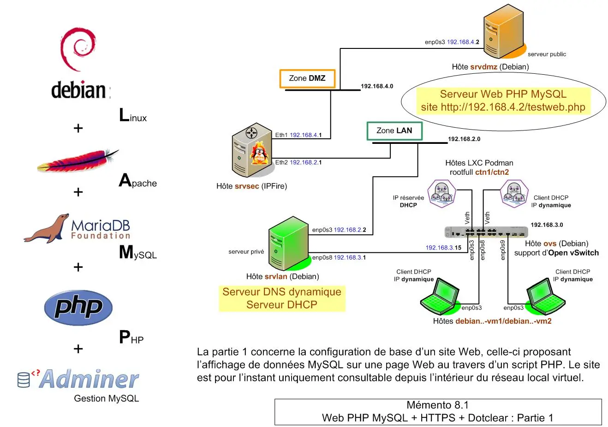
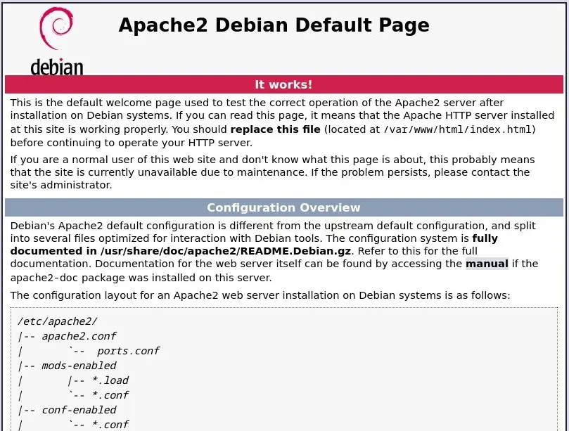
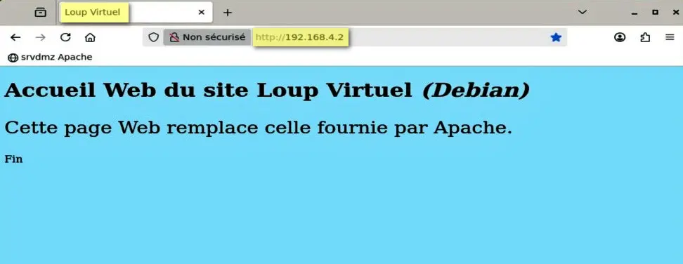
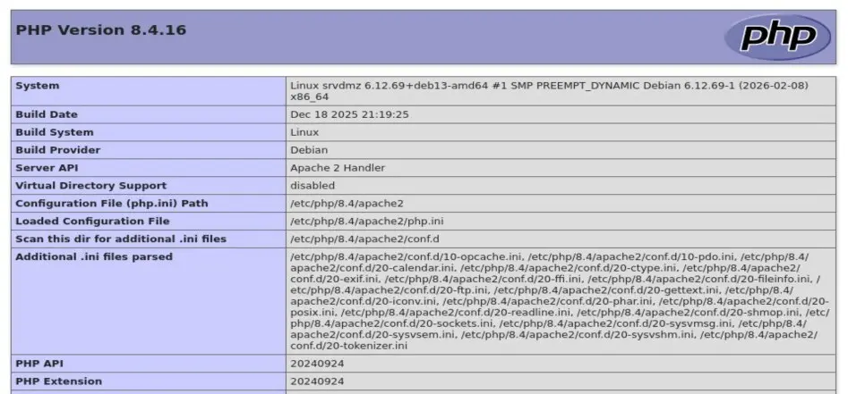
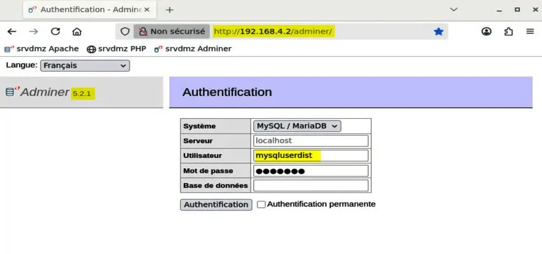
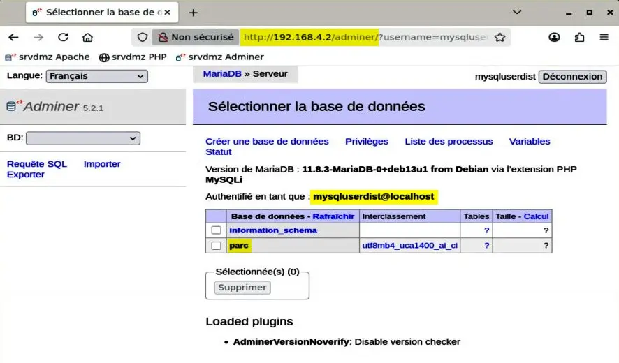
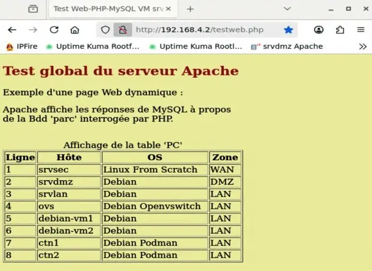

<figure markdown>
  { width="430" }
</figure>

## Mémento 8.1 - Apache PHP MySQL

Le service LAMP sera installé sur la VM srvdmz.

Il permettra de créer un site Web reposant sur :  
**L**inux + **A**pache + **M**ySQL + **P**HP _(LAMP)_

### Préambule

Logiciels utilisés à l'intérieur des parties 1 et 2 :  
\- Apache pour diffuser les pages web.  
\- PHP pour générer les pages web dynamiques.  
\- MySQL/MariaDB pour stocker le contenu des pages.  
\- OpenSSL pour sécuriser le protocole HTTP _(HTTPS)_.  
\- Adminer pour gérer la base de données MySQL.  
\- CMS Dotclear pour créer facilement un blog complet.

#### _- Fichier DNS hosts_

FQDN _(Fully Qualified Domain Name)_ = Nom de domaine pleinement qualifié.

Créez celui de la VM srvdmz en éditant son fichier DNS hosts :

```bash
[srvdmz@srvdmz] sudo nano /etc/hosts
```

et en le modifiant comme ci-dessous :

```markdown
127.0.0.1    localhost
127.0.1.1    srvdmz.loupvirtuel.fr srvdmz

# IP de srvdmz     +  FQDN       + nom d'hôte  + domaine
192.168.4.2  srvdmz.loupvirtuel.fr  srvdmz  loupvirtuel.fr
```

Ne touchez pas au bloc de lignes concernant l'IPv6.

Testez la prise en compte du FQDN :

```bash
[srvdmz@srvdmz] hostname --fqdn
```

Retour :

```markdown
srvdmz.loupvirtuel.fr
```

Apache aura besoin du FQDN de srvdmz pour s'installer sans erreur.

<!-- more -->

### Service LAMP

#### _- MAJ du système Debian_

```bash
[srvdmz@srvdmz] sudo apt update
[srvdmz@srvdmz] sudo apt upgrade
[srvdmz@srvdmz] sudo reboot
[srvdmz@srvdmz] sudo apt autoremove --purge
[srvdmz@srvdmz] cat /etc/debian_version
```

La dernière Cde doit retourner le numéro de la version Debian courante.

#### _- Apache_

Installez le paquet apache2 :

```bash
[srvdmz@srvdmz] sudo apt install apache2
```

et contrôlez le numéro de la version installée :

```bash
[srvdmz@srvdmz] sudo apache2 -v 
```

Retour :

```markdown
Server version: Apache/2.4.66 (Debian)
Server built:   2025-12-05T18:52:34
```

Puis vérifiez le démarrage automatique du serveur :

```bash
[srvdmz@srvdmz] sudo systemctl status apache2  
```

Retour :

```markdown hl_lines="3 16"
● apache2.service - The Apache HTTP Server
     Loaded: loaded (/usr/lib/systemd/system/apache2.service; enabled; preset: enabled)
     Active: active (running) since Wed 2026-02-11 17:11:15 CET; 2min 14s ago
 Invocation: 090b570ea7be4d1286b192d86ab16935
       Docs: https://httpd.apache.org/docs/2.4/
   Main PID: 3218 (apache2)
      Tasks: 55 (limit: 1675)
     Memory: 5.1M (peak: 5.5M)
        CPU: 83ms
     CGroup: /system.slice/apache2.service
             ├─3218 /usr/sbin/apache2 -k start
             ├─3219 /usr/sbin/apache2 -k start
             └─3220 /usr/sbin/apache2 -k start

févr. 11 17:11:15 srvdmz systemd[1]: Starting apache2.service - The Apache HTTP Server...
févr. 11 17:11:15 srvdmz systemd[1]: Started apache2.service - The Apache HTTP Server.
```

et la bonne syntaxe de ses fichiers de configuration :

```bash
[srvdmz@srvdmz] sudo apache2ctl -t  
```

Retour :

```markdown
Syntax OK  
```

Enfin, depuis la VM debian-vm1, testez l'URL :  
`http://192.168.4.2`

<figure markdown>
  { width="430" }
  <figcaption>Apache : Accueil /var/www/html/index.html</figcaption>
</figure>

Pour jouer, remplacez l'accueil ci-dessus comme suit :

```bash
[srvdmz@srvdmz] cd /var/www/html 
[srvdmz@srvdmz] sudo  mv index.html index.html.origine
[srvdmz@srvdmz] sudo  touch index.html
[srvdmz@srvdmz] sudo  nano index.html  
```

et remplissez le nouvel index.html avec ce contenu :

```markdown
<!DOCTYPE html>
<html>
<head><meta charset="utf-8"></head>
<title>Loup Virtuel</title>
<body style="background-color:#ADEAFF">

<h1 style="color:#000000">
Accueil Web du site Loup Virtuel <i>(Debian)</i>
</h1>

<p style="font-size:28px;">
Cette page Web remplace celle fournie par Apache.
</p>

<p>Fin</p>

</body>
</html>
```

Pour finir, testez de nouveau l'URL :  
`http://192.168.4.2`

<figure markdown>
  { width="430" }
  <figcaption>Apache : Page d'accueil personnalisée</figcaption>
</figure>

#### _- PHP_

Installez le paquet php :

```bash
[srvdmz@srvdmz] sudo apt install php 
```

Créez ensuite un fichier de contrôle phpinfo.php :

```bash
[srvdmz@srvdmz] sudo touch /var/www/html/phpinfo.php 
```

Editez celui-ci :

```bash
[srvdmz@srvdmz] sudo nano /var/www/html/phpinfo.php 
```

et entrez le contenu ci-dessous :

```markdown
<?php phpinfo(); ?> 
```

Puis, depuis la VM srvlan, testez l'URL :  
`http://192.168.4.2/phpinfo.php`

<figure markdown>
  { width="430" }
  <figcaption>PHP : Page Web Infos PHP</figcaption>
</figure>

Les Cdes suivantes afficheront la version de PHP ainsi que la liste des modules PHP installés :

```bash
[srvdmz@srvdmz] php -v
[srvdmz@srvdmz] php -m 
```

#### - _MySQL_ {#titre-mysql}

MariaDB est un moteur de **B**ases **d**e **d**onnées dérivé de MySQL.

Installez le serveur comme suit :

```bash
[srvdmz@srvdmz] sudo apt install mariadb-server
```

et vérifiez le démarrage automatique de celui-ci :

```bash
[srvdmz@srvdmz] sudo systemctl status mariadb 
```

Retour normal :

```markdown hl_lines="3 16 18"
● mariadb.service - MariaDB 11.8.3 database server
     Loaded: loaded (/usr/lib/systemd/system/mariadb.service; enabled; preset: enabled)
     Active: active (running) since Wed 2026-02-11 17:58:32 CET; 1min 16s ago
 Invocation: 22db59dfa6714e7388a70055e1ed31f0
       Docs: man:mariadbd(8)
             https://mariadb.com/kb/en/library/systemd/
   Main PID: 10567 (mariadbd)
     Status: "Taking your SQL requests now..."
      Tasks: 11 (limit: 11061)
     Memory: 125.4M (peak: 130.1M)
        CPU: 3.013s
     CGroup: /system.slice/mariadb.service
             └─10567 /usr/sbin/mariadbd

...
... srvdmz mariadbd[10567]: ... [Note] /usr/sbin/mariadbd: ready for connections.
... srvdmz mariadbd[10567]: Version: '11.8.3...'  socket: '/run/mysqld/mysqld.sock'  port: 3306 ...
... srvdmz systemd[1]: Started mariadb.service - MariaDB 11.8.3 database server.
... srvdmz /etc/mysql/debian-start[10597]: Checking for insecure root accounts.
... 
```

Accédez ensuite au serveur dont la configuration de base repose sur l'utilisation du plugin unix_socket :

```bash
[srvdmz@srvdmz] sudo mariadb
```

La Cde sudo mysql -u root devrait également fonctionner.

Le retour de la Cde doit afficher un prompt MariaDB :

```markdown hl_lines="9"
Welcome to the MariaDB monitor.  Commands end with ; or \g.
Your MariaDB connection id is 31
Server version: 11.8.3-MariaDB-0+deb13u1 from Debian -- Please help get to 10k stars at https://github.com/MariaDB/Server

Copyright (c) 2000, 2018, Oracle, MariaDB Corporation Ab and others.

Type 'help;' or '\h' for help. Type '\c' to clear the current input statement.

MariaDB [(none)]> 
```

Le plugin unix_socket permet la connexion de l'**utilisateur root du système Debian** sur MariaDB sans demande de MDP.

Entrez à présent cette instruction MySQL qui empêchera toute tentative de connexion d'un utilisateur anonyme sur le serveur :

```markdown
DELETE FROM mysql.user WHERE User='';
```

Touche Entrée après le point-virgule pour transmettre l'instruction.

Retour normal :

```markdown
Query OK, 0 rows affected (0,004 sec)
```

Puis entrez cette autre instruction MySQL qui mettra à jour les privilèges des comptes utilisateurs MySQL :

```markdown
FLUSH PRIVILEGES;
quit
```

Finissez en utilisant la Cde quit pour sortir du serveur.

Redémarrez MariaDB pour la prise en compte des modifications :

```bash
[srvdmz@srvdmz] sudo systemctl restart mariadb 
```

et reconnectez-vous localement sur le serveur MariaDB avec la Cde sudo mariadb et créez une Bdd de nom parc :

```markdown
CREATE DATABASE parc;
```

Retour :

```markdown
Query OK, 1 row affected (0.001sec)
```

Créez un utilisateur de nom mysqluserdist autorisé à gérer celle-ci depuis la zone LAN :

```markdown
GRANT ALL PRIVILEGES ON parc.* TO mysqluserdist@'192.168.2.2' IDENTIFIED BY 'le MDP que vous voulez';
```

Retour :

```markdown
Query OK, 0 rows affected (0,006 sec)
```

Utilisez la Cde quit pour sortir du serveur.

Redémarrez MariaDB pour la prise en compte des modifications :

```bash
[srvdmz@srvdmz] sudo systemctl restart mariadb 
```

Testez une connexion locale en tant que root MySQL avec MDP ou sans :

```bash
[srvdmz@srvdmz] mysql -u root -p
```

Retour normal du fait de l'authentification unix_socket :

```markdown
ERROR 1698 (28000): Access denied for user 'root'@'localhost'
```

Puis une connexion locale en tant que mysqluserdist avec MDP ou sans :

```bash
[srvdmz@srvdmz] mysql -u mysqluserdist -p
```

Retour normal puisque la requête ne provient pas de l'IP distante 192.168.2.2 :

```markdown
ERROR 1698 (28000): Access denied for user 'mysqluserdist'@'localhost'
```

Pour autoriser une connexion distante, commencez par éditer le fichier 50-server.cnf :

```bash
[srvdmz@srvdmz] cd /etc/mysql/mariadb.conf.d
[srvdmz@srvdmz] sudo nano 50-server.cnf 
```

et remplacez la ligne bind-address = 127.0.0.1 par :

```markdown
bind-address = 192.168.4.2            # IP du serveur MySQL 
```

Redémarrez MariaDB pour la prise en compte des modifications :

```bash
[srvdmz@srvdmz] sudo systemctl restart mariadb   
```

Allez sur la VM srvlan, installez le paquet mariadb-client :

```bash
[srvlan@srvlan] sudo apt install mariadb-client   
```

et testez une connexion distante sur le serveur MariaDB :

```bash
[srvlan@srvlan] mysql -u mysqluserdist -p -h 192.168.4.2
Enter password: MDP utilisateur mysqluserdist   
```

Retour normal :

```markdown
Welcome to the MariaDB monitor.  Commands end with ...
Your MariaDB connection id is 10
Server version: 11.8.3-MariaDB-0+deb13u1 from Debian ...

Copyright (c) 2000, 2018, Oracle, MariaDB Corporation ...

Type 'help;' or '\h' for help. Type '\c' to clear the ...

MariaDB [(none)]>  
```

Listez ensuite les Bdd visibles pour l'utilisateur mysqluserdist :

```markdown
MariaDB [(none)]> show databases;
+--------------------+
| Database           |
+--------------------+
| information_schema |
| parc               |
+--------------------+
2 rows in set (0,004 sec)

MariaDB [(none)]> quit
Bye
```

Les demandes de connexion depuis les VM debian-vm* fonctionneront également du fait du routage géré par la VM srvlan, en effet les requêtes émises depuis le réseau 192.168.3.0 seront vues par le serveur MariaDB comme provenant de l'IP distante 192.168.2.2.

### Gestionnaire de Bdd Adminer {#adminer}

Cet outil plus léger que phpMyAdmin permettra d'administrer les Bdd du serveur MySQL facilement, ceci en local ou à distance via une interface Web.

Au préalable, connectez-vous localement sur le serveur MariaDB et entrez l'instruction MySQL autorisant une connexion locale sur Adminer depuis l'utilisateur mysqluserdist :

```markdown
GRANT ALL PRIVILEGES ON parc.* TO mysqluserdist@'localhost' IDENTIFIED BY 'MDP utilisateur mysqluserdist';
```

En effet, Adminer installé sur la VM srvdmz effectuera une connexion locale et non une connexion depuis une IP distante.

Redémarrer MariaDB :

```bash
[srvdmz@srvdmz] sudo systemctl restart mariadb
```

et installez le paquet adminer :

```bash
[srvdmz@srvdmz] sudo apt install adminer
```

Un fichier de configuration adminer.conf a été créé dans /etc/apache2/conf-available/.

Demandez à Apache de prendre en compte le fichier :

```bash
[srvdmz@srvdmz] sudo a2enconf adminer.conf 
```

et rechargez la configuration pour traitement :

```bash
[srvdmz@srvdmz] sudo systemctl reload apache2 
```

#### - _Accès distant sur MySQL_

Depuis la VM debian-vm1, testez l'URL :  
`http://192.168.4.2/adminer`

<figure markdown>
  { width="430" }
  <figcaption>Adminer : Fenêtre de connexion</figcaption>
</figure>

Entrez l'utilisateur mysqluserdist et son MDP :

<figure markdown>
  { width="430" }
  <figcaption>Adminer : Fenêtre d'administration</figcaption>
</figure>

### Test global du serveur LAMP

Ce test fera appel à un script PHP que vous allez écrire et exécuter.

Le script ouvrira une connexion sur la Bdd parc créée ci-dessus et permettra d'afficher sur une page Web le contenu d'une table de nom PC.

Connectez-vous localement sur le serveur MariaDB :

```bash
[srvdmz@srvdmz] sudo mariadb
```

et entrez les instructions MySQL suivantes pour créer, remplir et afficher la table PC :

```markdown
MariaDB [none]> USE parc;

MariaDB [parc]> CREATE TABLE PC (Ligne INTEGER NOT NULL PRIMARY KEY);

MariaDB [parc]> ALTER TABLE PC ADD COLUMN Hôte VARCHAR(20);
MariaDB [parc]> ALTER TABLE PC ADD COLUMN OS VARCHAR(20);
MariaDB [parc]> ALTER TABLE PC ADD COLUMN Zone VARCHAR(10); 

MariaDB [parc]> INSERT INTO PC VALUES (1,'srvsec','Linux From Scratch','WAN');
MariaDB [parc]> INSERT INTO PC VALUES (2,'srvdmz','Debian','DMZ');
MariaDB [parc]> INSERT INTO PC VALUES (3,'srvlan','Debian','LAN');
MariaDB [parc]> INSERT INTO PC VALUES (4,'ovs','Debian Openvswitch','LAN');
MariaDB [parc]> INSERT INTO PC VALUES (5,'debian-vm1','Debian','LAN');
MariaDB [parc]> INSERT INTO PC VALUES (6,'debian-vm2','Debian','LAN');
MariaDB [parc]> INSERT INTO PC VALUES (7,'ctn1','Debian Podman','LAN');
MariaDB [parc]> INSERT INTO PC VALUES (8,'ctn2','Debian Podman','LAN');

MariaDB [parc]> SELECT * FROM PC;
```

Retour de la dernière requête SQL :

```markdown hl_lines="1"
MariaDB [parc]> SELECT * FROM PC;
+-------+------------+--------------------+------+
| Ligne | Hôte       | OS                 | Zone |
+-------+------------+--------------------+------+
|     1 | srvsec     | Linux From Scratch | WAN  |
|     2 | srvdmz     | Debian             | DMZ  |
|     3 | srvlan     | Debian             | LAN  |
|     4 | ovs        | Debian Openvswitch | LAN  |
|     5 | debian-vm1 | Debian             | LAN  |
|     6 | debian-vm2 | Debian             | LAN  |
|     7 | ctn1       | Debian Podman      | LAN  |
|     8 | ctn2       | Debian Podman      | LAN  |
+-------+------------+--------------------+------+
8 rows in set (0,001 sec) 
```

Maintenant, créez et éditez le script testweb.php :

```bash
[srvdmz@srvdmz] cd /var/www/html
[srvdmz@srvdmz] sudo touch testweb.php
[srvdmz@srvdmz] sudo nano testweb.php  
```

puis entrez le code HTML et PHP suivant :

```markdown
<!DOCTYPE html>
<html>
<head>
<meta charset="utf-8">
<title>Test Web-PHP-MySQL VM srvdmz</title>
</head>

<body style="background-color:#F2F2BB">
<h2 style="color:brown">Test global du serveur Apache</h2>
<p>Exemple d'une page Web dynamique :</p>
<p>Apache affiche les réponses de MySQL à propos<br />
de la Bdd 'parc' interrogée par PHP.</p><br />
<table border=1>

<caption>Affichage de la table 'PC'</caption>
<tr>
<th>Ligne</th><th>Hôte</th><th>OS</th><th>Zone</th>
</tr>

<?php
// Connexion sur le serveur MySQL
$srv = "localhost"; $user = "mysqluserdist";
$pass = "MDP utilisateur mysqluserdist"; $bdd = "parc";
$conn = mysqli_connect($srv,$user,$pass,$bdd,) or die ("Connexion MySQL impossible...");

// Gestion des accents inclus dans les requêtes SQL
mysqli_set_charset($conn,"utf8");

// Sélection des enregistrements de la table 'PC' et
// envoi du résultat
$query = "SELECT * FROM PC";
$result = mysqli_query($conn,$query) or die ("Echec sur la table PC...");

// Insertion des lignes d'enregistrements trouvées
// dans un tableau HTML
while ($ligne = mysqli_fetch_array ($result))
{
echo "<tr><td>" . $ligne ["Ligne"] . "&nbsp;&nbsp;</td>";
echo "<td>" . $ligne ["Hôte"] . "&nbsp;&nbsp;</td>";
echo "<td>" . $ligne ["OS"] . "&nbsp;&nbsp;</td>";
echo "<td>" . $ligne ["Zone"] . "&nbsp;&nbsp;</td></tr>"; 
}

// Fermeture de la connexion
mysqli_close($conn);
?>

</table>
</body>
</html>
```

Testez, cette fois depuis la VM srvlan, l'URL :  
`http://192.168.4.2/testweb.php`

<figure markdown>
  { width="430" }
  <figcaption>Apache : Exécution du script testweb.php</figcaption>
</figure>

!!! note "Nota"
    Un mémento futur traitera de l'accès au serveur Web depuis Internet.

{ align=left }

&nbsp;  
Voilà pour la création de base d'un  
site Web PHP MySQL. La partie 2  
vous attend pour la création d'un  
blog Dotclear sécurisé HTTPS.

[Mémento 8.1 - Partie 2/2](../posts/lamp-https-cms-partie-2-debian.md){ .md-button .md-button--primary }
