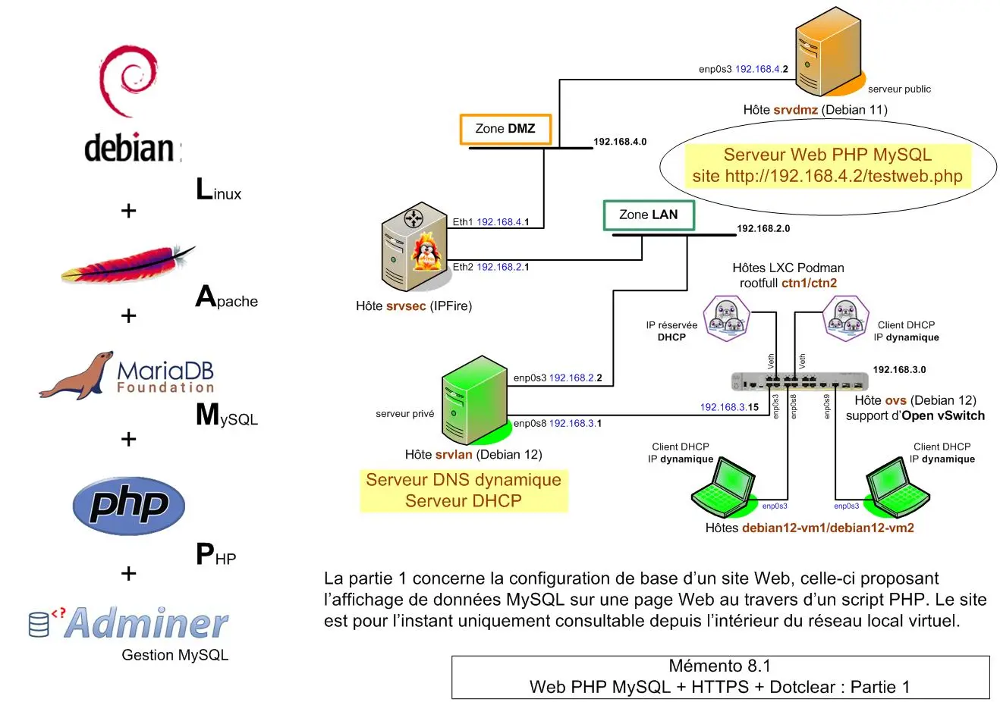
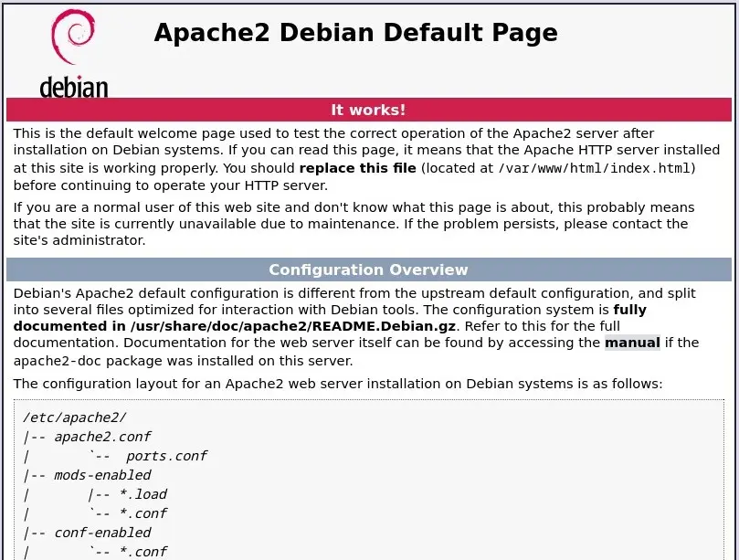
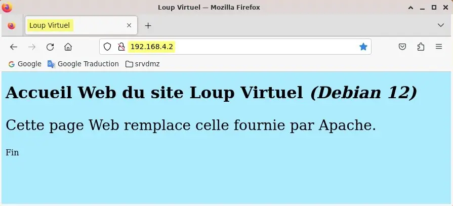
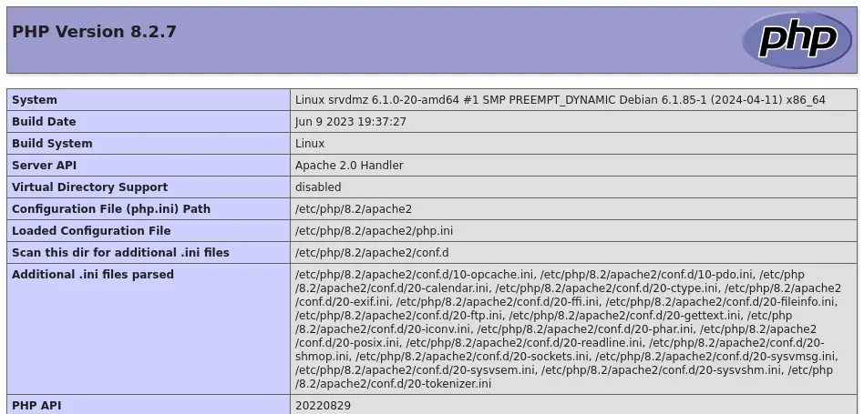
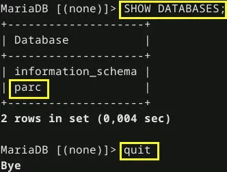
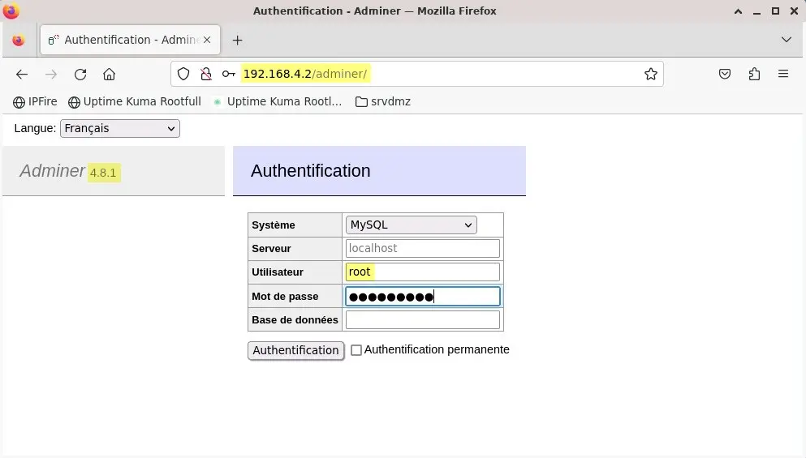
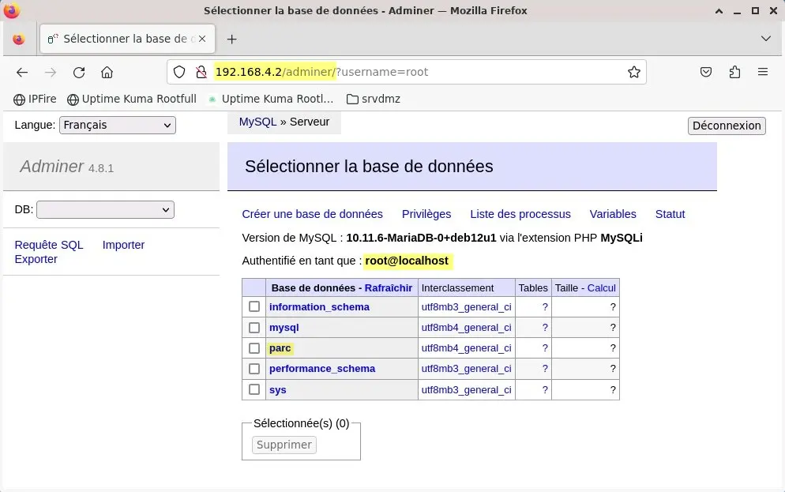
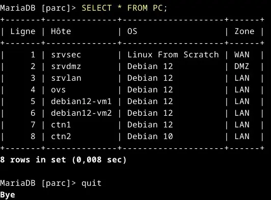
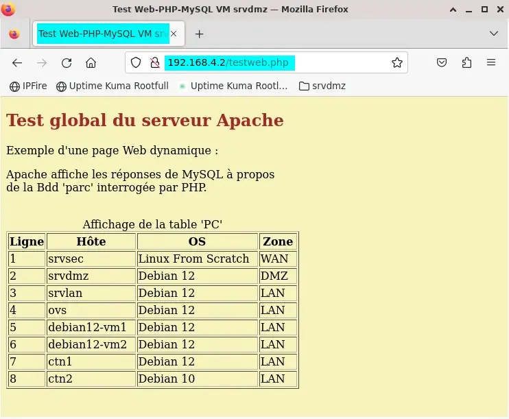

<figure markdown>
  { width="430" }
</figure>

## Mémento 8.1 - Web PHP MySQL

Le service LAMP sera installé sur la VM `srvdmz`.

Il permettra de créer un site Web reposant sur :  
Linux + Apache + MySQL + PHP _(LAMP)_

### Préambule

Logiciels utilisés à l'intérieur des parties 1 et 2 :  
\- Apache pour diffuser les pages web.  
\- PHP pour générer les pages web dynamiques.  
\- MySQL/MariaDB pour stocker le contenu des pages.  
\- OpenSSL pour sécuriser le protocole HTTP _(HTTPS)_.  
\- Adminer pour gérer la base de données MySQL.  
\- CMS Dotclear pour créer facilement un blog complet.

#### _- Fichier DNS hosts_

FQDN _(Fully Qualified Domain Name)_ = Nom de domaine pleinement qualifié.

Créez celui de `srvdmz` en éditant son fichier DNS hosts :

```bash
[srvdmz@srvdmz:~$] sudo nano /etc/hosts
```

et en le modifiant comme ci-dessous :

```markdown
127.0.0.1    localhost
127.0.1.1    srvdmz.loupvirtuel.fr srvdmz

# IP de srvdmz     +  FQDN       + nom d'hôte  + domaine
192.168.4.2  srvdmz.loupvirtuel.fr  srvdmz  loupvirtuel.fr
```

Ne touchez pas au bloc de lignes concernant l'IPv6.

Testez la prise en compte du FQDN :

```bash
[srvdmz@srvdmz:~$] hostname --fqdn
```

Retour :

```markdown
srvdmz.loupvirtuel.fr
```

Apache aura besoin du FQDN de `srvdmz` pour s'installer sans erreur.

<!-- more -->

### Service LAMP

#### _- MAJ du système Debian_

```bash
[srvdmz@srvdmz:~$] sudo apt update
[srvdmz@srvdmz:~$] sudo apt upgrade
[srvdmz@srvdmz:~$] sudo reboot
[srvdmz@srvdmz:~$] sudo apt autoremove --purge
[srvdmz@srvdmz:~$] cat /etc/debian_version
```

La dernière Cde doit retourner le numéro de la version Debian courante.

#### _- Apache_

Installez le paquet apache2 :

```bash
[srvdmz@srvdmz:~$] sudo apt install apache2
```

et contrôlez le numéro de la version installée :

```bash
[srvdmz@srvdmz:~$] sudo apache2 -v 
```

Retour :

```markdown
Server version: Apache/2.4.57 (Debian)
Server built:   2023-04-13T03:26:51 -v 
```

Puis vérifiez le démarrage automatique du serveur :

```bash
[srvdmz@srvdmz:~$] sudo systemctl status apache2  
```

Retour :

```markdown
● apache2.service - The Apache HTTP Server
     Loaded: loaded (/.../apache2...enabled; ...
     Active: active (running) since Mon 2024-04...
       Docs: https://httpd.apache.org/docs/2.4/
   Main PID: 3386 (apache2)
      Tasks: 55 (limit: 1077)
     Memory: 9.1M
        CPU: 145ms
     CGroup: /system.slice/apache2.service
             ├─3386 /usr/sbin/apache2 -k start
             ├─3388 /usr/sbin/apache2 -k start
             └─3389 /usr/sbin/apache2 -k start

avril 15 ... srvdmz systemd[1]: Starting ..
avril 15 ... srvdmz systemd[1]: Started ...  
```

et la bonne syntaxe de ses fichiers de configuration :

```bash
[srvdmz@srvdmz:~$] sudo apache2ctl -t  
```

Retour :

```markdown
Syntax OK  
```

Enfin, depuis la VM `Debian12-vm1`, testez l'URL :  
`http://192.168.4.2`

<figure markdown>
  { width="430" }
  <figcaption>Apache : Accueil /var/www/html/index.html</figcaption>
</figure>

Pour jouer, remplacez l'accueil ci-dessus comme suit :

```bash
[srvdmz@srvdmz:~$] cd /var/www/html 
[srvdmz@srvdmz:~$] sudo  mv index.html index.html.origine
[srvdmz@srvdmz:~$] sudo  touch index.html
[srvdmz@srvdmz:~$] sudo  nano index.html  
```

et remplissez le nouvel index.html avec ce contenu :

```markdown
<!DOCTYPE html>
<html>
<head><meta charset="utf-8"></head>
<title>Loup Virtuel</title>
<body style="background-color:#ADEAFF">

<h1 style="color:#000000">
Accueil Web du site Loup Virtuel <i>(Debian 12)</i>
</h1>

<p style="font-size:28px;">
Cette page Web remplace celle fournie par Apache.
</p>

<p>Fin</p>

</body>
</html>  
```

Pour finir, testez de nouveau l'URL :  
`http://192.168.4.2`

<figure markdown>
  { width="430" }
  <figcaption>Apache : Page d'accueil personnalisée</figcaption>
</figure>

#### _- PHP_

Installez le paquet php :

```bash
[srvdmz@srvdmz:~$] sudo apt install php 
```

Créez ensuite un fichier de contrôle phpinfo.php :

```bash
[srvdmz@srvdmz:~$] sudo touch /var/www/html/phpinfo.php 
```

Editez celui-ci :

```bash
[srvdmz@srvdmz:~$] sudo nano /var/www/html/phpinfo.php 
```

et entrez le contenu ci-dessous :

```markdown
<?php phpinfo(); ?> 
```

Puis, depuis la VM `srvlan`, testez l'URL :  
`http://192.168.4.2/phpinfo.php`

<figure markdown>
  { width="430" }
  <figcaption>PHP : Page Web Infos PHP</figcaption>
</figure>

Les Cdes suivantes afficheront la version de PHP ainsi que la liste des modules PHP installés :

```bash
[srvdmz@srvdmz:~$] php -v
[srvdmz@srvdmz:~$] php -m 
```

#### - _MySQL_ {#titre-mysql}

MariaDB est un moteur de Bdd reposant sur MySQL.

Installez le paquet suivant :

```bash
[srvdmz@srvdmz:~$] sudo apt install mariadb-server
```

Vérifiez le démarrage automatique du serveur MySQL :

```bash
[srvdmz@srvdmz:~$] sudo systemctl status mariadb 
```

Retour :

```markdown
● mariadb.service - MariaDB 10.11.6 database server
   Loaded: loaded (/lib/.../mariadb.se... enabled; ...
   Active: active (running) since Mon 2024-04... ago
     Docs: man:mariadbd(8)
           https://mariadb.com/kb/en/library/systemd/
 Main PID: 10720 (mariadbd)
   Status: "Taking your SQL requests now..."
   Tasks: 10 (limit: 1077)
   Memory: 91.3M
      CPU: 709ms
   CGroup: /system.slice/mariadb.service
             └─10720 /usr/sbin/mariadbd

...
... srvdmz mariadbd.../mariadbd: ready for connections.
... srvdmz mariadbd... '/run/mysqld/mysqld.sock' ... 3306
... srvdmz systemd... Started mariadb.service - Maria...
... srvdmz /etc/mysql/debian... Checking ... root accounts. 
```

puis modifiez en partie ses paramètres de sécurité :

```bash
[srvdmz@srvdmz:~$] sudo mysql_secure_installation  
```

en traitant le retour de la Cde ci-dessus comme suit :

```markdown hl_lines="8 16 21 35 41 48 54"
NOTE: RUNNING ALL PARTS OF THIS ... FOR ALL MariaDB
      SERVERS IN PRODUCTION USE! PLEAS... CAREFULLY!

In order to log into MariaDB to secur... the current
password ...  If you've just installed MariaDB, and
haven't set the root ... just press enter here.

Enter ... password for root ... : Appuyez sur Entrée
OK, successfully used password, moving on...

Setting the root password or ... unix_socket ... nobody
can log into the MariaDB root user with... authorisation.

You already ... root ... protected, ... answer 'n'.

Switch to unix_socket authentication [Y/n] n
 ... skipping.

You already ... root ... protected, ... answer 'n'.

Change the root password? [Y/N] y      
New password: Votre MDP pour le root de MySQL
Re-enter new password: 
Password updated successfully!
Reloading privilege tables..
 ... Success!


By default, a MariaDB installa..., allowing anyone
to log into MariaDB without ... account created for
them.  This is intended ... to make the installation
go a bit smoother.  You shou... before moving into a
production environment.

Remove anonymous users? [Y/n] y
 ... Success! Accès anonymous désactivé

Normally, root should ... from 'localhost'.  This
ensures that ... the root password from the network.

Disallow root login remotely? [Y/n] n
 ... skipping. Accès root distant conservé

By default, MariaDB ... named 'test' that anyone can
access.  This is also ...ting, and should be removed
before moving into a production environment.

Remove test database and access to it? [Y/n] n 
 ... skipping. Bdd test conservée pour des tests

Reloading the privilege tables ... made so far
will take effect immediately.

Reload privilege tables now? [Y/n] y
 ... Success!

Cleaning up...

All done!  If you've completed ... your MariaDB
installation should now be secure.

Thanks for using MariaDB!  
```

Testez une connexion locale en tant que root MySQL :

```bash
[srvdmz@srvdmz:~$] sudo mysql -u root -p
[sudo] Mot de passe de srvdmz :
Enter password: Peu importe, MariaDB gérant par défaut root avec son plugin unix_socket 
```

Retour :

```markdown
Welcome to the MariaDB monitor.  Commands end wit...
Your MariaDB connection id is 36
Server version: 10.11.6-MariaDB-0+deb12u1 Debian 12 

Copyright (c) 2000, 2018, Oracle, MariaDB Corpora...

Type 'help;' or '\h' for help. Type '\c' to clear ..

MariaDB [(none)]> quit
Bye 
```

Un prompt d'accès à la console MysQL s'affiche.  
Utilisez la Cde quit pour quitter.

Pour tester une connexion distante, commencez par éditez le fichier 50-server.cnf :

```bash
[srvdmz@srvdmz:~$] cd /etc/mysql/mariadb.conf.d
[srvdmz@srvdmz:~$] sudo nano 50-server.cnf 
```

et remplacez la ligne bind-address = 127.0.0.1 par :

```markdown
bind-address = 192.168.4.2            # IP du serveur MySQL 
```

Reconnectez-vous localement et créez une Bdd parc :

```bash
MariaDB [(none)]> CREATE DATABASE parc;
```

Touche Entrée après le point-virgule.

Retour :

```markdown
Query OK, 1 row affected (0.001sec)

MariaDB [(none)]> 
```

Créez maintenant un utilisateur `mysqluserdist` autorisé à gérer celle-ci depuis la VM `srvlan` :

```bash
MariaDB [(none)]> GRANT ALL PRIVILEGES ON parc.* TO mysqluserdist@'192.168.2.2' IDENTIFIED BY 'le MDP que vous voulez ';
```

Touche Entrée après le point-virgule.

Retour :

```markdown
Query OK, 0 row affected (0.003sec)

MariaDB [(none)]> quit
```

Redémarrez MySQL :

```bash
[srvdmz@srvdmz:~$] sudo systemctl restart mariadb   
```

Allez sur `srvlan`, installez le paquet mariadb-client :

```bash
[srvlan@srvlan:~$] sudo apt install mariadb-client   
```

et testez une connexion distante sur le serveur MySQL :

```bash
[srvlan@srvlan:~$] mysql -u mysqluserdist -p -h 192.168.4.2
Enter password: Entrez le MDP de l'utilisateur mysqluserdist   
```

Retour :

```markdown
Welcome to the MariaDB monitor.  Commands end wit...
Your MariaDB connection id is 31
Server version: 10.11.6-MariaDB-0+deb12u1 Debian 12

Copyright (c) 2000, 2018, Oracle, MariaDB Corpora...

Type 'help;' or '\h' for help. Type '\c' to clear ..

MariaDB [(none)]>   
```

Listez les Bdd visibles pour `mysqluserdist` :

<figure markdown>
  
  <figcaption>MySQL : Retour Cde SHOW DATABASES</figcaption>
</figure>

### Gestionnaire de Bdd Adminer {#adminer}

Cet outil plus léger que phpMyAdmin permettra d'administrer les Bdd du serveur MySQL facilement, ceci en local ou à distance via une interface Web.

Installez le paquet adminer :

```bash
[srvdmz@srvdmz:~$] sudo apt install adminer
```

Un fichier de configuration adminer.conf a été créé dans /etc/apache2/conf-available/.

Demandez à Apache de prendre en compte le fichier :

```bash
[srvdmz@srvdmz:~$] sudo a2enconf adminer.conf 
```

et rechargez la configuration pour traitement :

```bash
[srvdmz@srvdmz:~$] sudo systemctl reload apache2 
```

#### - _Accès distant sur MySQL_

Depuis la VM `debian12-vm1`, testez l'URL :  
`http://192.168.4.2/adminer`

<figure markdown>
  { width="430" }
  <figcaption>Adminer : Fenêtre de connexion</figcaption>
</figure>

Utilisez pour l'utilisateur `root` le MDP créé au _[§ MySQL](#titre-mysql)_ avec mysql_secure_installation.

<figure markdown>
  { width="430" }
  <figcaption>Adminer : Fenêtre d'administration</figcaption>
</figure>

### Test global du serveur LAMP

Ce test fera appel à un script PHP que vous allez écrire et exécuter.

Le script ouvrira une connexion sur la Bdd parc créée ci-dessus et permettra d'afficher sur une page Web le contenu d'une table de nom PC.

Connectez-vous localement sans utiliser la Cde sudo :

```bash
[srvdmz@srvdmz:~$] mysql -u root -p
Enter password : MDP root créé au paragraphe 2.4 
```

et entrez les Cdes SQL suivantes pour créer, remplir et afficher la table PC :

```markdown
MariaDB [none]> USE parc;

MariaDB [parc]> CREATE TABLE PC (Ligne INTEGER NOT NULL PRIMARY KEY);

MariaDB [parc]> ALTER TABLE PC ADD COLUMN Hôte VARCHAR(20);
MariaDB [parc]> ALTER TABLE PC ADD COLUMN OS VARCHAR(20);
MariaDB [parc]> ALTER TABLE PC ADD COLUMN Zone VARCHAR(10); 

MariaDB [parc]> INSERT INTO PC VALUES (1,'srvsec','Linux From Scratch','WAN');
MariaDB [parc]> INSERT INTO PC VALUES (2,'srvdmz','Debian 12','DMZ');
MariaDB [parc]> INSERT INTO PC VALUES (3,'srvlan','Debian 12','LAN');
MariaDB [parc]> INSERT INTO PC VALUES (4,'ovs','Debian 12','LAN');
MariaDB [parc]> INSERT INTO PC VALUES (5,'debian12-vm1','Debian 12','LAN');
MariaDB [parc]> INSERT INTO PC VALUES (6,'debian12-vm2','Debian 12','LAN');
MariaDB [parc]> INSERT INTO PC VALUES (7,'ctn1','Debian 12','LAN');
MariaDB [parc]> INSERT INTO PC VALUES (8,'ctn2','Debian 10','LAN');

MariaDB [parc]> SELECT * FROM PC; 
```

Retour de la dernière requête SQL :

<figure markdown>
  
  <figcaption>MySQL : Retour Cde SELECT * FROM PC</figcaption>
</figure>

Maintenant, créez et éditez le script testweb.php :

```bash
[srvdmz@srvdmz:~$] cd /var/www/html
[srvdmz@srvdmz:~$] sudo touch testweb.php
[srvdmz@srvdmz:~$] sudo nano testweb.php  
```

puis entrez le code HTML et PHP suivant :

```markdown
<!DOCTYPE html>
<html>
<head>
<meta charset="utf-8">
<title>Test Web-PHP-MySQL VM srvdmz</title>
</head>
<body style="background-color:#F2F2BB">
<h2 style="color:brown">Test global du serveur Apache</h2>
<p>Exemple d'une page Web dynamique :</p>
<p>Apache affiche les réponses de MySQL à propos<br />
de la Bdd 'parc' interrogée par PHP.</p><br />
<table border=1>
<caption>Affichage de la table 'PC'</caption>
<tr>
<th>Ligne</th><th>Hôte</th><th>OS</th><th>Zone</th>
</tr>
<?php
// Connexion sur le serveur MySQL
$srv = "localhost"; $user = "root";
$pass = "votre MDP MySQL pour root"; $bdd = "parc";
$conn = mysqli_connect($srv,$user,$pass,$bdd,) or die ("Connexion MySQL impossible...");
// Gestion des accents inclus dans les requêtes SQL
mysqli_set_charset($conn,"utf8");
// Sélection des enregistrements de la table 'PC' et
// envoi du résultat
$query = "SELECT * FROM PC";
$result = mysqli_query($conn,$query) or die ("Echec sur la table PC...");
// Insertion des lignes d'enregistrements trouvées
// dans un tableau HTML
while ($ligne = mysqli_fetch_array ($result))
{
echo "<tr><td>" . $ligne ["Ligne"] . "&nbsp;&nbsp;</td>";
echo "<td>" . $ligne ["Hôte"] . "&nbsp;&nbsp;</td>";
echo "<td>" . $ligne ["OS"] . "&nbsp;&nbsp;</td>";
echo "<td>" . $ligne ["Zone"] . "&nbsp;&nbsp;</td></tr>";
}
// Fermeture de la connexion
mysqli_close($conn);
?>
</table>
</body>
</html>  
```

Testez, cette fois depuis la VM `srvlan`, l'URL :  
`http://192.168.4.2/testweb.php`

<figure markdown>
  { width="430" }
  <figcaption>Apache : Exécution du script testweb.php</figcaption>
</figure>

!!! note "Nota"
    Un mémento futur traitera de l'accès au serveur Web depuis Internet.

{ align=left }

&nbsp;  
Voilà pour la création de base d'un  
site Web PHP MySQL. La partie 2  
vous attend pour la création d'un  
blog Dotclear sécurisé HTTPS.

[Mémento 8.1 - Partie 2/2](../posts/lamp-https-cms-partie-2-debian12.md){ .md-button .md-button--primary }
