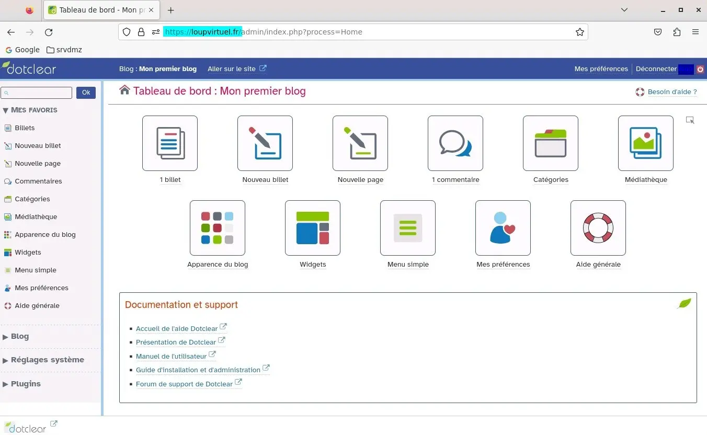

<figure markdown>
  { width="430" }
</figure>

## Mémento 8.1 - HTTPS _(SSL/TLS)_

### Protocole HTTPS

Ce protocole servira à garantir la sécurité et l’intégrité des informations échangées entre le site loupvirtuel.fr et les navigateurs Web.

HTTPS combinera le HTTP avec une couche de chiffrement SSL/TLS.

Vous utiliserez, pour le chiffrement, l'outil openssl installé avec Apache.

Les clés et certificats dédiés au HTTPS seront créés dans le dossier /etc/ssl/.

Le domaine loupvirtuel.fr étant fictif, impossible de demander à une Autorité de Certification existante de le valider. Il faudra en créer une localement.

#### _- Certificat PEM (CA)_

CA = Certificate Authority _(Autorité de Certification)_  
PEM = Format de texte codé en Base64

Créez une clé privée contenant un MDP pour le CA :

```bash
[srvdmz@srvdmz:~$] cd /etc/ssl 
[srvdmz@srvdmz:~$] sudo openssl genrsa -aes128 -out loupvirtuel-ca.key 2048 
```

Gérez le retour ainsi :

```markdown
Enter PEM pass phrase: Ce que vous voulez
Verifying - Enter PEM pass phrase:
```

et générez le certificat CA X.509 associé à cette clé :

```bash
[srvdmz@srvdmz:~$] sudo openssl req -x509 -new -nodes -key loupvirtuel-ca.key -sha256 -days 3650 -out loupvirtuel-ca.pem 
```

Gérez le retour pour le **C**ertificate **A**uthority ainsi :

```markdown
Enter pass ... loupvirtuel-ca.key: Votre pass phrase CA
You are about ...
-----
Country Name (2 letter code) [AU]:FR
State or Province Name (full name) [Some-State]:Ain
Locality Name (eg, city) []:Bourg-en-Bresse           
Organization Name (eg...) [Internet ... Ltd]:Internet-CA
Organizational Unit Name (eg...) []:Labo Certificats CA
Common Name (e.g... FQDN ...) []:internet-ca.org
Email Address []:Rien -> Touche Entrée
```

#### _- Certificats CSR/CRT_

Créez une clé privée pour le serveur Apache :

```bash
[srvdmz@srvdmz:~$] sudo openssl genrsa -out loupvirtuel.key 2048  
```

<!-- more -->

et générez le certificat CSR associé à cette clé :

```bash
[srvdmz@srvdmz:~$] sudo openssl req -new -key loupvirtuel.key -out loupvirtuel.csr   
```

Gérez le retour pour le **C**ertificate **S**igning **R**equest ainsi :

```markdown
You are about ...
-----
Country Name (2 letter code) [AU]:FR
State or ... Name (full name) [Some...]:Var
Locality Name (eg, city) []:Cuers
Organization Name (eg...) [Internet ... Ltd]:InfoLoup
Organizational Unit Name (eg...) []:Blog Loup Virtuel
Common Name (e.g... FQDN ...) []:loupvirtuel.fr
Email Address []:admin@loupvirtuel.fr

Please enter ...
-----
A challenge password []:Rien -> Touche Entrée
An optional company name []:Rien -> Touche Entrée
```

Le certificat CSR sera traité par le CA comme une demande de signature.

Il est recommandé aujourd'hui d'ajouter l'extension d'identification de noms de domaines alternatifs _(subjectAltName)_ à la demande de signature.

Pour cela, créez un fichier d'extension de nom csr.ext :

```bash
[srvdmz@srvdmz:~$] sudo nano csr.ext   
```

et entrez ce contenu répondant à la norme X509v3 :

```markdown
authorityKeyIdentifier=keyid,issuer 
basicConstraints=CA:FALSE
keyUsage = nonRepudiation, digitalSignature, keyEncipherment, dataEncipherment
subjectAltName = @alt_names

[alt_names]
DNS.1 = loupvirtuel.fr
DNS.2 = localhost
DNS.3 = srvdmz.loupvirtuel.fr
IP.1 = 127.0.0.1 
```

Enfin, traitez le CSR et son extension en générant un certificat CRT final signé pour Apache :

```bash
[srvdmz@srvdmz:~$] sudo openssl x509 -req -in loupvirtuel.csr -CA loupvirtuel-ca.pem -CAkey loupvirtuel-ca.key -CAcreateserial  -out loupvirtuel.crt -days 3650 -sha256 -extfile csr.ext    
```

Retour pour le certificat final _(CRT)_ :

```markdown
Certificate request self-signature ok
subject=C = FR, ST = Var, L = Cuers, O = InfoLoup, OU = Blog Loup Virtuel, CN = loupvirtuel.fr, emailAddress = admin@loupvirtuel.fr
Enter pass ... loupvirtuel-ca.key: Votre pass phrase CA 
```

!!! note "Nota"
    C'est en tant que CA _(autorité de certification)_ que vous venez de générer le certificat CRT.

Bilan des clés et certificats créés dans /etc/ssl/ :

* loupvirtuel-ca.key
* loupvirtuel-ca.pem
* loupvirtuel.key
* loupvirtuel.csr
* csr.ext
* loupvirtuel-ca.srl
* loupvirtuel.crt

#### _- Certificat PEM dans Firefox_

Afin que le HTTPS fonctionne sans alerte avec un certificat CA auto-signé, il est nécessaire d'importer celui-ci dans la configuration du navigateur Web Firefox.

Pour cela, accédez aux Paramètres du navigateur Web :  
-> Vie privée et sécurité -> Certificats  
-> Bouton Afficher les certificats...

Une fenêtre Gestionnaire de certificats s'ouvre :  
-> Onglet Autorités -> Bouton Importer...

-> /etc/ssl/ -> Sélectionnez loupvirtuel-ca.pem -> Ouvrir

Une fenêtre Téléchargement du certificat s'ouvre :  
-> Cochez les 2 demandes de confirmation  
-> OK -> OK

Vous devriez à présent trouver dans la liste des autorités gérées par Firefox l'Autorité de Certification de nom Internet-CA.

#### _- Hôte virtuel et test HTTPS_

Au préalable, demandez à Apache de prendre en compte son module ssl :

```bash
[srvdmz@srvdmz:~$] sudo a2enmod ssl    
```

Retour :

```markdown
Considering dependency setenvif for ssl:
Module setenvif already enabled
Considering dependency mime for ssl:
Module mime already enabled
Considering dependency socache_shmcb for ssl:
Enabling module socache_shmcb.
Enabling module ssl.
See /usr/share/doc/apache2/README.Debian.gz on ...
To activate the new configuration, you need to run:
  systemctl restart apache2    
```

Créez maintenant un hôte virtuel de nom loupvirtuel :

```bash
[srvdmz@srvdmz:~$] cd /etc/apache2/sites-available
[srvdmz@srvdmz:~$] sudo touch loupvirtuel.conf    
```

Editez celui-ci :

```bash
[srvdmz@srvdmz:~$] sudo nano loupvirtuel.conf     
```

et entrez le contenu suivant :

```markdown
<VirtualHost *:80>
ServerName loupvirtuel.fr
ServerAlias www.loupvirtuel.fr srvdmz.loupvirtuel.fr
Redirect permanent / https://loupvirtuel.fr/
</VirtualHost>
<VirtualHost *:443>
DocumentRoot /var/www/html/
ServerName loupvirtuel.fr
<Directory /var/www/html/>
     Options -Indexes +FollowSymlinks +MultiViews
     AllowOverride None
     Require all granted
</Directory>
ErrorLog /var/log/apache2/loupvirtuel.error.log
CustomLog /var/log/apache2/loupvirtuel.access.log combined
SSLEngine On
SSLOptions +FakeBasicAuth +ExportCertData +StrictRequire
SSLCertificateFile /etc/ssl/loupvirtuel.crt
SSLCertificateKeyFile /etc/ssl/loupvirtuel.key
</VirtualHost>     
```

Demandez ensuite à Apache de traiter cet hôte virtuel :

```bash
[srvdmz@srvdmz:~$] sudo a2ensite loupvirtuel     
```

et redémarrez celui-ci :

```bash
[srvdmz@srvdmz:~$] sudo systemctl restart apache2     
```

Testez depuis le navigateur Firefox l'URL :  
`https://loupvirtuel.fr`

Cliquez ensuite sur le cadenas de la barre d'adresse puis sur la ligne Connexion sécurisée :

<figure markdown>
  { width="580" }
  <figcaption>HTTPS : Site loupvirtuel.fr sécurisé</figcaption>
</figure>

Cliquez enfin sur la ligne Plus d'informations et sur Afficher le certificat :

<figure markdown>
  { width="580" }
  <figcaption>HTTPS : Détail du certificat SSL pour loupvirtuel.fr</figcaption>
</figure>

Les 2 captures ci-dessus montrent le site loupvirtuel.fr validé HTTPS.

Par curiosité, complétez la vérification SSL :

```bash
[srvdmz@srvdmz:~$] cd /etc/ssl

[srvdmz@srvdmz:~$] sudo openssl s_client \
-CAfile loupvirtuel-ca.pem -connect loupvirtuel.fr:443     
```

Le caractère \ indique d'écrire la Cde sur une seule ligne.

Vous devriez trouver dans le retour et dans l'ordre :  
\- depth =1 ... -> verifiy return :1  
\- depth =0 ... -> verifiy return :1  
\- SSL handshake ... -> Verification : OK  
\- New, TLSv1.3 ... -> Verify return code: 0 (ok)  
\- Post handshake ... -> Verify return code: 0 (ok)  
\- Post handshake ... -> Verify return code: 0 (ok)

Aucun message d'erreur ne doit apparaître.

#### _- Tests depuis srvlan, etc..._

La configuration actuelle exige, pour joindre le domaine loupvirtuel.fr depuis les VM srvlan et debian12-vm*, de modifier leurs fichiers DNS respectifs /etc/hosts.

Editez chacun des 3 fichiers DNS et ajoutez cette ligne :

```markdown
192.168.4.2     loupvirtuel.fr
```

Exemple pour le fichier hosts de la VM srvlan :

```markdown
127.0.0.1	localhost
127.0.1.1	srvlan
192.168.3.1     srvlan.intra.loupipfire.fr srvlan
192.168.4.2     loupvirtuel.fr
```

Puis, copiez le certificat CA dans le dossier partagé :

```bash
[srvdmz@srvdmz:~$] cd /etc/ssl
[srvdmz@srvdmz:~$] sudo cp loupvirtuel-ca.pem /home/srvdmz/Partage/
```

et importez celui-ci dans les navigateurs Web des VM en procédant comme avec srvdmz mais en sélectionnant le fichier loupvirtuel-ca.pem situé dans /home/srvlan/Partage/ ou /home/clientx2dlinux/Partage/.

Pour finir, testez pour chacune des VM l'accès à l'URL :
https://loupvirtuel.fr

### Installation du CMS Dotclear

CMS = Content Management System

Dotclear est un moteur de blog français performant et facile d'utilisation que j'exploite personnellement pour gérer mes notes techniques.

#### _- Téléchargement / Extraction_

```bash
[srvdmz@srvdmz:~$] cd /var/www/html
[srvdmz@srvdmz:~$] sudo wget https://download.dotclear.net/latest.tar.gz

[srvdmz@srvdmz:~$] sudo tar zxvf latest.tar.gz
[srvdmz@srvdmz:~$] sudo rm latest.tar.gz
```

Un dossier dotclear a été créé dans /var/www/html.

#### _- Préparation de l'installation_

Créez avec le gestionnaire Adminer une Bdd loupvirtuel d'interclassement utf8mb4_general_ci :

<figure markdown>
  { width="580" }
  <figcaption>Adminer : Création d'une Bdd loupvirtuel</figcaption>
</figure>

et ajoutez les modules PHP 8.2 suivants :

```bash
[srvdmz@srvdmz:~$] sudo apt install php8.2-mbstring php8.2-gd php8.2-xml
```

Modifiez le propriétaire et le groupe du dossier dotclear :

```bash
[srvdmz@srvdmz:~$] sudo chown -R www-data:www-data /var/www/html/dotclear 
```

Editez ensuite l'hôte virtuel loupvirtuel créé ci-dessus :

```bash
[srvdmz@srvdmz:~$] cd /etc/apache2/sites-available
[srvdmz@srvdmz:~$] sudo nano loupvirtuel.conf   
```

et modifiez sa section <VirtualHost *:443> comme suit :

```markdown
<VirtualHost *:443>

DocumentRoot /var/www/html/dotclear/
ServerName loupvirtuel.fr

<Directory /var/www/html/dotclear/>
     Options -Indexes +FollowSymlinks +MultiViews
     AllowOverride ALL
     Require all granted
</Directory>

ErrorLog /var/log/apache2/loupvirtuel.error.log
CustomLog /var/log/apache2/loupvirtuel.access.log combined

SSLEngine On
SSLOptions +FakeBasicAuth +ExportCertData +StrictRequire
SSLCertificateFile /etc/ssl/loupvirtuel.crt
SSLCertificateKeyFile /etc/ssl/loupvirtuel.key

</VirtualHost>     
```

Rechargez enfin la configuration de Apache :

```bash
[srvdmz@srvdmz:~$] sudo systemctl reload apache2  
```

Vous êtes maintenant prêt pour effectuer une installation de Dotclear sans incident.

#### _- Installation et test_

Ouvrez Firefox, videz son historique et lancez l'URL `https://loupvirtuel.fr`.

Une page Assistant d'installation de Dotclear s'ouvre :  
-> Type de base de données : MySQLi  
-> Nom d'hôte de la base de données : localhost  
-> Nom de la base de données : loupvirtuel  
-> Nom d'utilisateur de la base de données : root  
-> MDP de la base de données : Votre MDP root Mysql  
-> Préfixe des tables de la base de données : dc_  
-> Email principal : Votre adresse Email personnelle

-> Bouton Continuer

Une page Installation de Dotclear s'ouvre :  
\- Informations utilisateur  
-> Prénom : Votre prénom  
-> Nom : Votre nom  
-> Email : Votre adresse Email personnelle

\- Identifiant et mot de passe  
-> Nom d'utilisateur : Ce que vous voulez  
-> Nouveau mot de passe : Ce que vous voulez  
-> Confirmer le mot de passe :

-> Bouton Enregistrer

Si tout est OK, une page titrée C'est terminé ! s'affiche :  
-> Bouton Gérer votre blog pour l'accès à l'administration

<figure markdown>
  { width="580" }
  <figcaption>Dotclear : Panneau d'administration</figcaption>
</figure>

Le menu pour se déconnecter se situe en haut à droite.

Les URL à retenir :  
`https://loupvirtuel.fr/admin/` pour administrer le site.  
`https://loupvirtuel.fr` pour parcourir le site.

Amusez-vous maintenant avec Dotclear et créez votre propre page d'accueil.

Exemple de page d'accueil :

<figure markdown>
  { width="580" }
  <figcaption>Dotclear : Page d'accueil de loupvirtuel.fr</figcaption>
</figure>

{ align=left }

&nbsp;  
Voilà ! Terminé pour ce grand  
chapitre. Le mémento 9.1 vous  
attend pour découvrir l'usage du  
protocole SFTP.

!!! Info "Mémento 9.1 en cours de construction"
