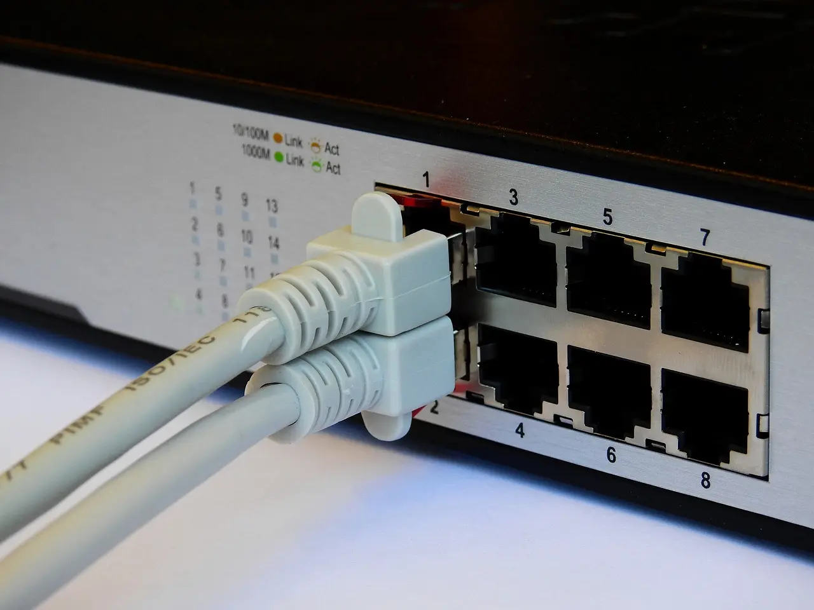
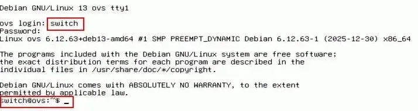
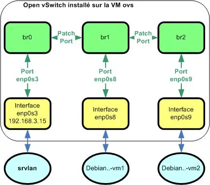
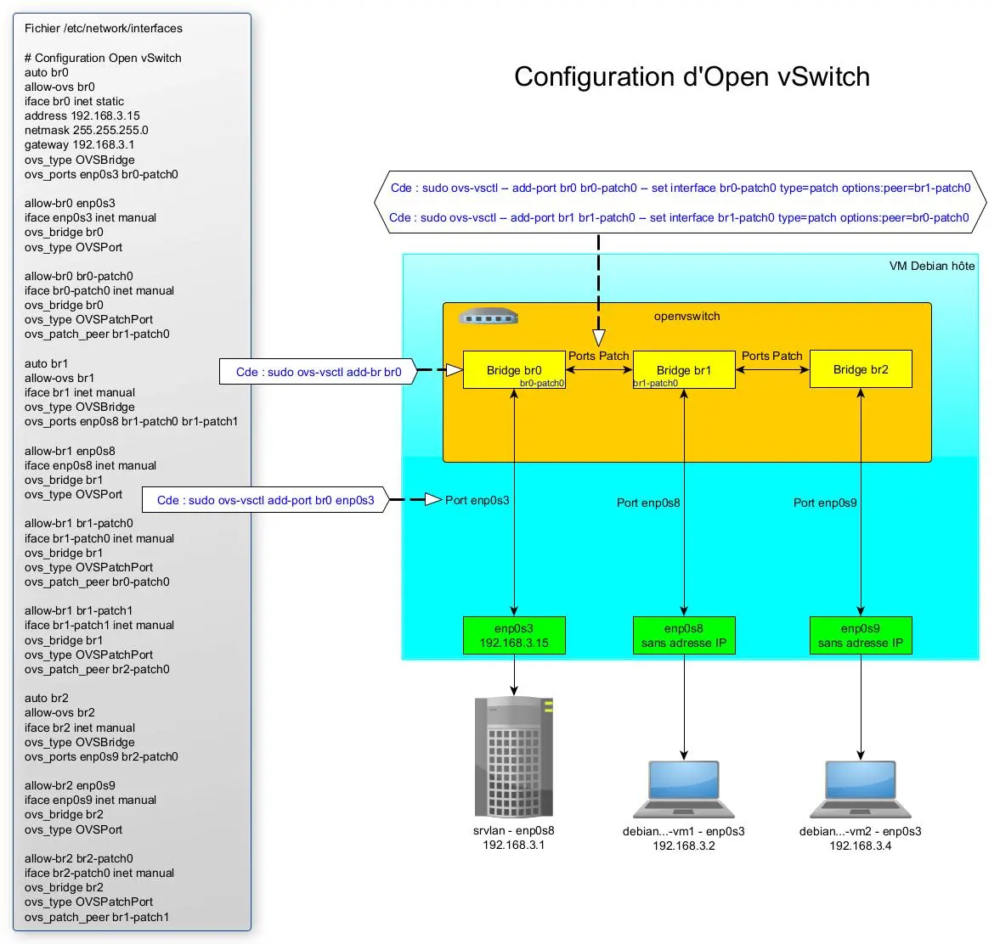
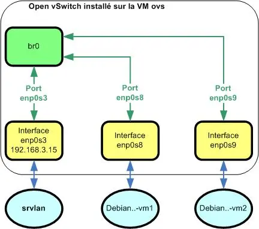

<figure markdown>
  { width="430" }
</figure>

## Mémento 5.1 - Switch virtuel OvS

Open vSwitch _(OvS)_ se comportera comme un véritable switch physique en proposant la gestion des adresses MAC tel un switch L2 ainsi que celle des adresses IP pour le routage des paquets IP tel un switch L3.

Le switch virtuel sera, contrairement à une architecture standard, installé sur une VM et non sur le PC hôte de l'hyperviseur VirtualBox.

Le moyen d'approcher une architecture standard sera de créer un conteneur à l'intérieur de la VM et de connecter celui-ci sur OvS à l'aide d'une interface réseau virtuelle Veth _(Mémento suivant)_.

Le raccordement externe des clients LAN Debian sur OvS se fera aux travers de bridges créés sur celui-ci.

La gestion possible de VLAN ne sera pas traitée ici.

### Construction de la VM ovs

L'utilisation de VirtualBox est considérée acquise.

<!-- more -->
  
A défaut, référez-vous aux mémentos suivants :  
[VirtualBox - Installation](../posts/virtualbox-installation.md){ target="_blank" }

[VirtualBox - Mode d’accès réseau par pont](../posts/virtualbox-pont-reseau.md){ target="_blank" }

#### _- Création et configuration_

Le PC hôte doit être un PC 64 bits, courant de nos jours.  
  
Téléchargez l'ISO debian-z.x.y-amd64\-netinst.iso :  
[https://cdimage.debian.org/.../current/amd64/iso-cd/](https://cdimage.debian.org/debian-cd/current/amd64/iso-cd/){ target="_blank"}  
  
\- Démarrez ensuite l'application VirtualBox 7.2.x, puis :  
\- - Menu de VirtualBox -> Machine -> Nouvelle...

Selon la version de l'hyperviseur, l'interface est en franglais.  
-> Virtual machine name and operating system  
-> VM Name : ovs  
-> VM Folder : Sélectionnez le dossier de stockage des VM  
-> ISO Image : Sélectionnez l'ISO téléchargée ci-dessus  
-> Décochez : Proceed with Unattended Installation _(important)_  
-> OS : Linux -> OS Distribution : Debian  
-> OS Version : Debian (64-bit)

-> Specify virtual hardware  
-> Base Memory : 1024 MB  
-> Number of CPUs : 2 CPU si possible

-> Specify virtual hard disk  
-> Create a Virtual Hard Disk : Ajustez à 12 Go

-> Bouton Finish
  
La VM créée s'affiche dans le panneau gauche de VirtualBox.  
  
\- Sélectionnez maintenant la nouvelle VM, puis :  
\- - Clic droit -> Configuration...  
\- - - Onglet Général  
-> Features -> Shared Clipboard -> Bidirectionnel

\- - - Onglet System  
-> Carte mère -> Boot Device Order -> Décochez Disquette  
-> Processeur -> Cochez PAE/NX

-> OK
  
Les autres paramètres peuvent rester inchangés.

#### _- Installation de l'OS Debian_

Conseil pratique avant de démarrer la nouvelle VM :  
Si le curseur de la souris disparait lors d'un clic dans la fenêtre de la VM, celui-ci peut être récupéré par le PC hôte à l'aide de la touche CTRL située à droite de la barre d'espace du clavier.  
  
\- Sélectionnez la VM, puis :  
-> Clic droit -> Démarrer  
-> Start with GUI _(La VM s'exécute)_
  
Sélectionnez Graphical Install et appliquez ce qui suit :  
\- Language -> Français  
\- Pays (territoire ou région) -> France  
\- Disposition de clavier à utiliser -> Français  
\- Nom de machine -> ovs  
\- Domaine -> Laissez le champ vide  
\- MDP du super utilisateur root -> Votre MDP pour root  
\- Confirmation du MDP -> Votre MDP pour root  
\- Nom complet du nouvel utilisateur -> Ex: switch  
\- Identifiant pour le compte utilisateur -> switch  
\- MDP pour le nouvel utilisateur -> Votre MDP pour switch  
\- Confirmation du MDP -> Votre MDP pour switch  
\- Méthode de partitionnement -> Assisté - utili... entier  
\- Disque à partitionner -> Celui proposé de 12 Go  
\- Schéma de partitionnement -> Tout ... seule partition  
\- Table des partitions -> Terminer le partitionnement ...  
\- Faut-il appliquer les changements … disques ? -> Oui  
  
L'installation de base commence :  
\- Faut-il analyser d'autres supports ... ? -> Non  
\- Pays du miroir de l'archive Debian -> France  
\- Miroir de l'archive Debian -> deb.debian.org  
\- Mandataire HTTP (lais...) -> Laissez vide  
  
L'installation continue :  
\- Souhaitez-vous participer à l'étude statistique... -> Non  
\- Logiciels à installer  
-> Décochez environnement de bureau Debian  
-> Décochez ... GNOME  
-> Décochez serveur SSH  
-> Conservez utilitaires usuels du système
  
L'installation se termine :  
\- Installer ... de démarrage GRUB sur le secteur ... -> Oui  
\- Périphérique ... programme de démarrage -> /dev/sda  
\- Installation terminée -> Continuer _(sans retrait du CD)_  
  
Le système reboot et une fenêtre de connexion s'ouvre :  
-> ovs login : Entrez switch  
-> Password : Entrez Votre MDP pour switch

Si tout est OK, affichage du prompt switch@ovs :

<figure markdown>
  
  <figcaption>Open vSwitch : Premier démarrage de la VM ovs</figcaption>
</figure>

Autorisez ensuite l'usage de la Cde sudo à l'utilisateur switch :

```bash
[switch@ovs] su root
Mot de passe : Votre MDP pour root

[root@ovs] apt install sudo
[root@ovs] sudo usermod -aG sudo switch
[root@ovs] sudo reboot
```

et reconnectez-vous en tant qu'utilisateur switch.  
  
Pour info, la VM ovs peut être arrêtée de 2 façons :

```bash
[switch@ovs] sudo poweroff  
[switch@ovs] sudo shutdown -h now
```

### Installation-Configuration d'OvS

Au préalable, observez la configuration réseau active avec la Cde ip a.

Retour normal :

```markdown hl_lines="7 10"
1: lo: <LOOPBACK,UP,LOWER_UP> mtu 65536 qdisc noqueue state UNKNOWN group default qlen 1000
    link/loopback 00:00:00:00:00:00 brd 00:00:00:00:00:00
    inet 127.0.0.1/8 scope host lo
       valid_lft forever preferred_lft forever
    inet6 ::1/128 scope host noprefixroute
       valid_lft forever preferred_lft forever
2: enp0s3: <BROADCAST,MULTICAST,UP,LOWER_UP> mtu 1500 qdisc fq_codel state UP group default qlen 1000
    link/ether 08:00:27:fe:80:16 brd ff:ff:ff:ff:ff:ff
    altname enx080027fe8016
    inet 10.0.2.15/24 brd 10.0.2.255 scope global dynamic noprefixroute enp0s3
       valid_lft 84380sec preferred_lft 73580sec
    inet6 fd17:625c:f037:2:a00:27ff:fefe:8016/64 scope global dynamic mngtmpaddr proto kernel_ra
       valid_lft 86116sec preferred_lft 14116sec
    inet6 fd17:625c:f037:2:bb8c:8c1b:8a05:1029/64 scope global dynamic mngtmpaddr noprefixroute
       valid_lft 86116sec preferred_lft 14116sec
    inet6 fe80::3d78:ac2d:6974:6111/64 scope link
       valid_lft forever preferred_lft forever
```

#### _- Installation_

Installez le paquet openvswitch-switch :

```bash
[switch@ovs] sudo apt install openvswitch-switch
```

Les paquets concernant les dépendances manquantes sont ajoutés automatiquement.

Affichez maintenant la version d'Open vSwitch _(OvS)_ :

```bash
[switch@ovs] sudo ovs-vsctl show
```

Retour normal :

```markdown hl_lines="2"
c4707bd2-c54e-49de-8a30-9f0eaf0b47f6
    ovs_version: "3.5.0"
```

Listez les informations du module d'Open vSwitch intégré dans le noyau linux :

```bash
[switch@ovs] sudo modinfo openvswitch
```

Retour normal :

```markdown hl_lines="1 12"
filename:       /lib/modules/6.12.63+deb13-amd64/kernel/net/openvswitch/openvswitch.ko.xz
alias:          net-pf-16-proto-16-family-ovs_ct_limit
alias:          net-pf-16-proto-16-family-ovs_meter
alias:          net-pf-16-proto-16-family-ovs_packet
alias:          net-pf-16-proto-16-family-ovs_flow
alias:          net-pf-16-proto-16-family-ovs_vport
alias:          net-pf-16-proto-16-family-ovs_datapath
license:        GPL
description:    Open vSwitch switching datapath
depends:        nf_conncount,nf_conntrack,libcrc32c,nsh,nf_nat,psample
intree:         Y
name:           openvswitch
retpoline:      Y
vermagic:       6.12.63+deb13-amd64 SMP preempt mod_unload modversions
sig_id:         PKCS#7
signer:         Build time autogenerated kernel key
sig_key:        6A:D9:B3:...
sig_hashalgo:   sha256
signature:      30:65:02:...
```

Contrôlez enfin le bon chargement du module openvswitch.ko.xz :

```bash
[switch@ovs] lsmod | grep openvswitch
```

Retour normal :

```markdown hl_lines="1"
openvswitch           221184  0
nsh                    12288  1 openvswitch
nf_conncount           24576  1 openvswitch
nf_nat                 65536  1 openvswitch
nf_conntrack          204800  3 nf_nat,openvswitch,nf_conncount
psample                16384  1 openvswitch
libcrc32c              12288  3 nf_conntrack,nf_nat,openvswitch
```

\- - Liste des [principaux composants](../images/2026/01/openvswitch-composants.webp){:target="_blank"} OvS installés - -
  
\- /usr/sbin/ovs-vswitchd :  
Le service de commutation _(compatible OpenFlow)_.  
  
\- /usr/bin/ovs-appctl :  
Dialogue CLI _(Command Line Interface)_ avec le service.  
  
\- /usr/bin/ovs-vsctl :  
Configuration CLI du service via le serveur de Bdd.  
  
\- /usr/sbin/ovsdb-server :  
Le serveur de Bdd contenant la configuration du service.  
  
\- /usr/bin/ovsdb-client :  
Dialogue CLI avec le serveur de Bdd _(backup, etc...)_.  
  
\- /usr/bin/ovsdb-tool :  
Configuration CLI des fichiers de la Bdd _(création, etc...)_.  
  
\- /usr/bin/ovs-dpctl :  
Configuration CLI des datapaths du noyau d'OvS.  
  
\- /usr/bin/ovs-ofctl :  
Configuration CLI de la partie OpenFlow d'OvS.  
  
La Bdd conf.db se situe dans /etc/openvswitch/.  
Les logs se situent dans /var/log/openvswitch/.

Contrôlez l'activation du service openvswitch-switch :

```bash
[switch@ovs] sudo systemctl status openvswitch-switch
```

Reour normal :

```markdown hl_lines="2 3"
● openvswitch-switch.service - Open vSwitch
     Loaded: loaded (/usr/lib/systemd/system/openvswitch-switch.service; enabled; preset: enabled)
     Active: active (exited) since Mon 2026-01-26 17:58:30 CET; 1h 10min ago
 Invocation: 32e26d4ac24846cd8a808dde0d57deee
    Process: 1441 ExecStart=/bin/true (code=exited, status=0/SUCCESS)
   Main PID: 1441 (code=exited, status=0/SUCCESS)
   Mem peak: 1.8M
        CPU: 10ms

janv. 26 17:58:30 ovs systemd[1]: Starting openvswitch-switch.service - Open vSwitch...
janv. 26 17:58:30 ovs systemd[1]: Finished openvswitch-switch.service - Open vSwitch.
```

ainsi que celle des 2 services suivants :

```bash
[switch@ovs] sudo systemctl status ovsdb-server
[switch@ovs] sudo systemctl status ovs-vswitchd
```

#### _- Configuration_

Commencez par créer un bridge _(switch)_ de nom br0 :

```bash
[switch@ovs] sudo ovs-vsctl add-br br0   
[switch@ovs] sudo ovs-vsctl show
```

Retour normal :

```markdown hl_lines="2 3 4"
c4707bd2-c54e-49de-8a30-9f0eaf0b47f6
    Bridge br0
        Port br0
            Interface br0
                type: internal
    ovs_version: "3.5.0"
```

Un port et une interface virtuels de même nom ont été associés au bridge.

Utilisez la Cde del-br pour détruire un bridge existant.

Vérifiez les infos détaillées du bridge br0 comme suit :

```bash
[switch@ovs] sudo ovs-vsctl list br br0
```

ainsi que la création de l'interface br0 avec la Cde ip a :

```markdown hl_lines="18 20"
1: lo: <LOOPBACK,UP,LOWER_UP> mtu 65536 qdisc noqueue state UNKNOWN group default qlen 1000
    link/loopback 00:00:00:00:00:00 brd 00:00:00:00:00:00
    inet 127.0.0.1/8 scope host lo
       valid_lft forever preferred_lft forever
    inet6 ::1/128 scope host noprefixroute
       valid_lft forever preferred_lft forever
2: enp0s3: <BROADCAST,MULTICAST,UP,LOWER_UP> mtu 1500 qdisc fq_codel state UP group default qlen 1000
    link/ether 08:00:27:fe:80:16 brd ff:ff:ff:ff:ff:ff
    altname enx080027fe8016
    inet 10.0.2.15/24 brd 10.0.2.255 scope global dynamic noprefixroute enp0s3
       valid_lft 85883sec preferred_lft 75083sec
    inet6 fd17:625c:f037:2:a00:27ff:fefe:8016/64 scope global dynamic mngtmpaddr proto kernel_ra
       valid_lft 86372sec preferred_lft 14372sec
    inet6 fd17:625c:f037:2:bb8c:8c1b:8a05:1029/64 scope global dynamic mngtmpaddr noprefixroute
       valid_lft 86372sec preferred_lft 14372sec
    inet6 fe80::3d78:ac2d:6974:6111/64 scope link
       valid_lft forever preferred_lft forever
3: ovs-system: <BROADCAST,MULTICAST> mtu 1500 qdisc noop state DOWN group default qlen 1000
    link/ether ee:ac:78:26:28:9f brd ff:ff:ff:ff:ff:ff
4: br0: <BROADCAST,MULTICAST> mtu 1500 qdisc noop state DOWN group default qlen 1000
    link/ether 7e:a5:a8:b4:3f:40 brd ff:ff:ff:ff:ff:ff
```

Testez l'interface enp0s3 avec un ping vers yahoo.fr, celui-ci doit recevoir une réponse positive.

Rattachez à présent l'interface enp0s3 au bridge br0 :

```bash
[switch@ovs] sudo ovs-vsctl add-port br0 enp0s3  
[switch@ovs] sudo ovs-vsctl show
```

Retour normal :

```markdown hl_lines="6 7"
c4707bd2-c54e-49de-8a30-9f0eaf0b47f6
    Bridge br0
        Port br0
            Interface br0
                type: internal
        Port enp0s3
            Interface enp0s3
    ovs_version: "3.5.0"
```

Le port virtuel enp0s3 et l'interface virtuelle enp0s3 ne font qu'un.

Utilisez la Cde del-port pour détruire un port existant.

Observez de nouveau le retour de la Cde ip a :

```markdown hl_lines="7 8 16 17"
1: lo: <LOOPBACK,UP,LOWER_UP> mtu 65536 qdisc noqueue state UNKNOWN group default qlen 1000
    link/loopback 00:00:00:00:00:00 brd 00:00:00:00:00:00
    inet 127.0.0.1/8 scope host lo
       valid_lft forever preferred_lft forever
    inet6 ::1/128 scope host noprefixroute
       valid_lft forever preferred_lft forever
2: enp0s3: <BROADCAST,MULTICAST,UP,LOWER_UP> mtu 1500 qdisc fq_codel state UP group default qlen 1000
    link/ether 08:00:27:fe:80:16 brd ff:ff:ff:ff:ff:ff
    altname enx080027fe8016
    inet 10.0.2.15/24 brd 10.0.2.255 scope global dynamic noprefixroute enp0s3
       valid_lft 85883sec preferred_lft 75083sec
    inet6 fe80::3d78:ac2d:6974:6111/64 scope link
       valid_lft forever preferred_lft forever
3: ovs-system: <BROADCAST,MULTICAST> mtu 1500 qdisc noop state DOWN group default qlen 1000
    link/ether ee:ac:78:26:28:9f brd ff:ff:ff:ff:ff:ff
4: br0: <BROADCAST,MULTICAST> mtu 1500 qdisc noop state DOWN group default qlen 1000
    link/ether 08:00:27:fe:80:16 brd ff:ff:ff:ff:ff:ff
```

La carte virtuelle br0 possède à présent la même adresse MAC _(link/ether)_ que la carte virtuelle enp0s3.

### Intégration réseau de la VM ovs

#### _- Réglages sur VirtualBox_

Stoppez la VM :

```bash
[switch@ovs] sudo poweroff
```

Sélectionnez ensuite celle-ci dans VirtualBox, puis :  
\- - Menu de VirtualBox -> Machine -> Configuration...  
\- - - Onglet Réseau  
-> Adapter 1 -> Attached to -> Sélectionnez Réseau interne  
-> Name -> Sélectionnez switch_interne  
-> Promiscuous Mode -> Sélectionnez Allow VMs

-> Adapter 2  
-> Cochez Activer l'interface réseau  
-> Attached to -> Sélectionnez Réseau interne  
-> Name -> Sélectionnez liaison_vm1  
-> Promiscuous Mode -> Sélectionnez Allow VMs

-> Adapter 3  
-> Cochez Activer l'interface réseau  
-> Attached to -> Sélectionnez Réseau interne  
-> Name -> Sélectionnez liaison_vm2  
-> Promiscuous Mode -> Sélectionnez Allow VMs

-> OK

Redémarrez la VM.

VirtualBox ne permet pas d’utiliser, pour les interfaces réseau 2 et 3 de la VM Debian, un mode d’accès basé sur des interfaces réseau virtuelles **TAP** comme le ferait Open vSwitch _( [Voir le § 4](#titre-4) )_.
  
C'est donc le type Réseau interne qui sera utilisé.  
  
Le mode promiscuité Allow VMs permettra à la VM ovs de travailler tel un switch et traiter ainsi tout le trafic réseau à destination et en provenance d'autres VM.  
  
Il est nécessaire, dans une infrastructure virtualisée telle Open vSwitch installé sur une VM, d'appliquer le mode promiscuité à une interface réseau devant agir comme un pont _(bridge)_.

#### _- Réglages sur Debian_

Vous allez à présent configurer OvS au boot de la VM.

Editez pour cela le fichier réseau interfaces :

```bash
[switch@ovs] sudo nano /etc/network/interfaces
```

et modifiez le comme suit :

```markdown
# This file describes the network interfaces availabl...
# and how to activate them. For more information, see ...

source /etc/network/interfaces.d/*

# The loopback network interface
auto lo
iface lo inet loopback

# The primary network interface
# Mettre un # devant les 2 lignes ci-dessous
#allow-hotplug enp0s3
#iface enp0s3 inet dhcp
# This is an autoconfigured IPv6 interface
# Mettre un # devant la ligne ci-dessous
#iface enp0s3 inet6 auto

## Configuration Open vSwitch
# Activation de l'interface br0
auto br0
allow-ovs br0

# Configuration IP de l'interface br0
iface br0 inet static
address 192.168.3.15
netmask 255.255.255.0
gateway 192.168.3.1
ovs_type OVSBridge
ovs_ports enp0s3

# Attachement du port/interface enp0s3 au bridge br0
allow-br0 enp0s3
iface enp0s3 inet manual
ovs_bridge br0
ovs_type OVSPort
```

Redémarrez ensuite le service networking.service :

```bash
[switch@ovs] sudo systemctl restart networking
```

et contrôlez le résultat avec la Cde ip a :

```markdown hl_lines="1 7 12 15 18 20 22"
1: lo: <LOOPBACK,UP,LOWER_UP> mtu 65536 qdisc noqueue state UNKNOWN group default qlen 1000
    link/loopback 00:00:00:00:00:00 brd 00:00:00:00:00:00
    inet 127.0.0.1/8 scope host lo
       valid_lft forever preferred_lft forever
    inet6 ::1/128 scope host noprefixroute 
       valid_lft forever preferred_lft forever
2: enp0s3: <BROADCAST,MULTICAST,UP,LOWER_UP> mtu 1500 qdisc fq_codel master ovs-system state UP group ...
    link/ether 08:00:27:fe:80:16 brd ff:ff:ff:ff:ff:ff
    altname enx080027fe8016
    inet6 fe80::3d78:ac2d:6974:6111/64 scope link 
       valid_lft forever preferred_lft forever
3: enp0s8: <BROADCAST,MULTICAST> mtu 1500 qdisc noop state DOWN group default qlen 1000
    link/ether 08:00:27:f9:76:d7 brd ff:ff:ff:ff:ff:ff
    altname enx080027f976d7
4: enp0s9: <BROADCAST,MULTICAST> mtu 1500 qdisc noop state DOWN group default qlen 1000
    link/ether 08:00:27:88:34:6e brd ff:ff:ff:ff:ff:ff
    altname enx08002788346e
5: ovs-system: <BROADCAST,MULTICAST> mtu 1500 qdisc noop state DOWN group default qlen 1000
    link/ether ee:ac:78:26:28:9f brd ff:ff:ff:ff:ff:ff
6: br0: <BROADCAST,MULTICAST,UP,LOWER_UP> mtu 1500 qdisc noqueue state UNKNOWN group default qlen 1000
    link/ether 08:00:27:fe:80:16 brd ff:ff:ff:ff:ff:ff
    inet 192.168.3.15/24 brd 192.168.3.255 scope global br0
       valid_lft forever preferred_lft forever
    inet6 fe80::a00:27ff:fefe:8016/64 scope link proto kernel_ll 
       valid_lft forever preferred_lft forever
```

Constat :  
\- 2 nouvelles interfaces réseau enp0s8 et enp0s9  
\- L'interface br0 a la même adresse MAC que enp0s3  
\- L'interface br0 possède l'adresse IP 192.168.3.15  
\- Le ping vers l'adresse lP 192.168.3.1 fonctionne

L'adresse IP 192.168.3.15 sera utilisée plus tard pour administrer Open vSwitch à distance.

**Attention, constaté avec Debian 12 :**
Lors d'un reboot du système, il est souvent nécessaire de relancer ==manuellement== le service networking pour qu'Open vSwitch refonctionne correctement (bug ?).

Vous allez donc, seulement si vous rencontrez ce problème, créer un nouveau service chargé de relancer ==automatiquement== celui-ci durant la phase de reboot, ceci avant l'ouverture de la session utilisateur.

Créez le service networking-restart.service :

```bash
[switch@ovs] cd /etc/systemd/system/
[switch@ovs] sudo nano networking-restart.service
```

et entrez le contenu suivant :

```markdown hl_lines="8"
[Unit]
Description=Redémarrage du service networking
Before=graphical.target
After=network.target

[Service]
Type=oneshot
ExecStart=/bin/sleep 6
ExecStart=/sbin/service networking restart
RemainAfterExit=true

[Install]
WantedBy=multi-user.target
```

La Cde sleep 6 fera que le service networking sera relancé 6 secondes après le boot.

Testez le nouveau service :

```bash
[switch@ovs] sudo systemctl daemon-reload
[switch@ovs] sudo systemctl start networking-restart
[switch@ovs] sudo systemctl status networking-restart
```

Si le statut est OK, activez le service :

```bash
[switch@ovs] sudo systemctl enable networking-restart
[switch@ovs] sudo reboot
```

Vous ne devriez plus avoir besoin de redémarrer manuellement le service networking après un boot, le ping vers l'adresse lP 192.168.3.1 doit fonctionner.

#### _- Déclaration du serveur DNS_

Editez ou créez le fichier DNS resolv.conf :

```bash
[switch@ovs] sudo nano /etc/resolv.conf
```

et ajoutez le contenu suivant en fin de fichier :

```markdown
# Déclaration du serveur DNS à utiliser
nameserver ip-votre-box-internet
```

Vous pourrez ainsi effectuer des pings sur des noms de domaine comme google.fr et mettre à jour le système Debian sous réserve que srvlan et srvsec soient démarrés.

### Liaisons des vm1/2 sur br2/3 {#titre-4}

Open vSwitch est généralement installé sur le PC hôte de l'hyperviseur. Un bridge tel br0 utilise alors les interfaces réseau physiques du PC hôte pour l'accès à Internet et des interfaces réseau virtuelles **TAP** de niveau L2 pour l'accès aux VM.

Dans le cas présent, Open vSwitch est installé sur une VM de VirtualBox.

Vous allez donc raccorder les 2 clients Debian sur les interfaces réseau enp0s8/9 de la VM ovs, interfaces qui seront rattachées à des bridges de nom br1/2.

Vous lierez les 3 bridges à l'aide de ports patch :

<figure markdown>
  
  <figcaption>Open vSwitch : Bridges montés en cascade</figcaption>
</figure>

L'ensemble des bridges rattachés avec des ports patch (ports de brassage) peut être vu comme un seul pont.  
  
La création de VLAN et le routage de paquets IP entre ceux-ci restent possibles.

#### _- Création des bridges-ports_

Créez les bridges br1 et br2 :

```bash
[switch@ovs] sudo ovs-vsctl add-br br1  
[switch@ovs] sudo ovs-vsctl add-br br2
```

Rattachez les interfaces enp0s8/9 aux bridges br1/2 :

```bash
[switch@ovs] sudo ovs-vsctl add-port br1 enp0s8  
[switch@ovs] sudo ovs-vsctl add-port br2 enp0s9
```

Reliez maintenant br0 avec br1 :

```bash
[switch@ovs] sudo ovs-vsctl -- add-port br0 br0-patch0 \
-- set interface br0-patch0 type=patch options:peer=br1-patch0
 
[switch@ovs] sudo ovs-vsctl -- add-port br1 br1-patch0 \
-- set interface br1-patch0 type=patch options:peer=br0-patch0  
```

Le caractère \ indique d'écrire le tout sur une seule ligne.  

puis br1 avec br2 :

```bash
[switch@ovs] sudo ovs-vsctl -- add-port br1 br1-patch1 \
-- set interface br1-patch1 type=patch options:peer=br2-patch0 
 
[switch@ovs] sudo ovs-vsctl -- add-port br2 br2-patch0 \
-- set interface br2-patch0 type=patch options:peer=br1-patch1
```  

Contrôlez la prise en compte de la configuration :

```bash
[switch@ovs] sudo ovs-vsctl  show
```

Retour normal :

```markdown hl_lines="2 9 12 14 18 26 33"
c4707bd2-c54e-49de-8a30-9f0eaf0b47f6
    Bridge br2
        Port br2
            Interface br2
                type: internal
        Port enp0s9
            Interface enp0s9
        Port br2-patch0
            Interface br2-patch0
                type: patch
                options: {peer=br1-patch1}
    Bridge br1
        Port br1-patch1
            Interface br1-patch1
                type: patch
                options: {peer=br2-patch0}
        Port br1-patch0
            Interface br1-patch0
                type: patch
                options: {peer=br0-patch0}
        Port br1
            Interface br1
                type: internal
        Port enp0s8
            Interface enp0s8
    Bridge br0
        Port enp0s3
            Interface enp0s3
        Port br0
            Interface br0
                type: internal
        Port br0-patch0
            Interface br0-patch0
                type: patch
                options: {peer=br1-patch0}
    ovs_version: "3.5.0"
```

#### _- Réglages réseau Debian_

Editez le fichier interfaces :

```bash
[switch@ovs] sudo nano /etc/network/interfaces
```

et modifiez le comme suit :

```markdown
# This file describes the network interfaces availabl...
# and how to activate them. For more information, see ...

source /etc/network/interfaces.d/*

# The loopback network interface
auto lo
iface lo inet loopback

# The primary network interface
# Mettre un # devant les 2 lignes ci-dessous
#allow-hotplug enp0s3
#iface enp0s3 inet dhcp
# This is an autoconfigured IPv6 interface
# Mettre un # devant la ligne ci-dessous
#iface enp0s3 inet6 auto

## Configuration Open vSwitch
# Activation de l'interface br0
auto br0
allow-ovs br0

# Configuration IP de l'interface br0
iface br0 inet static
address 192.168.3.15
netmask 255.255.255.0
gateway 192.168.3.1
ovs_type OVSBridge
ovs_ports enp0s3 br0-patch0

# Attachement du port/interface enp0s3 au bridge br0
allow-br0 enp0s3
iface enp0s3 inet manual
ovs_bridge br0
ovs_type OVSPort

# Liaison patch br0 vers br1
allow-br0 br0-patch0
iface br0-patch0 inet manual
ovs_bridge br0
ovs_type OVSPatchPort
ovs_patch_peer br1-patch0  
  
# Configuration du bridge br1
auto br1
allow-ovs br1
iface br1 inet manual
ovs_type OVSBridge
ovs_ports enp0s8 br1-patch0 br1-patch1
  
allow-br1 enp0s8
iface enp0s8 inet manual
ovs_bridge br1
ovs_type OVSPort

# Liaisons patch br1 vers br0 et br2 
allow-br1 br1-patch0
iface br1-patch0 inet manual
ovs_bridge br1
ovs_type OVSPatchPort
ovs_patch_peer br0-patch0
 
allow-br1 br1-patch1
iface br1-patch1 inet manual
ovs_bridge br1
ovs_type OVSPatchPort
ovs_patch_peer br2-patch0

# Configuration du bridge br2
auto br2
allow-ovs br2
iface br2 inet manual
ovs_type OVSBridge
ovs_ports enp0s9 br2-patch0
  
allow-br2 enp0s9
iface enp0s9 inet manual
ovs_bridge br2
ovs_type OVSPort

# Liaison patch br2 vers br1
allow-br2 br2-patch0
iface br2-patch0 inet manual
ovs_bridge br2
ovs_type OVSPatchPort
ovs_patch_peer br1-patch1
```

Redémarrez la VM pour appliquer la configuration :

```bash
[switch@ovs] sudo reboot
```

puis contrôlez le statut du service réseau :

```bash
[switch@ovs] sudo systemctl status networking
```

ainsi que le contenu de la Bdd d'Open vSwitch :

```bash
[switch@ovs] sudo ovs-vsctl show
```

#### _- Réglages réseau VirtualBox_

Sans stopper les VM, modifiez l'onglet réseau des 2 clients debian-vm\* comme suit :  
-> Adapter 1  
-> Attached to -> Sélectionnez Réseau interne  
-> Name -> Sélectionnez liaison_vm* selon la VM  
-> OK

Les Cdes ping des debian-vm* vers srvlan et inversement doivent maintenant fonctionner, ceci au travers d'OpenvSwitch.

<figure markdown>
  { width="430" }
  <figcaption>Open vSwitch : Bridges montés en cascade</figcaption>
</figure>

### Liaisons des vm1/2 sur br0

Vous avez découvert ci-dessus le raccordement sur plusieurs bridges reliés entre eux par des ports patch.

Il est possible aussi de faire plus simple en raccordant toutes les interfaces réseau de la VM ovs sur un seul bridge tel br0.

Exemple :

<figure markdown>
  
  <figcaption>Open vSwitch : Version un seul bridge</figcaption>
</figure>

Au préalable, supprimez les bridges br1 et br2 construits dans la partie 4 comme ceci :

```bash
[switch@ovs] sudo ovs-vsctl del-br br1
[switch@ovs] sudo ovs-vsctl del-br br2
```

Editez ensuite le fichier réseau interfaces :

```bash
[switch@ovs] sudo nano /etc/network/interfaces
```

et modifiez son contenu comme suit :

```markdown
# This file describes the network interfaces availabl...
# and how to activate them. For more information, see ...

source /etc/network/interfaces.d/*

# The loopback network interface
auto lo
iface lo inet loopback

## Configuration Open vSwitch
# Activation de l'interface br0
auto br0
allow-ovs br0

# Configuration IP de l'interface br0
iface br0 inet static
address 192.168.3.15
netmask 255.255.255.0
gateway 192.168.3.1
ovs_type OVSBridge
ovs_ports enp0s3 enp0s8 enp0s9

# Attachement du port/interface enp0s3 au bridge br0
allow-br0 enp0s3
iface enp0s3 inet manual
ovs_bridge br0
ovs_type OVSPort

# Attachement du port/interface enp0s8 au bridge br0
allow-br0 enp0s8
iface enp0s8 inet manual
ovs_bridge br0
ovs_type OVSPort

# Attachement du port/interface enp0s9 au bridge br0
allow-br0 enp0s9
iface enp0s9 inet manual
ovs_bridge br0
ovs_type OVSPort
```

Redémarrez la VM pour appliquer la configuration :

```bash
[switch@ovs] sudo reboot
```

Vérifiez enfin le résultat de celle-ci :

```bash
[switch@ovs] sudo ovs-vsctl show
```

Retour normal :

```markdown
c4707bd2-c54e-49de-8a30-9f0eaf0b47f6
    Bridge br0
        Port enp0s3
            Interface enp0s3
        Port enp0s8
            Interface enp0s8
        Port enp0s9
            Interface enp0s9
        Port br0
            Interface br0
                type: internal
    ovs_version: "3.5.0"
```

### Test de fonctionnement d'OvS

Vérifiez à l'aide de la Cde ping la conformité des résultats avec ceux indiqués sur la [maquette](../images/2026/01/maquette-base-ipfire.png){ target="_blank" } réseau local virtuel.

Stoppez ensuite la VM ovs support d'Open vSwitch et assurez-vous que les 2 clients Debian ne peuvent plus communiquer entre eux.

{ align=left }

&nbsp;  
Voilà, c'est terminé !  
Le réseau virtuel de base est créé.  
Le mémento 5.2 vous attend pour  
découvrir les conteneurs.

[Mémento 5.2](../posts/podman-debian-lxc-partie-1.md){ .md-button .md-button--primary }
