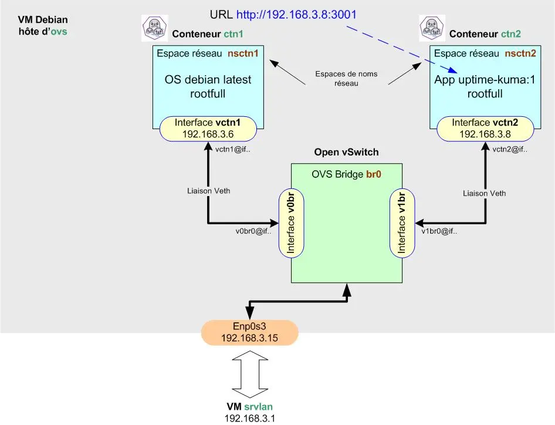

<figure markdown>
  { width="430" }
</figure>

## Mémento 5.2 - Conteneurs LXC

En virtualisation, l’isolation des VM se fait au niveau matériel _(CPU/RAM/Disque ...)_ avec un accès virtuel aux ressources de l'hôte via un hyperviseur tel VirtualBox.  
  
En conteneurisation, l'isolation se fait au niveau de l'OS hôte. Les conteneurs se partagent le noyau de celui-ci et ne prennent pas plus de mémoire que nécessaire.  
  
Cette technique moins exigeante en ressources favorise l'exécution d'applications légères, ces dernières incluant tout le nécessaire pour tourner de manière autonome.

Podman qui est un moteur **L**inu**X** **C**ontainer permet de créer des conteneurs en tant que root _(mode rootfull)_ et en tant qu'utilisateur standard _(mode rootless)_.

<!-- more -->

Le mode rootfull sera privilégié pour des conteneurs devant accéder à des fonctionnalités système avancées : gestion réseau bas niveau, montage de volumes système, ou utilisation de capacités kernel spécifiques.

Le mode rootless offre plus de sécurité car l'utilisateur standard peut créer, exécuter et gérer des conteneurs sans processus nécessitant des privilèges root.

Podman _(POD MANager)_ permet aussi de créer des pods soit des groupes de conteneurs partageant, par exemple, un même réseau IP _(non présenté ici)_.

Podman se pose en concurrent de Docker et est pilotable graphiquement depuis l'outil Cockpit.

### Installation de Podman

Installez le paquet podman et ses dépendances :

```bash
[switch@ovs] sudo apt install podman
```

Contrôlez ensuite le numéro de la version installée :

```bash
[switch@ovs] podman version
```

Retour :

```markdown hl_lines="2"
Client:        Podman Engine
Version:       5.4.2
API Version:   5.4.2
Go Version:    go1.24.4
Built:         Sun Dec 21 17:42:01 2025
Build Origin:  Debian
OS/Arch:       linux/amd64
```

La Cde podman info retournera plus de détails.

Les dossiers et fichiers à suivre se trouvent dans :  
\- /etc/containers/  
\- /home/switch/.local/share/containers/ _(rootless)_  
\- /var/lib/containers/ _(rootfull)_

Vérifiez maintenant l'activation du socket de Podman :

```bash
[switch@ovs] sudo systemctl status podman.socket
```

Si le statut montre inactive (dead) :

```bash
[switch@ovs] sudo systemctl start podman.socket
[switch@ovs] sudo systemctl status podman.socket
```

Si le statut montre active (listening) :

```bash
[switch@ovs] sudo systemctl enable podman.socket 
```

Podman a besoin de cgroup pour fonctionner.

Les cgroups _(Control groups)_ permettent à Podman de limiter et d’isoler l’usage des ressources système _(CPU, mémoire, etc...)_ pour chaque conteneur. Ils assurent aussi un contrôle fin et une répartition équitable des ressources entre conteneurs.

Vérifiez le montage automatique de cgroup version 2 :

```bash
[switch@ovs] mount | grep cgroup
```

Retour :

```markdown
cgroup2 on /sys/fs/cgroup type cgroup2 (rw,nosuid,nodev,noexec,relatime,nsdelegate,memory_recursiveprot)
```

Editez à présent le fichier des dépôts registries.conf :

```bash
[switch@ovs] sudo nano /etc/containers/registries.conf
```

et ajoutez à la fin de celui-ci la ligne suivante :

```bash
unqualified-search-registries = [ 'docker.io']
```

Ceci permettra de contacter automatiquement le registre _(dépôt)_ de Docker lorsque vous exécuterez la Cde podman search ou podman pull.

Pour finir, redémarrez le service socket de Podman :

```bash
[switch@ovs] sudo systemctl restart podman.socket
```

### Conteneurs en mode rootfull

Le raccordement réseau d'un conteneur rootfull fait appel par défaut au paquet netavark qui fournit pour cela un bridge de nom podman.

Mais pour un raccordement sur le bridge br0 d'Open vSwicth, la configuration ci-dessous propose d'exploiter les espaces de noms réseau Linux plutôt que netavark.

#### _- Espaces de noms réseau_

Dans une configuration réseau plus ou moins complexe, le mode rootfull peut s'avérer plus adapté que le mode rootless pour notamment affecter des espaces de noms réseau et des adresses IP aux conteneurs.

Un conteneur joint à un espace de noms réseau peut communiquer avec les autres espaces de noms réseau au travers d'interfaces réseau virtuelles de type Veth.

Vous raccorderez donc les conteneurs ctn1 et ctn2 au bridge br0 d'Open vSwitch comme ceci :

<figure markdown>
  { width="430" }
  <figcaption>Podman : Raccordement des conteneurs sur OVS</figcaption>
</figure>

La création des espaces de noms réseau passera par l'activation d'un service systemd de nom networknamespace qui se chargera de lancer un simple script shell de nom networknamespace.sh.

Commencez par créer le service networknamespace :

```bash
[switch@ovs] sudo nano /etc/systemd/system/networknamespace.service
```

et entrez le contenu suivant :

```markdown
[Unit]
Description=Ajout espaces de noms réseau.
After=networking.service openvswitch-switch.service
Requires=networking.service openvswitch-switch.service
Wants=network-online.target
After=network-online.target

[Service]
Type=oneshot
ExecStart=/bin/bash /root/networknamespace.sh
RemainAfterExit=yes

[Install]
WantedBy=multi-user.target
```

Créez ensuite le script shell networknamespace.sh :

```bash
[switch@ovs] sudo nano /root/networknamespace.sh
```

et entrez le contenu suivant :

```markdown
#!/bin/bash
## Création des espaces de noms réseau pour ctn1/ctn2.
ip netns add nsctn1
ip netns add nsctn2

## Création des paires veth pour nsctn1/nsctn2.
ip link add v0br type veth peer name vctn1
ip link add v1br type veth peer name vctn2

## Raccordement extrémités vctn1/2 côté nsctn1/nsctn2.
ip link set vctn1 netns nsctn1
ip link set vctn2 netns nsctn2

## Activation des extrémités vctn1/2 et lo côté nsctn1/nsctn2.
ip netns exec nsctn1 ip link set lo up
ip netns exec nsctn2 ip link set lo up
ip netns exec nsctn1 ip link set vctn1 up
ip netns exec nsctn2 ip link set vctn2 up

## Ajout adresses IP extrémités vctn1/2 côté nsctn1/nsctn2.
ip netns exec nsctn1 ip addr add 192.168.3.6/24 dev vctn1
ip netns exec nsctn2 ip addr add 192.168.3.8/24 dev vctn2

## Ajout route accès au réseau 192.168.3.0/24.
ip netns exec nsctn1 ip route add default via 192.168.3.15
ip netns exec nsctn2 ip route add default via 192.168.3.15

## Raccordement extrémités v0/1br au bridge OVS br0.
ovs-vsctl add-port br0 v0br
ovs-vsctl add-port br0 v1br

## Activation des extrémités v0/1br côté br0.
ip link set v0br up
ip link set v1br up

## Autorisation de routage IP pour l'accès à Internet.
echo 1 > /proc/sys/net/ipv4/ip_forward

exit 0
```

Rendez le script exécutable :

```bash
[switch@ovs] sudo chmod +x /root/networknamespace.sh
```

Exécutez le service networknamespace pour test :

```bash
[switch@ovs] sudo systemctl daemon-reload
[switch@ovs] sudo systemctl start networknamespace
[switch@ovs] sudo systemctl status networknamespace
[switch@ovs] sudo systemctl enable networknamespace
```

Le statut doit retourner : active (exited)

Vérifiez la création des espaces de noms réseau :

```bash
s[switch@ovs] sudo ls /var/run/netns/
[switch@ovs] ip netns list
```

Retour de la Cde ip netns list :

```markdown
nsctn2 (id: 1)
nsctn1 (id: 0)
```

Vérifiez aussi la création des adresses et routes IP :

```bash
[switch@ovs] sudo ip netns exec nsctn1 ip link
[switch@ovs] sudo ip netns exec nsctn1 ip a
[switch@ovs] sudo ip netns exec nsctn1 ip route
[switch@ovs] sudo ip netns exec nsctn2 ip link
[switch@ovs] sudo ip netns exec nsctn2 ip a
[switch@ovs] sudo ip netns exec nsctn2 ip route
```

Retour de la Cde ip netns exec nsctn1 ip a :

```markdown hl_lines="7 9"
1: lo: <LOOPBACK,UP,LOWER_UP> mtu 65536 qdisc noqueue state UNKNOWN group default qlen 1000
    link/loopback 00:00:00:00:00:00 brd 00:00:00:00:00:00
    inet 127.0.0.1/8 scope host lo
       valid_lft forever preferred_lft forever
    inet6 ::1/128 scope host proto kernel_lo 
       valid_lft forever preferred_lft forever
7: vctn1@if8: <BROADCAST,MULTICAST,UP,LOWER_UP> mtu 1500 qdisc noqueue state UP group default qlen 1000
    link/ether 8a:b0:ae:ad:aa:ed brd ff:ff:ff:ff:ff:ff link-netnsid 0
    inet 192.168.3.6/24 scope global vctn1
       valid_lft forever preferred_lft forever
    inet6 fe80::88b0:aeff:fead:aaed/64 scope link proto kernel_ll 
       valid_lft forever preferred_lft forever
```

Vérifiez le ping depuis la VM ovs sur nsctn1/nsctn2 :

```bash
[switch@ovs] ping 192.168.3.6
[switch@ovs] ping 192.168.3.8
```

Les retours doivent être positifs _(liaisons veth/br0 OK)_.

Vérifiez le ping entre les deux espaces de noms réseau :

```bash
[switch@ovs] sudo nsenter --net=/var/run/netns/nsctn1

[root@ovs] ping 192.168.3.8          # IP de nsctn2
[root@ovs] exit
```

Les retours doivent également être positifs.

Une autre façon de procéder entre les deux espaces :

```bash
[switch@ovs] sudo ip netns exec nsctn1 ping 192.168.3.8     # -> nsctn2
[switch@ovs] sudo ip netns exec nsctn2 ping 192.168.3.6     # -> nsctn1
```

#### _- Images Docker_

!!! note "Nota"

    Podman et Docker sont globalement compatibles car fonctionnant tous les deux avec des images conformes à la norme OCI _(Open Container Initiative)_.

Podman se base sur ce type d'images qu'il est possible de rechercher sur Internet pour créer des conteneurs.

Recherchez la disponibilité des 2 images ci-dessous :

```bash
[switch@ovs] podman search debian
```

Retour :

```markdown hl_lines="2"
NAME                              DESCRIPTION
docker.io/library/debian          Debian is a Linux distribution that's compos...
docker.io/dockette/debian         My Debian Sid | Jessie | Wheezy Base Images
docker.io/corpusops/debian        debian corpusops baseimage
docker.io/rootpublic/debian       
docker.io/treehouses/debian       
...
```

```bash
[switch@ovs] podman search uptime-kuma
```

Retour :

```markdown hl_lines="3"
NAME                                    DESCRIPTION
docker.io/elestio/uptime-kuma           Uptime-kuma, verified and packaged by Elesti...
docker.io/louislam/uptime-kuma          A fancy self-hosted monitoring tool
docker.io/labring/uptime-kuma           
docker.io/juankprz/uptime-kuma          
docker.io/supporttools/uptime-kuma      It is a self-hosted monitoring tool like "Up...
...
```

Téléchargez ensuite l'image de la distribution Debian :

```bash
[switch@ovs] sudo podman pull docker.io/library/debian
```

Retour :

```markdown hl_lines="1"
Trying to pull docker.io/library/debian:latest...
Getting image source signatures
Copying blob 2ca1bfae7ba8 done   | 
Copying config 29d02fa8f9 done   | 
Writing manifest to image destination
29d02fa8f9f4fbf480f9e252f04b053bddf403c826f1ccfb6f7e5dacb4db79ae
```

et l'image de l'application Uptime Kuma :

```bash
[switch@ovs] sudo podman pull docker.io/louislam/uptime-kuma:1
```

Retour :

```markdown hl_lines="1"
Trying to pull docker.io/louislam/uptime-kuma:1...
Getting image source signatures
Copying blob ab019b589bd1 done   | 
Copying blob b338562f40a7 done   | 
Copying blob 874bf4d93720 done   | 
Copying blob b16337721583 done   | 
Copying blob 7d955db85b85 done   | 
Copying blob 2c706596bd17 done   | 
Copying blob 05489cad7e07 done   | 
Copying blob 2da5495de763 done   | 
Copying blob 0009b3591d8d done   | 
Copying blob b5cfa7561d78 done   | 
Copying blob 7607ceb74d22 done   | 
Copying blob 4f4fb700ef54 done   | 
Copying blob ad1253342b11 done   | 
Copying config f48d816cb7 done   | 
Writing manifest to image destination
f48d816cb7460cd3b7bb15ed393968b0ae0da4c690443b778b6a5db6b09f527e
```

L'outil Uptime Kuma fournira de la surveillance réseau.

Vérifiez le résultat des téléchargements :

```bash
[switch@ovs] sudo podman images
```

Retour :

```markdown
REPOSITORY                      TAG         IMAGE ID      CREATED       SIZE
docker.io/library/debian        latest      29d02fa8f9f4  2 weeks ago   124 MB
docker.io/louislam/uptime-kuma  1           f48d816cb746  3 months ago  478 MB
```

Les informations détaillées des images se trouvent sur le site [dockerhub](https://hub.docker.com/){ target="_blank" }.

Les images téléchargées sont stockées dans /var/lib/containers/storage/overlay-images/.

Cde Podman utile :  
Suppression -> sudo podman rmi nom-image

#### _- Conteneur Podman ctn1_

Créez et lancez le conteneur ctn1 comme suit :

```bash
[switch@ovs] sudo podman run -dit --net ns:/var/run/netns/nsctn1 --name ctn1 debian
```

Détail des options -dit et --net :  
Le d lance le conteneur en arrière plan.  
Le i autorise le mode interactif avec le conteneur.  
Le t alloue un pseudo terminal au conteneur.  
Le net ns attache le conteneur à l'espace nsctn1.

Retour :

```markdown
6e85862e5f488f18ecca25fb3231ab84b33be89075267c0bab45732ce61072d7
```

Le conteneur créé est stocké dans /var/lib/containers/storage/overlay-containers/.

Vérifiez la création et le statut du conteneur :

```bash
[switch@ovs] sudo podman ps
```

Retour :

```markdown
CONTAINER ID  IMAGE                            COMMAND     CREATED        STATUS        PORTS       NAMES
6e85862e5f48  docker.io/library/debian:latest  bash        3 minutes ago  Up 3 minutes              ctn1
```

Inspectez par curiosité les informations du conteneur :

```bash
[switch@ovs] sudo podman inspect ctn1 | grep net
[switch@ovs] sudo podman inspect ctn1 | grep Address
```

Cdes Podman utiles :  
Arrêt -> sudo podman stop ou kill nom-conteneur  
Démarrage -> sudo podman start nom-conteneur  
Suppression -> sudo podman rm nom-conteneur

#### _- Conteneur Podman ctn2_

A présent, créez et lancez le conteneur ctn2 :

```bash
[switch@ovs] sudo podman volume create uptime-kuma

[switch@ovs] sudo podman run -dit --net ns:/var/run/netns/nsctn2 --name ctn2 -v uptime-kuma:/app/data uptime-kuma:1
```

Cdes déduites de cette [page](https://hub.docker.com/r/louislam/uptime-kuma){ target="_blank" } du site dockerhub.

Vérifiez le résultat des créations :

```bash
[switch@ovs] sudo podman volume ls
[switch@ovs] sudo podman ps
```

Retours des 2 Cdes :

```markdown
DRIVER      VOLUME NAME
local       uptime-kuma

CONTAINER ID  IMAGE                   COMMAND               CREATED         STATUS      PORTS       NAMES
6e85862e5f48  docker.io/library/...   bash                  47 minutes ago  Up 47 m...              ctn1
1a5aeafb1b71  docker.io/louislam/...  node server/serve...  2 minutes ago   Up 2 m...   3001/tcp    ctn2
```

Le conteneur ctn2 doit être à l'état UP.

Le volume créé est stocké dans /var/lib/containers/storage/volumes/.

Les données persistantes d'Uptime Kuma seront stockées sur le volume créé et resteront disponibles même après une suppression ou une MAJ du conteneur.

Cde Podman utile :  
Suppression -> sudo podman volume rm nom-volume

Vérifiez l'ID de l'espace de noms réseau comme ceci :

```bash
[switch@ovs] sudo podman ps --namespace
```

Retour :

```markdown
CONTAINER ID  NAMES  PID   CGROUPNS    IPC         MNT         NET         PIDNS       USERNS   UTS
6e85862e5f48  ctn1   5233  4026532387  4026532385  4026532383  4026532262  4026532386  4026...  4026...
1a5aeafb1b71  ctn2   5316  4026532392  4026532390  4026532388  4026532321  4026532391  4026...  4026...
```

ou comme ceci :

```bash
[switch@ovs] sudo lsns -t net
```

Retour :

```markdown
         NS TYPE NPROCS   PID USER    NETNSID NSFS              COMMAND
4026531840  net     104     1 root unassigned                   /sbin/init
4026532262  net       1  5233 root          0 /run/netns/nsctn1 bash
4026532321  net       3  5316 root          1 /run/netns/nsctn2 /usr/bin/dumb...
```

#### _- Interaction avec ctn1_

La Cde podman exec est disponible pour cela.

```bash
[switch@ovs] sudo podman exec -it ctn1 bash
```

Un prompt root@ID du conteneur ctn1 doit s'afficher.

Observez ensuite l'arborescence de ctn1 avec la Cde ls :

```bash
[root@6e85862e5f48] ls
```

Retour :

```markdown
bin  boot  dev  etc  home  lib  lib64  media  mnt ...
```

La Cde cat /etc/resolv.conf doit retourner l'IP de la box Internet et les Cdes de mise à jour du conteneur apt update et apt upgrade doivent fonctionner.

La Cde cat /etc/debian_version fournira le numéro de la version Debian téléchargée.

Utilisez la Cde exit pour fermer la connexion en cours.

#### _- Interaction avec ctn2_

Connectez-vous sur ctn2 :

```bash
[switch@ovs] sudo podman exec -it ctn2 bash
```

Un prompt root@ID du conteneur ctn2 doit s'afficher.

Les Cdes apt update et apt upgrade doivent fonctionner.

Début 2026, la Cde cat /etc/debian_version devrait montrer un système Debian 10 (Buster).

Testez enfin depuis le navigateur Firefox de srvlan l'URL `http://192.168.3.8:3001` qui doit retourner la page setup de l'application Uptime Kuma.

### Sauvegardes de ctn1/2 modifiés

!!! note "Nota"

    Les Cdes ip address et ping ne sont pas forcément incluses dans les images debian et uptime-kuma.

Vérifiez le et selon le résultat, exécutez les Cdes ci-dessous.

Si pas de Cde ip address, modifiez le conteneur ctn1 ainsi :

```bash
[switch@ovs] sudo podman exec -it ctn1 bash

[root@6e85862e5f48] apt update
[root@6e85862e5f48] apt install iproute2
[root@6e85862e5f48] ip address
```

La Cde ip address doit retourner l'IP du conteneur.

Si pas de Cde ping, modifiez le conteneur ctn1 ainsi :

```bash
[root@6e85862e5f48] apt install iputils-ping
[root@6e85862e5f48] chmod u+s /bin/ping
[root@6e85862e5f48] setcap cap_net_raw+p /bin/ping
[root@6e85862e5f48] ping 192.168.3.1
```

La Cde ping doit recevoir une réponse positive.

```bash
[root@6e85862e5f48] exit
```

Effectuez la même opération avec le conteneur ctn2.

Sauvegardez ensuite les modifications réalisées en créant deux nouvelles images locales :

```bash
[switch@ovs] sudo podman commit ctn1 debian:1         # latest -> tag 1
[switch@ovs] sudo podman commit ctn2 uptime-kuma:2    # tag 1 -> tag 2
```

Pour finir, vérifiez la création des nouvelles images :

```bash
[switch@ovs] sudo podman images
```

Retour :

```markdown hl_lines="2 3"
REPOSITORY                      TAG         IMAGE ID      CREATED             SIZE
localhost/uptime-kuma           2           1392f4a0391a  About a minute ago  518 MB
localhost/debian                1           9fb26070fc9c  About a minute ago  167 MB
docker.io/library/debian        latest      29d02fa8f9f4  2 weeks ago         124 MB
docker.io/louislam/uptime-kuma  1           f48d816cb746  3 months ago        478 MB
```

### Démarrages auto de ctn1/2

Au préalable, vous allez recréer les conteneurs ctn1/ctn2 à partir des images locales qui intègrent les modifications permettant d'utiliser les Cdes ip address et ping.

Le paramètre -h ajoutera un nom d'hôte personnalisé à chacun des conteneurs.

ctn1 :

```bash
[switch@ovs] sudo podman kill ctn1
[switch@ovs] sudo podman rm ctn1

[switch@ovs] sudo podman run -dit --net ns:/var/run/netns/nsctn1 -h ctn1 --name ctn1 debian:1
```

ctn2 :

```bash
[switch@ovs] sudo podman kill ctn2
[switch@ovs] sudo podman rm ctn2

[switch@ovs] sudo podman run -dit --net ns:/var/run/netns/nsctn2 -h ctn2 --name ctn2 -v uptime-kuma:/app/data uptime-kuma:2
```

Vérifiez ensuite le bon démarrage des 2 conteneurs :

```bash
[switch@ovs] sudo podman ps
```

Retour :

```markdown hl_lines="2 3"
CONTAINER ID  IMAGE                    COMMAND               CREATED        STATUS     PORTS       NAMES
95912bf5fb4c  localhost/debian:1       bash                  4 minutes ago  Up 4 m...              ctn1
4e45a5db52a0  localhost/uptime-kuma:2  node server/serve...  3 minutes ago  Up 3 m...  3001/tcp    ctn2
```

Podman fournit une Cde pour générer le service de démarrage automatique d'un conteneur.

Suivez la séquence de Cdes ci-dessous pour ctn1 :

```bash
[switch@ovs] cd /etc/systemd/system

[switch@ovs] sudo podman generate systemd --new --files --name ctn1
[switch@ovs] cat container-ctn1.service     # Lecture par curiosité

[switch@ovs] sudo systemctl daemon-reload
[switch@ovs] sudo systemctl start container-ctn1
[switch@ovs] sudo systemctl status container-ctn1
[switch@ovs] sudo systemctl enable container-ctn1
```

Effectuez la même séquence de Cdes mais pour ctn2.

Puis rebootez la VM ovs et contrôlez le résultat :

```bash
[switch@ovs] sudo podman ps
```

Les conteneurs ctn1/ctn2 doivent avoir le statut UP.

### Test de pings sur le réseau

Connectez-vous sur le conteneur ctn1 :

```bash
[switch@ovs] sudo podman exec -it ctn1 bash
```

et testez les pings suivants :

```bash
[root@...] ping lemonde.fr        # Internet
[root@...] ping 192.168.2.1       # VM srvsec
[root@...] ping 192.168.4.2       # VM srvdmz
[root@...] ping 192.168.3.4       # VM debian-vm2
```

Tous doivent recevoir une réponse positive.

Pour finir, testez un ping depuis la VM srvsec sur ctn1 :

```bash
[root@srvsec] ping 192.168.3.6    # Conteneur ctn1
```

Si retour OK, la partie 1 est alors terminée.

{ align=left }

&nbsp;  
Voilà, première étape franchie !  
La partie 2 vous attend à présent  
pour la création d'un conteneur  
Podman en mode rootless.

[Partie 2](../posts/podman-debian-lxc-partie-2.md){ .md-button .md-button--primary }
