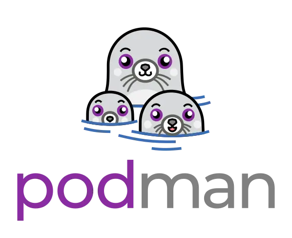
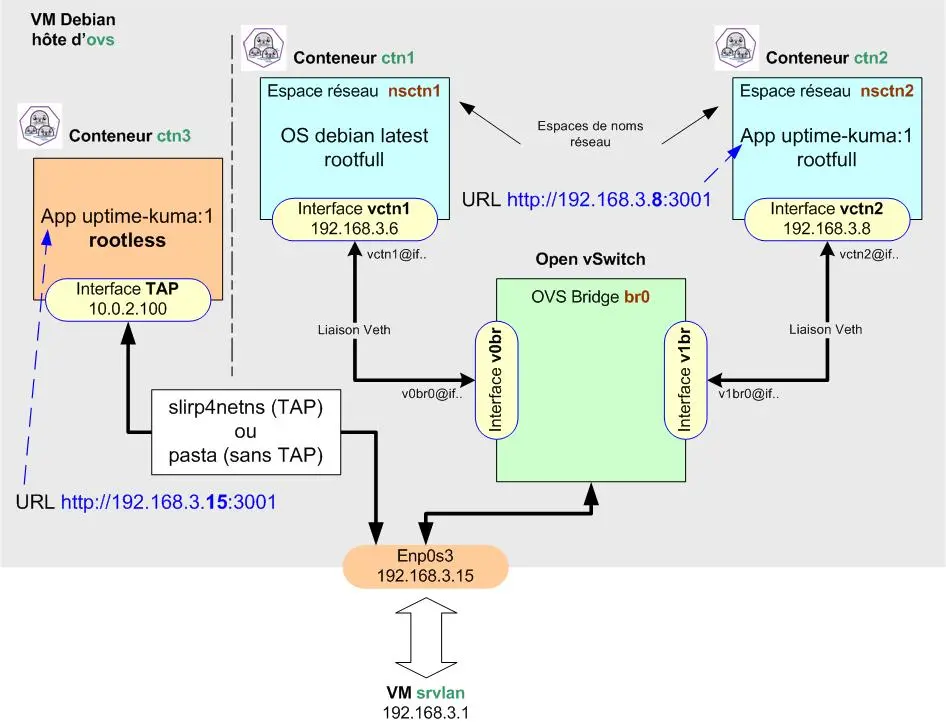

<figure markdown>
  { width="430" }
</figure>

## Mémento 5.2 - Conteneurs LXC

Vous allez à présent créer un conteneur plus sécurisé dit rootless, celui-ci diminuant le risque de voir l'utilisateur root du conteneur obtenir tous les droits sur l'hôte ovs.

Le conteneur rootless _(non privilégié)_ se veut plus isolé de l'hôte qu'un conteneur rootfull.

### Conteneur en mode rootless

Pour le raccordement réseau d'un conteneur rootless, [Podman](https://podman.io/docs){ target="_blank" } peut utiliser par défaut le paquet slirp4netns (interface réseau virtuelle de type TAP) ou le paquet pasta.

Le conteneur rootless ne disposant pas par défaut d'une adresse IP, c'est le mappage de ports qui est utilisé pour joindre celui-ci.

Le conteneur ctn3 sera donc raccordé par défaut ainsi :

<!-- more -->

<figure markdown>
  { width="430" }
  <figcaption>Podman : Raccordement de ctn3 sur l'hôte</figcaption>
</figure>

#### _- Conteneur Podman ctn3_

Les conteneurs rootless peuvent être créés et utilisés sans disposer des privilèges root ni appartenir au groupe sudo.

Ceci renforce la sécurité, car même en cas d’évasion du conteneur, il est impossible d’obtenir des privilèges root sur l’hôte.

En effet, le root à l’intérieur du conteneur n’est qu’un faux root, mappé à un utilisateur non privilégié de l’hôte.

Donc, même si un attaquant parvient à sortir du conteneur, il se retrouve avec les permissions limitées de cet utilisateur non privilégié, Il n’obtient pas les droits root de la machine hôte.

Créez et lancez le conteneur ctn3 comme suit :

```bash
[switch@ovs] podman pull docker.io/louislam/uptime-kuma:1

[switch@ovs] podman volume create uptime-kuma

[switch@ovs] podman run -dit --name ctn3 -p 3001:3001 -v uptime-kuma:/app/data uptime-kuma:1
```

Les données persistantes d'Uptime Kuma seront stockées sur le volume créé et resteront disponibles même après une suppression ou une MAJ du conteneur.

Détail des options -dit et -p :  
Le d lance le conteneur en arrière plan.  
Le i autorise le mode interactif avec le conteneur.  
Le t alloue un pseudo terminal au conteneur.  
Le p mappe le port 3001 d'ovs sur le port 3001 de ctn3.

Vérifiez le téléchargement et les créations :

```bash
[switch@ovs] podman images
[switch@ovs] podman volume ls
[switch@ovs] podman ps
```

Retour de la Cde podman ps :

```markdown
CONTAINER ID  IMAGE                    COMMAND      CREATED    STATUS      PORTS                   NAMES
8c907c35afdf  docker.../uptime-kuma:1  node ser...  22 min...  Up 22 m...  0.0.0.0:3001->3001/tcp  ctn3
```

L'image, le volume et le conteneur se trouvent dans :  
/home/switch/.local/share/containers/storage/*

#### _- Interaction avec ctn3_

Connectez-vous sur ctn3 :

```bash
[switch@ovs] podman exec -it ctn3 bash
```

Retour :

```markdown
root@8c907c35afdf:/app#
```

Un prompt root@ID du conteneur ctn3 doit s'afficher.

Les Cdes apt update et apt upgrade doivent fonctionner.

La Cde cat /etc/debian_version devrait montrer un système Debian 10 _(Buster)_.

La Cde cat /etc/resolv.conf doit retourner l'IP de la box Internet.

Vérifiez depuis le navigateur Firefox de srvlan que l'URL `http://192.168.3.15:3001` affiche bien la page setup de l'application Uptime Kuma.

L'IP de l'URL est celle de l'hôte du conteneur soit ovs.

Ajoutez ensuite le paquet iproute2 au conteneur :

```bash
[root@8c907c35afdf:/app] apt install iproute2
```

et observez la configuration réseau par défaut :

```bash
[root@8c907c35afdf:/app] ip address
```

Retour normal sous Debian 13 :

```markdown hl_lines="7 9"
1: lo: <LOOPBACK,UP,LOWER_UP> mtu 65536 qdisc noqueue state UNKNOWN group default qlen 1000
    link/loopback 00:00:00:00:00:00 brd 00:00:00:00:00:00
    inet 127.0.0.1/8 scope host lo
       valid_lft forever preferred_lft forever
    inet6 ::1/128 scope host 
       valid_lft forever preferred_lft forever
2: br0: <BROADCAST,MULTICAST,UP,LOWER_UP> mtu 65520 qdisc fq_codel state UNKNOWN group default qlen 1000
    link/ether aa:81:fc:1e:ab:01 brd ff:ff:ff:ff:ff:ff
    inet 192.168.3.15/24 brd 192.168.3.255 scope global br0
       valid_lft forever preferred_lft forever
    inet6 fe80::a881:fcff:fe1e:ab01/64 scope link 
       valid_lft forever preferred_lft forever
```

Sous Debian 12, br0 sera remplacé par tap0 et l'IP sera de la forme 10.0.2.x.

Si non installé, ajoutez également le paquet iputils-ping.

Reconnectez-vous sur ctn3 et testez la Cde ping :

```bash
[switch@ovs] podman exec -it ctn3 bash

[root@8c907c35afdf:/app] ping google.fr
```

Retour :

```markdown hl_lines="1 10"
root@846db7da2bad:/app# ping google.fr
PING google.fr (172.217.20.35) 56(84) bytes of data.
64 bytes from arn11s01-in-f3.1e100.net (172.217.20.35): icmp_seq=1 ttl=255 time=22.5 ms
64 bytes from arn11s01-in-f3.1e100.net (172.217.20.35): icmp_seq=2 ttl=255 time=15.2 ms
64 bytes from arn11s01-in-f3.1e100.net (172.217.20.35): icmp_seq=3 ttl=255 time=16.9 ms
64 bytes from arn11s01-in-f3.1e100.net (172.217.20.35): icmp_seq=4 ttl=255 time=18.9 ms
64 bytes from arn11s01-in-f3.1e100.net (172.217.20.35): icmp_seq=5 ttl=255 time=16.1 ms
^C
--- google.fr ping statistics ---
5 packets transmitted, 5 received, 0% packet loss, time 43ms
rtt min/avg/max/mdev = 15.164/17.923/22.540/2.616 ms
```

### Sauvegarde de ctn3 modifié

Sauvegardez les modifications réalisées au niveau du conteneur ctn3 en créant une image locale de l'application Uptime Kuma :

```bash
[switch@ovs] podman commit ctn3 uptime-kuma:2
```

Vérifiez la création de l'image locale :

```bash
[switch@ovs] podman images
```

Retour :

```markdown hl_lines="2"
REPOSITORY                      TAG         IMAGE ID      CREATED         SIZE
localhost/uptime-kuma           2           e760d4475b12  33 seconds ago  518 MB
docker.io/louislam/uptime-kuma  1           f48d816cb746  3 months ago    478 MB
```

et recréez le conteneur ctn3 à partir de celle-ci :

```bash
[switch@ovs] podman kill ctn3
[switch@ovs] podman rm ctn3

[switch@ovs] podman run -dit --name ctn3 -p 3001:3001 -v uptime-kuma:/app/data uptime-kuma:2
```

Vérifiez le démarrage du conteneur :

```bash
[switch@ovs] podman ps
```

Retour :

```markdown hl_lines="2"
CONTAINER ID  IMAGE                    COMMAND       CREATED   STATUS       PORTS                   NAMES
2347acc07914  localhost/uptime-kuma:2  node serv...  2 min...  Up 2 min...  0.0.0.0:3001->3001/tcp  ctn3
```

### Démarrage auto de ctn3

Podman fournit une Cde pour générer le service de démarrage automatique d'un conteneur.

Suivez la séquence de Cdes ci-dessous pour ctn3 :

```bash
[switch@ovs] cd /home/switch

[switch@ovs] sudo loginctl enable-linger switch
[switch@ovs] podman generate systemd --new --files --name ctn3
[switch@ovs] cat container-ctn3.service   # Lecture par curiosité

[switch@ovs] mkdir -p .config/systemd/user
[switch@ovs] mv container-ctn3.service .config/systemd/user/container-ctn3.service

[switch@ovs] podman stop ctn3

[switch@ovs] systemctl --user daemon-reload
[switch@ovs] systemctl --user start container-ctn3
[switch@ovs] systemctl --user status container-ctn3
[switch@ovs] systemctl --user enable container-ctn3
```

Puis rebootez la VM ovs et contrôlez le résultat :

```bash
[switch@ovs] podman ps
```

Le conteneur ctn3 doit avoir le statut UP.

### Test de pings sur le réseau

Connectez-vous sur le conteneur ctn3 :

```bash
[switch@ovs] podman exec -it ctn3 bash
```

et testez les pings suivants :

```bash
[root@...] ping lemonde.fr      # Internet
[root@...] ping 192.168.2.1     # VM srvsec
[root@...] ping 192.168.4.2     # VM srvdmz
[root@...] ping 192.168.3.4     # VM debian-vm2
```

Tous doivent recevoir une réponse positive.

Testez de nouveau depuis srvlan l'URL d'accès à Uptime Kuma soit `http://192.168.3.15:3001`.

Si la page setup s'affiche, alors c'est terminé.

{ align=left }

&nbsp;  
Voilà pour les bases de Podman !  
Le mémento 6.1 vous attend pour  
découvrir l'accès à distance sur  
les VM et les conteneurs.

[Mémento 6.1](../posts/controle-distant-debian.md){ .md-button .md-button--primary }
