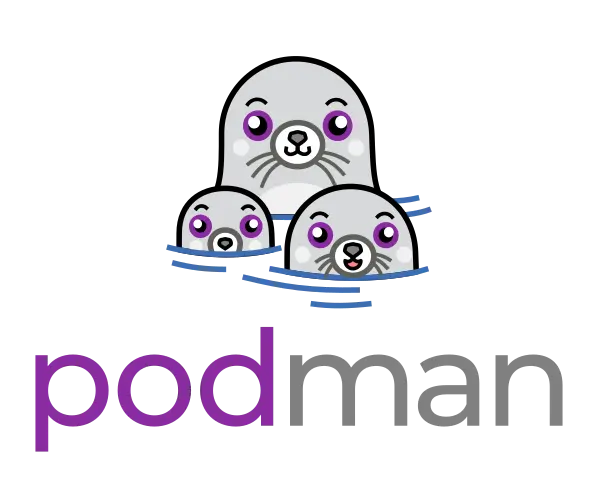
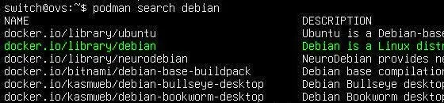

<figure markdown>
  { width="430" }
</figure>

## Mémento 5.2 - Conteneurs LXC

En virtualisation, l’isolation des VM se fait au niveau matériel _(CPU/RAM/Disque ...)_ avec un accès virtuel aux ressources de l'hôte via un hyperviseur tel VirtualBox.  
  
En conteneurisation, l'isolation se fait au niveau de l'OS hôte. Les conteneurs se partagent le noyau de celui-ci et ne prennent pas plus de mémoire que nécessaire.  
  
Cette technique moins exigeante en ressources favorise l'exécution d'applications légères, ces dernières incluant tout le nécessaire pour tourner de manière autonome.

Podman qui est un moteur LinuX Container permet de créer des conteneurs en tant que root _(mode rootfull)_ et en tant qu'utilisateur standard _(mode rootless)_.

<!-- more -->

Le mode rootless offre plus de sécurité car l'utilisateur standard peut créer, exécuter et gérer des conteneurs sans processus nécessitant des privilèges root.

Podman _(POD MANager)_ permet aussi de créer des pods soit des groupes de conteneurs partageant, par exemple, un même réseau IP _(non présenté ici)_.

Podman se pose en concurrent de Docker et est pilotable graphiquement depuis l'outil Cockpit.

### Installation de Podman

Installez le paquet podman et ses dépendances :

```bash
[switch@ovs:~$] sudo apt install podman
```

Contrôlez ensuite le numéro de la version installée :

```bash
[switch@ovs:~$] podman version
```

Retour :

```markdown
Client:       Podman Engine
Version:      4.3.1
API Version:  4.3.1
Go Version:   go1.19.8
Built:        Thu Jan 1 01:00:00 1970
OS/Arch:      linux/amd64
```

La Cde podman info retournera plus de détails.

Les dossiers et fichiers à suivre se trouvent dans :  
/etc/containers/  
/home/switch/.local/share/containers/ _(rootless)_  
/var/lib/containers/ _(rootfull)_

Vérifiez maintenant l'activation du socket de Podman :

```bash
[switch@ovs:~$] sudo systemctl status podman.socket 
[switch@ovs:~$] sudo systemctl is-enabled podman.socket
```

Retours attendus : active(listening) et enabled.

Podman a besoin de cgroup pour fonctionner.

Control groups _(cgroup)_ est une fonctionnalité du noyau Linux pour limiter, compter et isoler l'utilisation des ressources _(processeur, mémoire, disque, etc...)_.

Vérifiez le montage automatique de cgroup version 2 :

```bash
[switch@ovs:~$] mount | grep cgroup
```

Retour :

```markdown
cgroup2 on /sys/fs/cgroup type cgroup2 (rw,nosuid...)
```

Editez à présent le fichier des dépôts registries.conf :

```bash
[switch@ovs:~$] sudo nano /etc/containers/registries.conf
```

et ajoutez à la fin de celui-ci la ligne suivante :

```bash
unqualified-search-registries = [ 'docker.io']
```

Ceci permettra de contacter automatiquement le registre _(dépôt)_ de Docker, lorsque vous exécuterez la Cde podman search ou podman pull.

Pour finir, redémarrez le service socket de Podman :

```bash
[switch@ovs:~$] sudo systemctl restart podman.socket
```

### Conteneurs en mode rootfull

Le raccordement réseau d'un conteneur rootfull fait appel par défaut au paquet netavark qui fournit pour cela un bridge de nom podman.

Mais pour un raccordement sur le bridge br0 d'Open vSwicth, la configuration ci-dessous propose d'exploiter les espaces de noms réseau Linux plutôt que netavark.

#### _- Espaces de noms réseau_

Dans une configuration réseau plus ou moins complexe, le mode rootfull peut s'avérer plus adapté que le mode rootless pour notamment affecter des espaces de noms réseau et des adresses IP aux conteneurs.

Un conteneur joint à un espace de noms réseau peut communiquer avec les autres espaces de noms réseau au travers d'interfaces réseau virtuelles de type Veth.

Vous raccorderez donc les conteneurs ctn1 et ctn2 au bridge br0 d'Open vSwitch comme ceci :

<figure markdown>
  { width="430" }
  <figcaption>Podman : Raccordement des conteneurs sur OVS</figcaption>
</figure>

La création des espaces de noms réseau passera par l'activation d'un service systemd qui se chargera de lancer un simple script shell.

Commencez par créer le service networknamespace :

!!! Warning "Attention"

    La plupart des Cdes ci-dessous nécessitent l'utilisation de _sudo_.

```bash
sudo nano /etc/systemd/system/networknamespace.service
```

et entrez le contenu suivant :

```bash
[Unit]
Description=Ajout espaces de noms réseau.
Wants=network-online.target
After=network-online.target

[Service]
Type=simple
ExecStart=/bin/bash /root/networknamespace.sh

[Install]
WantedBy=multi-user.target
```

Créez ensuite le script shell networknamespace.sh :

```bash
sudo nano /root/networknamespace.sh
```

et entrez le contenu suivant :

```bash
#!/bin/bash
## Création des espaces de noms réseau pour ctn1/ctn2.
ip netns add nsctn1
ip netns add nsctn2

## Création des paires veth pour nsctn1/nsctn2.
ip link add v0br type veth peer name vctn1
ip link add v1br type veth peer name vctn2

## Raccordement extrémités vctn1/2 côté nsctn1/nsctn2.
ip link set vctn1 netns nsctn1
ip link set vctn2 netns nsctn2

## Activation des extrémités vctn1/2 et lo côté nsctn1/nsctn2.
ip netns exec nsctn1 ip link set lo up
ip netns exec nsctn2 ip link set lo up
ip netns exec nsctn1 ip link set vctn1 up
ip netns exec nsctn2 ip link set vctn2 up

## Ajout adresses IP extrémités vctn1/2 côté nsctn1/nsctn2.
ip netns exec nsctn1 ip addr add 192.168.3.6/24 dev vctn1
ip netns exec nsctn2 ip addr add 192.168.3.8/24 dev vctn2

## Ajout route accès au réseau 192.168.3.0/24.
ip netns exec nsctn1 ip route add default via 192.168.3.15
ip netns exec nsctn2 ip route add default via 192.168.3.15

## Raccordement extrémités v0/1br au bridge OVS br0.
ovs-vsctl add-port br0 v0br
ovs-vsctl add-port br0 v1br

## Activation des extrémités v0/1br côté br0.
ip link set v0br up
ip link set v1br up

## Autorisation de routage IP pour l'accès à Internet.
echo 1 > /proc/sys/net/ipv4/ip_forward

exit 0
```

Rendez le script exécutable :

```bash
sudo chmod +x /root/networknamespace.sh
```

Exécutez le service networknamespace pour test :

```bash
sudo systemctl daemon-reload
sudo systemctl start networknamespace
sudo systemctl status networknamespace (normal=dead)
sudo systemctl enable networknamespace
```

Vérifiez la création des espaces de noms réseau :

```bash
sudo ls /var/run/netns/
ip netns list
```

Retour de la Cde ip netns list :

```markdown
nsctn2 (id: 1)
nsctn1 (id: 0)
```

Vérifiez aussi la création des adresses et routes IP :

```bash
sudo ip netns exec nsctn1 ip link
sudo ip netns exec nsctn1 ip a
sudo ip netns exec nsctn1 ip route
sudo ip netns exec nsctn2 ip link
sudo ip netns exec nsctn2 ip a
sudo ip netns exec nsctn2 ip route
```

Retour de la Cde ip netns exec nsctn1 ip a :

<figure markdown>
  
  <figcaption>Podman : Espace de nom réseau nsctn1 : Interface veth UP</figcaption>
</figure>

Vérifiez le ping depuis la VM ovs sur nsctn1/nsctn2 :

```bash
ping 192.168.3.6
ping 192.168.3.8
```

Les retours doivent être positifs _(liaisons veth/br0 OK)_.

Vérifiez le ping entre les deux espaces de noms réseau :

```bash
sudo nsenter --net=/var/run/netns/nsctn1

[root@ovs:~#] ping 192.168.3.8          # IP de nsctn2
[root@ovs:~#] exit
```

Les retours doivent également être positifs.

Une autre façon de procéder entre les deux espaces :

```bash
sudo ip netns exec nsctn1 ping 192.168.3.8     # -> nsctn2
sudo ip netns exec nsctn2 ping 192.168.3.6     # -> nsctn1
```

#### _- Images Docker_

!!! note "Nota"

    Podman et Docker sont globalement compatibles car fonctionnant tous les deux avec des images conformes à la norme OCI _(Open Container Initiative)_.

Podman se base sur ce type d'images qu'il est possible de rechercher sur Internet pour créer des conteneurs.

Recherchez la disponibilité des 2 images ci-dessous :

```bash
podman search debian
```

<figure markdown>
  
  <figcaption>Podman : Image debian sur docker.io</figcaption>
</figure>

```bash
podman search uptime-kuma
```

<figure markdown>
  
  <figcaption>Podman : Image uptime-kuma sur docker.io</figcaption>
</figure>

Téléchargez ensuite l'image de la distribution Debian :

```bash
sudo podman pull docker.io/library/debian
```

<figure markdown>
  
  <figcaption>Podman : Pull de l'image debian</figcaption>
</figure>

et l'image de l'application Uptime Kuma :

```bash
sudo podman pull docker.io/louislam/uptime-kuma:1
```

<figure markdown>
  
  <figcaption>Podman : Pull de l'image uptime-kuma de Tag 1</figcaption>
</figure>

L'outil Uptime Kuma fournira de la surveillance réseau.

Vérifiez le résultat des téléchargements :

<figure markdown>
  
  <figcaption>Podman : Liste des images téléchargées</figcaption>
</figure>

Les informations détaillées des images se trouvent sur le site [dockerhub](https://hub.docker.com/){ target="_blank" }.

Les images téléchargées sont stockées dans /var/lib/containers/storage/overlay-images/.

Cde Podman utile :  
Suppression -> sudo podman rmi nom-image

#### _- Conteneur Podman ctn1_

Créez et lancez le conteneur ctn1 comme suit :

```bash
sudo podman run -dit --net ns:/var/run/netns/nsctn1 --name ctn1 debian
```

Détail des options -dit et --net :  
Le d lance le conteneur en arrière plan.  
Le i autorise le mode interactif avec le conteneur.  
Le t alloue un pseudo terminal au conteneur.  
Le net ns attache le conteneur à l'espace nsctn1.

<figure markdown>
  
  <figcaption>Podman : Création du conteneur ctn1</figcaption>
</figure>

Le conteneur créé est stocké dans /var/lib/containers/storage/overlay-containers/.

Vérifiez la création et le statut du conteneur :

```bash
sudo podman ps
```

<figure markdown>
  
  <figcaption>Podman : Conteneur ctn1 créé et démarré</figcaption>
</figure>

Inspectez par curiosité les informations du conteneur :

```bash
sudo podman inspect ctn1 | grep net
sudo podman inspect ctn1 | grep Address
```

Cdes Podman utiles :  
Arrêt -> sudo podman stop ou kill nom-conteneur  
Démarrage -> sudo podman start nom-conteneur  
Suppression -> sudo podman rm nom-conteneur

#### _- Conteneur Podman ctn2_

A présent, créez et lancez le conteneur ctn2 :

```bash
sudo podman volume create uptime-kuma

sudo podman run -dit --net ns:/var/run/netns/nsctn2 --name ctn2 -v uptime-kuma:/app/data uptime-kuma:1
```

Cdes déduites de cette [page](https://hub.docker.com/r/louislam/uptime-kuma){ target="_blank" } du site dockerhub.

Vérifiez le résultat des créations :

```bash
sudo podman volume ls
sudo podman ps
```

<figure markdown>
  
  <figcaption>Podman : Conteneur ctn2 créé et démarré</figcaption>
</figure>

Le conteneur ctn2 doit être à l'état UP.

Le volume créé est stocké dans /var/lib/containers/storage/volumes/.

Les données persistantes d'Uptime Kuma seront stockées sur le volume créé et resteront disponibles même après une suppression ou une MAJ du conteneur.

Cdes Podman utiles :  
Suppression -> sudo podman volume rm nom-volume

Vérifiez l'ID de l'espace de noms réseau comme ceci :

```bash
sudo podman ps --namespace
```

Retour :

```markdown
CONTAINER ID NAMES PID  CGROUPNS   ... NET        ..      
4e84e08e79f5 ctn1  1144 4026532389 ... 4026532388 ..
215292d920df ctn2  1200 4026532394 ... 4026532393 ..
```

ou comme ceci :

```bash
sudo lsns -t net
```

Retour :

```markdown
        NS ...  PID USER ... NSFS              ...
4026532388 ... 1144 root ... /run/netns/nsctn1 ...
4026532393 ... 1200 root ... /run/netns/nsctn2 ...
```

#### _- Interactions avec ctn1/ctn2_

La Cde podman exec est disponible pour cela.

Commencez par tester celle-ci sur ctn1 :

```bash
sudo podman exec -it ctn1 bash
```

Un prompt root@ID du conteneur ctn1:/# doit s'afficher.

Observez ensuite l'arborescence de ctn1 avec la Cde ls :

```bash
[root@4e84e08e79f5:/#] ls
```

<figure markdown>
  
  <figcaption>Podman : Arborescence du conteneur ctn1</figcaption>
</figure>

La Cde cat /etc/resolv.conf doit retourner l'IP de la box Internet et les Cdes de mise à jour du conteneur apt update et apt upgrade doivent fonctionner.

Utilisez la Cde exit pour fermer la connexion en cours.

Testez ensuite les 4 Cdes ci-dessus avec ctn2.

Testez également depuis le navigateur Firefox de srvlan l'URL `http://192.168.3.8:3001` qui doit retourner la page setup de l'application Uptime Kuma.

### Ajout de paquets sur ctn1/ctn2

!!! note "Nota"

    Les Cdes ip address et ping ne sont pas incluses dans les images debian et uptime-kuma.

Pour corriger cela, modifiez le conteneur ctn1 ainsi :

```bash
sudo podman exec -it ctn1 bash

[root@4e84e08e79f5:/#] apt update
[root@4e84e08e79f5:/#] apt install iproute2
[root@4e84e08e79f5:/#] ip address
```

La Cde ip address doit retourner l'IP du conteneur.

```bash
[root@4e84e08e79f5:/#] apt install iputils-ping
[root@4e84e08e79f5:/#] chmod u+s /bin/ping
[root@4e84e08e79f5:/#] setcap cap_net_raw+p /bin/ping
[root@4e84e08e79f5:/#]  ping 192.168.3.1
```

La Cde ping doit recevoir une réponse positive.

```bash
[root@4e84e08e79f5:/#]  exit
```

Effectuez la même opération avec le conteneur ctn2.

Sauvegardez ensuite les modifications réalisées en créant deux nouvelles images locales :

```bash
sudo podman commit ctn1 debian:1             # latest -> tag 1
sudo podman commit ctn2 uptime-kuma:2  # tag 1 -> tag 2
```

Pour finir, vérifiez la création des nouvelles images :

```bash
sudo podman images
```

<figure markdown>
  
  <figcaption>Podman : Affichage des 2 nouvelles images locales</figcaption>
</figure>

### Démarrage auto de ctn1/ctn2

Au préalable, recréez les conteneurs ctn1/ctn2 à partir des images locales qui intègrent les modifications permettant d'utiliser les Cdes ip address et ping.

ctn1 :

```bash
sudo podman kill ctn1
sudo podman rm ctn1

sudo podman run -dit --net ns:/var/run/netns/nsctn1 --name ctn1 debian:1
```

ctn2 :

```bash
sudo podman kill ctn2
sudo podman rm ctn2

sudo podman run -dit --net ns:/var/run/netns/nsctn2 --name ctn2 -v uptime-kuma:/app/data uptime-kuma:2
```

Vérifiez ensuite le bon démarrage des 2 conteneurs :

```bash
sudo podman ps
```

<figure markdown>
  
  <figcaption>Podman : Conteneurs issus des nouvelles images</figcaption>
</figure>

Podman fournit une Cde pour générer le service de démarrage automatique d'un conteneur.

Suivez la séquence de Cdes ci-dessous pour ctn1 :

```bash
cd /etc/systemd/system

sudo podman generate systemd --new --files --name ctn1
cat container-ctn1.service              # Lecture par curiosité

sudo systemctl daemon-reload
sudo systemctl start container-ctn1
sudo systemctl status container-ctn1
sudo systemctl enable container-ctn1
```

Effectuez la même séquence de Cdes mais pour ctn2.

Puis rebootez la VM ovs et contrôlez le résultat :

```bash
sudo podman ps
```

Les conteneurs ctn1/ctn2 doivent avoir le statut UP.

### Test de pings sur le réseau

Connectez-vous sur le conteneur ctn1 :

```bash
sudo podman exec -it ctn1 bash
```

et testez les pings suivants :

```bash
[root@... :/#] ping lemonde.fr           # Internet
[root@... :/#] ping 192.168.2.1         # VM srvsec
[root@... :/#] ping 192.168.4.2         # VM srvdmz
[root@... :/#] ping 192.168.3.4         # VM debian12-vm2
```

Tous doivent recevoir une réponse positive.

Pour finir, testez un ping depuis la VM srvsec sur ctn1 :

```bash
[root@srvsec:~#] ping 192.168.3.6              # Conteneur ctn1
```

Si retour OK, la partie 1 est alors terminée.

{ align=left }

&nbsp;  
Voilà, première étape franchie !  
La partie 2 vous attend à présent  
pour la création d'un conteneur  
Podman en mode rootless.

[Partie 2](../posts/podman-debian12-lxc-partie-2.md){ .md-button .md-button--primary }
