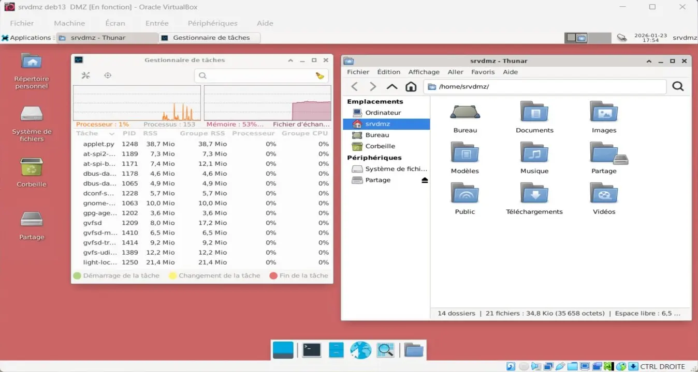
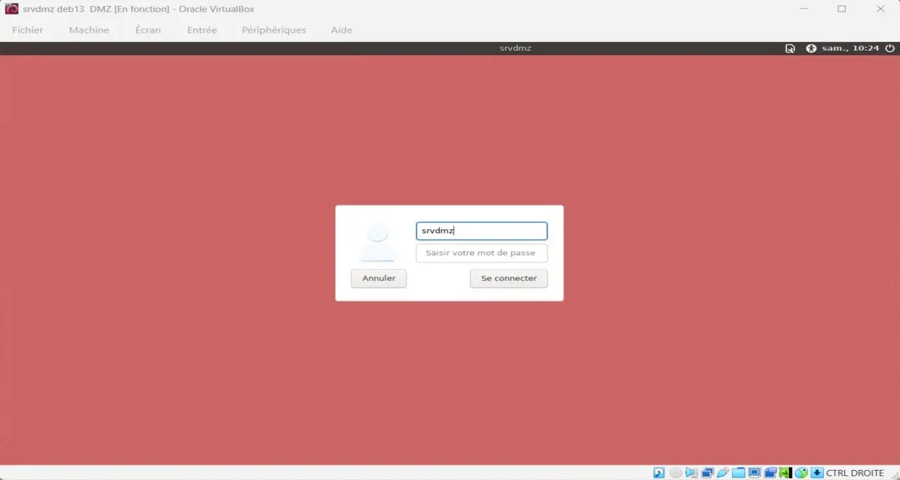
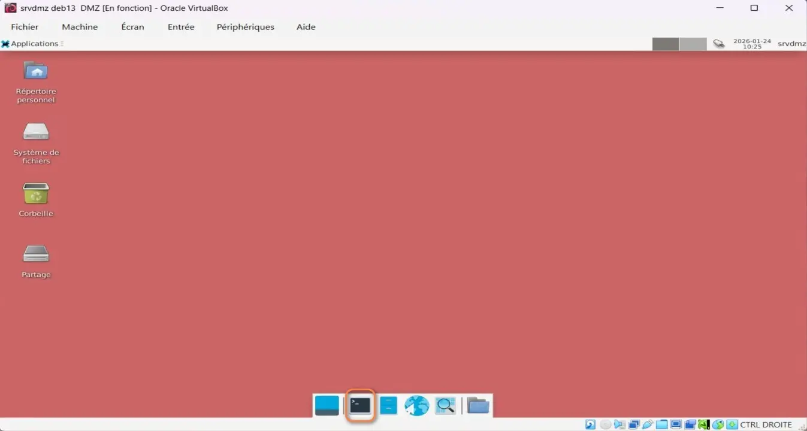

<figure markdown>
  { width="430" }
</figure>

## Mémento 3.1 - Serveur srvdmz

IPFire étant installé, vous allez à présent créer le serveur srvdmz que vous placerez en zone dite démilitarisée et qui fournira plus tard des services tels que le HTTP, FTP, Mail, etc... pour Internet et le réseau local.

La configuration sera identique à celle de la VM srvlan hormis la partie réseau.

### Construction de la VM

L'utilisation de VirtualBox est considérée acquise.

A défaut, référez-vous aux mémentos suivants :  
[VirtualBox - Installation](../posts/virtualbox-installation.md){ target="_blank" }

[VirtualBox - Mode d’accès réseau par pont](../posts/virtualbox-pont-reseau.md){ target="_blank" }

#### _- Création et configuration_

Le PC hôte doit être un PC 64 bits, courant de nos jours.

Téléchargez l'ISO debian-z.x.y-amd64\-netinst.iso :  
[https://cdimage.debian.org/.../current/amd64/iso-cd/](https://cdimage.debian.org/debian-cd/current/amd64/iso-cd/){ target="_blank" }

<!-- more -->

\- Démarrez ensuite l'application VirtualBox 7.2.x, puis :  
\- - Menu de VirtualBox -> Machine -> Nouvelle...

Selon la version de l'hyperviseur, l'interface est en franglais.  
\-> Virtual machine name and operating system  
\-> VM Name : srvdmz DMZ  
\-> VM Folder : Sélectionnez le dossier de stockage des VM  
\-> ISO Image : Sélectionnez l'ISO téléchargée ci-dessus  
\-> Décochez : Proceed with Unattended Installation _(important)_  
\-> OS : Linux -> OS Distribution : Debian  
\-> OS Version : Debian _(64-bit)_

\-> Specify virtual hardware  
\-> Base Memory : 1024 MB  
\-> Number of CPUs : 2 CPU si possible

\-> Specify virtual hard disk  
\-> Create a Virtual Hard Disk : Ajustez à 12 Go

\-> Bouton Finish

La VM créée s'affiche dans le panneau gauche de VirtualBox.

\- Sélectionnez maintenant la nouvelle VM, puis :  
\- - Clic droit -> Configuration...  
\- - - Onglet Général  
\-> Features -> Shared Clipboard -> Bidirectionnel

\- - - Onglet System  
\-> Carte mère -> Boot Device Order -> Décochez Disquette  
\-> Processeur -> Cochez PAE/NX

\- - - Onglet Affichage  
\-> Ecran -> Video Memory -> Ajustez à 128 MB

Facultatif, accès au dossier partagé par le PC hôte :  
\- - - Onglet Shared Folders  
\-> Cliquez sur l'icône + _(Ajoute un dossier partagé.)_  
\-> Folder Path -> Sélectionnez Autre...  
\-> Accédez à votre dossier -> Ex : C:\Partage-Windows  
\-> Sélectionner un dossier ou Ouvrir -> OK -> OK

Les autres paramètres peuvent rester inchangés.

#### _- Installation de Debian_

Conseil pratique avant de démarrer la nouvelle VM :  
Si le curseur de la souris disparaît lors d'un clic dans la fenêtre de la VM, celui-ci peut être récupéré par le PC hôte à l'aide de la touche CTRL située à droite de la barre d'espace du clavier.

\- Sélectionnez la VM, puis :  
\-> Clic droit -> Démarrer  
\-> Start with GUI _(La VM s'exécute)_

Sélectionnez Graphical Install et appliquez ce qui suit :  
\- Language -> Français  
\- Pays _(territoire ou région)_ \-> France  
\- Disposition de clavier à utiliser -> Français  
\- Nom de machine -> srvdmz  
\- Domaine -> Laissez le champ vide  
\- MDP du super utilisateur root -> Votre MDP pour root  
\- Confirmation du MDP > Votre MDP pour root  
\- Nom complet du nouvel utilisateur -> Ex: srvdmz  
\- Identifiant pour le compte utilisateur -> srvdmz  
\- MDP pour le nouvel utilisateur -> Votre MDP pour srvdmz  
\- Confirmation du MDP -> Votre MDP pour srvdmz  
\- Méthode de partitionnement -> Assisté - utili... entier  
\- Disque à partitionner -> Celui proposé de 12 Go  
\- Schéma de partitionnement -> Tout ... seule partition  
\- Table des partitions -> Terminer le partitionnement ..  
\- Faut-il appliquer les changements ... disques ? -> Oui

L'installation commence :  
\- Faut-il analyser d'autres supports ... ? -> Non  
\- Pays du miroir de l'archive Debian -> France  
\- Miroir de l'archive Debian -> deb.debian.org  
\- Mandataire HTTP (lais...) -> Laissez vide

L'installation continue :  
\- Souhaitez-vous participer à l'étude statistique ... -> Non  
\- Logiciels à installer  
\-> Décochez environnement de bureau Debian  
\-> Décochez ... GNOME  
\-> Cochez ... Xfce  
\-> Décochez serveur SSH  
\-> Conservez utilitaires usuels du système

L'installation se termine :  
\- Installer ... de démarrage GRUB sur le disque ... -> Oui  
\- Périphérique ... programme de démarrage -> /dev/sda  
\- Installation terminée -> Continuer _(sans retrait du CD)_

Le système reboot et une fenêtre de connexion s'ouvre :

<figure markdown>
  { width="430" }
  <figcaption>Fenêtre de connexion Xfce</figcaption>
</figure>

\-> Premier champ -> Entrez l'utilisateur srvdmz  
\-> Second champ -> Entrez Votre MDP pour srvdmz  
\-> Bouton Se connecter

Le bureau Xfce s'ouvre :

<figure markdown>
  { width="430" }
  <figcaption>Bureau Xfce</figcaption>
</figure>

Ouvrez le terminal de Cdes en cliquant sur son icône située en bas à l'intérieur du dock.

Autorisez ensuite l'usage de la Cde sudo à l'utilisateur srvdmz :

```bash
[srvdmz@srvdmz] su root
Mot de passe : Votre MDP root

[root@srvdmz] sudo usermod -aG sudo srvdmz
[root@srvdmz] exit
```

et redémarrez le serveur :  
\- - Menu Applications de Xfce situé en haut à gauche  
\-> Déconnexion _(Une fenêtre s'ouvre)_  
\-> Bouton Redémarrer

Reconnectez-vous ensuite en tant qu'utilisateur srvdmz et rouvrez le terminal de Cdes.

### Ajout des utilitaires VirtualBox

Ils permettront entre autres le copier/coller et l'accès au dossier partagé par le PC hôte.

Notez la version courante du noyau linux :

```bash
[srvdmz@srvdmz] uname -r
```

Exemple de retour :

```markdown
6.12.63+deb13-amd64
```

Installez ensuite les 2 paquets Linux suivants :

```bash
[srvdmz@srvdmz] sudo apt install dkms build-essential
```

et vérifiez l'installation du paquet linux-headers dépendant de la version du noyau Linux :

```bash
[srvdmz@srvdmz] sudo apt list *linux-headers-6.12.63*
```

Si non installé, exécutez la Cde suivante :

```bash
[srvdmz@srvdmz] sudo apt install linux-headers-6.12.63+deb13-amd64
```

Accédez au menu VirtualBox situé sur la fenêtre de la VM :  
\-> Périphériques -> Insérer l'image CD des Additions invité...

puis, montez l'image CD, installez les utilitaires et rebootez :

```bash
[srvdmz@srvdmz] sudo mount /dev/cdrom /media/cdrom
[srvdmz@srvdmz] cd /media/cdrom
[srvdmz@srvdmz] sudo ./VBoxLinuxAdditions.run
[srvdmz@srvdmz] sudo reboot
```

Une fois fini, reconnectez-vous, la fenêtre de la VM peut à présent être redimensionnée avec la souris. Sa nouvelle taille sera enregistrée au sein de srvdmz.

Le copier/coller entre le PC hôte et srvdmz doit maintenant fonctionner dans les 2 sens.

Sans fermer la VM, retirez l'image CD du lecteur virtuel :  
\- - Menu de VirtualBox -> Machine -> Configuration...  
\- - - Onglet Stockage  
\-> Zone Périphériques -> Sélectionnez VBoxGuest...  
\-> Zone Attributs -> Cliquez sur l'icône CD  
\-> Remove Disk From Virtual Drive -> OK

### Suppression d'applications ...

Supprimez Libre Office non utiles sur srvdmz :

```bash
[srvdmz@srvdmz] sudo apt autoremove --purge \
libreoffice-writer libreoffice-impress \
libreoffice-calc libreoffice-math \
libreoffice-draw libreoffice-base-core \
libreoffice-core libreoffice-common
```

Si le dossier /etc/libreoffice reste présent :

```bash
[srvdmz@srvdmz] sudo rm -r /etc/libreoffice
```

Supprimez ces applications multimédia :

```bash
[srvdmz@srvdmz] sudo apt autoremove --purge \
exfalso quodlibet
```

et mettez si nécessaire le navigateur Firefox en français :

```bash
[srvdmz@srvdmz] sudo apt install firefox-esr-l10n-fr
```

La configuration de base est presque terminée :

<figure markdown>
  { width="430" }
  <figcaption>Debian : Bureau Xfce personnalisé</figcaption>
</figure>

La consommation mémoire est d'environ 500 Mo.

Pour un même fond d'écran sur la fenêtre de login Lightdm et le bureau Xfce, procédez ainsi :

```bash
[srvdmz@srvdmz] cd /chemin-image/fond.jpg   # Votre fond d'écran
[srvdmz@srvdmz] sudo cp fond.jpg /usr/share/backgrounds/
[srvdmz@srvdmz] cd /etc/lightdm
[srvdmz@srvdmz] sudo nano lightdm-gtk-greeter.conf
```

Remplacez la ligne #background= par celle-ci :

```markdown
background=/usr/share/backgrounds/fond.jpg
```

### Contenu partagé par le PC hôte

Créez le dossier qui permettra d'afficher le contenu partagé par le PC hôte :

```bash
[srvdmz@srvdmz] mkdir /home/srvdmz/Partage
```

Créez ensuite le fichier de service home-srvdmz-Partage.mount :

```bash
[srvdmz@srvdmz] cd /etc/systemd/system
[srvdmz@srvdmz] sudo touch home-srvdmz-Partage.mount
```

Editez celui-ci :

```bash
[srvdmz@srvdmz] sudo nano home-srvdmz-Partage.mount
```

et entrez le contenu suivant :

```markdown
[Unit]
Description = Montage dossier partagé fourni par VirtualBox

[Mount]
What = Entrez le nom du dossier partagé par le PC hôte
Where = /home/srvdmz/Partage
Type = vboxsf
Options=rw,uid=srvdmz,gid=srvdmz

[Install]
WantedBy = multi-user.target
```

Exemple pour What : What=Partage-win11

Intégrez le service dans la configuration de Systemd :

```bash
[srvdmz@srvdmz] sudo systemctl daemon-reload
```

et démarrez celui-ci :

```bash
[srvdmz@srvdmz] sudo systemctl start home-srvdmz-Partage.mount
```

Vérifiez ensuite son statut :

```bash
[srvdmz@srvdmz] sudo systemctl status home-srvdmz-Partage.mount
```

Touche q pour quitter le résultat affiché.

Si statut = active, autorisez le service au boot de la VM :

```bash
[srvdmz@srvdmz] sudo systemctl enable home-srvdmz-Partage.mount
```

Un lien symbolique vers le service est créé.

Ouvrez enfin le gestionnaire de fichiers thunar et observez le contenu de /home/srvdmz/Partage.

### Configuration du réseau

Avant, vérifiez l'IP courante avec la Cde ip address :

```bash
[srvdmz@srvdmz] ip address
```

Résultat, IP 10.0.2.15, IP fournie par VirtualBox :

```markdown hl_lines="10"
1: lo: <LOOPBACK,UP,LOWER_UP> mtu 65536 qdisc noqueue state UNKNOWN group default qlen 1000
    link/loopback 00:00:00:00:00:00 brd 00:00:00:00:00:00
    inet 127.0.0.1/8 scope host lo
       valid_lft forever preferred_lft forever
    inet6 ::1/128 scope host noprefixroute 
       valid_lft forever preferred_lft forever
2: enp0s3: <BROADCAST,MULTICAST,UP,LOWER_UP> mtu 1500 qdisc fq_codel state UP group default qlen 1000
    link/ether 08:00:27:4b:6a:e1 brd ff:ff:ff:ff:ff:ff
    altname enx0800274b6ae1
    inet 10.0.2.15/24 brd 10.0.2.255 scope global dynamic noprefixroute enp0s3
       valid_lft 83683sec preferred_lft 83683sec
    inet6 fd17:625c:f037:2:54c:94a5:20e:b4ce/64 scope global temporary dynamic 
       valid_lft 86343sec preferred_lft 14343sec
    inet6 fd17:625c:f037:2:a00:27ff:fe4b:6ae1/64 scope global dynamic mngtmpaddr noprefixroute 
       valid_lft 86343sec preferred_lft 14343sec
    inet6 fe80::a00:27ff:fe4b:6ae1/64 scope link noprefixroute 
       valid_lft forever preferred_lft forever
```

La VM srvdmz étant prévue en zone DMZ, il faut changer le mode d'accès réseau de sa carte réseau enp0s3.

Pour cela, sélectionnez la VM srvdmz dans VirtualBox :  
\- - Menu de VirtualBox -> Machine -> Configuration...  
\- - - Onglet Réseau  
\-> Adapter 1 -> Attached to -> Réseau interne  
\-> OK

#### _- IP carte réseau enp0s3_

Configurez à présent une IP fixe sur la carte enp0s3 :  
\- - Bureau Xfce, barre du haut  
\-> Clic droit sur l'icône Réseau située à droite  
\-> Sélectionnez Modifier les connexions...  
  
Une fenêtre Connexions réseau s'ouvre :  
\-> Sélectionnez la connexion Wired connection 1  
\-> Cliquez sur l'icône roue dentée de la fenêtre  
  
Une fenêtre Modification de ... s'ouvre :  
\-> Nom de la connexion -> Entrez Connexion carte 1  
  
\- - - Onglet Ethernet  
\-> Périphérique -> Sélectionnez enp0s3  
  
\- - - Onglet Paramètres IPv4  
\-> Méthode -> Sélectionnez Manuel -> Bouton Ajouter  
\-> Champ Adresse : Entrez 192.168.4.2  
\-> Champ Masque de réseau : Entrez 255.255.255.0  
\-> Champ Passerelle : Entrez 192.168.4.1  
\-> Serveurs DNS -> Entrez l'IP locale de votre Box Internet  
\-> Bouton Enregistrer  
  
Fermez ensuite la fenêtre Connexions réseau.

Redémarrez le service réseau NetworkManager :

```bash
[srvdmz@srvdmz] sudo systemctl restart NetworkManager
```

Vérifiez par prudence la bonne configuration du réseau :

```bash
[srvdmz@srvdmz] ip address
[srvdmz@srvdmz] nmcli      # Cde NetworkManager
```

Retour de la Cde nmcli :

```markdown hl_lines="5"
enp0s3: connecté à Connexion carte 1
        "Intel 82540EM"
        ethernet (e1000), 08:00:27:4B:6A:E1, hw, mtu 1500
        ip4 par défaut
        inet4 192.168.4.2/24
        route4 default via 192.168.4.1 metric 100
        route4 192.168.4.0/24 metric 100
        inet6 fd17:625c:f037:2:54c:94a5:20e:b4ce/64
        inet6 fd17:625c:f037:2:a00:27ff:fe4b:6ae1/64
        inet6 fe80::a00:27ff:fe4b:6ae1/64
        route6 fe80::/64 metric 1024
        route6 fd17:625c:f037:2::/64 metric 100
        route6 default via fe80::2 metric 100

lo: connecté (en externe) à lo
        "lo"
        loopback (unknown), 00:00:00:00:00:00, sw, mtu 65536
        inet4 127.0.0.1/8
        inet6 ::1/128

DNS configuration:
        servers: 192.168.x.z
        interface: enp0s3

Utilisez « nmcli device show » pour obtenir des informations complètes sur les périphériques connus ...

Consultez les pages de manuel nmcli(1) et nmcli-examples(7) pour les détails complets d'utilisation.
```

Les fichiers configurés avec networkmanager sont ici :  
/etc/NetworkManager/system-connections/

!!! note "Nota"

    La VM srvdmz accède à Internet si la VM srvsec est démarrée.

Par curiosité, listez la table de routage avec la Cde ip r :

```markdown
default via 192.168.4.1 dev enp0s3 proto static metric 100 
192.168.4.0/24 dev enp0s3 proto kernel scope link src 192.168.4.2 metric 100
```

{ align=left }

&nbsp;  
Bien !  
Les serveurs sont prêts. Le mémento  
4.1 vous attend pour la création des  
VM clientes du réseau local virtuel.

[Mémento 4.1](../posts/clients-debian-vm1-vm2-creation.md){ .md-button .md-button--primary }
