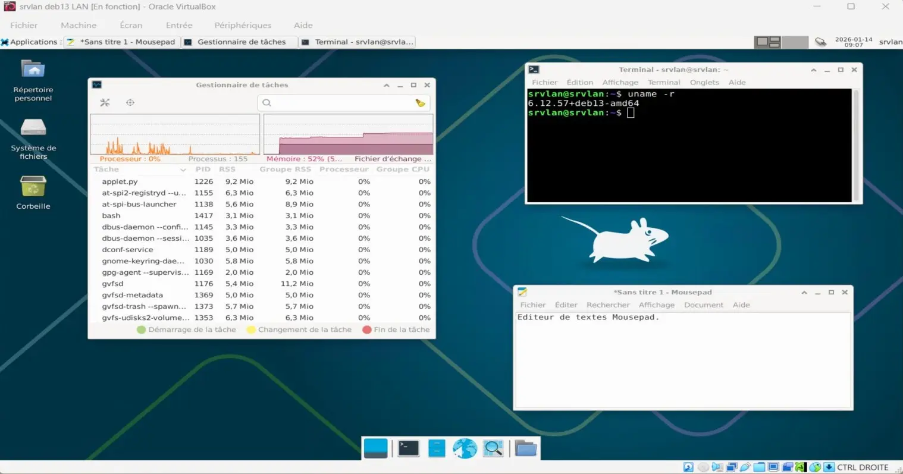
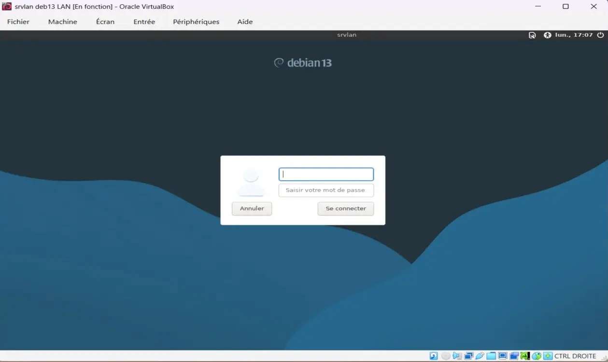
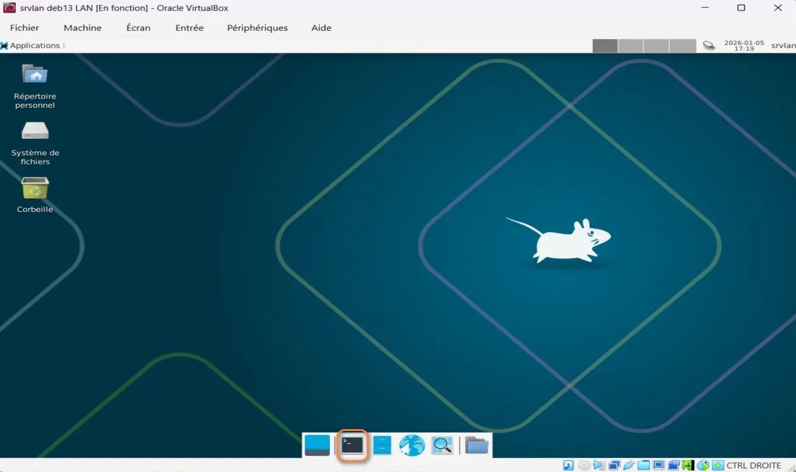

<figure markdown>
  { width="430" }
</figure>

## Mémento 1.1 - Serveur srvlan

Le serveur supportera le bureau Xfce4 facilitant ainsi la gestion de celui-ci pour les utilisateurs qui préfèrent une interface graphique plutôt que la ligne de commande pure.

Xfce4 est un environnement de bureau léger, qui consommera peu de ressources système _(mémoire RAM, CPU)_.

Ce dernier, allégé de quelques applications préinstallées par défaut, contribuera au confort d'exploitation du serveur et facilitera notamment la réalisation de certains tests sur le réseau.

Par souci d'homogénéité, Xfce4 sera l'unique bureau graphique installé sur les VM du réseau.

<!-- more -->

### Construction de la VM

L'utilisation de l'hyperviseur VirtualBox est considérée acquise.

A défaut, référez-vous aux mémentos suivants :  
[VirtualBox - Installation](../posts/virtualbox-installation.md){ target="_blank" }

[VirtualBox - Mode d’accès réseau par pont](../posts/virtualbox-pont-reseau.md){ target="_blank" }

#### _- Création et configuration_

Le PC hôte doit être un PC 64 bits, courant de nos jours.

Téléchargez l'ISO debian-z.x.y-amd64\-netinst.iso :  
[https://cdimage.debian.org/.../current/amd64/iso-cd/](https://cdimage.debian.org/debian-cd/current/amd64/iso-cd/){ target="_blank" }

Démarrez ensuite l'application VirtualBox 7.2.x, puis :  
\- - Menu de VirtualBox _(icône home)_ -> Machine -> Nouvelle...

Selon la version de l'hyperviseur, l'interface est en franglais.  
\-> Virtual machine name and operating system  
\-> VM Name : srvlan LAN  
\-> VM Folder : Sélectionnez un dossier où stocker vos VM  
\-> ISO Image : Sélectionnez l'ISO téléchargée ci-dessus  
\-> Décochez : Proceed with Unattended Installation _(important)_  
\-> OS : Linux -> OS Distribution : Debian  
\-> OS Version : Debian _(64-bit)_

\-> Specify virtual hardware  
\-> Base Memory : 1024 MB  
\-> Number of CPUs : 2 CPU si possible

\-> Specify virtual hard disk  
\-> Create a Virtual Hard Disk : Ajustez à 12 Go

\-> Bouton Finish

La VM créée s'affiche dans le panneau gauche de VirtualBox.

Sélectionnez maintenant la nouvelle VM, puis :  
\- - Clic droit -> Configuration...  
\- - - Onglet Général  
\-> Features -> Shared Clipboard -> Bidirectionnel
  
\- - - Onglet System  
\-> Carte mère -> Boot Device Order -> Décochez Disquette  
\-> Processeur -> Cochez PAE/NX

Le PAE/NX permet d'étendre la gestion de la mémoire physique au-delà de 4 Go tout en activant la protection contre l'exécution de code malveillant en mémoire non exécutable.

\- - - Onglet Affichage
\-> Ecran -> Video Memory -> Ajustez à 128 MB
  
Facultatif, accès au dossier partagé par le PC hôte :  
\- - - Onglet Shared Folders  
\-> Cliquez sur l'icône + _(Ajouter un dossier partagé)_  
\-> Folder Path -> Sélectionnez Autre...  
\-> Accédez à votre dossier -> Ex : C:\Partage-Windows  
\-> Sélectionner un dossier ou Ouvrir -> OK -> OK

Les autres paramètres peuvent rester inchangés.

#### _- Installation de Debian_

Conseil pratique avant de démarrer :  
Si le curseur de la souris disparaît lors d'un clic dans la fenêtre de la VM, celui-ci peut être récupéré par le PC hôte à l'aide de la touche CTRL située à droite de la barre d'espace du clavier.

\- Sélectionnez la VM, puis :  
\-> Clic droit -> Démarrer  
\-> Start with GUI _(La VM s'exécute)_

Sélectionnez Graphical Install et appliquez ce qui suit :  
\- Language -> Français  
\- Pays _(territoire ou région)_ \-> France  
\- Disposition de clavier à utiliser -> Français  
\- Nom de machine -> srvlan  
\- Domaine -> Laissez le champ vide  
\- MDP du super utilisateur root -> Votre MDP pour root  
\- Confirmation du MDP -> Votre MDP pour root  
\- Nom complet du nouvel utilisateur -> Ex: srvlan  
\- Identifiant pour le compte utilisateur -> srvlan  
\- MDP pour le nouvel utilisateur -> Votre MDP pour srvlan  
\- Confirmation du MDP -> Votre MDP srvlan  
\- Méthode de partitionnement -> Assisté - utili... entier  
\- Disque à partitionner -> Celui proposé de 12 Go  
\- Schéma de partitionnement -> Tout ... seule partition  
\- Table des partitions -> Terminer le partitionnement ..  
\- Faut-il appliquer les changements ... disques ? -> Oui

L'installation commence :  
\- Faut-il analyser d'autres supports ... ? -> Non  
\- Pays du miroir de l'archive Debian -> France  
\- Miroir de l'archive Debian -> deb.debian.org  
\- Mandataire HTTP (lais...) -> Laissez vide

L'installation continue :  
\- Souhaitez-vous participer à l'étude statistique ... -> Non  
\- Logiciels à installer  
\-> Décochez environnement de bureau Debian  
\-> Décochez ... GNOME  
\-> Cochez ... Xfce  
\-> Décochez serveur SSH  
\-> Conservez utilitaires usuels du système

L'installation se termine :  
\- Installer ... de démarrage GRUB sur le disque ... -> Oui  
\- Périphérique ... programme de démarrage -> /dev/sda  
\- Installation terminée -> Continuer _(sans retrait du CD)_

Le système reboot et une fenêtre de connexion s'ouvre :

<figure markdown>
  { width="430" }
  <figcaption>Fenêtre de connexion Xfce</figcaption>
</figure>

\-> Premier champ -> Entrez l'utilisateur srvlan  
\-> Second champ -> Entrez Votre MDP pour srvlan  
\-> Bouton Se connecter

Le bureau Xfce s'ouvre :

<figure markdown>
  { width="430" }
  <figcaption>Bureau Xfce</figcaption>
</figure>

Ouvrez le terminal de Cdes en cliquant sur son icône située en bas à l'intérieur du dock.

Autorisez l'usage de sudo à l'utilisateur srvlan :

```bash
[srvlan@srvlan] su root
Mot de passe : Votre MDP root

[root@srvlan] sudo usermod -aG sudo srvlan
[root@srvlan] exit
```

et redémarrez le serveur :  
\- - Menu Applications de Xfce situé en haut à gauche  
\-> Déconnexion _(Une fenêtre s'ouvre)_  
\-> Bouton Redémarrer

Reconnectez-vous ensuite en tant qu'utilisateur srvlan et rouvrez le terminal de Cdes.

### Ajout des utilitaires VirtualBox

Ils permettront entre autres le copier/coller et l'accès au dossier partagé par le PC hôte.

Notez la version courante du noyau linux :

```bash
[srvlan@srvlan] uname -r
```

Exemple de retour :

```markdown
6.12.57+deb13-amd64
```

Installez ensuite les 2 paquets suivants :

```bash
[srvlan@srvlan] sudo apt install dkms build-essential
```

et vérifiez l'installation du paquet linux-headers dépendant de la version du noyau Linux :

```bash
[srvlan@srvlan] sudo apt list *linux-headers-6.12.57*
```

Si non installé, exécutez la Cde suivante :

```bash
[srvlan@srvlan] sudo apt install linux-headers-6.12.57+deb13-amd64
```

Accédez au menu VirtualBox situé sur la fenêtre de la VM :  
\-> Périphériques -> Insérer l'image CD des Additions invité...

Puis, montez l'image CD, installez les utilitaires et rebootez :

```bash
[srvlan@srvlan] sudo mount /dev/cdrom /media/cdrom
[srvlan@srvlan] cd /media/cdrom
[srvlan@srvlan] sudo ./VBoxLinuxAdditions.run
[srvlan@srvlan] sudo reboot
```

Une fois fini, reconnectez-vous, la fenêtre de la VM peut à présent être redimensionnée avec la souris. Sa nouvelle taille sera enregistrée au sein de srvlan.

Le pratique copier/coller entre le PC hôte et srvlan doit maintenant fonctionner dans les 2 sens.

Sans fermer la VM, retirez l'image CD du lecteur virtuel :  
\- - Menu de VirtualBox -> Machine -> Configuration...  
\- - - Onglet Stockage  
\-> Zone Périphériques -> Sélectionnez VBoxGuest...  
\-> Zone Attributs -> Cliquez sur l'icône CD  
\-> Remove Disk From Virtual Drive -> OK

### Suppression d'applications ...

Supprimez LibreOffice non utile sur srvlan :

```bash
[srvlan@srvlan] sudo apt autoremove --purge \
libreoffice-writer libreoffice-impress \
libreoffice-calc libreoffice-math \
libreoffice-draw libreoffice-base-core \
libreoffice-core libreoffice-common
```

Si le dossier /etc/libreoffice reste présent :

```bash
[srvlan@srvlan] sudo rm -r /etc/libreoffice
```

Supprimez ces applications multimédia :

```bash
[srvlan@srvlan] sudo apt autoremove --purge \
exfalso quodlibet
```

et mettez si nécessaire le navigateur Firefox en français :

```bash
[srvlan@srvlan] sudo apt install firefox-esr-l10n-fr
```

La configuration de base est presque terminée :

<figure markdown>
  { width="430" }
  <figcaption>Debian : Bureau Xfce personnalisé</figcaption>
</figure>

La consommation mémoire est d'environ 500 Mo.

Pour un même fond d'écran sur la fenêtre de login Lightdm et le bureau Xfce, procédez ainsi :

```bash
[srvlan@srvlan] cd /chemin-image/fond.jpg   # Votre fond d'écran
[srvlan@srvlan] sudo cp fond.jpg /usr/share/backgrounds/
[srvlan@srvlan] cd /etc/lightdm
[srvlan@srvlan] sudo nano lightdm-gtk-greeter.conf
```

Remplacez la ligne #background= par celle-ci :

```markdown
background=/usr/share/backgrounds/fond.jpg
```

### Contenu partagé par le PC hôte

Créez le dossier qui permettra d'afficher le contenu partagé par le PC hôte :

```bash
[srvlan@srvlan] mkdir /home/srvlan/Partage
```

Créez ensuite le fichier de service home-srvlan-Partage.mount :

```bash
[srvlan@srvlan] cd /etc/systemd/system
[srvlan@srvlan] sudo touch home-srvlan-Partage.mount
```

Editez celui-ci :

```bash
[srvlan@srvlan] sudo nano home-srvlan-Partage.mount
```

et entrez le contenu suivant :

```markdown
[Unit]
Description = Montage dossier partagé fourni par VirtualBox

[Mount]
What = Entrez le nom du dossier partagé par le PC hôte
Where = /home/srvlan/Partage
Type = vboxsf
Options=rw,uid=srvlan,gid=srvlan

[Install]
WantedBy = multi-user.target
```

Exemple pour What : What=Partage-win11

Intégrez le service dans la configuration de systemd :

```bash
[srvlan@srvlan] sudo systemctl daemon-reload
```

et démarrez celui-ci :

```bash
[srvlan@srvlan] sudo systemctl start home-srvlan-Partage.mount
```

Vérifiez ensuite son statut :

```bash
[srvlan@srvlan] sudo systemctl status home-srvlan-Partage.mount
```

Touche q pour quitter le résultat affiché.

Si statut = active, autorisez le service au boot de la VM :

```bash
[srvlan@srvlan] sudo systemctl enable home-srvlan-Partage.mount
```

Un lien symbolique vers le service est créé.

Ouvrez enfin le gestionnaire de fichiers thunar et observez le contenu de /home/srvlan/Partage.

### Configuration du réseau

Avant, vérifiez l'IP courante avec la Cde ip address :

```bash
[srvlan@srvlan] ip address
```

Résultat, IP 10.0.2.15, IP fournie par VirtualBox :

```markdown hl_lines="10"
1: lo: <LOOPBACK,UP,LOWER_UP> mtu 65536 qdisc noqueue state UNKNOWN group default qlen 1000
    link/loopback 00:00:00:00:00:00 brd 00:00:00:00:00:00
    inet 127.0.0.1/8 scope host lo
       valid_lft forever preferred_lft forever
    inet6 ::1/128 scope host noprefixroute 
       valid_lft forever preferred_lft forever
2: enp0s3: <BROADCAST,MULTICAST,UP,LOWER_UP> mtu 1500 qdisc fq_codel state UP group default qlen 1000
    link/ether 08:00:27:db:15:ed brd ff:ff:ff:ff:ff:ff
    altname enx080027db15ed
    inet 10.0.2.15/24 brd 10.0.2.255 scope global dynamic noprefixroute enp0s3
       valid_lft 54591sec preferred_lft 54591sec
    inet6 fd17:625c:f037:2:2e42:ebb:136:e26d/64 scope global temporary dynamic 
       valid_lft 86015sec preferred_lft 14015sec
    inet6 fd17:625c:f037:2:a00:27ff:fedb:15ed/64 scope global dynamic mngtmpaddr noprefixroute 
       valid_lft 86015sec preferred_lft 14015sec
    inet6 fe80::a00:27ff:fedb:15ed/64 scope link noprefixroute 
       valid_lft forever preferred_lft forever
```

Puis installez les 2 paquets suivants :

```bash
[srvlan@srvlan] sudo apt install netfilter-persistent
```

```bash
[srvlan@srvlan] sudo apt install iptables-persistent
```

Une fenêtre Config... iptables-persistent s'ouvre :  
\-> Faut-il enregistrer les règles IPv4 actuelles ? -> Oui  
\-> Faut-il enregistrer les règles IPv6 actuelles ? -> Oui

2 fichiers rules.v4/v6 ont été créés dans /etc/iptables/.

Netfilter-persistent et iptables-persistent permettront de sauvegarder et restaurer automatiquement les règles de filtrage réseau _(iptables)_ au démarrage du système. Ils assureront la persistance des règles de pare-feu entre les redémarrages.

La VM srvlan étant prévue en zone LAN, il faut changer le mode d'accès réseau de sa carte réseau enp0s3.

Pour cela, sélectionnez la VM srvlan dans VirtualBox :  
\- - Menu de VirtualBox -> Machine -> Configuration...  
\- - - Onglet Réseau  
\-> Adapter 1 -> Attached to -> Réseau interne  
\-> OK

#### _- IP carte réseau enp0s3_

Configurez à présent une IP fixe sur la carte enp0s3 :  
\- - Bureau Xfce, barre du haut  
\-> Clic droit sur l'icône Réseau située à droite  
\-> Sélectionnez Modifier les connexions...  
  
Une fenêtre Connexions réseau s'ouvre :  
\-> Sélectionnez la connexion Wired connection 1  
\-> Cliquez sur l'icône roue dentée de la fenêtre  
  
Une fenêtre Modification de ... s'ouvre :  
\-> Nom de la connexion -> Entrez Connexion carte 1  
  
\- - - Onglet Ethernet  
\-> Périphérique -> Sélectionnez enp0s3  
  
\- - - Onglet Paramètres IPv4  
\-> Méthode -> Sélectionnez Manuel -> Bouton Ajouter  
\-> Champ Adresse : Entrez 192.168.2.2  
\-> Champ Masque de réseau : Entrez 255.255.255.0  
\-> Champ Passerelle : Entrez 192.168.2.1  
\-> Serveurs DNS -> Entrez l'IP locale de votre Box Internet  
\-> Bouton Enregistrer  
  
Fermez ensuite la fenêtre Connexions réseau.  

Pour finir, stoppez la VM srvlan :  
\- - Menu Applications de Xfce situé en haut à gauche  
\-> Déconnexion -> Une fenêtre s'ouvre  
\-> Bouton Eteindre

#### _- Ajout d'une carte enp0s8_

Le raccordement de la VM srvlan nécessite de créer une seconde carte réseau sur celle-ci.

Pour cela, sélectionnez la VM srvlan dans VirtualBox :  
\- - Menu de VirtualBox -> Machine -> Configuration...  
\- - - Onglet Réseau  
\-> Adapter 2 -> Cochez Activer l'interface réseau  
\-> Attached to -> Sélectionnez Réseau interne  
\-> OK

Redémarrez la VM srvlan.

Configurez également une IP fixe sur cette carte réseau :  
\- - Bureau Xfce, barre du haut  
\-> Clic droit sur l'icône Réseau située à droite  
\-> Sélectionnez Modifier les connexions...  
  
Une fenêtre Connexions réseau s'ouvre :  
\-> Sélectionnez la nouvelle connexion affichée  
\-> Cliquez sur l'icône roue dentée de la fenêtre  
  
Une fenêtre Modification de ... s'ouvre :  
\-> Nom de la connexion -> Entrez Connexion carte 2  
  
\- - - Onglet Ethernet  
\-> Périphérique -> Sélectionnez enp0s8  
  
\- - - Onglet Paramètres IPv4  
\-> Méthode -> Sélectionnez Manuel -> Bouton Ajouter  
\-> Champ Adresse : Entrez 192.168.3.1  
\-> Champ Masque de réseau : Entrez 255.255.255.0  
\-> Bouton Enregistrer  
  
Fermez ensuite la fenêtre Connexions réseau.

Redémarrez srvlan et vérifiez la configuration réseau :

```bash
[srvlan@srvlan] ip address
[srvlan@srvlan] nmcli
```

Retour de la Cde nmcli de NetworkManager :

```markdown  hl_lines="5 14"
enp0s3: connecté à Connexion carte 1
        "Intel 82540EM"
        ethernet (e1000), 08:00:27:DB:15:ED, hw, mtu 1500
        ip4 par défaut
        inet4 192.168.2.2/24
        route4 default via 192.168.2.1 metric 100
        route4 192.168.2.0/24 metric 100
        inet6 fe80::796f:9640:9cfd:7703/64
        route6 fe80::/64 metric 1024

enp0s8: connecté à Connexion carte 2
        "Intel 82540EM"
        ethernet (e1000), 08:00:27:0B:2F:89, hw, mtu 1500
        inet4 192.168.3.1/24
        route4 192.168.3.0/24 metric 101
        inet6 fe80::f3:16b3:fdad:a30c/64
        route6 fe80::/64 metric 1024

lo: connecté (en externe) à lo
        "lo"
        loopback (unknown), 00:00:00:00:00:00, sw, mtu 65536
        inet4 127.0.0.1/8
        inet6 ::1/128

DNS configuration:
        servers: 192.168.x.z
        interface: enp0s3
```

Les fichiers configurés avec NetworkManager sont ici :  
/etc/NetworkManager/system-connections/

!!! note "Nota"
    La VM srvlan n'accède plus à Internet, la VM suivante permettra de retrouver cet accès.

#### _- Activation du routage_

L'activation du routage avec la Cde ip\_forward permettra, selon les règles définies dans la table de routage du serveur, le renvoi de paquets de données arrivés par une interface réseau vers une autre interface réseau.

**Debian 12**, pour l'activez, éditez le fichier sysctl.conf :

```bash
[srvlan@srvlan] sudo nano /etc/sysctl.conf
```

et retirez le # de la ligne #net.ipv4.ip\_forward=1.

**Debian 13**, pour l'activer, procédez ainsi :

```bash
[srvlan@srvlan] cd /etc/sysctl.d
[srvlan@srvlan] sudo nano 99-ipforward.conf
```

Le service **systemd-sysctl** appliquera les paramètres réseau définis dans les fichiers du dossier sysctl.d.

Entrez le contenu suivant :

```markdown
net.ipv4.ip_forward = 1
```

Rechargez la configuration et vérifiez le résultat :

```bash
[srvlan@srvlan] sudo sysctl --system
[srvlan@srvlan] sudo sysctl net.ipv4.ip_forward
```

Relancez ensuite le service réseau :

```bash
[srvlan@srvlan] sudo systemctl restart NetworkManager
```

#### _- Translation d'adresses NAT_

\-- Définition de WIKIBOOKS --
Objectif du NAT _(Network Address Translation)_ :  
Faire que les PC d'un réseau interne n'apparaissent que sous l'identifiant d'une seule IP pour les réseaux externes _(c'est un masquage ou IP Masquerading)_.

Votre box Internet _(passerelle)_ fait du NAT entre votre réseau privé et le réseau Internet et de ce fait votre fournisseur d'accès _(FAI)_ ne vous donne qu'une seule IP alors que vous pouvez très bien avoir plusieurs PC connectés à Internet à partir de votre réseau local.

Le NAT répond principalement au manque d'adresses IP dans le plan d'adressage IPv4 pour l'accès à Internet.

Il permet également de s'affranchir de la gestion des tables de routage et fonctionne avec le service iptables installé par défaut avec Debian.

Vérifiez l'état courant du NAT ou IP Masquerading :

```bash
[srvlan@srvlan] sudo iptables -L -t nat
```

Résultat, NAT inactif, pas de target MASQUERADE :

```markdown
srvlan@srvlan:~$ sudo iptables -L -t nat
Chain PREROUTING (policy ACCEPT)
target     prot opt source               destination         

Chain INPUT (policy ACCEPT)
target     prot opt source               destination         

Chain OUTPUT (policy ACCEPT)
target     prot opt source               destination         

Chain POSTROUTING (policy ACCEPT)
target     prot opt source               destination
srvlan@srvlan:~$
```

Activez celui-ci en utilisant une règle iptables :

```bash
[srvlan@srvlan] sudo iptables -t nat -A POSTROUTING -o enp0s3 -j MASQUERADE
```

et affichez de nouveau le contenu de la table NAT :

```bash
[srvlan@srvlan] sudo iptables -L -t nat
```

Résultat, le NAT est actif :

```markdown hl_lines="13"
srvlan@srvlan:~$ sudo iptables -L -t nat
Chain PREROUTING (policy ACCEPT)
target     prot opt source               destination         

Chain INPUT (policy ACCEPT)
target     prot opt source               destination         

Chain OUTPUT (policy ACCEPT)
target     prot opt source               destination         

Chain POSTROUTING (policy ACCEPT)
target     prot opt source               destination         
MASQUERADE  all  --  anywhere             anywhere
srvlan@srvlan:~$  
```

Effectuez une sauvegarde de la règle iptables :

```bash
[srvlan@srvlan] su root
[root@srvlan] sudo iptables-save > /etc/iptables/rules.v4
[root@srvlan] exit
```

et déclarez celle-ci persistente :

```bash
[srvlan@srvlan] sudo systemctl enable netfilter-persistent
[srvlan@srvlan] sudo systemctl restart netfilter-persistent
```

Elle sera ainsi activée à chaque boot du système Debian.

Par curiosité, listez la table de routage avec la Cde ip r :

```markdown
srvlan@srvlan:~$ ip r
default via 192.168.2.1 dev enp0s3 proto static metric 100 
192.168.2.0/24 dev enp0s3 proto kernel scope link src 192.168.2.2 metric 100 
192.168.3.0/24 dev enp0s8 proto kernel scope link src 192.168.3.1 metric 101
srvlan@srvlan:~$
```

{ align=left }

&nbsp;  
Bravo !  
Le serveur srvlan est prêt.  
Le mémento 2.1 vous attend pour  
l'ajout du serveur srvsec _(IPFire)_.

[Mémento 2.1](../posts/serveur-ipfire-srvsec-creation.md){ .md-button .md-button--primary }
