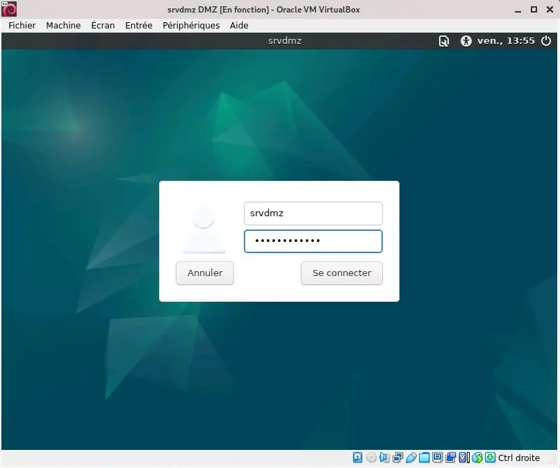
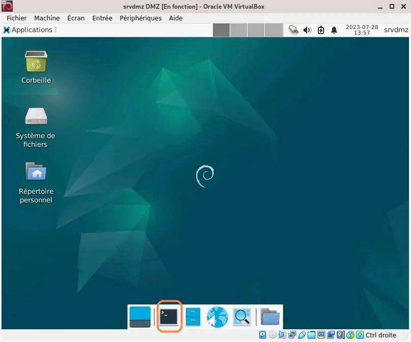
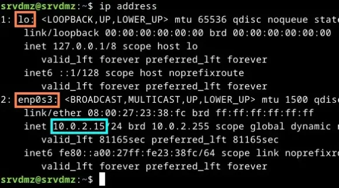

<figure markdown>
  { width="430" }
</figure>

## Mémento 3.1 - Serveur srvdmz

IPFire étant installé, vous allez à présent créer le serveur srvdmz que vous placerez en zone dite démilitarisée et qui fournira plus tard des services tels que le Web, FTP, DNS, Mail, etc... pour Internet et le réseau local.

La configuration sera identique à celle de la VM srvlan hormis la partie réseau.

### Construction de la VM

L'utilisation de VirtualBox est considérée acquise.

A défaut, référez-vous aux mémentos suivants :  
[VirtualBox - Installation](../posts/virtualbox-installation.md){ target="_blank" }  
[VirtualBox - Mode d’accès réseau par pont](../posts/virtualbox-pont-reseau.md){ target="_blank" }

#### _Création et configuration_

Le PC hôte doit être un PC 64 bits, courant de nos jours.

Téléchargez l'ISO debian-12.x.y-amd64\-netinst.iso :  
[https://cdimage.debian.org/.../current/amd64/iso-cd/](https://cdimage.debian.org/debian-cd/current/amd64/iso-cd/){ target="_blank" }

<!-- more -->

\- Démarrez ensuite l'application VirtualBox 7.x, puis :  
\- - Menu de VirtualBox > Machine > Nouvelle...  
\-> Nom : srvdmz DMZ  
\-> Folder : Sélectionnez le dossier de stockage des VM  
\-> ISO Image : Sélectionnez l'ISO téléchargée ci-dessus  
\-> Type : Linux  
\-> Version : Debian (64-bit)  
\-> Cochez Skip Unattended Installation _(important)_  
\-> Bouton Suivant

\-> Mémoire vive : 1024 MB  
\-> Processors : 2 CPU si possible  
\-> Bouton Suivant

\-> Create a Virtual Hard Disk Now : Ajustez à 12 Go  
\-> Bouton Suivant

\-> Vérifiez le Récapitulatif  
\-> Bouton Finish

La VM s'affiche dans le panneau gauche de VirtualBox.

\- Sélectionnez maintenant la nouvelle VM, puis :  
\- - Menu de VirtualBox > Machine > Configuration...  
\- - - Onglet Général  
\-> Avancé > Presse-papier partagé > Bidirectionnel

\- - - Onglet Système  
\-> Carte mère > Ordre d'amorçage > Décochez Disquette  
\-> Processeur > Cochez Activer PAE/NX

Facultatif, accès au dossier partagé par le PC hôte :  
\- - - Onglet Dossiers partagés  
\-> Cliquez sur l'icône + _(Ajoute un ... dossier partagé.)_  
\-> Chemin du dossier > Sélectionnez Autre...  
\-> Accédez à votre dossier > Ex : C:\Partage-Windows  
\-> Sélectionner un dossier ou Ouvrir > OK > OK

Les autres paramètres peuvent rester inchangés.

#### _Installation de Debian 12_

Conseil pratique avant de démarrer la nouvelle VM :  
Si le curseur de la souris disparaît lors d'un clic dans la fenêtre de la VM, celui-ci peut être récupéré par le PC hôte à l'aide de la touche CTRL située à droite de la barre d'espace du clavier.

\- - Menu de VirtualBox > Machine > Démarrer  
\-> Démarrage normal _(La VM s'exécute)_

Sélectionnez Graphical Install et appliquez ce qui suit :  
\- Language > Français  
\- Pays _(territoire ou région)_ \> France  
\- Disposition de clavier à utiliser > Français  
\- Nom de machine > srvdmz  
\- Domaine > Laissez le champ vide  
\- MDP du super utilisateur root > Votre MDP root  
\- Confirmation du MDP > Votre MDP root  
\- Nom complet du nouvel utilisateur > Ex: srvdmz  
\- Identifiant pour le compte utilisateur > srvdmz  
\- MDP pour le nouvel utilisateur > Votre MDP srvdmz  
\- Confirmation du MDP > Votre MDP srvdmz  
\- Méthode de partitionnement > Assisté - utili... entier  
\- Disque à partitionner > Celui proposé de 12 Go  
\- Schéma de partitionnement > Tout ... seule partition  
\- Table des partitions > Terminer le partitionnement ..  
\- Faut-il appliquer les changements ... disques ? > Oui

L'installation commence :  
\- Faut-il analyser d'autres supports ... ? > Non  
\- Pays du miroir de l'archive Debian > France  
\- Miroir de l'archive Debian > deb.debian.org  
\- Mandataire HTTP (lais...) > Laissez vide

L'installation continue :  
\- Souhaitez-vous participer à l'étude statistique ... > Non  
\- Logiciels à installer  
\-> Décochez environnement de bureau Debian  
\-> Décochez ... GNOME  
\-> Cochez ... Xfce  
\-> Conservez utilitaires usuels du système

L'installation se termine :  
\- Installer ... de démarrage GRUB sur le disque ... > Oui  
\- Périphérique ... programme de démarrage > /dev/sda  
\- Installation terminée > Continuer _(sans retrait du CD)_

Le système reboot et une fenêtre de connexion s'ouvre :

<figure markdown>
  { width="430" }
  <figcaption>Fenêtre de connexion Xfce</figcaption>
</figure>

\-> Premier champ : Entrez srvdmz  
\-> Second champ : Entrez Votre MDP srvdmz  
\-> Bouton Se connecter

Le bureau Xfce s'ouvre :

<figure markdown>
  { width="430" }
  <figcaption>Bureau Xfce</figcaption>
</figure>

Ouvrez le terminal de Cdes en cliquant sur son icône située en bas à l'intérieur du dock.

Autorisez l'usage de sudo à l'utilisateur srvdmz :

```bash
[srvdmz@srvdmz:~$] su root
Mot de passe : Votre MDP root
[root@srvdmz:~#] sudo usermod -aG sudo srvdmz
[root@srvdmz:~#] exit
```

et redémarrez le serveur :  
\- - Menu Applications de Xfce situé en haut à gauche  
\-> Déconnexion _(Une fenêtre s'ouvre)_  
\-> Bouton Redémarrer

Reconnectez-vous ensuite en tant qu'utilisateur srvdmz et rouvrez le terminal de Cdes.

### Ajout des utilitaires VirtualBox

Ils permettront entre autres le copier/coller et l'accès au dossier partagé par le PC hôte.

Notez par curioisté la version courante du noyau linux :

```bash
[srvdmz@srvdmz:~$] uname -r
```

Exemple de retour :

```markdown
6.1.0-10-amd64
```

Installez ensuite les 2 paquets Linux suivants :

```bash
[srvdmz@srvdmz:~$] sudo apt install dkms build-essential
```

Debian installera automatiquement la dépendance linux-headers-6.1.0-10-amd64.

Ouvrez le menu VirtualBox situé sur la fenêtre de la VM :  
\-> Périphériques > Insérer l'image CD des Additions inv...

Montez l'image CD, installez les utilitaires et rebootez :

```bash
[srvdmz@srvdmz:~$] sudo mount /dev/cdrom /media/cdrom
[srvdmz@srvdmz:~$] cd /media/cdrom
[srvdmz@srvdmz:~$] sudo ./VBoxLinuxAdditions.run
[srvdmz@srvdmz:~$] sudo reboot
```

Une fois fini, reconnectez-vous, la fenêtre de la VM peut à présent être redimensionnée avec la souris. Sa nouvelle taille sera enregistrée au sein de srvdmz.

Le copier/coller entre le PC hôte et srvdmz doit maintenant fonctionner dans les 2 sens.

Sans fermer la VM, retirez l'image CD du lecteur virtuel :  
\- - Menu de VirtualBox > Machine > Configurations...  
\- - - Onglet Stockage  
\-> Zone Unités de stockage > Sélectionnez VBoxGuest...  
\-> Zone Attributs > Cliquez sur l'icône CD  
\-> Retirer le disque du lecteur virtuel > OK

### Suppression de paquets Debian

Supprimez ces applications non utiles sur srvdmz :

```bash
[srvdmz@srvdmz:~$] sudo apt autoremove --purge \
libreoffice-writer libreoffice-impress \
libreoffice-calc libreoffice-math \
libreoffice-draw libreoffice-base-core \
libreoffice-core libreoffice-common
```

```bash
[srvdmz@srvdmz:~$] sudo rm -r /etc/libreoffice
[srvdmz@srvdmz:~$] sudo rm -r /usr/share/fonts/truetype/libreoffice
```

```bash
[srvdmz@srvdmz:~$] sudo apt autoremove --purge \
exfalso quodlibet
```

La configuration de base est presque terminée :

<figure markdown>
  { width="430" }
  <figcaption>Debian 12 : Bureau Xfce personnalisé</figcaption>
</figure>

La consommation RAM actuelle est d'environ 500 Mo.

Pour un même fond d'écran sur la fenêtre de login Lightdm et le bureau Xfce, procédez ainsi :

```bash
[srvdmz@srvdmz:~$] cd /chemin-de-votre-fond-ecran
[srvdmz@srvdmz:~$] sudo cp fond.jpg /usr/share/backgrounds/
[srvdmz@srvdmz:~$] cd /etc/lightdm
[srvdmz@srvdmz:~$] sudo nano lightdm-gtk-greeter.conf
```

Remplacez la ligne #background= par celle-ci :

```bash
background=/usr/share/backgrounds/fond.jpg
```

### Contenu partagé par le PC hôte

Créez le dossier qui permettra d'afficher le contenu partagé par le PC hôte :

```bash
[srvdmz@srvdmz:~$] mkdir /home/srvdmz/Partage
```

Créez le service home-srvdmz-Partage.mount :

```bash
[srvdmz@srvdmz:~$] cd /etc/systemd/system
[srvdmz@srvdmz:~$] sudo touch home-srvdmz-Partage.mount
```

Editez celui-ci :

```bash
[srvdmz@srvdmz:~$] sudo nano home-srvdmz-Partage.mount
```

et entrez le contenu suivant :

```bash
[Unit]
Description = Montage dossier partagé fourni par VirtualBox

[Mount]
What = _Entrez le nom du dossier partagé par le PC hôte_
Where = /home/srvdmz/Partage
Type = vboxsf
Options=rw,uid=srvdmz,gid=srvdmz

[Install]
WantedBy = multi-user.target
```

Exemple pour What : What=Partage-Alfred

Intégrez le service dans la configuration de systemd :

```bash
[srvdmz@srvdmz:~$] sudo systemctl daemon-reload
```

et démarrez celui-ci :

```bash
[srvdmz@srvdmz:~$] sudo systemctl start home-srvdmz-Partage.mount
```

Vérifiez ensuite son statut :

```bash
[srvdmz@srvdmz:~$] sudo systemctl status home-srvdmz-Partage.mount
```

Touche q pour quitter le résultat affiché.

Si statut = active, autorisez le service au boot de la VM :

```bash
[srvdmz@srvdmz:~$] sudo systemctl enable home-srvdmz-Partage.mount
```

Un lien symbolique vers le service est créé.

Ouvrez le gestionnaire de fichiers thunar et observez le contenu de /home/srvdmz/Partage.

### Configuration réseau de la VM

Avant, vérifiez l'IP courante avec la Cde ip address :

```bash
[srvdmz@srvdmz:~$] ip address
```

Résultat, IP 10.0.2.15, IP fournie par VirtualBox :

<figure markdown>
  
  <figcaption>Résultat de la Cde ip address</figcaption>
</figure>

La VM srvdmz étant prévue en zone DMZ, il faut changer le mode d'accès réseau de sa carte réseau enp0s3.

Pour cela, sélectionnez la VM srvdmz dans VirtualBox :  
\- - Menu de VirtualBox > Machine > Configuration...  
\- - - Onglet Réseau  
\-> Adapter 1 > Mode d'accès réseau > Réseau interne  
\-> OK

#### _IP de la carte réseau enp0s3_

Configurez à présent une IP fixe sur la carte enp0s3 :  
\- - Bureau Xfce, barre du haut  
\-> Clic droit sur l'icône Réseau située à droite  
\-> Sélectionnez Modifier les connexions...  
  
Une fenêtre Connexions réseau s'ouvre :  
\-> Sélectionnez la connexion Wired connection 1  
\-> Cliquez sur l'icône roue dentée de la fenêtre  
  
Une fenêtre Modification de ... s'ouvre :  
\-> Nom de la connexion > Entrez Connexion carte 1  
  
\- - - Onglet Ethernet  
\-> Périphérique > Sélectionnez enp0s3  
  
\- - - Onglet Paramètres IPv4  
\-> Méthode > Sélectionnez Manuel > Bouton Ajouter  
\-> Champ Adresse : Entrez 192.168.4.2  
\-> Champ Masque de réseau : Entrez 255.255.255.0  
\-> Champ Passerelle : Entrez 192.168.4.1  
\-> Serveurs DNS > Entrez l'IP locale de votre Box Internet  
\-> Bouton Enregistrer  
  
Fermez ensuite la fenêtre Connexions réseau.  
Le service réseau redémarre automatiquement.

Vérifiez par prudence la bonne configuration du réseau :

```bash
[srvdmz@srvdmz:~$] ip address
[srvdmz@srvdmz:~$] nmcli      # Cde NetworkManager
```

<figure markdown>
  
  <figcaption>Résultat de la Cde nmcli</figcaption>
</figure>

Les fichiers configurés avec networkmanager sont ici :  
/etc/NetworkManager/system-connections/

!!! note "Nota"

    La VM srvdmz accède à Internet si la VM srvsec est démarrée.

Le service réseau peut être redémarré avec cette Cde :

```bash
[srvdmz@srvdmz:~$] sudo systemctl restart NetworkManager
```

Par curiosité, lisez la table de routage avec la Cde ip r :

<figure markdown>
  
  <figcaption>Table de routage courante de srvdmz</figcaption>
</figure>

{ align=left }

&nbsp;  
Bien !  
Les serveurs sont prêts. Le mémento  
4.1 vous attend pour la création des  
VM clientes du réseau local virtuel.

[Mémento 4.1](../posts/clients-debian12-vm1-vm2-creation.md){ .md-button .md-button--primary }
