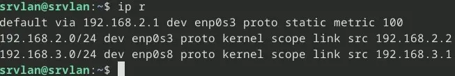

<figure markdown>
  { width="430" }
</figure>

## Mémento 1.12 - Serveur srvlan

L'architecture du réseau virtuel proposée sous Debian 12 sera la même que sous Debian 11 et le serveur srvlan supportera à nouveau le bureau léger Xfce.

Ce dernier, allégé de quelques applications préinstallées par défaut, contribuera au confort d'exploitation du serveur et facilitera notamment la réalisation de certains tests sur le réseau.

Par souci d'homogénéité, Xfce sera l'unique bureau graphique installé sur les VM du réseau.

<!-- more -->

### Construction de la VM

L'utilisation de VirtualBox est considérée acquise.

A défaut, référez-vous aux mémentos suivants :  
[VirtualBox - Installation](../posts/virtualbox-installation.md){ target="_blank" }  
[VirtualBox - Mode d’accès réseau par pont](../posts/virtualbox-pont-reseau.md){ target="_blank" }

#### _Création et configuration_

Le PC hôte doit être un PC 64 bits, courant de nos jours.

Téléchargez l'ISO debian-12.x.y-amd64\-netinst.iso :  
[https://cdimage.debian.org/.../current/amd64/iso-cd/](https://cdimage.debian.org/debian-cd/current/amd64/iso-cd/){ target="_blank" }

Démarrez ensuite l'application VirtualBox, puis :  
\- - Menu de VirtualBox > Machine > Nouvelle...
\-> Nom : srvlan LAN  
\-> Folder : Sélectionnez un dossier où stocker vos VM  
\-> ISO Image : Sélectionnez l'ISO téléchargée ci-dessus  
\-> Type : Linux  
\-> Version : Debian (64-bit)  
\-> Cochez Skip Unattended Installation (important)  
\-> Bouton Suivant

\-> Mémoire vive : 1024 MB  
\-> Processors : 2 CPU si possible  
\-> Bouton Suivant

\-> Create a Virtual Hard Disk Now : Ajustez à 12 Go  
\-> Bouton Suivant

\-> Vérifiez le Récapitulatif  
\-> Bouton Finish

La VM est créée dans le panneau gauche de VirtualBox.

Sélectionnez maintenant la nouvelle VM, puis :  
\- - Menu de VirtualBox > Machine > Configuration...  
\- - - Onglet Général  
\-> Avancé > Presse-papier partagé > Bidirectionnel  
  
\- - - Onglet Système  
\-> Carte mère > Ordre d'amorçage > Décochez Disquette  
\-> Processeur > Cochez Activer PAE/NX  
  
Facultatif, accès au dossier partagé par le PC hôte :  
\- - - Onglet Dossiers partagés  
\-> Cliquez sur l'icône + > Ajouter un dossier partagé  
\-> Chemin du dossier > Sélectionnez Autre...  
\-> Accédez à votre dossier > Ex : C:\\Partage-Windows  
\-> Sélectionner un dossier ou Ouvrir > OK > OK

Les autres paramètres peuvent rester inchangés.

#### _Installation de la distribution_

Conseil pratique avant de démarrer la nouvelle VM :  
Si le curseur de la souris disparaît lors d'un clic dans la fenêtre de la VM, celui-ci peut être récupéré par le PC hôte à l'aide de la touche CTRL située à droite de la barre d'espace du clavier.

\- - Menu de VirtualBox > Machine > Démarrer  
\-> Démarrage normal (La VM s'exécute)

Sélectionnez Graphical Install et appliquez ce qui suit :  
\- Language > Français  
\- Pays _(territoire ou région)_ \> France  
\- Disposition de clavier à utiliser > Français  
\- Interface réseau principale > enp0s3  
\- Nom de machine > srvlan  
\- Domaine > Laissez le champ vide  
\- MDP du super utilisateur root > Votre MDP root  
\- Confirmation du MDP > Votre MDP root  
\- Nom complet du nouvel utilisateur > Ex: srvlan  
\- Identifiant pour le compte utilisateur > srvlan  
\- MDP pour le nouvel utilisateur > Votre MDP srvlan  
\- Confirmation du MDP > Votre MDP srvlan  
\- Méthode de partitionnement > Assisté - utili... entier  
\- Disque à partitionner > Celui proposé de 12 Go  
\- Schéma de partitionnement > Tout ... seule partition  
\- Table des partitions > Terminer le partitionnement ..  
\- Faut-il appliquer les changements ... disques ? > Oui

L'installation commence :  
\- Faut-il analyser d'autres supports ... ? > Non  
\- Pays du miroir de l'archive Debian > France  
\- Miroir de l'archive Debian > deb.debian.org  
\- Mandataire HTTP (lais...) > Laissez vide

L'installation continue :  
\- Souhaitez-vous participer à l'étude statistique ... > Non  
\- Logiciels à installer  
\-> Décochez environnement de bureau Debian  
\-> Décochez ... GNOME  
\-> Cochez ... Xfce  
\-> Conservez utilitaires usuels du système

L'installation se termine :  
\- Installer ... de démarrage GRUB sur le disque ... > Oui  
\- Périphérique ... programme de démarrage > /dev/sda  
\- Installation terminée > Continuer _(sans retrait du CD)_

Le système reboot et une fenêtre de connexion s'ouvre :

<figure markdown>
  { width="430" }
  <figcaption>Fenêtre de connexion Xfce</figcaption>
</figure>

\-> Premier champ > Entrez srvlan  
\-> Second champ > Entrez Votre MDP srvlan  
\-> Bouton Se connecter

Le bureau Xfce s'ouvre :

<figure markdown>
  { width="430" }
  <figcaption>Bureau Xfce</figcaption>
</figure>

Ouvrez le terminal de Cdes en cliquant sur son icône située en bas à l'intérieur du dock.

Autorisez l'usage de sudo à l'utilisateur srvlan :

```bash
[srvlan@srvlan:~$] su root
Mot de passe : Votre MDP root
[root@srvlan:~#] sudo usermod -aG sudo srvlan
[root@srvlan:~#] exit
```

et redémarrez le serveur :  
\- - Menu Applications de Xfce situé en haut à gauche  
\-> Déconnexion _(Une fenêtre s'ouvre)_  
\-> Bouton Redémarrer

Reconnectez-vous ensuite en tant qu'utilisateur srvlan et rouvrez le terminal de Cdes.

### Ajout des utilitaires VirtualBox

Ils permettront entre autres le copier/coller et l'accès au dossier partagé par le PC hôte.

Notez au préalable la version courante du noyau linux :

```bash
[srvlan@srvlan:~$] uname -r
```

Exemple de retour :

```markdown
6.1.0-10-amd64
```

Installez ensuite les 2 paquets suivants :

```bash
[srvlan@srvlan:~$] sudo apt install dkms build-essential
```

Debian installera automatiquement la dépendance linux-headers-6.1.0-10-amd64.

Ouvrez le menu VirtualBox situé sur la fenêtre de la VM :  
\-> Périphériques > Insérer l'image CD des Additions inv...

Montez l'image CD, installez les utilitaires et rebootez :

```bash
[srvlan@srvlan:~$] sudo mount /dev/cdrom /media/cdrom
[srvlan@srvlan:~$] cd /media/cdrom
[srvlan@srvlan:~$] sudo ./VBoxLinuxAdditions.run
[srvlan@srvlan:~$] sudo reboot
```

Une fois fini, reconnectez-vous, la fenêtre VM srvlan peut à présent être redimensionnée avec la souris. Sa nouvelle taille sera enregistrée au sein de srvlan.

Le pratique copier/coller entre le PC hôte et srvlan doit maintenant fonctionner dans les 2 sens.

Sans fermer la VM, retirez l'image CD du lecteur virtuel :  
\- - Menu de VirtualBox > Machine > Configuration...  
\- - - Onglet Stockage  
\-> Zone Unités de stockage > Sélectionnez VBoxGuest...  
\-> Zone Attributs > Cliquez sur l'icône CD  
\-> Retirer le disque du lecteur virtuel > OK

### Applications préinstallées

Supprimez ces applications non utiles sur srvlan :

```bash
[srvlan@srvlan:~$] sudo apt autoremove --purge \
libreoffice-writer libreoffice-impress \
libreoffice-calc libreoffice-math \
libreoffice-draw libreoffice-base-core \
libreoffice-core libreoffice-common
```

```bash
[srvlan@srvlan:~$] sudo rm -r /etc/libreoffice
```

```bash
[srvlan@srvlan:~$] sudo apt autoremove --purge \
exfalso quodlibet
```

La configuration de base est presque terminée :

<figure markdown>
  { width="430" }
  <figcaption>Debian 12 : Bureau Xfce personnalisé</figcaption>
</figure>

La consommation mémoire est d'environ 500 Mo.

Pour un même fond d'écran sur la fenêtre de login Lightdm et le bureau Xfce, procédez ainsi :

```bash
[srvlan@srvlan:~$] cd /chemin-de-votre-fond-ecran
[srvlan@srvlan:~$] sudo cp fond.jpg /usr/share/backgrounds/
[srvlan@srvlan:~$] cd /etc/lightdm
[srvlan@srvlan:~$] sudo nano lightdm-gtk-greeter.conf
```

Remplacez la ligne #background= par celle-ci :

```bash
background=/usr/share/backgrounds/fond.jpg
```

### Contenu du dossier partagé par l'hôte

Créez le dossier qui permettra d'afficher le contenu partagé par le PC hôte :

```bash
[srvlan@srvlan:~$] mkdir /home/srvlan/Partage
```

Créez le fichier de service home-srvlan-Partage.mount :

```bash
[srvlan@srvlan:~$] cd /etc/systemd/system
[srvlan@srvlan:~$] sudo touch home-srvlan-Partage.mount
```

Editez celui-ci :

```bash
[srvlan@srvlan:~$] sudo nano home-srvlan-Partage.mount
```

et entrez le contenu suivant :

```bash
[Unit]
Description = Montage dossier partagé fourni par VirtualBox

[Mount]
What = Entrez le nom du dossier partagé par le PC hôte
Where = /home/srvlan/Partage
Type = vboxsf
Options=rw,uid=srvlan,gid=srvlan

[Install]
WantedBy = multi-user.target
```

Exemple pour What : What=Partage-Alfred

Intégrez le service dans la configuration de systemd :

```bash
[srvlan@srvlan:~$] sudo systemctl daemon-reload
```

et démarrez celui-ci :

```bash
[srvlan@srvlan:~$] sudo systemctl start home-srvlan-Partage.mount
```

Vérifiez ensuite son statut :

```bash
[srvlan@srvlan:~$] sudo systemctl status home-srvlan-Partage.mount
```

Touche q pour quitter le résultat affiché.

Si statut = active, autorisez le service au boot de la VM :

```bash
[srvlan@srvlan:~$] sudo systemctl enable home-srvlan-Partage.mount
```

Un lien symbolique vers le service est créé.

Ouvrez enfin le gestionnaire de fichiers thunar et observez le contenu de /home/srvlan/Partage.

### Configuration réseau de la VM

Avant, vérifiez l'IP courante avec la Cde ip address :

```bash
[srvlan@srvlan:~$] ip address
```

Résultat, IP 10.0.2.15, IP fournie par VirtualBox :

<figure markdown>
  
  <figcaption>Résultat de la Cde ip address</figcaption>
</figure>

Puis installez les 2 paquets suivants :

```bash
[srvlan@srvlan:~$] sudo apt install netfilter-persistent
```

```bash
[srvlan@srvlan:~$] sudo apt install iptables-persistent
```

Une fenêtre Config... iptables-persistent s'ouvre :  
\-> Faut-il enregistrer les règles IPv4 actuelles ? > Oui  
\-> Faut-il enregistrer les règles IPv6 actuelles ? > Oui

2 fichiers rules.v4/v6 ont été créés dans /etc/iptables/.  
Ils serviront à déclarer persistantes des règles iptables.

La VM srvlan étant prévue en zone LAN, il faut changer le mode d'accès réseau de sa carte réseau enp0s3.

Pour cela, sélectionnez la VM srvlan dans VirtualBox :  
\- - Menu de VirtualBox > Machine > Configuration...  
\- - - Onglet Réseau  
\-> Adapter 1 > Mode d'accès réseau > Réseau interne  
\-> OK

#### _Adresse IP fixe carte enp0s3_

Configurez à présent une IP fixe sur la carte enp0s3 :  
\- - Bureau Xfce, barre du haut  
\-> Clic droit sur l'icône Réseau située à droite  
\-> Sélectionnez Modifier les connexions...  
  
Une fenêtre Connexions réseau s'ouvre :  
\-> Sélectionnez la connexion Wired connection 1  
\-> Cliquez sur l'icône roue dentée de la fenêtre  
  
Une fenêtre Modification de ... s'ouvre :  
\-> Nom de la connexion > Entrez Connexion carte 1  
  
\- - - Onglet Ethernet  
\-> Périphérique > Sélectionnez enp0s3  
  
\- - - Onglet Paramètres IPv4  
\-> Méthode > Sélectionnez Manuel > Bouton Ajouter  
\-> Champ Adresse : Entrez 192.168.2.2  
\-> Champ Masque de réseau : Entrez 255.255.255.0  
\-> Champ Passerelle : Entrez 192.168.2.1  
\-> Serveurs DNS > Entrez l'IP locale de votre Box Internet  
\-> Bouton Enregistrer  
  
Fermez ensuite la fenêtre Connexions réseau.  

Pour finir, stoppez la VM srvlan :  
\- - Menu Applications de Xfce situé en haut à gauche  
\-> Déconnexion > Une fenêtre s'ouvre  
\-> Bouton Eteindre

#### _Création carte enp0s8_

Le raccordement de la VM srvlan nécessite de créer une seconde carte réseau sur celle-ci.

Pour cela, sélectionnez la VM srvlan dans VirtualBox :  
\- - Menu de VirtualBox > Machine > Configuration...  
\- - - Onglet Réseau  
\-> Adapter 2 > Cochez Activer l'interface réseau  
\-> Mode d'accès réseau > Sélectionnez Réseau interne  
\-> OK

Redémarrez la VM srvlan.

Configurez également une IP fixe sur la carte enp0s8 :  
\- - Bureau Xfce, barre du haut  
\-> Clic droit sur l'icône Réseau située à droite  
\-> Sélectionnez Modifier les connexions...  
  
Une fenêtre Connexions réseau s'ouvre :  
\-> Sélectionnez la nouvelle connexion affichée
\-> Cliquez sur l'icône roue dentée de la fenêtre  
  
Une fenêtre Modification de ... s'ouvre :  
\-> Nom de la connexion > Connexion carte 2  
  
\- - - Onglet Ethernet  
\-> Périphérique > Sélectionnez enp0s8  
  
\- - - Onglet Paramètres IPv4  
\-> Méthode > Sélectionnez Manuel > Bouton Ajouter  
\-> Champ Adresse : Entrez 192.168.3.1  
\-> Champ Masque de réseau : Entrez 255.255.255.0  
\-> Bouton Enregistrer  
  
Fermez ensuite la fenêtre Connexions réseau.

Redémarrez srvlan et vérifiez la configuration réseau :

```bash
[srvlan@srvlan:~$] ip address
[srvlan@srvlan:~$] nmcli  # Cde NetworkManager
```

Les fichiers configurés avec NetworkManager sont ici :  
/etc/NetworkManager/system-connections/

!!! note "Nota"
    La VM srvlan n'accède plus à Internet, la VM suivante permettra de retrouver cet accès.

#### _Routage interne au serveur_

L'activation du routage avec la Cde ip\_forward permet, selon les règles définies dans la table de routage du serveur, le renvoi de paquets de données arrivés par une interface réseau vers une autre interface réseau.

Pour l'activez, éditez le fichier sysctl.conf :

```bash
[srvlan@srvlan:~$] sudo nano /etc/sysctl.conf
```

et retirez le # de la ligne #net.ipv4.ip\_forward=1.

Relancez ensuite le service réseau :

```bash
[srvlan@srvlan:~$] sudo systemctl restart NetworkManager
```

#### _Translation d'adresses NAT_

\-- Définition de WIKIBOOKS --
Objectif du NAT _(Network Address Translation)_ :  
Faire que les PC d'un réseau interne n'apparaissent que sous l'identifiant d'une seule IP pour les réseaux externes _(c'est un masquage ou IP Masquerading)_.

Votre box Internet _(passerelle)_ fait du NAT entre votre réseau privé et le réseau Internet et de ce fait votre fournisseur d'accès _(FAI)_ ne vous donne qu'une seule IP alors que vous pouvez très bien avoir plusieurs PC connectés à Internet à partir de votre réseau local.

Le NAT répond principalement au manque d'adresses IP dans le plan d'adressage ipV4 pour l'accès à Internet.

Il permet également de s'affranchir de la gestion des tables de routage et fonctionne avec le service iptables installé par défaut avec Debian.

Vérifiez l'état courant du NAT ou IP Masquerading :

```bash
[srvlan@srvlan:~$] sudo iptables -L -t nat
```

Résultat, NAT inactif, pas de target MASQUERADE :

<figure markdown>
  
  <figcaption>iptables : Pas de règle active</figcaption>
</figure>

Activez celui-ci en utilisant une règle iptables :

```bash
[srvlan@srvlan:~$] sudo iptables -t nat -A POSTROUTING -o enp0s3 -j MASQUERADE
```

et affichez de nouveau le contenu de la table NAT :

```bash
[srvlan@srvlan:~$] sudo iptables -L -t nat
```

Résultat, le NAT est actif :

<figure markdown>
  
  <figcaption>iptables : Règle NAT (MASQUERADE) active</figcaption>
</figure>

Effectuez une sauvegarde de la règle iptables :

```bash
[srvlan@srvlan:~$] su root
[root@srvlan:~$] sudo iptables-save > /etc/iptables/rules.v4
[root@srvlan:~$] exit
```

et déclarez celle-ci persistente :

```bash
[srvlan@srvlan:~$] sudo systemctl enable netfilter-persistent
[srvlan@srvlan:~$] sudo systemctl restart netfilter-persistent
```

Elle sera ainsi activée à chaque boot du système.

Par curiosité, lisez la table de routage avec la Cde ip r :

<figure markdown>
  
  <figcaption>Table de routage de srvlan</figcaption>
</figure>

{ align=left }

&nbsp;  
Bravo !  
Le serveur srvlan est prêt.  
Le mémento 2.1 vous attend pour  
l'ajout du serveur srvsec _(IPFire)_.

[Mémento 2.1](../posts/serveur-ipfire-srvsec-creation.md){ .md-button .md-button--primary }
