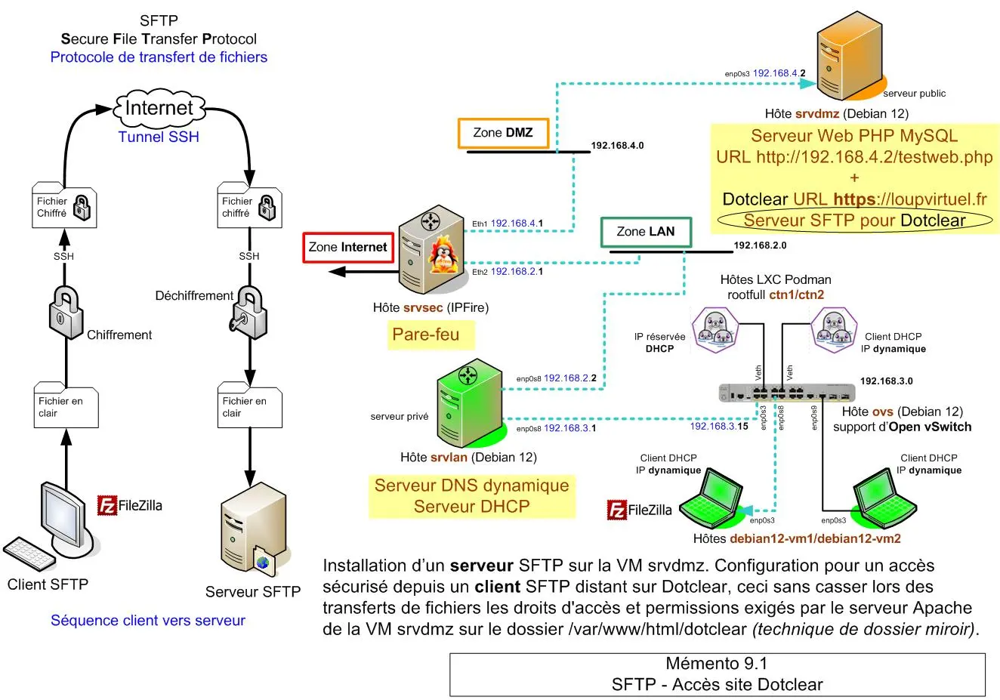
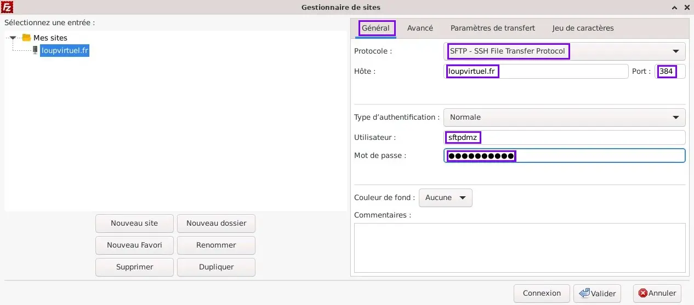
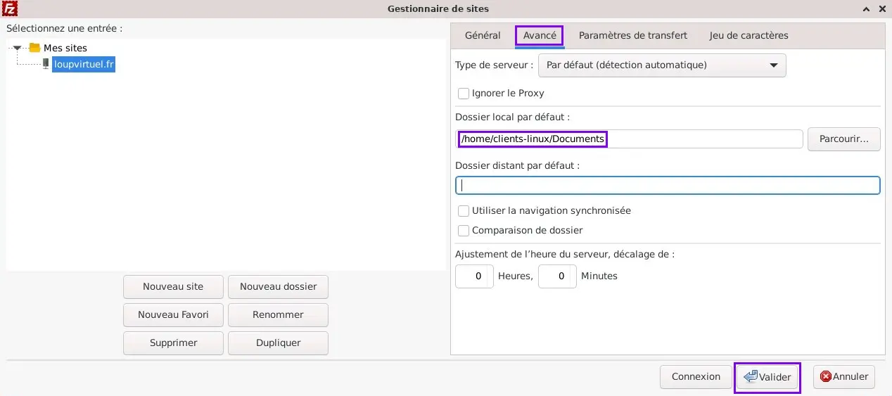
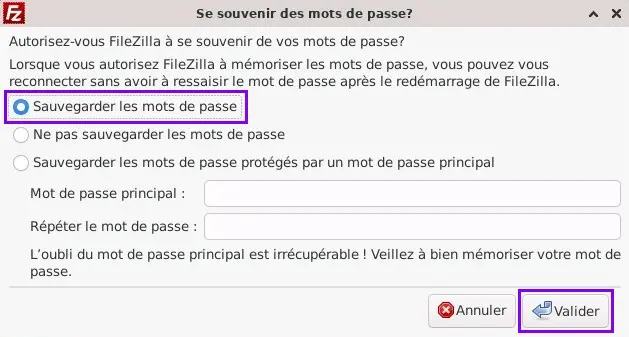
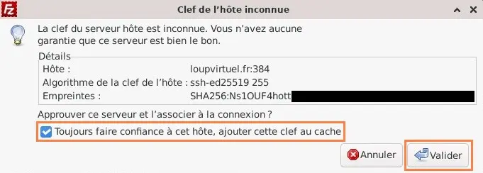
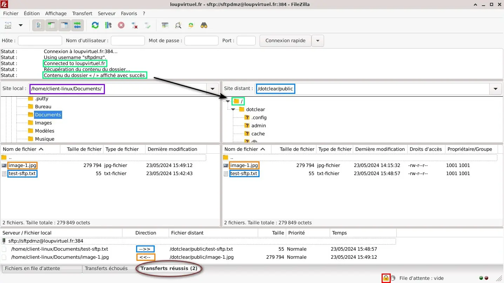
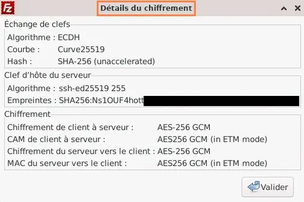

<figure markdown>
  { width="430" }
</figure>

## Mémento 9.1 - FTP chiffré SSH

Le service SFTP sera activé sur la VM `srvdmz`.

La configuration permettra un accès SFTP sur le site Dotclear ceci en respectant les droits d'accès et permissions exigés par le serveur Apache sur le dossier /var/www/html/dotclear/.

### Préambule

Pourquoi choisir le protocole SFTP plutôt que FTP ?

FTP est de base non sécurisé, ses Cdes et données ne sont pas chiffrées, on peut donc intercepter le MDP de connexion ou le contenu des fichiers échangés.

Le chiffrement FTPS est possible mais exige une configuration plus lourde.

SFTP est plus simple à mettre en œuvre. Il est fourni avec le paquet openssh-server et permet de base le chiffrement des Cdes et données transmises.

Il vérifie l’identité du client et chiffre les fichiers/dossiers échangés une fois la connexion sécurisée établie.

Il utilise les règles de chiffrement SSH (**S**ecure **SH**ell).

### Installation du serveur SFTP

Installez le paquet openssh-server :

```bash
[srvdmz@srvdmz:~$] sudo apt install openssh-server 
```

La dépendance openssh-sftp-server a été ajoutée et des fichiers de configuration ont été créés dans /etc/ssh/.

### Dossier miroir pour Dotclear

<!-- more -->

#### _- Permissions à préserver_

L'utilisateur lié à Apache étant `www-data` sous Debian, vous avez précédemment attribué celui-ci et son groupe associé aux dossiers et fichiers de Dotclear.

Les scripts PHP de Dotclear ont ainsi hérité des droits d'accès en écriture leur permettant de mettre à jour localement le contenu de /var/www/html/dotclear/.

Rappel des permissions utilisées par Dotclear :  
\- Dossiers = 755  
soit propriétaire u ==drwx==, groupe g ==r-x==, autres o ==r-x==

\- Fichiers = 644  
soit propriétaire u ==rw-==, groupe g ==r--==, autres o ==r--==

Les écritures effectuées depuis un client SFTP ne doivent pas modifier les permissions ci-dessus, Dotclear risquant de ne plus fonctionner correctement.

Une technique pour éviter cela consiste à créer un dossier miroir du dossier Web de Dotclear.

#### _- Création du dossier miroir_

L'outil bindfs liera le dossier /var/www/html/dotclear/ à un dossier miroir dédié aux accès SFTP. Les écritures effectuées à l'intérieur de ce dernier n'affecteront pas les droits d'accès et permissions du dossier Web.

Le dossier miroir appartiendra au groupe sftp-groupe et à l'utilisateur `sftpdmz`.

Commencez par la création du dossier miroir :

```bash
[srvdmz@srvdmz:~$] cd /home

[srvdmz@srvdmz:~$] sudo  mkdir -p sftpdmz/sites-web/dotclear 
```

Créez ensuite son groupe sftp-groupe :

```bash
[srvdmz@srvdmz:~$] sudo addgroup sftp-groupe 
```

et son utilisateur `sftpdmz` que vous lierez à sftp-groupe :

```bash
[srvdmz@srvdmz:~$] sudo useradd -d /home/sftpdmz/sites-web/dotclear -g sftp-groupe sftpdmz 
```

Avant d'aller plus loin, effectuez les contrôles ci-après :

```bash
[srvdmz@srvdmz:~$] cat /etc/group | grep sftp-groupe  
```

Retour :

```markdown
sftp-groupe:x:1001:  
```

```bash
[srvdmz@srvdmz:~$] cat /etc/passwd | grep sftpdmz  
```

Retour :

```markdown
sftpdmz:x:1001:1001::/home/sftpd.../dotclear:/bin/sh  
```

```bash
[srvdmz@srvdmz:~$] id sftpdmz   
```

Retour :

```markdown
uid=1001(sftpdmz) gid=1001(sftp-groupe) groupes=1001(sftp-groupe)  
```

```bash
[srvdmz@srvdmz:~$] groups sftpdmz  
```

Retour :

```markdown
sftpdmz : sftp-groupe  
```

Enfin, appliquez ces permissions sur le dossier miroir :

```bash
[srvdmz@srvdmz:~$] sudo  chown sftpdmz:sftp-groupe /home/sftpdmz/sites-web/dotclear

[srvdmz@srvdmz:~$] sudo  chmod 755 /home/sftpdmz/sites-web/dotclear  
```

et terminez en créant un MDP pour l'utilisateur `sftpdmz` :

```bash
[srvdmz@srvdmz:~$] sudo passwd sftpdmz  
```

#### _- Outil bindfs pour le remplir_

```bash
[srvdmz@srvdmz:~$] sudo apt install bindfs  
```

L'outil fuse3 qui sera utilisé ci-dessous est déjà installé.

Pour remplir automatiquement le miroir, éditez fstab :

```bash
[srvdmz@srvdmz:~$] sudo nano /etc/fstab  
```

et ajoutez les 2 lignes suivantes à la fin du fichier :

```markdown
# Montage automatique du dossier miroir de Dotclear 

bindfs#/var/www/html/dotclear /home/sftpdmz/sites-web/dotclear fuse force-user=sftpdmz,force-group=sftp-groupe,create-for-user=www-data,create-for-group=www-data,create-with-perms=ud=rwx:god=rx:uf=rw:gof=r,chgrp-ignore,chown-ignore,chmod-ignore 0 0  
```

La Cde create-with-perms suit les permissions 755/644.

Redémarrez afin de traiter la Cde bindfs du fichier fstab :

```bash
[srvdmz@srvdmz:~$] sudo reboot  
```

et vérifiez ensuite le contenu du dossier miroir :

```bash
[srvdmz@srvdmz:~$] sudo ls -l /home/sftpdmz/sites-web/dotclear   
```

Retour :

```markdown hl_lines="1 3"
drwxr-xr-x  7 sftpdmz sftp-groupe  ... admin
drwxr-xr-x  5 sftpdmz sftp-groupe  ... cache
-rw-r--r--  1 sftpdmz sftp-groupe  ... CHANGELOG
-rw-r--r--  1 sftpdmz sftp-groupe  ... CONTRIBUT...
-rw-r--r--  1 sftpdmz sftp-groupe  ... CREDITS
drwxr-xr-x  2 sftpdmz sftp-groupe  ... db
drwxr-xr-x  7 sftpdmz sftp-groupe  ... inc
-rw-r--r--  1 sftpdmz sftp-groupe  ... index.php
-rw-r--r--  1 sftpdmz sftp-groupe  ... LICENSE
drwxr-xr-x  4 sftpdmz sftp-groupe  ... locales
...   
```

ainsi que celui du dossier /var/www/html/dotclear/ :

```bash
[srvdmz@srvdmz:~$] sudo ls -l /var/www/html/dotclear   
```

Retour :

```markdown hl_lines="1 3"
drwxr-xr-x  7 www-data www-data  ... admin
drwxr-xr-x  5 www-data www-data  ... cache
-rw-r--r--  1 www-data www-data  ... CHANGELOG
-rw-r--r--  1 www-data www-data  ... CONTRIBUT...
-rw-r--r--  1 www-data www-data  ... CREDITS
drwxr-xr-x  2 www-data www-data  ... db
drwxr-xr-x  7 www-data www-data  ... inc
-rw-r--r--  1 www-data www-data  ... index.php
-rw-r--r--  1 www-data www-data  ... LICENSE
drwxr-xr-x  4 www-data www-data  ... locales
...
```

Constat :  
\- Les permissions dossiers/fichiers sont identiques.  
\- Les utilisateurs/groupes sont correctement affectés.

### Réglages SFTP et test local

Editez le fichier de configuration du démon SSH :

```bash
[srvdmz@srvdmz:~$] sudo  nano /etc/ssh/sshd_config   
```

Commentez les 2 lignes suivantes :

```markdown
X11Forwarding yes
Subsystem    sftp    /usr/lib/openssh/sftp-server   
```

et ajoutez en fin de fichier ce groupe de lignes :

```markdown
# Configuration sshd de l'hôte srvdmz
Subsystem     sftp     internal-sftp
Port 384                                                                   
PermitRootLogin no                                               
Match User sftpdmz                                              
ChrootDirectory  /home/sftpdmz/sites-web
X11Forwarding no
AllowTcpForwarding no
ForceCommand internal-sftp -u 022  
```

Explications :  
\- Choix sous-système internal-sftp et non sftp-serveur.  
\- Port SSH 384 au lieu du port 22 par défaut.  
\- Accès SSH interdit en tant qu'utilisateur root.  
\- Accès SSH restreint à l'utilisateur sftpdmz.  
\- Accès limité au dossier racine /home/.../sites-web/.  
\- Transfert d'affichage graphique X11 désactivé.  
\- Redirection de port TCP, tunnel SSH, désactivée.  
\- Cdes limitées à celles du sous-système internal-sftp.  
\- Umask 022 = 755 _(dossiers)_ et 644 _(fichiers)_.

Vérifiez afin que le ChrootDirectory _(dossier racine)_ fonctionne que le propriétaire des dossiers sftpdmz et sites-web soit bien l'utilisateur `root` :

```bash
[srvdmz@srvdmz:~$] ls -l /home
[srvdmz@srvdmz:~$] ls -l /home/sftpdmz   
```

Retours attendus pour les 2 Cdes :

```markdown
drwxr-xr-x 3 root root 4096 22 mai 15:35 sftpdmz
drwxr-xr-x 3 root root 4096 22 mai 15:35 sites-web   
```

Redémarrez le serveur SSH :

```bash
[srvdmz@srvdmz:~$] sudo systemctl restart ssh
[srvdmz@srvdmz:~$] sudo systemctl status ssh    
```

Retour :

```markdown hl_lines="3 16 17"
● ssh.service - OpenBSD Secure Shell server
  Loaded: loaded (/lib/systemd/system/ssh.service...
  Active: active (running) since Wed 2024...; 14s ago
  Docs: man:sshd(8)
        man:sshd_config(5)
  Process: 1704 ExecStartPre=/usr/sbin... =0/SUCCESS)
 Main PID: 1706 (sshd)
     Tasks: 1 (limit: 1077)
     Memory: 1.9M
     CPU: 35ms
     CGroup: /system.slice/ssh.service
             └─1706 "sshd: /usr/sbin/sshd -D ...".

... srvdmz systemd[1]: Starting ssh.service - OpenBSD ...
... srvdmz sshd[1706]: ... listening on 0.0.0.0 port 384.
... srvdmz systemd[1]: Started ssh.service - OpenBSD ...
... srvdmz sshd[1706]: ... listening on :: port 384.   
```

Avant de continuer, ajoutez une image dans le dossier partagé par l'hôte de VirtualBox.

Testez ensuite une connexion locale :

```bash
[srvdmz@srvdmz:~$] sudo sftp -o Port=384 sftpdmz@loupvirtuel.fr    
```

Retour :

```markdown hl_lines="4 6 8 10 11"
The authenticity ... '[loupvirtuel.fr]:384 ([192...
ECDSA key fingerprint is SHA256:Ns10UF4h...
This key is not known by any other names.
Are you sure ... continue connecting (yes/...)? yes
Warning: Permanently added '[loupvirtuel.fr]:384'...
sftpdmz@loupvirtuel.fr's password: votre MDP sftpdmz 
Connected to loupvirtuel.fr.
sftp> ls
dotclear  
sftp> cd dotclear/public
sftp> ls
sftp> (dossier public vide de base) 
```

et déposez l'image _(Ex : image-1.jpg)_ dans public :

```markdown hl_lines="1 4"
sftp> put /home/srvdmz/Partage/image-1.jpg
Uploading /home.../image-1.jpg to /dotclear...
image-1.jpg 100%  273KB 24.1MB/s 00:00    
sftp> quit
```

Vérifiez l'attribution des droits d'accès et permissions :

```bash
[srvdmz@srvdmz:~$] sudo ls -l /var/www/html/dotclear/public/image-1.jpg    
```

Retour :

```markdown
-rw-r--r-- 1 www-data www-data ... /.../image-1.jpg    
```

Résultat OK :  
Droits d'accès à www-data et permissions à 644.

### Test depuis debian12-vm1

#### _- Ajout du client FileZilla_

Installez le client graphique sur la VM `debian12-vm1` :

```bash
[client-linux@debian12-vm1:~$] sudo apt install filezilla    
```

Ouvrez ensuite l'application graphique FTP/SFTP :  
\- Menu Applications -> Internet -> Icône FileZilla

Cliquez sur l'icône située la plus à gauche de la barre des icônes afin d'ouvrir le Gestionnaire de Sites et cliquez sur le bouton Nouveau site.

Créez le site loupvirtuel.fr comme montré ci-dessous :  
\- Onglet Général

<figure markdown>
  { width="430" }
  <figcaption>FileZilla : Réglages SFTP généraux pour le site</figcaption>
</figure>

\- Onglet Avancé

<figure markdown>
  { width="430" }
  <figcaption>FileZilla : Réglages SFTP avancés pour le site</figcaption>
</figure>

et traitez pour finir la fenêtre de gestion des MDP :

<figure markdown>
  { width="430" }
  <figcaption>FileZilla : Gestion des mots de passe</figcaption>
</figure>

#### _- Test de connexion distante_

Vous êtes maintenant prêt pour effectuer un test. Cliquez sur la flèche située à droite de l'icône du Gestionnaire de Sites et sélectionnez `loupvirtuel.fr`.

La connexion débute :  
\- Une fenêtre Clé de l'hôte inconnue s'ouvre.  
\- Cochez Toujours faire confiance à cet hôte... et validez.

<figure markdown>
  { width="430" }
  <figcaption>FileZilla : SFTP - Fenêtre Clé SSH</figcaption>
</figure>

La connexion SFTP est à présent établie et sécurisée :

<figure markdown>
  { width="430" }
  <figcaption>FileZilla : Exemples de Download/Upload (2 fichiers)</figcaption>
</figure>

Cliquez sur l'icône cadenas située en bas et à droite pour découvrir les détails du chiffrement.

<figure markdown>
  { width="430" }
  <figcaption>FileZilla : Détail du chiffrement SFTP</figcaption>
</figure>

### Contrôle global du SFTP

\- VM `debian12-vm1`  
a) Depuis le client FilZilla, vous devez pouvoir :  
\- Télécharger dans /home/client-linux/Documents/.  
\- Envoyer un dossier/fichier dans /dotclear/.  
\- Créer un nouveau dossier/fichier dans /dotclear/.  
\- Supprimer un dossier/fichier dans /dotclear/.  
\- Modifier un dossier/fichier dans /doctlear/.

b) Vous ne devez pas pouvoir :  
\- Naviguer au delà de la racine / _(Chroot)_.

c) Les droits d'accès et permissions affichés pour le dossier distant /dotclear doivent être :  
\- 755 pour les dossiers et 644 pour les fichiers.  
\- Propriétaire sftpdmz _(uid=1001)_.  
\- Groupe sftp-groupe _(gid=1001)_.

\- VM `srvdmz`
Affichez les droits d'accès et permissions pour le dossier /var/www/html/dotclear/public/:

```bash
[srvdmz@srvdmz:~$] sudo ls -l /var/www/html/dotclear/public    
```

Exemple de retour selon le contenu courant :

```markdown
total 280
-rw-r--r-- 1 www-data www-data ... image-1.jpg
drwxr-xr-x 2 www-data www-data ... test-dossier
-rw-r--r-- 1 www-data www-data ... test-sftp.txt    
```

Soit :  
\- 755 pour les dossiers et 644 pour les fichiers.  
\- Propriétaire www-data _(uid=33)_.  
\- Groupe www-data _(gid=33)_.

#### _- Réparation des permissions_

En cas de problème, utilisez les Cdes ci-dessous pour rétablir en une fois les bonnes permissions sur tous les fichiers et dossiers de Dotclear :

```bash
[srvdmz@srvdmz:~$] cd /var/www/html/dotclear 
[srvdmz@srvdmz:~$] sudo find . -type d -exec chmod 755 {} \;
[srvdmz@srvdmz:~$] sudo find . -type f -exec chmod 644 {} \;    
```

Corrigez ensuite votre configuration et effectuez un nouveau contrôle de bon fonctionnement.

{ align=left }

&nbsp;  
J'espère que cela vous a plu. Le  
mémento 9.2 vous attend pour la  
mise en place du protocole FTPS  
avec le serveur VsFTPd. A bientôt.

!!! Info "Mémento 9.2 en cours de construction"
