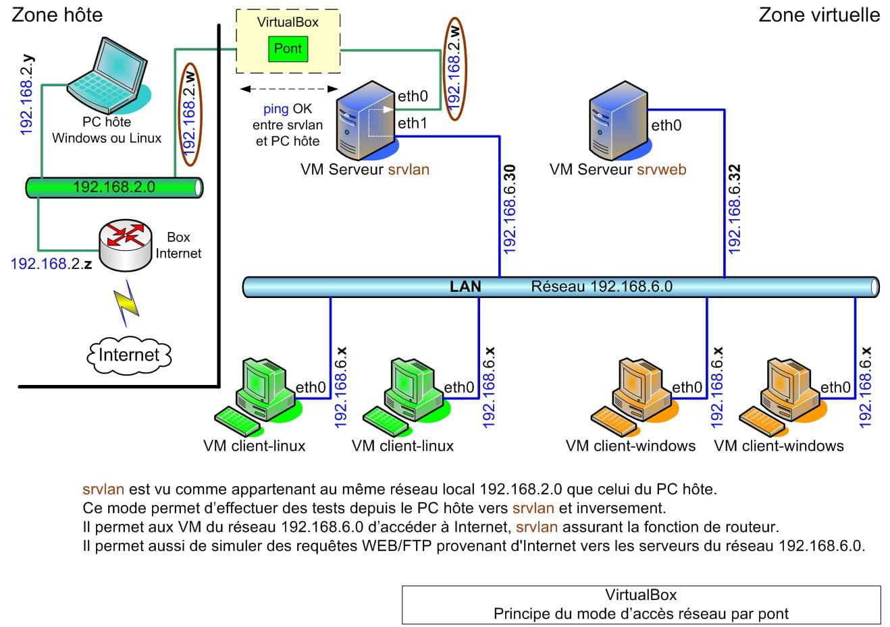

<figure markdown>
  { width="430" }
</figure>

## Pont réseau entre VM et PC hôte

{ align=left }

&nbsp;  
&nbsp;  
Configuration d'un pont réseau *(bridge)*
&nbsp;  
&nbsp;
&nbsp;  
&nbsp;  

### Rôle

Le mode d'accès réseau par pont de VirtualBox crée un pont entre la carte réseau d'une VM et celle du PC hôte. La VM peut ainsi appartenir au même réseau local que celui du PC hôte.

Le serveur DHCP utilisé par le PC hôte peut fournir une adresse IP dynamique à la VM mais ce n'est pas obligatoire, l'adresse IP pouvant être paramétrée comme fixe au niveau de la VM.

### Intérêt

Le pont offre l'avantage de pouvoir réaliser des tests depuis le PC hôte vers le réseau local virtuel comme celui de simuler des requêtes HTTP/FTP issues d'Internet.

<!-- more -->

### Installation du pont réseau

#### *- srvlan - mode accès réseau*

Arrêtez la VM srvlan.

Depuis VirtualBox, affichez la configuration de la VM :  
\- Section Réseau  
\-> Carte 1 > Mode d'accès réseau > Accès par pont  
\-> Nom > Sélectionnez la carte réseau active du PC hôte  
\-> OK

Redémarrez la VM.

#### *- srvlan - adresse IP fixe*

Editez le fichier réseau interfaces :

```bash
[root@srvlan:~#\] nano /etc/network/interfaces
```

et modifiez les lignes ci-dessous comme suit :

```bash
auto eth
iface eth0 inet static
address 192.168.x.w          \# IP libre du réseau local PC hôte
netmask 255.255.255.0
network 192.168.x.0          \# Réseau local du PC hôte
broadcast 192.168.x.255
gateway 192.168.x.z          \# IP de la box Internet, Freebox, etc...
```

Relancez le service réseau sur la carte eth0 :

```bash
[root@srvlan:~#\] service network-interface restart INTERFACE=eth0
```

#### *- Test du pont*

Effectuez un ping depuis le PC hôte vers srvlan et inversement.

<center>---------- Fin ----------</center>
