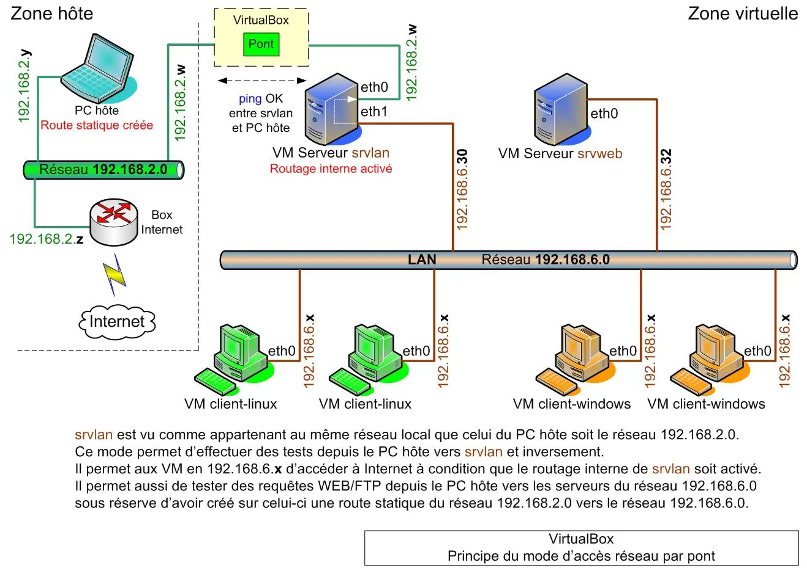

<figure markdown>
  { width="430" }
</figure>

## Pont réseau entre VM et PC hôte

{ align=left }

&nbsp;  
&nbsp;  
Configuration d'un pont réseau *(bridge)*
&nbsp;  
&nbsp;
&nbsp;

&nbsp;  

### Rôle

Le mode d'accès réseau par pont de VirtualBox crée un pont entre la carte réseau d'une VM et celle du PC hôte. La VM peut ainsi appartenir au même réseau local que celui du PC hôte.

Le serveur DHCP utilisé par le PC hôte peut fournir une adresse IP dynamique à la VM mais ce n'est pas obligatoire, l'adresse IP pouvant être paramétrée comme fixe au niveau de la VM.

### Intérêt *(Voir le synoptique)*

Ce mode d'accès réseau permet notamment l'accès à Internet aux équipements du réseau virtuel à condition que le routage interne de la VM srvlan soit activé.

Il permet aussi de tester des requêtes HTTP/FTP depuis le PC hôte vers les serveurs du réseau 192.168.6.0 sous réserve d’avoir créé sur celui-ci une route statique du réseau 192.168.2.0 vers le réseau 192.168.6.0.

<!-- more -->

### Installation du pont réseau

#### *- srvlan : mode accès réseau*

Arrêtez la VM srvlan.

Depuis VirtualBox, affichez la configuration de la VM :  
\- Section Réseau  
\-> Carte 1 -> Mode d'accès réseau -> Accès par pont  
\-> Nom -> Sélectionnez la carte réseau active du PC hôte  
\-> OK

Redémarrez la VM.

#### *- srvlan : adresse IP fixe*

La configuration ci-dessous concerne un système Debian n'utilisant pas NetworkManager, adaptez en conséquence.

Editez le fichier réseau interfaces :

```bash
[root@srvlan] nano /etc/network/interfaces
```

et modifiez les lignes ci-dessous comme suit :

```markdown
auto eth
iface eth0 inet static
address 192.168.x.w          # IP libre du réseau local
netmask 255.255.255.0
network 192.168.x.0          # Réseau local du PC hôte
broadcast 192.168.x.255
gateway 192.168.x.z          # IP de la box Internet
```

Si Systemd utilisé, relancez le service réseau comme suit :

```bash
[root@srvlan] systemctl restart networking
```

Si SysVinit utilisé, relancez le service réseau comme suit :

```bash
[root@srvlan] service network-interface restart INTERFACE=eth0
```

#### *- Test du pont*

Effectuez un ping depuis le PC hôte vers srvlan et inversement.

<center>---------- Fin ----------</center>
