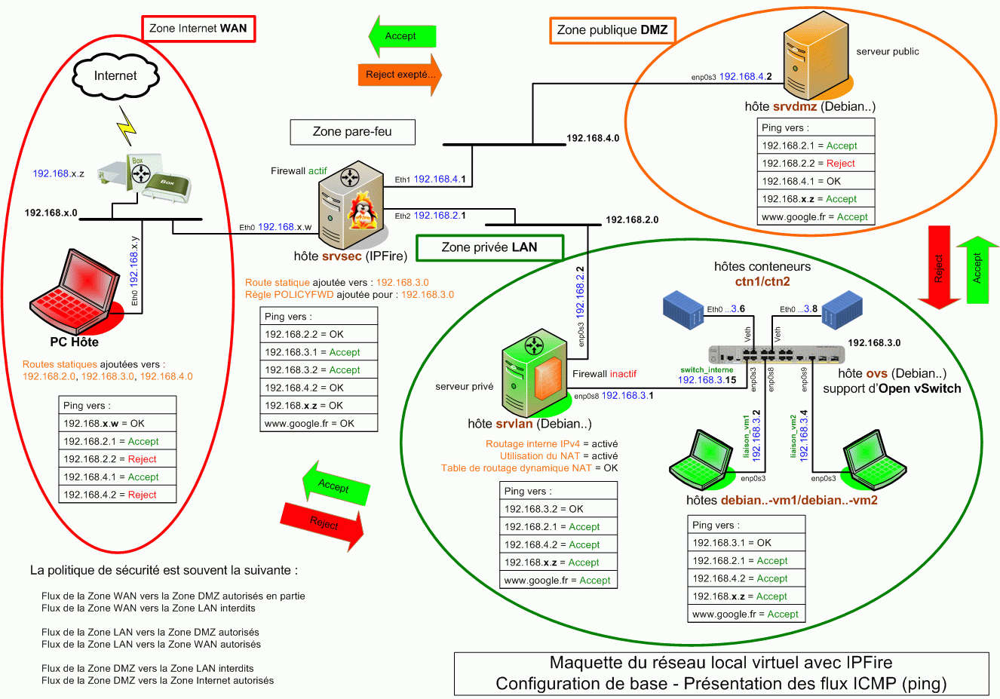

## Bienvenue

{ align=left }

&nbsp;  
Apprenez comment simuler un  
réseau informatique local.  
&nbsp;  
&nbsp;  

La maquette proposée ci-dessous inclut **deux serveurs** Debian (zones LAN et DMZ) ainsi qu'**un serveur** IPFire assurant le rôle de pare-feu pour le réseau (zone WAN).

Les **postes de travail** de la zone LAN reposent sur des machines virtuelles ou des conteneurs exploitant l'OS Debian.

Un **commutateur** virtuel de nom Open vSwitch et tournant sous Debian est également présent.

La construction de la maquette est issue de l'hyperviseur de type 2 [VirtualBox](https://www.virtualbox.org/){ target="_blank" }.

Maquette de base du réseau virtuel :

<figure markdown>
  { width="430" }
  <figcaption>Réseau virtuel : Flux ICMP (ping))</figcaption>
</figure>

[VirtualBox](https://www.virtualbox.org/){ target="_blank" } permet de créer une maquette réaliste d'un petit réseau informatique local, celle-ci s'avérant pratique pour s'initier à l'**administration réseau**.

S'il vous arrive de casser l'un des éléments du réseau, réinstallez votre **sauvegarde** créée à l'aide de la fonction "Exporter un appareil virtuel" de VirtualBox et continuez de vous amuser.

La virtualisation est un bon champ d'expérimentation pour apprendre, je consomme avec beaucoup de satisfaction et ne m'en lasse pas.

J'exploite, en particulier, les outils de virtualisation que sont VirtualBox, Proxmox et EVE-NG.

**- Sur ce site vous trouverez comment :**

| |
| :-------------: |
|Créer le réseau sous VirtualBox _(serveurs et clients)_.|
|Relier correctement les éléments entre eux.|
|Installer des services réseau tels DNS, DHCP, etc…|
|Vérifier le bon fonctionnement de l'ensemble.|

Si ce travail peut servir à d'autres qu'à moi-même, j'en serai particulièrement heureux.

**- Remarques générales sur la maquette :**

1 ) VM et conteneurs sont initialisés avec systemd.

2 ) Le serveur IPFire offre les services suivants :  
\- Firewall _(utilisé par le réseau virtuel)_  
\- Serveur Proxy  
\- Système de détection d'intrusion  
\- Serveur DHCP  
\- Serveur NTP _(utilisé par le réseau virtuel )_  
\- Etc ...

Rôle : Sécuriser l'architecture d'un réseau informatique.

3 ) Commutateur virtuel Open vSwitch :  
\- Installé sur une VM Debian et **non** sur le PC hôte.

4 ) 8 Go de RAM **minimum**, mémoire du PC hôte incluse.

5 ) Environnement graphique :  
\- Certaines VM disposent du bureau léger **Xfce4**.

**- Intérêt du réseau virtuel ?**

Découvrir comment créer, configurer et relier des VM et conteneurs avec VirtualBox.

Installer, configurer et tester les principaux services utilisés sur un réseau informatique.

Exploiter des outils d'administration et de supervision réseau tels Cockpit et Centreon IT-100.

Réaliser d'éventuels tests de pénétration de réseau ou de détection d'intrusion.

Etc...
