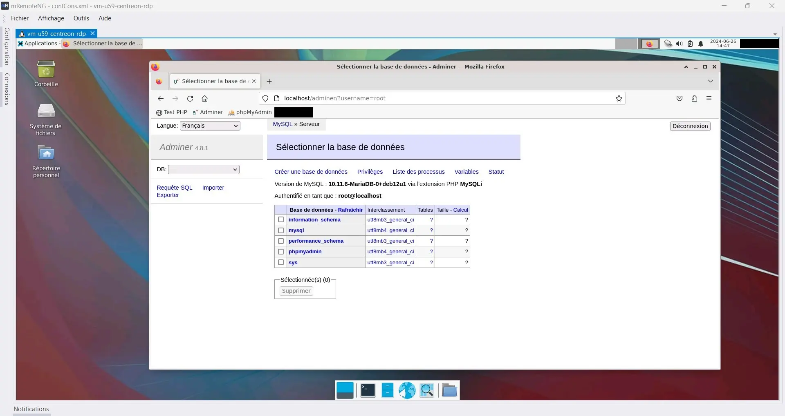
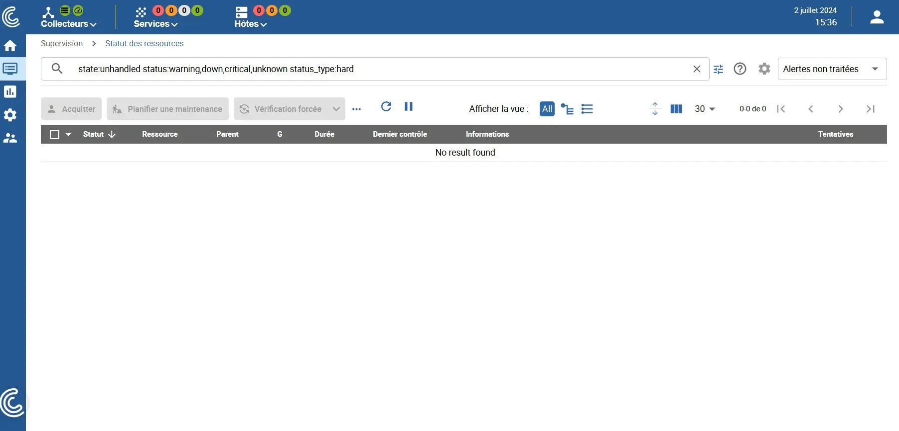
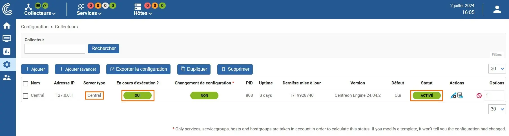

<figure markdown>
  { width="430" }
</figure>

## Centreon IT 100 - Partie 1

### Installation de Centreon

[Centreon](https://docs.centreon.com/fr/docs/installation/introduction/){ target="_blank" } peut superviser les PC d'un réseau local ainsi que les VM d'un réseau virtuel.

Son installation, à réaliser de préférence sur l'un des serveurs du réseau local disposant de VirtualBox, se fera à l'intérieur d'une VM Debian 12.

#### _- Création de la VM Debian 12_

S'aider du mémento [srvlan – VirtualBox / Debian 12](https://infoloup.no-ip.org/serveur-debian12-srvlan-creation/){ target="_blank" } pour créer la VM avec un bureau Xfce4.

Affecter ces valeurs lors de la création de la VM :

* Nom -> vm-centreon
* Taille de la mémoire -> 2048 Mo
* Emplacement du fichier et taille -> 20 Go
* Processeur -> 2 CPU
* Mode d'accès réseau -> Accès par pont _(carte 1)_

Affecter celles-ci lors de l'installation de l'OS Debian :

<!-- more -->

* Nom de machine -> `centreon`
* Identifiant ... compte utilisateur -> `user1`
* Cocher ... _Xfce_ (comme environnement de bureau)

Une fois Debian 12 installé, la VM reboot.

Se connecter et, comme pour la VM `srvlan`, autoriser l'usage de sudo à l'utilisateur `user1`.

Redémarrer la VM, se connecter et ajouter, comme pour `srvlan`, les utilitaires de VirtualBox.

Puis, s'aider du mémento [Contrôle à distance / Debian 12](https://infoloup.no-ip.org/acces-locaux-distants-debian12/#21_-_Installation_dun_serveur_RDP_sur_srvlan){ target="_blank" } pour installer un serveur xrdp.

Relever l'IP locale de la VM, elle sera utilisée pour configurer l'outil de connexion à distance.

Enfin, s'aider du mémento [LAMP HTTPS CMS / Debian 12 : 1/2](https://infoloup.no-ip.org/site-web-php-mysql-debian12/){ target="_blank" } pour installer un serveur Apache, PHP, MySQL ainsi que le gestionnaire de Bdd Adminer.

Stopper à présent la VM et la redémarrer sous VirtualBox en mode **Démarrage sans affichage**.

Celle-ci doit maintenant être accessible à distance depuis divers clients RDP :

<figure markdown>
  { width="430" }
  <figcaption>Centreon : Accès RDP depuis mRemoteNG</figcaption>
</figure>

Si tout est OK, il est possible d'installer Centreon IT.

#### _- Ajout de Centreon sur la VM_

La procédure présentée ci-dessous s'inspire de la [docs.centreon.com](../medias/Centreon2024-installation-deb12.pdf){ target="_blank" }.

Mettre à jour la Debian 12 :

```bash
sudo apt update 
sudo apt upgrade
```

et installer les dépendances concernant Centreon :

```bash
sudo apt install lsb-release ca-certificates apt-transport-https software-properties-common wget gnupg2 curl
```

Ajouter le dépôt de PHP 8.1, Debian utilisant PHP 8.2 :

```bash
su root

echo "deb https://packages.sury.org/php/ $(lsb_release -sc) main" | tee /etc/apt/sources.list.d/sury-php.list

wget -O- https://packages.sury.org/php/apt.gpg | gpg --dearmor | tee /etc/apt/trusted.gpg.d/php.gpg  > /dev/null 2>&1

apt update
```

Ne rien faire pour MySQL _(MariaDB)_ qui est déjà installé.

Ajouter le dépôt de Centreon :

```bash
echo "deb https://packages.centreon.com/apt-standard-24.04-stable/ $(lsb_release -sc) main" | tee /etc/apt/sources.list.d/centreon.list

echo "deb https://packages.centreon.com/apt-plugins-stable/ $(lsb_release -sc) main" | tee /etc/apt/sources.list.d/centreon-plugins.list

wget -O- https://apt-key.centreon.com | gpg --dearmor | tee /etc/apt/trusted.gpg.d/centreon.gpg > /dev/null 2>&1

apt update
```

et installer enfin le serveur Centreon :

```bash
apt install -y --no-install-recommends centreon-mariadb centreon

systemctl daemon-reload
systemctl restart mariadb
```

Configurer le serveur Apache comme suit :

```bash
sudo a2enmod proxy_fcgi setenvif
sudo a2enconf php8.1-fpm
sudo systemctl daemon-reload
sudo systemctl status apache2
```

Vérifiez le statut de MariaDB :

```bash
sudo systemctl status mariadb
```

Modifier le fuseau horaire comme suit :

```bash
echo "date.timezone = Europe/Paris" >> /etc/php/8.1/mods-available/centreon.ini
```

Editer ensuite le fichier _/etc/php/8.1/fpm/php.ini_, décommenter la ligne _date.timezone_ et lui affecter la même valeur que ci-dessus.

Redémarrer le service PHP-FPM

```bash
systemctl restart php8.1-fpm
```

Activer le démarrage automatique des services suivants au boot du système :

```bash
systemctl enable php8.1-fpm apache2 centreon cbd centengine gorgoned centreontrapd snmpd snmptrapd
```

Idem pour le service MariaDB :

```bash
systemctl enable mariadb
systemctl restart mariadb
```

Sécuriser l'accès aux Bdd du serveur MariaDB :

```bash
mysql_secure_installation
```

en répondant aux questions posées comme suit :

Enter ... password for root ... : **Appuyer sur Entrée**  
Switch to unix_socket authentication [Y/n] **n**

Change the root password? [Y/n] **y**  
New password: **Le MDP root pour MySQL**

Remove anonymous users? [Y/n] **y**  
Disallow root login remotely? [Y/n] **n**  
Remove test database and access to it? [Y/n] **y**  
Reload privilege tables now? [Y/n] **y**

Le système est maintenant prêt pour l'étape suivante.

#### _- Ajout de l'interface Web_

Ouvrir depuis le navigateur Web de la VM Debian 12 l'URL `http://localhost` :

Puis, suivre cette page de la [docs.centreon.com](../medias/Centreon2024-interface-web-deb12.pdf){ target="_blank" } jusqu'à la partie **Initialisation de la supervision**.

Deux minutes plus tard, il sera possible d'accéder au tableau de bord de Centreon :

<figure markdown>
  
  <figcaption>Centreon : Tableau de bord</figcaption>
</figure>

Cliquer sur l'icône située en haut et à droite du tableau de bord et sélectionner "Edit profile".

Modifier la langue à "fr_FR" et sauvegarder.

#### _- Initialisation supervision_

Puis, suivre la partie [Initialisation de la supervision](../medias/Centreon2024-interface-web-deb12.pdf){ target="_blank" } du même document que ci-dessus.

Si tout est OK, la page _Collecteurs_ montrera ceci :

<figure markdown>
  
  <figcaption>Centreon : Page Collecteurs</figcaption>
</figure>

#### _- Licence Centreon IT-100_

Suivre cette page de la [docs.centreon.com](../medias/Centreon2024-IT100-licence-deb12.pdf){ target="_blank" } pour obtenir la licence, la démarche est simple.

Il est possible ansi, depuis le serveur central Centreon, de superviser jusqu'à _100 hôtes_, un hôte étant un PC ou une VM disposant d'une adresse IP/DNS.

{ align=left }

&nbsp;  
Centreon est installé,  
la partie 2 traite de  
la supervision de serveurs  
NAS Synology et Qnap.

[Partie 2](../posts/centreon-it100-p2-deb12.md){ .md-button .md-button--primary }
