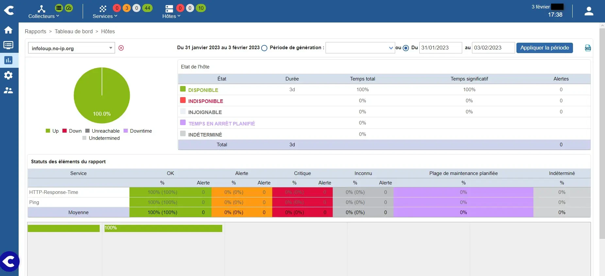
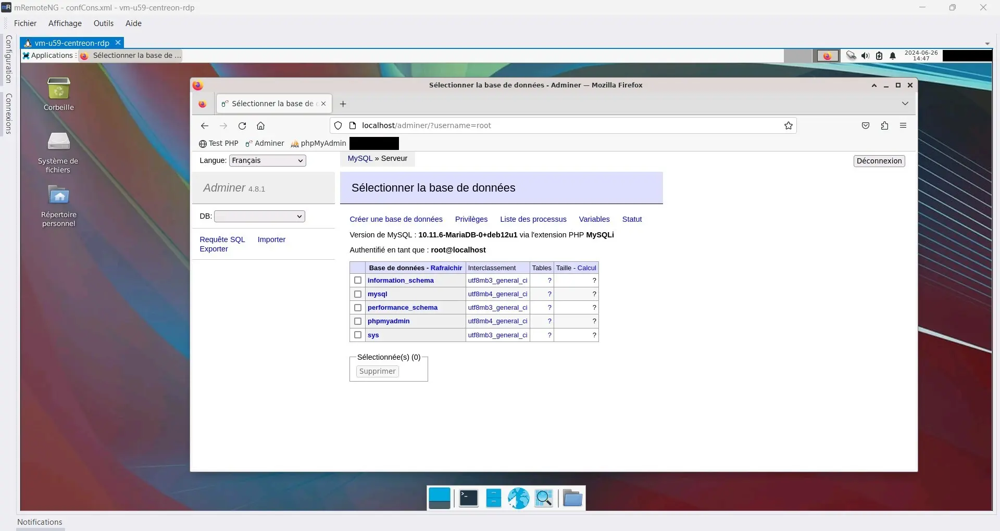
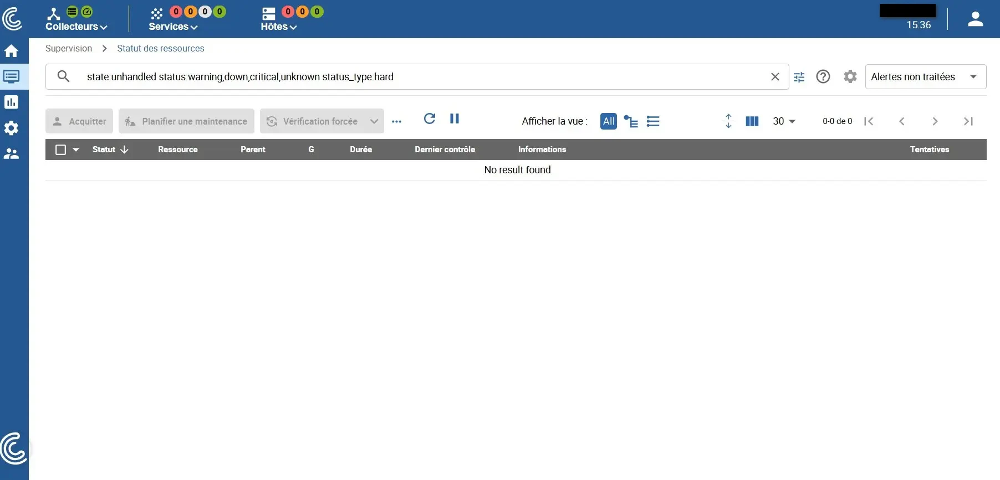
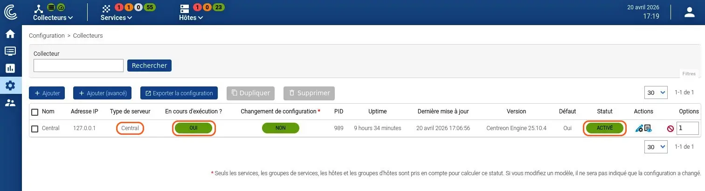

<figure markdown>
  { width="430" }
</figure>

## Centreon IT 100 - Partie 1

Le mémento concerne Centreon 25.10 sous Debian ≥ 12.13.

### Installation de Centreon

[Centreon](https://docs.centreon.com/fr/docs/installation/introduction/){ target="_blank" } pourra superviser les PC de votre réseau local ainsi que les VM de votre réseau virtuel.

Son installation à réaliser de préférence sur l'un des serveurs de votre réseau local disposant de VirtualBox se fera à l'intérieur d'une VM Debian 12.

#### _- Création de la VM Debian 12_

Aidez-vous de ce mémento [Debian 12/13](../../blog/posts/serveur-debian-srvlan-creation.md){ target="_blank" } pour créer votre VM **Debian 12** avec un bureau Xfce et une IP fixe.

Affectez ces valeurs lors de la création de la VM :

* Nom -> vm-centreon
* Taille de la mémoire -> 2048 Mo
* Emplacement du fichier et taille -> 20 Go
* Processeur -> 2 CPU
* Mode d'accès réseau -> Accès par pont _(carte 1)_

Affectez celles-ci lors de l'installation de l'OS Debian :

<!-- more -->

* Nom de machine -> centreon
* Identifiant ... compte utilisateur -> user1
* Cocher ... Xfce _(environnement de bureau)_

Une fois Debian installé, la VM reboot.

Celle-ci démarrée, connectez-vous et, comme pour la VM srvlan, autorisez l'usage de sudo à l'utilisateur user1.

Relancez la VM, connectez-vous de nouveau et ajoutez, comme pour srvlan, les utilitaires de VirtualBox.

Puis aidez-vous du mémento [Contrôle à distance](../../blog/posts/controle-distant-debian.md#rdp-srvlan){ target="_blank" } pour installer un serveur xrdp et relevez l'IP fixe de la VM car vous en aurez besoin pour configurer votre outil de connexion à distance.

Aidez-vous du mémento [LAMP HTTPS CMS](../../blog/posts/lamp-https-cms-partie-1-debian.md){ target="blank" } pour installer un serveur Apache + PHP _(php 8.2)_ + MySQL _(mariadb ≥ 10.11.14)_ ainsi que le gestionnaire de Bdd Adminer.

Pour finir, stoppez la VM et redémarrez-la depuis l'interface de VirtualBox en mode Démarrage sans affichage.

Celle-ci doit maintenant être accessible à distance depuis divers clients RDP :

<figure markdown>
  { width="430" }
  <figcaption>Centreon : Accès RDP depuis mRemoteNG</figcaption>
</figure>

Si tout est OK, vous voilà prêt pour installer Centreon IT sur la VM Debian 12.

#### _- Ajout de Centreon sur la VM_

La procédure ci-dessous s'inspire de la [docs.centreon.com](../medias/Centreon2025-installation-deb12.pdf){ target="_blank" }.

Mettez à jour la VM Debian depuis son terminal :

```bash
sudo apt update && apt upgrade
```

et installez les dépendances concernant Centreon :

```bash
sudo apt install lsb-release ca-certificates apt-transport-https software-properties-common wget gnupg2 curl
```

PHP et MariaDB avec son plugin unix_socket configuré de base ont été installés lors de la création de la VM.

Ajoutez ensuite en tant qu'**utilisateur root** le dépôt de Centreon version 25.10, importez sa clé et mettez à jour votre Debian :

```bash
su root

echo "deb https://packages.centreon.com/apt-standard/ $(lsb_release -sc)-25.10-stable main" | tee -a /etc/apt/sources.list.d/centreon-25.10-stable.list

echo "deb https://packages.centreon.com/apt-plugins-stable/ $(lsb_release -sc) main" | tee /etc/apt/sources.list.d/centreon-plugins.list

wget -O- https://apt-key.centreon.com | gpg --dearmor | tee /etc/apt/trusted.gpg.d/centreon.gpg > /dev/null 2>&1

apt update
```

Installez enfin le serveur Centreon :

```bash
apt install -y centreon-mariadb centreon

systemctl daemon-reload
systemctl restart mariadb
```

et configurez le serveur Apache comme suit :

```bash
sudo a2enmod proxy_fcgi setenvif
sudo a2enconf php8.2-fpm
sudo systemctl daemon-reload
sudo systemctl status apache2
```

Vérifiez le statut de MariaDB :

```bash
sudo systemctl status mariadb
```

Activez le démarrage des services suivants au boot du système :

```bash
systemctl enable php8.2-fpm apache2 centreon cbd centengine gorgoned centreontrapd snmpd snmptrapd
```

Idem pour le service MariaDB :

```bash
systemctl enable mariadb
systemctl restart mariadb
```

Pour autoriser une connexion distante sur le serveur MariaDB, éditez le fichier 50-server.cnf :

```bash
cd /etc/mysql/mariadb.conf.d
nano 50-server.cnf
```

et remplacez la ligne bind-address = 127.0.0.1 par :

```markdown
bind-address = IP de votre serveur MariaDB 
```

Quittez root et pour par la suite pouvoir installer la parte Web, accédez au serveur MariaDB :

```bash
exit
sudo mariadb
```

et entrez cette instruction pour créer par exemple un utilisateur de nom centadmin :

```markdown
CREATE USER 'centadmin'@'localhost' IDENTIFIED VIA mysql_native_password USING PASSWORD('VotreMDP'); 
```

Puis entrez cette instruction pour lui donner tous les droits sur les Bdd de MariaDB :

```markdown
GRANT ALL PRIVILEGES ON *.* TO 'centadmin'@'localhost' WITH GRANT OPTION; 
```

Enfin validez ses droits :

```markdown
FLUSH PRIVILEGES; 
```

Vous êtes maintenant prêt pour l'étape suivante.

#### _- Ajout de l'interface Web_

Ouvrez depuis le navigateur Web de la VM Debian l'URL `http://localhost` :

Puis, suivez cette page de la [docs.centreon.com](../medias/Centreon2025-interface-web-deb12.pdf){ target="_blank" } jusqu'à la partie Initialisation de la supervision.

!!! note "Nota"
    Entrez pour le compte Root user/password l'utilisateur centadmin et son MDP créés ci-dessus.

Deux minutes plus tard, vous devriez pouvoir accéder au tableau de bord de Centreon :

<figure markdown>
  { width="430" }
  <figcaption>Centreon : Tableau de bord</figcaption>
</figure>

Cliquez sur l'icône située en haut et à droite du tableau de bord et sélectionnez Edit profile.

Modifiez la langue à fr_FR et sauvegardez.

#### _- Initialisation supervision_

Suivez la partie [Initialisation de la supervision](../medias/Centreon2025-interface-web-deb12.pdf){ target="_blank" } du même document que ci-dessus.

Si tout est OK, la page Collecteurs montrera ceci :

<figure markdown>
  { width="430" }
  <figcaption>Centreon : Page Collecteurs</figcaption>
</figure>

#### _- Licence Centreon IT-100_

Suivez cette page de la [docs.centreon.com](../medias/Centreon2025-IT100-licence-deb12.pdf){ target="_blank" } pour obtenir votre licence, la démarche est simple.

Vous pourrez ainsi, depuis votre serveur central Centreon, superviser jusqu'à 100 hôtes, un hôte étant un PC ou une VM disposant d'une adresse IP/DNS.

{ align=left }

&nbsp;  
Maintenant que Centreon est  
installé, la partie 2 vous attend  
pour découvrir la supervision de  
serveurs NAS Synology et Qnap.

[Partie 2](../posts/centreon-it100-p2-deb12.md){ .md-button .md-button--primary }
