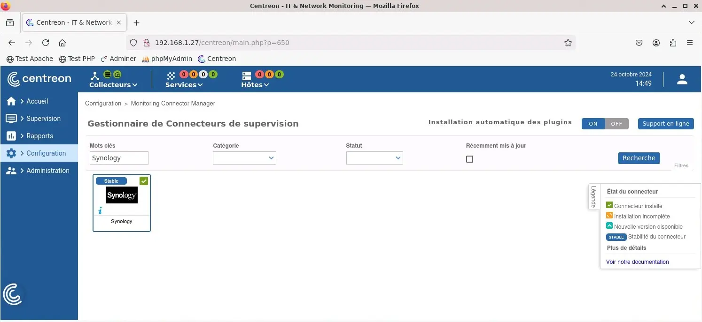
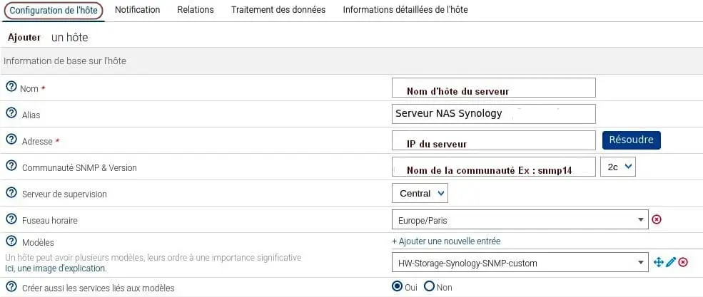
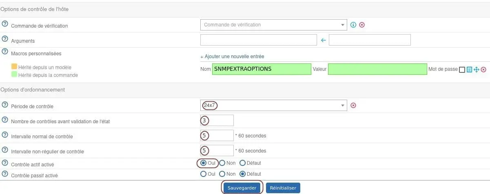
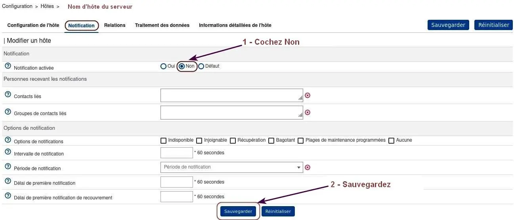
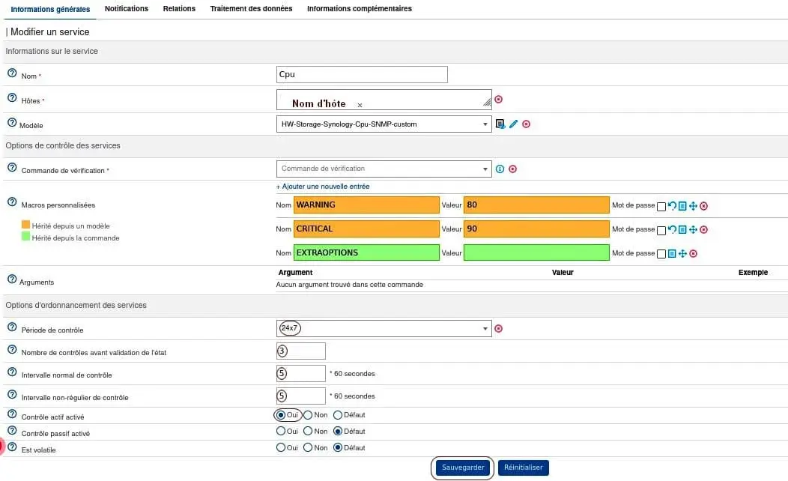
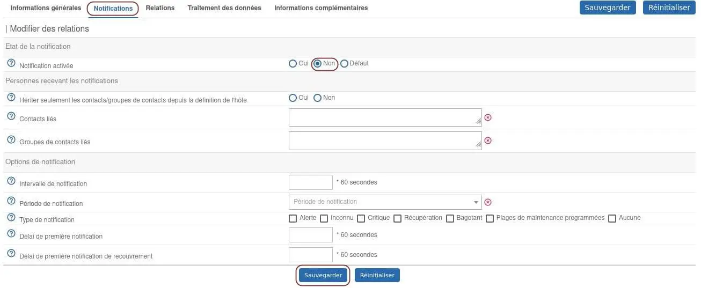
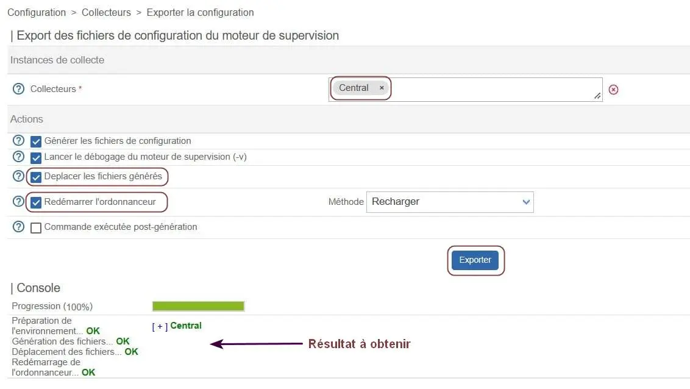
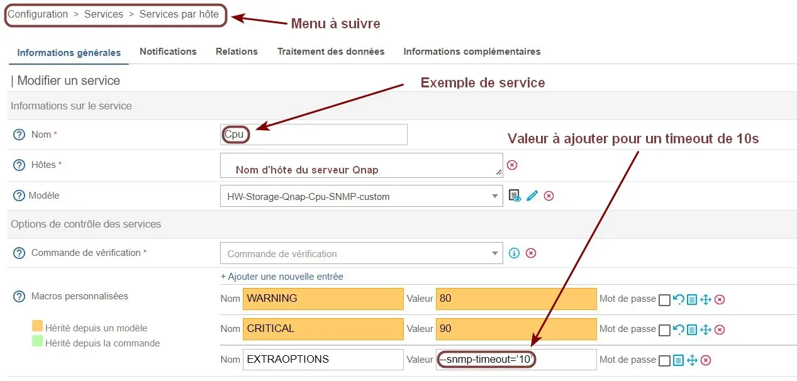
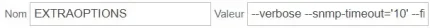

<figure markdown>
  { width="430" }
</figure>

## Centreon IT 100 - Partie 2

### Supervision de serveurs NAS

Découvrir d'abord l'interface Web de Centreon ainsi que les éléments supervisés par celle-ci.

#### _- Interface Web de Centreon_

Menu de gauche :  
Accueil = Vues personnalisées _(aucune de base)_  
Supervision = Etats/Journaux des éléments supervisés  
Rapports = Diagrammes de vue sur des temps donnés  
Configuration = Paramètres des éléments supervisés  
Administration = Gestion de Centreon, des plugins, etc...

Bandeau supérieur - Zone Collecteurs :  
Vert = Le collecteur envoie ses données au central

Bandeau supérieur - Zone Services :  
4 couleurs = Etat Critique/Alerte/Inconnu/OK

Bandeau supérieur - Zone Hôtes :  
3 couleurs = Etat Indisponible/Injoignable/OK

#### _- Eléments supervisés_

<!-- more -->

Hôte = Elément avec une adresse IP/DNS _(Ex: Serveur)_  
Service = Elément supervisé sur un hôte _(Ex: Cpu)_

Les valeurs de chaque élément sont récupérées par des sondes _(plugins)_ exécutées périodiquement par le collecteur _(Centreon Engine)_.

Le statut des hôtes/services est accessible depuis le menu Supervision -> Statut des ressources.

Des outils appelés modèles d'hôtes et de services ou Connecteurs de supervision facilitent la configuration des hôtes et services à superviser.

La licence Centreon IT-100 permet la découverte automatique d'hôtes et de services.

#### _- Supervision d'un Synology_{#super-syno}

Au préalable, installer le paquet Centreon suivant :

```bash
sudo apt install centreon-plugin-hardware-storage-synology-snmp
```

Ensuite :  
-- Côté serveur NAS --  
Activer le serveur SNMP.  
Activer les protocoles SNMPv1 SNMPv2c.  
Nommer la communauté SNMP _(Ex: snmp14)_.

-- Côté Plateforme Centreon IT-100 --  
-> Menu Configuration -> Monitoring Connector Manager  
-> Champ Mots clés -> Entrer Synology  
-> Bouton Recherche

-> Cliquer sur le + du connecteur trouvé pour l'installer  
-> Bouton Appliquer

<figure markdown>
  { width="430" }
  <figcaption>Centreon : Connecteur Synology installé</figcaption>
</figure>

Une fois le connecteur installé, créer l'hôte NAS :  
-> Menu Configuration -> Hôtes -> Hôtes  
-> Bouton Ajouter

Remplir l'onglet Configuration de l'hôte comme ceci :

<figure markdown>
  { width="430" }
  <figcaption>Centreon : Informations de base sur l'hôte</figcaption>
</figure>

<figure markdown>
  { width="430" }
  <figcaption>Centreon : Options contrôle hôte/ordonnancement</figcaption>
</figure>

Remplir ensuite l'onglet Notification comme ceci :

<figure markdown>
  { width="430" }
  <figcaption>Centreon : Notification par email désactivée</figcaption>
</figure>

Ensuite, configurer les services associés à l'hôte :  
-> Menu Configuration  
-> Services -> Services par l'hôte  
-> Cliquer sur la roue dentée de chaque service

-> Onglet Informations générales  
Configurer une période de contrôle

Exemple pour le service Cpu :

<figure markdown>
  { width="430" }
  <figcaption>Centreon : Période de contrôle du Cpu configurée</figcaption>
</figure>

-> Onglet Notifications  
Configurer la notification par email à Non :

<figure markdown>
  { width="430" }
  <figcaption>Centreon : Notification du service Cpu désactivée</figcaption>
</figure>

sauf pour le service Ping qui sera coché à Oui :

<figure markdown>
  { width="430" }
  <figcaption>Centreon : Notification du service Ping activée</figcaption>
</figure>

Pour finir, déployer la nouvelle configuration :  
-> Menu Configuration -> Collecteurs  
-> Collecteurs -> Cocher le collecteur Central  
-> Bouton Exporter la configuration

Zone Actions :  
-> Cocher Déplacer les fichiers générés  
-> Cocher Redémarrer l'ordonnanceur  
-> Bouton Exporter

<figure markdown>
  { width="430" }
  <figcaption>Centreon : Déploiement de la nouvelle configuration</figcaption>
</figure>

#### _- Supervision d'un Qnap_

Au préalable, installer le paquet Centreon suivant :

```bash
sudo apt install centreon-plugin-hardware-storage-qnap-snmp
```

Installer ensuite, depuis l'interface Web de Centreon, le connecteur de supervision Qnap et procéder à la configuration du serveur NAS comme ci-dessus.

Le tout fini et fonctionnel, on peut observer sur certains services les retours suivants :

```markdown
UNKNOWN: SNMP Get Request: Timeout
```

```markdown
UNKNOWN: SNMP Table Request: Timeout
```

Pour le premier cas, modifier le timeout du service concerné peut suffire, exemple pour le Cpu :

<figure markdown>
  { width="430" }
  <figcaption>Centreon : Timeout du service Cpu modifié à 10s</figcaption>
</figure>

Pour info, Centreon obtient les informations du service Cpu à l'aide de la Cde suivante :

```bash
/usr/lib/centreon/plugins//centreon_qnap.pl --plugin=storage::qnap::snmp::plugin --mode=cpu --hostname=192.168.9.1 --snmp-version='2c' --snmp-community='snmp14'  --warning-average='80' --critical-average='90' --snmp-timeout='10'
```

Les services Hardware-Global et Volumes ont, dans mon cas, nécessité l'ajout d'options dans les Cdes du plugin de Centreon pour fonctionner.

Options --filter pour le service Hardware-Global :

```bash
/usr/lib/centreon/plugins//centreon_qnap.pl --plugin=storage::qnap::snmp::plugin --mode=hardware --hostname=192.168.9.1 --snmp-version='2c' --snmp-community='snmp14'  --component='.*' --verbose --snmp-timeout='10' --filter='disk,3' --filter='raid'
```

La première option exclut le contrôle du disque d'instance 3, la seconde exclut celui du raid.

Option --force-counters-legacy pour le service Volumes :

```bash
/usr/lib/centreon/plugins//centreon_qnap.pl --plugin=storage::qnap::snmp::plugin --mode=volumes --hostname='192.168.9.1' --snmp-version='2c' --snmp-community='snmp14'  --filter-name='' --warning-space-usage='' --critical-space-usage='' --warning-space-usage-free='' --critical-space-usage-free='' --warning-space-usage-prct='' --critical-space-usage-prct='' --warning-volume-status='%{status} =~ /degraded|warning/i' --critical-volume-status='%{status} =~ /critical/i' --verbose --snmp-timeout='10'  --force-counters-legacy
```

L'option impose l'usage d'anciens compteurs, à utiliser lorsque ceux du Qnap ne répondent pas.

L'ajout d'options placées les unes après les autres au niveau de l'interface Web de Centreon se fait dans le champ Valeur de EXTRAOPTIONS :

<figure markdown>
  
  <figcaption>Centreon : Ajout d'options pour un service</figcaption>
</figure>

Autre point important, le SNMP du Qnap dispose d'un limiteur de débit et d'une protection DDoS.

Les valeurs par défaut de ces paramètres sont :

```markdown
MaxPacketPerSecond 300
EnableDetectDDoS TRUE
```

En cas d'alerte sur le Qnap, se connecter en SSH sur celui-ci et entrer les Cdes suivantes :

```bash
sudo setcfg SNMP MaxPacketPerSecond 1000
sudo setcfg SNMP EnableDetectDDoS FALSE
sudo /etc/init.d/snmp restart
```

On peut contrôler la modification dans ce fichier :

```bash
cat /etc/config/uLinux.conf
```

{ align=left }

&nbsp;  
Voilà pour les serveurs NAS.  
La partie 3 traite cette fois  
de la supervision des  
OS Debian et Windows.

[Partie 3](../posts/centreon-it100-p3-deb12.md){ .md-button .md-button--primary }
