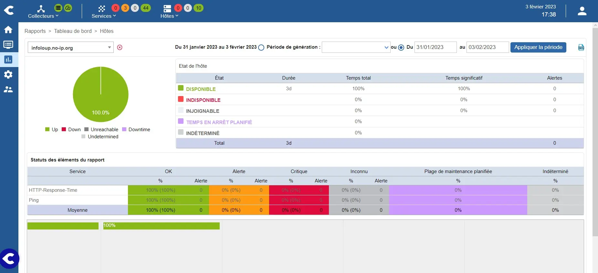
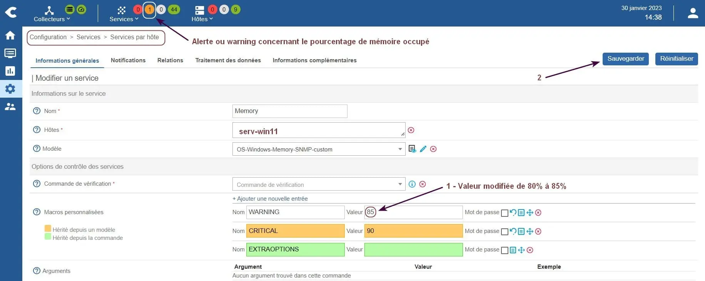

<figure markdown>
  { width="430" }
</figure>

## Centreon IT 100 - Partie 3

### Supervision d'un OS Debian

#### _- Notes sur le protocole SNMP_

SNMP = Simple Network Management Protocol  
MIB = Management Information Base  
OID = Object IDentifier

Le protocole SNMP s’appuie sur un manager et des agents, ces derniers permettant de récupérer des informations _(valeurs)_ sur différents objets.

Les MIBs sont exploitées par le SNMP pour accéder aux informations. Chaque objet SNMP _(périphérique ou élément d'OS)_ dispose d’une MIB.

Les OIDs de forme numérique 1.3.6.1.2... désignent l’emplacement des informations _(valeurs)_ à consulter dans une MIB.

Cdes SNMP de base émises par le manager :  
GET = demande d'une valeur à un agent.  
GET-NEXT = demande de la valeur suivante.  
GET-BULK = demande groupée de valeurs.  
SET = modifie une valeur contenue dans un OID.

Cdes SNMP de base émises par l'agent :  
GET-RESPONSE = répond à GET ou SET.  
TRAP = envoi d'une notification au manager.

Debian utilise les applications suivantes pour lancer les Cdes ci-dessus :

<!-- more -->

* snmpget
* snmpwalk
* snmpbulkget
* snmpset
* snmptrap

#### _- Installation et réglage SNMP_{#super-debian}

Commencer par ajouter le dépôt non-free dans le fichier /etc/apt/sources.list.

Exemple pour Debian 12 :

```markdown hl_lines="1"
deb http://deb.debian.org/debian/ bookworm main non-free-firmware non-free

deb http://security.debian.org/debian-security bookworm-security main non-free-firmware

deb http://deb.debian.org/debian/ bookworm-updates main non-free-firmware
```

Installer ensuite le paquet qui sera exploité pour observer les OIDs depuis la Cde snmpwalk :

```bash
sudo apt update && upgrade
sudo apt install snmp-mibs-downloader
```

La partie ci-dessous s'inspire de la [docs.centreon.com](../medias/Centreon-supervision-serveur-linux.pdf){ target="_blank" }.

Paramètres utilisés pour l'exemple :  
Nom de la communauté SNMP = snmp14  
IP de l'OS Debian = 192.168.9.3

Installer les paquets SNMP suivants :

```bash
sudo apt install snmp snmpd libsnmp-perl
```

Puis, éditer le fichier de configuration snmpd.conf :

```bash
sudo nano /etc/snmp/snmpd.conf
```

et modifier son contenu comme suit :

```markdown
agentaddress udp:161
view centreon included .1.3.6.1
view    systemonly    included   .1.3.6.1.2.1.1
view    systemonly    included   .1.3.6.1.2.1.25.1
#rocommunity public ...
#rocommunity6 public ...
rocommunity snmp14 default # ou snmp14 192.168.9.0/24
```

Par prudence, garder une seule ligne d'instruction rocommunity, commenter les autres.

Démarrer enfin le service et vérifier son statut :

```bash
sudo systemctl start snmpd
sudo systemctl status snmpd
```

Si statut Ok, activer le service au boot du système :

```bash
sudo systemctl enable snmpd
```

Vérifier par curiosité l'ouverture du port SNMP 161 :

```bash
ss -ulnp | grep 161
```

Retour Debian 11 :

```markdown
UNCONN   0   0   0.0.0.0:161   0.0.0.0:*
```

Retour Debian 12 :

```markdown
UNCONN 0   0  127.0.0.1:161   0.0.0.0:*          
UNCONN 0   0      [::1]:161      [::]:*
```

Pour finir, vérifier le bon fonctionnement de SNMP :

```bash
snmpwalk -c snmp14 -v 2c 192.168.9.3
```

La liste des OIDs de l'agent SNMP doit s'afficher.

#### _- Réglage côté VM Centreon_

Vérifier l'installation du paquet centreon-plugin-operatingsystems-linux.snmp, à défaut réaliser celle-ci.

Installer le connecteur de supervision Linux SNMP et configurer l'hôte Debian et les services associés en utilisant cette fois le modèle OS-Linux-SNMP-custom.

S'aider de l'exemple du NAS Synology pour y arriver ([réf : Centreon - Partie 2](../posts/centreon-it100-p2-deb12.md#super-syno){ target="_blank" }).

Ne pas oublier ensuite de déployer la nouvelle configuration.

### Supervision d'un OS Windows

Comme pour Debian, il est nécessaire d'installer un agent SNMP sur Windows.

La partie ci-dessous s'inspire de la [docs.centreon.com](../medias/Centreon-supervision-serveur-windows.pdf){ target="_blank" }.

#### _- Installation de l'agent SNMP_

-> Touches Windows + I pour ouvrir les paramètres  
-> Système -> Fonctionnalités facultatives  
-> Bouton Afficher les fonctionnalités

Une fenêtre Ajouter une fonctionnalité ... s'ouvre :  
-> Champ Recherche -> Entrer snmp  
-> Cocher Protocole SNMP _(Simple Network ...)_  
-> Bouton Suivant -> Bouton Installer

L'installation peut durer de 2 à 4 minutes.

#### _- Réglage du service SNMP_

-> Touches Windows + R pour ouvrir la fenêtre Exécuter  
-> Entrer services.msc -> OK

Une fenêtre Services s'ouvre :  
Double-cliquer sur le service Service SNMP

Une fenêtre Propriétés de Service SNMP s'ouvre :  
-- Onglet Sécurité --  
-> Ajouter la communauté snmp14  
-> Ajouter l'IP du manager Centreon

-- Onglet Agent --  
-> Rubrique Service  
-> Cocher les données que collectera Centreon

-> Bouton Appliquer -> OK  
-> Redémarrer le service  
-> Fermer la fenêtre Services

#### _- Réglage côté VM Centreon_

Vérifier l'installation du paquet centreon-plugin-operatingsystems-windows.snmp, à défaut réaliser celle-ci.

Installer le connecteur de supervision Windows SNMP et configurer l'hôte Windows et les services associés en utilisant cette fois le modèle OS-Windows-SNMP-custom.

S'aider de l'exemple du NAS Synology pour y arriver ([réf : Centreon - Partie 2](../posts/centreon-it100-p2-deb12.md#super-syno){ target="_blank" }).

Ne pas oublier ensuite de déployer la nouvelle configuration.

Vérifier après quelques minutes le statut de l'hôte et des services associés, personnellement, un seul statut Alerte concernant la ressource Memory.

Alerte normale après vérification de la taille mémoire utilisée par le PC Windows.

Pour contourner l'alerte, il a fallu modifier le seuil de celle-ci et redéployer la configuration :

<figure markdown>
  { width="430" }
  <figcaption>Centreon : Réglage du seuil d'alerte du service Memory</figcaption>
</figure>

#### _- Découverte de services_

Le connecteur de supervision Windows SNMP a permis, lors de la création de l'hôte, d'activer automatiquement les services suivants : Cpu, Memory, Ping et Swap.

Les connecteurs peuvent inclure des modèles de services autres que ceux configurés de base.

Pour découvrir ceux du connecteur de supervision Windows SNMP, procéder comme suit :

<figure markdown>
  { width="430" }
  <figcaption>Centreon : Ajout du service disponible Disk-C</figcaption>
</figure>

Les services sélectionnés sont alors automatiquement ajoutés à l'hôte Windows.

Configurer ensuite chacun d'eux et redéployer la nouvelle configuration.

{ align=left }

&nbsp;  
Les choses avancent. La partie  
4 exploitera le module de  
découverte automatique  
d'hôtes et de services.

[Partie 4](../posts/centreon-it100-p4-deb12.md){ .md-button .md-button--primary }
