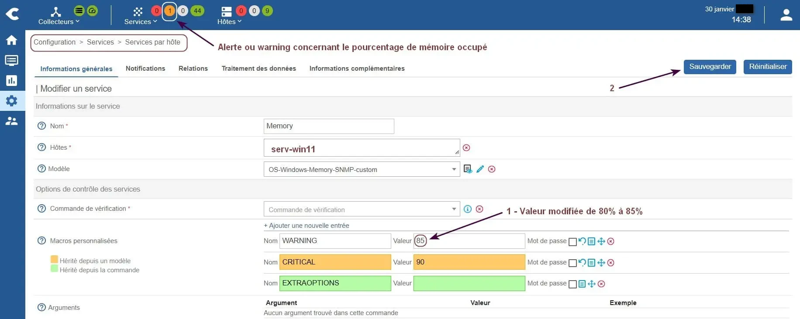
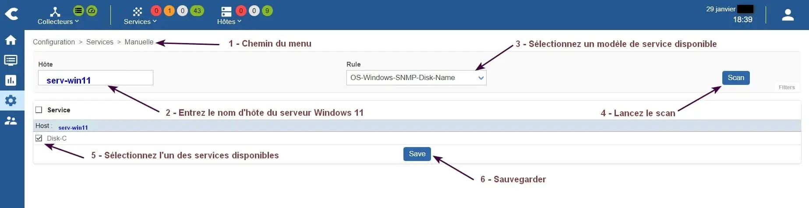

<figure markdown>
  { width="430" }
</figure>

## Centreon IT 100 - Partie 3

Le mémento concerne Centreon 25.10 sous Debian ≥ 12.13.

### Supervision d'un OS Debian

#### _- Notes sur le protocole SNMP_

SNMP = **S**imple **N**etwork **M**anagement **P**rotocol  
MIB = **M**anagement **I**nformation **B**ase  
OID = **O**bject **I**Dentifier

Le protocole [SNMP](https://fr.wikipedia.org/wiki/Simple_Network_Management_Protocol){ target="blank" } s’appuie sur un manager et des agents, ces derniers permettant de récupérer des informations _(valeurs)_ sur différents objets.

Les MIBs sont exploitées par le SNMP pour accéder aux informations. Chaque objet SNMP _(périphérique ou élément d'OS)_ dispose d’une MIB.

Les OIDs de forme numérique 1.3.6.1.2... désignent l’emplacement des informations _(valeurs)_ à consulter dans une MIB.

Cdes SNMP de base émises par le manager :  
GET = demande d'une valeur à un agent.  
GET-NEXT = demande de la valeur suivante.  
GET-BULK = demande groupée de valeurs.  
SET = modifie une valeur contenue dans un OID.

Cdes SNMP de base émises par l'agent :  
GET-RESPONSE = répond à GET ou SET.  
TRAP = envoi d'une notification au manager.

Debian utilise les applications suivantes pour lancer les Cdes ci-dessus :

<!-- more -->

* snmpget
* snmpwalk
* snmpbulkget
* snmpset
* snmptrap

#### _- Installation et réglage SNMP_{#super-debian}

Commencez par ajouter le dépôt non-free dans le fichier /etc/apt/sources.list.

Exemple pour Debian 12 :

```markdown hl_lines="1"
deb http://deb.debian.org/debian/ bookworm main non-free-firmware non-free

deb http://security.debian.org/debian-security bookworm-security main non-free-firmware

deb http://deb.debian.org/debian/ bookworm-updates main non-free-firmware
```

Installez ensuite le paquet qui sera exploité pour observer les OIDs depuis la Cde snmpwalk :

```bash
sudo apt update && upgrade
sudo apt install snmp-mibs-downloader
```

La partie ci-dessous s'inspire de la [docs.centreon.com](../medias/Centreon-supervision-serveur-linux.pdf){ target="_blank" }.

Paramètres utilisés pour l'exemple :  
Nom de la communauté SNMP = snmp14  
IP de l'OS Debian = 192.168.9.3

Installez les paquets SNMP suivants :

```bash
sudo apt install snmp snmpd libsnmp-perl
```

Puis, éditez le fichier de configuration snmpd.conf :

```bash
sudo nano /etc/snmp/snmpd.conf
```

et modifiez son contenu comme suit :

```markdown
agentaddress udp:161
view centreon included .1.3.6.1
view    systemonly    included   .1.3.6.1.2.1.1
view    systemonly    included   .1.3.6.1.2.1.25.1
#rocommunity public ...
#rocommunity6 public ...
rocommunity snmp14 default # ou snmp14 192.168.9.0/24
```

Par prudence, gardez une seule ligne d'instruction rocommunity, commentez les autres.

Démarrez enfin le service et vérifiez son statut :

```bash
sudo systemctl start snmpd
sudo systemctl status snmpd
```

Si statut Ok, activez le service au boot du système :

```bash
sudo systemctl enable snmpd
```

Vérifiez par curiosité l'ouverture du port SNMP 161 :

```bash
ss -ulnp | grep 161
```

Retour normal :

```markdown
UNCONN   0   0   0.0.0.0:161   0.0.0.0:*
```

Pour finir, vérifiez le bon fonctionnement de SNMP :

```bash
snmpwalk -c snmp14 -v 2c 192.168.9.3
```

La liste des OIDs de l'agent SNMP doit s'afficher.

#### _- Réglage côté VM Centreon_

Vérifiez l'installation du paquet centreon-plugin-operatingsystems-linux.snmp, à défaut réalisez celle-ci.

Installez le connecteur de supervision Linux SNMP et configurez l'hôte Debian et les services associés en utilisant cette fois le modèle OS-Linux-SNMP-custom.

Vous pouvez vous aider de l'exemple du NAS Synology pour y arriver ([réf : Centreon - Partie 2](../posts/centreon-it100-p2-deb12.md#super-syno){ target="_blank" }).

N'oubliez pas pour terminer de déployer la nouvelle configuration.

### Supervision d'un OS Windows

Comme pour Debian, il est nécessaire d'installer un agent SNMP sur Windows.

La partie ci-dessous s'inspire de la [docs.centreon.com](../medias/Centreon-supervision-serveur-windows.pdf){ target="_blank" }.

#### _- Installation de l'agent SNMP_

Exemple pour un Windows 11 version 25H2 :  
-> Touches Windows + I pour ouvrir les paramètres  
-> Système -> Fonctionnalités facultatives  
-> Bouton Afficher les fonctionnalités

Une fenêtre Afficher les fonctionnalités ... s'ouvre :  
-> Cliquez sur le lien Afficher les fonctionnalités disponibles  
-> Champ Recherche une fonction... -> Entrez _snmp_  
-> Cochez Protocole SNMP _(Simple Network ...)_  
-> Bouton _Ajouter_

L'installation peut durer de 2 à 4 minutes.

#### _- Réglage du service SNMP_

-> Touches Windows + R pour ouvrir la fenêtre Exécuter  
-> Entrez services.msc -> OK

Une fenêtre Services s'ouvre :  
Double-cliquez sur le service Service SNMP

Une fenêtre Propriétés de Service SNMP s'ouvre :  
-- Onglet Sécurité --  
-> Ajoutez la communauté snmp14  
-> Ajoutez l'IP du manager Centreon

-- Onglet Agent --  
-> Rubrique Service  
-> Cochez les données que collectera Centreon

-> Bouton Appliquer -> OK  
-> Redémarrer le service  
-> Fermez la fenêtre Services

#### _- Réglage côté VM Centreon_

Vérifiez l'installation du paquet centreon-plugin-operatingsystems-windows.snmp, à défaut réalisez celle-ci.

Installez le connecteur de supervision Windows SNMP et configurez l'hôte Windows et les services associés en utilisant cette fois le modèle OS-Windows-SNMP-custom.

Vous pouvez vous aider de l'exemple du NAS Synology pour y arriver ([réf : Centreon - Partie 2](../posts/centreon-it100-p2-deb12.md#super-syno){ target="_blank" }).

N'oubliez pas pour terminer de déployer la nouvelle configuration.

Vérifiez après quelques minutes le statut de l'hôte et des services associés, personnellement, un seul statut Alerte concernant la ressource Memory.

Alerte normale après vérification de la taille mémoire utilisée par le PC Windows.

Pour contourner l'alerte, il a fallu modifier le seuil de celle-ci et redéployer la configuration :

<figure markdown>
  { width="430" }
  <figcaption>Centreon : Réglage du seuil d'alerte du service Memory</figcaption>
</figure>

#### _- Découverte de services_

Le connecteur de supervision Windows SNMP a permis, lors de la création de l'hôte, d'activer automatiquement les services suivants : Cpu, Memory, Ping et Swap.

Les connecteurs peuvent inclure des modèles de services autres que ceux configurés de base.

Pour découvrir ceux du connecteur de supervision Windows SNMP, procédez comme suit :

<figure markdown>
  { width="430" }
  <figcaption>Centreon : Ajout du service disponible Disk-C</figcaption>
</figure>

Les services sélectionnés sont alors automatiquement ajoutés à l'hôte Windows.

Configurez ensuite chacun d'eux et redéployez la nouvelle configuration.

{ align=left }

&nbsp;  
On avance. La partie 4 vous  
attend pour exploiter le module  
de découverte automatique  
d'hôtes et de services.

[Partie 4](../posts/centreon-it100-p4-deb12.md){ .md-button .md-button--primary }
