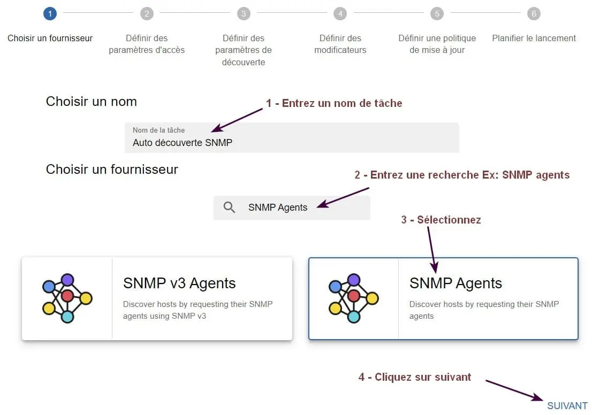
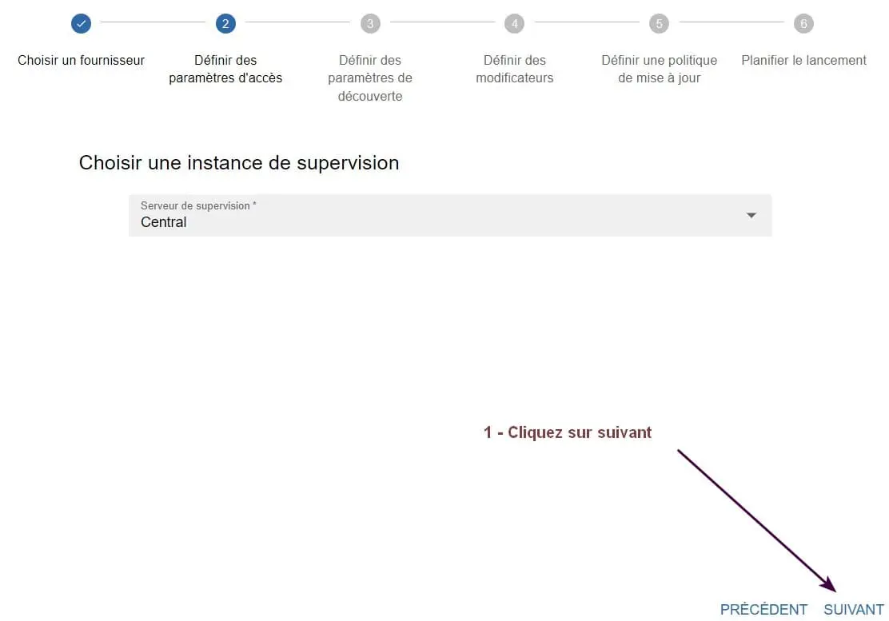
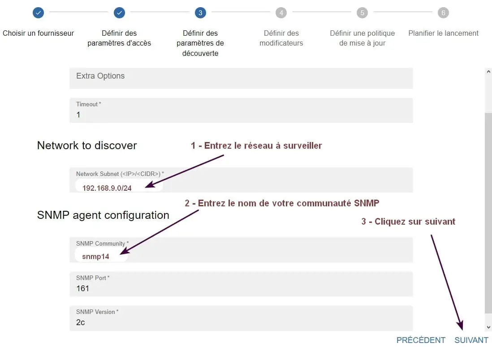
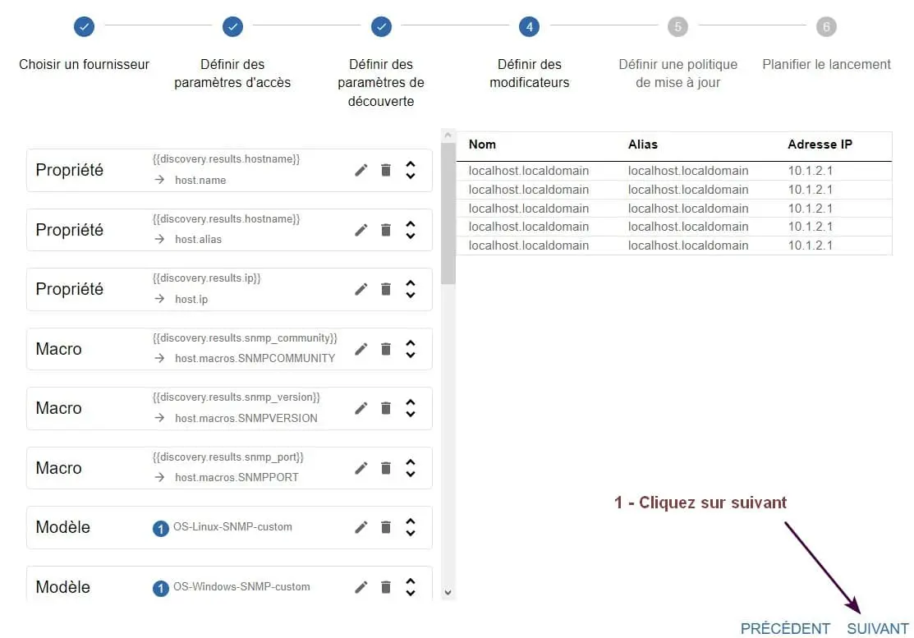
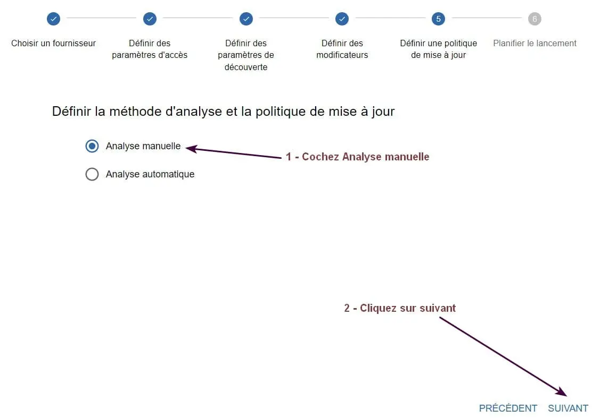
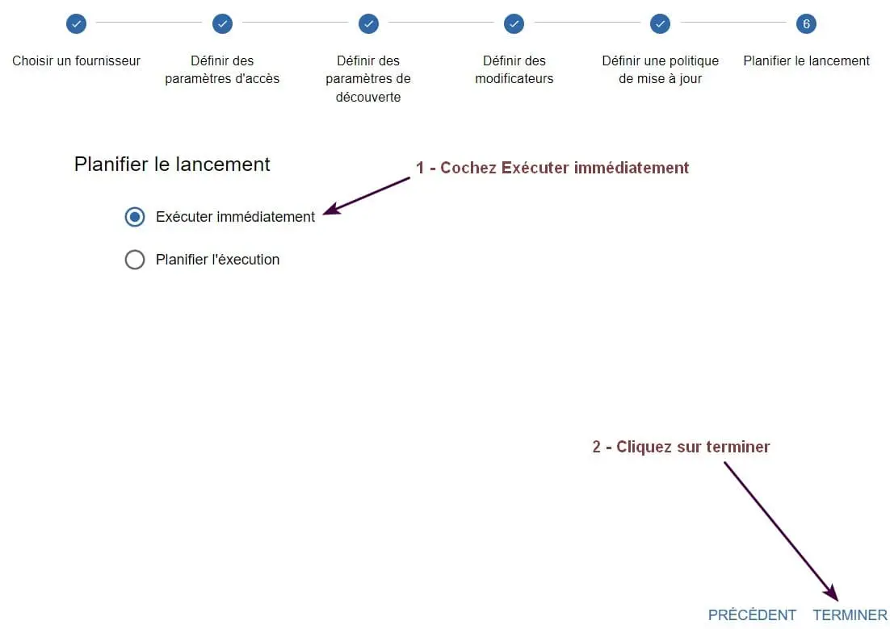
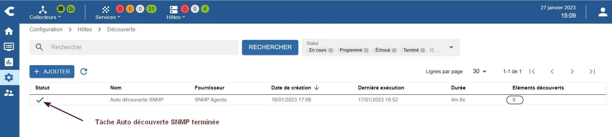
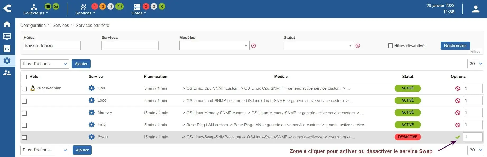

<figure markdown>
  { width="430" }
</figure>

## Centreon IT 100 - Partie 4

Le mémento concerne Centreon 25.10 sous Debian ≥ 12.13.

### Centreon Auto Discovery

Le module de découverte automatique inclus dans la licence Centreon IT-100 permet de détecter de nouveaux hôtes ou services via le protocole [SNMP](https://fr.wikipedia.org/wiki/Simple_Network_Management_Protocol){ target="_blank" }.

Attention, les hôtes ne sont découverts que si un agent SNMP est installé sur chacun d'eux.

En ce qui me concerne, 5 agents ont été répartis sur 1 serveur, 3 VM et 1 conteneur LXD, tous sous Debian et dans la communauté snmp14.

Commencez par installer vos agents en vous référant à la [Partie 3](../posts/centreon-it100-p3-deb12.md#super-debian){ target="_blank" }.

Vérifiez ensuite que le [module](../medias/Centreon-module-decouverte-auto.pdf){ target="_blank" } Auto Discovery fourni avec la [licence](../medias/Centreon2025-IT100-licence-deb12.pdf){ target="_blank" } IT-100 est bien installé :  
-- Interface Web de Centreon --  
-> Menu Administration -> Extensions -> Gestionnaire  

Si manquant, ajoutez le module comme suit :

```bash
sudo apt install centreon-auto-discovery-server
```

<!-- more -->

Puis vérifiez de nouveau dans l'interface Web de Centreon.

#### _- Connecteur Generic SNMP_

Vous utiliserez, pour détecter les nouveaux hôtes, le connecteur de supervision Generic SNMP qui fait partie des connecteurs permettant l'auto-découverte, voir la [docs.centreon.com](../medias/Centreon-pack-generic-SNMP.pdf){ target="_blank" }.

Pour cela, commencez par installer ce paquet :

```bash
sudo apt install centreon-plugin-applications-protocol-snmp
```

puis le connecteur de supervision en se référant au [paragraphe Supervision d'un Synology](../posts/centreon-it100-p2-deb12.md#super-syno){ target="_blank" } de la Partie 2.

Relancez par précaution les services de Centreon :

```bash
sudo systemctl restart cbd centengine gorgoned
```

#### _- Tâche d'auto-découverte_

Créez à présent une tâche d'auto-découverte depuis l'interface Web comme ci-dessous :  
-> Configuration -> Hôtes  
-> Découverte -> Bouton _+ AJOUTER_

Remplir la partie 1 comme suit :

<figure markdown>
  { width="430" }
  <figcaption>Centreon : Auto-découverte - Partie 1/6</figcaption>
</figure>

Laissez la partie 2 comme telle :

<figure markdown>
  { width="430" }
  <figcaption>Centreon : Auto-découverte - Partie 2/6</figcaption>
</figure>

Remplir la partie 3 comme suit :

<figure markdown>
  { width="430" }
  <figcaption>Centreon : Auto-découverte - Partie 3/6</figcaption>
</figure>

Laissez la partie 4 comme telle :

<figure markdown>
  { width="430" }
  <figcaption>Centreon : Auto-découverte - Partie 4/6</figcaption>
</figure>

Remplir la partie 5 comme suit :

<figure markdown>
  { width="430" }
  <figcaption>Centreon : Auto-découverte - Partie 5/6</figcaption>
</figure>

Remplir la partie 6 comme suit :

<figure markdown>
  { width="430" }
  <figcaption>Centreon : Auto-découverte - Partie 6/6</figcaption>
</figure>

La tâche est exécutée et son statut apparaît dans :  
-> Configuration -> Hôtes -> Découverte

<figure markdown>
  { width="430" }
  <figcaption>Centreon : Tâche Auto découverte SNMP terminée</figcaption>
</figure>

La découverte des 5 hôtes a pris environ 5 minutes.

#### _- Exploitation de la tâche_

Survolez avec la souris le symbole de statut terminé et cliquez sur la flèche située à droite de celui-ci pour voir le détail du résultat de l'analyse manuelle.

Sélectionnez ensuite les hôtes que vous souhaitez ajouter ou mettre à jour dans la configuration de Centreon, puis cliquez sur l'icône Enregistrer.

Pour ma part, le serveur, les 3 VM et le conteneur LXD ont bien été découverts.

Gérez enfin les périodes d'ordonnancement ainsi que les notifications des hôtes découverts et leurs services associés en vous aidant du [paragraphe Supervision d'un Synology](../posts/centreon-it100-p2-deb12.md#super-syno){ target="_blank" } de la Partie 2.

Une fois fait, déployez la nouvelle configuration :  
-> Menu Configuration -> Collecteurs  
-> Collecteurs -> Cocher le collecteur Central  
-> Bouton Exporter la configuration

Zone Actions, cocher :  
Générer les fichiers de configuration  
Lancer le débogage du moteur de supervision (-v)  
Déplacer les fichiers générés  
Redémarrer l'ordonnanceur

Cliquez ensuite sur le bouton Exporter.

#### _- Désactivation d'un service_

Vérifiez après quelques minutes les statuts des hôtes et des services, personnellement, un seul état Critique concernant la ressource Swap de l'une de mes 3 VM.

Statut correct car la VM en question ne dispose pas d'une partition Swap.

Pour supprimer un service inutile, désactivez celui-ci comme suit et redéployez la configuration :

<figure markdown>
  { width="430" }
  <figcaption>Centreon : Désactivation du service swap</figcaption>
</figure>

{ align=left }

&nbsp;  
Belle étape. La partie 5 vous  
attend pour découvrir comment  
superviser un site Web en utilisant  
le connecteur HTTP Server.

[Partie 5](../posts/centreon-it100-p5-deb12.md){ .md-button .md-button--primary }
