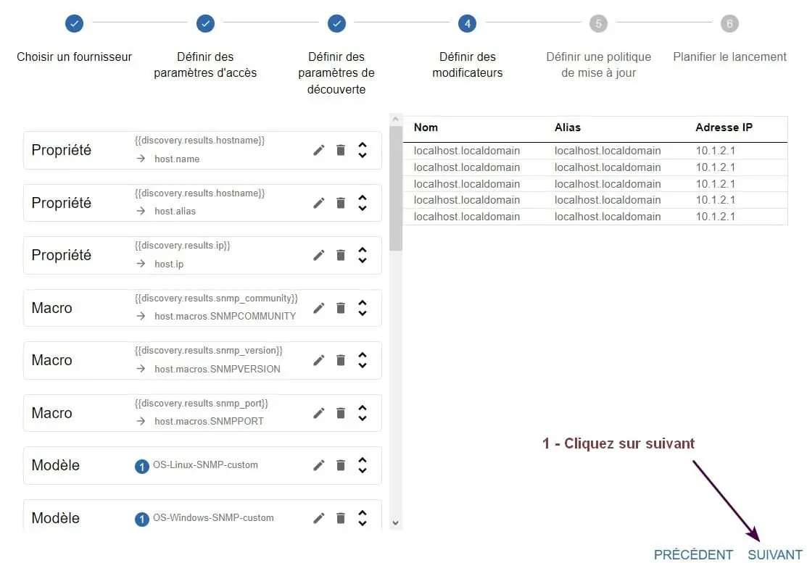

<figure markdown>
  { width="430" }
</figure>

## Centreon IT 100 - Partie 4

### Centreon Auto Discovery

Le module de découverte automatique inclus dans la licence Centreon IT-100 permet de détecter de nouveaux hôtes ou services via le protocole SNMP.

Attention, les hôtes ne sont découverts que si un agent snmp est installé sur chacun d'eux.

L'auto découverte sera testée sur 1 serveur, 3 VM et 1 conteneur LXD, tous sous Debian et déclarés dans la communauté snmp14.

Commencer par installer les agents en se référant à la [Partie 3](../posts/centreon-it100-p3-deb12.md#super-debian){ target="_blank" }.

Vérifier ensuite que le [module](../medias/Centreon-module-decouverte-auto.pdf){ target="_blank" } Auto Discovery fourni avec la [licence](../medias/Centreon2024-IT100-licence-deb12.pdf){ target="_blank" } IT-100 est bien installé.

A défaut, ajouter le module comme suit :

```bash
sudo apt install centreon-auto-discovery-server
```

<!-- more -->

Puis ouvrir l'interface Web de Centreon :  
-> Menu Administration  
-> Extensions -> Gestionnaire  
-> Installer le module Auto Discovery

#### _- Connecteur Generic SNMP_

Utiliser, pour détecter les nouveaux hôtes, le connecteur de supervision Generic SNMP qui fait partie des connecteurs permettant l'auto-découverte, voir la [docs.centreon.com](../medias/Centreon-pack-generic-SNMP.pdf){ target="_blank" }.

Pour cela, commencer par installer ce paquet :

```bash
sudo apt install centreon-plugin-applications-protocol-snmp
```

puis le connecteur de supervision en se référant au [§ 2.3](../posts/centreon-it100-p2-deb12.md#super-syno){ target="_blank" } de la Partie 2.

Relancer par précaution les services de Centreon :

```bash
sudo systemctl restart cbd centengine gorgoned
```

#### _- Tâche d'auto-découverte_

Créer à présent une tâche d'auto-découverte depuis l'interface Web comme ci-dessous :  
-> Configuration -> Hôtes  
-> Découverte -> Bouton + AJOUTER

Remplir la partie 1 comme suit :

<figure markdown>
  { width="430" }
  <figcaption>Centreon : Auto-découverte - Partie 1/6</figcaption>
</figure>

Laisser la partie 2 comme telle :

<figure markdown>
  { width="430" }
  <figcaption>Centreon : Auto-découverte - Partie 2/6</figcaption>
</figure>

Remplir la partie 3 comme suit :

<figure markdown>
  { width="430" }
  <figcaption>Centreon : Auto-découverte - Partie 3/6</figcaption>
</figure>

Laisser la partie 4 comme telle :

<figure markdown>
  { width="430" }
  <figcaption>Centreon : Auto-découverte - Partie 4/6</figcaption>
</figure>

Remplir la partie 5 comme suit :

<figure markdown>
  { width="430" }
  <figcaption>Centreon : Auto-découverte - Partie 5/6</figcaption>
</figure>

Remplir la partie 6 comme suit :

<figure markdown>
  { width="430" }
  <figcaption>Centreon : Auto-découverte - Partie 6/6</figcaption>
</figure>

La tâche est exécutée et son statut apparaît dans :  
-> Configuration -> Hôtes -> Découverte

<figure markdown>
  { width="430" }
  <figcaption>Centreon : Tâche Auto découverte SNMP terminée</figcaption>
</figure>

#### _- Exploitation de la tâche_

Lorsque le statut indique terminé, cliquer sur la flèche située à droite de celui-ci pour voir le détail du résultat de l'analyse manuelle.

Sélectionner ensuite les hôtes que l'on souhaite ajouter ou mettre à jour dans la configuration de Centreon, puis cliquer sur l'icône Sauvegarder.

Le serveur, les 3 VM et le conteneur LXD ont bien été découverts.

Gérer enfin les périodes d'ordonnancement ainsi que les notifications des hôtes découverts et leurs services associés en s'aidant de ce [chapitre](../posts/centreon-it100-p2-deb12.md#super-syno){ target="_blank" } de la Partie 2.

Une fois fait, déployer la nouvelle configuration :  
-> Menu Configuration -> Collecteurs  
-> Collecteurs -> Cocher le collecteur Central  
-> Bouton Exporter la configuration

Zone Actions, cocher :  
Générer les fichiers de configuration  
Lancer le débogage du moteur de supervision (-v)  
Déplacer les fichiers générés  
Redémarrer l'ordonnanceur

Cliquer ensuite sur le bouton Exporter.

#### _- Désactivation d'un service_

Vérifier après quelques minutes les statuts des hôtes et des services.

L'un d'eux montre un état Critique concernant la ressource Swap d'une des 3 VM.

Statut correct car la VM en question ne dispose pas d'une partition Swap.

Pour supprimer un service inutile, désactiver celui-ci comme suit et redéployer la configuration :

<figure markdown>
  { width="430" }
  <figcaption>Centreon : Désactivation du service swap</figcaption>
</figure>

**Fin.**
