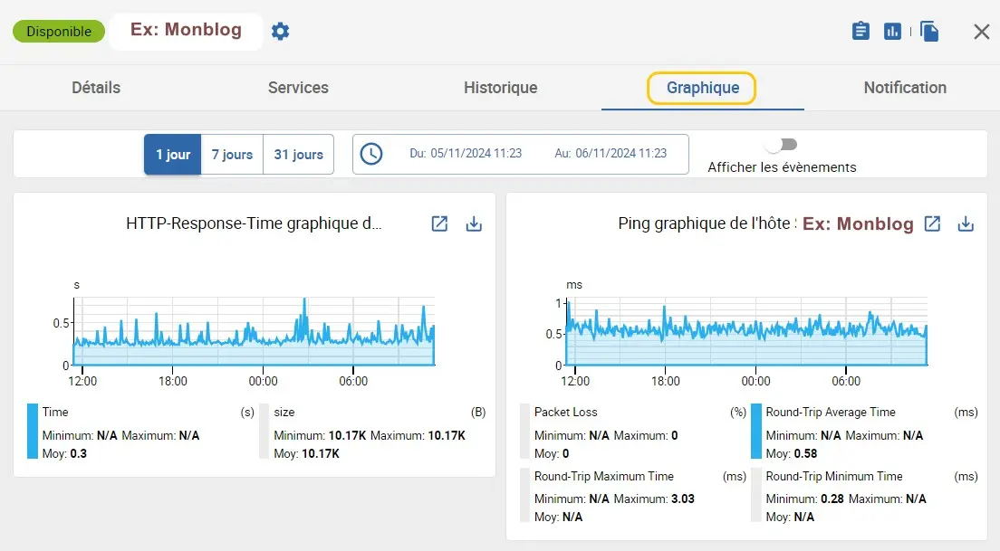
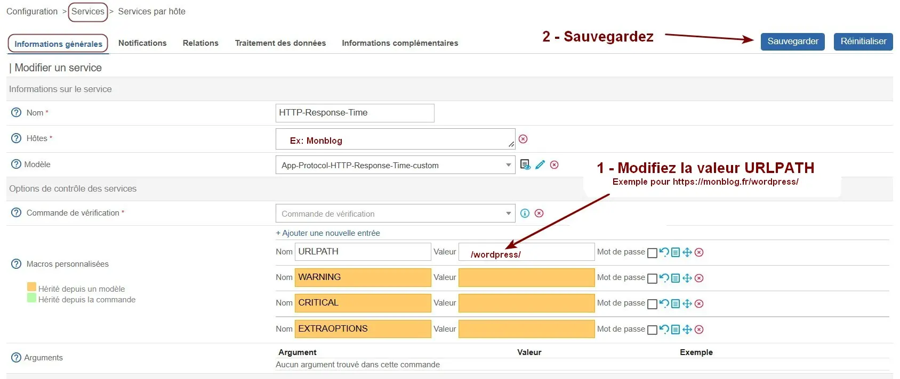

<figure markdown>
  { width="430" }
</figure>

## Centreon IT 100 - Partie 5

Le mémento concerne Centreon 23.10 sous Debian ≥ 11.11 et 24.04 sous Debian ≥ 12.7.

### Supervision Web avec Curl/Ping

La supervision d’un site Web réalisée avec les Cdes Curl et Ping permettra de vérifier la disponibilité et les performances de celui-ci.

Les graphiques de Centreon afficheront les temps de réponse HTTP issus de la Cde curl et les temps de réponse et paquets perdus issus de la Cde ping.

La Cde curl permet de se connecter sur différents types de serveurs et de communiquer avec ceux-ci via différents types de protocoles dont le HTTPS, FTP, etc…

La partie ci-dessous s'inspire de la [docs.centreon.com](../medias/Centreon-applications-protocol-http.pdf){ target="_blank" }.

#### _- Outils HTTP de Centreon_

Pour surveiller l’URL d'un site, procédez comme suit :  
-- Côté VM _centreon_ --  
Installez le paquet ci-dessous si manquant :

```bash
sudo apt install centreon-plugin-applications-protocol-http
```

<!-- more -->

-- Côté Plateforme Centreon IT-100 --  
Menu Configuration -> Monitoring Connector Manager  
-> Champ Mots clés -> Entrez HTTP  
-> Bouton Recherche

-> Trouvez dans le résultat le connecteur HTTP Server  
-> Cliquez sur son icône + pour lancer son installation

Celui-ci apparaîtra installé après quelques secondes.

#### _- Configuration du site_

Créez un nouvel hôte Web comme suit :  
Menu Configuration -> Hôtes -> Hôtes  
-> Bouton Ajouter

Remplissez l'onglet Configuration de l'hôte :

<figure markdown>
  { width="580" }
  <figcaption>Centreon : Information de base sur l'hôte Web</figcaption>
</figure>

Choisissez un site dont vous connaissez l'URL _(Adresse IPv4 / FQDN)_ et le port HTTPS utilisés.

Pour éviter d'éventuels soucis de DNS, ajoutez ces 2 lignes dans le fichier /etc/hosts de la VM _centreon_ seulement si le central de Centreon et le site Web se trouvent sur le même LAN :

```markdown
Ex: IP locale du site Web       Ex: URL du site
192.168.7.42                    monblog.fr
```

Remplissez ensuite l'onglet Notification :

<figure markdown>
  { width="580" }
  <figcaption>Centreon : Notification par e-mail pour l'hôte à Non</figcaption>
</figure>

Puis, configurez les 2 services associés à l'hôte Web :  
Menu Configuration  
-> Services -> Services par l'hôte

Affichez le service HTTP-Response-Time de l'hôte Web :  
-> Onglet Informations générales

Modifiez la valeur URLPATH dans le cas d'une URL de type `https://domaine/sous-dossier/` :

<figure markdown>
  { width="580" }
  <figcaption>Centreon : URL type https://domaine/sous-dossier/</figcaption>
</figure>

-> Onglet Notifications

Configurez la notification par e-mail à Non :

<figure markdown>
  { width="580" }
  <figcaption>Centreon : Notification HTTP-Response-Time à Non</figcaption>
</figure>

Affichez ensuite le service Ping de l'hôte Web :  
-> Onglet Notifications

Configurez la notification par e-mail à Oui :

<figure markdown>
  { width="580" }
  <figcaption>Centreon : Notification Ping à Oui</figcaption>
</figure>

#### _- Activation du site_

Pour activer l'hôte Web, déployez la configuration :  
Menu Configuration -> Collecteurs  
-> Collecteurs -> Cochez le collecteur Central  
-> Bouton Exporter la configuration

Zone Actions :  
-> Cochez Déplacer les fichiers générés  
-> Cochez Redémarrer l'ordonnanceur  
-> Bouton Exporter

Retour normal :

<figure markdown>
  
  <figcaption>Centreon : Configuration de l'hôte Web déployée</figcaption>
</figure>

#### _- Statistiques du site_

Pour afficher les graphiques du site, procédez ainsi :  
Menu Statut des ressources  
-> Champ de recherche  
-> Entrez le filtre : parent_name:Monblog type:host  
-> Colonne G _(Graphique)_  
-> Cliquez sur l'icône Service graphs de l'hôte Web

<figure markdown>
  { width="580" }
  <figcaption>Centreon : Statistiques de l'hôte Web sur 1 jour</figcaption>
</figure>

#### _- Duplication d'hôte_

-- Duplication d'hôte --  
Pour créer un nouvel hôte Web, utilisez la duplication :  
Menu Configuration -> Hôtes -> Hôtes  
-> Cochez le nom de l'hôte à dupliquer  
-> Champ Plus d'actions... -> Sélectionnez Dupliquer  
-> Confirmez la duplication.

Modifiez ensuite uniquement les paramètres hôte et services propres au nouveau site Web.

#### _- Test de la Cde HTTP Server_

-- Test de la Cde HTTP Server --  
Testez par curiosité, depuis la VM _centreon_, la Cde HTTP Server pour le site google.fr :

```bash
sudo /usr/lib/centreon/plugins/centreon_protocol_http.pl \
    --plugin=apps::protocols::http::plugin \
    --mode=response \
    --hostname=google.fr \
    --proto='https' \
    --port='443' \
    --urlpath='/' \
    --warning=' ' \
    --critical=' '
```

**Fin.**
