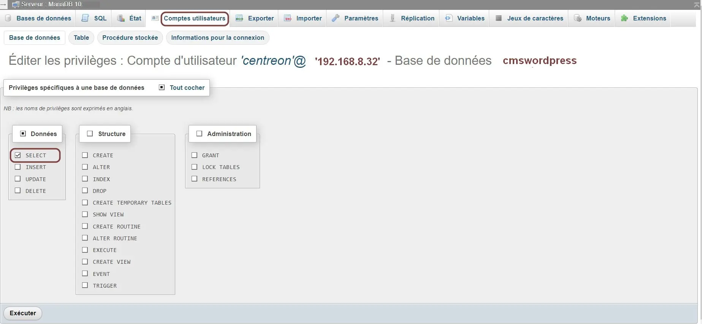
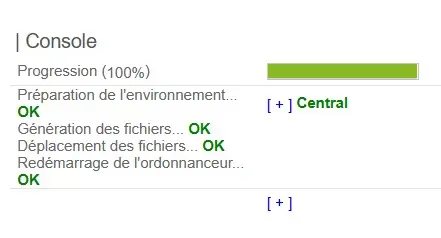
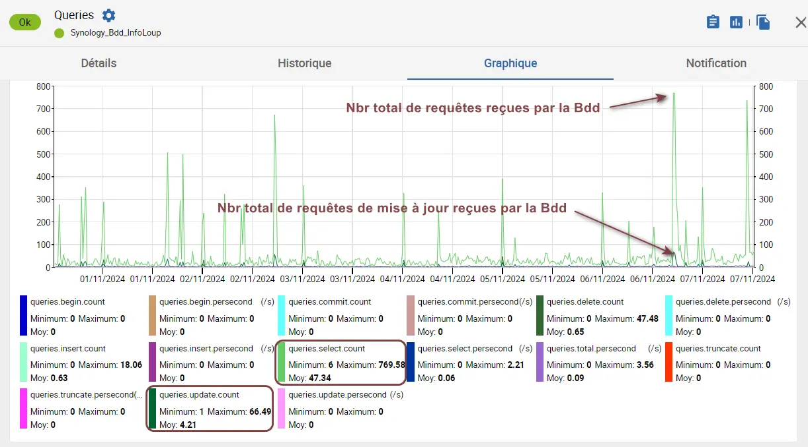

<figure markdown>
  { width="580" }
</figure>

## Centreon IT 100 - Partie 6

Le mémento concerne Centreon 23.10 sous Debian ≥ 11.11 et 24.04 sous Debian ≥ 12.7.

### Supervision d'une Bdd MySQL

L'exemple ci-dessous concerne une Bdd MySQL/MariaDB située sur un serveur Debian :

* Nom de la Bdd = _cmswordpress_  
* IP du collecteur Centreon = 192.168.8.32

La supervision nécessite d'ajouter au sein de la Bdd _cmswordpress_ un utilisateur MySQL dédié au collecteur de Centreon IT-100.

La partie ci-dessous s'inspire de la [docs.centreon.com](../medias/Centreon-supervision-mysql-mariadb.pdf){ target="_blank" }.

#### _- Utilisateur dédié à Centreon_

Connectez-vous sur le serveur supportant la Bdd :

```bash
sudo mysql -u root -p
[sudo] Mot de passe de ... :  
Enter password : Votre MDP root pour MySQL/MariaDB 
MariaDB [(none)]>
```

Listez les Bdd existantes :

```bash
MariaDB [(none)]> SHOW DATABASES;
```

La liste des Bdd présentes sur le serveur s'affiche.  
Sélectionnez celle portant le nom _cmswordpress_ :

```bash
MariaDB [(none)]> USE cmswordpress;   
Database changed

MariaDB [cmswordpress]>
```

et créez l'utilisateur MySQL dédié Centreon comme suit :

<!-- more -->

```bash
MariaDB [cmswordpress]> CREATE USER 'centreon'@'192.168.8.32' IDENTIFIED BY 'votre-mdp';  
Query OK, 0 rows affected (0,006 sec)

MariaDB [cmswordpress]>
```

Affectez lui ses droits _(privilèges)_ :

```bash
MariaDB [cmswordpress]> GRANT SELECT ON cmswordpress.* TO 'centreon'@'192.168.8.32';
Query OK, 0 rows affected (0,004 sec)

MariaDB [cmswordpress]>
```

Terminez en fermant la connexion MySQL :

```bash
MariaDB [cmswordpress]> quit
Bye
```

Ci-après, l'utilisateur MySQL de nom _centreon_ vu par un gestionnaire de Bdd tel phpMyAdmin :

<figure markdown>
  { width="580" }
  <figcaption>phpMyAdmin : Edition de l'utilisateur centreon</figcaption>
</figure>

#### _- Outils MySQL de Centreon_

Pour surveiller une Bdd, procédez comme suit :  
-- Côté VM _centreon_ --  
-> Installez ce paquet Debian si manquant

```bash
sudo apt install centreon-plugin-applications-databases-mysql
```

-- Côté Plateforme Centreon IT-100 --  
-> Menu Configuration -> Monitoring Connector Manager  
-> Champ Mots clés -> Entrez _mysql_  
-> Bouton Recherche

-> Sélectionnez le connecteur titré MySQL/MariaDB  
-> Cliquez sur son icône + pour lancer son installation

Celui-ci apparaît installé après quelques secondes.

#### _- Configuration de l'hôte Bdd_

Créez un nouvel hôte Bdd comme suit :  
-> Menu Configuration -> Hôtes -> Hôtes  
-> Bouton Ajouter

Remplissez l'onglet Configuration de l'hôte :

<figure markdown>
  { width="580" }
  <figcaption>Centreon : Configuration Bdd cmswordpress</figcaption>
</figure>

Ensuite, comme pour l'hôte Web de [Centreon IT 100 - Partie 5](centreon-it100-p5-deb12.md#configsite){ target="_blank" }, désactivez la notification par e-mail depuis l'onglet Notification.

Concernant les 8 services associés à l'hôte Bdd, référez-vous de nouveau à la [Partie 5](centreon-it100-p5-deb12.md#configsite){ target="_blank" } pour configurer la notification par e-mail à Non sauf pour le service Ping.

#### _- Activation de l'hôte Bdd_

Pour activer l'hôte Bdd, déployez la configuration :  
-> Menu Configuration -> Collecteurs  
-> Collecteurs -> Cochez le collecteur Central  
-> Bouton Exporter la configuration

Zone Actions :  
-> Cochez Déplacer les fichiers générés  
-> Cochez Redémarrer l'ordonnanceur  
-> Bouton Exporter

Retour normal :

<figure markdown>
  
  <figcaption>Centreon : Configuration de l'hôte Bdd déployée</figcaption>
</figure>

#### _- Statistiques de la Bdd_

Exemple de graphique issu du service Queries :

<figure markdown>
  { width="580" }
  <figcaption>Centreon : Hôte Bdd, service Queries (Requêtes)</figcaption>
</figure>

### Vue personnalisée liée à la Bdd

Les widgets fournis avec Centreon permettent de créer des vues graphiques personnalisées.

Pour créez une première vue, procédez ainsi :  
-> Menu Accueil -> Vues personnalisées  
-> Cliquez sur l'icône d'édition située en haut et à droite  
Une barre de boutons s'affiche.

-> Bouton Ajouter une vue  
Une fenêtre Créer une vue s'ouvre.

-> Champ Nom -> Entrez _Bdd cmswordpress_  
-> Cochez une mise en page sur 2 Colonnes  
-> Cochez Public pour partager la vue  
-> Bouton Soumettre  

La vue titrée en onglet _cmswordpress_ s'ouvre vide.

#### _- Widget Service Queries_

-> Bouton Ajouter un widget  
Une fenêtre Ajouter widget s'ouvre.

-> Champ Titre -> Entrez _Service Queries_  
-> Champ Widget -> Sélectionnez _Graph Monitoring_  
-> Bouton Soumettre  
Le widget titré _Service Queries_ s'ouvre.

-> Cliquez sur l'icône clé à molette du widget  
Une fenêtre Widget ... [graph-monitoring] s'ouvre.

-> Champ Service  
-> a) Sélectionnez l'hôte _Debian_Bdd_cmswordpress_  
-> b) Sélectionnez le service _Queries_  
-> Champ Graph period  
-> Sélectionnez _Last 7 days_  
-> Bouton Apply

Le graphique du widget s'affiche sur la page.

#### _- Widgets supplémentaires_

Ajoutez maintenant dans la vue personnalisée de nom _Bdd cmswordpress_, ceci en vous aidant de la procédure ci-dessus, les widgets dédiés aux services suivants :

* Myisam-Keycache _(Cache du moteur MyISAM)_  
* Database-Size _(Taille de la Bdd cmswordpress)_  
* Open-Files _(Nombre de fichiers ouverts)_

Résultat :

<figure markdown>
  { width="580" }
  <figcaption>Centreon : Vue personnalisée d'une Bdd MySQL</figcaption>
</figure>

{ align=left }

&nbsp;  
Voilà, la présentation de Centreon  
IT-100 s'achève ici. Vous devriez à  
présent pouvoir découvrir par vous  
même toutes les possibilités du produit.
