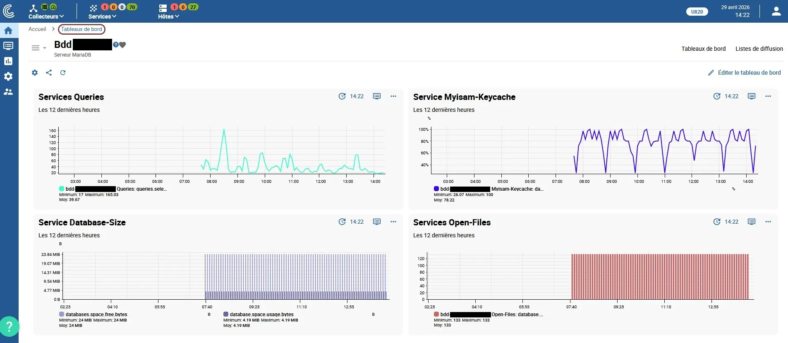
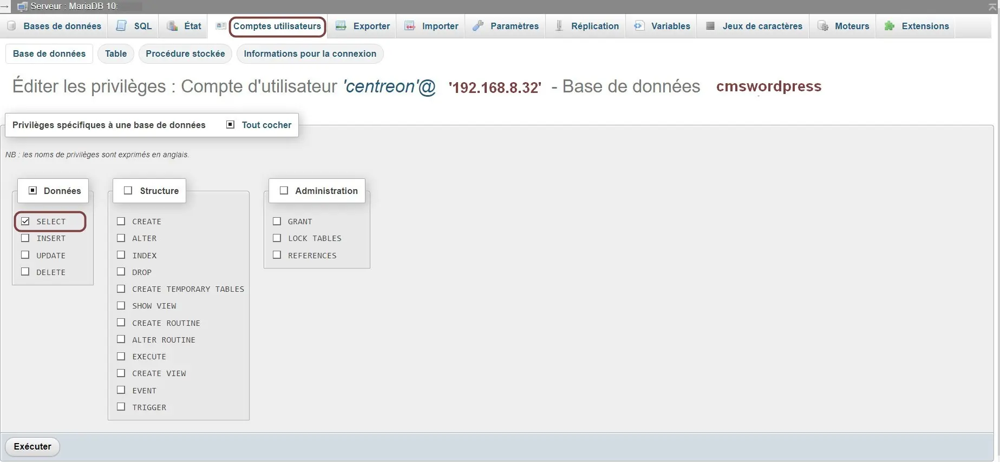
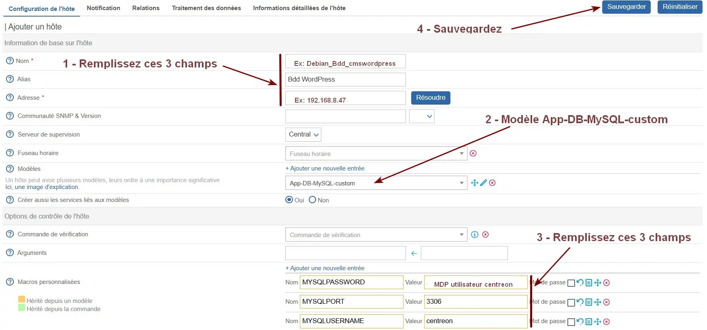
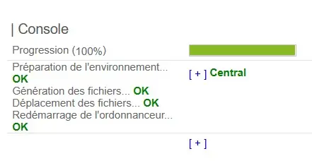
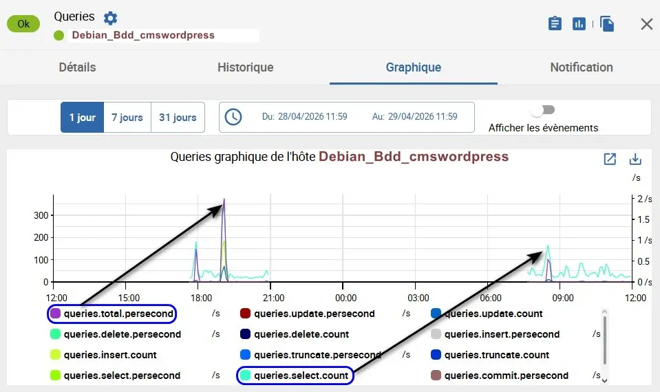

<figure markdown>
  { width="580" }
</figure>

## Centreon IT 100 - Partie 6

Le mémento concerne Centreon 25.10 sous Debian ≥ 12.13.

### Supervision d'une Bdd MySQL

L'exemple concerne une Bdd MariaDB située sur un serveur Debian 13 _(Trixie)_ :

* Nom de la Bdd = cmswordpress  
* IP du collecteur Centreon = 192.168.8.32

La supervision nécessite d'ajouter au sein de la Bdd cmswordpress un utilisateur MySQL dédié au collecteur de Centreon IT-100.

La partie ci-dessous s'inspire de la [docs.centreon.com](../medias/Centreon-supervision-mysql-mariadb.pdf){ target="_blank" }.

#### _- Utilisateur dédié à Centreon_

Connectez-vous sur le serveur MariaDB supportant la Bdd :

```bash
sudo mariadb
[sudo] Mot de passe de ... :  
MariaDB [(none)]>
```

Le plugin unix_socket installé de base permet la connexion locale sur MariaDB sans demande de MDP.

Listez les Bdd existantes :

```bash
MariaDB [(none)]> SHOW DATABASES;
```

La liste des Bdd présentes sur le serveur s'affiche.

Sélectionnez celle portant le nom cmswordpress :

```bash
MariaDB [(none)]> USE cmswordpress;   
Database changed

MariaDB [cmswordpress]>
```

et créez l'utilisateur MySQL dédié Centreon comme suit :

<!-- more -->

```bash
MariaDB [cmswordpress]> CREATE USER 'centreon'@'192.168.8.32' IDENTIFIED BY 'votre-mdp';  
Query OK, 0 rows affected (0,006 sec)

MariaDB [cmswordpress]>
```

Affectez lui ses droits _(privilèges)_ :

```bash
MariaDB [cmswordpress]> GRANT SELECT ON cmswordpress.* TO 'centreon'@'192.168.8.32';
Query OK, 0 rows affected (0,004 sec)

MariaDB [cmswordpress]>
```

L'adresse IP est celle du serveur Centreon.

Terminez en fermant la connexion MySQL :

```bash
MariaDB [cmswordpress]> quit
Bye
```

Ci-après, l'utilisateur MySQL de nom centreon vu par un gestionnaire de Bdd tel phpMyAdmin :

<figure markdown>
  { width="580" }
  <figcaption>phpMyAdmin : Edition de l'utilisateur centreon</figcaption>
</figure>

#### _- Outils MySQL de Centreon_

Pour surveiller une Bdd, procédez comme suit :  
-- Côté VM centreon --  
-> Installez ce paquet Debian si manquant

```bash
sudo apt install centreon-plugin-applications-databases-mysql
```

-- Côté Plateforme Centreon IT-100 --  
-> Menu Configuration -> Connecteurs  
-> Connecteurs de supervision  
-> Champ Mots clés -> Entrez mysql  
-> Bouton _Recherche_

-> Sélectionnez le connecteur titré MySQL/MariaDB  
-> Cliquez sur son icône + pour lancer son installation

Celui-ci apparaît installé après quelques secondes.

#### _- Configuration de l'hôte Bdd_

Créez un nouvel hôte Bdd comme suit :  
-> Menu Configuration -> Hôtes -> Hôtes  
-> Bouton _Ajouter_

Remplissez l'onglet Configuration de l'hôte :

<figure markdown>
  { width="580" }
  <figcaption>Centreon : Configuration Bdd cmswordpress</figcaption>
</figure>

Ensuite, comme pour l'hôte Web de [Centreon IT 100 - Partie 5](centreon-it100-p5-deb12.md#configsite){ target="_blank" }, désactivez la notification par e-mail depuis l'onglet Notification.

Concernant les 8 services associés à l'hôte Bdd, référez-vous de nouveau à la [Partie 5](centreon-it100-p5-deb12.md#configsite){ target="_blank" } pour configurer la notification par e-mail à Non sauf pour le service Ping.

#### _- Activation de l'hôte Bdd_

Pour activer l'hôte Bdd, déployez la configuration :  
-> Menu Configuration -> Collecteurs  
-> Collecteurs -> Cochez le collecteur Central  
-> Bouton _Exporter la configuration_

Zone Actions :  
-> Cochez Déplacer les fichiers générés  
-> Cochez Redémarrer l'ordonnanceur  
-> Bouton _Exporter_

Retour normal :

<figure markdown>
  
  <figcaption>Centreon : Configuration de l'hôte Bdd déployée</figcaption>
</figure>

#### _- Statistiques de la Bdd_

Exemple de graphique issu du service Queries :

<figure markdown>
  { width="580" }
  <figcaption>Centreon : Hôte Bdd, service Queries (Requêtes)</figcaption>
</figure>

### Tableau de bord lié à la Bdd

Les widgets fournis avec Centreon permettent de créer des vues graphiques personnalisées.

Pour créez un premier tableau de bord, procédez ainsi :  
-> Menu Accueil -> Tableaux de bord  
-> Bouton _+ Créer un tableau de bord_

Une fenêtre Créer un tableau de bord s'ouvre :  
-> Champ Nom -> Entrez Bdd cmswordpress  
-> Champ Description -> Entrez Serveur MariaDB  
-> Bouton _Créer_  

Un tableau titré _Bdd cmswordpress/Serveur MariaDB_ s'ouvre vide.

#### _- Widget Service Queries_

-> Bouton _Ajouter un widget_

Une fenêtre _Ajouter un widget_ s'ouvre :  
-> Champ Type de widget -> Sélectionnez Graphe de métriques

Ensuite :  
Côté gauche -> Propriétés du widget  
-> Champ Titre -> Entrez Service Queries  
-> Champ description -> Entrez Les 12 dernières heures

Côté gauche -> Paramètres des valeurs  
-> Période temporelle -> Sélectionnez Les 12 dernières heures

Côté gauche -> Paramètres du graphe  
-> Afficher sous forme de -> Sélectionnez Ligne

Côté droit -> Sélection d'un jeu de données  
-> Champ Sélect... type -> Host  
-> Champ Sélect... ressource -> Debian_Bdd_cmswordpress  
-> Champ Sélect... métrique  
-> Cocher queries.select.count + Deb...cmswordpress.Queries  
-> Bouton _Enregistrer_

Le graphique du widget s'affiche sur la page :  
-> Bouton _Enregistrer_

#### _- Widgets supplémentaires_

Restez sur le tableau de bord de nom Bdd cmswordpress :  
-> Bouton _+ Ajouter widget_

Aidez vous de la procédure ci-dessus pour créer les widgets dédiés aux services suivants :

* Myisam-Keycache _(Cache du moteur MyISAM)_  
* Database-Size _(Taille de la Bdd cmswordpress)_  
* Open-Files _(Nombre de fichiers ouverts)_

Résultat :

<figure markdown>
  { width="580" }
  <figcaption>Centreon : Tableau de bord d'une Bdd MySQL</figcaption>
</figure>

{ align=left }

&nbsp;  
Voilà, la présentation de Centreon  
IT-100 s'achève ici. Vous devriez à  
présent pouvoir découvrir par vous  
même toutes les possibilités du produit.
