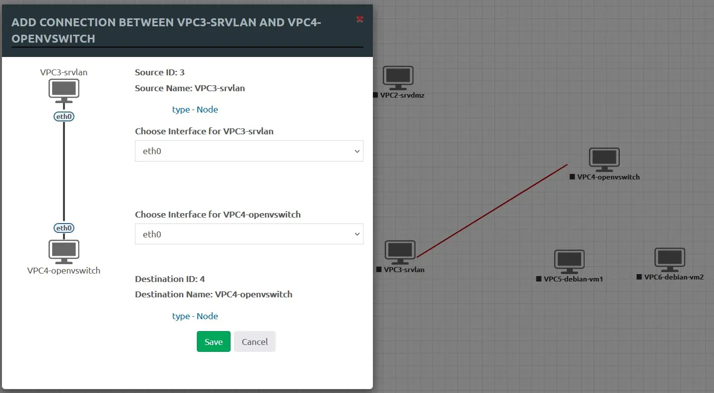

## Maquette avec des Virtual PC

### Création du labo

Ce labo très simple a pour but de faire découvrir les bases de l'exploitation d'EVE-NG.

Accédez à l'interface web d'EVE-NG et connectez-vous.

Une fois sur la page d'accueil, cliquez sur l'icône en forme de page _(Add new lab)_ et donnez un nom au labo tel _Lab-Loup_ :

<figure markdown>
  { width="580" }
  <figcaption>EVE-NG : Création du Labo Lab-Loup</figcaption>
</figure>

<figure markdown>
  { width="580" }
  <figcaption>EVE-NG : Paramètres du labo Lab-Loup</figcaption>
</figure>

Cliquez sur le bouton _Save_, une zone de travail vierge dédiée au nouveau labo s'affichera.

De base, il est seulement possible d'ajouter des Virtual PC.

Cliquez sur **Add an object**, sélectionnez **Node** et cherchez **Virtual PC** dans la liste proposée.

Entrez dans le champ **Number of nodes to add** la valeur 6 et cliquez sur le bouton _Save_.

Les Virtual PC (VPCS) créés apparaitront groupés en haut et à gauche de la zone de travail.

Les déplacer comme sur l'image ci-dessous :

<!-- more -->

<figure markdown>
  { width="580" }
  <figcaption>EVE-NG : Création de 6 Virtual PC<figcaption>
</figure>

Un clic droit sur chacun des Virtual PC permet d'accéder à un menu contextuel, sélectionner _Edit_ et renommer les Virtual PC comme suit :

<figure markdown>
  { width="580" }
  <figcaption>EVE-NG : Virtual PC renommés<figcaption>
</figure>

Démarrez un Virtual PC en sélectionnant _Start_ depuis son menu contextuel ou en cliquant directement sur son icône.

Une fois celui-ci démarré, son icône grisée deviendra bleue.

### Connexion sur un Virtual PC

!!! note "Nota"
    Selon l'OS utilisé, la suite implique d'installer le pack client approprié, [téléchargeable](https://www.eve-ng.net/index.php/download/){ target="_blank" } sur le site d'EVE-NG .

Le pack pour le système Windows créera un dossier EVE-NG dans _C:\Program Files_ et installera Wireshark et UltraVNC.

Putty sera installé dans le dossier EVE-NG.

Si une version plus récente de Wireshark est déjà installée dans son dossier par défaut, il n'est pas nécessaire d'installer la version fournie par le pack client _(décochez l'option)_.

Il est possible d'utiliser SuperPutty en complément de Putty en s'aidant de ce [document](../medias/EVE-NG-SuperPutty.pdf){ target="_blank" }, l'avantage résidant dans l'utilisation d'une seule fenêtre et d'un onglet par connexion.

Le curseur de la souris positionné sur l'icône bleue d'un Virtual PC fera apparaître son adresse telnet en bas et à gauche de la zone de travail.

Un clic sur l'icône bleue génèrera une fenêtre, cliquez sur le bouton _Choisir une application_.

Une seconde fenêtre s'ouvrira, choisir _putty.exe_ ou _SuperPutty.exe_ et finir en cliquant sur le bouton _Ouvrir le lien_.

Exemple de connexion avec Putty sur le VPC2 :

<figure markdown>
  { width="580" }
  <figcaption>EVE-NG : Putty connecté sur srvdmz<figcaption>
</figure>

### Adresses IP fixe et Ping

Pour affecter une adresse IP fixe, procédez ainsi sur _srvlan_ :

<figure markdown>
  { width="580" }
  <figcaption>EVE-NG : IP 192.168.53.1 sur srvlan<figcaption>
</figure>

Affectez ensuite l'IP 192.168.53.15 sur _openvswitch_.

Pour connecter les 2 VPC entre eux, il faut d'abord les stopper, survoler le VPC de départ et relier le symbole en forme de prise de couleur orange sur le VPC de destination.

Une fenêtre s'ouvrira, définissez les interfaces de réseau à utiliser _(eth0 par défaut)_ et sauvegardez :

<figure markdown>
  { width="580" }
  <figcaption>EVE-NG : Création d'une liaison IP<figcaption>
</figure>

Ensuite, redémarrez les 2 VPC et testez la commande ping entre _srvlan_ et _openvswitch_.

### Textes / Cadres / Icônes

a) Pour ajouter un texte/étiquette sur le labo, procédez ainsi :

Cliquez sur **Add an object**, sélectionnez **Text** et entrez par exemple l'_IP_ du VPC3 dans le champ **Text** de la fenêtre affichée, sauvegardez et déplacez le texte à l'endroit souhaité.

b) Pour ajouter un cadre, procédez ainsi :  
Cliquez sur **Add an object**, sélectionnez **Custom Shape** puis entrez _LAN_ dans le champ **Name** de la fenêtre affichée, choisissez une couleur dans le champ **Background-color** et sauvegardez.

Enfin, déplacez le cadre et redimensionnez le avec la souris afin d'entourer le groupe VPC3 à 6.

c) Pour modifier l'icône d'un noeud VPC, procédez ainsi :

Clic droit sur le VPC concerné, sélectionnez **Edit**, choisissez l'icône souhaitée dans le champ **Icon** et sauvegardez.

Exemple :

<figure markdown>
  { width="580" }
  <figcaption>EVE-NG : Textes Cadres Icônes<figcaption>
</figure>

### Connexion à Internet

Pour l'accès à Internet, il faut normalement procéder ainsi :

Cliquez sur **Add an object**, sélectionnez **Network** puis entrez _Internet-pnet0_ dans le champ **Name/Prefix** de la fenêtre affichée, sélectionnez ensuite _Management(Cloud0)_ dans le champ **Type** et sauvegardez.

L'interface de nom _pnet0_ est reliée directement sur l'interface eth0 d'EVE-NG, ce qui permet d'accéder au monde extérieur.

!!! warning "Alerte"
    L'exploitation d'un lien direct sur le noeud réseau _pnet0 (Cloud0)_ pour accéder à Internet ne fonctionne pas sous Proxmox et VirtualBox.

La solution, utiliser l'interface _pnet1 (Cloud1)_ à la place de _pnet0 (Cloud0)_ mais ceci nécessite de configurer EVE-NG.

Activez si besoin le routage interne en éditant ce fichier :

```bash
# nano /etc/sysctl.conf
```

et en décommentant la ligne suivante :

```bash
#net.ipv4.ip_forward=1
```

Installez si manquant ces 2 paquets :

```bash
sudo apt install iptables-persistent netfilter-persistent
```

et créez par exemple la règle iptables suivante :

```bash
sudo iptables -t nat -A POSTROUTING -o pnet0 -s 10.126.126.0/24 -j MASQUERADE
```

Sauvegardez la nouvelle règle iptables :

```bash
su root
sudo iptables-save > /etc/iptables/rules.v4
exit
```

et vérifiez la bonne création de celle-ci :

```bash
sudo iptables -t nat -L
```

Finissez en éditant le fichier réseau _interfaces_ :

```bash
sudo nano /etc/network/interfaces
```

et en modifiant la section _# Cloud device_ comme suit :

```markdown
# Cloud devices
iface eth1 inet manual
auto pnet1
iface pnet1 inet manual
    bridge_ports eth1
    bridge_stp off
    address 10.126.126.1
    netmask 255.255.255.0
```

L'IP de _pnet1_ est dans le réseau 10.126.126.0/24.

Redémarrez EVE-NG et contrôlez la configuration réseau :

```bash
sudo ip a
```

Retour normal :

```markdown hl_lines="11 13 21 23"
1: lo: <LOOPBACK,UP,LOWER_UP> mtu 65536 qdi...
    link/loopback 00:00:00:00:00:00 brd 00:...
    inet 127.0.0.1/8 scope host lo
       valid_lft forever preferred_lft forever
    inet6 ::1/128 scope host 
       valid_lft forever preferred_lft forever
2: eth0: <BROADCAST,MULTICAST,UP,LOWER_UP> ...
    link/ether bc:25:11:e8:03:bc brd ff:ff:...
    altname enp0s18
    altname ens18
3: pnet0: <BROADCAST,MULTICAST,UP,LOWER_UP>...
    link/ether bc:25:11:e8:03:bc brd ff:ff:...
    inet 192.168.1.x/24 brd 192.168.1.255 s...
       valid_lft forever preferred_lft forever
    inet6 2a01:cb18:43a:4f00:991d:... 
       valid_lft 86391sec preferred_lft 591sec
    inet6 2a01:cb18:43a:4f00:be24:... 
       valid_lft 86391sec preferred_lft 591sec
    inet6 fe80::be24:11ff:...
       valid_lft forever preferred_lft forever
4: pnet1: <NO-CARRIER,BROADCAST,MULTICAST,UP>.
    link/ether ce:bd:7f:14:cf:8g brd ff:ff:...
    inet 10.126.126.1/24 brd 10.126.126.255...
       valid_lft forever preferred_lft forever
```

Cliquez sur **Add an object**, sélectionnez **Network** puis entrez ==_Internet-pnet1_== dans le champ **Name/Prefix** de la fenêtre affichée, sélectionnez ensuite ==_Cloud1_== dans le champ **Type** et sauvegardez.

<figure markdown>
  { width="580" }
  <figcaption>EVE-NG : Noeud d'accès à Internet<figcaption>
</figure>

Démarrez maintenant VPC1, connectez vous dessus et configurez les éléments suivants :

```markdown
VPCS> ip 10.126.126.2/10.126.126.1
VPCS> ip dns 192.168.x.y
VPCS> save
```

Adaptez l'IP du serveur DNS selon votre configuration locale.

Résultat :

<figure markdown>
  { width="580" }
  <figcaption>EVE-NG : VPC1 (ip, gateway,dns)<figcaption>
</figure>

Arrêtez VPC1 et reliez celui-ci sur le noeud réseau Internet-pnet1, puis redémarrez VPC1 et testez la Cde _ping_ sur google.fr.

<figure markdown>
  { width="580" }
  <figcaption>EVE-NG : VPC1 accès à Internet<figcaption>
</figure>

### Bridge

Le Bridge est un commutateur virtuel non géré qui permet l’interconnexion des nœuds du labo.

Supprimez le VPC4 et remplacez celui-ci par un bridge comme suit :

Cliquez sur **Add an object**, sélectionnez **Network** puis entrez _Switch L2_ dans le champ **Name/Prefix** de la fenêtre affichée, sélectionnez ensuite _Switch-2D-L2-Generic-S.svg_ dans le champ **Icon** et sauvegardez.

<figure markdown>
  { width="580" }
  <figcaption>EVE-NG : VPC4 remplacé par un bridge<figcaption>
</figure>

Puis, affectez les IP 192.168.53.20 et 22 aux VPC5 et VPC6.

Reliez ensuite les VPC3, 5 et 6 sur le nouveau switch.

La Cde _ping_ doit à présent fonctionner entre les 3 VPC.

**Fin.**
