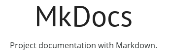

# Outil de documentation

<figure markdown>
  
</figure>

MkDocs est un générateur de site Web statique écrit en langage Python.

Son installation locale peut être réalisée à l'aide de la Cde pip.

Thème utilisé sur ce site : _Material for MkDocs_

L'écriture de la documentation utilise la syntaxe ==Markdown==.

La configuration du site repose sur le fichier YAML ==mkdocs.yml==.

L'intégration de MkDocs avec Git permet de stocker la documentation sur un dépôt Git.

---------- Fin ----------

