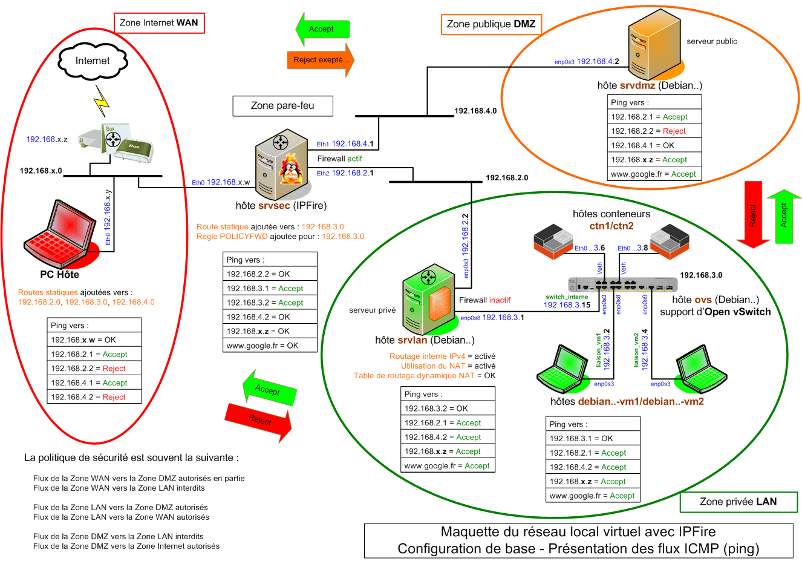

## Bienvenue sur InfoLoup

{ align=left }

&nbsp;  
Découvrez les évolutions par  
rapport à la maquette précédente.  
&nbsp;  
&nbsp;  

Les 2 serveurs Debian 10 _(LAN/DMZ)_ sont remplacés par des Debian 11 plus récents, le rôle de pare-feu pour le réseau restant assuré par un serveur IPFire _(WAN)_.

Les clients sont maintenant composés de 2 VM et 2 conteneurs LXC, le tout sous Debian 11.

La VM Debian 10 support du commutateur Open vSwitch est remplacée par une Debian 11.

La construction de cette nouvelle maquette repose toujours sur l'hyperviseur [VirtualBox](https://www.virtualbox.org/){ target="_blank" }.

Ci-dessous, la configuration de base du réseau virtuel :

<figure markdown>
  { width="430" }
  <figcaption>Réseau virtuel : Présentation des flux ICMP (ping)</figcaption>
</figure>

[VirtualBox](https://www.virtualbox.org/){ target="_blank" } permet de créer une maquette réaliste d'un petit réseau informatique local, celle-ci s'avérant pratique pour s'initier à l'administration réseau.

Un réseau construit par ce biais est fonctionnel et si vous cassez l'une des Machines Virtuelles _(VM)_ du réseau, ce n'est pas grave, réinstallez sa sauvegarde et continuez de vous amuser.

La virtualisation est un bon champ d'expérimentation pour apprendre. En ce qui me concerne, je consomme avec beaucoup de satisfaction et ne m'en lasse pas.

**- Sur ce site vous trouverez comment :**

| |
| :-------------: |
|Créer les VM sous VirtualBox _(serveurs et clients)_.|
|Relier celles-ci entre elles pour fonctionner en réseau.|
|Installer des services réseau tels DNS, DHCP, etc…|
|Vérifier le bon fonctionnement de l'ensemble.|

Si ce travail peut servir à d'autres qu'à moi-même, j'en serai particulièrement heureux.

**- Remarques générales sur la maquette :**

1 ) VM et conteneurs LXC sont initialisés par systemd.

2 ) Le serveur IPFire offre les services suivants :  
\- Firewall _(utilisé par le réseau virtuel)_  
\- Serveur Proxy  
\- Système de détection d'intrusion  
\- Serveur DHCP  
\- Serveur NTP _(utilisé par le réseau virtuel)_  
\- Etc ...

Rôle : Sécuriser l'architecture d'un réseau d’entreprise.

3 ) Commutateur virtuel Open vSwitch :  
\- Installé sur une VM Debian 11 et non sur le PC hôte.

4 ) 8 Go de RAM minimum, mémoire du PC hôte incluse.

5 ) Environnement graphique :  
\- Certaines VM disposent du bureau léger Xfce4.

**- Pourquoi ce nouveau réseau ?**

Pour tester des serveurs plus récents et appréhender le fonctionnement des conteneurs LXC.

Pour recontrôler le contenu des articles du réseau précédent et m'assurer que celui-ci reste à quelques modifications près toujours d'actualité.

Pour découvrir des outils d'administration et de supervision tels Cockpit et Centreon IT-100.

Pour réaliser plus tard d'éventuels tests de pénétration de réseau ou de détection d'intrusion.
