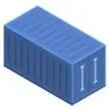

## VBox - Serveurs - Clients - Switch

Le PC ou serveur, hôte de l'hyperviseur VirtualBox, peut tourner sous Windows ou Linux.

Toutes les VM créées avec VirtualBox, hormis la VM pare-feu, supportent un OS Debian Linux.  
&nbsp;  

[{ align=left style="height:85px;width:85px" }](https://www.virtualbox.org){ target="_blank" }

|                                             |                            |
| --------------------------------            | -------:                   |
| **Système de virtualisation :** {.td-bleu}  |&nbsp;  {.td-bleu}          |
| Hyperviseur de type 2 VirtualBox {.td-bleu} |&nbsp;  {.td-bleu}          |
| Dernière version   {.td-bleu}               |&nbsp;  {.td-bleu}          |

{ align=left style="height:85px;width:85px" }

|                         |             |
| ----------------------- | ----------: |
| **Serveurs LAN et DMZ :** {.td-bleu}  |   RAM min : {.td-bleu} |
| VM _srvlan_ et _srvdmz_ {.td-bleu} | 2 x 1024 Mo {.td-bleu} |
| Bureau Xfce4  {.td-bleu}  | &nbsp;  {.td-bleu}           |

[{ align=left style="height:85px;width:85px" }](https://www.ipfire.org/){ target="_blank" }

|                                    |            |
| ---------------------------------- | ---------: |
| **Serveur WAN :** {.td-bleu} |  RAM min : {.td-bleu} |
| VM _srvsec &nbsp; (Pare-feu)_  {.td-bleu}                    | 1 x 512 Mo {.td-bleu} |
| OS LFS IPFire  {.td-bleu}                     | &nbsp;  {.td-bleu}          |

{ align=left style="height:85px;width:85px" }

|                            |             |
| -------------------------- | ----------: |
| **Clients LAN :**  {.td-bleu}         |   RAM min : {.td-bleu} |
| VM _debian..-vm1_ et _vm2_ {.td-bleu} | 2 x 1024 Mo {.td-bleu} |
| VM _ovs_   {.td-bleu}                | 1 x 1024 Mo {.td-bleu} |

{ align=left style="height:85px;width:85px" }

|                               |             |
| ----------------------------- | ----------: |
| **Clients LAN légers :** {.td-bleu} | RAM VM _osv_ {.td-bleu}|
| Conteneurs _ctn1_ et _ctn2_  {.td-bleu}  |    &nbsp; {.td-bleu} |
| sur la VM _ovs_  {.td-bleu}|  &nbsp; {.td-bleu} |

[{ align=left style="height:85px;width:85px" }](http://www.openvswitch.org/){ target="_blank" }

|                       |             |
| --------------------- | ----------: |
| **Switch virtuel :**   {.td-bleu} | RAM VM _osv_ {.td-bleu}|
| Logiciel Open vSwitch {.td-bleu} |    &nbsp; {.td-bleu} |
| sur la VM _ovs_  {.td-bleu}| &nbsp;  {.td-bleu}|

{ align=left style="height:85px;width:85px" }

RAM minimum requise pour exploiter  
le réseau correctement, environ **6 Go**.
  
