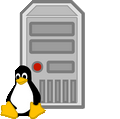
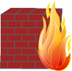

## Hyperviseur - Serveurs - Clients - Switch

Le PC ou serveur, hôte de l'hyperviseur VirtualBox, peut tourner sous Windows ou Linux.

Toutes les VM créées avec VirtualBox, hormis la VM pare-feu, supportent un OS Debian Linux.  
&nbsp;  

[{ align=left style="height:85px;width:85px" }](https://www.virtualbox.org){ target="_blank" }

|                                             |                            |
| --------------------------------            | -------:                   |
| **Système de virtualisation :** {.td-bleu}  |&nbsp;  {.td-bleu}          |
| Hyperviseur de type 2 VirtualBox {.td-bleu} |&nbsp;  {.td-bleu}          |
| Dernière version   {.td-bleu}               |&nbsp;  {.td-bleu}          |

{ align=left style="height:85px;width:85px" }

|                                       |                              |
| -----------------------               | ----------:                  |
| **Serveurs LAN/DMZ :** {.td-bleu}     |   RAM min : {.td-bleu}       |
| VM _srvlan_ et _srvdmz_ {.td-bleu}    |2 x 1024 Mo {.td-bleu}        |
| Bureau Xfce4 installé  {.td-bleu}     |&nbsp;  {.td-bleu}            |

[{ align=left style="height:85px;width:85px" }](https://www.ipfire.org/){ target="_blank" }

|                                                   |                         |
| ----------------------------------                | ---------:              |
| **Serveur WAN _(Pare-feu)_ :** {.td-bleu}         |  RAM min : {.td-bleu}   |
| VM _srvsec_  {.td-bleu}                           | 1 x 1024 Mo {.td-bleu}  |
| OS LFS IPFire  {.td-bleu}                         | &nbsp;  {.td-bleu}      |

{ align=left style="height:85px;width:85px" }

|                                       |                         |
| --------------------------            | ----------:             |
| **Clients LAN :**  {.td-bleu}         |   RAM min : {.td-bleu}  |
| VM _debian..-vm1_ et _vm2_ {.td-bleu} | 2 x 1024 Mo {.td-bleu}  |
| VM _ovs_   {.td-bleu}                 | 1 x 1024 Mo {.td-bleu}  |

{ align=left style="height:85px;width:85px" }

|                                          |                          |
| -----------------------------            | ----------:              |
| **Clients LAN légers :** {.td-bleu}      | RAM d'_osv_ {.td-bleu}   |
| Conteneurs _ctn1_ et _ctn2_  {.td-bleu}  |    partagée {.td-bleu}   |
| sur la VM _ovs_  {.td-bleu}              |  &nbsp; {.td-bleu}       |

[{ align=left style="height:85px;width:85px" }](http://www.openvswitch.org/){ target="_blank" }

|                                   |                         |
| ---------------------             | ----------:             |
| **Switch virtuel :**   {.td-bleu} | RAM d'_osv_ {.td-bleu}  |
| Logiciel Open vSwitch {.td-bleu}  |    partagée {.td-bleu}  |
| sur la VM _ovs_  {.td-bleu}       | &nbsp;  {.td-bleu}      |

{ align=left style="height:85px;width:85px" }

RAM minimum requise pour exploiter  
le réseau convenablement, environ 6 Go.
  
