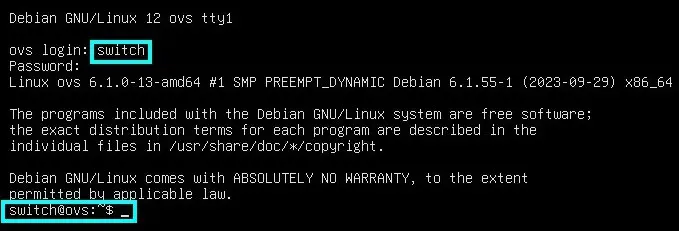

[](../wp-content/uploads/2023/10/openvswitch_3.webp)

## Mémento 5.1 - Commutateur virtuel

Open vSwitch _(OVS)_ se comportera comme un véritable switch physique en proposant la gestion des adresses MAC tel un switch L2 ainsi que celle des adresses IP pour le routage des paquets IP tel un switch L3. 
  
Le switch virtuel sera, contrairement à une architecture standard, installé sur une VM et non sur le PC hôte de l'hyperviseur VirtualBox.

Le raccordement externe des clients LAN Debian sur le switch se fera à l'aide de ports patch.
  
Le moyen d'approcher l'architecture standard sera de créer un conteneur à l'intérieur de la VM et de connecter celui-ci sur OVS à l'aide d'une interface réseau virtuelle Veth _(Mémento suivant)_.  
  
La gestion possible de VLAN ne sera pas traitée ici.

### 1 - Construction de la VM depuis VirtualBox

L'utilisation de VirtualBox est considérée acquise.  
  
A défaut, référez-vous aux mémentos suivants :  
[VirtualBox - Installation](../virtualbox-installation/)  
[VirtualBox - Mode d’accès réseau par pont](../virtualbox-pont-reseau/)

#### _1.1 - Création et configuration de la VM_

Le PC hôte doit être un PC 64 bits, courant de nos jours.  
  
Téléchargez l'ISO debian-12.x.y-amd64\-netinst.iso :  
[https://cdimage.debian.org/.../current/amd64/iso-cd/](https://cdimage.debian.org/debian-cd/current/amd64/iso-cd/)  
  
\- Démarrez ensuite l'application VirtualBox 7.x, puis :    
\- - Menu de VirtualBox > Machine > Nouvelle...  
-> Nom : ovs  
-> Folder : Sélectionnez le dossier de stockage des VM  
-> ISO Image : Sélectionnez l'ISO téléchargée ci-dessus  
-> Type : Linux  
-> Version : Debian (64-bit)  
-> Cochez Skip Unattended Installation _(important)_  
-> Bouton Suivant  

-> Mémoire vive : 1024 MB  
-> Processors : 2 CPU si possible  
-> Bouton Suivant

-> Create a Virtual Hard Disk Now : Ajustez à 12 Go  
-> Bouton Suivant

-> Vérifiez le Récapitulatif  
-> Bouton Finish
  
La VM s'affiche dans le panneau gauche de VirtualBox.  
  
\- Sélectionnez maintenant la nouvelle VM, puis :  
\- - Menu de VirtualBox > Machine > Configuration...  
\- - - Onglet Général  
-> Avancé > Presse-papier partagé > Bidirectionnel

\- - - Onglet Système  
-> Carte mère > Ordre d'amorçage > Décochez Disquette  
-> Processeur > Cochez Activer PAE/NX
  
-> OK  
  
Les autres paramètres peuvent rester inchangés.

#### _1.2 - Installation de la distribution Debian_

Conseil pratique avant de démarrer la nouvelle VM :  
Si le curseur de la souris disparait lors d'un clic dans la fenêtre de la VM, celui-ci peut être récupéré par le PC hôte à l'aide de la touche CTRL située à droite de la barre d'espace du clavier.  
  
\- - Menu de VirtualBox > Machine > Démarrer
-> Démarrage normal _(La VM s'exécute)_
  
Sélectionnez Graphical Install et appliquez ce qui suit :  
\- Language > Français  
\- Pays (territoire ou région) > France  
\- Disposition de clavier à utiliser > Français  
\- Nom de machine > ovs  
\- Domaine > Laissez le champ vide  
\- MDP du super utilisateur root > Votre MDP root  
\- Confirmation du MDP > Votre MDP root  
\- Nom complet du nouvel utilisateur > Ex: switch  
\- Identifiant pour le compte utilisateur > switch  
\- MDP pour le nouvel utilisateur > Votre MDP switch  
\- Confirmation du MDP > Votre MDP switch  
\- Méthode de partitionnement > Assisté - utili... entier  
\- Disque à partitionner > Celui proposé de 12 Go  
\- Schéma de partitionnement > Tout ... seule partition  
\- Table des partitions > Terminer le partitionnement ...  
\- Faut-il appliquer les changements … disques ? > Oui  
  
L'installation de base commence :  
\- Faut-il analyser d'autres supports ... ? > Non  
\- Pays du miroir de l'archive Debian > France  
\- Miroir de l'archive Debian > deb.debian.org  
\- Mandataire HTTP (lais...) > Laissez vide  
  
L'installation continue :  
\- Souhaitez-vous participer à l'étude statistique... > Non  
\- Logiciels à installer  
-> Décochez environnement de bureau Debian  
-> Décochez ... GNOME  
-> Conservez utilitaires usuels du système  
  
L'installation se termine :  
\- Installer ... de démarrage GRUB sur le secteur ... > Oui  
\- Périphérique ... programme de démarrage > /dev/sda  
\- Installation terminée > Continuer _(sans retrait du CD)_  
  
Le système reboot et une fenêtre de connexion s'ouvre :  
-> ovs login : Entrez switch  
-> Password : Entrez Votre MDP switch  
Si tout est OK, affichage du prompt switch@ovs:~$

  
_**Open vSwitch : Premier démarrage de la VM ovs**_

Donnez à présent les droits d'administrateur root à l'utilisateur switch :

```bash
[switch@ovs:~$] su root
Mot de passe : Votre MDP root
[root@ovs:~#] apt install sudo
[root@ovs:~#] sudo usermod -aG sudo switch
[root@ovs:~#] sudo reboot
```

et reconnectez-vous en tant qu'utilisateur switch.  
  
Pour info, la VM peut être arrêtée de 2 façons :

```bash
[switch@ovs:~$] sudo poweroff  
[switch@ovs:~$] sudo shutdown -h now
``` 

### 2 - Installation et configuration d'Open vSwitch

Au préalable, observez la configuration réseau active :


Configuration réseau de base : Interfaces lo et enp0s3

#### _2.1 - Installation_

Installez le paquet openvswitch-switch :

\[switch@ovs:~$\] sudo apt install openvswitch-switch

Les paquets concernant les dépendances manquantes sont ajoutés automatiquement.

Contrôlez maintenant la version d'Open vSwitch _(OVS)_ :

\[switch@ovs:~$\] sudo ovs-vsctl show 


Version Open vSwitch 2.15

et l'intégration de son module dans le noyau linux :

\[switch@ovs:~$\] sudo modinfo openvswitch 

[](/wp-content/uploads/2021/09/ovs-deb11-module-noyau-openvswitch.jpg)

Informations sur le module noyau openvswitch.ko

Contrôlez également le bon chargement de celui-ci :

\[switch@ovs:~$\] lsmod | grep openvswitch


Module noyau openvswitch.ko chargé

\- - Liste des principaux composants OVS installés - - 
  
/usr/lib/openvswitch-common/ovs-vswitchd :  
Service de commutation _(compatible OpenFlow)_.  
  
/usr/bin/ovs-appctl :  
Configuration CLI _(Command Line Interface)_ du service.  
  
/usr/bin/ovs-vsctl :  
Configuration CLI du service via le serveur de Bdd OVS.  
  
/usr/sbin/ovsdb-server :  
Bdd contenant la configuration au niveau commutateur.  
  
/usr/bin/ovsdb-client :  
Outil de dialogue CLI avec le serveur de Bdd OVS.  
  
/usr/bin/ovsdb-tool :  
Configuration CLI des fichiers de la Bdd.  
  
/usr/bin/ovs-dpctl :  
Configuration CLI du module noyau d'Open vSwitch.  
  
/usr/bin/ovs-ofctl :  
Utilitaire CLI de contrôle des commutateurs OpenFlow.  
  
La Bdd conf.db se situe dans /etc/openvswitch/.  
Les logs se situent dans /var/log/openvswitch/.

Contrôlez l'activation du service openvswitch-switch :

\[switch@ovs:~$\] sudo systemctl status openvswitch-switch


Service openvswitch-switch activé

ainsi que celle des 2 services suivants :

\[switch@ovs:~$\] sudo systemctl status ovsdb-server
\[switch@ovs:~$\] sudo systemctl status ovs-vswitchd

#### _2.2 - Configuration_

Commencez par créer un bridge _(switch)_ de nom br0 :

\[switch@ovs:~$\] sudo ovs-vsctl add-br br0   
\[switch@ovs:~$\] sudo ovs-vsctl show    


Création du bridge br0

Un port et une interface virtuels de même nom ont été associés au bridge.

Utilisez la Cde del-br pour détruire un bridge existant.

Observez les infos détaillées du bridge br0 comme suit :

\[switch@ovs:~$\] sudo ovs-vsctl list br br0      

et la création de l'interface br0 avec la Cde ip address :


Cde ip address montrant l'interface br0 créée

Un ping vers yahoo.fr ou autre domaine doit fonctionner.

Rattachez à présent l'interface enp0s3 au bridge br0 :

\[switch@ovs:~$\] sudo ovs-vsctl add-port br0 enp0s3  
\[switch@ovs:~$\] sudo ovs-vsctl show


Ajout du port enp0s3 sur br0

Le port virtuel enp0s3 et l'interface de réseau virtuel enp0s3 ne font qu'un.

Utilisez la Cde del-port pour détruire un port existant.

Observez de nouveau le retour de la Cde ip address :


Les adresses MAC de enp0s3 et br0 sont identiques

L'interface br0 possède à présent la même adresse MAC que enp0s3.

### 3 - Intégration de la VM ovs dans le réseau virtuel

#### _3.1 - Configuration réseau depuis VirtualBox_

Stoppez la VM :

\[switch@ovs:~$\] sudo poweroff

Accédez au menu Configuration de VirtualBox, puis :  
\- - - Onglet Réseau  
\> Interface 1  
\> Mode d'accès réseau > Réseau interne  
\> Nom > Sélectionnez switch\_interne  
\> Avancé > Mode Promiscuité  
\> Sélectionnez Autoriser les VMs  
  
\> Interface 2  
\> Cochez Activer l'interface réseau  
\> Mode d'accès réseau > Réseau interne  
\> Nom > Entrez liaison\_vm1  
\> Avancé > Mode Promiscuité  
\> Sélectionnez Autoriser les VMs  
  
\> Interface 3  
\> Cochez Activer l'interface réseau  
\> Mode d'accès réseau > Réseau interne  
\> Nom > Entrez liaison\_vm2  
\> Avancé > Mode Promiscuité  
\> Sélectionnez Autoriser les VMs  
  
\> OK

Redémarrez la VM.

Il est impossible, OVS n'étant pas installé sur le PC hôte de VirtualBox, d'attribuer aux interfaces 2 et 3 un mode d'accès réseau généralement utilisé avec OVS soit un mode de type Accès par pont au travers d'une interface réseau virtuelle TAP _([Voir le § 4](#4_-_Raccordement_des_2_clients_Debian_sur_OVS))_.  
  
C'est donc le type Réseau interne qui sera utilisé.  
  
Le mode promiscuité empêche une interface réseau de rejeter les trames autres que celles qui lui sont destinées _(mode par défaut)_.  
  
Il est nécessaire, dans une infrastructure virtualisée telle Open vSwitch installé sur une VM, d'appliquer le mode promiscuité à une interface réseau devant agir comme un pont _(bridge)_.

#### _3.2 - Modification du fichier réseau de Debian_

Vous allez à présent configurer OVS au boot de la VM.

Editez pour cela le fichier réseau interfaces :

\[switch@ovs:~$\] sudo nano /etc/network/interfaces

et modifiez le comme suit :

\# This file describes the network interfaces available on ...
# and how to activate them. For more information, see ...

source /etc/network/interfaces.d/\*

# The loopback network interface
auto lo
iface lo inet loopback

# The primary network interface
# Mettre un # devant les 2 lignes ci-dessous
#allow-hotplug enp0s3
#iface enp0s3 inet dhcp

## Configuration Open vSwitch
# Activation de l'interface br0
auto br0
allow-ovs br0

# Configuration IP de l'interface br0
iface br0 inet static
address 192.168.3.15
netmask 255.255.255.0
gateway 192.168.3.1
ovs\_type OVSBridge
ovs\_ports enp0s3

# Attachement du port/interface enp0s3 au bridge br0
allow-br0 enp0s3
iface enp0s3 inet manual
ovs\_bridge br0
ovs\_type OVSPort

Redémarrez ensuite le service réseau :

\[switch@ovs:~$\] sudo systemctl restart networking

et contrôlez le résultat avec la Cde ip address :


Contrôle des interfaces réseau

Constat :  
\- 2 nouvelles interfaces réseau enp0s8 et enp0s9  
\- L'interface br0 a la même adresse MAC que enp0s3  
\- L'interface br0 possède l'adresse IP 192.168.3.15  
\- Le ping vers l'adresse lP 192.168.3.1 fonctionne

L'adresse IP 192.168.3.15 sera utilisée plus tard pour administrer Open vSwitch à distance.

### 4 - Raccordement des 2 clients Debian sur OVS

Open vSwitch est généralement installé sur le PC hôte de l'hyperviseur. Un bridge tel br0 utilise alors les interfaces réseau physiques du PC hôte pour l'accès à Internet et des interfaces réseau virtuelles TAP de niveau L2 pour l'accès aux VM.

Dans le cas présent, Open vSwitch est installé sur une VM de VirtualBox.

Vous allez donc raccorder les 2 clients Debian sur les interfaces réseau enp0s8/9 de la VM ovs, interfaces qui seront rattachées à des bridges de nom br1/2.

Vous lierez les 3 bridges à l'aide de ports patch :


Schéma : Bridges br0, br1 et br2 montés en cascade

L'ensemble ainsi raccordé _(ports patch)_ peut être vu comme un seul pont.  
  
La création de VLAN et le routage de paquets IP entre ceux-ci restent possibles.

#### _4.1 - Création des bridges et des ports patch_

Créez les bridges br1 et br2 :

\[switch@ovs:~$\] sudo ovs-vsctl add-br br1  
\[switch@ovs:~$\] sudo ovs-vsctl add-br br2 

Rattachez les interfaces enp0s8/9 aux bridges br1/2 :

\[switch@ovs:~$\] sudo ovs-vsctl add-port br1 enp0s8  
\[switch@ovs:~$\] sudo ovs-vsctl add-port br2 enp0s9  

Reliez maintenant br0 avec br1 :

\[switch@ovs:~$\] sudo ovs-vsctl -- add-port br0 br0-patch0 \\
-- set interface br0-patch0 type=patch options:peer=br1-patch0
 
\[switch@ovs:~$\] sudo ovs-vsctl -- add-port br1 br1-patch0 \\
-- set interface br1-patch0 type=patch options:peer=br0-patch0  

Le caractère \\ indique d'écrire le tout sur une seule ligne.  

puis br1 avec br2 :

\[switch@ovs:~$\] sudo ovs-vsctl -- add-port br1 br1-patch1 \\
-- set interface br1-patch1 type=patch options:peer=br2-patch0 
 
\[switch@ovs:~$\] sudo ovs-vsctl -- add-port br2 br2-patch0 \\
-- set interface br2-patch0 type=patch options:peer=br1-patch1  

Contrôlez la prise en compte de la configuration :

\[switch@ovs:~$\] sudo ovs-vsctl  show


Open vSwitch : Contrôle de la configuration

#### _4.2 - Modification du fichier réseau de Debian_

Editez la configuration OVS du fichier interfaces :

\[switch@ovs:~$\] sudo nano /etc/network/interfaces

et modifiez celle-ci comme suit :

\# This file describes the network interfaces available on ...
# and how to activate them. For more information, see ...

source /etc/network/interfaces.d/\*

# The loopback network interface
auto lo
iface lo inet loopback

# The primary network interface
# Mettre un # devant les 2 lignes ci-dessous
#allow-hotplug enp0s3
#iface enp0s3 inet dhcp

## Configuration Open vSwitch
# Activation de l'interface br0
auto br0
allow-ovs br0

# Configuration IP de l'interface br0
iface br0 inet static
address 192.168.3.15
netmask 255.255.255.0
gateway 192.168.3.1
ovs\_type OVSBridge
ovs\_ports enp0s3 br0-patch0

# Attachement du port/interface enp0s3 au bridge br0
allow-br0 enp0s3
iface enp0s3 inet manual
ovs\_bridge br0
ovs\_type OVSPort

# Liaison patch br0 vers br1
allow-br0 br0-patch0
iface br0-patch0 inet manual
ovs\_bridge br0
ovs\_type OVSPatchPort
ovs\_patch\_peer br1-patch0  
  
# Configuration du bridge br1
auto br1
allow-ovs br1
iface br1 inet manual
ovs\_type OVSBridge
ovs\_ports enp0s8 br1-patch0 br1-patch1
  
allow-br1 enp0s8
iface enp0s8 inet manual
ovs\_bridge br1
ovs\_type OVSPort
 
allow-br1 br1-patch0
iface br1-patch0 inet manual
ovs\_bridge br1
ovs\_type OVSPatchPort
ovs\_patch\_peer br0-patch0
 
allow-br1 br1-patch1
iface br1-patch1 inet manual
ovs\_bridge br1
ovs\_type OVSPatchPort
ovs\_patch\_peer br2-patch0

# Configuration du bridge br2
auto br2
allow-ovs br2
iface br2 inet manual
ovs\_type OVSBridge
ovs\_ports enp0s9 br2-patch0
  
allow-br2 enp0s9
iface enp0s9 inet manual
ovs\_bridge br2
ovs\_type OVSPort
  
allow-br2 br2-patch0
iface br2-patch0 inet manual
ovs\_bridge br2
ovs\_type OVSPatchPort
ovs\_patch\_peer br1-patch1 

Redémarrez la VM pour appliquer la configuration :

\[switch@ovs:~$\] sudo reboot

puis contrôlez le statut du service réseau :

\[switch@ovs:~$\] sudo systemctl status networking

ainsi que le contenu de la Bdd d'Open vSwitch :

 \[switch@ovs:~$\] sudo ovs-vsctl show

#### _4.3 - Configuration réseau depuis VirtualBox_

Sans stopper les VM, modifiez l'onglet réseau des 2 clients debian11-vm\* comme suit :  
\> Interface 1  
\> Mode d'accès réseau > Réseau interne  
\> Nom > Sélectionnez liaison\_vm\* selon la VM

### 5 - Test de bon fonctionnement du switch virtuel

Vérifiez à l'aide de la Cde ping la conformité des résultats avec ceux indiqués sur la [maquette](/wp-content/uploads/2018/05/maquette-base-ipfire.png) réseau local virtuel.

Stoppez ensuite la VM ovs support d'Open vSwitch et assurez-vous que les 2 clients Debian ne peuvent plus communiquer entre eux.


  
Voilà, c'est terminé !  
Le réseau virtuel de base est créé.  
Le mémento 5.12 vous attend pour  
découvrir les conteneurs LXC.

[Mémento 5.12](/notes-du-loup/wp-reseau-virtuel/articles/virtualbox-debian11-lxc-partie-1/)
