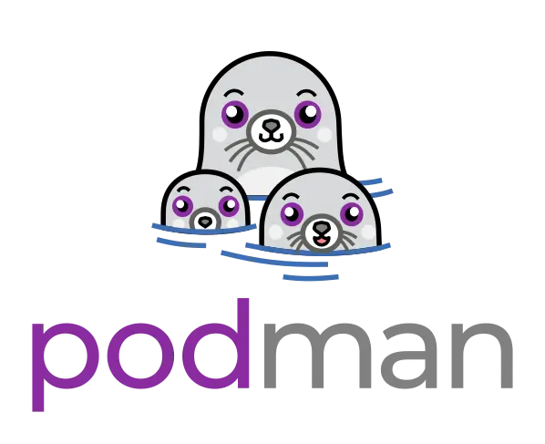
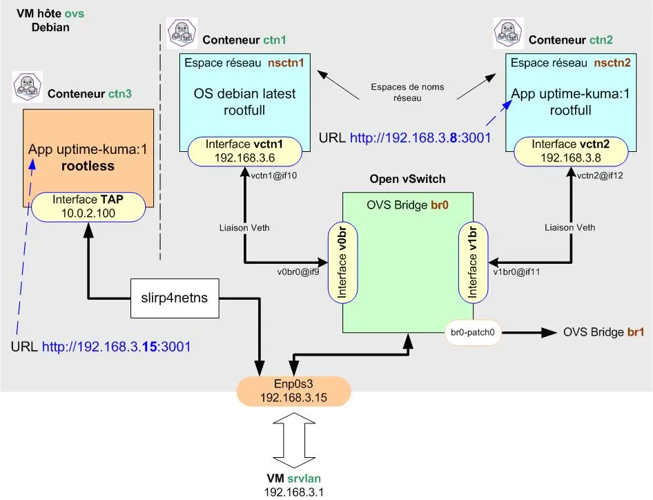
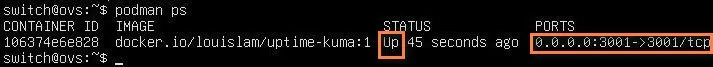
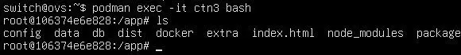
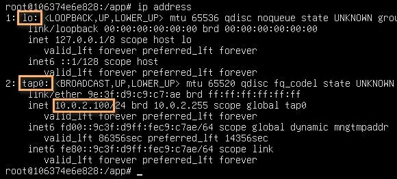
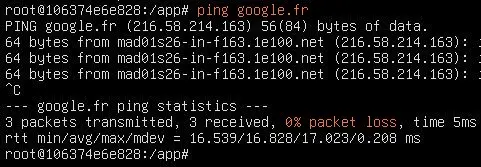
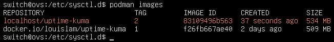
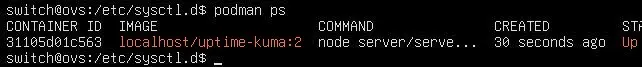

<figure markdown>
  { width="430" }
</figure>

## Mémento 5.2 - Conteneurs LXC

Vouss allez à présent créer un conteneur plus sécurisé dit rootless, celui-ci diminuant le risque de voir l'utilisateur root du conteneur obtenir tous les droits sur l'hôte ovs.

Le conteneur rootless _(non privilégié)_ se veut plus isolé de l'hôte LXC qu'un conteneur rootfull.

### 6 - Conteneur ctn3 en mode rootless

Pour le raccordement réseau d'un conteneur rootless, Podman utilise par défaut le paquet slirp4netns qui fournit une interface réseau virtuelle de type Tun/Tap.

Le conteneur partage alors le même espace de noms réseau que l'hôte, ce qui signifie qu'il partage la même interface réseau, les mêmes tables de routage, etc...

Le conteneur rootless ne disposant pas par défaut d'une adresse IP, c'est le mappage de ports qui est utilisé pour joindre celui-ci.

!!! Nota

    Depuis la version 4.0, il est possible de faire appel à netavark pour configurer le réseau _(non traité ici)_.

Le conteneur ctn3 sera donc raccordé par défaut ainsi :

<figure markdown>
  { width="430" }
  <figcaption>Podman : Raccordement de ctn3 sur l'hôte</figcaption>
</figure>

#### _6.1 - Création du conteneur Podman ctn3_

Les conteneurs rootless sont créés et accessibles sans avoir besoin d'être root ou un utilisateur du groupe sudo.

Ceci est plus sécurisé car l'on ne peut pas devenir root sur l'hôte même si l'on réussit à sortir du conteneur.

Créez et lancez le conteneur ctn3 comme suit :

```bash
podman pull docker.io/louislam/uptime-kuma:1

podman volume create uptime-kuma

podman run -dit --name ctn3 -p 3001:3001 -v uptime-kuma:/app/data uptime-kuma:1
```

Les données persistantes d'Uptime Kuma seront stockées sur le volume créé et resteront disponibles même après une suppression ou une MAJ du conteneur.

Détail des options -dit et -p :  
Le d lance le conteneur en arrière plan.  
Le i autorise le mode interactif avec le conteneur.  
Le t alloue un pseudo terminal au conteneur.  
Le p mappe le port 3001 d'ovs sur le port 3001 de ctn3.

Vérifiez le téléchargement et les créations :

```bash
podman images
podman volume ls
podman ps
```

Retour de la Cde podman ps :

<figure markdown>
  
  <figcaption>Podman : Conteneur ctn3 créé et démarré</figcaption>
</figure>

L'image, le volume et le conteneur se trouvent dans :  
/home/switch/.local/share/containers/storage/*

#### _6.2 - Interaction avec le conteneur_

Connectez-vous sur ctn3 :

```bash
podman exec -it ctn3 bash
```

Un prompt root@ID du conteneur ctn3:/# doit s'afficher :

<figure markdown>
  
  <figcaption>Podman : Arborescence du conteneur ctn3</figcaption>
</figure>

Le retour de la Cde cat /etc/resolv.conf doit montrer l'IP de la box Internet et les Cdes de mise à jour apt update et apt upgrade doivent fonctionner.

Vérifiez depuis le navigateur Firefox de srvlan que l'URL `http://192.168.3.15:3001` affiche bien la page setup de l'application Uptime Kuma.

L'IP de l'URL est celle de l'hôte du conteneur soit ovs.

Ajoutez ensuite le paquet iproute2 au conteneur :

```bash
[root@106374e6e828:/app#] apt install iproute2
```

et observez la configuration réseau par défaut :

```bash
[root@106374e6e828:/app#] ip address
```

<figure markdown>
  
  <figcaption>Podman : Configuration réseau de ctn3</figcaption>
</figure>

Le résultat montre la présence de l'interface TAP _(tap0)_ au sein du conteneur.

Si non installé, ajoutez également le paquet iputils-ping puis autorisez l'usage de la Cde ping depuis ctn3 en modifiant le paramètre suivant au niveau de l'hôte ovs :

```bash
[root@106374e6e828:/app#] exit

sudo sysctl -w "net.ipv4.ping_group_range=0     2000000"
```

Fichier modifié = /proc/sys/net/ipv4/ping_group_range _(valeurs par défaut = 1 0)_.

Reconnectez-vous sur ctn3 et tester la Cde ping :

```bash
podman exec -it ctn3 bash

[root@106374e6e828:/app#] ping google.fr
```

<figure markdown>
  
  <figcaption>Podman : Cde ping fonctionnelle depuis ctn3</figcaption>
</figure>

Pour l'autoriser de façon permanente, procédez ainsi :

```bash
[root@106374e6e828:/app#] exit

sudo nano /etc/sysctl.d/99-allow-ping.conf
```

Entrez la ligne suivante :

```bash
net.ipv4.ping_group_range=0   2000000
```

### 7 - Sauvegarde du conteneur modifié

Sauvegardez les modifications réalisées au niveau du conteneur ctn3 en créant une image locale de l'application Uptime Kuma :

```bash
podman commit ctn3 uptime-kuma:2
```

Vérifiez la création de l'image locale :

```bash
podman images
```

<figure markdown>
  
  <figcaption>Podman : Vue de l'image locale uptime-kuma:2</figcaption>
</figure>

et recréez le conteneur ctn3 à partir de celle-ci :

```bash
podman kill ctn3
podman rm ctn3

podman run -dit --name ctn3 -p 3001:3001 -v uptime-kuma:/app/data uptime-kuma:2
```

Vérifiez le démarrage du conteneur :

```bash
podman ps
```

<figure markdown>
  
  <figcaption>Podman : Conteneur ctn3 issu de l'image locale</figcaption>
</figure>

### 8 - Démarrage automatique du conteneur

Podman fournit une Cde pour générer le service de démarrage automatique d'un conteneur.

Suivez la séquence de Cdes ci-dessous pour ctn3 :

```bash
cd /home/switch

sudo loginctl enable-linger switch
podman generate systemd --new --files --name ctn3
cat container-ctn3.service               # Lecture par curiosité

mkdir -p .config/systemd/user
mv container-ctn3.service .config/systemd/user/container-ctn3.service

podman stop ctn3

systemctl --user daemon-reload
systemctl --user start container-ctn3
systemctl --user status container-ctn3
systemctl --user enable container-ctn3
```

Puis rebootez la VM ovs et contrôlez le résultat :

```bash
podman ps
```

Le conteneur ctn3 doit avoir le statut UP.

### 9 - Tests divers sur le réseau virtuel

Connectez-vous sur le conteneur ctn3 :

```bash
podman exec -it ctn3 bash
```

et testez les pings suivants :

```bash
[root@... :/#] ping lemonde.fr          # Internet
[root@... :/#] ping 192.168.2.1         # VM srvsec
[root@... :/#] ping 192.168.4.2         # VM srvdmz
[root@... :/#] ping 192.168.3.4         # VM debian12-vm2
```

Tous doivent recevoir une réponse positive.

Testez de nouveau depuis srvlan l'URL d'accès à Uptime Kuma soit `http://192.168.3.15:3001`.

Si la page setup s'affiche, alors c'est terminé.

{ align=left }

&nbsp;  
Voilà pour les bases de Podman !  
Le mémento 6.1 vous attend pour  
découvrir l'accès à distance sur  
les VM et les conteneurs.

### Mémento 6.1 en cours de construction
