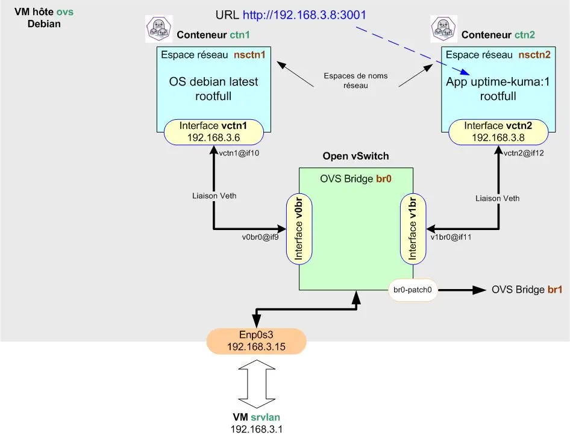

<figure markdown>
  { width="430" }
</figure>

## Mémento 5.2 - Conteneurs LXC

Vous allez à présent créer un conteneur plus sécurisé dit rootless, celui-ci diminuant le risque de voir l'utilisateur root du conteneur obtenir tous les droits sur l'hôte ovs.

Le conteneur rootless _(non privilégié)_ se veut plus isolé de l'hôte LXC qu'un conteneur rootfull.

### 6 - Conteneur ctn3 en mode rootless

Pour le raccordement réseau d'un conteneur rootless, Podman utilise par défaut le paquet slirp4netns qui fournit une interface réseau virtuelle de type Tun/Tap.

Le conteneur partage alors le même espace de noms réseau que l'hôte, ce qui signifie qu'il partage la même interface réseau, les mêmes tables de routage, etc...

Le conteneur rootless ne disposant pas par défaut d'une adresse IP, c'est le mappage de ports qui est utilisé pour joindre celui-ci.

!!! Nota

    Depuis la version 4.0, il est possible de faire appel à netavark pour configurer le réseau _(non traité ici)_.

```bash
[switch@ovs:~$] sudo apt install podman
```


<figure markdown>
  { width="430" }
  <figcaption>Podman : Raccordement des conteneurs sur OVS</figcaption>
</figure>


Si retour OK, la partie 1 est alors terminée.

{ align=left }

&nbsp;  
Voilà, première étape franchie !  
La partie 2 vous attend à présent  
pour la création d'un conteneur  
Podman en mode rootless.

[Partie 2](https://familleleloup.no-ip.org/virtualbox-debian11-lxc-partie-2/)
