## Mémento 2.1 - Serveur srvsec

Comme pour les réseaux précédents, vous allez créer et placer la VM srvsec _(IPFire)_ en entrée du réseau local ou celle-ci servira entre autres de pare-feu.

### 1 - Construction de la VM depuis VirtualBox

L'utilisation de VirtualBox est considérée acquise.

A défaut, référez-vous aux mémentos suivants :  
[VirtualBox - Installation](../virtualbox-installation/)  
[VirtualBox – Mode d’accès réseau par pont](../virtualbox-pont-reseau/)

#### _1.1 - Création et configuration_

Téléchargez l'ISO x86\_64 version 2.x - Core Update y :  
[https://www.ipfire.org/download](https://www.ipfire.org/download)

\- Démarrez ensuite l'application VirtualBox 7.x, puis :  
\- - Menu de VirtualBox > Machine > Nouvelle...  
\-> Nom : IPFire  
\-> Folder : Sélectionnez le dossier de stockage des VM  
\-> ISO Image : Sélectionnez l'ISO téléchargée ci-dessus  
\-> Type : Other  
\-> Version : Other/Unknown (64-bit)  
\-> Bouton Suivant

\-> Mémoire vive : 512 MB  
\-> Processors : 2 CPU si possible  
\-> Bouton Suivant

\-> Create a Virtual Hard Disk Now : Ajustez à 8 Go  
\-> Bouton Suivant

\-> Vérifiez le Récapitulatif  
\-> Bouton Finish

La VM s'affiche dans le panneau gauche de VirtualBox.

\- Sélectionnez maintenant la nouvelle VM, puis :  
\- - Menu de VirtualBox > Machine > Configuration...    
\- - - Onglet Système    
\-> Carte mère > Ordre d'amorçage > Décochez Disquette    
\-> Carte mère > Fonctions avancées > Cochez IO-APIC    
\-> Processeur > Cochez PAE/NX  
  
\- - - Onglet Réseau  
\-> Adapter 1 > Mode d'accès réseau > Accès par pont  
\-> Name > Indiquez la carte réseau active du PC hôte  
\-> Advanced > Notez l'adresse MAC dans un coin

\-> Adapter 2 > Cochez Activer la carte réseau  
\-> Mode d'accès réseau > Réseau interne  
\-> Advanced > Notez l'adresse MAC dans un coin

\-> Adapter 3 > Cochez Activer la carte réseau  
\-> Mode d'accès réseau > Réseau interne  
\-> Advanced > Notez l'adresse MAC dans un coin  
  
\> OK

Les autres paramètres peuvent rester inchangés.

#### _1.2 - Installation de la distribution IPFire_

Conseil pratique avant de démarrer la nouvelle VM :  
Si le curseur de la souris disparaît lors d'un clic dans la fenêtre de la VM, celui-ci peut être récupéré par le PC hôte à l'aide de la touche CTRL située à droite de la barre d'espace du clavier.

\- - Menu de VirtualBox > Machine > Démarrer  
\-> Démarrage normal _(La VM s'exécute)_

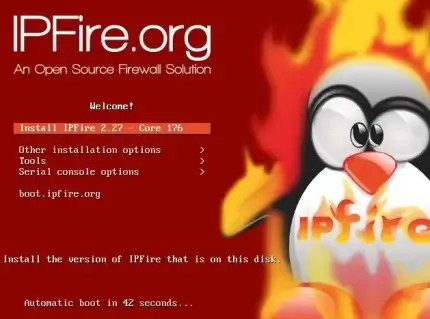

Installation IPFire - Image 1

Validez Install IPFire 2.x - Core y > Touche Entrée

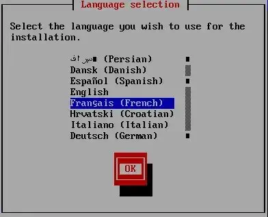

Installation IPFire - Image 2

Sélectionnez le Français > OK

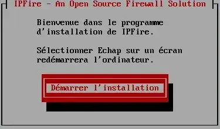

Installation IPFire - Image 3

Validez Démarrer l'installation > Touche Entrée

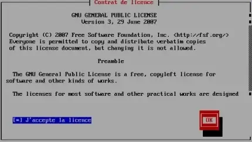

Installation IPFire - Image 4

Cochez J'accepte la licence > OK

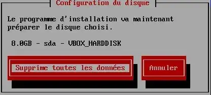

Installation IPFire - Image 5

Validez Supprime toutes les données > Touche Entrée


Installation IPFire - Image 6

Sélectionnez le système de fichier ext4 > OK  
L'installation du système commence ...

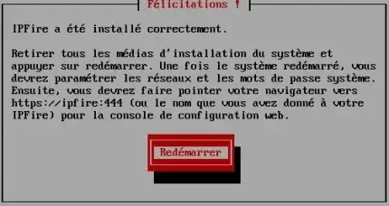

Installation IPFire - Image 7

Validez Redémarrer > Touche Entrée


Installation IPFire - Image 8

Suite au redémarrage, la fenêtre ci-dessus s'affiche.  
Sélectionnez le type de clavier fr > OK

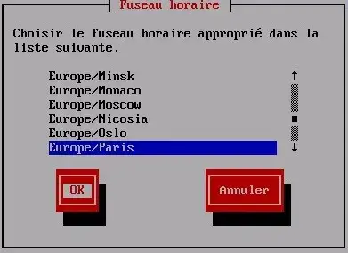

Installation IPFire - Image 9

Sélectionnez le fuseau horaire Europe/Paris > OK


Installation IPFire - Image 10

Entrez le nom d'hôte de la VM soit srvsec > OK


Installation IPFire - Image 11

Entrez le nom de domaine loupipfire.fr > OK  
C'est le nom qui sera exploité plus tard sur le réseau.

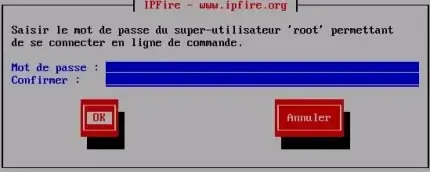

Installation IPFire - Image 12

Entrez le MDP pour root _(2 fois)_ > OK

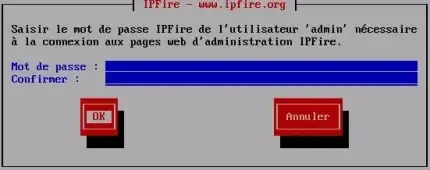

Installation IPFire - Image 13

Entrez celui de l'administrateur Web admin _(2 fois)_ > OK

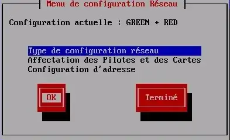

Installation IPFire - Image 14

Sélectionnez Type de configuration réseau > OK


Installation IPFire - Image 15

Choix de GREEN_(lan)_ + RED_(wan)_ + ORANGE_(dmz)_ > OK


Installation IPFire - Image 16

Sélectionnez Affectation des Pilotes et des Cartes > OK

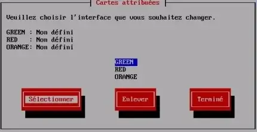

Installation IPFire - Image 17

\-> GREEN soit la carte 3 de VirtualBox > Sélectionner

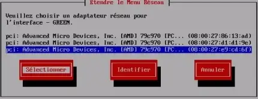

Installation IPFire - Image 18

Accédez à l'adresse MAC de la carte 3 > Sélectionner

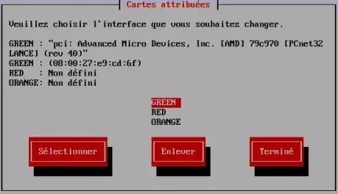

Installation IPFire - Image 19

La carte 3 est bien affectée à la zone GREEN.

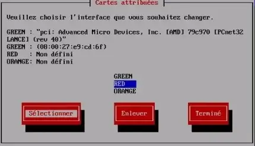

Installation IPFire - Image 20

\-> RED soit la carte 1 de VirtualBox > Sélectionner

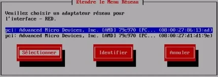

Installation IPFire - Image 21

Accédez à l'adresse MAC de la carte 1 > Sélectionner

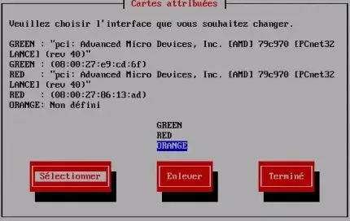

Installation IPFire - Image 22

\-> ORANGE soit la carte 2 de VirtualBox > Sélectionner

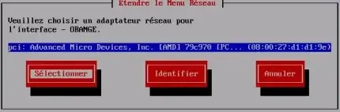

Installation IPFire - Image 23

On ne peut pas se tromper > Sélectionner

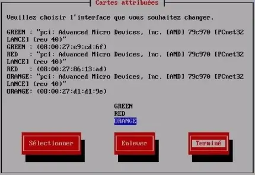

Installation IPFire - Image 24

Les 3 cartes réseaux sont configurées > Terminé

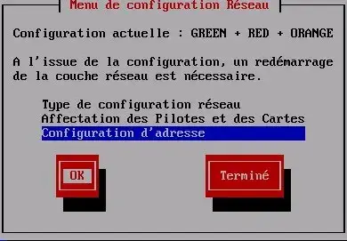

Installation IPFire - Image 25

Sélectionnez Configuration d'adresse \> OK

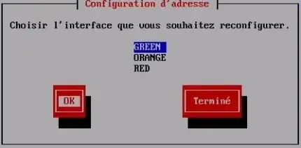

Installation IPFire - Image 26

\-> GREEN soit la carte réseau 3 de VirtualBox > OK

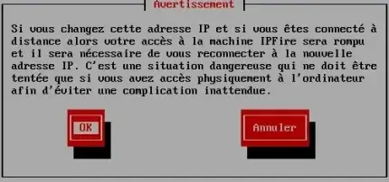

Installation IPFire - Image 27

Petit avertissement > OK


Installation IPFire - Image 28

Entrez l'adresse IP de la carte 3 soit 192.168.2.1 > OK

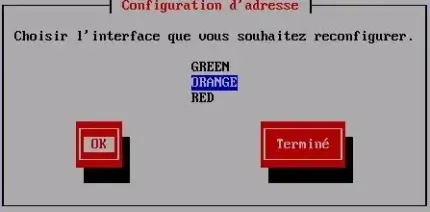

Installation IPFire - Image 29

\-> ORANGE soit la carte réseau 2 de VirtualBox > OK

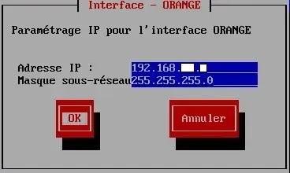

Installation IPFire - Image 30

Entrez l'adresse IP de la carte 2 soit 192.168.4.1 > OK

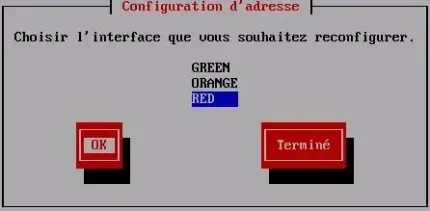

Installation IPFire - Image 31

\-> RED soit la carte réseau 1 de VirtualBox > OK


Installation IPFire - Image 32

\- Statique : Vérifiez que la case est bien cochée  
\- Adresse IP : IP libre du serveur DHCP de votre Box  
\- Gateway : IP de votre Box > OK


Installation IPFire - Image 33

Les 3 cartes ont maintenant une adresse IP > Terminé

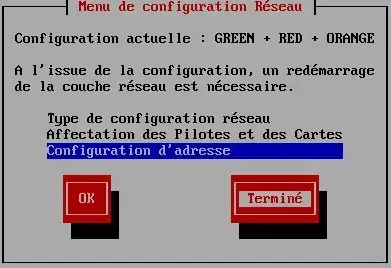

Installation IPFire - Image 34

Quittez la Configuration d'adresse > Terminé

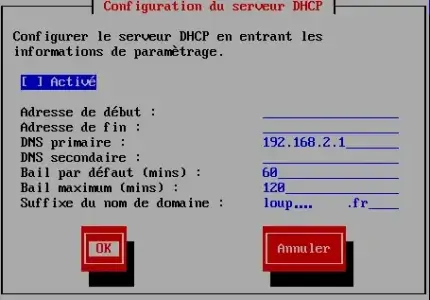

Installation IPFire - Image 35

Cette fenêtre s'affiche, ne pas activer le DHCP > OK

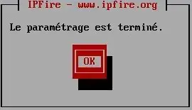

Installation IPFire - Image 36

Et voilà, c'est terminé > OK

IPFire finit son démarrage et affiche le login de srvsec :

[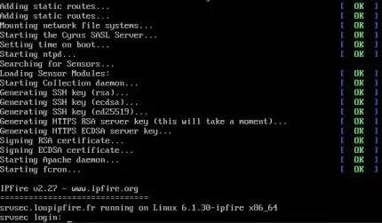](../wp-content/uploads/2023/07/IPFire_39.webp)

IPFire : Premier démarrage

Vous pouvez à présent vous connecter en tant que root.

Notez qu'IPFire peut être reconfiguré avec la Cde setup :

```bash
[root@srvsec:~$\] setup
```
Arrêtez maintenant la VM srvsec :

```bash
[root@srvsec:~$\] poweroff    # ou Cde shutdown -h now
```

Retirez, si nécessaire, l'image ISO du lecteur CD virtuel :  
\- - Menu de VirtualBox > Machine > Configuration…  
\- - - Onglet Stockage  
\-> Zone Unités de stockage > ipfire-...iso  
\-> Zone Attributs > Cliquez sur l'icône CD  
\-> Retirer le disque du lecteur virtuel > OK

Redémarrez et vérifiez que tout se passe bien.

#### _1.3 - Connexion sur l'interface WEB d'IPFire_

Ouvrez le navigateur Web de la VM srvlan et entrez l'adresse https://192.168.2.1:444.

Un message d'alerte de sécurité s'affiche :  
\-> Bouton Avancé...  
\-> Bouton Accepter le risque et poursuivre
  
Une fenêtre de connexion s'ouvre :  
\-> Nom d'utilisateur > Entrez admin  
\-> Mot de passe > Entrez votre MDP créé en Image 13  
\-> Bouton Connexion

La page d'accueil d'IPFire doit s'afficher :

[](../wp-content/uploads/2023/07/IPFire_accueil_web.webp)

IPFire : Page d'accueil Web

#### _1.4 - Route statique vers le réseau 192.168.3.0_

Vérifiez depuis srvsec qu'un ping sur l'IP 192.168.3.1 de srvlan ne fonctionne pas actuellement.

Pour corriger cela, revenez sur srvlan :  
\> Page d'accueil IPFire > Réseau > Routes statiques

Remplissez les champs comme montré ci-dessous et cliquez ensuite sur Ajouter :

[](/wp-content/uploads/2018/03/Ipfire_ajout_route_statique.png)

IPFire : Ajout d'une route statique vers 192.168.3.0

Le ping doit maintenant recevoir une réponse positive.


  
Voilà !  
IPFire est en place. Le mémento  
3.11 vous attend pour la création  
du dernier serveur soit srvdmz.

[Mémento 3.11](/notes-du-loup/wp-reseau-virtuel/articles/serveur-debian11-srvdmz-creation/)
